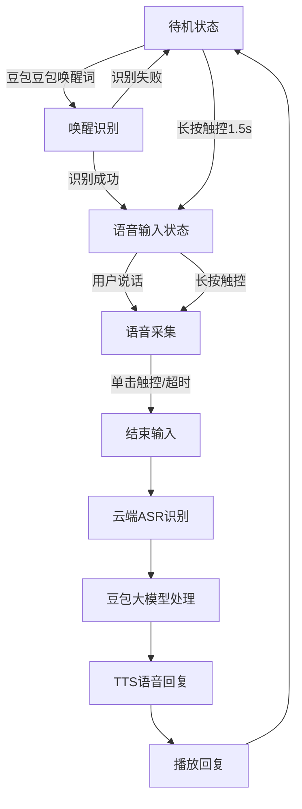
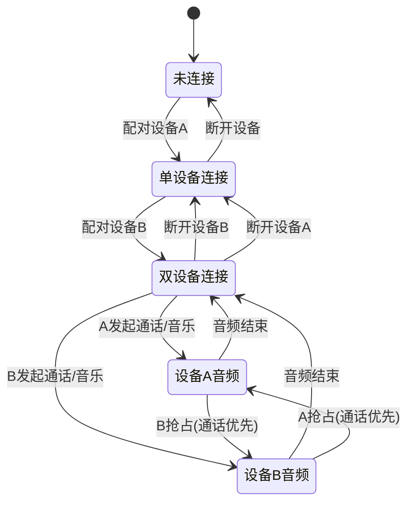
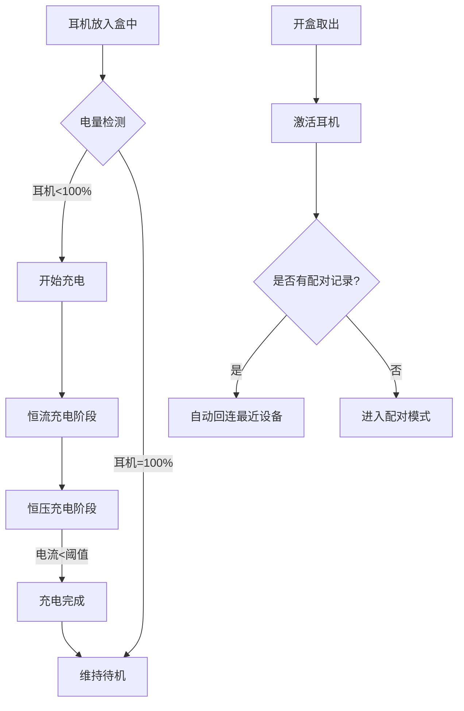
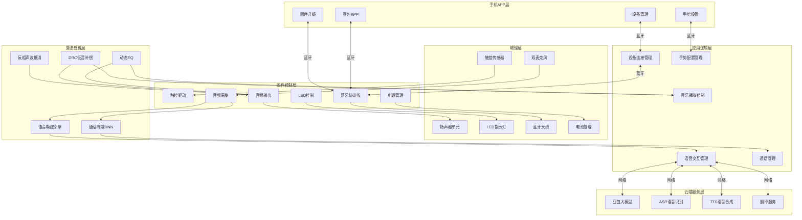
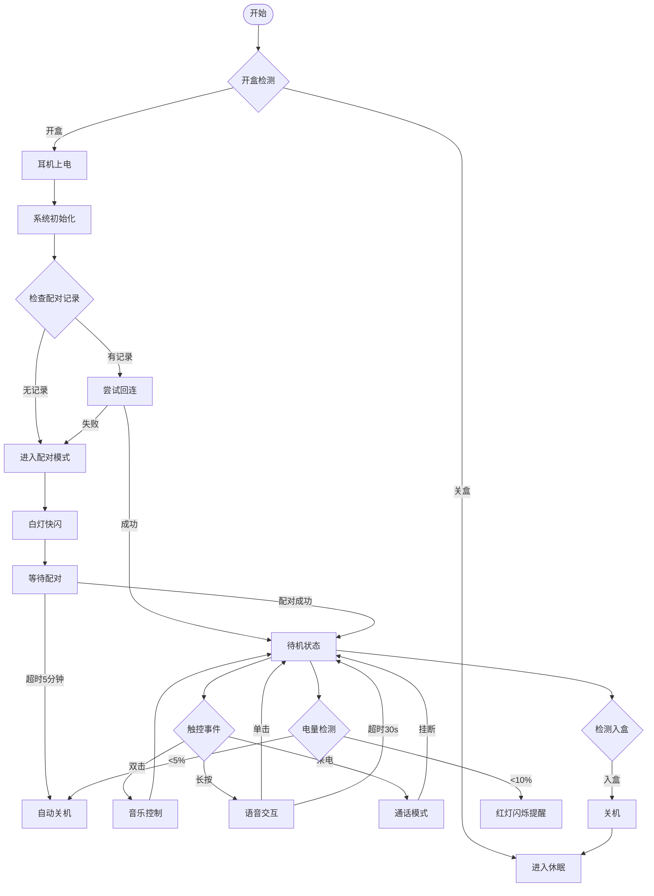
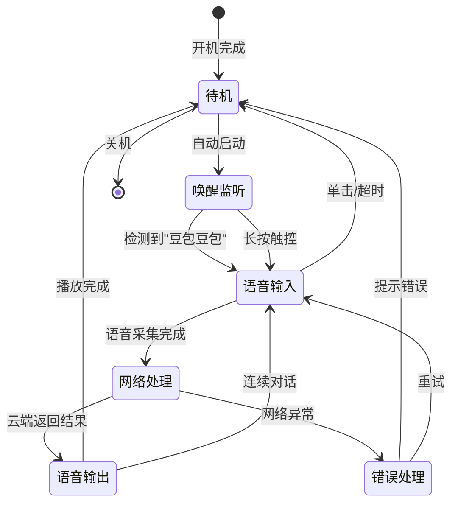

# Ola Friend 智能耳机产品需求文档 (PRD)

**文档版本**: v1.0  
**产品名称**: Ola Friend AI智能体耳机  
**发布日期**: 2025年10月  
**文档状态**: 正式发布  

---

## 目录

1. [产品定位与目标](#i-产品定位与目标)
2. [功能需求详细定义](#ii-功能需求详细定义)
3. [非功能性需求](#iii-非功能性需求)
4. [系统架构与交互逻辑](#iv-系统架构与交互逻辑)
5. [认证与合规要求](#v-认证与合规要求)

---

## I. 产品定位与目标

### 1.1 市场画像

**[事实]** Ola Friend是字节跳动旗下豆包推出的首款AI智能体耳机，于2024年10月10日正式发布，官方售价1199元人民币。

**目标用户画像**:
- **AI技术爱好者**: 追求最新AI交互体验，愿意尝试新技术
- **语言学习需求者**: 有英语学习需求，特别是口语练习需求
- **运动健身爱好者**: 需要舒适佩戴、防水防汗的运动耳机
- **字节系产品用户**: 经常使用抖音、汽水音乐等字节系产品
- **商务人士**: 需要实时翻译、语音记录等商务功能

**对标竞品**:
| 竞品 | 售价 | 核心差异 |
|------|------|----------|
| 韶音 OpenFit | 约1298元 | 骨传导技术，无AI功能 |
| 华为 FreeClip | 约999元 | 智能佩戴检测，无AI功能 |
| 小米开放式耳机 Pro | 999元 | 小爱同学，小米生态联动 |

### 1.2 核心卖点 (USP)

**P0 功能 (必须具备)**:
1. **[事实]** 豆包AI大模型语音交互 - "豆包豆包"语音唤醒
2. **[事实]** 6.6g超轻开放式佩戴 - SGS舒适度金标认证
3. **[事实]** 中英日韩四语实时翻译
4. **[事实]** 8+28小时续航系统

**P1 功能 (重要增值)**:
1. **[事实]** 英语陪练智能体Owen
2. **[事实]** 双设备同时连接
3. **[事实]** 蓝牙5.4 + 苹果MFI认证
4. **[事实]** 5核AI音频数字处理器

**P2 功能 (体验优化)**:
1. **[事实]** 旅行导游功能
2. **[事实]** 音乐DJ功能
3. **[事实]** 情绪加油站
4. **[事实]** 反相声波抵消技术

---

## II. 功能需求详细定义

### 2.1 硬件交互逻辑

#### 2.1.1 触控操作定义

**[事实]** 耳机本体的logo区域为触控操作区域，采用全域智能触控，替代传统入耳检测。

| 操作类型 | 左耳功能 | 右耳功能 | 可自定义 |
|----------|----------|----------|----------|
| **单击** | 终止语音对话 | 终止语音对话 | 否 |
| **双击** | 播放/暂停音乐<br>接听/挂断电话 | 播放/暂停音乐<br>接听/挂断电话 | 是 |
| **长按(1.5s)** | 开启单轮语音对话 | 开启单轮语音对话 | 否 |
| **三击** | 切歌(下一首) | 切歌(上一首) | 是 |
| **滑动** | 音量调节 | 音量调节 | 是 |

**[关联]** 触控区域朝外做了一点倾斜，弧度更加方便日常点按操作。

#### 2.1.2 充电盒交互逻辑

**[事实]** 提供两种充电盒设计：

**小钱包款**:
- 双向开合设计，单手操作
- 磁吸固定耳机，L/R标识区分
- 内壁绒毛材质防划伤

**鹅卵石款**:
- 圆润造型，翻盖式开合
- 同样磁吸固定设计

**充电盒状态指示**:
| 指示灯状态 | 含义 |
|------------|------|
| 绿灯常亮 | 电量充足(>60%) |
| 黄灯常亮 | 电量中等(20%-60%) |
| 红灯常亮 | 电量低(<20%) |
| 红灯闪烁 | 充电中 |
| 绿灯闪烁 | 配对模式 |

#### 2.1.3 耳机状态指示灯

**[推理]** 基于行业惯例和蓝牙设备标准：

| 灯语 | 含义 |
|------|------|
| 白灯快闪 | 配对模式 |
| 白灯慢闪 | 蓝牙连接中 |
| 白灯常亮1s | 连接成功 |
| 绿灯常亮1s | 开机 |
| 红灯常亮1s | 关机/低电量警告 |
| 橙灯闪烁 | 充电中 |
| 绿灯常亮 | 充电完成 |

### 2.2 软件业务流

#### 2.2.1 语音交互流程



#### 2.2.2 双设备连接逻辑

**[事实]** 能同时连接任意双设备（如手机、平板电脑、笔记本电脑等）。

**[推理]** 基于蓝牙5.4多点连接规范：



**音频优先级规则**:
1. 通话 > 音乐播放
2. 后发起的通话可抢占先存在的音乐
3. 双设备同时来电时，先响铃的设备优先

#### 2.2.3 充电与电源管理流程



### 2.3 核心算法逻辑

#### 2.3.1 语音唤醒算法

**[事实]** 支持"豆包豆包"语音唤醒。

**[推理]** 基于边缘AI语音唤醒的行业标准：

| 参数 | 要求 |
|------|------|
| 唤醒词 | "豆包豆包" |
| 唤醒率 | ≥95% (安静环境) |
| 误唤醒率 | ≤1次/24小时 |
| 响应延迟 | ≤500ms |
| 支持距离 | ≤1米 |
| 运行功耗 | ≤5mW |

**唤醒流程**:
1. 麦克风持续采集环境音频
2. 本地唤醒词检测模型运行
3. 检测到唤醒词后，发送中断信号给主控
4. 主控唤醒并建立与手机的通信链路
5. 进入语音交互模式

#### 2.3.2 通话降噪算法

**[事实]** 采用双麦克风智能降噪算法和噪声自适应技术，单边双麦克风波束智能成形，结合AI多通道深度神经网络通话降噪算法。

**[推理]** 双麦降噪系统架构：

```
┌─────────────────────────────────────────────────────────┐
│                    通话降噪系统                          │
├─────────────────────────────────────────────────────────┤
│  主麦克风(近端) ──┐                                     │
│                   ├──→ 波束成形 ──→ AI降噪DNN ──→ 输出  │
│  副麦克风(远端) ──┘                                     │
├─────────────────────────────────────────────────────────┤
│  功能模块:                                              │
│  1. 波束成形: 定向拾音，抑制非目标方向噪声              │
│  2. 噪声自适应: 根据环境噪声动态调整滤波参数            │
│  3. AI DNN: 深度学习降噪，分离人声与背景噪声            │
│  4. 风噪抑制: 特殊算法处理风噪场景                      │
└─────────────────────────────────────────────────────────┘
```

**性能指标**:
| 指标 | 目标值 |
|------|--------|
| 降噪深度 | ≥20dB |
| 语音清晰度提升 | ≥15dB |
| 风噪抑制 | 支持8级风速 |
| 延迟 | ≤20ms |

#### 2.3.3 音频处理算法

**[事实]** 搭载5核专业音频芯片数字处理器，支持动态EQ和动态低音补偿技术(DRC)。

**[推理]** 音频处理链路：

```
输入音频 ──→ 解码(SBC/AAC) ──→ 动态EQ ──→ DRC低音补偿 ──→ 反相声波抵消 ──→ 功放 ──→ 扬声器
                ↑                    ↑           ↑
                │                    │           │
            格式检测            频谱分析      漏音检测
```

**动态EQ逻辑**:
- 实时分析音频频谱特性
- 根据音乐类型自动调整EQ曲线
- 支持流行、古典、摇滚、人声等预设模式

**DRC低音补偿**:
- 检测低频信号强度
- 动态提升低频响应
- 补偿开放式耳机低频损失

**反相声波抵消**:
- 检测耳机漏音
- 生成反相声波抵消漏音
- 在70%音量下有效保护隐私

---

## III. 非功能性需求

### 3.1 环境适应性

**[事实]** IP54防护等级，具备防尘防水能力。

**[关联]** 基于IP54标准推导环境要求：

| 环境参数 | 要求 |
|----------|------|
| 工作温度 | 0°C ~ 45°C **[推理]** |
| 存储温度 | -20°C ~ 60°C **[推理]** |
| 相对湿度 | 5% ~ 95% (无凝结) **[推理]** |
| 防尘等级 | 防止有害粉尘堆积 **[事实]** |
| 防水等级 | 防止各方向溅水 **[事实]** |
| 海拔高度 | ≤3000m **[推理]** |

**[推理]** 特殊场景限制：
- 不支持游泳或淋浴使用
- 避免泡水或掉入水中
- 运动跑步遇下雨天可正常使用

### 3.2 整机功耗预算

**[事实]** 关键电源参数：
- 耳机电池容量: 59mAh
- 充电盒电池容量: 500mAh (1.925Wh)
- 单次续航: 8小时连续播放
- 总续航: 28小时(配合充电盒)
- 待机时间: 1年(在充电盒内)

**[推理]** 功耗计算：

| 工作模式 | 功耗预算 | 计算依据 |
|----------|----------|----------|
| 音乐播放 | ≤7.4mA | 59mAh/8h |
| 通话 | ≤10mA | 考虑双麦降噪功耗 **[推理]** |
| AI语音交互 | ≤15mA | 考虑持续网络连接 **[推理]** |
| 待机(盒外) | ≤0.5mA | 蓝牙广播+监听 **[推理]** |
| 待机(盒内) | ≤6.7μA | 59mAh/(365×24)h **[推理]** |
| 充电电流 | ≤200mA | 标准锂电池充电速率 **[推理]** |

**能量锁技术**:
**[事实]** 给电池配了能量充放管理系统，大幅降低功耗，优化电池寿命。

**[推理]** 能量锁逻辑：
- 检测充电盒开合状态
- 盒内自动切断非必要电路供电
- 仅保留充电管理和唤醒电路
- 盒外自动恢复全功能

### 3.3 蓝牙连接性能

**[事实]** 支持蓝牙5.4，工作距离小于10米(无障碍物遮挡)。

**[推理]** 蓝牙性能要求：

| 参数 | 要求 |
|------|------|
| 蓝牙版本 | 5.4 **[事实]** |
| 协议支持 | Classic + BLE **[推理]** |
| 有效距离 | ≥10米(空旷环境) **[事实]** |
| 隔墙距离 | ≥5米(一堵墙) **[推理]** |
| 连接建立时间 | ≤3秒 **[推理]** |
| 重连时间 | ≤1秒 **[推理]** |
| 音频编码 | SBC, AAC **[事实]** |
| 不支持编码 | LDAC, aptX **[事实]** |

**双设备连接要求**:
- 支持同时连接2台设备 **[事实]**
- 设备间切换延迟 ≤500ms **[推理]**
- 支持iOS + Android组合 **[推理]**

### 3.4 音频性能指标

**[事实]** 音频硬件规格：
- 10mm动圈单元
- 5核AI音频数字处理器
- 动态EQ1.0技术
- 动态低音补偿DRC

**[推理]** 音频性能要求：

| 参数 | 要求 |
|------|------|
| 频响范围 | 20Hz ~ 20kHz **[推理]** |
| 最大声压级 | ≤100dB **[推理]** |
| 总谐波失真 | ≤1% (1kHz, 50%音量) **[推理]** |
| 信噪比 | ≥80dB **[推理]** |
| 左右声道平衡 | ≤1dB **[推理]** |

### 3.5 充电性能

**[事实]** 充电参数：
- 完整充电时间: 约1.5小时
- 快充: 15分钟可使用2小时
- 耳机电池: 59mAh软包电池
- 充电盒电池: 500mAh

**[推理]** 充电性能要求：

| 参数 | 要求 |
|------|------|
| 充电接口 | Type-C **[事实]** |
| 输入电压 | 5V **[推理]** |
| 耳机充电电流 | ≤200mA **[推理]** |
| 充电盒充电电流 | ≤500mA **[推理]** |
| 充电效率 | ≥80% **[推理]** |
| 过充保护 | 支持 **[推理]** |
| 过放保护 | 支持 **[推理]** |
| 温度保护 | 支持(0°C~45°C) **[推理]** |

---

## IV. 系统架构与交互逻辑

### 4.1 功能模块架构



### 4.2 开机/关机逻辑流程



### 4.3 语音交互状态机



### 4.4 异常处理机制

**[推理]** 基于智能硬件产品通用设计规范：

| 异常场景 | 处理逻辑 |
|----------|----------|
| 蓝牙断连 | 自动重连3次，失败后进入配对模式 |
| 网络异常 | 提示"网络不太顺畅"，支持离线基础功能 |
| 电量过低(<5%) | 语音提示"电量不足"，自动关机 |
| 充电异常 | 停止充电，红灯快闪提示 |
| 温度过高 | 暂停充电/降低音量，语音提示 |
| 麦克风堵塞 | 提示清洁麦克风 |
| 固件升级失败 | 自动回滚，提示重试 |

---

## V. 认证与合规要求

### 5.1 强制性认证

**[事实]** 已确认或需获得的认证：

| 认证类型 | 状态 | 说明 |
|----------|------|------|
| 中国3C认证 | 已获得(推测) | 强制性，必需 **[推理]** |
| 蓝牙SIG认证 | 已获得 | 确保蓝牙兼容性 **[事实]** |
| IP54防水认证 | 已获得 | 防护等级认证 **[事实]** |
| 苹果MFI认证 | 已获得 | 确保iOS兼容性 **[事实]** |
| SGS舒适度认证 | 已获得 | 佩戴舒适度 **[事实]** |

### 5.2 出口市场认证

**[推理]** 基于全球化产品定位：

| 市场 | 认证 | 状态 |
|------|------|------|
| 欧盟 | CE认证(EMC/LVD/RED) | 待确认 |
| 欧盟 | RoHS认证 | 待确认 |
| 欧盟 | REACH认证 | 待确认 |
| 美国 | FCC Part 15 | 待确认 |
| 日本 | TELEC认证 | 待确认 |
| 日本 | PSE认证 | 待确认 |
| 韩国 | KC认证 | 待确认 |

### 5.3 合规性要求

**[推理]** 基于电子产品通用法规：

| 要求类别 | 具体规范 |
|----------|----------|
| 电池安全 | UN38.3测试，符合航空运输要求 |
| 材料安全 | 符合RoHS 2.0，限制10种有害物质 |
| 电磁兼容 | 符合EN 301 489标准 |
| 射频安全 | SAR值符合国家标准 |
| 隐私保护 | 语音数据加密传输，符合GDPR要求 |

---

## 附录

### A. 物理/视觉占位符

**[物理交互示意图说明]**

面向生图模型描述：
```
A high-tech industrial design sketch of Ola Friend AI earbuds, 
showing the internal component placement including 10mm driver unit, 
dual microphones, touch sensor area, battery layout, and PCB placement. 
Side view cross-section showing 27.5 degree angle design, 
0.7mm titanium wire ear hook structure. Blueprint style, 
detailed annotations with dimensions, 4k, clean lines, 
professional product design rendering.
```

### B. 术语表

| 术语 | 说明 |
|------|------|
| OWS | Open Wearable Stereo，开放式可穿戴立体声 |
| DRC | Dynamic Range Compression，动态范围压缩 |
| EQ | Equalizer，均衡器 |
| ANC | Active Noise Cancellation，主动降噪 |
| ENC | Environmental Noise Cancellation，环境降噪 |
| TWS | True Wireless Stereo，真无线立体声 |
| MFI | Made for iPhone，苹果认证计划 |
| ASR | Automatic Speech Recognition，自动语音识别 |
| TTS | Text to Speech，文本转语音 |

### C. 参考文档

1. Ola Friend官方产品页面: https://www.olafriend.com/product
2. 52audio拆解报告
3. 蓝牙5.4核心规范
4. IP防护等级标准(GB/T 4208-2017)

---

**文档维护记录**

| 版本 | 日期 | 修改内容 | 作者 |
|------|------|----------|------|
| v1.0 | 2025-10 | 初始版本 | PRD自动生成 |

---

*本文档基于Ola Friend智能耳机调研报告生成，包含[事实]、[关联]和[推理]三类信息，请在设计开发过程中以实际测试结果为准。*
