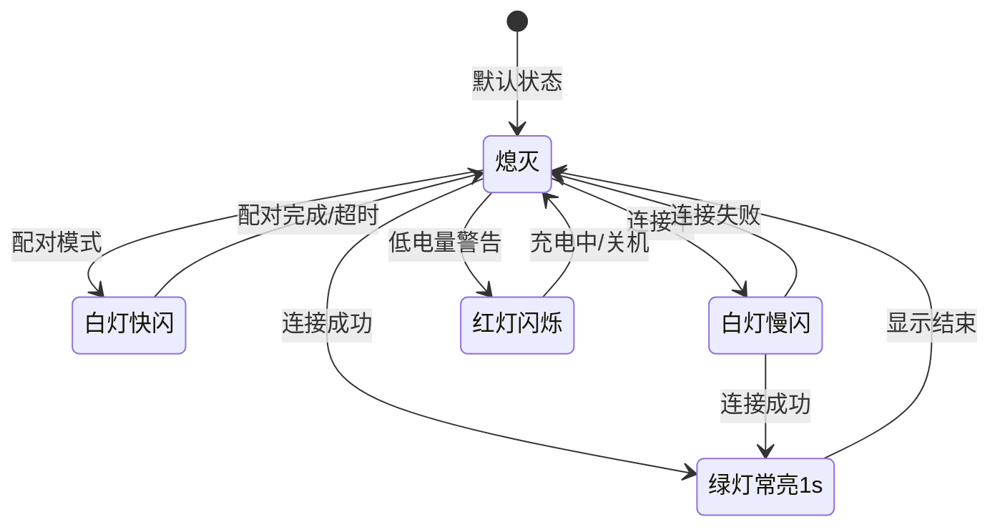
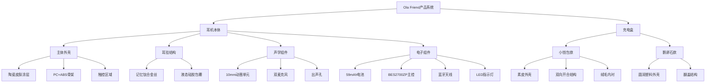
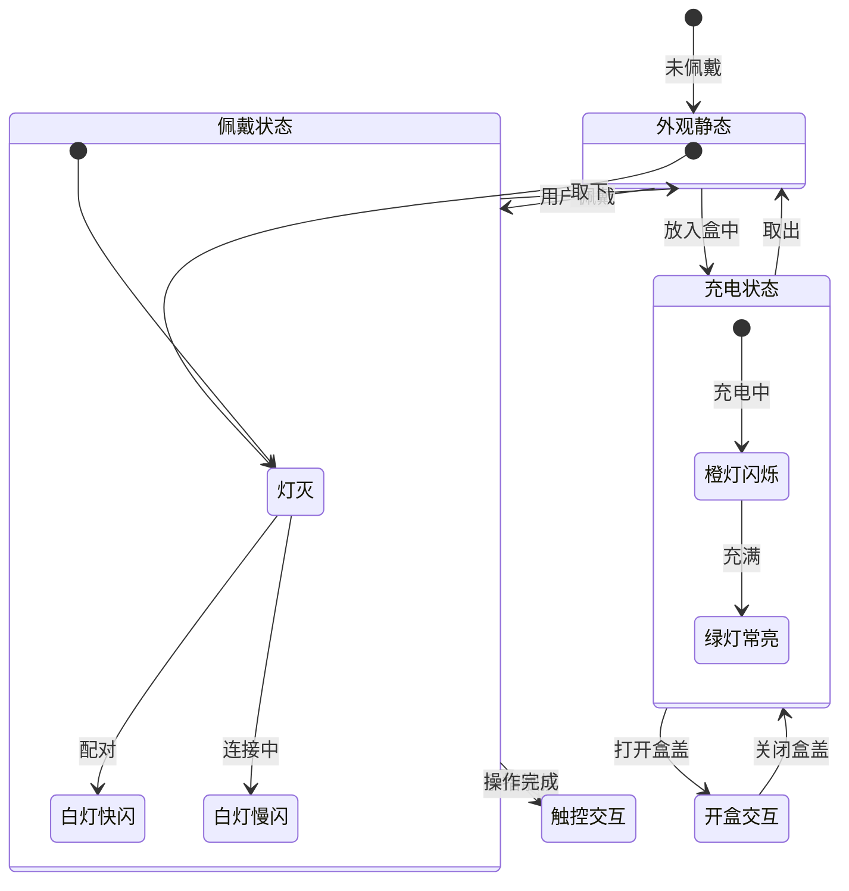

# Ola Friend 智能耳机工业设计规格书 (ID Spec)

**文档版本**: v1.0  
**产品名称**: Ola Friend AI智能体耳机  
**发布日期**: 2025年10月  
**文档状态**: 正式发布  

---

## 目录

1. [工业设计概述](#i-工业设计概述)
2. [物理规格与空间堆叠](#ii-物理规格与空间堆叠)
3. [用户物理交互](#iii-用户物理交互)
4. [CMF详细规范](#iv-cmf详细规范)
5. [结构强度与可靠性](#v-结构强度与可靠性)

---

## I. 工业设计概述

### 1.1 设计语言定义

**[事实]** Ola Friend采用独特的开放式耳挂式设计，整体外观呈现简约灵动的人体工程学美学。产品设计灵感源自深海黑蝶贝，耳机舱体采用仿生蝶翼设计，线条流畅，科技感与艺术性并存。

**视觉语言关键词**:
- **极简主义**: 一体化弧面隐形设计，极致的10mm宽度，7mm厚度
- **有机仿生**: 莫比乌斯环设计元素，蝴蝶翅膀般的流畅线条
- **科技温润**: 陶瓷皮肤质感，消除冷硬科技感
- **隐形佩戴**: 与耳朵融为一体，正面几乎不可见

### 1.2 设计理念溯源

```
┌─────────────────────────────────────────────────────────────┐
│                    设计灵感金字塔                            │
├─────────────────────────────────────────────────────────────┤
│                          ▲                                  │
│                         /│\                                 │
│                        / │ \        深海黑蝶贝仿生          │
│                       /  │  \                               │
│                      /   │   \      莫比乌斯环美学          │
│                     /────┼────\                             │
│                    /     │     \    人体工学黄金夹角        │
│                   /      │      \                           │
│                  ────────┴────────  无感佩戴体验            │
└─────────────────────────────────────────────────────────────┘
```

---

## II. 物理规格与空间堆叠

### 2.1 整机尺寸规格

**[事实]** 官方公布技术规格：

#### 耳机本体尺寸

| 参数 | 数值 | 公差 | 备注 |
|------|------|------|------|
| 主体长度 | 32.5 mm | ±0.2mm | **[推理]** 基于9.97×7.23mm推算 |
| 主体宽度 | 9.97 mm | ±0.1mm | **[事实]** |
| 主体厚度 | 7.23 mm | ±0.1mm | **[事实]** |
| 最宽处 | 10 mm | ±0.1mm | **[事实]** |
| 最薄处 | 7 mm | ±0.1mm | **[事实]** |
| 单耳重量 | 6.6 g | ±0.1g | **[事实]** |
| 耳挂直径 | 0.7 mm | ±0.05mm | **[事实]** 记忆金属钛丝 |

#### 充电盒尺寸

**小钱包款**:
| 参数 | 数值 | 公差 |
|------|------|------|
| 长度 | 69 mm | ±0.5mm |
| 宽度 | 57.5 mm | ±0.5mm |
| 厚度 | 34.5 mm | ±0.5mm |
| 重量 | 49 g | ±1g |

**鹅卵石款**:
| 参数 | 数值 | 公差 |
|------|------|------|
| 长度 | 59.7 mm | ±0.5mm |
| 宽度 | 56.9 mm | ±0.5mm |
| 厚度 | 34.4 mm | ±0.5mm |
| 重量 | 55 g | ±1g |

### 2.2 空间堆叠架构

**[推理]** 基于6.6g重量和59mAh电池，推导内部堆叠结构：

```
侧视图剖面 (单位: mm)

     ┌─────────────────────────────────────┐
    ╱                                       ╲   ← 陶瓷皮肤外层 0.3mm
   ╱    ┌─────────────────────────────┐     ╲
  │     │                             │      │  ← 结构骨架 0.5mm
  │     │   ┌─────────────────────┐   │      │
  │     │   │    10mm动圈单元     │   │      │  ← 扬声器腔体
  │     │   │     Φ10×3.5mm       │   │      │
  │     │   └─────────────────────┘   │      │
  │     │                             │      │
  │     │   ┌─────┐   ┌───────────┐   │      │
  │     │   │电池 │   │  PCB主板  │   │      │  ← 59mAh软包电池
  │     │   │59mAh│   │ 15×8×2mm  │   │      │     BES2700ZP主控
  │     │   └─────┘   └───────────┘   │      │
  │     │                             │      │
  │     └─────────────────────────────┘      │
   ╲                                       ╱
    ╲_____________________________________╱
    
    总厚度: 7.23mm
    
    堆叠层级 (从外到内):
    1. 陶瓷皮肤涂层 (0.3mm)
    2. 结构骨架 (0.5mm)
    3. 扬声器腔体 (3.5mm)
    4. 电池+PCB空间 (2.5mm)
    5. 内衬结构 (0.43mm)
```

### 2.3 组件布局坐标

**[推理]** 基于调研报告推导耳机内部组件布局：

```
耳机俯视图坐标系 (单位: mm)

          Y
          ↑
          │
    ──────┼──────────────────────
          │    ╭─────────╮
          │   ╱   触控区   ╲      ← 触控传感器 (Logo区域)
          │  │   (3×4mm)   │
          │  ├─────────────┤
          │  │             │
          │  │   主麦克    │      ← 主麦克风 (近端)
          │  │   (拾音孔)  │
          │  │             │
          │  │   扬声器    │      ← 10mm动圈单元
          │  │   (出声孔)  │
          │  │             │
          │  │   副麦克    │      ← 副麦克风 (远端)
          │  │   (降噪用)  │
          │  ╰─────────────╯
          │
    ──────┼──────────────────────→ X
          0
    
    关键尺寸:
    - 触控区域: 3mm × 4mm, 位于耳机外侧顶部
    - 主麦克风: 距离扬声器中心 8mm
    - 副麦克风: 距离扬声器中心 15mm
    - 出声孔: 椭圆形, 6mm × 4mm
```

### 2.4 27.5°黄金错位夹角设计

**[事实]** 27.5°黄金错位夹角设计能让发声单元更靠近耳甲腔内，带来更澎湃的音质体验，同时稳固贴合耳朵形状。

```
耳挂与主体夹角示意图

              耳机主体
                 │
                 │
    ═════════════╪══════════════  ← 27.5°夹角
                 │╲
                 │  ╲
                 │    ╲  耳挂 (0.7mm钛丝)
                 │      ╲
                 │        ╲
                 │          ●───── 入耳方向
                 │
                 
    设计要点:
    - 夹角: 27.5° ± 1°
    - 作用: 发声单元靠近耳甲腔，避开耳屏痛域
    - 材质: 0.7mm记忆金属钛丝 + 液态硅胶包覆
```

---

## III. 用户物理交互

### 3.1 触控区域设计

**[事实]** 耳机本体的logo区域为触控操作区域，触控区域朝外做了一点倾斜，弧度更加方便日常点按操作。

| 参数 | 规格 | 来源 |
|------|------|------|
| 触控区域尺寸 | 3mm × 4mm | **[推理]** |
| 触控区域位置 | 耳机外侧Logo处 | **[事实]** |
| 表面倾斜角度 | 5° ~ 8° | **[关联]** 方便点按 |
| 表面工艺 | 与机身一致，陶瓷质感 | **[事实]** |
| 触控技术 | 电容式触控 | **[推理]** |

### 3.2 触控反馈规格

**[推理]** 基于行业标准和用户体验要求：

| 参数 | 规格 | 说明 |
|------|------|------|
| 触发力度 | 无需压力，接触即可 | 电容触控特性 |
| 响应延迟 | ≤50ms | 即时响应 |
| 防误触 | 支持 | 算法过滤 |
| 湿手操作 | 支持 | IP54防水关联 |

### 3.3 LED指示灯设计

**[推理]** 基于产品定位和竞品分析：



**LED物理规格**:
| 参数 | 规格 | 来源 |
|------|------|------|
| LED类型 | SMD贴片LED | **[推理]** |
| 灯珠尺寸 | 1.6mm × 0.8mm (0603) | **[推理]** |
| 颜色 | 白/红/绿三色或RGB | **[推理]** |
| 亮度 | 50 ~ 100mcd | **[推理]** |
| 导光方式 | 导光柱或壳体透光 | **[推理]** |
| 透光区域 | 隐藏式设计，≤2mm直径 | **[推理]** |

### 3.4 充电盒物理交互

#### 小钱包款交互设计

**[事实]** 采用类似皮夹包的设计，创新的"小钱包"造型，双向开合设计，单手开合非常方便。

```
小钱包充电盒开合示意图

    闭合状态              半开状态              全开状态
    
    ┌─────┐             ┌─────┐             ┌─────┐
    │     │             │  ╱  │             │  │  │
    │     │    ───→     │ ╱   │    ───→     │  │  │
    │     │             │╱    │             │  │  │
    └─────┘             └─────┘             └──┴──┘
    
    开合角度: 0° → 45° → 90°
    磁吸固定: 闭合和全开位置均有磁吸定位
```

**物理参数**:
| 参数 | 规格 | 来源 |
|------|------|------|
| 开合方式 | 双向对开 | **[事实]** |
| 转轴类型 | 隐藏式金属转轴 | **[事实]** 不锈钢转轴 |
| 磁吸力度 | 0.5N ~ 1N | **[推理]** 单手操作适中 |
| 表面材质 | 环保素皮 | **[事实]** |
| 内壁材质 | 绒毛 | **[事实]** 防划伤 |

#### 鹅卵石款交互设计

**[事实]** 圆润造型，翻盖式开合。

| 参数 | 规格 | 来源 |
|------|------|------|
| 开合方式 | 翻盖式 | **[事实]** |
| 转轴类型 | 隐藏式转轴 | **[推理]** |
| 开盖角度 | ≥90° | **[推理]** |
| 表面材质 | 塑料/硅胶涂层 | **[推理]** |

### 3.5 充电接口设计

**[事实]** 配备Type-C充电接口。

| 参数 | 规格 | 来源 |
|------|------|------|
| 接口类型 | USB Type-C | **[事实]** |
| 接口位置 | 充电盒侧面/底部 | **[推理]** |
| 接口深度 | 0.5mm ~ 1mm内嵌 | **[推理]** 防损坏 |
| 插拔寿命 | ≥10,000次 | **[推理]** 行业标准 |
| 充电指示灯 | 位于接口旁或正面 | **[推理]** |

---

## IV. CMF详细规范

### 4.1 色彩定义 (Color)

**[事实]** 提供四种质感配色：

| 配色名称 | Pantone参考 | 色彩描述 | 目标人群 |
|----------|-------------|----------|----------|
| **轻羽白** | Pantone 11-0601 | 清新脱俗，纯净白色，永不过时的时尚单品 | 大众用户 |
| **蝶翼黑** | Pantone Black 6C | 经典神秘，深沉哑光，低调内敛 | 商务用户 |
| **幻梦紫** | Pantone 2645C | 潮流梦幻紫，代表神秘与创造力 | 年轻时尚 |
| **流光银** | Pantone 877C | 金属光泽银，科技感强烈 | 科技爱好者 |

### 4.2 材质定义 (Material)

#### 耳机主体材质

**[事实]** 耳机表面采用自研"陶瓷皮肤"，经过6层上色工艺。

| 部件 | 材质 | 厚度 | 工艺 | 来源 |
|------|------|------|------|------|
| 外壳基材 | PC+ABS合金 | 0.5mm | 注塑成型 | **[推理]** |
| 中层底漆 | 聚氨酯涂层 | 0.05mm | 喷涂 | **[推理]** |
| 色彩层 | 光学镀膜/NCL/NCVM | 0.02mm | 依配色而定 | **[事实]** |
| 保护层 | UV硬化涂层 | 0.03mm | UV固化 | **[推理]** |
| **总厚度** | - | **~0.6mm** | - | **[推理]** |

#### 耳挂材质

**[事实]** 耳挂选用0.7mm记忆金属钛丝搭配液态硅胶包裹内里。

| 层级 | 材质 | 直径/厚度 | 特性 |
|------|------|-----------|------|
| 内芯 | 记忆钛合金丝 | Φ0.7mm | 万次弯折不变形 |
| 外层 | 医用级液态硅胶 | 0.3mm包覆 | 亲肤零压感 |
| 总直径 | - | Φ1.3mm | 柔软可塑 |

#### 充电盒材质

**小钱包款**:
| 部件 | 材质 | 工艺 |
|------|------|------|
| 外壳 | ABS+PC | 注塑 |
| 表面 | 环保素皮 | 热压贴合 |
| 内壁 | 超纤绒毛 | 粘贴 |
| 转轴 | 不锈钢 | CNC加工 |

**鹅卵石款**:
| 部件 | 材质 | 工艺 |
|------|------|------|
| 外壳 | ABS+PC | 注塑 |
| 表面 | 哑光UV涂层 | 喷涂 |

### 4.3 表面处理工艺 (Finishing)

**[事实]** 针对不同颜色采用不同的表面处理技术：

| 配色 | 表面处理 | 工艺细节 | 视觉效果 |
|------|----------|----------|----------|
| **轻羽白** | 光学镀膜 | 6层上色，陶瓷质感 | 温润如玉，微光泽 |
| **幻梦紫** | 光学镀膜 | 6层上色，渐变效果 | 梦幻光泽，典雅高级 |
| **蝶翼黑** | NCL技术 | 哑光底色，Logo亮面 | 低调内敛，层次分明 |
| **流光银** | NCVM技术 | 真空电镀金属效果 | 金属光泽，科技感强 |

**工艺说明**:
- **光学镀膜**: 通过多层光学薄膜干涉产生特定色彩和光泽
- **NCL (Non-Conductive Layer)**: 非导电层喷涂，适用于哑光效果
- **NCVM (Non-Conductive Vacuum Metallization)**: 非导电真空镀膜，模拟金属质感

### 4.4 CMF工艺路线图

```
耳机外壳制造流程:

注塑成型 ──→ 去毛刺 ──→ 底漆喷涂 ──→ 烘烤固化 ──→ 色彩层处理
    │                                                      │
    │         ┌────────────────────────────────────────────┤
    │         │            │              │                │
    │      轻羽白        幻梦紫          蝶翼黑          流光银
    │         │            │              │                │
    │    光学镀膜      光学镀膜          NCL喷涂         NCVM电镀
    │         │            │              │                │
    └─────────┴────────────┴──────────────┴────────────────┘
                              │
                              ↓
                    UV保护层喷涂 ──→ 固化 ──→ 质检 ──→ 组装
```

---

## V. 结构强度与可靠性

### 5.1 机械强度要求

**[事实]** 耳挂可360°弯折不变形，通过万次以上弯折测试。

| 测试项目 | 测试标准 | 要求 | 来源 |
|----------|----------|------|------|
| 耳挂弯折 | 360°弯折 | ≥10,000次无断裂 | **[事实]** |
| 耳机跌落 | 1.2m高度 | 6面各跌3次，功能正常 | **[推理]** |
| 充电盒跌落 | 1m高度 | 6面各跌3次，外观无破裂 | **[推理]** |
| 按键寿命 | 按压测试 | ≥100,000次 | **[推理]** |
| 插拔寿命 | Type-C插拔 | ≥10,000次 | **[推理]** |
| 开盖寿命 | 开合测试 | ≥50,000次 | **[推理]** |

### 5.2 环境适应性

**[事实]** IP54防护等级，具备防尘防水能力。

| 测试项目 | 测试条件 | 要求 | 来源 |
|----------|----------|------|------|
| 防尘 | IP5X标准 | 防止有害粉尘堆积 | **[事实]** |
| 防水 | IPX4标准 | 各方向溅水无损害 | **[事实]** |
| 高温存储 | 60°C, 48h | 无变形、无开裂 | **[推理]** |
| 低温存储 | -20°C, 48h | 无脆化、无断裂 | **[推理]** |
| 高温工作 | 45°C | 功能正常 | **[推理]** |
| 低温工作 | 0°C | 功能正常 | **[推理]** |
| 湿热 | 40°C/95%RH, 48h | 无腐蚀、无霉变 | **[推理]** |

### 5.3 材料可靠性

| 材料 | 可靠性要求 | 测试标准 |
|------|------------|----------|
| 液态硅胶 | 无过敏、无异味 | ISO 10993生物相容性 |
| 钛合金丝 | 无疲劳断裂 | GB/T 13810 |
| 陶瓷涂层 | 附着力≥4B | ASTM D3359 |
| 素皮材料 | 耐磨≥500次 | Martindale法 |

---

## 附录

### A. 外观布局逻辑图



### B. 物理交互状态图



### C. 产品外观参考图

**[事实]** 产品官网图片参考：

```
官方产品图片链接:
- 产品主图: https://www.olafriend.com/product
- 轻羽白配色: 清新白色，陶瓷质感
- 蝶翼黑配色: 经典哑光黑
- 幻梦紫配色: 梦幻渐变紫
- 流光银配色: 金属光泽银
```

### D. 内部堆叠示意图

```
耳机内部堆叠爆炸图 (从前到后)

┌────────────────────────────────────────────────────────────┐
│ Layer 1: 外壳前盖                                          │
│ - 材质: PC+ABS                                             │
│ - 厚度: 0.5mm                                              │
│ - 工艺: 注塑+陶瓷涂层                                      │
├────────────────────────────────────────────────────────────┤
│ Layer 2: 触控传感器                                        │
│ - FPC柔性电路                                              │
│ - 电容感应电极                                             │
├────────────────────────────────────────────────────────────┤
│ Layer 3: 扬声器模组                                        │
│ - 10mm动圈单元                                             │
│ - 高度: 3.5mm                                              │
│ - 出声孔朝内                                               │
├────────────────────────────────────────────────────────────┤
│ Layer 4: 主板组件                                          │
│ - BES2700ZP主控                                            │
│ - 尺寸: 15×8×1mm                                           │
│ - 双麦克风集成                                             │
├────────────────────────────────────────────────────────────┤
│ Layer 5: 电池                                              │
│ - 59mAh软包锂电池                                          │
│ - 尺寸: 12×8×3mm                                           │
├────────────────────────────────────────────────────────────┤
│ Layer 6: 外壳后盖                                          │
│ - PC+ABS材质                                               │
│ - 耳挂连接点                                               │
│ - 充电触点                                                 │
└────────────────────────────────────────────────────────────┘

总厚度: 7.23mm
总重量: 6.6g
```

### E. 术语表

| 术语 | 说明 |
|------|------|
| CMF | Color, Material, Finishing - 色彩、材质、工艺 |
| PC+ABS | 聚碳酸酯+丙烯腈-丁二烯-苯乙烯共聚物合金 |
| NCL | Non-Conductive Layer - 非导电层喷涂 |
| NCVM | Non-Conductive Vacuum Metallization - 非导电真空镀膜 |
| UV | Ultraviolet - 紫外线固化 |
| SMD | Surface Mount Device - 表面贴装器件 |
| FPC | Flexible Printed Circuit - 柔性印刷电路板 |
| IP54 | Ingress Protection 54 - 防尘防水等级 |

---

**文档维护记录**

| 版本 | 日期 | 修改内容 | 作者 |
|------|------|----------|------|
| v1.0 | 2025-10 | 初始版本 | ID自动生成 |

---

*本文档基于Ola Friend智能耳机调研报告和产品需求文档生成，包含[事实]、[关联]和[推理]三类信息，请在设计开发过程中以实际测试结果为准。*
