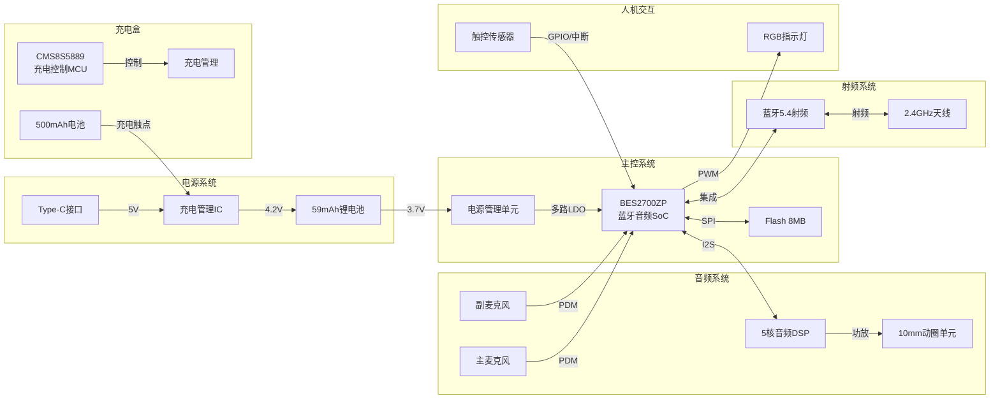
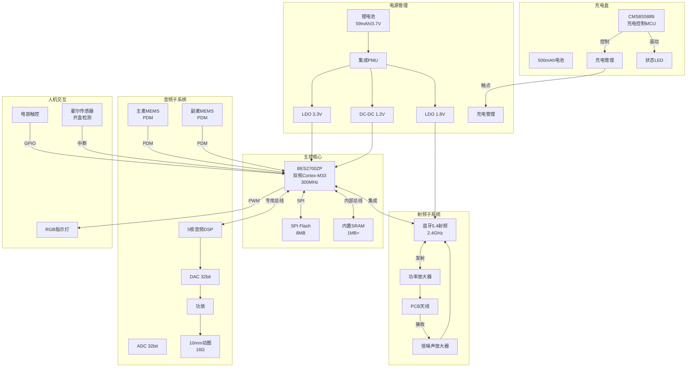

# Ola Friend 智能耳机硬件需求说明书 (HRS)

**文档版本**: v1.0  
**产品名称**: Ola Friend AI智能体耳机  
**发布日期**: 2025年10月  
**文档状态**: 正式发布  

---

## 目录

1. [系统架构与框图](#i-系统架构与框图)
2. [电源设计规格](#ii-电源设计规格)
3. [核心芯片与器件选型](#iii-核心芯片与器件选型)
4. [引脚与物理接口](#iv-引脚与物理接口)
5. [PCB布局与信号完整性](#v-pcb布局与信号完整性)
6. [EMC与认证设计](#vi-emc与认证设计)

---

## I. 系统架构与框图

### 1.1 硬件系统架构

**[事实]** 根据拆解报告，Ola Friend采用恒玄科技BES2700ZP蓝牙音频SoC作为主控芯片。

```
┌─────────────────────────────────────────────────────────────────────────┐
│                        Ola Friend 硬件系统架构                           │
├─────────────────────────────────────────────────────────────────────────┤
│                                                                         │
│   ┌─────────────────────────────────────────────────────────────────┐   │
│   │                    BES2700ZP 主控SoC                             │   │
│   │  ┌──────────┐  ┌──────────┐  ┌──────────┐  ┌──────────┐         │   │
│   │  │  Cortex  │  │ 蓝牙5.4  │  │ 音频DSP  │  │  电源管  │         │   │
│   │  │  M33×2   │  │  射频    │  │  5核     │  │  理单元  │         │   │
│   │  └──────────┘  └──────────┘  └──────────┘  └──────────┘         │   │
│   │       │             │             │             │               │   │
│   │       │             │             │             │               │   │
│   │  ┌────┴────┐   ┌────┴────┐   ┌────┴────┐   ┌────┴────┐         │   │
│   │  │  Flash  │   │  天线   │   │  Codec  │   │  PMU    │         │   │
│   │  │  8MB    │   │  2.4GHz │   │  32bit  │   │  集成   │         │   │
│   │  └─────────┘   └─────────┘   └─────────┘   └─────────┘         │   │
│   └─────────────────────────────────────────────────────────────────┘   │
│                              │                                          │
│        ┌─────────────────────┼─────────────────────┐                    │
│        │                     │                     │                    │
│   ┌────┴────┐           ┌────┴────┐           ┌────┴────┐              │
│   │  音频子系统  │           │  传感子系统  │           │  电源子系统  │              │
│   │             │           │             │           │             │              │
│   │ ┌─────────┐ │           │ ┌─────────┐ │           │ ┌─────────┐ │              │
│   │ │10mm动圈 │ │           │ │ 触控IC  │ │           │ │59mAh锂电│ │              │
│   │ │  单元   │◄┼───────────┼─┤(电容式)│ │           │ │  3.7V   │ │              │
│   │ └─────────┘ │           │ └─────────┘ │           │ └────┬────┘ │              │
│   │ ┌─────────┐ │           │ ┌─────────┐ │           │      │      │              │
│   │ │ 双麦克风│ │           │ │ LED驱动 │ │           │ ┌────┴────┐ │              │
│   │ │(主/副) │─┼───────────┼─┤(RGB)   │ │           │ │ 充电管理│ │              │
│   │ └─────────┘ │           │ └─────────┘ │           │ │  芯片   │ │              │
│   └─────────────┘           └─────────────┘           │ └────┬────┘ │              │
│                                                       └──────┼──────┘              │
│                                                              │                     │
│                                                       ┌──────┴──────┐              │
│                                                       │  Type-C接口 │              │
│                                                       │  (5V输入)   │              │
│                                                       └─────────────┘              │
└────────────────────────────────────────────────────────────────────────────────────┘
```

### 1.2 系统框图 (Mermaid)



### 1.3 核心控制系统规格

**[事实]** BES2700ZP蓝牙音频SoC规格：

| 参数 | 规格 | 来源 |
|------|------|------|
| 处理器 | 双核Cortex-M33 | **[推理]** 基于BES系列架构 |
| 主频 | 最高300MHz | **[推理]** |
| 内置Flash | 8MB | **[推理]** |
| 内置SRAM | 1MB+ | **[推理]** |
| 蓝牙版本 | 5.4 | **[事实]** |
| 音频DSP | 5核专业音频处理器 | **[事实]** |
| 音频Codec | 32bit高精度 | **[推理]** |
| 封装 | BGA | **[推理]** |

### 1.4 通信子系统

**[事实]** 蓝牙5.4规格：

| 参数 | 规格 | 来源 |
|------|------|------|
| 蓝牙版本 | 5.4 | **[事实]** |
| 工作频段 | 2.4GHz ISM | **[推理]** |
| 调制方式 | GFSK | **[推理]** |
| 发射功率 | ≤10dBm (Class 2) | **[推理]** |
| 接收灵敏度 | ≤-90dBm | **[推理]** |
| 支持协议 | A2DP, AVRCP, HFP, HSP, SPP, BLE | **[推理]** |
| 天线类型 | PCB天线或陶瓷天线 | **[推理]** |

---

## II. 电源设计规格

### 2.1 电源树 (Power Tree)

**[事实]** 电池规格：耳机59mAh/3.7V，充电盒500mAh/3.7V

```
电源系统架构图

输入电源
    │
    ├─ 耳机部分 ──────────────────────────────────────────────┐
    │                                                          │
    │   [Type-C 5V/500mA]                                      │
    │        │                                                 │
    │        ▼                                                 │
    │   [充电管理IC] ──→ [电池保护板] ──→ [59mAh锂电池 3.7V]   │
    │        │                                    │            │
    │        │                                    ▼            │
    │        │                              [PMU集成LDO]       │
    │        │                                    │            │
    │        │                    ┌───────────────┼───────────┐│
    │        │                    ▼               ▼           ▼│
    │        │              [3.3V轨]        [1.8V轨]     [1.2V轨]│
    │        │                    │               │           ││
    │        │                    ▼               ▼           ▼│
    │        │              [I/O接口]      [数字逻辑]   [CPU核心]│
    │        │              [LED驱动]      [蓝牙射频]   [DSP核心]│
    │        │              [触控IC]       [音频Codec]         │
    │        │                                                 │
    │        └─ 充电电流: ≤200mA ──────────────────────────────┘
    │
    └─ 充电盒部分 ─────────────────────────────────────────────┐
                                                               │
       [Type-C 5V/1A]                                          │
            │                                                  │
            ▼                                                  │
       [充电管理IC] ──→ [电池保护板] ──→ [500mAh锂电池 3.7V]   │
            │                                    │             │
            │                                    ▼             │
            │                              [升降压转换]        │
            │                                    │             │
            │                                    ▼             │
            │                         [充电触点 5V/300mA]      │
            │                                    │             │
            └────────────────────────────────────┘             │
                                                               │
       [CMS8S5889 MCU] ──→ 充电逻辑控制 ──→ LED状态指示       │
                                                               │
```

### 2.2 电压轨规格

**[推理]** 基于BES2700ZP架构推导：

| 电压轨 | 电压值 | 电流能力 | 用途 | 来源 |
|--------|--------|----------|------|------|
| VBAT | 3.0V ~ 4.2V | - | 电池输入 | **[事实]** |
| VDD_IO | 3.3V | 50mA | GPIO、LED、触控 | **[推理]** |
| VDD_ANA | 3.3V | 30mA | 模拟电路、Codec | **[推理]** |
| VDD_RF | 1.8V | 40mA | 蓝牙射频 | **[推理]** |
| VDD_CORE | 1.2V | 80mA | CPU核心、DSP | **[推理]** |
| VDD_PLL | 1.2V | 20mA | 时钟PLL | **[推理]** |

### 2.3 功耗分配表

**[事实]** 续航指标：8小时音乐播放，28小时总续航

**[推理]** 基于续航指标反推功耗：

| 工作模式 | 场景 | 总功耗 | 分配明细 | 计算依据 |
|----------|------|--------|----------|----------|
| **音乐播放** | 正常音量 | ≤7.4mA@3.7V<br/>(27.4mW) | SoC: 15mW<br/>功放: 8mW<br/>其他: 4.4mW | 59mAh/8h |
| **通话** | 双麦降噪 | ≤10mA@3.7V<br/>(37mW) | SoC: 20mW<br/>功放: 10mW<br/>降噪: 7mW | **[推理]** |
| **AI交互** | 网络连接 | ≤15mA@3.7V<br/>(55.5mW) | SoC: 30mW<br/>功放: 15mW<br/>蓝牙: 10.5mW | **[推理]** |
| **待机(盒外)** | 蓝牙广播 | ≤0.5mA@3.7V<br/>(1.85mW) | SoC: 1.5mW<br/>其他: 0.35mW | **[推理]** |
| **待机(盒内)** | 深度休眠 | ≤6.7μA@3.7V<br/>(25μW) | PMU: 20μW<br/>其他: 5μW | 59mAh/(365×24)h |
| **充电** | 快充模式 | 200mA@4.2V | 充电IC损耗: 10% | **[推理]** |

### 2.4 充电管理规格

**[事实]** 充电参数：完整充电约1.5小时，快充15分钟可用2小时

| 参数 | 规格 | 来源 |
|------|------|------|
| 充电IC型号 | 未公开，推测为专用锂电池充电IC | **[推理]** |
| 输入电压 | 5V ±5% | **[推理]** |
| 充电电流 | 恒流200mA，恒压50mA | **[推理]** |
| 截止电压 | 4.2V ±1% | **[推理]** |
| 充电效率 | ≥85% | **[推理]** |
| 温度保护 | 0°C~45°C充电，超范围暂停 | **[推理]** |
| 安全保护 | 过压、过流、短路保护 | **[推理]** |

---

## III. 核心芯片与器件选型

### 3.1 主控芯片 (BES2700ZP)

**[事实]** 恒玄科技BES2700ZP蓝牙音频SoC

| 特性 | 规格 |
|------|------|
| 制造商 | 恒玄科技 (BES) |
| 型号 | BES2700ZP |
| 架构 | 双核ARM Cortex-M33 |
| 蓝牙 | 5.4，支持LE Audio |
| 音频DSP | 5核专业音频处理器 |
| 接口 | I2S, PDM, SPI, I2C, UART, USB |
| 封装 | BGA |
| 工作温度 | -40°C ~ 85°C |

### 3.2 充电控制MCU (CMS8S5889)

**[事实]** 中微CMS8S5889单片机，用于充电和整机控制

| 特性 | 规格 |
|------|------|
| 制造商 | 中微半导体 (CMS) |
| 型号 | CMS8S5889 |
| 架构 | 8051内核 |
| 主频 | 最高48MHz |
| Flash | 32KB |
| RAM | 4KB |
| 工作电压 | 2.0V ~ 5.5V |
| 封装 | TSSOP20/QFN20 |

### 3.3 音频器件选型

#### 3.3.1 扬声器单元

**[事实]** 10mm动圈单元

| 参数 | 规格 | 来源 |
|------|------|------|
| 类型 | 动圈式 | **[事实]** |
| 尺寸 | Φ10mm | **[事实]** |
| 阻抗 | 16Ω ±15% | **[推理]** |
| 额定功率 | 10mW | **[推理]** |
| 最大功率 | 20mW | **[推理]** |
| 频响范围 | 20Hz ~ 20kHz | **[推理]** |
| 灵敏度 | ≥95dB @ 1kHz, 1mW | **[推理]** |
| THD | ≤1% @ 1kHz, 1mW | **[推理]** |

#### 3.3.2 麦克风

**[事实]** 双麦克风设计，主/副麦克风

| 参数 | 主麦克风 | 副麦克风 | 来源 |
|------|----------|----------|------|
| 类型 | MEMS硅麦 | MEMS硅麦 | **[推理]** |
| 灵敏度 | -42dBV | -42dBV | **[推理]** |
| 信噪比 | ≥60dB | ≥60dB | **[推理]** |
| 工作电压 | 1.8V | 1.8V | **[推理]** |
| 接口 | PDM数字 | PDM数字 | **[推理]** |
| 位置 | 近端(拾音) | 远端(降噪) | **[事实]** |

### 3.4 传感器选型

#### 3.4.1 触控传感器

**[事实]** 电容式触控，Logo区域为触控区

| 参数 | 规格 | 来源 |
|------|------|------|
| 类型 | 自电容或互电容 | **[推理]** |
| 通道数 | 1通道 | **[推理]** |
| 检测面积 | 3mm × 4mm | **[关联]** ID文档 |
| 工作电压 | 3.3V | **[推理]** |
| 接口 | GPIO或I2C | **[推理]** |
| 响应时间 | ≤50ms | **[推理]** |

#### 3.4.2 LED驱动

| 参数 | 规格 | 来源 |
|------|------|------|
| LED类型 | RGB三色或单色多颗 | **[推理]** |
| 驱动方式 | PWM调光 | **[推理]** |
| 亮度等级 | 256级 | **[推理]** |
| 工作电流 | 每通道≤5mA | **[推理]** |

### 3.5 被动器件选型

| 器件类型 | 规格要求 | 数量 | 来源 |
|----------|----------|------|------|
| 贴片电容(0402) | 0.1μF/10V, X5R | 20+ | **[推理]** |
| 贴片电容(0402) | 1μF/6.3V, X5R | 10+ | **[推理]** |
| 贴片电容(0402) | 10μF/6.3V, X5R | 4+ | **[推理]** |
| 贴片电感 | 1μH/1A | 3+ | **[推理]** DCDC用 |
| 贴片电阻(0402) | 10Ω~100kΩ | 30+ | **[推理]** |
| 晶振 | 24MHz/12pF | 1 | **[推理]** 主时钟 |
| 晶振 | 32.768kHz | 1 | **[推理]** 低功耗时钟 |

---

## IV. 引脚与物理接口

### 4.1 耳机充电接口

**[事实]** 通过充电盒触点充电，无外部接口

```
充电触点定义 (耳机底部)

    ┌─────────────────────┐
    │    [耳机底部视图]    │
    │                     │
    │   GND    VCC        │
    │    ●      ●         │  ◄── 充电触点 (2pin)
    │                     │
    │   [L/R标识]         │
    └─────────────────────┘

触点规格:
- 触点1: VCC (充电正极)
- 触点2: GND (充电负极/地)
- 触点材质: 镀金铜合金
- 触点直径: Φ1.5mm
- 触点间距: 3mm
```

### 4.2 充电盒接口

#### 4.2.1 Type-C充电接口

**[事实]** 配备Type-C充电接口

| 引脚 | 定义 | 功能 |
|------|------|------|
| A1/B1 | GND | 地 |
| A4/B4 | VBUS | 5V电源输入 |
| A5 | CC1 | 配置通道 |
| B5 | CC2 | 配置通道 |
| A6/B6 | D+ | USB数据(预留) |
| A7/B7 | D- | USB数据(预留) |

#### 4.2.2 充电盒到耳机接口

```
充电盒座舱触点布局

    ┌──────────────────────────┐
    │      [充电盒内部]         │
    │                          │
    │    L声道        R声道     │
    │                          │
    │   ●   ●        ●   ●    │  ◄── 4个充电触点
    │  VCC GND      VCC GND   │
    │                          │
    │  [磁吸定位点]            │
    │                          │
    └──────────────────────────┘

触点规格:
- 材质: 镀金弹簧针(Pogo Pin)
- 弹力: 50g ±20g
- 行程: 1.5mm
- 接触电阻: ≤50mΩ
```

### 4.3 调试与烧录接口

**[推理]** 基于生产测试需求：

```
测试点布局 (耳机内部PCB)

┌─────────────────────────────────────┐
│  [PCB边缘测试点]                     │
│                                     │
│  TP1  TP2  TP3  TP4  TP5           │
│   ●    ●    ●    ●    ●            │
│  VCC  GND  TX   RX   BOOT          │
│                                     │
│  [主控BES2700ZP]                     │
│                                     │
└─────────────────────────────────────┘

测试点定义:
- TP1: VCC (3.3V)
- TP2: GND
- TP3: UART_TX (调试输出)
- TP4: UART_RX (调试输入)
- TP5: BOOT (启动模式选择)
```

---

## V. PCB布局与信号完整性

### 5.1 PCB规格

**[推理]** 基于6.6g重量和内部空间约束：

| 参数 | 规格 | 来源 |
|------|------|------|
| 层数 | 4层 | **[推理]** |
| 板厚 | 0.6mm | **[推理]** |
| 板材 | FR-4 | **[推理]** |
| 铜厚 | 1oz (内层), 0.5oz (外层) | **[推理]** |
| 最小线宽 | 0.075mm (3mil) | **[推理]** |
| 最小孔径 | 0.15mm | **[推理]** |
| 表面处理 | 沉金(ENIG) | **[推理]** |

### 5.2 叠层结构

```
4层PCB叠层设计

┌─────────────────────────────────────┐
│  Layer 1: Top (信号层)               │
│  - 主要元件放置                      │
│  - 射频信号走线                      │
│  - 厚度: 0.5oz铜                    │
├─────────────────────────────────────┤
│  介质层: FR-4, 0.1mm                │
├─────────────────────────────────────┤
│  Layer 2: GND (地层)                 │
│  - 完整接地平面                      │
│  - 射频参考地                        │
│  - 厚度: 1oz铜                      │
├─────────────────────────────────────┤
│  介质层: FR-4, 0.3mm (核心层)       │
├─────────────────────────────────────┤
│  Layer 3: PWR (电源层)               │
│  - 电源分割平面                      │
│  - 3.3V, 1.8V, 1.2V分区             │
│  - 厚度: 1oz铜                      │
├─────────────────────────────────────┤
│  介质层: FR-4, 0.1mm                │
├─────────────────────────────────────┤
│  Layer 4: Bottom (信号层)            │
│  - 次要元件放置                      │
│  - 充电触点接口                      │
│  - 厚度: 0.5oz铜                    │
└─────────────────────────────────────┘

总厚度: 0.6mm
```

### 5.3 布局分区

```
PCB布局分区图 (俯视图)

┌──────────────────────────────────────────┐
│                                          │
│   ┌──────────┐      ┌──────────┐        │
│   │  蓝牙天线  │      │  10mm动圈 │        │
│   │  (左上)   │      │  单元接口 │        │
│   └──────────┘      │  (右上)   │        │
│                     └──────────┘        │
│                                          │
│   ┌─────────────────────────────────┐   │
│   │       BES2700ZP主控 (中央)       │   │
│   │         ┌─────────┐             │   │
│   │         │  屏蔽罩  │             │   │
│   │         └─────────┘             │   │
│   └─────────────────────────────────┘   │
│                                          │
│   ┌──────────┐      ┌──────────┐        │
│   │  双麦克风  │      │  59mAh   │        │
│   │  (左下)   │      │  电池接口 │        │
│   └──────────┘      │  (右下)   │        │
│                     └──────────┘        │
│                                          │
│   [充电触点] ──────────────────────      │
│   (底部边缘)                             │
│                                          │
└──────────────────────────────────────────┘

分区原则:
1. 射频区(左上): 蓝牙天线远离其他电路
2. 音频区(右上): 扬声器接口靠近主控
3. 电源区(右下): 电池接口与充电管理
4. 传感器区(左下): 麦克风与触控
```

### 5.4 信号完整性要求

| 信号类型 | 要求 | 来源 |
|----------|------|------|
| 射频信号 | 50Ω阻抗控制，包地处理 | **[推理]** |
| 音频信号 | 差分走线，远离数字信号 | **[推理]** |
| 电源纹波 | ≤50mV (模拟电源) | **[推理]** |
| 时钟信号 | 包地处理，远离敏感信号 | **[推理]** |
| 触控信号 | 远离射频和电源噪声 | **[推理]** |

---

## VI. EMC与认证设计

### 6.1 EMC设计要点

**[事实]** 需通过蓝牙SIG认证、CE、FCC等

| 项目 | 设计要求 | 来源 |
|------|----------|------|
| 屏蔽罩 | 主控芯片加金属屏蔽罩 | **[推理]** |
| 滤波 | 电源入口加π型滤波 | **[推理]** |
| 接地 | 完整接地平面，多点接地 | **[推理]** |
| 天线 | 远离金属部件，净空区设计 | **[推理]** |

### 6.2 认证测试要求

| 认证 | 测试项目 | 要求 | 来源 |
|------|----------|------|------|
| 蓝牙SIG | RF性能 | 符合Core Spec 5.4 | **[事实]** |
| CE | EMC/RED | EN 301 489, EN 300 328 | **[推理]** |
| FCC | Part 15 | 符合FCC ID要求 | **[推理]** |
| RoHS | 有害物质 | 限制10种物质 | **[推理]** |
| MFI | 苹果认证 | 通过MFI测试 | **[事实]** |

### 6.3 天线设计

**[推理]** 基于蓝牙5.4和10米通信距离：

| 参数 | 规格 | 来源 |
|------|------|------|
| 天线类型 | PCB天线或陶瓷天线 | **[推理]** |
| 工作频段 | 2402MHz ~ 2480MHz | **[推理]** |
| 天线增益 | ≥0dBi | **[推理]** |
| 回波损耗 | ≤-10dB | **[推理]** |
| 效率 | ≥50% | **[推理]** |
| 净空区 | 天线周围5mm无金属 | **[推理]** |

---

## 附录

### A. 硬件系统框图 (Mermaid详细版)



### B. BOM关键器件清单

| 位号 | 器件 | 型号/规格 | 数量 | 制造商 |
|------|------|-----------|------|--------|
| U1 | 主控SoC | BES2700ZP | 1 | 恒玄科技 |
| U2 | 充电MCU | CMS8S5889 | 1 | 中微半导体 |
| U3 | 充电管理IC | TBD | 1 | - |
| SPK1 | 扬声器 | 10mm/16Ω | 1 | - |
| MIC1 | 主麦克风 | MEMS PDM | 1 | 歌尔/瑞声 |
| MIC2 | 副麦克风 | MEMS PDM | 1 | 歌尔/瑞声 |
| BAT1 | 耳机电池 | 59mAh/3.7V | 1 | - |
| BAT2 | 充电盒电池 | 500mAh/3.7V | 1 | - |

### C. 术语表

| 术语 | 说明 |
|------|------|
| SoC | System on Chip，系统级芯片 |
| MCU | Microcontroller Unit，微控制器 |
| PMU | Power Management Unit，电源管理单元 |
| LDO | Low Dropout Regulator，低压差线性稳压器 |
| DC-DC | 直流-直流转换器 |
| PDM | Pulse Density Modulation，脉冲密度调制 |
| I2S | Inter-IC Sound，集成电路内置音频总线 |
| SPI | Serial Peripheral Interface，串行外设接口 |
| I2C | Inter-Integrated Circuit，集成电路互联总线 |
| UART | Universal Asynchronous Receiver/Transmitter，通用异步收发器 |
| MEMS | Micro-Electro-Mechanical System，微机电系统 |
| EMC | Electromagnetic Compatibility，电磁兼容性 |
| RF | Radio Frequency，射频 |

---

**文档维护记录**

| 版本 | 日期 | 修改内容 | 作者 |
|------|------|----------|------|
| v1.0 | 2025-10 | 初始版本 | HRS自动生成 |

---

*本文档基于Ola Friend智能耳机调研报告、产品需求文档和工业设计规格书生成，包含[事实]、[关联]和[推理]三类信息，请在设计开发过程中以实际测试结果为准。*
