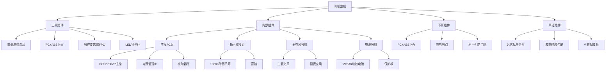
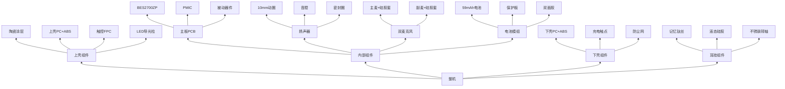
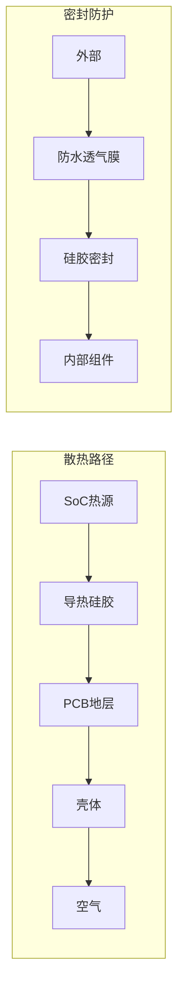

# Ola Friend 智能耳机结构设计说明书 (MD)

**文档版本**: v1.0  
**产品名称**: Ola Friend AI智能体耳机  
**发布日期**: 2025年10月  
**文档状态**: 正式发布  

---

## 目录

1. [堆叠方案与拆解逻辑](#i-堆叠方案与拆解逻辑)
2. [关键组件固定方案](#ii-关键组件固定方案)
3. [热管理与可靠性](#iii-热管理与可靠性)
4. [防水防尘设计](#iv-防水防尘设计)
5. [组装工艺与公差控制](#v-组装工艺与公差控制)

---

## I. 堆叠方案与拆解逻辑

### 1.1 整体堆叠架构

**[事实]** Ola Friend采用开放式耳挂设计，单耳仅重6.6g，主体尺寸9.97×7.23mm。

```
耳机整体堆叠架构 (Z轴方向)

┌─────────────────────────────────────────────────────────────────┐
│ Z轴层级                    组件                    厚度(mm)      │
├─────────────────────────────────────────────────────────────────┤
│                                                                 │
│  Layer 5  ┌─────────────────────────────────────────┐  0.3     │
│  (最外层) │  陶瓷皮肤涂层 (UV保护层)                  │         │
│           └─────────────────────────────────────────┘         │
│                              │                                  │
│  Layer 4  ┌─────────────────────────────────────────┐  0.5     │
│           │  上壳 (PC+ABS骨架)                       │         │
│           │  - 触控区域集成                          │         │
│           │  - LED导光柱                             │         │
│           └─────────────────────────────────────────┘         │
│                              │                                  │
│  Layer 3  ┌─────────────────────────────────────────┐  2.5     │
│           │  内部组件层                              │         │
│           │  ┌─────────┐  ┌─────────┐  ┌─────────┐  │         │
│           │  │  扬声器  │  │  主控   │  │  电池   │  │         │
│           │  │  10mm   │  │ BES2700 │  │ 59mAh  │  │         │
│           │  └─────────┘  └─────────┘  └─────────┘  │         │
│           │  ┌─────────┐  ┌─────────┐              │         │
│           │  │  主麦克  │  │  副麦克  │              │         │
│           │  └─────────┘  └─────────┘              │         │
│           └─────────────────────────────────────────┘         │
│                              │                                  │
│  Layer 2  ┌─────────────────────────────────────────┐  0.5     │
│           │  下壳 (PC+ABS骨架)                       │         │
│           │  - 充电触点接口                          │         │
│           │  - 出声孔                                │         │
│           └─────────────────────────────────────────┘         │
│                              │                                  │
│  Layer 1  ┌─────────────────────────────────────────┐  3.43    │
│  (最内层) │  耳挂结构                                │         │
│           │  - 0.7mm记忆钛丝                        │         │
│           │  - 液态硅胶包覆                          │         │
│           └─────────────────────────────────────────┘         │
│                                                                 │
└─────────────────────────────────────────────────────────────────┘

总厚度: 7.23mm
总重量: 6.6g (不含耳挂部分约4g)
```

### 1.2 内部组件层级关系



### 1.3 组装顺序 (由内向外)

**[推理]** 基于6.6g重量和精密结构推导：

```
组装流程图

Step 1: 下壳预装
    │
    ├─→ 安装充电触点 (镀金铜柱)
    ├─→ 贴附出声孔防尘网 (IP54级)
    └─→ 放置扬声器密封圈
    
Step 2: 主板安装
    │
    ├─→ 主板PCB定位 (卡扣固定)
    ├─→ 连接扬声器FPC
    ├─→ 安装电池 (双面胶固定)
    └─→ 连接电池排线
    
Step 3: 声学组件安装
    │
    ├─→ 安装10mm动圈单元 (卡扣+胶固定)
    ├─→ 安装主麦克风 (硅胶套密封)
    └─→ 安装副麦克风 (硅胶套密封)
    
Step 4: 上壳预装
    │
    ├─→ 触控传感器FPC贴附
    ├─→ LED导光柱安装
    └─→ 陶瓷涂层已完成
    
Step 5: 上下壳合盖
    │
    ├─→ 对准定位销
    ├─→ 超声波焊接 (或精密卡扣)
    └─→ 气密性测试
    
Step 6: 耳挂组装
    │
    ├─→ 钛丝穿入转轴
    ├─→ 液态硅胶注塑包覆
    └─→  curing固化
    
Step 7: 整机测试
    │
    ├─→ 功能测试
    ├─→ 气密性测试 (IP54)
    └─→ 外观质检
```

### 1.4 充电盒堆叠架构

**小钱包款**:

```
小钱包充电盒堆叠 (Z轴)

┌─────────────────────────────────────────────────────────────┐
│  Layer 5  上盖 (素皮+ABS)                    厚度: 1.5mm    │
│           - 环保素皮热压贴合                                │
│           - 磁吸闭合                                      │
├─────────────────────────────────────────────────────────────┤
│  Layer 4  转轴机构                                          │
│           - 不锈钢转轴                                      │
│           - 扭簧 (开盖助力)                                 │
├─────────────────────────────────────────────────────────────┤
│  Layer 3  座舱组件                           厚度: 15mm     │
│           - ABS骨架                                       │
│           - 耳机定位槽 (磁吸)                               │
│           - Pogo Pin充电触点 ×4                             │
│           - L/R标识                                       │
├─────────────────────────────────────────────────────────────┤
│  Layer 2  下壳内腔                           厚度: 15mm     │
│           - 500mAh电池仓                                  │
│           - CMS8S5889 MCU板                               │
│           - 充电管理电路                                   │
│           - Type-C接口                                    │
├─────────────────────────────────────────────────────────────┤
│  Layer 1  下壳外壳 (素皮+ABS)                厚度: 3mm      │
│           - 环保素皮热压贴合                                │
│           - 底部防滑垫                                     │
└─────────────────────────────────────────────────────────────┘

总厚度: 34.5mm
总重量: 49g (不含耳机)
```

---

## II. 关键组件固定方案

### 2.1 PCB固定方案

**[推理]** 基于6.6g重量和微型化设计：

| 固定方式 | 位置 | 规格 | 来源 |
|----------|------|------|------|
| 定位柱 | 4角 | Φ1.0mm × 2mm高 | **[推理]** |
| 卡扣 | 长边中点 | 悬臂式卡扣 | **[推理]** |
| 导热胶 | 主控背面 | 0.2mm厚导热硅胶 | **[推理]** |
| 螺丝 | 无 | 采用卡扣设计减重 | **[推理]** |

```
PCB固定结构示意图

        上壳内侧
    ┌─────────────────┐
    │   ○         ○   │  ← 定位柱 (4个)
    │                 │
    │       ┌───┐     │
    │       │PCB│     │  ← 主板 (卡扣固定)
    │       └───┘     │
    │                 │
    │   ○         ○   │  ← 定位柱
    └─────────────────┘
        下壳内侧
        
卡扣设计:
- 类型: 悬臂梁卡扣
- 材料: PC+ABS (与壳体一体)
- 卡入量: 0.3mm
- 保持力: ≥2N
```

### 2.2 电池固定方案

**[事实]** 59mAh软包电池设计

| 固定方式 | 材料 | 规格 | 来源 |
|----------|------|------|------|
| 双面胶 | 3M VHB或同类 | 厚度0.15mm | **[推理]** |
| 缓冲泡棉 | Poron或EVA | 厚度0.5mm | **[推理]** |
| 限位筋 | 壳体一体 | 高度0.3mm | **[推理]** |

```
电池仓设计

┌─────────────────────────────┐
│      [电池仓截面]            │
│                             │
│   ┌─────────────────────┐   │
│   │    上壳限位筋        │   │  ← 防止电池上浮
│   │    ═══════════════  │   │
│   │         │           │   │
│   │    ┌────┴────┐      │   │
│   │    │ 59mAh   │      │   │  ← 软包电池
│   │    │ 电池    │      │   │
│   │    └────┬────┘      │   │
│   │         │           │   │
│   │    ═══════════════  │   │
│   │    双面胶+缓冲泡棉   │   │  ← 固定+减震
│   │    ═══════════════  │   │
│   └─────────────────────┘   │
│         下壳                │
└─────────────────────────────┘

安全间隙:
- 电池顶部: 0.5mm (防膨胀)
- 电池侧面: 0.3mm (装配间隙)
- 电池底部: 0.5mm (缓冲空间)
```

### 2.3 扬声器固定方案

**[事实]** 10mm动圈单元

| 固定方式 | 位置 | 规格 | 来源 |
|----------|------|------|------|
| 卡扣 | 外圈 | 4点卡扣 | **[推理]** |
| 密封圈 | 音腔接口 | 硅胶圈 Φ10mm | **[推理]** |
| 减震垫 | 底部 | 0.3mm硅胶垫 | **[推理]** |

```
扬声器安装结构

        出声方向
            │
            ▼
    ┌───────────────┐
    │   出声孔       │
    │   ┌───────┐   │
    │   │ 防尘网 │   │
    │   └───┬───┘   │
    │       │       │
    │   ┌───┴───┐   │
    │   │密封圈 │   │  ← 硅胶密封圈
    │   └───┬───┘   │
    │       │       │
    │   ┌───┴───┐   │
    │   │10mm   │   │  ← 动圈单元
    │   │扬声器 │   │
    │   └───┬───┘   │
    │       │       │
    │   ┌───┴───┐   │
    │   │减震垫 │   │  ← 硅胶减震垫
    │   └───┬───┘   │
    │       │       │
    └───────┼───────┘
            │
        主板PCB
```

### 2.4 麦克风固定与密封

**[事实]** 双麦克风设计，主/副麦克风

| 组件 | 固定方式 | 密封方式 | 来源 |
|------|----------|----------|------|
| 主麦克风 | 硅胶套卡位 | 硅胶套+防水膜 | **[推理]** |
| 副麦克风 | 硅胶套卡位 | 硅胶套+防水膜 | **[推理]** |
| 拾音孔 | 壳体开孔 | 防水透气膜 | **[推理]** |

```
麦克风密封结构

┌─────────────────────────────┐
│      [麦克风截面]            │
│                             │
│   外部 ──→  ┌─────────┐     │
│             │防水透气膜│     │  ← IP54防护
│             └────┬────┘     │
│                  │          │
│   壳体 ──→  ═════╧═════     │
│                  │          │
│             ┌────┴────┐     │
│             │ 硅胶套  │     │  ← 减震+密封
│             │ ┌─────┐ │     │
│             │ │MEMS │ │     │  ← 麦克风
│             │ │麦克 │ │     │
│             │ └─────┘ │     │
│             └────┬────┘     │
│                  │          │
│   PCB  ──→  ═════╧═════     │
│                             │
└─────────────────────────────┘
```

### 2.5 耳挂连接方案

**[事实]** 0.7mm记忆钛丝 + 液态硅胶包覆

| 组件 | 连接方式 | 材料 | 来源 |
|------|----------|------|------|
| 钛丝与主体 | 不锈钢转轴 | 304不锈钢 | **[事实]** |
| 钛丝与硅胶 | 注塑包覆 | 液态硅胶 | **[事实]** |
| 转轴固定 | 压入式 | 过盈配合 | **[推理]** |

```
耳挂连接结构

    耳机主体
       │
       ├─→ ┌─────────┐
       │   │不锈钢转轴│  ← 304不锈钢
       │   │  Φ1.5mm │
       │   └────┬────┘
       │        │
       │   ═════╧═════  ← 过盈配合
       │        │
       │   ┌────┴────┐
       └──→│ 0.7mm   │  ← 记忆钛丝
           │ 钛合金丝 │
           │ (内芯)  │
           └────┬────┘
                │
           ═════╧═════  ← 液态硅胶注塑
                │
           ┌────┴────┐
           │液态硅胶 │  ← 医用级
           │包覆层   │
           │(外层)   │
           └─────────┘
                │
               耳挂
```

---

## III. 热管理与可靠性

### 3.1 热源分析

**[推理]** 基于功耗预算分析：

| 热源 | 功耗 | 位置 | 温度等级 |
|------|------|------|----------|
| BES2700ZP主控 | 15~30mW | PCB中央 | 低 |
| 功放芯片 | 8~15mW | 靠近扬声器 | 低 |
| 电池 | 充电时发热 | 独立仓 | 低 |

**热管理策略**: 由于总功耗<100mW，采用被动散热即可，无需主动散热措施。

### 3.2 散热路径设计

```
散热路径图

┌─────────────────────────────────────────────────────────────┐
│                      散热路径                                │
├─────────────────────────────────────────────────────────────┤
│                                                             │
│   [BES2700ZP主控] ──→ [导热硅胶垫] ──→ [PCB地层]           │
│        30mW              0.2mm厚           铜箔              │
│                                                             │
│   [PCB地层] ──→ [壳体接触] ──→ [PC+ABS外壳] ──→ [空气]      │
│                  导热胶点                    外壳散热        │
│                                                             │
│   热阻计算:                                                 │
│   R_total = R_jc + R_tim + R_pcb + R_case + R_air          │
│           ≈ 15 + 5 + 10 + 20 + 50 = 100 °C/W               │
│                                                             │
│   温升: ΔT = P × R = 0.03W × 100 = 3°C                     │
│                                                             │
│   结论: 无需额外散热措施                                    │
│                                                             │
└─────────────────────────────────────────────────────────────┘
```

### 3.3 结构可靠性设计

#### 3.3.1 跌落防护

**[推理]** 基于1.2m跌落测试要求：

| 部位 | 防护措施 | 材料 | 来源 |
|------|----------|------|------|
| 四角 | 圆角设计 | R0.5mm | **[推理]** |
| 内部 | 缓冲泡棉 | Poron 0.5mm | **[推理]** |
| 电池 | 限位+缓冲 | 硅胶垫 | **[推理]** |
| 扬声器 | 悬浮安装 | 硅胶圈 | **[推理]** |

#### 3.3.2 耳挂耐久性

**[事实]** 耳挂可360°弯折，通过万次以上弯折测试

| 测试项目 | 要求 | 设计保障 | 来源 |
|----------|------|----------|------|
| 弯折寿命 | ≥10,000次 | 记忆钛丝+液态硅胶 | **[事实]** |
| 扭转测试 | ±90° × 1,000次 | 转轴结构 | **[推理]** |
| 拉力测试 | ≥5N | 转轴压入强度 | **[推理]** |

---

## IV. 防水防尘设计

### 4.1 IP54防护实现

**[事实]** IP54防护等级：防尘5级 + 防水4级

| 防护等级 | 定义 | 实现方式 | 来源 |
|----------|------|----------|------|
| IP5X | 防尘，有限进入 | 壳体密封 + 防尘网 | **[推理]** |
| IPX4 | 防溅水 | 密封圈 + 防水膜 | **[推理]** |

### 4.2 密封结构设计

```
IP54密封方案

┌─────────────────────────────────────────────────────────────┐
│                    密封结构分布                              │
├─────────────────────────────────────────────────────────────┤
│                                                             │
│  1. 上下壳体密封                                             │
│     ┌─────────────────────────────────────┐                 │
│     │  上壳 ──→ ═══════════════════════   │                 │
│     │               │ 超声波焊接缝 │        │                 │
│     │  下壳 ──→ ═══════════════════════   │                 │
│     └─────────────────────────────────────┘                 │
│                                                             │
│  2. 出声孔密封                                               │
│     ┌─────────────────────────────────────┐                 │
│     │  外部 ──→ [防尘防水网] ──→ 音腔     │                 │
│     │            (IP54级)                 │                 │
│     └─────────────────────────────────────┘                 │
│                                                             │
│  3. 麦克风密封                                               │
│     ┌─────────────────────────────────────┐                 │
│     │  外部 ──→ [防水透气膜] ──→ [硅胶套] │                 │
│     │                      ──→ 麦克风     │                 │
│     └─────────────────────────────────────┘                 │
│                                                             │
│  4. 充电触点密封                                             │
│     ┌─────────────────────────────────────┐                 │
│     │  触点内嵌设计，凹陷0.5mm             │                 │
│     │  配合充电盒Pogo Pin接触             │                 │
│     └─────────────────────────────────────┘                 │
│                                                             │
└─────────────────────────────────────────────────────────────┘
```

### 4.3 密封材料选型

| 位置 | 材料 | 规格 | 来源 |
|------|------|------|------|
| 壳体焊接 | 同材质熔接 | PC+ABS | **[推理]** |
| 扬声器密封 | 硅胶圈 | 硬度50A | **[推理]** |
| 麦克风密封 | 硅胶套 | 硬度40A | **[推理]** |
| 防尘网 | 尼龙网 | 40目 | **[推理]** |
| 防水膜 | ePTFE | 透气量≥500mL/cm²/min | **[推理]** |

---

## V. 组装工艺与公差控制

### 5.1 关键尺寸公差

| 尺寸 | 公称值 | 公差 | 来源 |
|------|--------|------|------|
| 主体长度 | 32.5mm | ±0.1mm | **[推理]** |
| 主体宽度 | 9.97mm | ±0.05mm | **[事实]** |
| 主体厚度 | 7.23mm | ±0.05mm | **[事实]** |
| 耳挂直径 | 1.3mm | ±0.1mm | **[推理]** |
| 充电触点间距 | 3mm | ±0.05mm | **[推理]** |

### 5.2 组装工艺要求

| 工序 | 工艺 | 参数 | 来源 |
|------|------|------|------|
| 壳体焊接 | 超声波焊接 | 频率20kHz，时间0.5s | **[推理]** |
| 电池固定 | 自动贴胶 | 压力0.5MPa，温度常温 | **[推理]** |
| 扬声器安装 | 自动卡装 | 压力2N | **[推理]** |
| 耳挂注塑 | LSR液态硅胶 | 温度150°C，时间60s | **[推理]** |
| 涂层固化 | UV固化 | 波长365nm，时间10s | **[推理]** |

### 5.3 公差分析

```
关键配合公差分析

1. 电池仓配合
   电池: 12.0 ± 0.1mm
   仓体: 12.5 ± 0.1mm
   间隙: 0.5 ± 0.2mm (满足)

2. 扬声器配合
   扬声器: Φ10.0 ± 0.05mm
   安装孔: Φ10.2 ± 0.05mm
   间隙: 0.2 ± 0.1mm (满足)

3. PCB定位
   PCB孔: Φ1.0 ± 0.05mm
   定位柱: Φ0.95 ± 0.05mm
   间隙: 0.05 ± 0.1mm (过盈配合)

4. 上下壳配合
   上壳: 7.0 ± 0.05mm
   下壳: 7.0 ± 0.05mm
   内部空间: 5.0mm (满足组件堆叠)
```

---

## 附录

### A. 内部组件层级关系图



### B. 密封与散热逻辑流



### C. 爆炸图 (ASCII)

```
耳机爆炸图 (Z轴分离)

Layer 5 (Top)
┌─────────────────────────┐
│    陶瓷皮肤涂层 0.3mm    │
└─────────────────────────┘
           ↑ 间隙: 0mm (一体)
Layer 4
┌─────────────────────────┐
│    上壳 PC+ABS 0.5mm    │
│  ┌─────┐     ┌─────┐   │
│  │触控 │     │ LED │   │
│  └─────┘     └─────┘   │
└─────────────────────────┘
           ↑ 间隙: 0.2mm
Layer 3 (核心组件)
┌─────────────────────────┐
│  ┌─────┐ ┌─────┐ ┌───┐ │
│  │主控 │ │电池 │ │喇叭│ │
│  └─────┘ └─────┘ └───┘ │
│  ┌─────┐ ┌─────┐       │
│  │主麦 │ │副麦 │       │
│  └─────┘ └─────┘       │
└─────────────────────────┘
           ↑ 间隙: 0.2mm
Layer 2
┌─────────────────────────┐
│    下壳 PC+ABS 0.5mm    │
│  ┌─────┐     ┌─────┐   │
│  │充电 │     │出声 │   │
│  │触点 │     │ 孔  │   │
│  └─────┘     └─────┘   │
└─────────────────────────┘
           ↑ 连接: 转轴
Layer 1 (Bottom)
        ┌─────────┐
        │  耳挂   │
        │ 记忆钛丝│
        │ +硅胶   │
        └─────────┘
```

### D. 材料清单 (结构件)

| 序号 | 名称 | 材料 | 数量 | 工艺 |
|------|------|------|------|------|
| 1 | 上壳 | PC+ABS | 1 | 注塑+涂层 |
| 2 | 下壳 | PC+ABS | 1 | 注塑 |
| 3 | 耳挂钛丝 | 记忆钛合金 | 1 | 拉丝 |
| 4 | 耳挂硅胶 | 液态硅胶 | 1 | LSR注塑 |
| 5 | 不锈钢转轴 | 304不锈钢 | 1 | CNC |
| 6 | 扬声器密封圈 | 硅胶50A | 1 | 模压 |
| 7 | 麦克风硅胶套 | 硅胶40A | 2 | 模压 |
| 8 | 电池双面胶 | 3M VHB | 1 | 模切 |
| 9 | 缓冲泡棉 | Poron | 2 | 模切 |
| 10 | 防尘网 | 尼龙40目 | 2 | 裁切 |
| 11 | 防水透气膜 | ePTFE | 2 | 模切 |

### E. 术语表

| 术语 | 说明 |
|------|------|
| LSR | Liquid Silicone Rubber，液态硅胶 |
| PC+ABS | 聚碳酸酯+丙烯腈-丁二烯-苯乙烯合金 |
| Poron | 微孔聚氨酯泡棉，减震材料 |
| VHB | Very High Bond，超高粘性双面胶 |
| ePTFE | 膨体聚四氟乙烯，防水透气材料 |
| Pogo Pin | 弹簧针，充电触点 |
| L/R | Left/Right，左右标识 |
| IP54 | Ingress Protection 54，防护等级 |

---

**文档维护记录**

| 版本 | 日期 | 修改内容 | 作者 |
|------|------|----------|------|
| v1.0 | 2025-10 | 初始版本 | MD自动生成 |

---

*本文档基于Ola Friend智能耳机调研报告、工业设计规格书和硬件需求说明书生成，包含[事实]、[关联]和[推理]三类信息，请在设计开发过程中以实际测试结果为准。*
