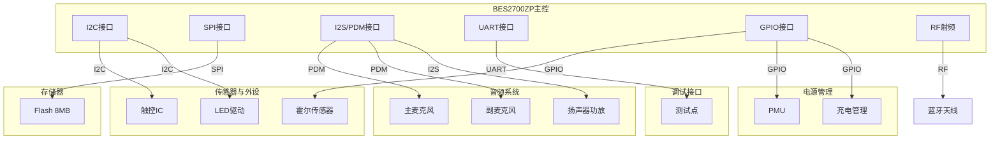
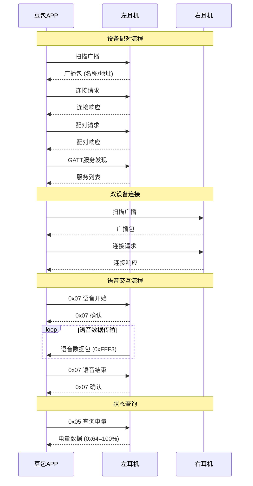
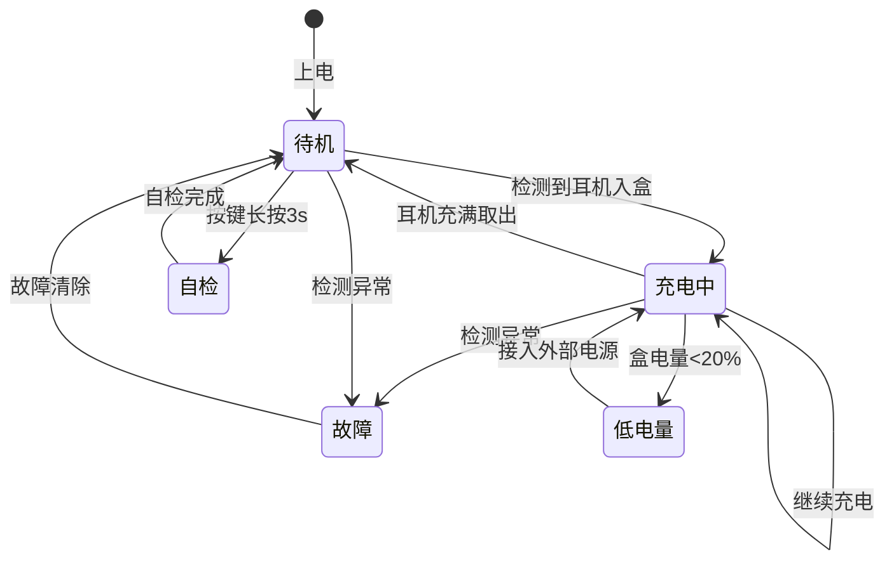
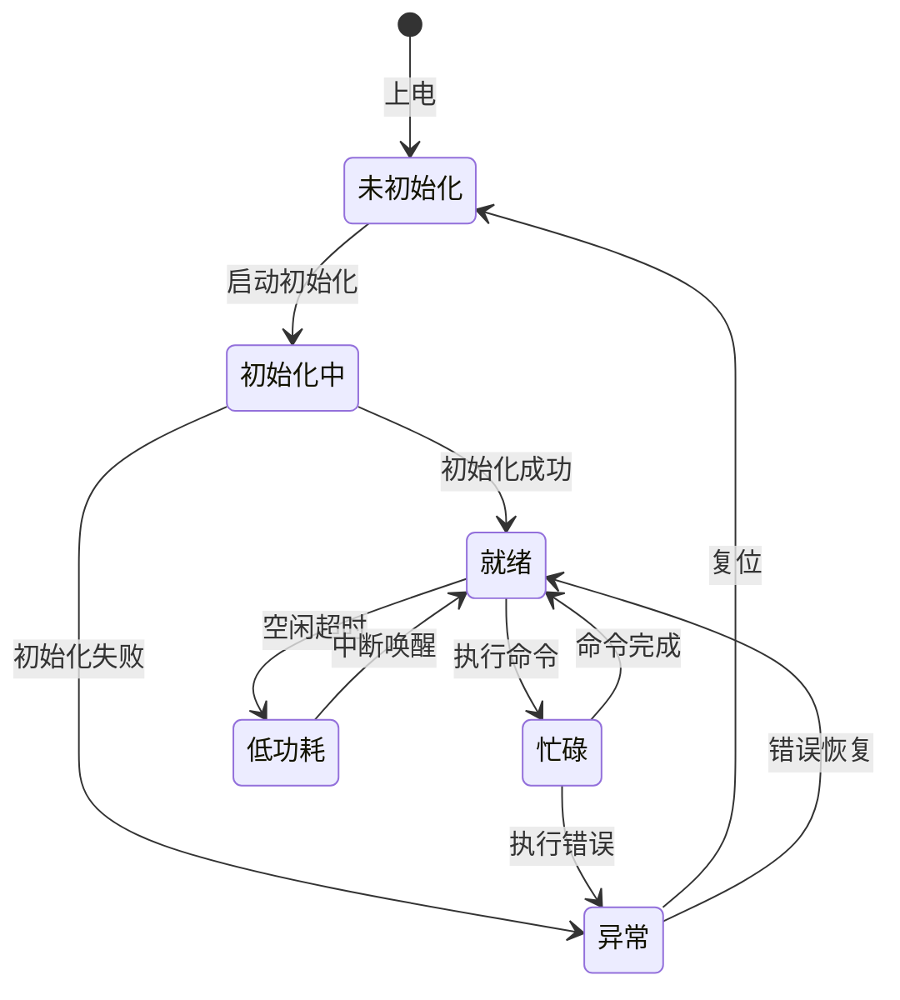

# Ola Friend 智能耳机接口控制文档 (ICD)

**文档版本**: v1.0  
**产品名称**: Ola Friend AI智能体耳机  
**发布日期**: 2024年10月  
**文档状态**: 正式发布  

---

## 目录

1. [物理层定义](#i-物理层定义)
2. [通讯协议规范](#ii-通讯协议规范)
3. [寄存器与指令集映射](#iii-寄存器与指令集映射)
4. [蓝牙协议栈规范](#iv-蓝牙协议栈规范)
5. [充电盒通讯协议](#v-充电盒通讯协议)

---

## I. 物理层定义

### 1.1 主控引脚分配表

**[事实]** BES2700ZP作为主控芯片，连接各外设模块。

| 引脚编号 | 信号名称 | 功能描述 | 连接对象 | 协议类型 | 电平 | 来源 |
|----------|----------|----------|----------|----------|------|------|
| 1-4 | VBAT | 电池供电输入 | 59mAh电池 | 电源 | 3.7V | **[事实]** |
| 5-8 | GND | 系统地 | 系统地 | 电源 | 0V | **[推理]** |
| 9-12 | VDD_IO | 3.3V I/O供电 | PMU输出 | 电源 | 3.3V | **[推理]** |
| 13-16 | VDD_CORE | 1.2V核心供电 | PMU输出 | 电源 | 1.2V | **[推理]** |
| 17-20 | VDD_RF | 1.8V射频供电 | PMU输出 | 电源 | 1.8V | **[推理]** |
| 21-24 | XTAL_IN/XTAL_OUT | 24MHz晶振 | 晶振 | 时钟 | - | **[推理]** |
| 25-28 | 32K_IN/32K_OUT | 32.768kHz晶振 | 晶振 | 时钟 | - | **[推理]** |
| 29-32 | I2S_BCLK | I2S位时钟 | 音频Codec | I2S | 3.3V | **[推理]** |
| 33-36 | I2S_WS | I2S字选择 | 音频Codec | I2S | 3.3V | **[推理]** |
| 37-40 | I2S_DATA_OUT | I2S数据输出 | 扬声器功放 | I2S | 3.3V | **[推理]** |
| 41-44 | I2S_DATA_IN | I2S数据输入 | 麦克风 | I2S/PDM | 3.3V | **[推理]** |
| 45-48 | PDM_CLK | PDM时钟 | 双麦克风 | PDM | 1.8V | **[推理]** |
| 49-52 | PDM_DATA0 | 主麦克风数据 | 主麦克风 | PDM | 1.8V | **[推理]** |
| 53-56 | PDM_DATA1 | 副麦克风数据 | 副麦克风 | PDM | 1.8V | **[推理]** |
| 57-60 | I2C_SCL | I2C时钟 | 触控IC/LED驱动 | I2C | 3.3V | **[推理]** |
| 61-64 | I2C_SDA | I2C数据 | 触控IC/LED驱动 | I2C | 3.3V | **[推理]** |
| 65-68 | SPI_CLK | SPI时钟 | Flash存储 | SPI | 3.3V | **[推理]** |
| 69-72 | SPI_MOSI | SPI主出从入 | Flash存储 | SPI | 3.3V | **[推理]** |
| 73-76 | SPI_MISO | SPI主入从出 | Flash存储 | SPI | 3.3V | **[推理]** |
| 77-80 | SPI_CS | SPI片选 | Flash存储 | SPI | 3.3V | **[推理]** |
| 81-84 | UART_TX | 调试串口发送 | 测试点 | UART | 3.3V | **[推理]** |
| 85-88 | UART_RX | 调试串口接收 | 测试点 | UART | 3.3V | **[推理]** |
| 89-92 | GPIO_TOUCH | 触控中断输入 | 触控传感器 | GPIO | 3.3V | **[推理]** |
| 93-96 | GPIO_LED_R | LED红色控制 | RGB LED | PWM/GPIO | 3.3V | **[推理]** |
| 97-100 | GPIO_LED_G | LED绿色控制 | RGB LED | PWM/GPIO | 3.3V | **[推理]** |
| 101-104 | GPIO_LED_B | LED蓝色控制 | RGB LED | PWM/GPIO | 3.3V | **[推理]** |
| 105-108 | GPIO_CHG_DET | 充电检测 | 充电管理IC | GPIO | 3.3V | **[推理]** |
| 109-112 | GPIO_PWR_EN | 电源使能 | PMU | GPIO | 3.3V | **[推理]** |
| 113-116 | GPIO_BT_ANT | 蓝牙天线 | 2.4GHz天线 | RF | - | **[推理]** |
| 117-120 | GPIO_BOX_DET | 入盒检测 | 霍尔传感器 | GPIO | 3.3V | **[推理]** |

### 1.2 电气特性

**[推理]** 基于BES2700ZP规格和行业标准：

| 参数 | 最小值 | 典型值 | 最大值 | 单位 | 说明 |
|------|--------|--------|--------|------|------|
| **电源电压** |
| VBAT输入 | 3.0 | 3.7 | 4.2 | V | 锂电池工作范围 |
| VDD_IO | 3.0 | 3.3 | 3.6 | V | I/O供电 |
| VDD_CORE | 1.08 | 1.2 | 1.32 | V | 核心供电 |
| VDD_RF | 1.62 | 1.8 | 1.98 | V | 射频供电 |
| **数字I/O** |
| 高电平输入(VIH) | 0.7×VDD | - | VDD | V | - |
| 低电平输入(VIL) | 0 | - | 0.3×VDD | V | - |
| 高电平输出(VOH) | VDD-0.4 | - | VDD | V | - |
| 低电平输出(VOL) | 0 | - | 0.4 | V | - |
| 输出电流 | - | - | 8 | mA | 单引脚驱动能力 |
| **中断触发** |
| 触控中断 | - | 下降沿 | - | - | 低电平有效 |
| 充电检测 | - | 上升沿 | - | - | 高电平有效 |
| 入盒检测 | - | 双沿 | - | - | 霍尔传感器 |

### 1.3 接口连接拓扑



---

## II. 通讯协议规范

### 2.1 I2C总线协议

**[推理]** 用于触控IC和LED驱动通信：

#### 2.1.1 I2C时序参数

| 参数 | 符号 | 最小值 | 最大值 | 单位 |
|------|------|--------|--------|------|
| SCL时钟频率 | fSCL | - | 400 | kHz (Fast Mode) |
| 起始条件保持时间 | tHD;STA | 0.6 | - | μs |
| SCL低电平时间 | tLOW | 1.3 | - | μs |
| SCL高电平时间 | tHIGH | 0.6 | - | μs |
| 数据建立时间 | tSU;DAT | 100 | - | ns |
| 数据保持时间 | tHD;DAT | 0 | - | ns |
| 停止条件建立时间 | tSU;STO | 0.6 | - | μs |

#### 2.1.2 I2C设备地址分配

| 设备 | 7位地址 | 读地址 | 写地址 | 来源 |
|------|---------|--------|--------|------|
| 触控IC | 0x38 | 0x71 | 0x70 | **[推理]** |
| LED驱动 | 0x30 | 0x61 | 0x60 | **[推理]** |
| 预留 | 0x50-0x57 | - | - | **[推理]** |

```
I2C通讯时序图

    SCL  ─┐   ┌─┐   ┌─┐   ┌─┐   ┌─┐   ┌─┐   ┌─┐   ┌─┐   ┌─┐   ┌─┐   ┌─┐   ┌──
          └───┘ └───┘ └───┘ └───┘ └───┘ └───┘ └───┘ └───┘ └───┘ └───┘ └───┘
    
    SDA  ───┐ ┌─┐ ┌─┐ ┌─┐ ┌─┐ ┌─┐ ┌─┐ ┌─┐ ┌─┐ ┌───────┐ ┌─┐ ┌─┐ ┌─┐ ┌───────
            └─┘ └─┘ └─┘ └─┘ └─┘ └─┘ └─┘ └─┘ └─┘       └─┘ └─┘ └─┘ └─┘
            │S│  │  │  │  │  │  │  │  │A│  │  │  │  │S│
            │T│0 │1 │2 │3 │4 │5 │6 │R│C│0 │1 │2 │3 │T│
            │A│  │  │  │  │  │  │  │/│K│  │  │  │  │O│
            │R│  │  │  │  │  │  │  │W│ │  │  │  │  │P│
            │T│  │  │  │  │  │  │  │ │ │  │  │  │  │ │

    时序说明:
    - START: SCL高电平时SDA下降沿
    - STOP: SCL高电平时SDA上升沿
    - ACK: 第9个时钟周期SDA低电平
    - 数据在SCL低电平时变化，高电平时稳定
```

### 2.2 SPI总线协议

**[推理]** 用于Flash存储通信：

#### 2.2.1 SPI模式配置

| 参数 | 配置值 | 说明 |
|------|--------|------|
| SPI模式 | Mode 0 | CPOL=0, CPHA=0 |
| 时钟极性(CPOL) | 0 | 空闲时钟低电平 |
| 时钟相位(CPHA) | 0 | 第一个边沿采样 |
| 数据位宽 | 8-bit | 标准SPI |
| 时钟频率 | ≤50MHz | Flash读写 |

#### 2.2.2 SPI信号定义

| 信号 | 方向 | 描述 |
|------|------|------|
| SPI_CLK | 输出 | 时钟信号，由主控产生 |
| SPI_MOSI | 输出 | 主出从入，数据发送 |
| SPI_MISO | 输入 | 主入从出，数据接收 |
| SPI_CS | 输出 | 片选信号，低电平有效 |

```
SPI Mode 0 时序图

    CS   ─┐                                                            ┌──
          └────────────────────────────────────────────────────────────┘
    
    CLK  ────┐   ┌─┐   ┌─┐   ┌─┐   ┌─┐   ┌─┐   ┌─┐   ┌─┐   ┌─┐   ┌───┐
             └───┘ └───┘ └───┘ └───┘ └───┘ └───┘ └───┘ └───┘ └───┘   └─
    
    MOSI ────┐ ┌─┐ ┌─┐ ┌─┐ ┌─┐ ┌─┐ ┌─┐ ┌─┐ ┌─┐ ┌─────────────────────────
             └─┘ └─┘ └─┘ └─┘ └─┘ └─┘ └─┘ └─┘ └─┘
             │D7│D6│D5│D4│D3│D2│D1│D0│
    
    MISO ────┐ ┌─┐ ┌─┐ ┌─┐ ┌─┐ ┌─┐ ┌─┐ ┌─┐ ┌─┐ ┌─────────────────────────
             └─┘ └─┘ └─┘ └─┘ └─┘ └─┘ └─┘ └─┘ └─┘
             │D7│D6│D5│D4│D3│D2│D1│D0│
    
    时序说明:
    - CS低电平选中设备
    - CLK上升沿采样数据
    - 数据MSB先传输
    - 8个时钟周期传输1字节
```

### 2.3 PDM麦克风协议

**[推理]** 用于数字麦克风音频采集：

#### 2.3.1 PDM时序参数

| 参数 | 符号 | 最小值 | 典型值 | 最大值 | 单位 |
|------|------|--------|--------|--------|------|
| 时钟频率 | fPDM | - | 2.048 | 3.072 | MHz |
| 时钟占空比 | - | 45 | 50 | 55 | % |
| 数据建立时间 | tSU | 20 | - | - | ns |
| 数据保持时间 | tHD | 20 | - | - | ns |

#### 2.3.2 PDM数据格式

```
PDM麦克风时序图

    PDM_CLK ─┐ ┌─┐ ┌─┐ ┌─┐ ┌─┐ ┌─┐ ┌─┐ ┌─┐ ┌─┐ ┌─┐ ┌─┐ ┌─┐ ┌─┐ ┌─┐ ┌─┐ ┌──
             └─┘ └─┘ └─┘ └─┘ └─┘ └─┘ └─┘ └─┘ └─┘ └─┘ └─┘ └─┘ └─┘ └─┘ └─┘
    
    PDM_DATA ─┐   ┌───┐   ┌───┐       ┌───┐   ┌───┐   ┌───┐   ┌───┐   ┌───
              └───┘   └───┘   └───────┘   └───┘   └───┘   └───┘   └───┘
              │  1  │  1  │  0  │  0  │  1  │  0  │  1  │  0  │
    
    采样点:   ↑     ↑     ↑     ↑     ↑     ↑     ↑     ↑
              (上升沿采样)
    
    数据说明:
    - PDM为1位过采样数据流
    - 需通过数字滤波器转换为PCM
    - 主/副麦克风共用CLK，独立DATA线
```

### 2.4 I2S音频协议

**[推理]** 用于音频Codec和功放通信：

#### 2.4.1 I2S配置参数

| 参数 | 配置值 | 说明 |
|------|--------|------|
| 采样率 | 48kHz | 标准音频采样 |
| 位深度 | 16/24-bit | 支持两种模式 |
| 通道数 | 2 (立体声) | 左右声道 |
| 数据格式 | I2S Philips | 标准I2S格式 |
| MCLK | 256×Fs | 12.288MHz |
| BCLK | 64×Fs | 3.072MHz |

#### 2.4.2 I2S时序

```
I2S Philips格式时序图

    MCLK ─┐ ┌─┐ ┌─┐ ┌─┐ ┌─┐ ┌─┐ ┌─┐ ┌─┐ ┌─┐ ┌─┐ ┌─┐ ┌─┐ ┌─┐ ┌─┐ ┌─┐ ┌──
          └─┘ └─┘ └─┘ └─┘ └─┘ └─┘ └─┘ └─┘ └─┘ └─┘ └─┘ └─┘ └─┘ └─┘ └─┘
    
    BCLK ─┐   ┌─┐   ┌─┐   ┌─┐   ┌─┐   ┌─┐   ┌─┐   ┌─┐   ┌─┐   ┌─┐   ┌──
          └───┘ └───┘ └───┘ └───┘ └───┘ └───┘ └───┘ └───┘ └───┘ └───┘ └─
    
    WS   ───────┐                                   ┌────────────────────
                └───────────────────────────────────┘
                │          左声道                   │          右声道
    
    DATA ────┐  ┌─┐ ┌─┐ ┌─┐ ┌─┐ ┌─┐ ┌─┐ ┌─┐ ┌─┐ ┌─┐ ┌─┐ ┌─┐ ┌─┐ ┌─┐ ┌──
             └──┘ └─┘ └─┘ └─┘ └─┘ └─┘ └─┘ └─┘ └─┘ └─┘ └─┘ └─┘ └─┘ └─┘ └─
             │MSB│                   │LSB│ │MSB│                   │LSB│
             │  左声道数据(16/24bit)  │   │  右声道数据(16/24bit)  │
    
    时序说明:
    - WS低电平=左声道，高电平=右声道
    - 数据在BCLK下降沿变化，上升沿采样
    - MSB在WS变化后的第2个BCLK周期传输
    - 支持16/24/32-bit数据宽度
```

---

## III. 寄存器与指令集映射

### 3.1 系统控制寄存器

**[推理]** 基于BES2700ZP架构推导：

#### 3.1.1 系统状态寄存器 (0x00)

```
| Bit 7 | Bit 6 | Bit 5 | Bit 4 | Bit 3 | Bit 2 | Bit 1 | Bit 0 |
|-------|-------|-------|-------|-------|-------|-------|-------|
|  RSV  |  RSV  |  RSV  |  RSV  |  RSV  | PWR_ST|  RST  |  INIT |

位域定义:
- INIT [Bit 0]: 初始化状态 (0=未完成, 1=完成)
- RST  [Bit 1]: 复位状态 (0=正常, 1=复位中)
- PWR_ST [Bit 2]: 电源状态 (0=正常, 1=低电量)
- RSV  [Bit 3-7]: 保留位
```

#### 3.1.2 系统控制寄存器 (0x01)

```
| Bit 7 | Bit 6 | Bit 5 | Bit 4 | Bit 3 | Bit 2 | Bit 1 | Bit 0 |
|-------|-------|-------|-------|-------|-------|-------|-------|
|  RSV  |  RSV  |  RSV  | SLEEP |  RST  |  PWR  |  RSV  |  RSV  |

位域定义:
- PWR  [Bit 2]: 电源控制 (0=关机, 1=开机)
- RST  [Bit 3]: 软件复位 (0=正常, 1=复位)
- SLEEP [Bit 4]: 睡眠模式 (0=正常, 1=睡眠)
- RSV  [Bit 0-1,5-7]: 保留位
```

#### 3.1.3 固件版本寄存器 (0x02-0x03)

| 寄存器地址 | 名称 | 说明 |
|------------|------|------|
| 0x02 | FW_VER_MAJOR | 固件主版本号 |
| 0x03 | FW_VER_MINOR | 固件次版本号 |

### 3.2 触控控制寄存器

**[推理]** 基于触控IC通信协议：

#### 3.2.1 触控配置寄存器 (0x10)

```
| Bit 7 | Bit 6 | Bit 5 | Bit 4 | Bit 3 | Bit 2 | Bit 1 | Bit 0 |
|-------|-------|-------|-------|-------|-------|-------|-------|
|  RSV  |  RSV  |  RSV  | SENS  |  EN   |  INT  |  MODE |  PWR  |

位域定义:
- PWR  [Bit 0]: 触控电源 (0=关闭, 1=开启)
- MODE [Bit 1]: 工作模式 (0=单次, 1=连续)
- INT  [Bit 2]: 中断使能 (0=禁用, 1=使能)
- EN   [Bit 3]: 触控使能 (0=禁用, 1=使能)
- SENS [Bit 4]: 灵敏度 (0=低, 1=高)
- RSV  [Bit 5-7]: 保留位
```

#### 3.2.2 触控状态寄存器 (0x11)

```
| Bit 7 | Bit 6 | Bit 5 | Bit 4 | Bit 3 | Bit 2 | Bit 1 | Bit 0 |
|-------|-------|-------|-------|-------|-------|-------|-------|
|  RSV  |  RSV  |  RSV  |  RSV  | TOUCH | CLICK | DBLCK |  LONG |

位域定义:
- LONG  [Bit 0]: 长按检测 (0=无, 1=检测到)
- DBLCK [Bit 1]: 双击检测 (0=无, 1=检测到)
- CLICK [Bit 2]: 单击检测 (0=无, 1=检测到)
- TOUCH [Bit 3]: 触摸状态 (0=未触摸, 1=触摸中)
- RSV  [Bit 4-7]: 保留位
```

### 3.3 LED控制寄存器

**[推理]** 基于RGB LED驱动协议：

#### 3.3.1 LED模式寄存器 (0x20)

```
| Bit 7 | Bit 6 | Bit 5 | Bit 4 | Bit 3 | Bit 2 | Bit 1 | Bit 0 |
|-------|-------|-------|-------|-------|-------|-------|-------|
|  RSV  |  RSV  |  RSV  |  RSV  | MODE  | MODE  |  EN   |  PWR  |

位域定义:
- PWR  [Bit 0]: LED电源 (0=关闭, 1=开启)
- EN   [Bit 1]: LED使能 (0=禁用, 1=使能)
- MODE [Bit 2-3]: 模式选择
  - 00 = 常亮
  - 01 = 呼吸灯
  - 10 = 闪烁
  - 11 = 自定义
- RSV  [Bit 4-7]: 保留位
```

#### 3.3.2 LED颜色寄存器

| 寄存器地址 | 名称 | 范围 | 说明 |
|------------|------|------|------|
| 0x21 | LED_R | 0-255 | 红色亮度 |
| 0x22 | LED_G | 0-255 | 绿色亮度 |
| 0x23 | LED_B | 0-255 | 蓝色亮度 |
| 0x24 | LED_PERIOD | 0-255 | 呼吸/闪烁周期(100ms单位) |

### 3.4 音频控制寄存器

#### 3.4.1 音频路径寄存器 (0x30)

```
| Bit 7 | Bit 6 | Bit 5 | Bit 4 | Bit 3 | Bit 2 | Bit 1 | Bit 0 |
|-------|-------|-------|-------|-------|-------|-------|-------|
|  RSV  |  RSV  |  RSV  |  MIC  |  SPK  |  PATH |  PATH |  EN   |

位域定义:
- EN   [Bit 0]: 音频使能 (0=关闭, 1=开启)
- PATH [Bit 1-2]: 音频路径
  - 00 = 关闭
  - 01 = 音乐播放
  - 10 = 通话上行
  - 11 = 通话下行
- SPK  [Bit 3]: 扬声器使能 (0=关闭, 1=开启)
- MIC  [Bit 4]: 麦克风使能 (0=关闭, 1=开启)
- RSV  [Bit 5-7]: 保留位
```

#### 3.4.2 音量控制寄存器 (0x31)

| 寄存器地址 | 名称 | 范围 | 说明 |
|------------|------|------|------|
| 0x31 | SPK_VOL | 0-15 | 扬声器音量 (0=静音, 15=最大) |
| 0x32 | MIC_GAIN | 0-7 | 麦克风增益 (0=最小, 7=最大) |
| 0x33 | SIDETONE | 0-7 | 侧音增益 (通话自听) |

### 3.5 电源管理寄存器

#### 3.5.1 电池状态寄存器 (0x40)

```
| Bit 7 | Bit 6 | Bit 5 | Bit 4 | Bit 3 | Bit 2 | Bit 1 | Bit 0 |
|-------|-------|-------|-------|-------|-------|-------|-------|
|  CHG  | FULL  |  LOW  |  RSV  |  RSV  |  RSV  |  RSV  |  RSV  |

位域定义:
- LOW  [Bit 2]: 低电量标志 (0=正常, 1=低电量<20%)
- FULL [Bit 6]: 满电标志 (0=未充满, 1=已充满)
- CHG  [Bit 7]: 充电状态 (0=未充电, 1=充电中)
- RSV  [Bit 0-1,3-5]: 保留位
```

#### 3.5.2 电池电量寄存器 (0x41)

| 寄存器地址 | 名称 | 范围 | 说明 |
|------------|------|------|------|
| 0x41 | BAT_LEVEL | 0-100 | 电池电量百分比 |
| 0x42 | BAT_VOLTAGE | 0-255 | 电池电压(10mV单位) |

---

## IV. 蓝牙协议栈规范

### 4.1 蓝牙连接参数

**[事实]** 蓝牙5.4规格，支持双设备连接：

| 参数 | 规格 | 来源 |
|------|------|------|
| 蓝牙版本 | 5.4 | **[事实]** |
| 支持协议 | A2DP, AVRCP, HFP, HSP, SPP, BLE | **[推理]** |
| 连接间隔 | 7.5ms - 4s | **[推理]** |
| 从机延迟 | 0 - 499 | **[推理]** |
| 监督超时 | 100ms - 32s | **[推理]** |
| 最大连接数 | 2 (双设备) | **[事实]** |

### 4.2 GATT服务定义

**[推理]** 基于BLE通讯需求：

#### 4.2.1 设备信息服务

| UUID | 名称 | 属性 | 说明 |
|------|------|------|------|
| 0x180A | Device Information | Primary Service | 设备信息服务 |
| 0x2A29 | Manufacturer Name | Read | 制造商名称 "ByteDance" |
| 0x2A24 | Model Number | Read | 型号 "Ola Friend" |
| 0x2A25 | Serial Number | Read | 序列号 |
| 0x2A26 | Firmware Revision | Read | 固件版本 |
| 0x2A27 | Hardware Revision | Read | 硬件版本 |

#### 4.2.2 电池服务

| UUID | 名称 | 属性 | 说明 |
|------|------|------|------|
| 0x180F | Battery Service | Primary Service | 电池服务 |
| 0x2A19 | Battery Level | Read/Notify | 电量百分比 0-100 |

#### 4.2.3 自定义控制服务

| UUID | 名称 | 属性 | 说明 |
|------|------|------|------|
| 0xFFF0 | Ola Control | Primary Service | 自定义控制服务 |
| 0xFFF1 | Command | Write | 控制命令下发 |
| 0xFFF2 | Response | Read/Notify | 命令响应/事件上报 |
| 0xFFF3 | Data | Write/Notify | 大数据传输 |

### 4.3 蓝牙数据包格式

#### 4.3.1 命令包格式 (APP→耳机)

```
命令包结构 (最大20字节)

┌─────────┬─────────┬─────────┬─────────┬─────────────────────┐
│  CMD    │  LEN    │  SEQ    │  RSV    │       DATA          │
│  1Byte  │  1Byte  │  1Byte  │  1Byte  │     0-16Bytes       │
├─────────┼─────────┼─────────┼─────────┼─────────────────────┤
│ 0x01-   │ 0x00-   │ 0x00-   │ 0x00    │ 命令特定数据         │
│ 0xFF    │ 0x10    │ 0xFF    │ (保留)  │                     │
└─────────┴─────────┴─────────┴─────────┴─────────────────────┘

CMD命令定义:
- 0x01: 系统控制 (开关机/复位)
- 0x02: 音频控制 (播放/暂停/音量)
- 0x03: 触控配置
- 0x04: LED控制
- 0x05: 查询状态
- 0x06: OTA升级
- 0x07: 语音交互控制
- 0x08-0xFF: 保留
```

#### 4.3.2 响应包格式 (耳机→APP)

```
响应包结构 (最大20字节)

┌─────────┬─────────┬─────────┬─────────┬─────────┬─────────────┐
│  CMD    │  LEN    │  SEQ    │  STS    │  RSV    │    DATA     │
│  1Byte  │  1Byte  │  1Byte  │  1Byte  │  1Byte  │  0-15Bytes  │
├─────────┼─────────┼─────────┼─────────┼─────────┼─────────────┤
│ 回显CMD │ 数据长度│ 回显SEQ │ 状态码  │  0x00   │  响应数据   │
└─────────┴─────────┴─────────┴─────────┴─────────┴─────────────┘

STS状态码:
- 0x00: 成功
- 0x01: 不支持命令
- 0x02: 参数错误
- 0x03: 执行失败
- 0x04: 忙状态
- 0x05-0xFF: 保留
```

### 4.4 蓝牙时序图



---

## V. 充电盒通讯协议

### 5.1 充电盒接口定义

**[事实]** CMS8S5889单片机用于充电盒控制：

| 引脚 | 功能 | 连接对象 | 协议 | 来源 |
|------|------|----------|------|------|
| P0.0 | VBAT_SENSE | 电池分压 | ADC | **[推理]** |
| P0.1 | CHG_CTRL | 充电使能 | GPIO | **[推理]** |
| P0.2 | LED_R | 红色LED | PWM | **[推理]** |
| P0.3 | LED_G | 绿色LED | PWM | **[推理]** |
| P1.0 | L_DET | 左耳检测 | GPIO | **[推理]** |
| P1.1 | R_DET | 右耳检测 | GPIO | **[推理]** |
| P1.2 | L_CHG | 左耳充电 | GPIO | **[推理]** |
| P1.3 | R_CHG | 右耳充电 | GPIO | **[推理]** |
| P2.0 | UART_TX | 调试口 | UART | **[推理]** |
| P2.1 | UART_RX | 调试口 | UART | **[推理]** |

### 5.2 充电盒状态机



### 5.3 充电控制协议

#### 5.3.1 充电状态寄存器

```
| Bit 7 | Bit 6 | Bit 5 | Bit 4 | Bit 3 | Bit 2 | Bit 1 | Bit 0 |
|-------|-------|-------|-------|-------|-------|-------|-------|
| L_DET | R_DET | L_CHG | R_CHG |  RSV  |  RSV  |  RSV  |  EN   |

位域定义:
- EN   [Bit 0]: 充电使能总开关
- L_CHG [Bit 2]: 左耳充电中 (0=停止, 1=充电)
- R_CHG [Bit 3]: 右耳充电中 (0=停止, 1=充电)
- L_DET [Bit 6]: 左耳入盒检测 (0=未入盒, 1=入盒)
- R_DET [Bit 7]: 右耳入盒检测 (0=未入盒, 1=入盒)
```

#### 5.3.2 充电时序

```
充电控制时序图

耳机入盒检测:
    L_DET/R_DET ──┐               ┌───────────────
                 └───────────────┘
                 │  入盒检测(霍尔)  │
                 
充电使能:
    L_CHG/R_CHG ──────────┐       ┌───────────────
                          └───────┘
                          │ 充电使能 │
                          
充电电流:
    I_CHG           ┌─────────────────────┐
                    │   恒流充电 200mA    │
                    │                     │
                    └─────────────────────┘
                    
充电完成:
    L_CHG/R_CHG ────────────────────┐   ┌───────
                                    └───┘
                                    │ 充满停止 │
```

### 5.4 充电盒LED指示

| 状态 | LED颜色 | 指示方式 | 说明 |
|------|---------|----------|------|
| 电量充足 | 绿色 | 常亮1s后熄灭 | 电量>60% |
| 电量中等 | 黄色 | 常亮1s后熄灭 | 电量20%-60% |
| 电量低 | 红色 | 常亮1s后熄灭 | 电量<20% |
| 充电中 | 红色 | 闪烁(1Hz) | 外部电源充电 |
| 充电完成 | 绿色 | 常亮 | 充满 |
| 配对模式 | 绿色 | 快闪(4Hz) | 长按按键进入 |

---

## 附录

### A. 完整寄存器映射表

| 地址 | 名称 | 类型 | 默认值 | 说明 |
|------|------|------|--------|------|
| **系统控制** |
| 0x00 | SYS_STATUS | RO | 0x00 | 系统状态 |
| 0x01 | SYS_CTRL | RW | 0x00 | 系统控制 |
| 0x02 | FW_VER_MAJOR | RO | - | 固件主版本 |
| 0x03 | FW_VER_MINOR | RO | - | 固件次版本 |
| **触控控制** |
| 0x10 | TOUCH_CFG | RW | 0x0F | 触控配置 |
| 0x11 | TOUCH_STATUS | RO | 0x00 | 触控状态 |
| 0x12 | TOUCH_SENS | RW | 0x08 | 触控灵敏度 |
| **LED控制** |
| 0x20 | LED_MODE | RW | 0x00 | LED模式 |
| 0x21 | LED_R | RW | 0x00 | 红色亮度 |
| 0x22 | LED_G | RW | 0x00 | 绿色亮度 |
| 0x23 | LED_B | RW | 0x00 | 蓝色亮度 |
| 0x24 | LED_PERIOD | RW | 0x14 | 呼吸周期 |
| **音频控制** |
| 0x30 | AUDIO_PATH | RW | 0x00 | 音频路径 |
| 0x31 | SPK_VOL | RW | 0x08 | 扬声器音量 |
| 0x32 | MIC_GAIN | RW | 0x04 | 麦克风增益 |
| 0x33 | SIDETONE | RW | 0x02 | 侧音增益 |
| **电源管理** |
| 0x40 | BAT_STATUS | RO | 0x00 | 电池状态 |
| 0x41 | BAT_LEVEL | RO | 0x00 | 电量百分比 |
| 0x42 | BAT_VOLTAGE | RO | 0x00 | 电池电压 |
| 0x43 | PWR_MODE | RW | 0x00 | 电源模式 |
| **蓝牙控制** |
| 0x50 | BT_STATUS | RO | 0x00 | 蓝牙状态 |
| 0x51 | BT_MODE | RW | 0x00 | 蓝牙模式 |
| 0x52 | BT_PAIR | WO | 0x00 | 配对控制 |
| 0x53 | BT_CONN | RO | 0x00 | 连接状态 |

### B. 通讯状态机



### C. 术语表

| 术语 | 说明 |
|------|------|
| I2C | Inter-Integrated Circuit，集成电路间总线 |
| SPI | Serial Peripheral Interface，串行外设接口 |
| I2S | Inter-IC Sound，集成电路间音频总线 |
| PDM | Pulse Density Modulation，脉冲密度调制 |
| UART | Universal Asynchronous Receiver/Transmitter，通用异步收发器 |
| GPIO | General Purpose Input/Output，通用输入输出 |
| GATT | Generic Attribute Profile，通用属性配置文件 |
| BLE | Bluetooth Low Energy，低功耗蓝牙 |
| A2DP | Advanced Audio Distribution Profile，高级音频分发配置文件 |
| AVRCP | Audio/Video Remote Control Profile，音视频远程控制配置文件 |
| HFP | Hands-Free Profile，免提配置文件 |
| OTA | Over-The-Air，空中升级 |
| CRC | Cyclic Redundancy Check，循环冗余校验 |

### D. 参考文档

1. BES2700ZP Datasheet (恒玄科技)
2. CMS8S5889 Datasheet (中微半导体)
3. Bluetooth Core Specification v5.4
4. I2C-bus Specification (NXP)
5. I2S Specification (Philips)

---

**文档维护记录**

| 版本 | 日期 | 修改内容 | 作者 |
|------|------|----------|------|
| v1.0 | 2024-10 | 初始版本 | ICD自动生成 |

---

*本文档基于Ola Friend智能耳机调研报告、产品需求文档和硬件需求说明书生成，包含[事实]、[关联]和[推理]三类信息，请在设计开发过程中以实际测试结果为准。*
