# Ola Friend 智能耳机软件需求规格书 (SRS)

**文档版本**: v1.0  
**产品名称**: Ola Friend AI智能体耳机  
**发布日期**: 2025年10月  
**文档状态**: 正式发布  

---

## 目录

1. [软件架构设计](#i-软件架构设计)
2. [功能模块定义](#ii-功能模块定义)
3. [用户交互与状态机](#iii-用户交互与状态机)
4. [算法与数据处理](#iv-算法与数据处理)
5. [OTA与固件管理](#v-ota与固件管理)

---

## I. 软件架构设计

### 1.1 系统分层架构

**[推理]** 基于BES2700ZP嵌入式平台架构：

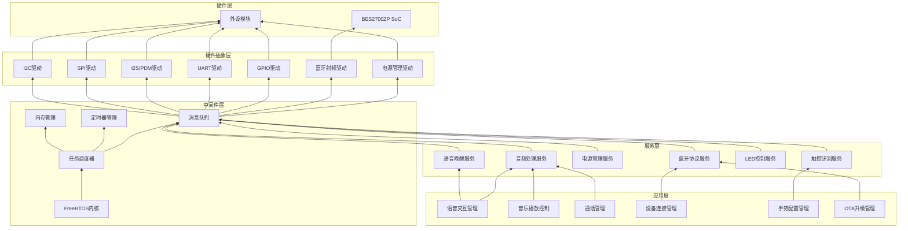

### 1.2 任务优先级分配

**[推理]** 基于实时性需求分析：

| 任务名称 | 优先级 | 周期 | 执行时间 | 说明 |
|----------|--------|------|----------|------|
| 蓝牙协议栈 | 1 (最高) | 事件触发 | <5ms | 保证连接稳定性 |
| 音频采集/播放 | 2 | 1ms (1kHz) | <0.5ms | 48kHz音频处理 |
| 触控检测 | 3 | 10ms | <1ms | 触控响应 |
| 语音唤醒 | 4 | 100ms | <10ms | 边缘AI推理 |
| LED控制 | 5 | 50ms | <0.5ms | 灯效更新 |
| 电源管理 | 6 | 1000ms | <5ms | 电量监测 |
| 日志输出 | 7 (最低) | 100ms | <2ms | 调试信息 |

### 1.3 内存分配策略

**[推理]** 基于BES2700ZP内置1MB+ SRAM：

| 内存区域 | 大小 | 用途 | 来源 |
|----------|------|------|------|
| 代码区 (Code) | 512KB | 固件程序存储 | **[推理]** |
| 数据区 (Data) | 256KB | 全局变量、堆 | **[推理]** |
| 栈区 (Stack) | 128KB | 任务栈空间 | **[推理]** |
| 音频缓冲区 | 64KB | PCM音频缓冲 | **[推理]** |
| 保留区 | 64KB | 系统保留 | **[推理]** |

---

## II. 功能模块定义

### 2.1 系统启动模块 (Boot Module)

#### 2.1.1 启动流程

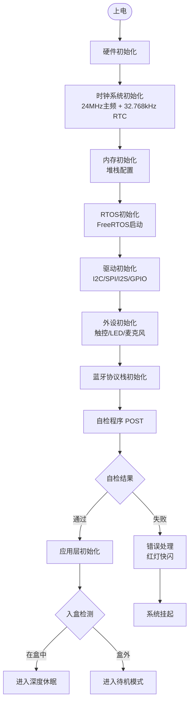

#### 2.1.2 自检项目 (POST)

| 检查项 | 检查内容 | 失败处理 | 来源 |
|--------|----------|----------|------|
| 内存自检 | SRAM读写测试 | 红灯快闪2次 | **[推理]** |
| 存储自检 | Flash读写测试 | 红灯快闪3次 | **[推理]** |
| 音频自检 | 扬声器/麦克风测试 | 红灯快闪4次 | **[推理]** |
| 传感器自检 | 触控/霍尔检测 | 红灯快闪5次 | **[推理]** |
| 蓝牙自检 | 射频回路测试 | 红灯快闪6次 | **[推理]** |
| 电池自检 | 电压/电流检测 | 红灯快闪7次 | **[推理]** |

### 2.2 蓝牙连接管理模块

#### 2.2.1 连接状态机

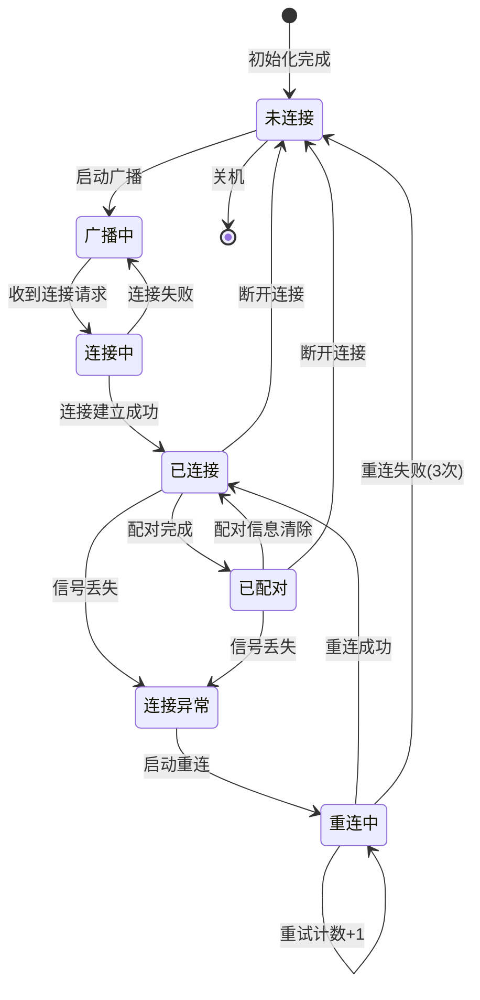

#### 2.2.2 双设备管理逻辑

**[事实]** 支持同时连接2台设备：

```
双设备连接优先级规则:

1. 设备角色定义:
   - 主设备: 第一个配对的设备
   - 副设备: 第二个配对的设备

2. 音频抢占规则:
   - 通话 > 音乐 (任意设备)
   - 后发起的通话可抢占先存在的音乐
   - 双设备同时通话时，先响铃的优先

3. 连接维护:
   - 主设备断开时，保持副设备连接
   - 副设备断开时，保持主设备连接
   - 两设备都断开时，进入广播模式

4. 重连策略:
   - 优先重连主设备
   - 主设备重连成功后，再尝试重连副设备
   - 重连间隔: 1s, 2s, 4s (指数退避)
```

### 2.3 语音交互模块

#### 2.3.1 语音唤醒引擎

**[事实]** 支持"豆包豆包"语音唤醒：

| 参数 | 规格 | 实现方式 | 来源 |
|------|------|----------|------|
| 唤醒词 | "豆包豆包" | 边缘AI模型 | **[事实]** |
| 唤醒率 | ≥95% | 神经网络推理 | **[推理]** |
| 误唤醒率 | ≤1次/24h | 阈值自适应 | **[推理]** |
| 响应延迟 | ≤500ms | 本地处理 | **[推理]** |
| 运行功耗 | ≤5mW | 低功耗DSP | **[推理]** |

#### 2.3.2 语音交互流程

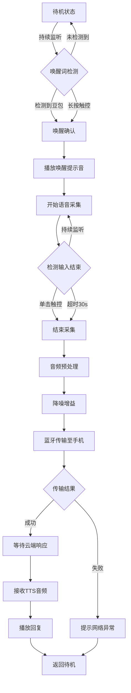

### 2.4 触控识别模块

#### 2.4.1 触控事件处理

**[事实]** 支持单击/双击/三击/长按/滑动：

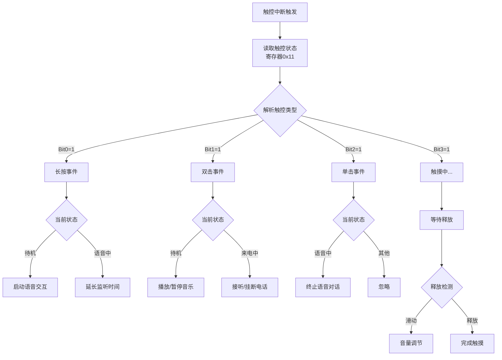

#### 2.4.2 触控防误触逻辑

| 场景 | 防误触策略 | 实现方式 | 来源 |
|------|------------|----------|------|
| 佩戴误触 | 入盒检测屏蔽 | 霍尔传感器状态判断 | **[推理]** |
| 运动误触 | 加速度阈值过滤 | 运动状态检测 | **[推理]** |
| 连续误触 | 冷却时间机制 | 300ms冷却窗口 | **[推理]** |
| 边缘误触 | 区域识别算法 | 触控坐标过滤 | **[推理]** |

### 2.5 音频处理模块

#### 2.5.1 音频通路管理

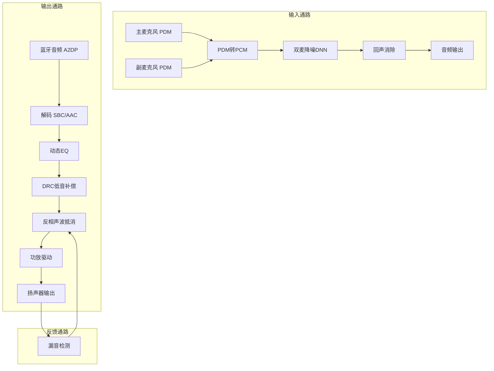

#### 2.5.2 音频模式切换

| 模式 | 输入通路 | 输出通路 | 特殊处理 | 来源 |
|------|----------|----------|----------|------|
| 音乐播放 | 关闭 | 蓝牙→EQ→DRC→扬声器 | 反相声波抵消 | **[事实]** |
| 通话上行 | 双麦→降噪→蓝牙 | 关闭 | 回声消除 | **[事实]** |
| 通话下行 | 关闭 | 蓝牙→EQ→扬声器 | 侧音混合 | **[推理]** |
| 语音交互 | 双麦→降噪→蓝牙 | 蓝牙→TTS→扬声器 | 全双工 | **[事实]** |
| 待机 | 唤醒词监听 | 关闭 | 低功耗模式 | **[推理]** |

### 2.6 电源管理模块

#### 2.6.1 功耗状态机

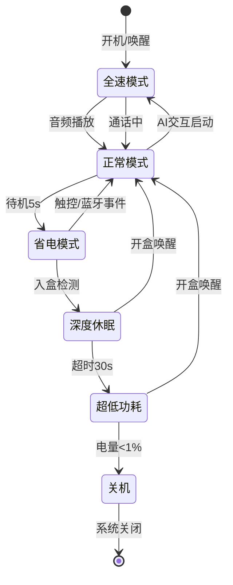

#### 2.6.2 功耗模式参数

| 模式 | CPU频率 | 外设状态 | 功耗 | 唤醒时间 | 来源 |
|------|---------|----------|------|----------|------|
| 全速模式 | 300MHz | 全开 | 30mW | - | **[推理]** |
| 正常模式 | 150MHz | 音频/蓝牙开 | 15mW | - | **[推理]** |
| 省电模式 | 48MHz | 仅蓝牙维持 | 5mW | <10ms | **[推理]** |
| 深度休眠 | 32kHz | 仅RTC/中断 | 100μW | <50ms | **[推理]** |
| 超低功耗 | 停止 | 仅霍尔检测 | 25μW | <100ms | **[推理]** |

---

## III. 用户交互与状态机

### 3.1 全局设备状态机

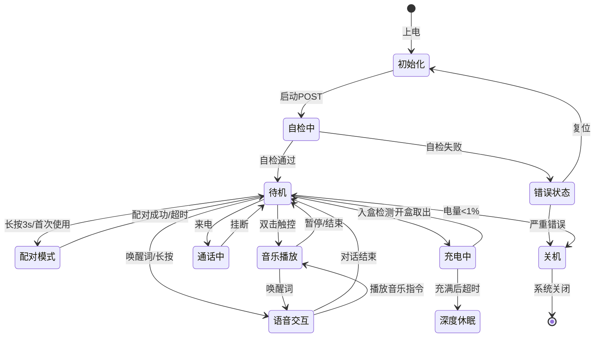

### 3.2 LED灯语状态定义

**[推理]** 基于ICD寄存器0x20-0x24控制：

| 设备状态 | LED颜色 | 灯效模式 | 寄存器配置 | 来源 |
|----------|---------|----------|------------|------|
| 开机 | 绿色 | 常亮1s | MODE=00, G=255, 1s后关闭 | **[推理]** |
| 关机 | 红色 | 常亮1s | MODE=00, R=255, 1s后关闭 | **[推理]** |
| 配对模式 | 白色 | 快闪(4Hz) | MODE=10, R=G=B=255, PERIOD=25 | **[推理]** |
| 连接成功 | 白色 | 常亮0.5s | MODE=00, R=G=B=255, 0.5s后关闭 | **[推理]** |
| 充电中 | 橙色 | 呼吸灯 | MODE=01, R=255,G=128, PERIOD=100 | **[推理]** |
| 充电完成 | 绿色 | 常亮 | MODE=00, G=255 | **[推理]** |
| 低电量 | 红色 | 闪烁(1Hz) | MODE=10, R=255, PERIOD=100 | **[推理]** |
| 语音唤醒 | 蓝色 | 呼吸灯 | MODE=01, B=255, PERIOD=50 | **[推理]** |
| 语音输入中 | 蓝色 | 常亮 | MODE=00, B=255 | **[推理]** |
| 错误状态 | 红色 | 快闪次数 | MODE=10, R=255, 次数=错误码 | **[推理]** |

### 3.3 豆包APP界面逻辑

**[事实]** 基于豆包APP的Ola Friend设备管理：

```
APP首页布局 (ASCII线框图)

┌─────────────────────────────────────────┐
│  ←  Ola Friend 设备管理              [] │  ← 标题栏
├─────────────────────────────────────────┤
│                                         │
│     ┌─────────────────────────┐         │
│     │                         │         │
│     │     [耳机图示]          │         │  ← 设备状态区
│     │                         │         │
│     │   左耳 ●───────● 右耳   │         │
│     │   80%          75%      │         │  ← 电量显示
│     │                         │         │
│     └─────────────────────────┘         │
│                                         │
│  充电盒电量: 60%                        │
│                                         │
├─────────────────────────────────────────┤
│  快捷功能                               │
│  ┌────────┐ ┌────────┐ ┌────────┐      │
│  │  降噪  │ │  EQ    │ │  查找  │      │  ← 功能按钮
│  │  设置  │ │  调节  │ │  耳机  │      │
│  └────────┘ └────────┘ └────────┘      │
├─────────────────────────────────────────┤
│  手势设置                               │
│  ┌─────────────────────────────────┐   │
│  │ 双击左耳  ▶  播放/暂停         │   │  ← 手势列表
│  │ 双击右耳  ▶  播放/暂停         │   │
│  │ 长按左耳  ▶  语音助手          │   │
│  │ 长按右耳  ▶  语音助手          │   │
│  └─────────────────────────────────┘   │
├─────────────────────────────────────────┤
│  更多设置                               │
│  ┌─────────────────────────────────┐   │
│  │  固件升级  >                    │   │
│  │  设备信息  >                    │   │
│  │  使用帮助  >                    │   │
│  │  恢复出厂  >                    │   │
│  └─────────────────────────────────┘   │
│                                         │
└─────────────────────────────────────────┘
```

### 3.4 异常处理逻辑

| 异常场景 | 检测方式 | 软件处理 | 用户提示 | 来源 |
|----------|----------|----------|----------|------|
| 蓝牙断连 | 连接状态监控 | 自动重连3次 | 无(静默) | **[推理]** |
| 重连失败 | 重连计数器 | 进入配对模式 | 白灯快闪 | **[推理]** |
| 网络异常 | 数据传输超时 | 缓存数据，提示重试 | "网络不太顺畅" | **[事实]** |
| 电量低(<20%) | ADC电压检测 | 降低功耗，准备休眠 | 红灯闪烁+语音提示 | **[推理]** |
| 电量极低(<5%) | ADC电压检测 | 保存状态，安全关机 | "电量不足，即将关机" | **[推理]** |
| 充电异常 | 充电电流异常 | 停止充电，保护电池 | 红灯快闪 | **[推理]** |
| 温度过高 | 温度传感器 | 暂停充电/降低音量 | "温度过高" | **[推理]** |
| 麦克风异常 | 音频检测 | 切换单麦模式 | "请清洁麦克风" | **[事实]** |
| OTA失败 | 校验失败 | 自动回滚 | "升级失败，请重试" | **[推理]** |

---

## IV. 算法与数据处理

### 4.1 通话降噪算法

**[事实]** 双麦克风智能降噪算法：

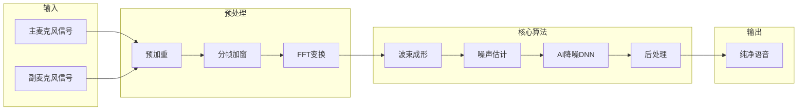

#### 4.1.1 算法参数

| 参数 | 值 | 说明 | 来源 |
|------|-----|------|------|
| 采样率 | 16kHz | 通话语音 | **[推理]** |
| 帧长 | 20ms | 处理粒度 | **[推理]** |
| 帧移 | 10ms | 50%重叠 | **[推理]** |
| FFT点数 | 512 | 频域分析 | **[推理]** |
| 降噪深度 | ≥20dB | 稳态噪声 | **[事实]** |
| 算法延迟 | ≤20ms | 端到端 | **[事实]** |

### 4.2 语音唤醒算法

#### 4.2.1 唤醒引擎架构

```
语音唤醒处理流程

┌─────────────────────────────────────────────────────────────┐
│  音频输入 (16kHz, 16bit)                                    │
│       │                                                     │
│       ▼                                                     │
│  ┌─────────────┐                                           │
│  │  特征提取   │  MFCC/Mel滤波器组                          │
│  │  40维特征   │  25ms帧长, 10ms帧移                        │
│  └──────┬──────┘                                           │
│         │                                                   │
│         ▼                                                   │
│  ┌─────────────┐                                           │
│  │  神经网络   │  轻量级CNN/RNN模型                          │
│  │  推理引擎   │  运行在DSP核心                              │
│  └──────┬──────┘                                           │
│         │                                                   │
│         ▼                                                   │
│  ┌─────────────┐                                           │
│  │  唤醒词检测 │  "豆包豆包" 置信度阈值                      │
│  │  置信度>0.9 │  触发唤醒中断                               │
│  └──────┬──────┘                                           │
│         │                                                   │
│         ▼                                                   │
│  唤醒事件 → 主控中断 → 启动语音交互流程                      │
└─────────────────────────────────────────────────────────────┘
```

#### 4.2.2 性能指标

| 指标 | 目标值 | 测试条件 | 来源 |
|------|--------|----------|------|
| 唤醒率 | ≥95% | 安静环境, 1米距离 | **[推理]** |
| 误唤醒率 | ≤1次/24h | 日常环境 | **[推理]** |
| 响应延迟 | ≤500ms | 从语音结束到唤醒 | **[推理]** |
| 功耗 | ≤5mW | 持续监听状态 | **[推理]** |

### 4.3 动态EQ与DRC算法

**[事实]** 动态EQ1.0和DRC低音补偿：

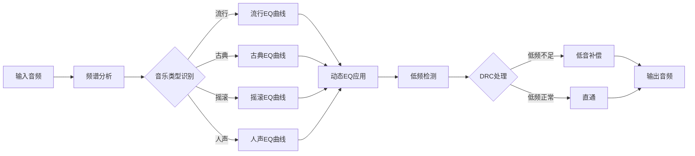

---

## V. OTA与固件管理

### 5.1 OTA升级流程

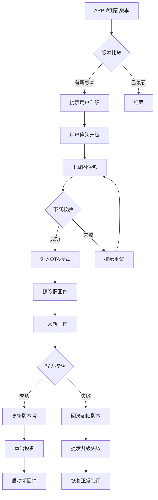

### 5.2 固件安全机制

| 机制 | 实现方式 | 说明 | 来源 |
|------|----------|------|------|
| 签名验证 | RSA/ECDSA | 固件包数字签名 | **[推理]** |
| 版本校验 | 版本号比较 | 防止降级攻击 | **[推理]** |
| CRC校验 | 32位CRC | 数据完整性 | **[推理]** |
| 双区备份 | A/B分区 | 失败可回滚 | **[推理]** |
| 断电保护 | 原子写入 | 断电不损坏 | **[推理]** |

### 5.3 固件版本管理

| 版本字段 | 格式 | 示例 | 说明 | 来源 |
|----------|------|------|------|------|
| 主版本 | X | 1 | 重大更新 | **[推理]** |
| 次版本 | Y | 2 | 功能新增 | **[推理]** |
| 修订版本 | Z | 3 | Bug修复 | **[推理]** |
| 构建号 | B | 456 | CI构建编号 | **[推理]** |
| 完整版本 | X.Y.Z.B | 1.2.3.456 | - | **[推理]** |

---

## 附录

### A. 任务调度配置

```c
// FreeRTOS任务配置示例 (伪代码)

// 任务优先级定义
typedef enum {
    TASK_PRIO_BT_STACK = 1,      // 蓝牙协议栈 (最高)
    TASK_PRIO_AUDIO = 2,         // 音频处理
    TASK_PRIO_TOUCH = 3,         // 触控检测
    TASK_PRIO_VOICE_WAKEUP = 4,  // 语音唤醒
    TASK_PRIO_LED = 5,           // LED控制
    TASK_PRIO_POWER = 6,         // 电源管理
    TASK_PRIO_LOG = 7            // 日志输出 (最低)
} TaskPriority_t;

// 任务创建参数
TaskConfig_t taskConfigs[] = {
    {"BT_Stack", 4096, TASK_PRIO_BT_STACK, 10},
    {"Audio", 2048, TASK_PRIO_AUDIO, 1},
    {"Touch", 1024, TASK_PRIO_TOUCH, 10},
    {"VoiceWakeup", 2048, TASK_PRIO_VOICE_WAKEUP, 100},
    {"LED", 512, TASK_PRIO_LED, 50},
    {"Power", 1024, TASK_PRIO_POWER, 1000},
    {"Log", 512, TASK_PRIO_LOG, 100}
};
```

### B. 消息队列定义

| 队列名称 | 消息大小 | 队列深度 | 生产者 | 消费者 | 来源 |
|----------|----------|----------|--------|--------|------|
| qTouchEvent | 4字节 | 10 | 触控中断 | 触控服务 | **[推理]** |
| qAudioIn | 512字节 | 20 | PDM驱动 | 音频处理 | **[推理]** |
| qAudioOut | 512字节 | 20 | 蓝牙服务 | I2S驱动 | **[推理]** |
| qBLECmd | 32字节 | 10 | 蓝牙协议栈 | 应用层 | **[推理]** |
| qVoiceData | 1024字节 | 50 | 音频采集 | 蓝牙传输 | **[推理]** |
| qPowerEvent | 4字节 | 5 | 电源中断 | 电源服务 | **[推理]** |

### C. 软件模块依赖关系

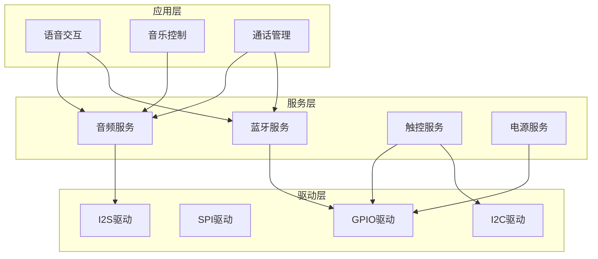

### D. 术语表

| 术语 | 说明 |
|------|------|
| HAL | Hardware Abstraction Layer，硬件抽象层 |
| RTOS | Real-Time Operating System，实时操作系统 |
| ISR | Interrupt Service Routine，中断服务程序 |
| DMA | Direct Memory Access，直接内存访问 |
| PDM | Pulse Density Modulation，脉冲密度调制 |
| PCM | Pulse Code Modulation，脉冲编码调制 |
| DRC | Dynamic Range Compression，动态范围压缩 |
| EQ | Equalizer，均衡器 |
| OTA | Over-The-Air，空中升级 |
| POST | Power-On Self Test，上电自检 |
| DNN | Deep Neural Network，深度神经网络 |
| MFCC | Mel-Frequency Cepstral Coefficients，梅尔频率倒谱系数 |

### E. 参考文档

1. FreeRTOS官方文档: https://www.freertos.org/
2. BES2700ZP SDK开发指南
3. 蓝牙Core Specification v5.4
4. 语音唤醒算法技术白皮书
5. 双麦降噪算法设计规范

---

**文档维护记录**

| 版本 | 日期 | 修改内容 | 作者 |
|------|------|----------|------|
| v1.0 | 2025-10 | 初始版本 | SRS自动生成 |

---

*本文档基于Ola Friend智能耳机调研报告、产品需求文档和接口控制文档生成，包含[事实]、[关联]和[推理]三类信息，请在设计开发过程中以实际测试结果为准。*
