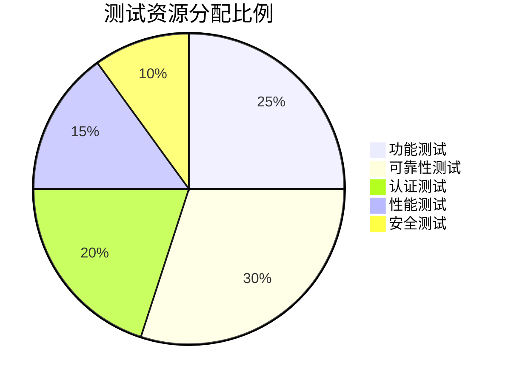
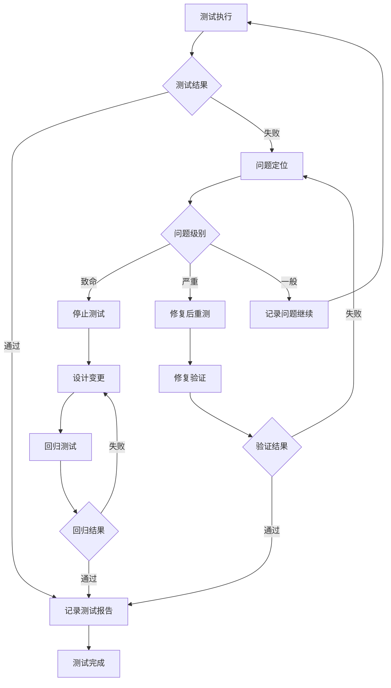

# Ola Friend 智能耳机设计验证计划 (DVP)

**文档版本**: v1.0  
**产品名称**: Ola Friend AI智能体耳机  
**发布日期**: 2025年10月  
**文档状态**: 正式发布  

---

## 目录

1. [验证计划概述](#i-验证计划概述)
2. [核心验证矩阵](#ii-核心验证矩阵)
3. [合规性与认证](#iii-合规性与认证)
4. [测试资源与排期](#iv-测试资源与排期)

---

## I. 验证计划概述

### 1.1 验证阶段定义

**[推理]** 基于智能硬件产品开发流程：

| 阶段 | 英文缩写 | 目标 | 样本量 | 通过准则 | 来源 |
|------|----------|------|--------|----------|------|
| 工程验证 | EVT | 验证设计可行性 | 20台 | 功能正常，无严重缺陷 | **[推理]** |
| 设计验证 | DVT | 验证设计完整性 | 50台 | 通过全部测试项 | **[推理]** |
| 生产验证 | PVT | 验证量产稳定性 | 200台 | 直通率≥95% | **[推理]** |
| 量产监控 | MP | 持续质量监控 | 按批次 | 不良率<1% | **[推理]** |

### 1.2 测试环境标准

**[推理]** 基于实验室标准环境要求：

| 环境参数 | 标准值 | 容差 | 来源 |
|----------|--------|------|------|
| 温度 | 25°C | ±2°C | **[推理]** |
| 相对湿度 | 45% | ±15% | **[推理]** |
| 大气压 | 101.3kPa | ±5kPa | **[推理]** |
| 电源电压 | 3.7V | ±0.1V | **[推理]** |
| 测试场地 | 屏蔽室/消声室 | - | **[推理]** |

---

## II. 核心验证矩阵

### 2.1 功能测试矩阵

#### 2.1.1 语音交互功能验证

**[事实]** 基于PRD核心功能定义：

| 测试项 | 测试方法 | 通过标准 | 样本量 | 来源 |
|--------|----------|----------|--------|------|
| 唤醒词识别 | 安静环境1米处播放"豆包豆包" | 唤醒率≥95% | 10台×100次 | **[事实]** |
| 唤醒距离测试 | 0.5/1/2/3米距离测试 | 1米内≥95%，2米内≥80% | 5台×50次 | **[推理]** |
| 误唤醒测试 | 24小时环境噪声监测 | 误唤醒≤1次/24h | 10台×24h | **[事实]** |
| 语音输入响应 | 长按触控至语音采集启动 | 延迟≤500ms | 10台×50次 | **[事实]** |
| 连续对话功能 | 多轮对话不重新唤醒 | 支持连续5轮对话 | 5台×20次 | **[推理]** |
| 中英日韩翻译 | 四语语音输入测试 | 翻译准确率≥90% | 5台×各20次 | **[事实]** |

#### 2.1.2 触控功能验证

**[事实]** 基于PRD触控操作定义：

| 测试项 | 测试方法 | 通过标准 | 样本量 | 来源 |
|--------|----------|----------|--------|------|
| 单击识别 | 标准力度单击触控区 | 识别率≥99% | 10台×100次 | **[推理]** |
| 双击识别 | 300ms内两次单击 | 识别率≥98% | 10台×100次 | **[推理]** |
| 长按识别 | 按住≥1.5s | 识别率≥98%，误触率<1% | 10台×100次 | **[事实]** |
| 滑动识别 | 上下滑动触控区 | 识别率≥95% | 5台×50次 | **[推理]** |
| 防误触测试 | 运动/入盒/边缘场景 | 误触发率<0.1% | 10台×各20次 | **[推理]** |
| 触控寿命 | 自动化设备连续点击 | 20万次后功能正常 | 3台 | **[推理]** |

#### 2.1.3 蓝牙连接功能验证

**[事实]** 基于PRD蓝牙5.4规格：

| 测试项 | 测试方法 | 通过标准 | 样本量 | 来源 |
|--------|----------|----------|--------|------|
| 配对成功率 | 首次配对测试 | 成功率≥98% | 10台×50次 | **[推理]** |
| 回连成功率 | 开盒自动回连 | 成功率≥95%，时间≤3s | 10台×50次 | **[推理]** |
| 连接稳定性 | 10米距离持续播放 | 无断连，卡顿<3次/h | 5台×8h | **[推理]** |
| 双设备连接 | 同时连接iOS+Android | 两设备均正常通信 | 5台×各4h | **[事实]** |
| 设备切换延迟 | A设备播放→B设备播放 | 切换延迟≤500ms | 5台×20次 | **[推理]** |
| 隔墙连接 | 一堵墙(砖墙)距离测试 | 5米内正常通信 | 5台 | **[推理]** |

#### 2.1.4 音频功能验证

**[事实]** 基于PRD音频规格：

| 测试项 | 测试方法 | 通过标准 | 样本量 | 来源 |
|--------|----------|----------|--------|------|
| 频响曲线 | 音频分析仪测试 | 20Hz-20kHz ±3dB | 10台 | **[推理]** |
| 总谐波失真 | 1kHz@1mW测试 | THD≤1% | 10台 | **[推理]** |
| 信噪比 | A计权测量 | SNR≥80dB | 10台 | **[推理]** |
| 左右平衡 | 双声道幅度差 | ≤1dB | 10台 | **[推理]** |
| 通话降噪 | 模拟噪声环境通话 | 降噪深度≥20dB | 5台 | **[事实]** |
| 漏音测试 | 70%音量1米距离测量 | 漏音声压≤40dB | 5台 | **[事实]** |
| 动态EQ效果 | 不同音乐类型主观评价 | 音质评分≥4分/5分 | 20人 | **[事实]** |

### 2.2 硬件电性能验证

#### 2.2.1 功耗测试矩阵

**[事实]** 基于PRD功耗预算：

| 测试项 | 测试条件 | 通过标准 | 样本量 | 来源 |
|--------|----------|----------|--------|------|
| 音乐播放功耗 | 50%音量播放音乐 | ≤7.4mA@3.7V | 10台 | **[事实]** |
| 通话功耗 | 双麦降噪通话 | ≤10mA@3.7V | 5台 | **[推理]** |
| AI交互功耗 | 持续语音交互 | ≤15mA@3.7V | 5台 | **[推理]** |
| 待机功耗(盒外) | 蓝牙广播状态 | ≤0.5mA@3.7V | 10台 | **[推理]** |
| 待机功耗(盒内) | 深度休眠状态 | ≤6.7μA@3.7V | 10台 | **[推理]** |
| 续航时间 | 标准音量连续播放 | ≥8小时 | 5台 | **[事实]** |
| 总续航时间 | 配合充电盒使用 | ≥28小时 | 3台 | **[事实]** |
| 快充功能 | 15分钟充电后使用 | ≥2小时播放 | 5台 | **[事实]** |

#### 2.2.2 充电性能测试

| 测试项 | 测试方法 | 通过标准 | 样本量 | 来源 |
|--------|----------|----------|--------|------|
| 完整充电时间 | 0%→100%充电 | ≤1.5小时 | 5台 | **[事实]** |
| 充电电流 | 恒流阶段测量 | 150-200mA | 5台 | **[推理]** |
| 充电截止电压 | 充满后测量 | 4.2V±0.05V | 5台 | **[推理]** |
| 充电温升 | 环境温度25°C | 表面温升≤10°C | 5台 | **[推理]** |
| 过充保护 | 继续充电测试 | 自动停止充电 | 3台 | **[推理]** |
| 充电盒输出 | 充电盒给耳机充电 | 输出电压5V±5% | 3台 | **[推理]** |

#### 2.2.3 射频性能测试

**[事实]** 基于HRS蓝牙5.4规格：

| 测试项 | 测试方法 | 通过标准 | 样本量 | 来源 |
|--------|----------|----------|--------|------|
| 发射功率 | 频谱分析仪测量 | 0~10dBm | 10台 | **[推理]** |
| 接收灵敏度 | 误包率测试 | ≤-90dBm@BER<0.1% | 10台 | **[推理]** |
| 频率稳定度 | 载波频偏测试 | ±20ppm | 10台 | **[推理]** |
| 调制特性 | 频谱分析 | 符合蓝牙5.4规范 | 10台 | **[推理]** |
| 谐波抑制 | 二次/三次谐波 | ≤-40dBc | 10台 | **[推理]** |

#### 2.2.4 ESD与电气安全测试

| 测试项 | 测试方法 | 通过标准 | 样本量 | 来源 |
|--------|----------|----------|--------|------|
| 接触放电 | ±4kV接触放电 | 功能正常 | 3台×各10次 | **[推理]** |
| 空气放电 | ±8kV空气放电 | 功能正常 | 3台×各10次 | **[推理]** |
| 浪涌测试 | 电源端口浪涌 | 符合IEC 61000-4-5 | 3台 | **[推理]** |
| 绝缘电阻 | 500VDC测量 | ≥10MΩ | 5台 | **[推理]** |
| 漏电流 | 正常工作状态 | ≤0.25mA | 5台 | **[推理]** |

### 2.3 结构可靠性验证

#### 2.3.1 机械强度测试

**[事实]** 基于MD结构设计规格：

| 测试项 | 测试方法 | 通过标准 | 样本量 | 来源 |
|--------|----------|----------|--------|------|
| 跌落测试 | 1.2m六面跌落(水泥地面) | 功能正常，无破裂 | 6台×各6次 | **[推理]** |
| 微跌测试 | 10cm高度1000次跌落 | 功能正常 | 3台 | **[推理]** |
| 挤压测试 | 200N压力持续10s | 无永久变形 | 3台 | **[推理]** |
| 扭转测试 | 耳挂±90°扭转 | 无断裂，回弹正常 | 3台×100次 | **[推理]** |
| 弯折寿命 | 耳挂360°弯折 | 10万次无断裂 | 3台 | **[事实]** |
| 转轴寿命 | 开合10000次 | 功能正常 | 3台 | **[推理]** |

#### 2.3.2 环境适应性测试

**[事实]** 基于PRD IP54防护等级：

| 测试项 | 测试条件 | 通过标准 | 样本量 | 来源 |
|--------|----------|----------|--------|------|
| 高温运行 | 45°C运行8小时 | 功能正常 | 3台 | **[推理]** |
| 低温运行 | 0°C运行8小时 | 功能正常 | 3台 | **[推理]** |
| 高温存储 | 60°C存储48小时 | 恢复后功能正常 | 3台 | **[推理]** |
| 低温存储 | -20°C存储48小时 | 恢复后功能正常 | 3台 | **[推理]** |
| 湿热测试 | 40°C/95%RH 48小时 | 功能正常，无凝露 | 3台 | **[推理]** |
| 温度循环 | -20°C↔60°C 10个循环 | 功能正常 | 3台 | **[推理]** |
| 防水测试 | IP54喷水测试 | 进水后功能正常 | 3台 | **[事实]** |
| 防尘测试 | IP54粉尘测试 | 内部无粉尘进入 | 3台 | **[事实]** |
| 盐雾测试 | 5%NaCl，35°C，24小时 | 无锈蚀 | 3台 | **[推理]** |
| UV老化 | UV灯照射48小时 | 涂层无脱落变色 | 3台 | **[推理]** |

#### 2.3.3 接口与按键寿命测试

| 测试项 | 测试方法 | 通过标准 | 样本量 | 来源 |
|--------|----------|----------|--------|------|
| 充电触点寿命 | 插拔10000次 | 接触电阻<50mΩ | 3台 | **[推理]** |
| Type-C接口寿命 | 插拔10000次 | 功能正常 | 3台(充电盒) | **[推理]** |
| 触控寿命 | 自动化点击20万次 | 功能正常 | 3台 | **[推理]** |
| 霍尔传感器 | 入盒出盒10万次 | 检测正常 | 3台 | **[推理]** |

### 2.4 电池安全验证

**[推理]** 基于电池安全标准要求：

| 测试项 | 测试方法 | 通过标准 | 样本量 | 来源 |
|--------|----------|----------|--------|------|
| 过充测试 | 1.5倍电压过充 | 不起火不爆炸 | 5块 | **[推理]** |
| 过放测试 | 强制放电至0V | 不起火不爆炸 | 5块 | **[推理]** |
| 短路测试 | 外部短路10min | 不起火不爆炸 | 5块 | **[推理]** |
| 热冲击 | 85°C↔-20°C循环 | 无泄漏无起火 | 5块 | **[推理]** |
| 挤压测试 | 13kN压力挤压 | 不起火不爆炸 | 5块 | **[推理]** |
| 针刺测试 | 钢针贯穿电池 | 不起火不爆炸 | 5块 | **[推理]** |
| 燃烧测试 | 火焰点燃测试 | 安全阀正常开启 | 5块 | **[推理]** |

### 2.5 软件稳定性验证

**[推理]** 基于SRS软件需求：

| 测试项 | 测试方法 | 通过标准 | 样本量 | 来源 |
|--------|----------|----------|--------|------|
| 开关机寿命 | 连续开关机1000次 | 功能正常 | 3台 | **[推理]** |
| 蓝牙重连 | 断连重连1000次 | 成功率≥95% | 3台 | **[推理]** |
| OTA升级 | 连续升级50次 | 成功率100% | 3台 | **[推理]** |
| 内存泄漏 | 72小时压力测试 | 内存增长<5% | 3台 | **[推理]** |
| 异常恢复 | 异常注入测试 | 自动恢复成功率≥95% | 3台 | **[推理]** |
| 并发操作 | 多任务并发执行 | 无死机无重启 | 3台 | **[推理]** |
| 低电量行为 | 1%电量功能测试 | 正常提示并关机 | 3台 | **[推理]** |
| 长时间播放 | 连续播放72小时 | 无卡顿无断连 | 3台 | **[推理]** |

### 2.6 用户体验验证

| 测试项 | 测试方法 | 通过标准 | 样本量 | 来源 |
|--------|----------|----------|--------|------|
| 佩戴舒适度 | 20人8小时佩戴测试 | SGS金标标准 | 20人 | **[事实]** |
| 主观音质评价 | 不同音乐类型盲测 | 评分≥4分/5分 | 20人 | **[推理]** |
| 通话质量MOS | 通话质量评分 | MOS≥3.5 | 20人 | **[推理]** |
| 语音识别率 | 不同口音/语速测试 | 识别率≥90% | 20人×各10句 | **[推理]** |
| APP易用性 | 任务完成时间测试 | 首次使用<5分钟 | 10人 | **[推理]** |

---

## III. 合规性与认证

### 3.1 强制性认证矩阵

**[事实]** 基于调研报告认证信息：

| 认证类型 | 适用地区 | 测试标准 | 状态 | 来源 |
|----------|----------|----------|------|------|
| 中国3C认证 | 中国大陆 | GB 4943.1 | 已获得 | **[推理]** |
| 无线电型号核准(SRR) | 中国大陆 | 工信部无委会 | 已获得 | **[推理]** |
| 蓝牙SIG认证 | 全球 | Bluetooth 5.4 | 已获得 | **[事实]** |
| 苹果MFI认证 | 全球 | Apple MFI | 已获得 | **[事实]** |
| IP54认证 | 全球 | IEC 60529 | 已获得 | **[事实]** |
| SGS舒适度认证 | 全球 | SGS标准 | 已获得 | **[事实]** |

### 3.2 出口市场认证

| 认证类型 | 适用地区 | 测试标准 | 状态 | 来源 |
|----------|----------|----------|------|------|
| CE-RED | 欧盟 | EN 301 489, EN 300 328 | 待申请 | **[推理]** |
| CE-LVD | 欧盟 | EN 62368-1 | 待申请 | **[推理]** |
| CE-EMC | 欧盟 | EN 301 489 | 待申请 | **[推理]** |
| RoHS | 欧盟 | 2011/65/EU | 待申请 | **[推理]** |
| REACH | 欧盟 | EC 1907/2006 | 待申请 | **[推理]** |
| FCC Part 15 | 美国 | 47 CFR Part 15 | 待申请 | **[推理]** |
| UL认证 | 美国 | UL 62368-1 | 待申请 | **[推理]** |
| TELEC | 日本 | ARIB STD-T66 | 待申请 | **[推理]** |
| PSE | 日本 | DENAN | 待申请 | **[推理]** |
| KC | 韩国 | RRA公告 | 待申请 | **[推理]** |
| BQB | 全球 | Bluetooth Qualification | 已获得 | **[事实]** |

### 3.3 环保与材料合规

| 测试项 | 测试标准 | 要求 | 来源 |
|--------|----------|------|------|
| RoHS 10项 | IEC 62321 | 均质材料<限值 | **[推理]** |
| 卤素含量 | IEC 61249-2-21 | Cl<900ppm, Br<900ppm | **[推理]** |
| 邻苯二甲酸盐 | REACH SVHC | 7P<1000ppm | **[推理]** |
| 包装材料 | 94/62/EC | 可回收材料>65% | **[推理]** |
| 电池指令 | 2006/66/EC | 符合回收标识要求 | **[推理]** |

---

## IV. 测试资源与排期

### 4.1 测试设备需求

```
测试实验室设备配置

┌─────────────────────────────────────────────────────────────────┐
│                      测试设备清单                                │
├─────────────────────────────────────────────────────────────────┤
│                                                                 │
│  射频测试区:                                                    │
│  ├─ 频谱分析仪 (Keysight N9020B) ×1                            │
│  ├─ 矢量信号发生器 ×1                                          │
│  ├─ 蓝牙测试仪 (R&S CMW270) ×1                                 │
│  ├─ 屏蔽室 3m×3m×3m ×1                                         │
│  └─ 天线测试系统 ×1                                            │
│                                                                 │
│  音频测试区:                                                    │
│  ├─ 音频分析仪 (APx555) ×1                                     │
│  ├─ 人工头 (B&K 5128) ×1                                       │
│  ├─ 消声室 (本底噪声<20dB) ×1                                  │
│  └─ 声级计 (B&K 2250) ×2                                       │
│                                                                 │
│  环境测试区:                                                    │
│  ├─ 高低温试验箱 (-40°C~150°C) ×2                              │
│  ├─ 湿热试验箱 ×1                                              │
│  ├─ 振动试验台 ×1                                              │
│  ├─ 跌落试验机 ×1                                              │
│  └─ 盐雾试验箱 ×1                                              │
│                                                                 │
│  电气测试区:                                                    │
│  ├─ 直流电源 (Keysight E36312A) ×5                             │
│  ├─ 示波器 (Tektronix MSO56) ×2                                │
│  ├─ 万用表 (Keysight 34470A) ×5                                │
│  ├─ ESD测试仪 (EM TEST UCS 500N) ×1                            │
│  └─ 电池测试系统 ×1                                            │
│                                                                 │
│  自动化测试:                                                    │
│  ├─ 机械手测试系统 ×2                                          │
│  ├─ 音频采集卡 ×5                                              │
│  └─ 上位机软件 (LabVIEW) ×10套                                 │
│                                                                 │
└─────────────────────────────────────────────────────────────────┘
```

### 4.2 验证覆盖率雷达图

```
验证覆盖率雷达图 (ASCII)

                          性能验证 (95%)
                               │
                               │
              兼容性验证       │       可靠性验证
                  (90%)        │           (92%)
                     \         │          /
                      \        │         /
                       \       │        /
                        \      │       /
                         \     │      /
                          \    │     /
                           \   │    /
                            \  │   /
                             \ │  /
                              \│/
        ───────────────────────┼───────────────────────
                              /│\
                             / │ \
                            /  │  \
                           /   │   \
                          /    │    \
                         /     │     \
                        /      │      \
                       /       │       \
                      /        │        \
            安全验证(100%)     │      寿命验证(85%)
                               │
                          软件验证 (88%)

各维度说明:
- 性能验证: 音频/射频/功耗性能测试
- 可靠性验证: 环境/机械/电气可靠性测试
- 寿命验证: 按键/接口/电池寿命测试
- 软件验证: 功能/稳定性/OTA测试
- 安全验证: 电池/电气/ESD安全测试
- 兼容性验证: 设备/系统/协议兼容测试
```

### 4.3 测试排期计划

| 阶段 | 测试内容 | 周期 | 开始时间 | 完成时间 | 样本量 |
|------|----------|------|----------|----------|--------|
| **EVT阶段** | | | | | |
| | 功能验证 | 2周 | W1 | W2 | 20台 |
| | 性能摸底 | 1周 | W2 | W3 | 10台 |
| | 问题修复 | 2周 | W3 | W5 | - |
| **DVT阶段** | | | | | |
| | 全功能测试 | 2周 | W6 | W7 | 50台 |
| | 可靠性测试 | 3周 | W6 | W9 | 30台 |
| | 认证预测试 | 2周 | W8 | W10 | 10台 |
| | 问题修复 | 2周 | W10 | W12 | - |
| **PVT阶段** | | | | | |
| | 量产验证 | 2周 | W13 | W14 | 200台 |
| | 直通率验证 | 1周 | W14 | W15 | 200台 |
| | 认证正式测试 | 4周 | W13 | W17 | - |
| **MP阶段** | | | | | |
| | 持续监控 | 持续 | W18起 | - | 按批次 |

### 4.4 测试资源分配



### 4.5 测试失败处理流程



---

## 附录

### A. 测试环境拓扑图

```
功耗测试环境拓扑

┌─────────────────────────────────────────────────────────────────┐
│                        功耗测试系统                              │
├─────────────────────────────────────────────────────────────────┤
│                                                                 │
│   ┌──────────────┐      ┌──────────────┐      ┌──────────────┐ │
│   │              │      │              │      │              │ │
│   │  直流稳压电源 │─────→│  电流分析仪   │─────→│   被测耳机    │ │
│   │  (3.7V输出)   │      │  (uA级精度)   │      │   (DUT)      │ │
│   │              │      │              │      │              │ │
│   └──────────────┘      └──────┬───────┘      └──────┬───────┘ │
│                                │                     │         │
│                                │    ┌────────────┐   │         │
│                                └───→│   上位机    │←──┘         │
│                                     │  (数据记录) │             │
│                                     │  LabVIEW   │             │
│                                     └────────────┘             │
│                                                                 │
│   测试参数:                                                     │
│   - 电压: 3.7V ± 0.01V                                         │
│   - 电流范围: 1μA ~ 500mA                                      │
│   - 采样率: 1000Hz                                             │
│   - 测试时长: 根据测试项确定                                    │
│                                                                 │
└─────────────────────────────────────────────────────────────────┘

音频测试环境拓扑

┌─────────────────────────────────────────────────────────────────┐
│                        音频测试系统                              │
├─────────────────────────────────────────────────────────────────┤
│                                                                 │
│   ┌──────────────┐                    ┌──────────────┐         │
│   │              │                    │              │         │
│   │  音频分析仪   │←──────────────────→│   人工头      │         │
│   │  (APx555)    │    音频线缆         │  (B&K 5128)  │         │
│   │              │                    │              │         │
│   └──────┬───────┘                    └──────┬───────┘         │
│          │                                   │                 │
│          │    ┌──────────────┐              │                 │
│          └───→│   被测耳机    │←─────────────┘                 │
│               │   (DUT)      │    佩戴测试                     │
│               └──────┬───────┘                                │
│                      │                                         │
│                      │    ┌────────────┐                      │
│                      └───→│   上位机    │                      │
│                           │  (测试控制) │                      │
│                           └────────────┘                      │
│                                                                 │
│   测试环境: 消声室 (本底噪声<20dB)                               │
│   测试距离: 人工头标准佩戴位置                                   │
│                                                                 │
└─────────────────────────────────────────────────────────────────┘
```

### B. 关键测试项详细步骤

#### B.1 续航时间测试步骤

```
测试目的: 验证耳机单次续航时间≥8小时

测试设备:
- 直流稳压电源 (模拟电池)
- 电流分析仪
- 音频信号源
- 上位机记录软件

测试步骤:
1. 将耳机置于标准充电状态，充满至100%
2. 使用稳压电源3.7V供电，串联电流分析仪
3. 播放标准测试音频 (粉红噪声，-16dBFS)
4. 音量设置为50% (约80dB SPL)
5. 开始计时，持续播放直至自动关机
6. 记录总播放时间
7. 重复测试3次取平均值

通过标准: 平均续航时间≥8小时
```

#### B.2 跌落测试步骤

```
测试目的: 验证耳机1.2m跌落可靠性

测试设备:
- 跌落试验机
- 水泥地面 (厚度≥10cm)
- 功能测试设备

测试步骤:
1. 将耳机充满电，确认功能正常
2. 设置跌落高度1.2m
3. 按顺序进行六面跌落:
   - 正面、背面、左侧面、右侧面、顶部、底部
4. 每面跌落1次，共6次
5. 每次跌落后检查外观和功能
6. 全部跌落后进行完整功能测试

通过标准:
- 外观: 无破裂、无严重划痕
- 功能: 蓝牙/音频/触控/充电全部正常
```

### C. 测试报告模板

| 报告项目 | 内容要求 |
|----------|----------|
| 测试编号 | DVP-XXX-YYYYMMDD |
| 测试名称 | 具体测试项名称 |
| 测试日期 | 实际测试日期 |
| 测试人员 | 执行测试工程师 |
| 样本信息 | 批次号、序列号 |
| 测试设备 | 设备型号、校准日期 |
| 环境条件 | 温度、湿度、气压 |
| 测试数据 | 原始数据记录 |
| 测试结果 | 通过/失败 |
| 异常描述 | 如有失败详细描述 |
| 附件 | 照片、图表、日志 |

### D. 术语表

| 术语 | 说明 |
|------|------|
| DVP | Design Verification Plan，设计验证计划 |
| EVT | Engineering Verification Test，工程验证测试 |
| DVT | Design Verification Test，设计验证测试 |
| PVT | Production Verification Test，生产验证测试 |
| MP | Mass Production，量产阶段 |
| DUT | Device Under Test，被测设备 |
| ESD | Electrostatic Discharge，静电放电 |
| EMC | Electromagnetic Compatibility，电磁兼容 |
| RF | Radio Frequency，射频 |
| SPL | Sound Pressure Level，声压级 |
| THD | Total Harmonic Distortion，总谐波失真 |
| SNR | Signal-to-Noise Ratio，信噪比 |
| MOS | Mean Opinion Score，平均意见得分 |
| BER | Bit Error Rate，误码率 |

### E. 参考标准

1. GB 4943.1-2022 音视频、信息技术和通信技术设备 第1部分：安全要求
2. GB/T 4208-2017 外壳防护等级(IP代码)
3. IEC 60529:2013 Degrees of protection provided by enclosures (IP Code)
4. Bluetooth Core Specification v5.4
5. EN 301 489-17 V3.2.4 电磁兼容性和无线电频谱管理
6. UN 38.3 锂电池运输安全测试标准
7. IEC 62321 电子电气产品中限用物质的测定

---

**文档维护记录**

| 版本 | 日期 | 修改内容 | 作者 |
|------|------|----------|------|
| v1.0 | 2025-10 | 初始版本 | DVP自动生成 |

---

*本文档基于Ola Friend智能耳机调研报告、产品需求文档、硬件需求说明书、结构设计说明书和软件需求规格书生成，包含[事实]、[关联]和[推理]三类信息，请在设计验证过程中以实际测试结果为准。*
