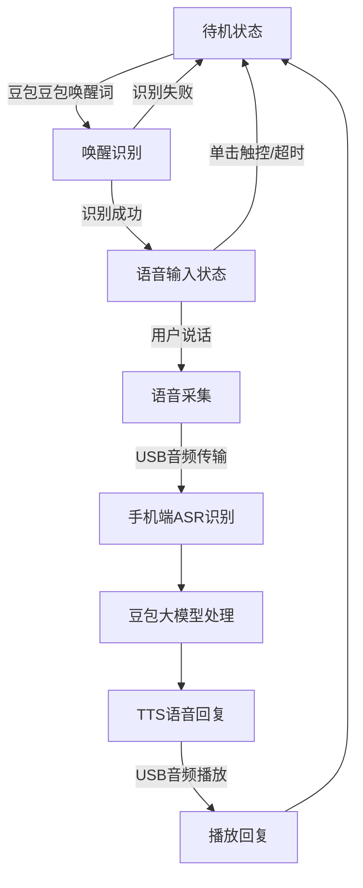
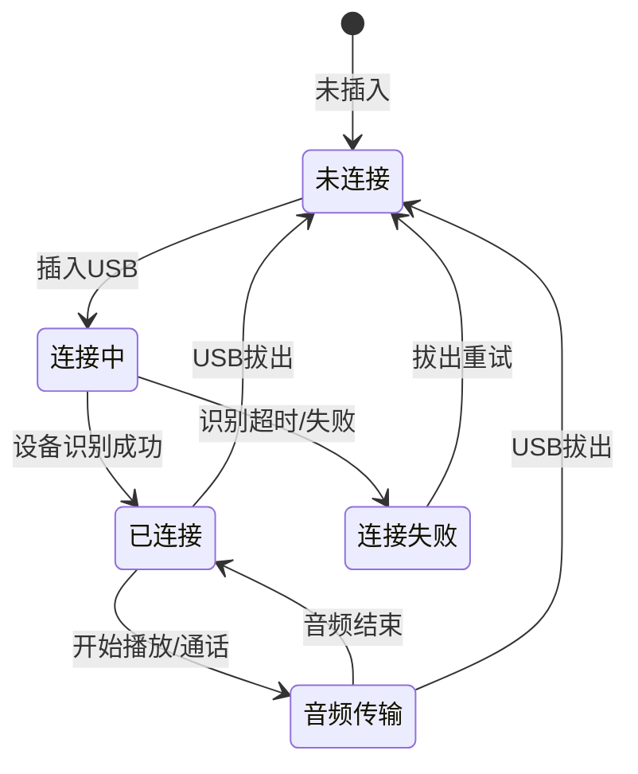
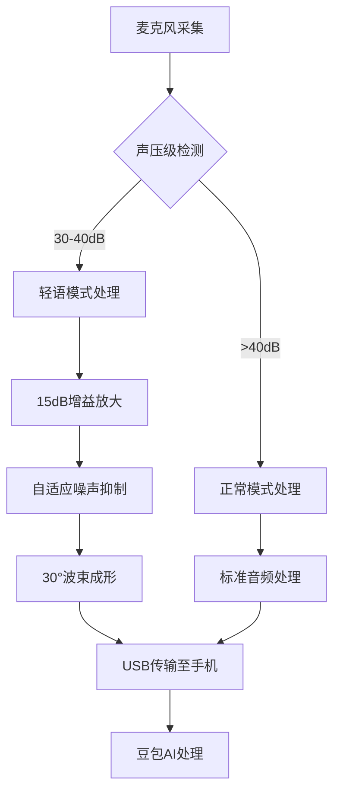
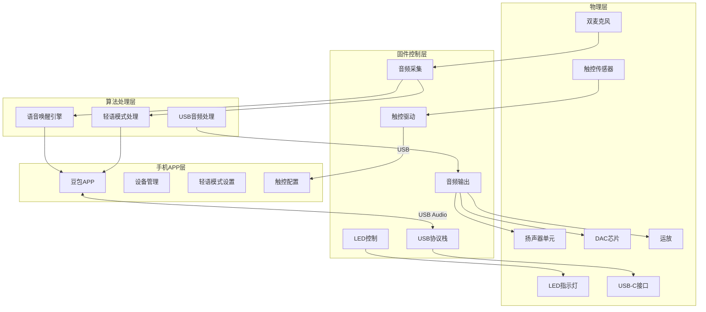
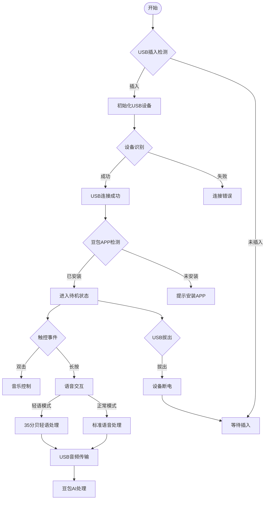

# Ola Friend 智能耳机（有线魔改版）产品需求文档 (PRD)

**文档版本**: v1.0  
**产品名称**: Ola Friend AI智能体耳机（有线版）  
**发布日期**: 2025年10月  
**文档状态**: 正式发布  

---

## 目录

1. [产品定位与目标](#i-产品定位与目标)
2. [功能需求详细定义](#ii-功能需求详细定义)
3. [非功能性需求](#iii-非功能性需求)
4. [系统架构与交互逻辑](#iv-系统架构与交互逻辑)
5. [认证与合规要求](#v-认证与合规要求)

---

## I. 产品定位与目标

### 1.1 市场画像

**[事实]** Ola Friend是字节跳动旗下豆包推出的首款AI智能体耳机，于2024年10月10日正式发布，官方售价1199元人民币。

**有线魔改版定位**：
- **目标用户画像**:
  - **HiFi音质追求者**: 追求无损音频体验，对蓝牙编码压缩敏感
  - **隐私敏感用户**: 需要在公共场合进行私密AI对话，不希望被旁人听到
  - **固定场景使用者**: 主要在办公室、图书馆、家中等固定场所使用
  - **厌倦充电焦虑用户**: 希望即插即用，无需担心电量问题

- **对标竞品**:
  | 竞品 | 售价 | 核心差异 |
  |------|------|----------|
  | 原版Ola Friend | 1199元 | 无线蓝牙，需充电 |
  | 有线HiFi耳机 | 500-2000元 | 无AI功能 |
  | USB-C耳机 | 200-800元 | 无AI交互能力 |

### 1.2 核心卖点 (USP)

**P0 功能 (必须具备)**:
1. **[魔改]** USB-C有线连接，即插即用，无需充电
2. **[魔改]** 35分贝轻语模式，公共场合私密AI交互
3. **[事实]** 豆包AI大模型语音交互 - "豆包豆包"语音唤醒
4. **[事实]** 6.6g超轻开放式佩戴 - SGS舒适度金标认证

**P1 功能 (重要增值)**:
1. **[事实]** 中英日韩四语实时翻译
2. **[魔改]** 24bit/96kHz无损音频传输
3. **[事实]** 英语陪练智能体Owen
4. **[魔改]** 触控操作通过USB-C传输至手机

**P2 功能 (体验优化)**:
1. **[事实]** 旅行导游功能
2. **[事实]** 音乐DJ功能
3. **[事实]** 情绪加油站
4. **[魔改]** 零延迟音频传输

---

## II. 功能需求详细定义

### 2.1 硬件交互逻辑

#### 2.1.1 触控操作定义

**[事实]** 耳机本体的logo区域为触控操作区域，采用全域智能触控。

**[魔改]** 触控指令通过USB-C接口传输至手机处理：

| 操作类型 | 功能定义 | 可自定义 | 延迟要求 |
|----------|----------|----------|----------|
| **单击** | 终止语音对话 | 否 | ≤10ms |
| **双击** | 播放/暂停音乐<br>接听/挂断电话 | 是 | ≤10ms |
| **长按(1.5s)** | 开启单轮语音对话 | 否 | ≤10ms |
| **三击** | 切歌 | 是 | ≤10ms |
| **滑动** | 音量调节 | 是 | ≤10ms |

#### 2.1.2 轻语模式交互逻辑

**[魔改]** 35分贝轻语模式专用交互：

| 模式状态 | 触发条件 | LED指示 | 功能说明 |
|----------|----------|---------|----------|
| 轻语模式开启 | 声压级30-40dB | 蓝色呼吸灯 | 降低拾音灵敏度，聚焦近距离人声 |
| 正常模式 | 声压级>40dB | 无特殊指示 | 标准拾音模式 |
| 手动切换 | APP内开关 | - | 用户可强制开启/关闭轻语模式 |

#### 2.1.3 耳机状态指示灯

**[魔改]** 基于USB供电状态：

| 灯语 | 含义 |
|------|------|
| 白灯快闪 | USB连接初始化中 |
| 白灯常亮1s | USB连接成功 |
| 蓝色呼吸灯 | 轻语模式开启 |
| 蓝色常亮 | 语音输入中 |
| 绿灯常亮1s | 设备识别成功 |
| 红灯常亮1s | USB连接异常 |

### 2.2 软件业务流

#### 2.2.1 语音交互流程

**[魔改]** USB音频传输流程：



#### 2.2.2 USB连接管理逻辑

**[魔改]** USB连接状态机：



#### 2.2.3 轻语模式处理流程

**[魔改]** 轻语模式音频处理：



### 2.3 核心算法逻辑

#### 2.3.1 语音唤醒算法

**[事实]** 支持"豆包豆包"语音唤醒。

**[魔改]** USB供电下的唤醒性能：

| 参数 | 要求 |
|------|------|
| 唤醒词 | "豆包豆包" |
| 唤醒率 | ≥95% (安静环境) |
| 误唤醒率 | ≤1次/24小时 |
| 响应延迟 | ≤500ms |
| 支持距离 | ≤15cm (轻语模式) |

#### 2.3.2 轻语模式降噪算法

**[魔改]** 近距离拾音优化：

```
┌─────────────────────────────────────────────────────────┐
│                    轻语模式降噪系统                       │
├─────────────────────────────────────────────────────────┤
│  主麦克风(近端) ──┐                                     │
│                   ├──→ 15dB增益 ──→ 自适应滤波 ──→ 输出 │
│  副麦克风(远端) ──┘                                     │
├─────────────────────────────────────────────────────────┤
│  功能模块:                                              │
│  1. 近距离聚焦: 30°拾音波束，聚焦嘴部5-15cm区域        │
│  2. 增益控制: 自动增益15dB，提升轻声信噪比             │
│  3. 环境抑制: 自适应滤波抑制背景噪声                   │
│  4. 语音增强: 针对30-40dB声压级优化                    │
└─────────────────────────────────────────────────────────┘
```

**性能指标**:
| 指标 | 目标值 |
|------|--------|
| 轻语识别率 | ≥85% (35dB，安静环境) |
| 降噪深度 | ≥15dB |
| 拾音距离 | 5-15cm |
| 延迟 | ≤20ms |

#### 2.3.3 USB音频处理算法

**[魔改]** USB音频传输链路：

```
手机端音频 ──→ USB数字传输 ──→ DAC解码 ──→ 低噪声运放 ──→ 扬声器
                ↑                                    ↑
                │                                    │
            24bit/96kHz                        无失真放大
```

**音频规格**:
| 参数 | 规格 |
|------|------|
| 采样率 | 48kHz/96kHz自适应 |
| 位深度 | 16bit/24bit |
| 传输协议 | USB Audio Class 2.0 |
| 延迟 | ≤10ms |

---

## III. 非功能性需求

### 3.1 环境适应性

**[事实]** IP54防护等级，具备防尘防水能力。

| 环境参数 | 要求 |
|----------|------|
| 工作温度 | 0°C ~ 45°C |
| 存储温度 | -20°C ~ 60°C |
| 相对湿度 | 5% ~ 95% (无凝结) |
| 防尘等级 | 防止有害粉尘堆积 |
| 防水等级 | 防止各方向溅水 |

### 3.2 整机功耗预算

**[魔改]** USB供电功耗：

| 工作模式 | 功耗预算 | 说明 |
|----------|----------|------|
| 音乐播放 | ≤50mA@5V (250mW) | DAC+运放+扬声器 |
| 语音交互 | ≤80mA@5V (400mW) | 包含麦克风采集 |
| 轻语模式 | ≤80mA@5V (400mW) | 增益放大额外功耗 |
| 待机 | ≤10mA@5V (50mW) | USB连接维持 |

**手机端功耗影响**: 连续使用1小时，手机耗电增加约3-5%

### 3.3 USB连接性能

**[魔改]** USB-C连接要求：

| 参数 | 要求 |
|------|------|
| 接口类型 | USB Type-C |
| 协议支持 | USB Audio Class 2.0 |
| 音频编码 | PCM 24bit/96kHz |
| 连接建立时间 | ≤2秒 |
| 触控延迟 | ≤10ms |
| 设备兼容性 | Android/iOS/Windows/Mac |

### 3.4 音频性能指标

**[魔改]** 有线音频规格：

| 参数 | 要求 |
|------|------|
| 频响范围 | 20Hz ~ 20kHz |
| 总谐波失真 | ≤0.5% (1kHz, 50%音量) |
| 信噪比 | ≥90dB |
| 动态范围 | ≥90dB |
| 左右声道平衡 | ≤0.5dB |

---

## IV. 系统架构与交互逻辑

### 4.1 功能模块架构



### 4.2 USB连接/断开逻辑流程



### 4.3 异常处理机制

| 异常场景 | 处理逻辑 |
|----------|----------|
| USB连接失败 | 红灯闪烁3次，提示重新插拔 |
| APP未安装 | 语音提示"请安装豆包APP" |
| 设备不兼容 | 提示"当前设备不支持USB音频" |
| 触控无响应 | 自动重置触控模块，5秒后恢复 |
| 音频中断 | 自动恢复USB连接，重新初始化音频 |
| 麦克风堵塞 | 提示清洁麦克风 |

---

## V. 认证与合规要求

### 5.1 强制性认证

| 认证类型 | 适用地区 | 状态 |
|----------|----------|------|
| 中国3C认证 | 中国大陆 | 需重新申请 |
| USB-IF认证 | 全球 | 待申请 |
| RoHS | 欧盟 | 待申请 |
| FCC Part 15 | 美国 | 待申请 |

### 5.2 合规性要求

| 要求类别 | 具体规范 |
|----------|----------|
| USB标准 | 符合USB Audio Class 2.0规范 |
| 材料安全 | 符合RoHS 2.0 |
| 电磁兼容 | 符合EN 301 489标准 |
| 隐私保护 | 语音数据加密传输 |

---

## 附录

### A. 术语表

| 术语 | 说明 |
|------|------|
| USB Audio Class | USB音频设备标准协议 |
| DAC | Digital-to-Analog Converter，数模转换器 |
| OWS | Open Wearable Stereo，开放式可穿戴立体声 |
| DRC | Dynamic Range Compression，动态范围压缩 |
| ASR | Automatic Speech Recognition，自动语音识别 |
| TTS | Text to Speech，文本转语音 |

### B. 参考文档

1. USB Audio Class 2.0 Specification
2. Ola Friend官方产品页面
3. 豆包APP开发文档


