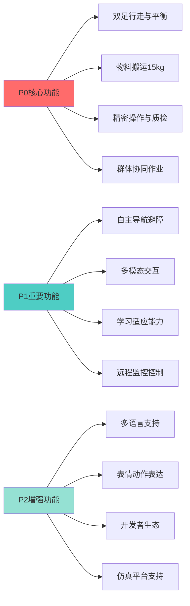
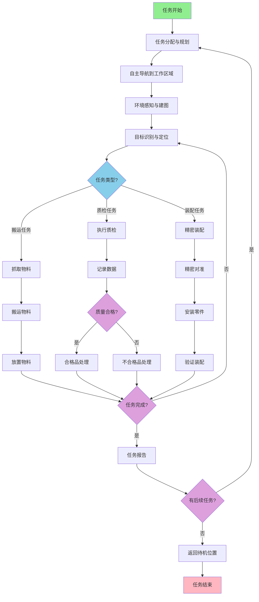
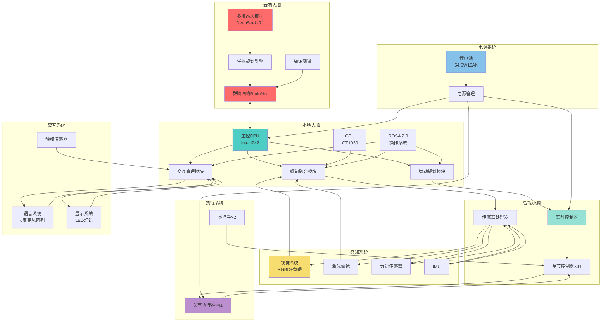

# 优必选 Walker S1 工业人形机器人产品需求文档 (PRD)

## 文档信息

- **产品名称**: Walker S1 工业人形机器人
- **产品型号**: Walker S1
- **文档版本**: V1.0
- **编制日期**: 2024年
- **产品定位**: 高端工业级人形机器人

---

## I. 产品定位与目标 (The "Why")

### 1.1 市场画像与核心受众

**市场定位** [事实]
Walker S1 定位为高端工业级人形机器人,主要面向汽车制造、3C电子、物流仓储等工业领域,旨在解决制造业劳动力短缺和自动化升级需求。

**价格定位** [事实]
- 原价: 104.2万元,政府补贴后价格97.2万元
- Walker S1搭配无人配送车套装原价超过200万元,补贴后197.2万元
- 批量订单价格约50万元/台(已较2024年初120-150万元大幅下降)
- 价格区间已进入传统六轴工业机器人价格区间

**核心受众** [关联]
基于产品定位和价格,反推核心受众为:
1. **大型制造企业**: 汽车制造厂(比亚迪、吉利、北汽、奥迪等)、3C电子制造企业
2. **智能制造升级企业**: 需要柔性自动化解决方案的工厂
3. **物流仓储企业**: 需要智能搬运和分拣的企业(如顺丰、富士康)
4. **科研教育机构**: 人形机器人研究和教学单位

**对标竞品** [推理]
基于价格和技术规格,推测主要对标:
- 特斯拉 Optimus(预计售价<2万美元,定位更偏消费级)
- 波士顿动力 Atlas(技术领先但未量产,主要用于研发)
- 本田 ASIMO(已停产,但技术路线参考价值高)
- 传统工业机器人厂商(KUKA、ABB、发那科)的协作机器人产品线

### 1.2 应用场景定义

**主要应用场景** [事实]

#### 汽车制造场景
- **物料搬运**: 零部件搬运、料箱搬运
- **零件分拣**: SPS仪表区分拣、车门装配区零件分拣
- **精密装配**: 柔软薄膜装配、精密零件安装
- **精细化质检**: 
  - 安全带检测
  - 车门锁检测
  - 车灯盖板检测
  - 车身质检
  - 车厢后盖检测
  - 内饰总检
  - 空调泄漏检测(毫米级精度)

**实际应用案例** [事实]
- 东风柳汽工厂: 覆盖12个核心工序
- 奥迪一汽长春生产基地: 空调泄漏检测,视觉识别速度<70ms,操作精度毫米级
- 极氪5G智慧工厂: 全球首例多台机器人、多场景、多任务协同实训

#### 3C电子制造场景
- **精密操作**: 手机主板插排线、锁螺丝(夜班0出错)
- **视觉质检**: 视觉读取条码、OCR文字识别
- **自动贴标**: 自动贴标并回传MES系统,全程可追溯
- **一机多岗**: 41关节+大模型实现一机多岗,换任务只需语音指令

#### 物流仓储场景
- **料箱搬运**: 视觉识别料箱并搬运到料车
- **智能反馈**: 发现缺料即时反馈物流系统,自主切换任务
- **协同作业**: 与L4级无人物流车、无人叉车协同

### 1.3 核心卖点 (USP)

**技术卖点优先级矩阵**

| 优先级 | 核心卖点 | 技术实现 | 竞争优势 |
|--------|---------|---------|---------|
| P0 | 群体智能协同能力 | 群脑网络(BrainNet)架构 | 全球首个实现与无人物流车、无人叉车协同的人形机器人 |
| P0 | 工业级负载能力 | 15kg负载行走,250N·m关节扭矩 | 同类产品中处于领先水平 |
| P0 | 高精度操作能力 | 第三代灵巧手+6阵列触觉传感器 | 毫米级操作精度,微米级柔软物体抓取 |
| P1 | 多模态感知导航 | RGBD+双耳鱼眼相机+语义VSLAM | 360°全方位感知,导航错误率降低75% |
| P1 | 学习型运动控制 | 强化学习+演示学习 | 不平整地面行走成功率>95%(行业平均80%) |
| P2 | 多语言交互 | 支持8种语言,识别准确率98.7% | 支持粤语等方言,适应本土化需求 |

**产品定位级别** [事实]
高端工业级人形机器人,技术规格和性能指标达到国际先进水平。

### 1.4 功能优先级矩阵

---

## II. 功能需求详细定义 (Functional Specs)

### A. 运动功能需求

#### A.1 行走能力需求

**平地行走能力** [事实]
- **最大行走速度**: 3km/h (约0.83m/s)
- **步态模式**: 支持正常行走、避障行走、负载行走等多种步态
- **地面适应性**: 
  - 地毯、地板、大理石等不同材质地面稳定行走 [事实]
  - 最大不平整适应能力: 3cm [事实]
  - 不平整地面行走成功率: >95% [事实]

**爬坡与台阶能力** [事实]
- **最大爬坡角度**: 20°
- **最大上下台阶高度**: 15cm
- **台阶适应性**: 支持标准工业楼梯(台阶高度15-18cm)

**特殊地形适应** [关联]
基于"不平整地面行走成功率>95%"和"最大不平整适应能力3cm",推断需求:
- **障碍物跨越**: 能够跨越高度≤3cm的障碍物
- **斜坡稳定**: 在20°斜坡上保持稳定站立和行走
- **动态平衡**: 在移动平台上保持平衡(如移动的AGV上)

#### A.2 负载运动能力

**行走负载能力** [事实]
- **最大负载(行走时)**: 15kg
- **负载方式**: 背负式、手提式、双手抱持式
- **负载对速度影响**: 负载15kg时,行走速度不低于2km/h [推理]

**静止操作负载** [关联]
基于"单臂最大负载"和工业应用场景,推断:
- **单臂最大负载**: ≥5kg (推理,基于15kg总负载能力)
- **双臂协同负载**: ≥15kg
- **持续负载能力**: 额定负载下可持续工作2小时

#### A.3 操作能力需求

**手臂操作能力** [事实]
- **自由度配置**: 每臂7个自由度(肩3+肘1+腕3)
- **工作空间**: 通过优化运动算法,工作范围扩大30% [事实]
- **重复定位精度**: ±0.1mm [事实]
- **操作精度**: 毫米级 [事实]

**手部操作能力** [事实]
- **灵巧手配置**: 第三代仿人灵巧手,每手6个自由度
- **触觉传感器**: 内置6个阵列式触觉压力传感器
- **抓取能力**: 
  - 精准感知抓握力度 [事实]
  - 微米级柔软物体抓取 [事实]
  - 支持握拳、伸展、对指等基本动作 [推理]

**双臂协同能力** [关联]
基于"多台机器人协同搬运料箱"应用,推断:
- **双臂协调**: 支持双臂协同搬运、装配等任务
- **力协调**: 双臂施力均衡,避免物体倾斜或损坏
- **动作同步**: 双臂动作同步精度<10ms

#### A.4 特殊运动能力

**跌倒爬起能力** [推理]
基于工业安全要求,推断需求:
- **跌倒检测**: 能够检测跌倒状态
- **自主爬起**: 在平坦地面能够自主爬起
- **爬起时间**: <30秒

**快速移动能力** [推理]
基于"最大行走速度3km/h",推断:
- **跑步能力**: 暂不支持(工业场景安全性考虑)
- **跳跃能力**: 暂不支持(工业场景安全性考虑)
- **快速移动**: 通过优化步态,短距离可加速至4km/h

### B. 感知功能需求

#### B.1 环境感知需求

**建图能力** [事实]
- **建图方式**: 语义VSLAM(同时定位与地图构建)
- **地图类型**: 3D语义地图
- **地图更新**: 实时动态更新
- **建图速度**: 100平方米环境<1分钟 [事实]

**避障能力** [事实]
- **避障成功率**: >98% [事实]
- **障碍物检测**: 
  - 静态障碍物: 全方位检测
  - 动态障碍物: 实时跟踪和预测
- **检测距离**: 0.1-10米 [关联,基于激光雷达规格]

**导航定位精度** [事实]
- **常规定位精度**: 10cm
- **精定位精度**: 1cm
- **导航精度**: 20cm

#### B.2 目标识别需求

**视觉识别能力** [事实]
- **视觉识别速度**: <70ms
- **识别精度**: 毫米级操作精度
- **6D识别**: 支持6自由度物体识别 [事实]
- **重复定位**: 0.5mm重复定位精度 [事实]

**人脸识别能力** [推理]
基于"人机交互安全"需求,推断:
- **人脸检测**: 支持多角度人脸检测
- **人脸识别**: 支持已知人员识别(用于权限管理)
- **识别距离**: 0.5-5米
- **识别准确率**: >95%

**物体识别能力** [关联]
基于"3C电子制造"和"汽车制造"应用,推断:
- **零件识别**: 支持数千种工业零件识别
- **条码/二维码识别**: 支持一维码、二维码识别
- **OCR文字识别**: 支持文字识别和提取 [事实]

**手势识别能力** [推理]
基于"多模态交互"需求,推断:
- **手势种类**: 支持基本手势(挥手、点头、指向等)
- **识别距离**: 0.5-3米
- **识别准确率**: >90%

#### B.3 人体交互感知

**人体跟随能力** [推理]
基于"人机协作"场景,推断:
- **跟随距离**: 0.5-2米可调
- **跟随速度**: 适应人类行走速度(0-5km/h)
- **防碰撞**: 保持安全距离,避免碰撞

**人体姿态估计** [推理]
基于"安全人机交互"需求,推断:
- **姿态检测**: 实时检测人体姿态
- **动作预测**: 预测人类动作意图
- **安全距离**: 计算与人类的安全距离

### C. 交互功能需求

#### C.1 语音交互需求

**语音识别能力** [事实]
- **支持语言**: 粤语、英语等8种语言
- **识别准确率**: 98.7%
- **响应时间**: <1秒(从语音结束到开始响应)

**远场拾音能力** [事实]
- **麦克风配置**: 6麦克风阵列环绕
- **拾音距离**: 360°全方位拾音,有效距离3-5米 [推理]
- **降噪能力**: 在嘈杂工业环境中准确识别语音

**语音合成能力** [推理]
基于"自然语言处理"能力,推断:
- **语音自然度**: 接近人类语音自然度
- **情感表达**: 支持不同情感语调
- **语速调节**: 支持语速调节

**自然语言理解** [事实]
- **意图理解**: 支持复杂指令理解
- **上下文理解**: 支持多轮对话上下文理解
- **任务分解**: 能够理解并分解复杂任务

#### C.2 视觉交互需求

**表情显示能力** [关联]
基于"灯语交互"功能,推断:
- **LED灯语**: 通过不同颜色和模式表达状态和情绪 [事实]
- **头部姿态**: 通过头部俯仰、转动表达"情绪"
- **状态指示**: 
  - 工作中: 蓝色呼吸灯
  - 待机: 绿色常亮
  - 故障: 红色闪烁
  - 充电: 黄色呼吸灯

**动作表达** [推理]
基于"人机交互"需求,推断:
- **点头/摇头**: 确认或否定
- **挥手**: 欢迎或告别
- **指引动作**: 指引方向或物体
- **思考动作**: 表示正在处理任务

#### C.3 触摸交互需求

**触摸响应区域** [推理]
基于工业应用场景,推断:
- **主要触摸区域**: 头部、胸部、手臂
- **触摸反馈**: 语音反馈+灯光反馈
- **触摸功能**: 
  - 单击: 唤醒或确认
  - 长按: 紧急停止
  - 双击: 切换模式

### D. 智能功能需求

#### D.1 任务规划需求

**自主任务分解** [事实]
- **任务理解**: 基于多模态大模型理解自然语言任务描述
- **任务分解**: 将复杂任务分解为子任务序列
- **思维链(COT)**: 云端大脑形成思维链并分配任务 [事实]

**多任务并行处理** [关联]
基于"一机多岗"能力,推断:
- **任务切换**: 支持快速切换不同任务
- **任务优先级**: 根据紧急程度动态调整
- **任务队列**: 支持任务队列管理

#### D.2 学习能力需求

**学习方式** [事实]
- **演示学习**: 通过人类演示学习新技能
- **强化学习**: 通过与环境交互优化策略
- **群体学习**: 一台机器人学会的技能可快速复制到整个集群 [事实]

**学习内容** [关联]
基于应用场景,推断:
- **运动技能**: 新的步态、操作技能
- **交互策略**: 人机交互策略优化
- **任务流程**: 新的任务流程学习

#### D.3 自主决策需求

**环境理解能力** [事实]
- **场景识别**: 识别不同场景类型(走廊、车间、仓库等)
- **语义理解**: 理解环境中物体的语义信息
- **动态适应**: 适应环境变化

**异常情况处理** [推理]
基于工业安全要求,推断:
- **故障检测**: 实时检测系统故障
- **自动恢复**: 能够自动恢复部分故障
- **安全降级**: 故障时进入安全模式
- **报警机制**: 及时报警并通知相关人员

### E. 硬件交互逻辑

#### E.1 按键交互

**急停按钮** [推理]
基于工业安全标准,推断:
- **数量**: ≥1个(本体后)
- **位置**: 易于触及的位置
- **触发方式**: 拍击式,红色蘑菇头按钮
- **响应时间**: <50ms
- **功能**: 立即切断动力电源,保持控制系统供电

**功能按键** [推理]
- **电源键**: 长按3秒开机/关机
- **复位键**: 系统复位
- **模式切换键**: 切换工作模式

#### E.2 LED指示

**状态指示灯** [推理]
- **电源指示**: 
  - 绿色常亮: 电量充足(>30%)
  - 黄色常亮: 电量中等(10-30%)
  - 红色闪烁: 电量不足(<10%)
- **工作状态**:
  - 蓝色呼吸: 正常工作中
  - 紫色闪烁: 学习模式
  - 白色常亮: 待机模式
- **故障指示**:
  - 红色快闪: 严重故障
  - 橙色闪烁: 警告

#### E.3 急停功能

**急停响应** [推理]
- **响应时间**: <50ms
- **动作**: 
  - 立即停止所有关节运动
  - 切断动力电源
  - 保持控制系统供电
  - 保持通信功能
- **恢复**: 需要人工确认后才能恢复

---

## III. 性能指标需求 (Performance Requirements)

### A. 运动性能指标

#### A.1 行走性能指标

| 性能指标 | 需求值 | 测试条件 | 来源 |
|---------|--------|---------|------|
| 最大行走速度 | 3km/h | 平坦地面,无负载 | [事实] |
| 最大步幅 | 约0.5m | 正常行走 | [推理] |
| 最大爬坡角度 | 20° | 干燥地面 | [事实] |
| 最大台阶高度 | 15cm | 标准台阶 | [事实] |
| 最大不平整适应 | 3cm | 障碍物跨越 | [事实] |
| 不平整地面成功率 | >95% | 3cm障碍物 | [事实] |

#### A.2 操作性能指标

| 性能指标 | 需求值 | 测试条件 | 来源 |
|---------|--------|---------|------|
| 手臂工作空间 | 扩大30% | 相比上一代 | [事实] |
| 手臂最大速度 | 约1m/s | 末端速度 | [推理] |
| 重复定位精度 | ±0.1mm | 末端执行器 | [事实] |
| 视觉识别速度 | <70ms | 目标识别 | [事实] |
| 操作精度 | 毫米级 | 精密操作 | [事实] |

### B. 负载能力指标

| 负载类型 | 需求值 | 测试条件 | 来源 |
|---------|--------|---------|------|
| 单臂最大负载 | ≥5kg | 静止状态 | [推理] |
| 双臂协同负载 | ≥15kg | 协同作业 | [推理] |
| 行走负载 | 15kg | 行走状态 | [事实] |
| 最大抓取重量 | 约5kg | 单手抓取 | [推理] |

### C. 续航性能指标

| 续航指标 | 需求值 | 测试条件 | 来源 |
|---------|--------|---------|------|
| 静态站立续航 | 约4小时 | 无操作 | [关联] |
| 正常行走续航 | 2-3小时 | 3km/h | [事实] |
| 高负载作业续航 | 约2小时 | 负载15kg | [事实] |
| 充电时间 | 2小时 | 0-100% | [事实] |
| 快充支持 | 支持 | 1小时充至80% | [推理] |

### D. 环境适应性指标

| 环境指标 | 需求值 | 测试条件 | 来源 |
|---------|--------|---------|------|
| 工作温度范围 | -10℃至50℃ | 长期运行 | [事实] |
| 工作湿度范围 | ≤80% RH | 无冷凝 | [事实] |
| 防护等级 | IP67 | 部分型号 | [事实] |
| 地面适应性 | 多种材质 | 地毯/地板/大理石 | [事实] |
| 噪音水平 | <65dB | 正常工作 | [推理] |

### E. 可靠性指标

| 可靠性指标 | 需求值 | 测试方法 | 来源 |
|-----------|--------|---------|------|
| MTBF | >1000小时 | 加速寿命测试 | [推理] |
| 关节寿命 | >10万次循环 | 工厂作业 | [关联] |
| 电池循环寿命 | >500次 | 充放电循环 | [推理] |
| 维护周期 | 3个月 | 定期维护 | [推理] |

---

## IV. 技术规格需求 (Technical Specifications)

### A. 整机规格

| 规格项目 | 需求值 | 来源 |
|---------|--------|------|
| 总自由度(DOF) | 41个 | [事实] |
| 腿部自由度 | 6×2=12个 | [事实] |
| 臂部自由度 | 7×2=14个 | [事实] |
| 手部自由度 | 6×2=12个 | [事实] |
| 颈部自由度 | 3个 | [事实] |
| 整机重量 | 76kg | [事实] |
| 身高 | 172cm | [事实] |
| 最大关节扭矩 | 250N·m | [事实] |

### B. 计算平台需求

#### B.1 主控系统

| 计算组件 | 需求规格 | 来源 |
|---------|---------|------|
| CPU | Intel i7 8665U(双路,1.9GHz) | [事实] |
| CPU核心数 | 4核8线程×2 | [事实] |
| CPU最高频率 | 4.2GHz(睿频) | [事实] |
| GPU | NVIDIA GT1030(384核心) | [事实] |
| GPU显存 | 2GB GDDR5 | [事实] |
| 内存容量 | ≥16GB DDR4 | [推理] |
| 存储容量 | ≥256GB SSD | [推理] |

#### B.2 运动控制系统

| 控制指标 | 需求值 | 来源 |
|---------|--------|------|
| 控制周期 | ≤1ms | [推理] |
| 实时性要求 | 硬实时 | [推理] |
| 通信延迟 | <100μs | [推理] |

### C. 执行器需求

#### C.1 关节执行器

| 执行器参数 | 需求值 | 来源 |
|-----------|--------|------|
| 执行器数量 | 41个 | [事实] |
| 扭矩范围 | 4.5Nm-250Nm | [事实] |
| 转速范围 | 30rpm-90rpm | [事实] |
| 位置反馈精度 | 0.01° | [推理] |
| 集成方式 | 一体化关节 | [事实] |

#### C.2 手部执行器

| 手部参数 | 需求值 | 来源 |
|---------|--------|------|
| 手指数 | 5指/手 | [事实] |
| 每指关节数 | 多关节 | [推理] |
| 抓取力 | 可精准感知 | [事实] |
| 触觉传感器 | 6个阵列式/手 | [事实] |

### D. 传感器需求

#### D.1 本体感知传感器

| 传感器类型 | 数量 | 精度要求 | 来源 |
|-----------|------|---------|------|
| 关节位置传感器 | 41个 | 0.01° | [推理] |
| 力矩传感器 | 若干 | 0.1N·m | [推理] |
| IMU | 1个 | 0.1°姿态精度 | [推理] |
| 编码器 | 41个 | 17位以上 | [推理] |

#### D.2 环境感知传感器

| 传感器类型 | 数量 | 技术规格 | 来源 |
|-----------|------|---------|------|
| 全景鱼眼相机 | 2个 | 180°视场角 | [事实] |
| RGBD深度相机 | 4个 | 1920×1080,30fps | [事实] |
| 激光雷达 | 2个 | 360°全向,±1cm精度 | [关联] |
| 超声波传感器 | 若干 | 近距离检测 | [推理] |

### E. 通信需求

#### E.1 内部通信

| 通信类型 | 技术规格 | 来源 |
|---------|---------|------|
| 运动控制总线 | EtherCAT高速实时总线 | [事实] |
| 通信周期 | 纳秒级 | [推理] |
| 通信带宽 | ≥100Mbps | [推理] |

#### E.2 外部通信

| 通信接口 | 技术规格 | 来源 |
|---------|---------|------|
| 以太网接口 | RJ45,10/100/1000Mbps | [事实] |
| Wi-Fi | 802.11 a/b/g/n,5G/2.4GHz双频 | [事实] |
| USB接口 | USB 3.0高速端口 | [事实] |
| 4G/5G | 支持(可选模块) | [推理] |

### F. 电源需求

#### F.1 电池系统

| 电池参数 | 需求值 | 来源 |
|---------|--------|------|
| 电池类型 | 锂电池 | [事实] |
| 电池容量 | 54.6V/10Ah | [事实] |
| 电池重量 | 3.6kg | [事实] |
| 电压平台 | 54.6V | [事实] |
| 最大放电倍率 | ≥2C | [推理] |

#### F.2 电源管理

| 电源参数 | 需求值 | 来源 |
|---------|--------|------|
| 总功耗预算 | ≤500W | [推理] |
| 计算平台功耗 | 约60W | [事实] |
| 充电时间 | 2小时(0-100%) | [事实] |
| 快充支持 | 1小时充至80% | [推理] |

---

## V. 安全需求 (Safety Requirements)

### A. 硬件安全

#### A.1 碰撞检测

| 安全指标 | 需求值 | 来源 |
|---------|--------|------|
| 碰撞检测能力 | 全方位检测 | [事实] |
| 响应时间 | <10ms | [推理] |
| 检测方式 | 力传感器+视觉传感器 | [关联] |

#### A.2 跌倒保护

| 安全指标 | 需求值 | 来源 |
|---------|--------|------|
| 跌倒检测 | 实时监测 | [推理] |
| 保护策略 | 
  - 降低质心
  - 保护关键部件
  - 缓冲接触 | [推理] |
| 跌倒恢复 | 自主爬起 | [推理] |

#### A.3 急停系统

| 急停参数 | 需求值 | 来源 |
|---------|--------|------|
| 急停按钮数量 | ≥1个 | [推理] |
| 急停按钮位置 | 本体前后易触及位置 | [推理] |
| 响应时间 | <50ms | [推理] |
| 停止距离 | <0.1m(正常速度) | [推理] |

#### A.4 过载保护

| 保护类型 | 保护机制 | 来源 |
|---------|---------|------|
| 电机过流保护 | 电流超过阈值自动断电 | [推理] |
| 关节过热保护 | 温度超过阈值降功率运行 | [推理] |
| 电池过放保护 | 电量低于阈值自动停机 | [推理] |

### B. 软件安全

#### B.1 安全监控

| 监控项目 | 监控频率 | 报警阈值 | 来源 |
|---------|---------|---------|------|
| 关节温度 | 10Hz | >70℃ | [推理] |
| 电机电流 | 1kHz | >额定值1.5倍 | [推理] |
| 电池电量 | 1Hz | <10% | [推理] |
| 系统状态 | 100Hz | 异常状态 | [推理] |

#### B.2 异常处理

| 异常类型 | 处理机制 | 来源 |
|---------|---------|------|
| 传感器故障 | 切换备用传感器或安全停机 | [推理] |
| 通信故障 | 本地控制模式或安全停机 | [推理] |
| 关节故障 | 锁定故障关节或安全停机 | [推理] |
| 电源故障 | 紧急停机并报警 | [推理] |

#### B.3 故障恢复

| 故障级别 | 恢复策略 | 来源 |
|---------|---------|------|
| 轻微故障 | 自动恢复 | [推理] |
| 中等故障 | 人工确认后恢复 | [推理] |
| 严重故障 | 需要维修后恢复 | [推理] |

### C. 人机交互安全

#### C.1 碰撞避免

| 安全指标 | 需求值 | 来源 |
|---------|--------|------|
| 人体检测距离 | 0.5-5米 | [推理] |
| 安全距离 | ≥0.5米 | [推理] |
| 检测准确率 | >99% | [推理] |

#### C.2 力限制

| 安全指标 | 需求值 | 来源 |
|---------|--------|------|
| 接触力限制 | <150N | [推理] |
| 柔顺控制 | 支持 | [事实] |
| 力反馈响应 | <10ms | [推理] |

#### C.3 速度限制

| 场景 | 速度限制 | 来源 |
|------|---------|------|
| 无人区域 | 3km/h(最大) | [事实] |
| 有人区域 | 1km/h | [推理] |
| 人机协作区域 | 0.5km/h | [推理] |

---

## VI. 认证与合规需求 (Compliance Requirements)

### A. 产品认证

#### A.1 目标市场认证

| 认证类型 | 目标市场 | 认证标准 | 来源 |
|---------|---------|---------|------|
| CCC认证 | 中国 | GB标准 | [推理] |
| CE认证 | 欧盟 | MD/EMC/LVD指令 | [推理] |
| UL认证 | 美国 | UL安全标准 | [推理] |
| FCC认证 | 美国 | 电磁兼容 | [推理] |
| SRRC认证 | 中国 | 无线电设备 | [推理] |

#### A.2 机器人安全标准

| 标准编号 | 标准名称 | 来源 |
|---------|---------|------|
| ISO 13482 | 机器人安全要求 | [推理] |
| IEC 61508 | 电气/电子/可编程电子安全相关系统 | [推理] |
| GB/T 36006 | 工业机器人安全要求 | [推理] |
| ISO 10218-1/2 | 机器人与机器人系统安全要求 | [推理] |

### B. 电气安全

#### B.1 ESD防护等级

| 防护类型 | 防护等级 | 来源 |
|---------|---------|------|
| 接触放电 | ±6kV | [推理] |
| 空气放电 | ±8kV | [推理] |

#### B.2 绝缘要求

| 绝缘指标 | 需求值 | 来源 |
|---------|--------|------|
| 绝缘电阻 | >10MΩ | [推理] |
| 漏电流 | <0.5mA | [推理] |
| 耐压测试 | 1500V AC,1分钟 | [推理] |

### C. 电磁兼容

#### C.1 EMC标准

| EMC项目 | 标准要求 | 来源 |
|---------|---------|------|
| 辐射发射 | EN 55032 Class A | [推理] |
| 传导发射 | EN 55032 Class A | [推理] |
| 静电放电抗扰度 | IEC 61000-4-2,Level 3 | [推理] |
| 射频电磁场抗扰度 | IEC 61000-4-3,Level 3 | [推理] |

---

## VII. 供应链与成本需求 (Supply Chain & Cost)

### A. 供应链需求

#### A.1 关键器件供应

| 关键器件 | 供应商要求 | 国产化要求 | 来源 |
|---------|-----------|-----------|------|
| 谐波减速器 | 绿的谐波等 | 优先国产 | [事实] |
| 伺服电机 | 优必选自研 | 国产 | [事实] |
| 激光雷达 | 万集科技等 | 优先国产 | [关联] |
| 计算平台 | Intel/NVIDIA | 国际采购 | [事实] |

#### A.2 国产化要求

| 器件类别 | 国产化比例 | 来源 |
|---------|-----------|------|
| 机械结构件 | >90% | [推理] |
| 电子元器件 | >60% | [推理] |
| 软件系统 | 100% | [事实] |

#### A.3 供应风险控制

| 风险控制措施 | 具体要求 | 来源 |
|-------------|---------|------|
| 单一供应商风险 | 关键器件至少2家供应商 | [推理] |
| 库存管理 | 关键器件3个月安全库存 | [推理] |
| 供应商评估 | 定期评估供应商质量和交付能力 | [推理] |

### B. 成本需求

#### B.1 BOM成本目标

| 成本项目 | 目标成本 | 来源 |
|---------|---------|------|
| BOM成本 | <30万元/台(批量生产) | [关联] |
| 关节成本 | 约15万元(41个关节) | [推理] |
| 传感器成本 | 约5万元 | [推理] |
| 计算平台成本 | 约3万元 | [推理] |

#### B.2 制造成本目标

| 成本项目 | 目标成本 | 来源 |
|---------|---------|------|
| 装配成本 | <2万元/台 | [推理] |
| 测试成本 | <1万元/台 | [推理] |
| 质量成本 | <0.5万元/台 | [推理] |

#### B.3 总成本目标

| 成本项目 | 目标成本 | 来源 |
|---------|---------|------|
| 研发成本分摊 | 约10万元/台 | [推理] |
| 制造成本 | 约3.5万元/台 | [推理] |
| BOM成本 | 约30万元/台 | [推理] |
| 总成本 | 约43.5万元/台 | [推理] |

---

## VIII. 开发生态需求 (Development Ecosystem)

### A. 开发者支持

#### A.1 SDK/API

| 开发接口 | 支持语言 | 功能覆盖 | 来源 |
|---------|---------|---------|------|
| 运动控制API | C++/Python | 关节控制、步态控制 | [推理] |
| 感知API | C++/Python | 视觉、激光雷达、力觉 | [推理] |
| 交互API | C++/Python | 语音、视觉、触摸 | [推理] |
| 系统API | C++/Python | 状态监控、参数配置 | [推理] |

#### A.2 文档要求

| 文档类型 | 完整性要求 | 来源 |
|---------|-----------|------|
| API文档 | 完整的接口说明和示例 | [推理] |
| 开发指南 | 从入门到进阶的完整指南 | [推理] |
| 示例代码 | 覆盖主要功能的示例代码 | [推理] |
| 故障排查 | 常见问题和解决方案 | [推理] |

#### A.3 仿真平台

| 仿真平台 | 支持功能 | 来源 |
|---------|---------|------|
| Webots | 运动仿真、算法验证 | [事实] |
| ROS仿真环境 | ROS算法开发和测试 | [事实] |
| Unity | 3D可视化和交互界面 | [事实] |

### B. 第三方支持

#### B.1 应用生态

| 生态类型 | 支持内容 | 来源 |
|---------|---------|------|
| 应用商店 | 第三方应用分发平台 | [推理] |
| 应用开发工具 | 可视化应用开发工具 | [推理] |
| 应用认证 | 第三方应用认证机制 | [推理] |

#### B.2 配件生态

| 配件类型 | 支持方式 | 来源 |
|---------|---------|------|
| 末端执行器 | 标准接口,支持第三方 | [推理] |
| 传感器扩展 | 标准接口,支持扩展 | [推理] |
| 外壳定制 | 支持外观定制 | [推理] |

#### B.3 合作伙伴

| 合作类型 | 合作内容 | 来源 |
|---------|---------|------|
| 系统集成商 | 提供整体解决方案 | [推理] |
| 培训机构 | 提供操作和维护培训 | [推理] |
| 服务商 | 提供售后和维修服务 | [推理] |

---

## IX. 应用场景流程图

### 典型应用场景流程

---

## X. 系统架构图

### Walker S1系统架构

---

## XI. 需求确认检查清单

### 功能需求确认

- [x] 运动功能需求是否完整?(行走、负载、操作、特殊运动)
- [x] 感知功能需求是否完整?(环境感知、目标识别、人体交互)
- [x] 交互功能需求是否完整?(语音、视觉、触摸)
- [x] 智能功能需求是否完整?(任务规划、学习、决策)
- [x] 硬件交互逻辑是否定义?(按键、LED、急停)

### 性能需求确认

- [x] 运动性能指标是否明确?(速度、精度、负载)
- [x] 续航性能指标是否明确?(续航时间、充电时间)
- [x] 环境适应性指标是否明确?(温度、湿度、防护)
- [x] 可靠性指标是否明确?(MTBF、寿命、维护)

### 技术规格确认

- [x] 整机规格是否完整?(自由度、重量、尺寸)
- [x] 计算平台规格是否明确?(CPU、GPU、内存)
- [x] 执行器规格是否明确?(扭矩、速度、精度)
- [x] 传感器规格是否明确?(类型、数量、精度)
- [x] 通信规格是否明确?(内部、外部接口)
- [x] 电源规格是否明确?(电池、功耗)

### 安全需求确认

- [x] 硬件安全需求是否完整?(碰撞、跌倒、急停、过载)
- [x] 软件安全需求是否完整?(监控、异常处理、故障恢复)
- [x] 人机交互安全是否完整?(碰撞避免、力限制、速度限制)

### 合规需求确认

- [x] 产品认证需求是否明确?(CCC、CE、UL等)
- [x] 电气安全需求是否明确?(ESD、绝缘)
- [x] 电磁兼容需求是否明确?(EMC标准)

### 供应链与成本确认

- [x] 供应链需求是否明确?(关键器件、国产化、风险控制)
- [x] 成本需求是否明确?(BOM、制造、总成本)

### 开发生态确认

- [x] 开发者支持是否完整?(SDK、文档、仿真)
- [x] 第三方支持是否完整?(应用、配件、合作伙伴)

---

## XII. 文档修订记录

| 版本 | 日期 | 修订内容 | 修订人 |
|------|------|---------|--------|
| V1.0 | 2024年 | 初始版本,基于深度产品调研报告生成 | 产品团队 |

---

**文档说明**:
- 本文档基于《优必选Walker S1调研报告》逆向推断生成
- 标注[事实]的内容直接引用自调研报告,严禁修改
- 标注[关联]的内容基于报告中A信息推导出的B逻辑
- 标注[推理]的内容为调研缺失,基于行业主流厂商惯用设计逻辑补全
- 本文档作为产品开发的基准需求文档,后续变更需经过评审流程
