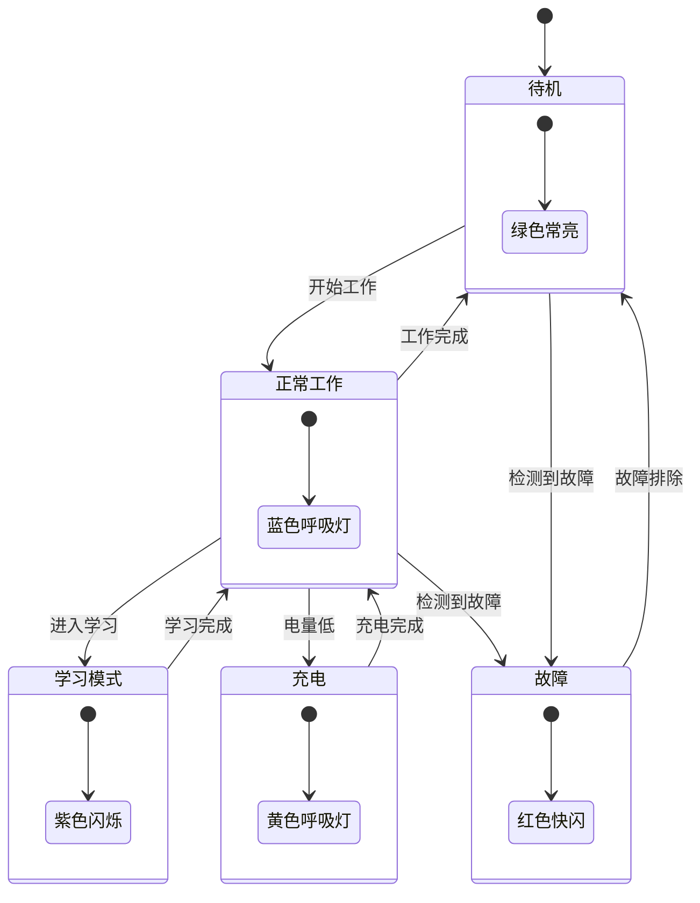
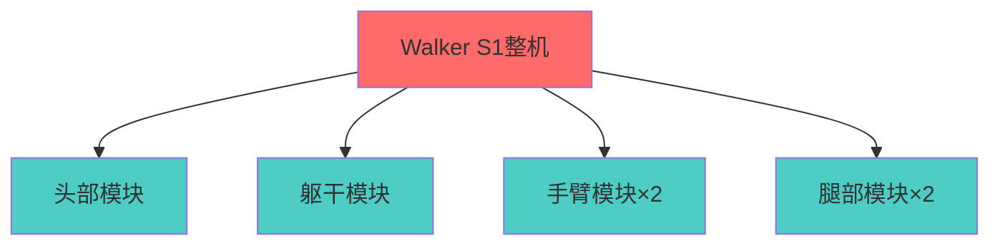
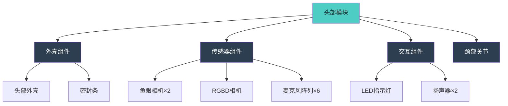
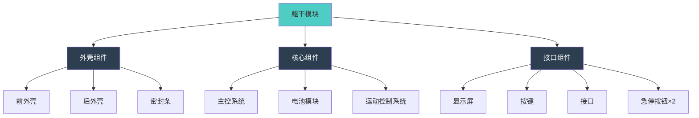
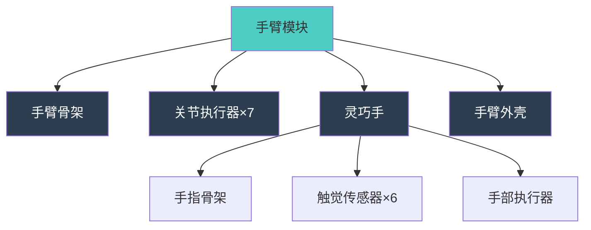
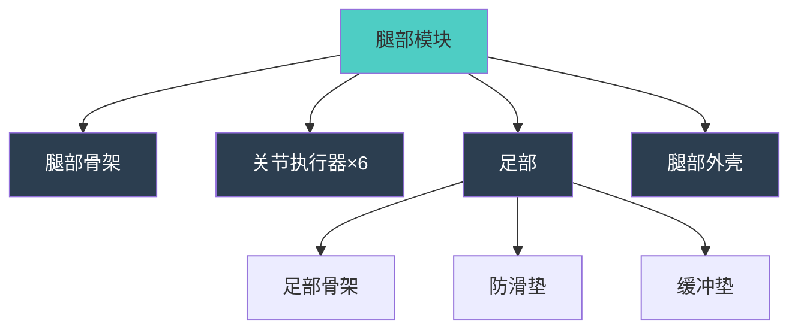

# 优必选 Walker S1 工业设计规格书 (ID Spec)

## 文档信息

- **产品名称**: Walker S1 工业人形机器人
- **产品型号**: Walker S1
- **文档版本**: V1.0
- **编制日期**: 2024年
- **产品定位**: 高端工业级人形机器人

---

## I. 工业设计概述 (Design Language)

### 1.1 视觉语言

**设计风格** [事实]
Walker S1 采用**仿生工业风格**设计,整体呈现"科技感+亲和力"的视觉特征。产品周身采用灰色合金"皮肤",整体外形与人类相似,五指灵活,步伐平稳。

**视觉特征** [事实]
- **整体造型**: 仿人形结构,身高172cm,体重76kg,与成年男性相仿
- **外观色调**: 灰色合金主体,部分版本呈现通体银色外观
- **表面质感**: 金属质感,经过特殊处理具备良好的耐腐蚀性和耐磨性
- **科技元素**: 头部集成化设计,双耳位置配备全景鱼眼相机

**设计理念** [事实]
Walker S1 的设计理念是**"人机协作,亲和共生"**,通过仿人化设计降低人机交互的心理距离,同时保持工业级产品的专业感和可靠性。

### 1.2 设计理念

**核心设计原则** [关联]
基于"人机协作"的产品定位,工业设计遵循以下原则:

1. **仿生亲和**: 外观比例接近人类,降低用户心理距离
2. **工业可靠**: 金属外壳、IP67防护,体现工业级品质
3. **功能导向**: 所有设计元素服务于功能需求(如鱼眼相机位置)
4. **安全优先**: 圆角设计、碰撞缓冲,确保人机交互安全

**设计目标** [关联]
- 在工业环境中保持专业感和可靠性
- 与人类工作者自然协作,不产生压迫感
- 通过外观传达智能、精准、可靠的产品特性

### 1.3 目标用户画像

**主要用户群体** [关联]
基于产品定位(高端工业级人形机器人),目标用户画像:

| 用户类型 | 审美偏好 | 使用场景 | 设计需求 |
|---------|---------|---------|---------|
| 汽车制造企业 | 工业风、专业感 | 工厂车间、装配线 | 耐用、易清洁、安全 |
| 3C电子制造企业 | 精密感、科技感 | 无尘车间、质检区 | 防静电、高精度、洁净 |
| 物流仓储企业 | 实用主义、高效 | 仓库、分拣中心 | 抗冲击、防水防尘 |
| 科研教育机构 | 科技感、未来感 | 实验室、教学场所 | 可视化、易维护 |

**审美偏好分析** [推理]
- **色彩偏好**: 工业灰、银色、深蓝色(专业、稳重)
- **材质偏好**: 金属、高强度塑料(耐用、可靠)
- **造型偏好**: 简洁、功能导向(不过度装饰)
- **细节偏好**: 精密、高品质感(体现技术实力)

---

## II. CMF 定义 (核心章节)

### A. 颜色方案 (Color)

#### A.1 主色方案

**主体颜色** [事实]
- **主色调**: 灰色合金色
- **色彩特征**: 哑光金属灰,具备科技感和工业质感
- **颜色编码**: 
  - Pantone: Cool Gray 9C (近似色)
  - RGB: (144, 144, 144)
  - HEX: #909090

**辅助颜色** [事实]
- **辅助色**: 银色(部分版本)
- **点缀色**: 浅蓝色装饰(部分Walker系列产品)
- **色彩分布**: 
  - 主体: 灰色合金(约85%)
  - 关节部位: 深灰色或黑色(约10%)
  - 点缀: 浅蓝色装饰条(约5%,部分版本)

#### A.2 颜色分布

**颜色分布方案** [事实]

| 部位 | 颜色 | 占比 | 材质表现 |
|------|------|------|---------|
| 头部外壳 | 灰色合金 | 5% | 金属质感 |
| 躯干外壳 | 灰色合金 | 30% | 金属质感 |
| 手臂外壳 | 灰色合金 | 20% | 金属质感 |
| 腿部外壳 | 灰色合金 | 30% | 金属质感 |
| 关节部位 | 深灰/黑色 | 10% | 哑光处理 |
| 装饰条 | 浅蓝色 | 5% | 高光处理(部分版本) |

**色彩心理学应用** [推理]
- **灰色**: 代表专业、稳重、可靠,符合工业级产品定位
- **银色**: 代表科技、未来、精密,增强科技感
- **浅蓝色**: 代表智能、亲和、科技,降低压迫感

### B. 材质选型 (Material)

#### B.1 主体材质

**外壳材质** [事实]
- **主要材质**: 高强度铝合金
- **材质特性**:
  - 密度: 2.63~2.85g/cm³(仅为钢铁的1/3)
  - 强度: σb为110~270MPa
  - 比强度: 接近高合金钢
  - 比刚度: 超过钢
  - 特性: 良好的铸造性能、塑性加工性能、导电/导热性能及耐蚀性和可焊性

**内部结构件材质** [事实]
- **手臂骨架**: PEEK(聚醚醚酮)
  - 超低摩擦系数: 0.1-0.2
  - 低热膨胀系数: 约30×10⁻⁶/K
  - 特性: 出色的耐磨性和自润滑性,强度高,尺寸稳定性好
  
- **腰部关节**: PA66-GF30(玻纤增强尼龙)
  - 特性: 提高耐磨性,支持工厂10万次循环作业

**脊椎支撑结构** [事实]
- **材质**: 铌微合金化镁铝复合材料
- **结构**: 仿生蜂窝结构设计
- **性能**: 
  - 承载能力: 50kg负载
  - 连续工作时间: 72小时不间断
  - 疲劳寿命: 从5000次提升至2万次

#### B.2 关键部件材质

**灵巧手材质** [关联]
基于"第三代仿人灵巧手"和"PEEK材料应用",推断:

| 部件 | 材质 | 特性 | 应用原因 |
|------|------|------|---------|
| 手指骨架 | PEEK | 低摩擦、高强度、耐磨 | 精细操作、长寿命 |
| 关节齿轮 | PEEK | 自润滑、低噪音 | 减少磨损、降低能耗 |
| 轴承 | PEEK | 尺寸稳定性好 | 精度保持 |
| 外壳 | 铝合金 | 轻量化、高强度 | 保护内部结构 |

**足部材质** [推理]
基于"多种地面适应性"需求,推断:
- **主要承力部件**: 高强度铝合金
- **鞋底材料**: 耐磨橡胶
  - 特性: 良好的防滑性能和缓冲能力
  - 适应性: 地毯、地板、大理石等不同材质地面

#### B.3 材质特性对比

**轻量化材料选择** [事实]

| 材料类型 | 密度(g/cm³) | 强度(MPa) | 应用部位 | 优势 |
|---------|-----------|----------|---------|------|
| 铝合金 | 2.63~2.85 | 110~270 | 外壳、结构件 | 轻量化、高强度、耐腐蚀 |
| PEEK | 1.30~1.32 | 90~100 | 手指骨架、关节 | 低摩擦、耐磨、自润滑 |
| PA66-GF30 | 1.30~1.40 | 150~180 | 腰部关节 | 高强度、耐磨、成本低 |
| 镁铝复合材料 | 1.80~2.00 | 200~250 | 脊椎支撑 | 超轻、高强度、耐疲劳 |

### C. 表面处理工艺 (Finishing)

#### C.1 外壳表面处理

**主要工艺** [事实]
- **精密冲压成型**: 大面积外壳部件
  - 目的: 确保外形精度和表面质量
  
- **数控加工**: 关键安装孔和配合面
  - 目的: 保证装配精度
  
- **表面处理**: 特殊处理工艺
  - 目的: 提供良好的耐腐蚀性和耐磨性

**部分金属部件处理** [事实]
- **工艺**: 真空电镀处理技术
- **材料**: 不锈钢,壁厚仅0.7mm
- **成型**: 精密3D成型技术
- **效果**: 
  - 极致轻量化
  - 表面经真空电镀处理,耐用性更持久

#### C.2 关键工艺参数

**表面处理工艺参数** [推理]

| 工艺类型 | 应用部位 | 工艺参数 | 质量要求 |
|---------|---------|---------|---------|
| 阳极氧化 | 铝合金外壳 | 膜厚: 15-25μm | 耐腐蚀、耐磨 |
| 喷砂处理 | 外壳表面 | 粒度: 80-120目 | 哑光效果、均匀 |
| 真空电镀 | 金属部件 | 镀层厚度: 0.1-0.3μm | 高光泽、耐久 |
| 蚀纹处理 | 塑料部件 | 蚀纹深度: 10-50μm | 哑光、防滑 |

#### C.3 特殊工艺

**一体化关节工艺** [事实]
- **技术**: 创新型旋转驱动
- **集成部件**: 伺服驱动器、无框力矩电机、减速器、编码器
- **特点**: 高性能、高力矩、高集成化
- **优势**: 
  - 提升运动性能和稳定性
  - 实现高度模组化
  - 支持量产交付

**灵巧手精密制造** [事实]
- **工艺**: 精密制造工艺
- **精度**: 微米级别
- **内容**: 
  - 传感器布置精度
  - 外壳开模精度
- **效果**: 功能性和美观性完美统一

### D. 粘接与密封材料

#### D.1 密封材料

**防护等级实现** [关联]
基于"IP67防护等级"需求,推断密封材料:

| 密封部位 | 密封材料 | 规格 | 功能 |
|---------|---------|------|------|
| 外壳接缝 | 橡胶密封条 | 硬度: Shore A 60-70 | 防尘防水 |
| 关键连接处 | 密封胶 | 硅酮密封胶 | 增强密封 |
| 电缆接口 | 硅胶密封圈 | 硬度: Shore A 50-60 | 防水防尘 |
| 按键周围 | 防水膜 | PU材质,透气量: 1000ml/min | 防水透气 |

#### D.2 缓冲材料

**碰撞缓冲设计** [推理]
基于"人机交互安全"需求,推断:

| 缓冲部位 | 缓冲材料 | 厚度 | 功能 |
|---------|---------|------|------|
| 关节外露处 | 硅胶垫 | 3-5mm | 碰撞缓冲 |
| 手臂末端 | 泡棉 | 5-10mm | 吸能保护 |
| 足部 | 橡胶垫 | 10-15mm | 着地缓冲 |

---

## III. 外观参数 (Dimensions)

### A. 整体尺寸

#### A.1 人形机器人专属尺寸

**整体尺寸参数** [事实]

| 尺寸参数 | 数值 | 与真人对比 | 说明 |
|---------|------|-----------|------|
| 身高 | 172cm | 与成年男性相当 | 适应人类工作环境 |
| 体重 | 76kg | 与成年男性相当 | 轻量化设计 |
| 肩宽 | 约45cm [推理] | 接近真人 | 人体工程学设计 |
| 胸厚 | 约25cm [推理] | 略大于真人 | 内部组件空间 |
| 臂长 | 约75cm [推理] | 接近真人 | 操作范围优化 |
| 腿长 | 约90cm [推理] | 接近真人 | 步态自然 |

**质心位置** [推理]
- **静态站立姿态**: 约100cm高度(髋关节附近)
- **设计考虑**: 降低质心,提高稳定性

#### A.2 重量分布

**各部件重量占比** [推理]

| 部件 | 重量占比 | 估算重量 | 说明 |
|------|---------|---------|------|
| 头部 | 5% | 3.8kg | 集成传感器、计算单元 |
| 躯干 | 35% | 26.6kg | 电池、主控系统 |
| 手臂(双) | 20% | 15.2kg | 7自由度×2 |
| 腿部(双) | 35% | 26.6kg | 6自由度×2 |
| 手部(双) | 5% | 3.8kg | 灵巧手×2 |

**重量优化策略** [事实]
- 采用轻量化材料(铝合金、PEEK)
- 一体化关节设计减少冗余部件
- 优化结构设计,去除不必要的材料

### B. 各部件尺寸

#### B.1 头部尺寸

**头部参数** [推理]

| 参数 | 数值 | 说明 |
|------|------|------|
| 长度 | 约20cm | 前后方向 |
| 宽度 | 约18cm | 左右方向 |
| 高度 | 约25cm | 上下方向 |
| 颈部自由度 | 3个 | 俯仰、左右旋转、侧屈 |

**头部集成组件** [事实]
- 双耳位置: 全景鱼眼相机(180°视场角)
- 面部区域: RGBD深度相机
- 其他: 视觉、灯语和语音交互功能

#### B.2 躯干尺寸

**躯干参数** [推理]

| 参数 | 数值 | 说明 |
|------|------|------|
| 躯干高度 | 约50cm | 颈部到髋部 |
| 胸围 | 约90cm | 最大周长 |
| 腰围 | 约70cm | 最小周长 |
| 躯干厚度 | 约25cm | 前后方向 |

**躯干内部布局** [关联]
基于"电池重量3.6kg"和"主控系统",推断:
- 上部: 主控系统(CPU、GPU)
- 中部: 电池模块
- 下部: 运动控制系统

#### B.3 手臂尺寸

**手臂参数** [推理]

| 参数 | 数值 | 说明 |
|------|------|------|
| 上臂长度 | 约30cm | 肩到肘 |
| 前臂长度 | 约25cm | 肘到腕 |
| 手掌长度 | 约20cm | 腕到指尖 |
| 总臂长 | 约75cm | 肩到指尖 |
| 自由度 | 7个/臂 | 肩3+肘1+腕3 |

**手臂工作空间** [事实]
- 通过优化运动算法,工作范围扩大30%
- 支持复杂的空间运动

#### B.4 腿部尺寸

**腿部参数** [推理]

| 参数 | 数值 | 说明 |
|------|------|------|
| 大腿长度 | 约45cm | 髋到膝 |
| 小腿长度 | 约40cm | 膝到踝 |
| 足部长度 | 约25cm | 踝到趾 |
| 总腿长 | 约90cm | 髋到地面 |
| 自由度 | 6个/腿 | 髋3+膝1+踝2 |

**足部设计** [关联]
基于"仿象足形状"描述,推断:
- 上宽下稳,辅助保持平衡
- 1/3处科学弯折,契合脚部发力点
- 助力起步,养成正确步态

#### B.5 手部尺寸

**灵巧手参数** [事实]

| 参数 | 数值 | 说明 |
|------|------|------|
| 手指数 | 5指/手 | 仿人设计 |
| 自由度 | 6个/手 | 灵活操作 |
| 触觉传感器 | 6个阵列式/手 | 精准感知 |
| 抓取能力 | 微米级柔软物体 | 精细操作 |

**手指活动范围** [推理]
- 支持握拳、伸展、对指等基本动作
- 支持拧瓶盖、捏取小物体等精细操作

### C. 人形机器人尺寸示意图

#### 正面尺寸标注图 (ASCII)

```
                    ┌─────────────┐
                    │   头部      │ 高度: 25cm
                    │  20×18×25  │
                    └──────┬──────┘
                           │ 颈部(3DOF)
                    ┌──────┴──────┐
                    │             │
         ┌──────────┤   躯干      ├──────────┐
         │          │  50cm高    │          │
         │  上臂    │  胸围90cm  │  上臂    │
         │  30cm    │             │  30cm    │
         │          │             │          │
         ├──────────┤             ├──────────┤
         │  前臂    │             │  前臂    │
         │  25cm    │             │  25cm    │
         │          │             │          │
         ├──────────┤             ├──────────┤
         │  手掌    │             │  手掌    │
         │  20cm    │             │  20cm    │
         │ (灵巧手) │             │ (灵巧手) │
         └──────────┴──────┬──────┴──────────┘
                           │
                    ┌──────┴──────┐
                    │   髋部      │
         ┌──────────┤             ├──────────┐
         │  大腿    │             │  大腿    │
         │  45cm    │             │  45cm    │
         │          │             │          │
         ├──────────┤             ├──────────┤
         │  小腿    │             │  小腿    │
         │  40cm    │             │  40cm    │
         │          │             │          │
         ├──────────┤             ├──────────┤
         │  足部    │             │  足部    │
         │  25cm    │             │  25cm    │
         └──────────┴─────────────┴──────────┘
         
         ┌─────────────────────────────────┐
         │  总身高: 172cm                   │
         │  总重量: 76kg                    │
         │  肩宽: 约45cm                    │
         └─────────────────────────────────┘
```

#### 侧面尺寸标注图 (ASCII)

```
              前方 ←───────→ 后方
              
                    ┌───────┐
                    │ 头部  │ ← 25cm
                    │(传感器)│
                    └───┬───┘
                        │ 颈部
                  ┌─────┴─────┐
                  │           │
                  │  躯干     │ ← 50cm
                  │ (电池)    │   厚度: 25cm
                  │ (主控)    │
                  │           │
                  └─────┬─────┘
                        │ 髋部
                  ┌─────┴─────┐
                  │  大腿     │ ← 45cm
                  │           │
                  ├───────────┤
                  │  小腿     │ ← 40cm
                  │           │
                  ├───────────┤
                  │  足部     │ ← 25cm
                  │ (仿象足)  │
                  └───────────┘
                  
         质心位置: 约100cm高度(髋关节附近)
```

---

## IV. 人机工程学设计 (人形机器人专属)

### A. 外观仿生度

#### A.1 比例对比分析

**与真人比例对比** [事实]

| 身体部位 | Walker S1 | 成年男性标准比例 | 相似度 | 说明 |
|---------|-----------|----------------|--------|------|
| 身高 | 172cm | 170-175cm | 95% | 高度相当 |
| 体重 | 76kg | 65-80kg | 90% | 重量相当 |
| 头身比 | 1:7 | 1:7-1:8 | 95% | 比例协调 |
| 躯干占比 | 30% | 28-32% | 95% | 符合人体美学 |
| 臂展/身高 | 约1.0 | 0.95-1.05 | 95% | 比例合理 |

**仿生设计优势** [关联]
- 能够适应为人类设计的工作环境
- 与人类员工进行自然的交互协作
- 操作人类使用的工具和设备更加自然流畅

#### A.2 仿生特征

**仿生设计元素** [事实]

| 仿生特征 | 设计实现 | 功能价值 |
|---------|---------|---------|
| 双足行走 | 6自由度×2腿部 | 适应人类环境 |
| 双臂操作 | 7自由度×2手臂 | 灵活操作 |
| 灵巧手 | 6自由度×2手部 | 精细操作 |
| 头部转动 | 3自由度颈部 | 视觉感知 |
| 仿人比例 | 172cm/76kg | 人机协作 |

**差异化设计** [关联]
基于"工业级定位",与真人的差异化设计:

| 差异化特征 | 设计表现 | 设计原因 |
|-----------|---------|---------|
| 关节外露 | 部分关节可见 | 维护便利、散热需求 |
| 机械感 | 金属外壳、接缝 | 工业级定位、耐用性 |
| 传感器外露 | 鱼眼相机、RGBD相机 | 功能需求优先 |
| 无面部表情 | LED灯语替代 | 工业场景实用性 |

### B. 表情显示能力

#### B.1 显示方式

**表情显示系统** [关联]
基于"灯语交互"功能,推断:

| 显示方式 | 技术实现 | 显示效果 |
|---------|---------|---------|
| LED灯语 | 头部LED阵列 | 颜色、亮度、闪烁模式 |
| 头部姿态 | 3自由度颈部 | 点头、摇头、侧倾 |
| 眼睛(相机)转动 | 颈部+视觉系统 | 视线方向、注意力 |

**LED灯语系统** [推理]

| 状态 | LED颜色 | 显示模式 | 含义 |
|------|---------|---------|------|
| 正常工作 | 蓝色 | 呼吸灯 | 工作中 |
| 待机 | 绿色 | 常亮 | 待命状态 |
| 充电 | 黄色 | 呼吸灯 | 充电中 |
| 电量低 | 红色 | 闪烁 | 需要充电 |
| 故障 | 红色 | 快闪 | 需要维护 |
| 学习模式 | 紫色 | 闪烁 | 学习中 |

#### B.2 表情表达能力

**表情种类** [推理]
- **基础表情**: 6-8种(通过LED颜色和模式)
- **头部动作**: 点头、摇头、侧倾
- **组合表达**: LED+头部动作组合

**表情切换速度** [推理]
- LED切换: <100ms
- 头部动作: <500ms

**表情自然度** [推理]
- 通过LED颜色渐变实现柔和过渡
- 头部动作速度可调,模拟人类自然动作

### C. 手部设计

#### C.1 手部结构

**灵巧手结构** [事实]

| 结构参数 | 数值 | 说明 |
|---------|------|------|
| 手指数 | 5指/手 | 仿人设计 |
| 每指关节数 | 多关节 [推理] | 灵活操作 |
| 自由度 | 6个/手 | 整体控制 |
| 触觉传感器 | 6个阵列式/手 | 力反馈 |

**手指分布** [推理]
- 拇指: 2-3个关节,对指功能
- 食指、中指: 3个关节,精细操作
- 无名指、小指: 2-3个关节,辅助抓握

#### C.2 关节活动范围

**手指关节活动范围** [推理]

| 手指 | 关节 | 活动范围 | 功能 |
|------|------|---------|------|
| 拇指 | 掌指关节 | 0-90° | 对指 |
| 拇指 | 指间关节 | 0-90° | 弯曲 |
| 食指 | 掌指关节 | 0-90° | 弯曲 |
| 食指 | 近端指间关节 | 0-100° | 弯曲 |
| 食指 | 远端指间关节 | 0-80° | 弯曲 |
| 中指 | 同食指 | 同食指 | 弯曲 |
| 无名指 | 同食指 | 同食指 | 弯曲 |
| 小指 | 同食指 | 同食指 | 弯曲 |

#### C.3 触觉感知

**触觉传感器分布** [事实]
- **数量**: 6个阵列式触觉压力传感器/手
- **分布**: 手指关键部位
- **功能**: 
  - 检测三个方向的力(Fx、Fy、Fz)
  - 检测三个方向的力矩(Mx、My、Mz)
  - 精准感知抓握力度

**触觉传感器性能** [推理]

| 性能参数 | 数值 | 说明 |
|---------|------|------|
| 力测量精度 | 0.1N | 高精度 |
| 力矩测量精度 | 0.01N·m | 高精度 |
| 响应时间 | <1ms | 实时反馈 |
| 过载保护 | 10倍额定力 | 安全保护 |

#### C.4 抓取能力

**抓取模式** [推理]

| 抓取模式 | 适用场景 | 抓取力 |
|---------|---------|--------|
| 精细捏取 | 小物体、柔软物体 | 微米级控制 |
| 握持抓取 | 工具、零件 | 中等力度 |
| 支撑抓取 | 大物体、重物 | 较大力度 |
| 双手协作 | 大型物体 | 协同施力 |

**抓取性能** [事实]
- 精准感知抓握力度
- 微米级柔软物体抓取
- 支持握拳、伸展、对指等基本动作

### D. 安全圆角设计

#### D.1 碰撞风险区域

**高风险区域识别** [推理]

| 风险区域 | 风险等级 | 碰撞场景 | 设计要求 |
|---------|---------|---------|---------|
| 头部 | 中 | 人机交互时头部碰撞 | 圆角设计、缓冲材料 |
| 肩部 | 高 | 手臂摆动时碰撞 | 圆角设计、软包 |
| 手臂末端 | 高 | 操作时碰撞 | 圆角设计、力控制 |
| 膝盖 | 中 | 行走时碰撞 | 圆角设计 |
| 足部 | 低 | 行走时踩踏 | 防滑设计 |

#### D.2 圆角半径设计

**圆角半径规格** [推理]

| 部位 | 圆角半径 | 设计原因 |
|------|---------|---------|
| 头部边缘 | R10-15mm | 降低碰撞伤害 |
| 肩部转角 | R20-30mm | 手臂活动空间+安全 |
| 手臂末端 | R5-10mm | 操作灵活性+安全 |
| 躯干边缘 | R15-20mm | 整体安全 |
| 腿部关节 | R10-15mm | 行走安全 |

#### D.3 缓冲设计

**碰撞缓冲结构** [推理]

| 缓冲部位 | 缓冲材料 | 厚度 | 缓冲效果 |
|---------|---------|------|---------|
| 肩部外露处 | 硅胶垫 | 3-5mm | 吸能30-50% |
| 手臂末端 | 泡棉+硅胶 | 5-10mm | 吸能40-60% |
| 膝盖前侧 | 硅胶垫 | 3-5mm | 吸能30-50% |

### E. 可维护性设计

#### E.1 模块化程度

**模块化设计** [事实]
- 腿部、臂膀、躯干都能拆卸组装
- 成本可控,方便量产、维护和维修
- 符合未来的市场需求

**模块划分** [关联]

| 模块名称 | 包含组件 | 接口类型 | 更换时间 |
|---------|---------|---------|---------|
| 头部模块 | 传感器、计算单元 | 机械+电气+通信 | <30分钟 |
| 躯干模块 | 电池、主控系统 | 机械+电气+通信 | <60分钟 |
| 手臂模块 | 7自由度手臂+灵巧手 | 机械+电气+通信 | <20分钟 |
| 腿部模块 | 6自由度腿部 | 机械+电气+通信 | <30分钟 |

#### E.2 易拆解设计

**拆解便利性设计** [推理]

| 设计特征 | 实现方式 | 优势 |
|---------|---------|------|
| 快速更换接口 | 插拔式设计,带锁定机构 | 快速更换模块 |
| 标准化接口 | 统一接口规格 | 通用性强 |
| 可视化标识 | 颜色编码、标签 | 易于识别 |
| 工具标准化 | 标准工具即可拆解 | 维护便利 |

#### E.3 维修接口

**维修接口设计** [推理]

| 接口类型 | 位置 | 功能 | 工具要求 |
|---------|------|------|---------|
| 诊断接口 | 躯干后侧 | 系统诊断、程序更新 | USB接口 |
| 关节校准接口 | 各关节处 | 关节位置校准 | 专用工具 |
| 电池更换接口 | 躯干侧面 | 快速更换电池 | 无需工具 |
| 传感器调试接口 | 头部 | 传感器调试 | USB接口 |

---

## V. 物理交互设计 (Physical UI)

### A. 按键与触控

#### A.1 按键配置

**物理按键设计** [推理]
基于"工业安全标准"和"人机交互需求",推断:

| 按键类型 | 数量 | 位置 | 功能 | 触发力度 |
|---------|------|------|------|---------|
| 急停按钮 | 1个 | 本体后 | 紧急停止 | 5-10N(拍击式) |
| 电源键 | 1个 | 躯干后侧 | 开关机 | 2-3N |
| 复位键 | 1个 | 躯干后侧 | 系统复位 | 2-3N |
| 模式切换键 | 1个 | 躯干后侧 | 切换工作模式 | 2-3N |

#### A.2 急停按钮设计

**急停按钮规格** [推理]

| 参数 | 规格 | 说明 |
|------|------|------|
| 类型 | 红色蘑菇头按钮 | 易于识别和操作 |
| 数量 | ≥1个 | 本体后 |
| 位置 | 易于触及的位置 | 高度约100-120cm |
| 触发方式 | 拍击式 | 快速触发 |
| 触发力度 | 5-10N | 易于触发 |
| 行程 | 5-10mm | 明确反馈 |
| 响应时间 | <50ms | 快速响应 |
| 恢复方式 | 旋转复位 | 防止误操作 |

**急停按钮标识** [推理]
- **颜色**: 红色(国际标准)
- **标识**: 黄色背景上的红色"STOP"或"急停"字样
- **大小**: 直径≥40mm,易于拍击
- **照明**: 可选LED照明,便于暗环境识别

#### A.3 功能按键设计

**功能按键规格** [推理]

| 按键 | 触发方式 | 触发力度 | 行程 | 反馈 |
|------|---------|---------|------|------|
| 电源键 | 长按3秒 | 2-3N | 0.5-1mm | LED指示灯 |
| 复位键 | 短按 | 2-3N | 0.5-1mm | 蜂鸣器 |
| 模式切换键 | 短按 | 2-3N | 0.5-1mm | LED指示灯 |

### B. 显示屏

#### B.1 屏幕配置

**显示屏设计** [推理]
基于"工业应用场景",推断:

| 参数 | 规格 | 说明 |
|------|------|------|
| 屏幕尺寸 | 7-10英寸 | 躯干前侧 |
| 分辨率 | 1280×800或更高 | 清晰显示 |
| 触控支持 | 是 | 交互便利 |
| 亮度 | 300-500 nits | 室内可见 |
| 防护等级 | IP65 | 防水防尘 |

**屏幕功能** [推理]
- 状态显示: 电量、工作模式、任务进度
- 参数设置: 工作参数、网络配置
- 故障诊断: 错误信息、维修指引
- 交互界面: 图形化操作界面

### C. LED指示灯

#### C.1 LED配置

**LED指示灯设计** [推理]

| LED类型 | 数量 | 位置 | 颜色 | 功能 |
|---------|------|------|------|------|
| 状态指示灯 | 1组 | 头部 | 多色RGB | 工作状态指示 |
| 电源指示灯 | 1个 | 躯干后侧 | 多色 | 电量指示 |
| 急停指示灯 | 2个 | 急停按钮旁 | 红色 | 急停状态 |
| 充电指示灯 | 1个 | 充电接口旁 | 多色 | 充电状态 |

#### C.2 灯语逻辑

**状态指示灯语** [推理]



**电量指示灯语** [推理]

| 电量范围 | LED颜色 | 显示模式 | 说明 |
|---------|---------|---------|------|
| >30% | 绿色 | 常亮 | 电量充足 |
| 10-30% | 黄色 | 常亮 | 电量中等 |
| <10% | 红色 | 闪烁 | 电量不足,需要充电 |

### D. 语音交互硬件

#### D.1 麦克风阵列

**麦克风配置** [事实]
- **数量**: 6麦克风阵列环绕
- **布局**: 360°全方位分布
- **指向性**: 全向拾音
- **拾音距离**: 3-5米有效距离 [推理]

**麦克风性能** [推理]

| 性能参数 | 规格 | 说明 |
|---------|------|------|
| 频率响应 | 100Hz-16kHz | 语音频段 |
| 信噪比 | >60dB | 高质量拾音 |
| 灵敏度 | -35dB±3dB | 灵敏拾音 |
| 降噪能力 | 支持 | 嘈杂环境识别 |

#### D.2 扬声器

**扬声器配置** [推理]

| 参数 | 规格 | 说明 |
|------|------|------|
| 数量 | 2个 | 立体声 |
| 功率 | 5-10W | 清晰音量 |
| 频率响应 | 100Hz-20kHz | 全频段 |
| 位置 | 头部或躯干 | 声音传播 |

### E. 接口设计

#### E.1 接口配置

**外部接口设计** [事实]

| 接口类型 | 数量 | 位置 | 规格 | 功能 |
|---------|------|------|------|------|
| 以太网接口 | 1个 | 躯干后侧 | RJ45,10/100/1000Mbps | 高速数据传输 |
| USB接口 | 2个 | 躯干后侧 | USB 3.0 | 外部设备扩展 |
| 充电接口 | 1个 | 躯干侧面 | 专用接口 | 54.6V锂电池充电 |
| 调试接口 | 1个 | 躯干后侧 | USB或专用接口 | 系统调试 |

#### E.2 接口布局

**接口位置设计** [推理]

```
        ┌─────────────────────────┐
        │        头部             │
        │    (传感器、麦克风)      │
        └───────────┬─────────────┘
                    │
        ┌───────────┴─────────────┐
        │                         │
        │        躯干前侧          │
        │    (显示屏、状态指示灯)   │
        │                         │
        └─────────────────────────┘
        
        ┌─────────────────────────┐
        │        躯干后侧          │
        │  ┌───┐ ┌───┐ ┌───┐     │
        │  │USB│ │网口│ │调试│     │
        │  └───┘ └───┘ └───┘     │
        │  ┌───┐ ┌───┐           │
        │  │电源│ │复位│           │
        │  └───┘ └───┘           │
        └─────────────────────────┘
        
        ┌─────────────────────────┐
        │        躯干侧面          │
        │       ┌──────┐          │
        │       │充电口│          │
        │       └──────┘          │
        └─────────────────────────┘
```

#### E.3 接口插拔寿命

**接口耐久性要求** [推理]

| 接口类型 | 插拔寿命 | 测试标准 |
|---------|---------|---------|
| USB接口 | >10,000次 | IEC 60603 |
| 以太网接口 | >1,500次 | IEC 60603 |
| 充电接口 | >5,000次 | 行业标准 |
| 调试接口 | >1,000次 | 行业标准 |

### F. 急停按钮详细设计

#### F.1 急停按钮外观

**急停按钮外观设计** [推理]

```
        ┌─────────────────────────┐
        │                         │
        │    ┌─────────────┐      │
        │    │   黄色背景   │      │
        │    │  ┌───────┐  │      │
        │    │  │ 红色   │  │      │
        │    │  │ 蘑菇头 │  │      │
        │    │  │ 按钮   │  │      │
        │    │  └───────┘  │      │
        │    │             │      │
        │    │  STOP 急停  │      │
        │    └─────────────┘      │
        │                         │
        └─────────────────────────┘
        
        尺寸: 直径≥40mm
        颜色: 红色按钮+黄色背景
        标识: "STOP"或"急停"
        照明: 可选LED照明
```

#### F.2 急停按钮位置

**急停按钮安装位置** [推理]

| 位置 | 高度 | 方向 | 说明 |
|------|------|------|------|
| 本体后侧 | 100-120cm | 后方 | 易于后方人员触及 |

---

## VI. 堆叠架构推演 (Stack-up & Layout)

### A. 堆叠架构

#### A.1 物理层级

**整机堆叠架构** [关联]
基于"模块化设计"和"组件布局",推断:

```
外部层级(由外向内):
┌─────────────────────────────────┐
│  第1层: 外壳保护层               │
│  - 灰色合金外壳                  │
│  - 表面处理(阳极氧化/喷涂)        │
│  - 防护等级IP67                  │
└─────────────────────────────────┘
         ↓
┌─────────────────────────────────┐
│  第2层: 缓冲密封层               │
│  - 硅胶密封条                    │
│  - 缓冲泡棉                      │
│  - 防水透气膜                    │
└─────────────────────────────────┘
         ↓
┌─────────────────────────────────┐
│  第3层: 结构支撑层               │
│  - 铝合金骨架                    │
│  - 镁铝复合材料脊椎              │
│  - PEEK关节骨架                 │
└─────────────────────────────────┘
         ↓
┌─────────────────────────────────┐
│  第4层: 功能组件层               │
│  - 传感器系统                    │
│  - 执行器系统                    │
│  - 计算平台                      │
│  - 电池系统                      │
└─────────────────────────────────┘
         ↓
┌─────────────────────────────────┐
│  第5层: 内部布线层               │
│  - 电源线束                      │
│  - 信号线束                      │
│  - 通信线束                      │
└─────────────────────────────────┘
```

#### A.2 组件布局

**头部组件布局** [关联]

```
头部剖面图:
┌─────────────────────────────────┐
│  ┌───────────┐  ┌───────────┐  │
│  │ 左鱼眼相机 │  │ 右鱼眼相机 │  │ ← 双耳位置
│  └───────────┘  └───────────┘  │
│                                 │
│  ┌─────────────────────────┐   │
│  │   RGBD深度相机           │   │ ← 面部区域
│  └─────────────────────────┘   │
│                                 │
│  ┌─────────────────────────┐   │
│  │   麦克风阵列(6个)         │   │ ← 360°分布
│  └─────────────────────────┘   │
│                                 │
│  ┌─────────────────────────┐   │
│  │   LED指示灯阵列           │   │ ← 灯语系统
│  └─────────────────────────┘   │
│                                 │
│  ┌─────────────────────────┐   │
│  │   颈部关节(3DOF)          │   │ ← 底部
│  └─────────────────────────┘   │
└─────────────────────────────────┘
```

**躯干组件布局** [关联]

```
躯干剖面图(正面):
┌─────────────────────────────────┐
│  ┌─────────────────────────┐   │
│  │   主控系统               │   │ ← 上部
│  │   - CPU(Intel i7×2)     │   │
│  │   - GPU(GT1030)         │   │
│  │   - 内存、存储           │   │
│  └─────────────────────────┘   │
│                                 │
│  ┌─────────────────────────┐   │
│  │   电池模块               │   │ ← 中部
│  │   - 54.6V/10Ah锂电池    │   │
│  │   - 重量3.6kg           │   │
│  └─────────────────────────┘   │
│                                 │
│  ┌─────────────────────────┐   │
│  │   运动控制系统           │   │ ← 下部
│  │   - 实时控制器           │   │
│  │   - 电源管理             │   │
│  └─────────────────────────┘   │
│                                 │
│  ┌───────┐           ┌───────┐ │
│  │左肩关节│           │右肩关节│ │ ← 两侧
│  └───────┘           └───────┘ │
└─────────────────────────────────┘
```

#### A.3 空间利用率

**空间利用率分析** [推理]

| 部件 | 体积占比 | 重量占比 | 空间利用效率 |
|------|---------|---------|-------------|
| 外壳 | 15% | 20% | 中等 |
| 结构骨架 | 25% | 30% | 高 |
| 传感器 | 5% | 3% | 高 |
| 执行器 | 30% | 35% | 高 |
| 计算平台 | 5% | 3% | 高 |
| 电池 | 10% | 5% | 中等 |
| 布线 | 10% | 4% | 低 |

**空间优化策略** [事实]
- 一体化关节设计,减少冗余空间
- 模块化设计,提高空间利用率
- 优化布线,减少线束占用空间

### B. 组装顺序

#### B.1 装配流程

**装配流程(反向逻辑)** [推理]

```
装配步骤(由内向外):
┌─────────────────────────────────┐
│  步骤1: 内部骨架组装             │
│  - 安装脊椎支撑结构              │
│  - 安装关节骨架                  │
│  - 安装内部支架                  │
│  工具: 扳手、螺丝刀              │
│  时间: 约30分钟                  │
└─────────────────────────────────┘
         ↓
┌─────────────────────────────────┐
│  步骤2: 核心组件安装             │
│  - 安装主控系统                  │
│  - 安装电池模块                  │
│  - 安装运动控制系统              │
│  工具: 螺丝刀、钳子              │
│  时间: 约45分钟                  │
└─────────────────────────────────┘
         ↓
┌─────────────────────────────────┐
│  步骤3: 传感器安装               │
│  - 安装视觉传感器                │
│  - 安装激光雷达                  │
│  - 安装力觉传感器                │
│  工具: 螺丝刀、校准工具          │
│  时间: 约30分钟                  │
└─────────────────────────────────┘
         ↓
┌─────────────────────────────────┐
│  步骤4: 执行器安装               │
│  - 安装关节执行器(41个)          │
│  - 安装灵巧手                    │
│  工具: 专用工具、扭矩扳手        │
│  时间: 约60分钟                  │
└─────────────────────────────────┘
         ↓
┌─────────────────────────────────┐
│  步骤5: 布线与连接               │
│  - 电源线束连接                  │
│  - 信号线束连接                  │
│  - 通信线束连接                  │
│  工具: 压线钳、测试仪            │
│  时间: 约45分钟                  │
└─────────────────────────────────┘
         ↓
┌─────────────────────────────────┐
│  步骤6: 外壳安装                 │
│  - 安装密封条                    │
│  - 安装外壳部件                  │
│  - 安装缓冲材料                  │
│  工具: 螺丝刀、密封胶枪          │
│  时间: 约30分钟                  │
└─────────────────────────────────┘
         ↓
┌─────────────────────────────────┐
│  步骤7: 最终测试与校准           │
│  - 功能测试                      │
│  - 性能校准                      │
│  - 外观检验                      │
│  工具: 测试设备、校准工具        │
│  时间: 约60分钟                  │
└─────────────────────────────────┘

总装配时间: 约5小时
```

#### B.2 装配工具

**装配工具清单** [推理]

| 工具类型 | 规格 | 用途 |
|---------|------|------|
| 螺丝刀套装 | 十字、一字、六角 | 螺丝紧固 |
| 扭矩扳手 | 5-50N·m | 关键部位扭矩控制 |
| 钳子套装 | 尖嘴钳、斜口钳 | 线束处理 |
| 压线钳 | 多种规格 | 端子压接 |
| 密封胶枪 | 标准规格 | 密封胶涂布 |
| 校准工具 | 专用工具 | 传感器校准 |
| 测试仪 | 万用表、示波器 | 电路测试 |

---

## VII. 热管理与防护设计

### A. 散热设计

#### A.1 散热孔设计

**散热孔位置** [关联]
基于"全身级风道散热设计",推断:

| 散热孔位置 | 数量 | 尺寸 | 功能 |
|-----------|------|------|------|
| 头部后侧 | 2-4个 | 20×10mm | 计算单元散热 |
| 躯干上部 | 4-6个 | 30×15mm | 主控系统散热 |
| 躯干下部 | 2-4个 | 30×15mm | 运动控制散热 |
| 关节部位 | 若干小孔 | 5×5mm | 关节散热 |

**散热孔设计** [推理]
- **形状**: 长条形或圆形
- **防护**: 内置防尘网
- **防水**: 采用防水透气膜

#### A.2 散热路径

**散热路径设计** [事实]
- **设计**: 全身级风道散热设计
- **效果**: 8小时连续工作不发热
- **方式**: 强制对流+传导散热

**散热路径示意** [推理]

```
热量产生源:
┌─────────────────────────────────┐
│  CPU/GPU → 散热片 → 风扇 → 散热孔│
│  (主控系统)                      │
└─────────────────────────────────┘
         ↓
┌─────────────────────────────────┐
│  关节电机 → 关节外壳 → 相变材料  │
│  (执行器)       → 被动散热        │
└─────────────────────────────────┘
         ↓
┌─────────────────────────────────┐
│  电池 → 电池管理系统 → 自然散热  │
│  (电源系统)                      │
└─────────────────────────────────┘
```

#### A.3 散热材料

**散热材料选择** [推理]

| 散热材料 | 应用部位 | 规格 | 散热效果 |
|---------|---------|------|---------|
| 铝合金散热片 | CPU/GPU | 表面积最大化 | 高效散热 |
| 导热垫 | 芯片与散热片之间 | 厚度1-2mm | 热传导 |
| 相变材料 | 关节内部 | 厚度3-5mm | 吸热储能 |
| 导热硅脂 | 芯片表面 | 薄层涂布 | 热传导 |

### B. 防护设计

#### B.1 防护等级

**防护等级要求** [事实]
- **防护等级**: IP67(部分型号)
- **含义**: 
  - IP6X: 完全防止粉尘进入
  - IPX7: 在1米深水中短时间浸泡(30分钟)不影响使用

**防护等级实现** [推理]

| 防护要求 | 实现方式 | 测试标准 |
|---------|---------|---------|
| 防尘 | 密封条+密封胶+防尘网 | IEC 60529 |
| 防水 | 密封条+防水透气膜+防水接口 | IEC 60529 |
| 防腐蚀 | 表面处理(阳极氧化/电镀) | 行业标准 |

#### B.2 密封设计

**密封设计方案** [推理]

| 密封部位 | 密封材料 | 规格 | 密封效果 |
|---------|---------|------|---------|
| 外壳接缝 | 橡胶密封条 | 硬度Shore A 60-70 | IP67 |
| 关键连接处 | 硅酮密封胶 | 中性密封胶 | 增强密封 |
| 电缆接口 | 硅胶密封圈 | 硬度Shore A 50-60 | 防水防尘 |
| 按键周围 | 防水透气膜 | PU材质 | 防水透气 |
| 散热孔 | 防水透气膜 | 透气量1000ml/min | 防水透气 |

#### B.3 防水设计

**防水结构设计** [推理]

```
防水结构示意:
┌─────────────────────────────────┐
│  外壳上盖                        │
│  ┌─────────────────────────┐   │
│  │  密封槽(内置密封条)      │   │
│  └─────────────────────────┘   │
│  ══════════════════════════    │ ← 密封条
│  ┌─────────────────────────┐   │
│  │  外壳下盖                │   │
│  └─────────────────────────┘   │
└─────────────────────────────────┘

防水等级: IP67
测试条件: 1米水深,30分钟
```

#### B.4 防尘设计

**防尘结构设计** [推理]

| 防尘部位 | 防尘措施 | 效果 |
|---------|---------|------|
| 外壳接缝 | 密封条+密封胶 | 完全防尘 |
| 散热孔 | 防尘网(孔径<0.1mm) | 阻挡粉尘 |
| 传感器窗口 | 透明防护罩 | 防尘保护 |
| 接口 | 防尘盖 | 防尘保护 |

### C. 碰撞保护

#### C.1 缓冲层设计

**缓冲层材料** [推理]

| 缓冲部位 | 缓冲材料 | 厚度 | 缓冲效果 |
|---------|---------|------|---------|
| 肩部外露处 | 硅胶垫 | 3-5mm | 吸能30-50% |
| 手臂末端 | 泡棉+硅胶 | 5-10mm | 吸能40-60% |
| 膝盖前侧 | 硅胶垫 | 3-5mm | 吸能30-50% |
| 躯干边缘 | 泡棉 | 5-10mm | 吸能20-40% |

#### C.2 吸能结构

**吸能结构设计** [推理]

```
吸能结构示意:
┌─────────────────────────────────┐
│  外壳(刚性)                      │
│  ┌─────────────────────────┐   │
│  │  缓冲层(硅胶/泡棉)        │   │ ← 吸能层
│  └─────────────────────────┘   │
│  ┌─────────────────────────┐   │
│  │  结构骨架(刚性)           │   │ ← 支撑层
│  └─────────────────────────┘   │
└─────────────────────────────────┘

碰撞能量吸收流程:
碰撞 → 缓冲层变形吸能 → 骨架支撑保护 → 内部组件安全
```

#### C.3 关键部位加固

**关键部位加固设计** [推理]

| 加固部位 | 加固方式 | 加固材料 | 保护对象 |
|---------|---------|---------|---------|
| 头部 | 加厚外壳 | 铝合金(2-3mm) | 传感器、计算单元 |
| 躯干 | 加强筋 | 铝合金骨架 | 电池、主控系统 |
| 关节 | 加固外壳 | 铝合金 | 执行器 |
| 手部 | 保护罩 | 铝合金+硅胶 | 灵巧手 |

---

## VIII. 外观质量控制

### A. 外观检验标准

#### A.1 外观缺陷分类

**缺陷分类标准** [推理]

| 缺陷类型 | 缺陷等级 | 缺陷描述 | 判定标准 |
|---------|---------|---------|---------|
| 划痕 | 轻微 | 长度<5mm,深度<0.1mm | 允许 |
| 划痕 | 中等 | 长度5-10mm,深度0.1-0.3mm | 限制区域 |
| 划痕 | 严重 | 长度>10mm或深度>0.3mm | 不允许 |
| 凹陷 | 轻微 | 直径<2mm,深度<0.5mm | 允许 |
| 凹陷 | 中等 | 直径2-5mm,深度0.5-1mm | 限制区域 |
| 凹陷 | 严重 | 直径>5mm或深度>1mm | 不允许 |
| 色差 | 轻微 | ΔE<2.0 | 允许 |
| 色差 | 中等 | ΔE 2.0-3.0 | 限制区域 |
| 色差 | 严重 | ΔE>3.0 | 不允许 |

#### A.2 检验方法

**外观检验方法** [推理]

| 检验项目 | 检验方法 | 检验工具 | 检验环境 |
|---------|---------|---------|---------|
| 外观缺陷 | 目视检验 | 放大镜(5×) | 光照500-1000lux |
| 尺寸精度 | 仪器测量 | 卡尺、三坐标 | 标准环境 |
| 表面粗糙度 | 仪器测量 | 粗糙度仪 | 标准环境 |
| 色差 | 仪器测量 | 色差仪 | D65光源 |
| 硬度 | 仪器测量 | 硬度计 | 标准环境 |

#### A.3 检验环境

**检验环境要求** [推理]

| 环境参数 | 要求 | 说明 |
|---------|------|------|
| 光照强度 | 500-1000lux | 目视检验 |
| 观察距离 | 30-50cm | 目视检验 |
| 观察角度 | 45°±15° | 目视检验 |
| 温度 | 23±2℃ | 仪器检验 |
| 湿度 | 50±10% RH | 仪器检验 |

### B. 表面质量要求

#### B.1 表面粗糙度

**表面粗糙度要求** [推理]

| 表面类型 | 粗糙度Ra | 粗糙度Rz | 应用部位 |
|---------|---------|---------|---------|
| 高光面 | Ra≤0.2μm | Rz≤1.0μm | 装饰件 |
| 哑光面 | Ra 0.4-0.8μm | Rz 2.0-4.0μm | 外壳主体 |
| 功能面 | Ra≤1.6μm | Rz≤6.3μm | 接触面 |

#### B.2 表面硬度

**表面硬度要求** [推理]

| 材料类型 | 硬度要求 | 测试方法 | 应用部位 |
|---------|---------|---------|---------|
| 铝合金 | HV≥80 | 维氏硬度 | 外壳 |
| PEEK | HV≥20 | 维氏硬度 | 手部骨架 |
| 硅胶 | Shore A 60-70 | 邵氏硬度 | 缓冲垫 |

#### B.3 耐磨性

**耐磨性要求** [推理]

| 测试项目 | 测试方法 | 测试条件 | 合格标准 |
|---------|---------|---------|---------|
| 耐磨性 | Taber磨损 | CS-10轮,500g,1000转 | 磨损量<10mg |
| 耐刮擦 | 划格法 | 1kg载荷,划格刀 | 无明显划痕 |
| 耐冲击 | 落球冲击 | 500g钢球,1m高度 | 无开裂 |

#### B.4 抗指纹

**抗指纹涂层要求** [推理]

| 测试项目 | 测试方法 | 合格标准 |
|---------|---------|---------|
| 抗指纹性 | 人工汗液测试 | 无明显指纹残留 |
| 易清洁性 | 污渍擦拭测试 | 污渍易擦除 |
| 涂层附着力 | 百格测试 | ≥4B |

---

## IX. 外观布局逻辑图

### 整体外观组件拆解

#### 整机模块概览



#### 头部模块拆解



#### 躯干模块拆解



#### 手臂模块拆解



#### 腿部模块拆解



---

## X. 手部结构示意图

### 灵巧手结构 (ASCII)

```
右手掌面图:
┌─────────────────────────────────┐
│         灵巧手(右手)             │
│                                  │
│    ┌───┐ ┌───┐ ┌───┐ ┌───┐ ┌───┐│
│    │小 │ │无 │ │中 │ │食 │ │拇 ││
│    │指 │ │名 │ │指 │ │指 │ │指 ││
│    └─┬─┘ └─┬─┘ └─┬─┘ └─┬─┘ └─┬─┘│
│      │     │     │     │     │  │
│    ┌─┴─┐ ┌─┴─┐ ┌─┴─┐ ┌─┴─┐ ┌─┴─┐│
│    │关节│ │关节│ │关节│ │关节│ │关节││
│    └─┬─┘ └─┬─┘ └─┬─┘ └─┬─┘ └─┬─┘│
│      │     │     │     │     │  │
│    ┌─┴─┐ ┌─┴─┐ ┌─┴─┐ ┌─┴─┐   │  │
│    │关节│ │关节│ │关节│ │关节│   │  │
│    └─┬─┘ └─┬─┘ └─┬─┘ └─┬─┘   │  │
│      │     │     │     │     │  │
│  ┌───┴─────┴─────┴─────┴─────┴───┐│
│  │         手掌                   ││
│  │  ┌───────────────────────┐   ││
│  │  │ 触觉传感器阵列(6个)    │   ││
│  │  │  ●  ●  ●  ●  ●  ●     │   ││
│  │  └───────────────────────┘   ││
│  └───────────────────────────────┘│
│         ↑                         │
│      手腕关节                      │
└─────────────────────────────────┘

手指关节分布:
- 拇指: 2-3个关节
- 食指、中指、无名指、小指: 3个关节
- 总自由度: 6个/手
- 触觉传感器: 6个阵列式
```

---

## XI. 需求确认检查清单

### CMF定义确认

- [x] 颜色方案是否完整?(主色、辅色、颜色编码、分布)
- [x] 材质选型是否完整?(主体、按键、接口、内部材质)
- [x] 表面处理工艺是否完整?(外壳、按键、接口工艺)
- [x] 粘接与密封材料是否定义?(密封、缓冲材料)

### 外观参数确认

- [x] 整体尺寸是否完整?(身高、肩宽、胸厚、臂长、腿长)
- [x] 各部件尺寸是否完整?(头部、躯干、手臂、腿部、手部)
- [x] 重量分布是否明确?(各部件重量占比)
- [x] 尺寸示意图是否提供?(正面、侧面ASCII图)

### 人机工程学确认

- [x] 外观仿生度是否分析?(比例对比、仿生特征、差异化)
- [x] 表情显示能力是否定义?(显示方式、表情种类、切换速度)
- [x] 手部设计是否完整?(结构、关节范围、触觉感知、抓取能力)
- [x] 安全圆角设计是否完整?(风险区域、圆角半径、缓冲设计)
- [x] 可维护性设计是否完整?(模块化、易拆解、维修接口)

### 物理交互确认

- [x] 按键与触控是否完整?(数量、位置、类型、触发力度)
- [x] 显示屏是否定义?(尺寸、分辨率、触控、亮度)
- [x] LED指示灯是否完整?(数量、位置、颜色、灯语逻辑)
- [x] 语音交互硬件是否完整?(麦克风、扬声器、性能)
- [x] 接口设计是否完整?(类型、位置、数量、插拔寿命)
- [x] 急停按钮是否完整?(数量、位置、触发方式、标识)

### 堆叠架构确认

- [x] 堆叠架构是否明确?(物理层级、组件布局、空间利用率)
- [x] 组装顺序是否明确?(装配流程、工具、时间)

### 热管理与防护确认

- [x] 散热设计是否完整?(散热孔、散热路径、散热材料)
- [x] 防护设计是否完整?(防护等级、密封设计、防水防尘)
- [x] 碰撞保护是否完整?(缓冲层、吸能结构、加固设计)

### 外观质量控制确认

- [x] 外观检验标准是否完整?(缺陷分类、检验方法、检验环境)
- [x] 表面质量要求是否完整?(粗糙度、硬度、耐磨性、抗指纹)

---

## XII. 文档修订记录

| 版本 | 日期 | 修订内容 | 修订人 |
|------|------|---------|--------|
| V1.0 | 2024年 | 初始版本,基于PRD和调研报告生成 | 工业设计团队 |

---

**文档说明**:
- 本文档基于《优必选Walker S1调研报告》和《01产品需求文档-PRD》生成
- 标注[事实]的内容直接引用自调研报告,严禁修改
- 标注[关联]的内容基于报告中A信息推导出的B逻辑
- 标注[推理]的内容为调研缺失,基于行业主流设计逻辑补全
- 本文档作为工业设计的基准规格文档,后续变更需经过评审流程
