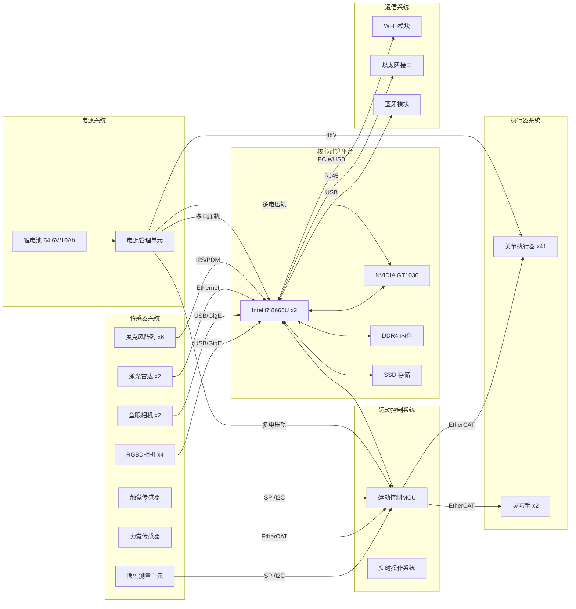
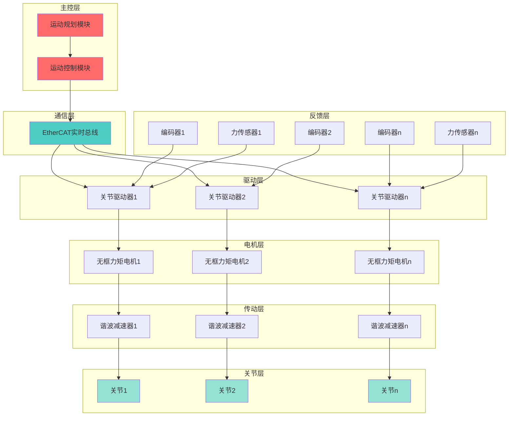
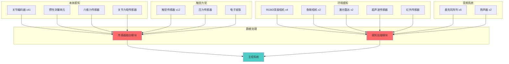

# 优必选 Walker S1 工业人形机器人硬件需求说明书 (HRS)

## 文档信息

- **产品名称**: Walker S1 工业人形机器人
- **产品型号**: Walker S1
- **文档版本**: V1.0
- **编制日期**: 2024年
- **产品定位**: 高端工业级人形机器人

---

## I. 系统架构与框图 (System Architecture)

### A. 核心控制系统

#### A.1 主控芯片/模组型号

**CPU配置** [事实]

| 参数 | 规格 | 说明 |
|------|------|------|
| 主控芯片 | Intel i7 8665U (双路) | 高性能通用计算 |
| CPU架构 | x86-64 | Kaby Lake Refresh架构 |
| 制程工艺 | 14nm | Intel 14nm+工艺 |
| 核心数 | 4核8线程 × 2 | 双路配置共8核16线程 |
| 基础频率 | 1.9GHz | 标准工作频率 |
| 最高睿频 | 4.2GHz | 单核睿频 |
| 缓存 | L1: 256KB, L2: 1MB, L3: 8MB (单颗) | 三级缓存 |
| TDP | 15W (单颗) | 热设计功耗 |
| 双路总功耗 | 约30W | CPU子系统功耗 |

**GPU配置** [事实]

| 参数 | 规格 | 说明 |
|------|------|------|
| GPU型号 | NVIDIA GT1030 | Pascal架构入门级独显 |
| CUDA核心 | 384个 | 并行计算单元 |
| 显存容量 | 2GB GDDR5 | 独立显存 |
| 显存位宽 | 64-bit | 显存总线宽度 |
| 显存带宽 | 48GB/s | 显存数据带宽 |
| GPU频率 | 基础1227MHz, 加速1468MHz | 核心频率 |
| 功耗 | 30W | 热设计功耗 |

**内存规格** [推理]

| 参数 | 需求规格 | 推理依据 |
|------|---------|---------|
| 内存容量 | ≥16GB DDR4 | 双路CPU+GPU计算需求 |
| 内存类型 | DDR4-2400/2666 | 匹配i7 8665U支持规格 |
| 内存通道 | 双通道 | 提升带宽 |
| 内存带宽 | ≥38.4GB/s | 双通道DDR4-2400 |

**存储规格** [推理]

| 参数 | 需求规格 | 推理依据 |
|------|---------|---------|
| 存储容量 | ≥256GB SSD | 操作系统+应用+日志存储 |
| 存储类型 | NVMe SSD或SATA SSD | 高速读写需求 |
| 读取速度 | ≥500MB/s | 快速启动和数据加载 |
| 写入速度 | ≥300MB/s | 日志记录和数据保存 |

**操作系统** [事实]

| 参数 | 规格 | 说明 |
|------|------|------|
| 操作系统 | ROSA 2.0 (优必选自研) | 机器人操作系统应用框架 |
| 内核 | Linux内核 (实时补丁) | 支持硬实时控制 |
| 中间件 | 自研中间件 | 通信、服务、数据管理 |
| ROS兼容 | 支持ROS通信协议 | 便于二次开发 |

**实时性能** [推理]

| 参数 | 需求值 | 推理依据 |
|------|--------|---------|
| 中断延迟 | <10μs | 实时控制需求 |
| 任务调度精度 | <1ms | 运动控制周期 |
| 通信延迟 | <100μs | EtherCAT总线需求 |

#### A.2 运动控制系统（人形机器人专属）

**运动控制芯片/MCU型号** [推理]

| 参数 | 需求规格 | 推理依据 |
|------|---------|---------|
| 运动控制MCU | STM32H7系列或FPGA | 高性能实时控制 |
| 主频 | ≥400MHz | 高速控制计算 |
| Flash | ≥1MB | 程序存储 |
| RAM | ≥512KB | 数据缓存 |
| 定时器 | 多路高精度定时器 | PWM生成和编码器接口 |

**控制架构** [事实]

| 参数 | 规格 | 说明 |
|------|------|------|
| 控制架构 | 分布式控制 | 每关节独立控制器 |
| 主控节点 | 主控CPU | 任务规划和运动规划 |
| 从控节点 | 41个关节控制器 | 关节级控制 |
| 通信方式 | EtherCAT高速实时总线 | 纳秒级同步 |

**控制周期** [推理]

| 控制环 | 频率 | 周期 | 说明 |
|--------|------|------|------|
| 电流环 | 10-20kHz | 50-100μs | 电机电流控制 |
| 速度环 | 1-2kHz | 0.5-1ms | 电机速度控制 |
| 位置环 | 1kHz | 1ms | 关节位置控制 |
| 力矩环 | 1kHz | 1ms | 关节力矩控制 |
| 步态控制 | 100-200Hz | 5-10ms | 步态规划 |

**实时总线协议** [事实]

| 参数 | 规格 | 说明 |
|------|------|------|
| 总线类型 | EtherCAT | 高速实时以太网 |
| 通信周期 | 纳秒级 | 超低延迟 |
| 同步精度 | <1μs | 分布式时钟同步 |
| 拓扑结构 | 线性/树形 | 灵活拓扑 |
| 从站数量 | ≥50个 | 支持41关节+扩展 |

#### A.3 感知处理单元

**视觉处理芯片** [关联]

| 处理单元 | 规格 | 功能 |
|----------|------|------|
| 主GPU | NVIDIA GT1030 | 视觉处理、深度学习推理 |
| ISP | 集成于GPU | 图像信号处理 |
| 视觉处理能力 | 384 CUDA核心 | 并行图像处理 |
| 深度学习推理 | CUDA + cuDNN加速 | 目标检测、识别 |

**语音处理芯片** [推理]

| 处理单元 | 需求规格 | 推理依据 |
|----------|---------|---------|
| 音频DSP | 专用音频处理芯片 | 语音识别前端处理 |
| 音频编解码 | 高性能音频编解码器 | 高质量音频采集和播放 |
| 采样率 | 16-48kHz | 语音频段覆盖 |
| 通道数 | ≥6通道 | 6麦克风阵列 |

**传感器融合芯片** [推理]

| 处理单元 | 需求规格 | 推理依据 |
|----------|---------|---------|
| IMU处理单元 | 集成于主控或专用MCU | 姿态解算 |
| 融合算法 | 卡尔曼滤波/粒子滤波 | 多传感器数据融合 |
| 更新频率 | 1kHz | 高频姿态更新 |

#### A.4 通信子系统

**Wi-Fi模块** [事实]

| 参数 | 规格 | 说明 |
|------|------|------|
| 协议支持 | 802.11 a/b/g/n | 主流Wi-Fi协议 |
| 频段 | 5GHz/2.4GHz双频 | 抗干扰能力 |
| 天线配置 | MIMO | 提升传输速率 |
| 传输速率 | 最高300-600Mbps | 高速数据传输 |

**蓝牙模块** [推理]

| 参数 | 需求规格 | 推理依据 |
|------|---------|---------|
| 协议版本 | Bluetooth 5.0+ | 低功耗、远距离 |
| 支持协议 | A2DP/AVRCP/HFP/BLE | 音频传输和控制 |
| 传输距离 | ≥10m | 近距离通信 |

**以太网接口** [事实]

| 参数 | 规格 | 说明 |
|------|------|------|
| 接口类型 | RJ45 | 标准以太网接口 |
| 速率 | 10/100/1000Mbps | 千兆以太网 |
| 数量 | 1个 | 外部通信 |

**5G/4G模块** [推理]

| 参数 | 需求规格 | 推理依据 |
|------|---------|---------|
| 网络支持 | 4G LTE (可选5G) | 远程通信和监控 |
| 数据速率 | ≥100Mbps (4G) | 高速数据传输 |

### B. 硬件系统框图



---

## II. 执行器系统（人形机器人专属）

### A. 关节执行器清单

#### A.1 自由度分布

**整机自由度配置** [事实]

| 部位 | 自由度数量 | 具体分布 | 说明 |
|------|-----------|---------|------|
| 腿部 | 12个 (6×2) | 髋3+膝1+踝2 (每腿) | 双足行走 |
| 臂部 | 14个 (7×2) | 肩3+肘1+腕3 (每臂) | 操作执行 |
| 手部 | 12个 (6×2) | 灵巧手 (每手) | 精细操作 |
| 颈部 | 3个 | 俯仰+偏航+侧倾 | 头部运动 |
| **总计** | **41个** | - | 全身自由度 |

**各关节运动范围** [推理]

| 关节 | 运动范围 | 说明 |
|------|---------|------|
| 髋关节屈曲/伸展 | -30°~+120° | 大腿前后摆动 |
| 髋关节外展/内收 | -30°~+45° | 大腿左右摆动 |
| 髋关节内旋/外旋 | -45°~+45° | 大腿旋转 |
| 膝关节屈曲/伸展 | 0°~+140° | 小腿弯曲 |
| 踝关节背屈/跖屈 | -40°~+30° | 脚尖上下 |
| 踝关节内翻/外翻 | -20°~+20° | 脚尖左右 |
| 肩关节屈曲/伸展 | -45°~+180° | 上臂前后 |
| 肩关节外展/内收 | -30°~+180° | 上臂左右 |
| 肩关节内旋/外旋 | -90°~+90° | 上臂旋转 |
| 肘关节屈曲/伸展 | 0°~+145° | 前臂弯曲 |
| 腕关节屈曲/伸展 | -70°~+80° | 手掌上下 |
| 腕关节桡偏/尺偏 | -25°~+25° | 手掌左右 |
| 腕关节旋前/旋后 | -90°~+90° | 手掌旋转 |

**各关节最大速度** [推理]

| 关节类型 | 最大角速度 | 说明 |
|----------|-----------|------|
| 髋关节 | 180-300°/s | 大幅度运动 |
| 膝关节 | 200-350°/s | 快速弯曲 |
| 踝关节 | 150-250°/s | 平衡调整 |
| 肩关节 | 180-300°/s | 手臂运动 |
| 肘关节 | 200-350°/s | 快速操作 |
| 腕关节 | 250-400°/s | 精细操作 |

**各关节最大扭矩** [事实]

| 关节类型 | 最大扭矩 | 说明 |
|----------|---------|------|
| 核心关节 | 250N·m | 髋、膝等主要承重关节 |
| 关节扭矩范围 | 4.5Nm-250Nm | 不同部位不同扭矩 |

#### A.2 执行器类型

**执行器分类** [事实]

| 类型 | 应用部位 | 特点 |
|------|---------|------|
| 旋转执行器 | 全身关节 | 一体化关节设计 |
| 线性执行器 | 部分特殊关节 | 直线运动 |

**一体化关节技术** [事实]

| 特性 | 规格 | 说明 |
|------|------|------|
| 集成部件 | 伺服驱动器+无框力矩电机+减速器+编码器 | 高度集成 |
| 特点 | 高性能、高力矩、高集成化 | 模组化设计 |
| 优势 | 提升运动性能和稳定性，支持量产 | 易于维护 |

### B. 伺服电机规格

#### B.1 电机类型

**电机配置** [事实]

| 参数 | 规格 | 说明 |
|------|------|------|
| 电机类型 | 无框力矩电机 | 一体化关节设计 |
| 特点 | 去除传统外壳和轴承 | 减小体积和重量 |
| 集成方式 | 直接集成到关节内部 | 紧凑设计 |

**电机参数** [推理]

| 电机规格 | 需求值 | 推理依据 |
|----------|--------|---------|
| 额定功率 | 100-500W (不同关节) | 关节负载需求 |
| 额定扭矩 | 1-50Nm (电机端) | 不同关节需求 |
| 额定转速 | 1000-3000rpm | 配合减速器 |
| 峰值扭矩 | 3-5倍额定扭矩 | 短时过载 |
| 堵转扭矩 | 5-10倍额定扭矩 | 启动和堵转 |

#### B.2 编码器配置

**编码器规格** [推理]

| 参数 | 需求规格 | 推理依据 |
|------|---------|---------|
| 编码器类型 | 绝对值编码器 | 断电位置记忆 |
| 分辨率 | ≥17bit (131072线) | 高精度位置反馈 |
| 精度 | ±0.01° | 高精度控制 |
| 通信接口 | BiSS-C/EnDat | 高速数字接口 |

#### B.3 电流采样

**电流采样规格** [推理]

| 参数 | 需求规格 | 推理依据 |
|------|---------|---------|
| 采样精度 | ≥12bit | 精确电流控制 |
| 采样频率 | 与电流环同步 | 实时控制 |
| 采样方式 | 霍尔传感器或采样电阻 | 相电流检测 |

### C. 减速器规格

#### C.1 减速器类型

**减速器配置** [事实]

| 参数 | 规格 | 说明 |
|------|------|------|
| 主要类型 | 谐波减速器 | 高精度传动 |
| 核心供应商 | 绿的谐波 | 占关节总成采购量超40% |
| 应用部位 | 手指关节、腕部等高精度部位 | 高精度需求 |

**谐波减速器规格** [事实]

| 参数 | 规格 | 说明 |
|------|------|------|
| 重复定位精度 | ±0.05° | 高精度定位 |
| 控制误差 | ≤0.1° | 精确控制 |
| 寿命 | >3万小时 | 长寿命设计 |
| 单机价值量 | 5000-8000元 | 成本参考 |

**减速器工作原理** [事实]

| 组件 | 功能 | 说明 |
|------|------|------|
| 波发生器 | 椭圆形凸轮+轴承 | 驱动柔轮周期性变形 |
| 柔轮 | 弹性变形齿轮 | 比刚轮少2个齿 |
| 刚轮 | 刚性内齿环 | 精密啮合 |

#### C.2 减速比配置

**减速比范围** [推理]

| 关节类型 | 减速比范围 | 说明 |
|----------|-----------|------|
| 髋关节 | 80:1~120:1 | 大扭矩需求 |
| 膝关节 | 80:1~120:1 | 大扭矩需求 |
| 踝关节 | 50:1~80:1 | 中等扭矩 |
| 肩关节 | 50:1~100:1 | 中等扭矩 |
| 肘关节 | 50:1~80:1 | 中等扭矩 |
| 腕关节 | 30:1~50:1 | 精细操作 |
| 手指关节 | 30:1~50:1 | 精细操作 |

### D. 关节驱动器

#### D.1 驱动器规格

**驱动器配置** [推理]

| 参数 | 需求规格 | 推理依据 |
|------|---------|---------|
| 控制模式 | 位置/速度/力矩/电流 | 多模式控制 |
| 通信接口 | EtherCAT | 实时总线 |
| 工作电压 | 48V DC | 电池电压 |
| 峰值电流 | 20-50A (不同关节) | 峰值功率需求 |
| 持续电流 | 5-15A (不同关节) | 持续工作 |

#### D.2 保护功能

**驱动器保护** [推理]

| 保护类型 | 保护机制 | 说明 |
|----------|---------|------|
| 过流保护 | 电流超过阈值自动断电 | 保护电机和驱动器 |
| 过热保护 | 温度超过阈值降功率运行 | 防止过热损坏 |
| 过压保护 | 电压异常时停止工作 | 保护电路 |
| 欠压保护 | 电压过低时停止工作 | 保护电池 |

### E. 执行器系统架构图



---

## III. 传感器系统

### A. 本体感知传感器

#### A.1 关节位置传感器

**编码器配置** [推理]

| 参数 | 需求规格 | 推理依据 |
|------|---------|---------|
| 类型 | 绝对值编码器 | 断电位置记忆 |
| 数量 | 41个 | 每关节一个 |
| 分辨率 | ≥17bit | 高精度位置反馈 |
| 精度 | ±0.01° | 高精度控制 |
| 安装位置 | 电机端或输出端 | 根据关节设计 |

#### A.2 关节力矩传感器

**力矩传感器配置** [推理]

| 参数 | 需求规格 | 推理依据 |
|------|---------|---------|
| 类型 | 应变式力矩传感器 | 高精度力矩检测 |
| 数量 | 若干 (关键关节) | 主要承重关节 |
| 量程 | 根据关节扭矩配置 | 匹配关节规格 |
| 精度 | 0.1N·m | 高精度力控制 |
| 安装位置 | 关节输出端 | 直接测量输出力矩 |

#### A.3 六维力传感器

**六维力传感器配置** [推理]

| 参数 | 需求规格 | 推理依据 |
|------|---------|---------|
| 类型 | 六维力/力矩传感器 | 完整力信息 |
| 数量 | 2-4个 | 脚底和/或手腕 |
| 量程 | 力: ±500N, 力矩: ±50N·m | 根据应用需求 |
| 精度 | 力: 0.5N, 力矩: 0.05N·m | 高精度力控制 |
| 安装位置 | 脚底、手腕 | 接触力检测 |

#### A.4 IMU惯性测量单元

**IMU配置** [推理]

| 参数 | 需求规格 | 推理依据 |
|------|---------|---------|
| 类型 | 6轴或9轴IMU | 姿态和运动检测 |
| 数量 | 1-2个 | 躯干和/或头部 |
| 陀螺仪精度 | 0.01°/s | 高精度角速度 |
| 加速度计精度 | 0.001g | 高精度加速度 |
| 更新频率 | 1kHz | 高频姿态更新 |
| 安装位置 | 躯干上部 | 靠近质心 |

#### A.5 倾角传感器

**倾角传感器配置** [推理]

| 参数 | 需求规格 | 推理依据 |
|------|---------|---------|
| 类型 | 双轴倾角传感器 | 姿态检测 |
| 精度 | 0.1° | 高精度倾角 |
| 量程 | ±90° | 全范围检测 |

### B. 环境感知传感器

#### B.1 视觉传感器清单

**头部摄像头配置** [事实]

| 传感器类型 | 数量 | 位置 | 技术规格 | 功能 |
|-----------|------|------|---------|------|
| 全景鱼眼相机 | 2个 | 双耳位置 | 180°视场角 | 360°环境监测 |
| RGBD深度相机 | 若干 | 面部区域 | 1920×1080, 30fps | 三维环境感知 |

**RGBD相机参数** [事实]

| 参数 | 规格 | 说明 |
|------|------|------|
| 分辨率 | 1920×1080 | 高清图像 |
| 帧率 | 30fps | 实时视频 |
| 深度支持 | 是 | 3D感知 |
| 工作距离 | 0.3-5m | 中近距离 |

**鱼眼相机参数** [事实]

| 参数 | 规格 | 说明 |
|------|------|------|
| 视场角 | 180° | 全景视野 |
| 数量 | 2个 | 双耳位置 |
| 功能 | 360°安全监测 | 全方位感知 |

#### B.2 激光雷达

**激光雷达配置** [关联]

| 参数 | 规格 | 说明 |
|------|------|------|
| 型号 | WLR-750 (万集科技) | 供应链信息 |
| 数量 | 2个 | Walker S2配置参考 |
| 单价 | 约3000元 | 价值量参考 |
| 测距精度 | ±1cm~±5mm | 毫米级精度 |
| 测距范围 | 0.1-30m | 中远距离 |
| 视场角 | 360°水平 | 全向扫描 |
| 扫描频率 | 10-20Hz | 实时更新 |

**激光雷达技术特点** [事实]

| 特性 | 说明 |
|------|------|
| 全天候工作 | 不受光线影响，黑暗、雨雾中正常工作 |
| 高精度 | 毫米级测距精度 |
| 全向感知 | 360°全向视场 |

#### B.3 超声波传感器

**超声波传感器配置** [推理]

| 参数 | 需求规格 | 推理依据 |
|------|---------|---------|
| 类型 | 超声波测距传感器 | 近距离检测 |
| 数量 | 若干 | 近距离避障 |
| 测距范围 | 0.02-5m | 近距离检测 |
| 精度 | ±1cm | 近距离精度 |
| 安装位置 | 躯干、腿部 | 近距离避障 |

#### B.4 红外传感器

**红外传感器配置** [推理]

| 参数 | 需求规格 | 推理依据 |
|------|---------|---------|
| 类型 | 红外接近传感器 | 接近检测 |
| 用途 | 人体检测、接近检测 | 安全交互 |
| 检测距离 | 0.5-5m | 中近距离 |

### C. 触觉与力觉传感器

#### C.1 电子皮肤

**电子皮肤配置** [推理]

| 参数 | 需求规格 | 推理依据 |
|------|---------|---------|
| 覆盖区域 | 手臂、躯干部分区域 | 人机交互安全 |
| 传感器类型 | 电容/电阻式 | 触觉检测 |
| 分辨率 | 5-10mm间距 | 触觉分辨率 |

#### C.2 触觉传感器

**灵巧手触觉传感器** [事实]

| 参数 | 规格 | 说明 |
|------|------|------|
| 类型 | 阵列式触觉压力传感器 | 力分布检测 |
| 数量 | 6个/手 | 每手6个 |
| 分布 | 手指关键部位 | 精准感知 |
| 功能 | 检测Fx、Fy、Fz、Mx、My、Mz | 六维力/力矩 |

**触觉传感器性能** [推理]

| 参数 | 需求规格 | 推理依据 |
|------|---------|---------|
| 力测量精度 | 0.1N | 高精度力检测 |
| 力矩测量精度 | 0.01N·m | 高精度力矩检测 |
| 响应时间 | <1ms | 实时反馈 |
| 过载保护 | 10倍额定力 | 安全保护 |

#### C.3 压力传感器

**脚底压力传感器** [推理]

| 参数 | 需求规格 | 推理依据 |
|------|---------|---------|
| 类型 | 压力传感器阵列 | 足底压力分布 |
| 数量 | 4-8个/脚 | 压力分布检测 |
| 布局 | 前掌、足弓、后跟 | 全面覆盖 |
| 量程 | 0-100kg | 承载能力 |
| 精度 | 0.1kg | 高精度压力 |

### D. 音频传感器

#### D.1 麦克风阵列

**麦克风配置** [事实]

| 参数 | 规格 | 说明 |
|------|------|------|
| 类型 | 驻极体或MEMS麦克风 | 高质量拾音 |
| 数量 | 6个 | 阵列配置 |
| 布局 | 360°环绕分布 | 全向拾音 |
| 指向性 | 全向 | 360°听觉感知 |

**麦克风性能** [推理]

| 参数 | 需求规格 | 推理依据 |
|------|---------|---------|
| 频率响应 | 100Hz-16kHz | 语音频段 |
| 信噪比 | >60dB | 高质量拾音 |
| 灵敏度 | -35dB±3dB | 灵敏拾音 |
| 有效距离 | 3-5m | 远场拾音 |

#### D.2 扬声器

**扬声器配置** [推理]

| 参数 | 需求规格 | 推理依据 |
|------|---------|---------|
| 数量 | 2个 | 立体声输出 |
| 功率 | 5-10W | 清晰音量 |
| 频率响应 | 100Hz-20kHz | 全频段 |
| 安装位置 | 头部或躯干 | 声音传播 |

### E. 传感器系统架构图



---

## IV. 通信与网络

### A. 内部通信

#### A.1 运动控制总线

**EtherCAT总线配置** [事实]

| 参数 | 规格 | 说明 |
|------|------|------|
| 总线类型 | EtherCAT | 高速实时以太网 |
| 拓扑结构 | 线性/树形 | 灵活配置 |
| 通信周期 | <1ms | 高实时性 |
| 同步精度 | <1μs | 分布式时钟 |
| 从站数量 | ≥50个 | 支持41关节+扩展 |
| 带宽 | 100Mbps | 高速数据传输 |

**EtherCAT优势** [事实]

| 特性 | 说明 |
|------|------|
| 超低延迟 | 纳秒级通信延迟 |
| 高同步精度 | 多轴运动高精度同步 |
| 高带宽利用率 | 接近100%带宽利用 |
| 分布式时钟 | 系统时间一致性 |

#### A.2 传感器总线

**I2C总线配置** [推理]

| 参数 | 需求规格 | 推理依据 |
|------|---------|---------|
| 设备地址 | 7位或10位地址 | 多设备支持 |
| 时钟频率 | 100kHz/400kHz | 标准I2C速率 |
| 时序 | 标准I2C时序 | 兼容性 |

**SPI接口配置** [推理]

| 参数 | 需求规格 | 推理依据 |
|------|---------|---------|
| 模式 | SPI Mode 0-3 | 灵活配置 |
| 时钟频率 | 1-10MHz | 高速传输 |
| 片选逻辑 | 多路片选 | 多设备支持 |

**UART接口配置** [推理]

| 参数 | 需求规格 | 推理依据 |
|------|---------|---------|
| 波特率 | 9600-921600bps | 多种速率 |
| 数据格式 | 8N1/8E1/8O1 | 标准格式 |

#### A.3 内部以太网

**内部以太网配置** [推理]

| 参数 | 需求规格 | 推理依据 |
|------|---------|---------|
| 带宽 | 100Mbps/1Gbps | 高速内部通信 |
| 拓扑 | 星形/交换式 | 灵活连接 |

### B. 外部通信

#### B.1 Wi-Fi模块

**Wi-Fi配置** [事实]

| 参数 | 规格 | 说明 |
|------|------|------|
| 协议支持 | 802.11 a/b/g/n | 主流协议 |
| 频段 | 5GHz/2.4GHz双频 | 抗干扰 |
| 天线配置 | MIMO | 提升性能 |
| 传输速率 | 最高300-600Mbps | 高速传输 |

#### B.2 蓝牙模块

**蓝牙配置** [推理]

| 参数 | 需求规格 | 推理依据 |
|------|---------|---------|
| 协议版本 | Bluetooth 5.0+ | 低功耗远距离 |
| 支持协议 | A2DP/AVRCP/HFP/BLE | 音频和控制 |
| 传输距离 | ≥10m | 近距离通信 |

#### B.3 以太网接口

**以太网配置** [事实]

| 参数 | 规格 | 说明 |
|------|------|------|
| 接口类型 | RJ45 | 标准接口 |
| 速率 | 10/100/1000Mbps | 千兆以太网 |
| 数量 | 1个 | 外部通信 |

#### B.4 4G/5G模块

**移动通信配置** [推理]

| 参数 | 需求规格 | 推理依据 |
|------|---------|---------|
| 网络支持 | 4G LTE (可选5G) | 远程通信 |
| 数据速率 | ≥100Mbps (4G) | 高速传输 |

---

## V. 电源管理系统

### A. 电池系统

#### A.1 电池规格

**电池配置** [事实]

| 参数 | 规格 | 说明 |
|------|------|------|
| 电池类型 | 锂电池 | 高能量密度 |
| 电压平台 | 54.6V | 高压平台 |
| 容量 | 10Ah | 容量配置 |
| 能量 | 546Wh | 总能量 |
| 重量 | 3.6kg | 轻量化设计 |
| 能量密度 | 约150Wh/kg | 行业领先 |

**电池组配置** [推理]

| 参数 | 需求规格 | 推理依据 |
|------|---------|---------|
| 电芯类型 | 18650或21700锂离子电芯 | 成熟技术 |
| 串联数 | 13S (13串) | 54.6V/4.2V≈13 |
| 并联数 | 根据容量需求配置 | 10Ah容量 |
| 电压范围 | 42V-58.8V | 工作电压范围 |

#### A.2 电池管理系统

**BMS配置** [推理]

| 功能 | 规格 | 说明 |
|------|------|------|
| BMS芯片 | 专用电池管理芯片 | 多串锂电池管理 |
| 电压监测 | 每节电芯电压监测 | 均衡管理 |
| 电流监测 | 高精度电流检测 | 电量计算 |
| 温度监测 | 多点温度监测 | 安全保护 |
| SOC估算 | 高精度SOC算法 | 电量显示 |
| 均衡功能 | 主动/被动均衡 | 电芯均衡 |

**电池保护功能** [推理]

| 保护类型 | 保护机制 | 说明 |
|----------|---------|------|
| 过充保护 | 单节>4.25V停止充电 | 防止过充 |
| 过放保护 | 单节<2.75V停止放电 | 防止过放 |
| 过流保护 | 电流>阈值断开 | 防止过流 |
| 过热保护 | 温度>60°C降功率 | 防止过热 |
| 短路保护 | 短路时断开 | 防止短路 |

### B. 充电系统

#### B.1 充电规格

**充电配置** [事实]

| 参数 | 规格 | 说明 |
|------|------|------|
| 充电方式 | 有线充电 | 标准充电 |
| 充电时间 | 2小时 (0-100%) | 快速充电 |
| 充电功率 | 约270W | 充电功率 |

**充电曲线** [推理]

| 阶段 | 充电模式 | 充电电流 | 说明 |
|------|---------|---------|------|
| 预充电 | 小电流充电 | 1-2A | 低电量保护 |
| 恒流充电 | CC模式 | 5-10A | 快速充电 |
| 恒压充电 | CV模式 | 逐渐减小 | 充满保护 |
| 充满截止 | 停止充电 | 0A | 充满指示 |

**快充支持** [推理]

| 参数 | 需求规格 | 推理依据 |
|------|---------|---------|
| 快充协议 | 自定义快充协议 | 快速补电 |
| 快充功率 | 约500W | 1小时充至80% |
| 快充时间 | 1小时充至80% | 快速补电 |

#### B.2 充电接口

**充电接口配置** [推理]

| 参数 | 需求规格 | 推理依据 |
|------|---------|---------|
| 接口类型 | 专用充电接口 | 安全可靠 |
| 额定电流 | ≥15A | 支持快充 |
| 防护等级 | IP67 | 防水防尘 |
| 位置 | 躯干侧面 | 易于操作 |

### C. 电源分配

#### C.1 主电源轨

**电压轨配置** [推理]

| 电压轨 | 电压 | 功率分配 | 负载 |
|--------|------|---------|------|
| 主电源轨 | 48V | 约400W | 关节执行器 |
| 中压轨 | 24V | 约50W | 部分传感器、驱动器 |
| 中压轨 | 12V | 约100W | 计算平台、传感器 |
| 低压轨 | 5V | 约30W | MCU、通信模块 |
| 低压轨 | 3.3V | 约20W | 传感器、MCU |
| 低压轨 | 1.8V/1.2V | 约10W | CPU/GPU核心 |

#### C.2 DC-DC转换器

**电源转换配置** [推理]

| 转换器 | 输入 | 输出 | 功率 | 效率 |
|--------|------|------|------|------|
| 主DC-DC | 48V | 24V | 50W | >90% |
| 主DC-DC | 48V | 12V | 100W | >92% |
| 辅助DC-DC | 12V | 5V | 30W | >90% |
| LDO | 5V | 3.3V | 10W | >80% |
| LDO | 3.3V | 1.8V | 5W | >70% |

#### C.3 各子系统功耗

**功耗分配** [推理]

| 子系统 | 功耗 | 占比 | 说明 |
|--------|------|------|------|
| 计算平台 | 60W | 12% | CPU+GPU |
| 关节执行器 | 300W | 60% | 运动功耗 |
| 传感器系统 | 30W | 6% | 各类传感器 |
| 通信系统 | 20W | 4% | Wi-Fi等 |
| 电源管理 | 10W | 2% | DC-DC损耗 |
| 其他 | 80W | 16% | 预留和损耗 |
| **总功耗** | **500W** | **100%** | 综合工况 |

#### C.4 各工作模式功耗

**工作模式功耗** [事实]

| 工作模式 | 功耗 | 续航时间 | 说明 |
|----------|------|---------|------|
| 静态站立 | 约100W | 约4小时 | 低功耗模式 |
| 正常行走 | 约300W | 2-3小时 | 中等功耗 |
| 高负载作业 | 约500W | 约2小时 | 高功耗模式 |

### D. 逻辑电源树

```
[V_BATT 54.6V] ────┬─── [DC-DC: 48V] ──────── 关节驱动器 (41个)
                   │
                   ├─── [DC-DC: 24V] ──────── 部分传感器、驱动器
                   │
                   ├─── [DC-DC: 12V] ──────── 计算平台、传感器
                   │                            │
                   │                            ├─── CPU (Intel i7 x2)
                   │                            ├─── GPU (GT1030)
                   │                            └─── 风扇
                   │
                   ├─── [DC-DC: 5V] ────────── MCU、通信模块
                   │                            │
                   │                            ├─── 运动控制MCU
                   │                            ├─── Wi-Fi模块
                   │                            └─── 蓝牙模块
                   │
                   └─── [LDO: 3.3V] ────────── 传感器、MCU
                                                │
                                                ├─── IMU
                                                ├─── 编码器
                                                ├─── 触觉传感器
                                                └─── 麦克风阵列

充电系统:
[充电器] ──── [充电接口] ──── [BMS] ──── [电池组]
                              │
                              ├─── 电压监测
                              ├─── 电流监测
                              ├─── 温度监测
                              └─── 保护电路
```

---

## VI. PCB与电子架构

### A. 主控PCB

#### A.1 PCB规格

**主控板配置** [关联]

| 参数 | 规格 | 说明 |
|------|------|------|
| 架构 | "1+3+N"分布式多板架构 | 模块化设计 |
| 主控板数量 | 1块 | 核心大脑 |
| 功能板数量 | 3块 | 电源/安全/接口 |
| 扩展板数量 | N块 | 传感器/执行器 |

**主控PCB规格** [推理]

| 参数 | 需求规格 | 推理依据 |
|------|---------|---------|
| 层数 | 6层板 | 高速信号完整性 |
| 板厚 | 1.6mm | 标准厚度 |
| 铜厚 | 1oz (外层), 0.5oz (内层) | 功率承载 |
| 尺寸 | 约200mm×150mm | 根据机箱空间 |

#### A.2 关键芯片布局

**主控板布局** [关联]

| 元件类型 | 主要器件 | 布局特点 |
|----------|---------|---------|
| 处理器 | Intel i7 8665U (双路) | PCB中央，便于散热和信号传输 |
| 显卡 | NVIDIA GT1030 | 靠近处理器，减少数据传输延迟 |
| 存储器 | DDR4内存、SSD | 分布在处理器周围，确保访问速度 |
| 通信芯片 | 网络芯片、Wi-Fi芯片 | 接口区域，便于对外连接 |
| 电源管理IC | DC-DC、LDO | 独立区域，便于散热和保护 |

#### A.3 散热设计

**散热配置** [推理]

| 组件 | 散热方式 | 规格 |
|------|---------|------|
| CPU | 散热片+风扇 | 铝合金散热片，智能调速风扇 |
| GPU | 散热片+风扇 | 铝合金散热片，共享风扇 |
| 电源IC | 散热片 | 铜或铝合金散热片 |

#### A.4 层叠设计

**PCB层叠结构** [推理]

| 层 | 功能 | 说明 |
|----|------|------|
| Layer 1 | 顶层信号层 | 高速信号+元件面 |
| Layer 2 | 地平面 | 完整地平面 |
| Layer 3 | 电源平面 | 主电源轨 |
| Layer 4 | 电源平面 | 辅助电源轨 |
| Layer 5 | 地平面 | 完整地平面 |
| Layer 6 | 底层信号层 | 高速信号+元件面 |

### B. 关节驱动PCB

#### B.1 驱动板规格

**关节驱动板配置** [推理]

| 参数 | 需求规格 | 推理依据 |
|------|---------|---------|
| 布局方式 | 集成在关节内 | 一体化设计 |
| PCB层数 | 4层板 | 功率和信号分离 |
| 功率器件 | MOSFET桥 | 电机驱动 |
| 散热设计 | 外壳散热 | 关节外壳作为散热器 |

#### B.2 功率器件

**功率器件配置** [推理]

| 参数 | 需求规格 | 推理依据 |
|------|---------|---------|
| MOSFET类型 | N沟道功率MOSFET | 电机驱动 |
| 额定电流 | 20-50A | 根据关节功率 |
| 额定电压 | 60-100V | 48V系统 |
| 导通电阻 | <5mΩ | 低损耗 |

#### B.3 信号隔离

**隔离设计** [推理]

| 隔离类型 | 隔离器件 | 说明 |
|----------|---------|------|
| 通信隔离 | 数字隔离器 | EtherCAT通信隔离 |
| 采样隔离 | 隔离运放 | 电流采样隔离 |
| 驱动隔离 | 光耦/磁耦 | MOSFET驱动隔离 |

### C. 传感器PCB

#### C.1 传感器模块规格

**传感器PCB配置** [推理]

| 传感器类型 | PCB规格 | 说明 |
|-----------|---------|------|
| 视觉传感器 | 独立PCB | 通过USB/GigE连接 |
| IMU | 小型PCB | 通过SPI/I2C连接 |
| 触觉传感器 | 柔性PCB | 手指内部集成 |
| 麦克风阵列 | 环形PCB | 头部集成 |

#### C.2 信号调理

**信号调理电路** [推理]

| 信号类型 | 调理方式 | 说明 |
|----------|---------|------|
| 模拟信号 | 放大、滤波 | 传感器信号调理 |
| 数字信号 | 电平转换 | 接口匹配 |
| 高速信号 | 阻抗匹配 | 信号完整性 |

#### C.3 抗干扰设计

**抗干扰措施** [推理]

| 干扰类型 | 抗干扰措施 | 说明 |
|----------|-----------|------|
| 电磁干扰 | 屏蔽罩、滤波器 | 关键信号屏蔽 |
| 共模干扰 | 共模滤波器 | 信号线滤波 |
| 地线干扰 | 单点接地 | 地线设计 |

### D. PCB布局示意图

```
主控PCB布局示意 (顶视图):
┌─────────────────────────────────────────────────────┐
│                                                      │
│  ┌──────────────┐    ┌──────────────┐              │
│  │   CPU #1     │    │   CPU #2     │  ← 处理器区域 │
│  │  Intel i7    │    │  Intel i7    │              │
│  └──────────────┘    └──────────────┘              │
│         │                   │                       │
│         └────────┬──────────┘                       │
│                  │                                  │
│         ┌────────┴────────┐                        │
│         │      GPU        │  ← GPU区域              │
│         │   NVIDIA GT1030 │                        │
│         └─────────────────┘                        │
│                                                      │
│  ┌─────────┐  ┌─────────┐  ┌─────────┐            │
│  │ DDR4 #1 │  │ DDR4 #2 │  │ DDR4 #3 │  ← 内存区域│
│  └─────────┘  └─────────┘  └─────────┘            │
│                                                      │
│  ┌─────────────────────────────────────┐           │
│  │            电源管理区域              │  ← 电源区域│
│  │   DC-DC  │  DC-DC  │  LDO  │  LDO  │           │
│  └─────────────────────────────────────┘           │
│                                                      │
│  ┌─────────┐  ┌─────────┐  ┌─────────┐            │
│  │ 以太网  │  │  USB    │  │  调试   │  ← 接口区域│
│  │  接口   │  │  接口   │  │  接口   │            │
│  └─────────┘  └─────────┘  └─────────┘            │
│                                                      │
│  ┌─────────┐  ┌─────────┐  ┌─────────┐            │
│  │ Wi-Fi   │  │ 蓝牙    │  │ 存储    │  ← 通信区域│
│  │ 模块    │  │ 模块    │  │ SSD     │            │
│  └─────────┘  └─────────┘  └─────────┘            │
│                                                      │
└─────────────────────────────────────────────────────┘

关节驱动PCB布局示意:
┌─────────────────────────────────────┐
│                                      │
│  ┌─────────────────────────────────┐│
│  │        功率级 (MOSFET桥)         ││
│  │   Q1  │  Q2  │  Q3  │  Q4       ││
│  └─────────────────────────────────┘│
│                                      │
│  ┌─────────────────────────────────┐│
│  │        驱动和控制电路            ││
│  │  驱动IC │ MCU │ 编码器接口      ││
│  └─────────────────────────────────┘│
│                                      │
│  ┌─────────────────────────────────┐│
│  │        电流采样和传感            ││
│  │  采样电阻 │ 运放 │ 隔离器       ││
│  └─────────────────────────────────┘│
│                                      │
│  ┌─────────────────────────────────┐│
│  │        通信接口                  ││
│  │  EtherCAT接口 │ CAN接口         ││
│  └─────────────────────────────────┘│
│                                      │
└─────────────────────────────────────┘
```

---

## VII. 引脚与物理接口 (Pinout & Interfaces)

### A. 外部接口

#### A.1 充电接口

**充电接口配置** [推理]

| 参数 | 规格 | 说明 |
|------|------|------|
| 接口类型 | 专用圆形接口或航空插头 | 安全可靠 |
| 额定电压 | 54.6V DC | 电池电压 |
| 额定电流 | ≥15A | 支持快充 |
| 保护电路 | 过流、过压、反接保护 | 安全保护 |
| 防护等级 | IP67 | 防水防尘 |
| 位置 | 躯干侧面 | 易于操作 |

#### A.2 数据传输接口

**数据接口配置** [事实]

| 接口类型 | 数量 | 规格 | 功能 |
|----------|------|------|------|
| 以太网接口 | 1个 | RJ45, 10/100/1000Mbps | 高速数据传输、远程控制 |
| USB接口 | 2个 | USB 3.0 | 外部设备扩展、数据传输 |
| HDMI接口 | 0-1个 | HDMI 1.4 | 外接显示器 (可选) |

#### A.3 调试接口

**调试接口配置** [推理]

| 接口类型 | 位置 | 功能 | 工具要求 |
|----------|------|------|---------|
| JTAG接口 | 主控板 | CPU调试、程序下载 | JTAG调试器 |
| SWD接口 | 运动控制板 | MCU调试、程序下载 | SWD调试器 |
| UART调试口 | 躯干后侧 | 串口调试、日志输出 | USB转串口 |
| USB调试口 | 躯干后侧 | 高速调试、文件传输 | USB线缆 |

### B. 关键控制信号

#### B.1 重置电路

**复位逻辑** [推理]

| 复位类型 | 触发条件 | 复位范围 | 说明 |
|----------|---------|---------|------|
| 上电复位 | 上电时 | 全系统 | 系统初始化 |
| 硬件复位 | 复位按键 | 全系统 | 系统重启 |
| 软件复位 | 软件命令 | 部分系统 | 软件控制 |
| 看门狗复位 | 程序异常 | MCU系统 | 故障恢复 |

#### B.2 烧录接口

**固件烧录接口** [推理]

| 系统组件 | 烧录接口 | 烧录方式 | 说明 |
|----------|---------|---------|------|
| 主控CPU | USB/JTAG | 在线烧录 | 操作系统和应用 |
| 运动控制MCU | SWD/UART | 在线烧录 | 控制程序 |
| 关节驱动器 | EtherCAT/UART | 在线烧录 | 驱动程序 |

#### B.3 调试串口

**UART调试接口** [推理]

| 参数 | 规格 | 说明 |
|------|------|------|
| 波特率 | 115200bps (默认) | 标准调试波特率 |
| 数据位 | 8位 | 标准格式 |
| 停止位 | 1位 | 标准格式 |
| 校验位 | 无 | 标准格式 |
| 流控 | 无 | 简单连接 |

### C. 接口布局

**外部接口布局** [推理]

```
躯干后侧接口布局:
┌─────────────────────────────────────────────────────┐
│                                                      │
│    ┌─────┐  ┌─────┐  ┌─────┐  ┌─────┐             │
│    │ USB │  │ USB │  │网口 │  │调试 │             │
│    │ #1  │  │ #2  │  │RJ45 │  │串口 │             │
│    └─────┘  └─────┘  └─────┘  └─────┘             │
│                                                      │
│    ┌─────┐  ┌─────┐  ┌─────────────────┐          │
│    │电源 │  │复位 │  │    急停按钮     │          │
│    │按键 │  │按键 │  │   (红色蘑菇头)  │          │
│    └─────┘  └─────┘  └─────────────────┘          │
│                                                      │
└─────────────────────────────────────────────────────┘

躯干侧面接口布局:
┌─────────────────────────────────────────────────────┐
│                                                      │
│              ┌─────────────────┐                    │
│              │    充电接口     │                    │
│              │   (专用接口)    │                    │
│              └─────────────────┘                    │
│                                                      │
│              ┌─────────────────┐                    │
│              │   状态指示灯    │                    │
│              │ (电量/工作状态) │                    │
│              └─────────────────┘                    │
│                                                      │
└─────────────────────────────────────────────────────┘
```

---

## VIII. 需求确认检查清单

### 系统架构确认

- [x] 核心控制系统是否完整？(CPU、GPU、内存、存储、操作系统)
- [x] 运动控制系统是否完整？(MCU、控制架构、控制周期、总线协议)
- [x] 感知处理单元是否完整？(视觉、语音、传感器融合)
- [x] 通信子系统是否完整？(Wi-Fi、蓝牙、以太网、移动通信)
- [x] 硬件系统框图是否提供？(Mermaid图)

### 执行器系统确认

- [x] 关节执行器清单是否完整？(自由度分布、运动范围、速度、扭矩)
- [x] 伺服电机规格是否完整？(类型、功率、扭矩、编码器)
- [x] 减速器规格是否完整？(类型、减速比、精度、寿命)
- [x] 关节驱动器是否完整？(控制模式、通信、电压、电流、保护)
- [x] 执行器系统架构图是否提供？(Mermaid图)

### 传感器系统确认

- [x] 本体感知传感器是否完整？(编码器、力矩、六维力、IMU、倾角)
- [x] 环境感知传感器是否完整？(视觉、激光雷达、超声波、红外)
- [x] 触觉与力觉传感器是否完整？(电子皮肤、触觉、压力)
- [x] 音频传感器是否完整？(麦克风、扬声器)
- [x] 传感器系统架构图是否提供？(Mermaid图)

### 通信与网络确认

- [x] 内部通信是否完整？(EtherCAT、I2C、SPI、UART)
- [x] 外部通信是否完整？(Wi-Fi、蓝牙、以太网、移动通信)

### 电源管理系统确认

- [x] 电池系统是否完整？(类型、规格、BMS、保护)
- [x] 充电系统是否完整？(方式、功率、曲线、接口)
- [x] 电源分配是否完整？(电压轨、DC-DC、功耗分配)
- [x] 逻辑电源树是否提供？(ASCII图)

### PCB与电子架构确认

- [x] 主控PCB是否完整？(规格、布局、散热、层叠)
- [x] 关节驱动PCB是否完整？(规格、功率器件、隔离)
- [x] 传感器PCB是否完整？(规格、信号调理、抗干扰)
- [x] PCB布局示意图是否提供？(ASCII图)

### 引脚与物理接口确认

- [x] 外部接口是否完整？(充电、数据传输、调试)
- [x] 关键控制信号是否完整？(重置、烧录、调试)
- [x] 接口布局是否提供？(ASCII图)

---

## IX. 文档修订记录

| 版本 | 日期 | 修订内容 | 修订人 |
|------|------|---------|--------|
| V1.0 | 2024年 | 初始版本，基于调研报告、PRD和ID规格书生成 | 硬件团队 |

---

**文档说明**:
- 本文档基于《优必选Walker S1调研报告》、《01产品需求文档-PRD》和《02工业设计规格书-ID》生成
- 标注[事实]的内容直接引用自调研报告，严禁修改
- 标注[关联]的内容基于报告中A信息推导出的B逻辑
- 标注[推理]的内容为调研缺失，基于行业主流硬件设计逻辑补全
- 本文档作为硬件开发的基准需求文档，后续变更需经过评审流程
