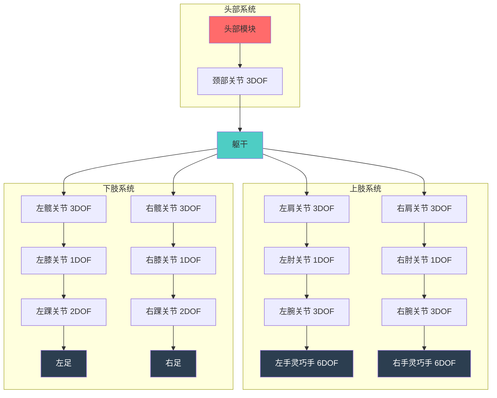
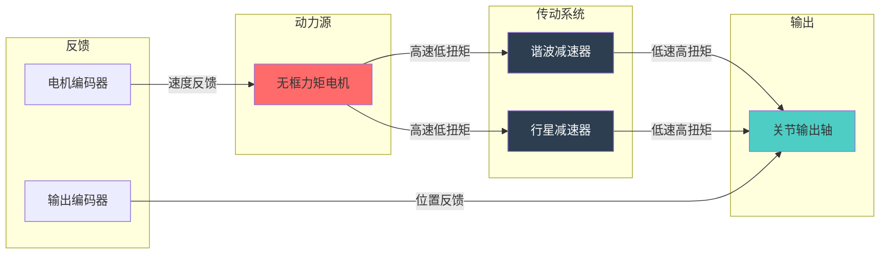
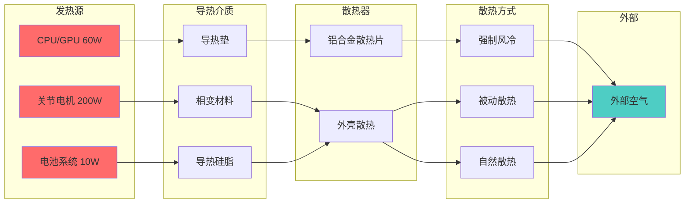
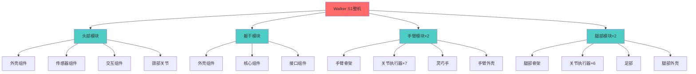
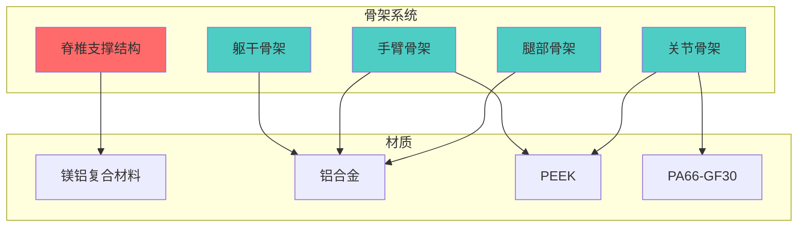
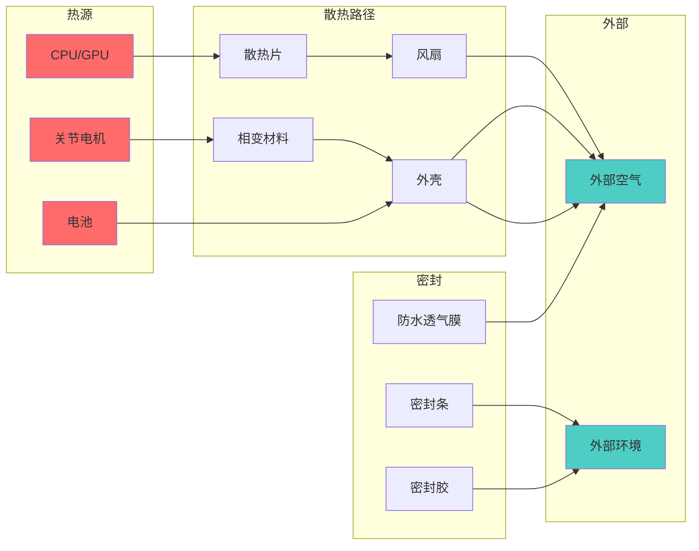

# 优必选 Walker S1 工业人形机器人结构设计说明书 (MD)

## 文档信息

- **产品名称**: Walker S1 工业人形机器人
- **产品型号**: Walker S1
- **文档版本**: V1.0
- **编制日期**: 2024年
- **产品定位**: 高端工业级人形机器人

---

## I. 堆叠方案与拆解逻辑 (Stack-up & Assembly)

### A. 骨架结构

#### A.1 骨架类型与材质

**骨架类型** [事实]
Walker S1 采用**刚性骨架**设计,整体呈现仿人形结构,身高172cm,体重76kg。

**骨架材质配置** [事实]

| 部位 | 材质 | 密度(g/cm³) | 强度(MPa) | 特性 |
|------|------|-----------|----------|------|
| 外壳/结构件 | 高强度铝合金 | 2.63~2.85 | 110~270 | 轻量化、高强度、耐腐蚀 |
| 脊椎支撑 | 铌微合金化镁铝复合材料 | 1.80~2.00 | 200~250 | 超轻、高强度、耐疲劳 |
| 手臂骨架 | PEEK(聚醚醚酮) | 1.30~1.32 | 90~100 | 低摩擦、耐磨、自润滑 |
| 腰部关节 | PA66-GF30(玻纤增强尼龙) | 1.30~1.40 | 150~180 | 高强度、耐磨、成本低 |
| 关节齿轮/轴承 | PEEK | 1.30~1.32 | 90~100 | 自润滑、低噪音 |

**骨架重量分布** [推理]

| 部件 | 重量占比 | 估算重量 | 说明 |
|------|---------|---------|------|
| 骨架总重 | 约40% | 约30kg | 含外壳结构件 |
| 脊椎结构 | 约8% | 约6kg | 镁铝复合材料 |
| 关节骨架 | 约15% | 约11kg | 含PEEK部件 |
| 外壳覆盖 | 约17% | 约13kg | 铝合金外壳 |

#### A.2 骨架强度与刚度

**脊椎支撑结构性能** [事实]

| 性能参数 | 数值 | 说明 |
|---------|------|------|
| 承载能力 | 50kg | 负载能力 |
| 连续工作时间 | 72小时 | 不间断工作 |
| 疲劳寿命 | 20,000次 | 从5,000次提升 |

**仿生脊柱结构设计** [事实]
- 结构形式: "刚性段-关节-刚性段-关节"交替布置
- 刚性段长度占比: ≥60%
- 关节连接: 花键连接+力矩传感器
- 外部包裹: 碳纤维套管(壁厚3-5mm)
- 设计目标: 平衡关节灵活性与整体抗扭

**骨架刚度分布** [推理]

| 部位 | 抗弯刚度 | 抗扭刚度 | 设计重点 |
|------|---------|---------|---------|
| 躯干 | 高 | 高 | 承载电池、主控系统 |
| 腿部 | 高 | 中 | 承重行走 |
| 手臂 | 中 | 中 | 灵活操作 |
| 颈部 | 中 | 低 | 头部运动 |

#### A.3 骨架连接方式

**连接方式配置** [推理]

| 连接部位 | 连接方式 | 特点 | 可拆装性 |
|---------|---------|------|---------|
| 主要结构件 | 螺栓连接 | 可靠、可拆卸 | 高 |
| 关节模块 | 法兰连接+定位销 | 精确定位 | 高 |
| 外壳覆盖 | 螺钉+卡扣 | 快速拆装 | 高 |
| 内部支架 | 螺栓+焊接 | 高强度 | 中 |

**模块化设计** [事实]
- 设计理念: 将全身架构拆分为独立功能模块
- 模块划分: 头部模块、躯干模块、上肢模块、下肢模块、电源模块、控制模块
- 接口标准化: 机械接口、电气接口、通信接口
- 优势: 独立研发、生产、更换与升级

### B. 关节执行器布局

#### B.1 自由度分布

**整机自由度配置** [事实]

```
Walker S1 关节分布示意图 (ASCII):

                    ┌─────────────┐
                    │    头部     │
                    │   (3 DOF)   │ ← 颈部: 俯仰+偏航+侧倾
                    └──────┬──────┘
                           │
         ┌─────────────────┼─────────────────┐
         │                 │                 │
    ┌────┴────┐      ┌─────┴─────┐     ┌────┴────┐
    │ 左臂    │      │   躯干    │     │ 右臂    │
    │(7 DOF)  │      │           │     │(7 DOF)  │
    │         │      │           │     │         │
    │ 肩3+肘1 │      │  腰部关节  │     │ 肩3+肘1 │
    │ +腕3    │      │  (可选)   │     │ +腕3    │
    └────┬────┘      └───────────┘     └────┬────┘
         │                                   │
    ┌────┴────┐                         ┌────┴────┐
    │ 左手    │                         │ 右手    │
    │(6 DOF)  │                         │(6 DOF)  │
    │ 灵巧手  │                         │ 灵巧手  │
    └─────────┘                         └─────────┘
                           │
         ┌─────────────────┼─────────────────┐
         │                 │                 │
    ┌────┴────┐      ┌─────┴─────┐     ┌────┴────┐
    │ 左腿    │      │   髋部    │     │ 右腿    │
    │(6 DOF)  │      │           │     │(6 DOF)  │
    │         │      │           │     │         │
    │ 髋3+膝1 │      │           │     │ 髋3+膝1 │
    │ +踝2    │      │           │     │ +踝2    │
    └────┬────┘      └───────────┘     └────┬────┘
         │                                   │
    ┌────┴────┐                         ┌────┴────┐
    │ 左足    │                         │ 右足    │
    └─────────┘                         └─────────┘

    总计: 41 DOF
    - 腿部: 12个 (6×2)
    - 臂部: 14个 (7×2)
    - 手部: 12个 (6×2)
    - 颈部: 3个
```

**各关节执行器规格** [事实]

| 关节部位 | 自由度 | 最大扭矩 | 扭矩范围 | 转速范围 |
|---------|--------|---------|---------|---------|
| 髋关节 | 3×2 | 250N·m | 高扭矩 | 30-90rpm |
| 膝关节 | 1×2 | 250N·m | 高扭矩 | 30-90rpm |
| 踝关节 | 2×2 | 中等 | 中扭矩 | 30-90rpm |
| 肩关节 | 3×2 | 中等 | 中扭矩 | 30-90rpm |
| 肘关节 | 1×2 | 中等 | 中扭矩 | 30-90rpm |
| 腕关节 | 3×2 | 较低 | 低扭矩 | 30-90rpm |
| 颈部 | 3 | 较低 | 低扭矩 | 30-90rpm |

#### B.2 执行器集成方式

**一体化关节技术** [事实]

| 特性 | 规格 | 说明 |
|------|------|------|
| 集成部件 | 伺服驱动器+无框力矩电机+减速器+编码器 | 高度集成 |
| 特点 | 高性能、高力矩、高集成化 | 模组化设计 |
| 驱动方式 | 创新型旋转驱动 | 全栈自研 |
| 优势 | 提升运动性能和稳定性，支持量产 | 易于维护 |

**执行器保护设计** [推理]

| 保护类型 | 设计方案 | 说明 |
|---------|---------|------|
| 防尘罩 | 关节外壳密封 | 防止粉尘进入 |
| 防撞结构 | 外壳圆角+缓冲材料 | 碰撞保护 |
| 散热结构 | 外壳散热+相变材料 | 热管理 |

#### B.3 关节布局Mermaid图



### C. 传动系统

#### C.1 传动类型

**传动系统配置** [事实]

| 传动类型 | 应用部位 | 特点 | 效率 |
|---------|---------|------|------|
| 谐波减速器 | 手指关节、腕部等高精度部位 | 高精度、低背隙 | ≥85% |
| 行星减速器 | 髋、膝等大扭矩关节 | 高扭矩、高刚性 | ≥90% |

**谐波减速器规格** [事实]

| 参数 | 规格 | 说明 |
|------|------|------|
| 供应商 | 绿的谐波 | 占关节总成采购量超40% |
| 重复定位精度 | ±0.05° | 高精度定位 |
| 控制误差 | ≤0.1° | 精确控制 |
| 寿命 | >30,000小时 | 长寿命设计 |
| 单机价值量 | 5,000-8,000元 | 成本参考 |

**谐波减速器工作原理** [事实]

```
谐波减速器结构示意 (ASCII):

        ┌─────────────────────────────────┐
        │         谐波减速器剖面          │
        │                                  │
        │    ┌───────────────────────┐    │
        │    │      刚轮(刚性内齿环)  │    │
        │    │   ┌───────────────┐   │    │
        │    │   │   柔轮(弹性)   │   │    │
        │    │   │  ┌─────────┐  │   │    │
        │    │   │  │ 波发生器 │  │   │    │
        │    │   │  │ (椭圆形) │  │   │    │
        │    │   │  │  凸轮+轴承│  │   │    │
        │    │   │  └─────────┘  │   │    │
        │    │   │    柔轮比刚轮 │   │    │
        │    │   │    少2个齿    │   │    │
        │    │   └───────────────┘   │    │
        │    └───────────────────────┘    │
        │                                  │
        │  输入: 波发生器(高速)            │
        │  输出: 柔轮或刚轮(低速)          │
        │  减速比 = 刚轮齿数/2             │
        └─────────────────────────────────┘
```

#### C.2 减速器集成方式

**减速比配置** [推理]

| 关节类型 | 减速比范围 | 减速器类型 | 说明 |
|---------|-----------|-----------|------|
| 髋关节 | 80:1~120:1 | 行星+谐波组合 | 大扭矩需求 |
| 膝关节 | 80:1~120:1 | 行星+谐波组合 | 大扭矩需求 |
| 踝关节 | 50:1~80:1 | 谐波减速器 | 中等扭矩 |
| 肩关节 | 50:1~100:1 | 谐波减速器 | 中等扭矩 |
| 肘关节 | 50:1~80:1 | 谐波减速器 | 中等扭矩 |
| 腕关节 | 30:1~50:1 | 谐波减速器 | 精细操作 |
| 手指关节 | 30:1~50:1 | 谐波减速器 | 精细操作 |

#### C.3 传动链路径

**传动链示意** [关联]

```
传动链路径 (ASCII):

电机 → 减速器 → 关节轴

┌─────────────────────────────────────────────────────────┐
│                    一体化关节传动链                      │
│                                                          │
│  ┌──────────┐    ┌──────────┐    ┌──────────┐          │
│  │ 无框力矩 │───→│ 谐波减速 │───→│ 关节输出 │          │
│  │   电机   │    │   器     │    │    轴    │          │
│  │          │    │          │    │          │          │
│  │ 高速低扭 │    │ 减速增扭 │    │ 低速高扭 │          │
│  │ 1000-    │    │ 30:1~    │    │ 30-      │          │
│  │ 3000rpm  │    │ 120:1    │    │ 90rpm    │          │
│  └──────────┘    └──────────┘    └──────────┘          │
│       ↑                              ↓                  │
│       │                              ↓                  │
│  ┌────┴────┐                   ┌──────────┐           │
│  │  编码器  │←──────────────────│  编码器  │           │
│  │ (电机端) │    位置反馈       │ (输出端) │           │
│  └─────────┘                   └──────────┘           │
│                                                          │
│  传动效率: ≥85%                                          │
│  背隙: ≤0.1°                                             │
└─────────────────────────────────────────────────────────┘
```

**传动效率分析** [推理]

| 传动环节 | 效率 | 累计效率 | 说明 |
|---------|------|---------|------|
| 电机 | 95% | 95% | 无框力矩电机 |
| 谐波减速器 | 85% | 81% | 啮合效率 |
| 轴承 | 99% | 80% | 支撑效率 |
| 总传动效率 | - | ≥80% | 整体效率 |

#### C.4 背隙补偿与润滑

**背隙补偿机构** [推理]

| 补偿方式 | 应用部位 | 原理 | 效果 |
|---------|---------|------|------|
| 预紧力调整 | 谐波减速器 | 波发生器预紧 | 背隙≤0.1° |
| 双波发生器 | 高精度关节 | 消除齿隙 | 背隙≤0.05° |

**传动润滑** [推理]

| 润滑部位 | 润滑方式 | 润滑剂 | 润滑周期 |
|---------|---------|--------|---------|
| 谐波减速器 | 油脂润滑 | 专用谐波油脂 | 密封免维护 |
| 轴承 | 油脂润滑 | 锂基润滑脂 | 10,000小时 |
| 关节连接处 | 定期注油 | 二硫化钼润滑脂 | 5,000小时 |

#### C.5 传动系统Mermaid图



---

## II. 关键组件固定方案 (Component Fixing)

### A. 手部结构

#### A.1 手掌结构

**手掌骨架规格** [关联]

| 参数 | 规格 | 说明 |
|------|------|------|
| 骨架材质 | PEEK | 轻量化、高强度 |
| 手掌尺寸 | 约20cm长 | 仿人设计 |
| 手掌重量 | 约1.5kg/手 [推理] | 含执行器 |
| 自由度 | 6个/手 | 灵活操作 |

**手掌结构示意** [关联]

```
灵巧手结构 (ASCII):

右手掌面图:
┌─────────────────────────────────┐
│         灵巧手(右手)             │
│                                  │
│    ┌───┐ ┌───┐ ┌───┐ ┌───┐ ┌───┐│
│    │小 │ │无 │ │中 │ │食 │ │拇 ││
│    │指 │ │名 │ │指 │ │指 │ │指 ││
│    └─┬─┘ └─┬─┘ └─┬─┘ └─┬─┘ └─┬─┘│
│      │     │     │     │     │  │
│    ┌─┴─┐ ┌─┴─┐ ┌─┴─┐ ┌─┴─┐ ┌─┴─┐│
│    │关节│ │关节│ │关节│ │关节│ │关节││
│    └─┬─┘ └─┬─┘ └─┬─┘ └─┬─┘ └─┬─┘│
│      │     │     │     │     │  │
│    ┌─┴─┐ ┌─┴─┐ ┌─┴─┐ ┌─┴─┐   │  │
│    │关节│ │关节│ │关节│ │关节│   │  │
│    └─┬─┘ └─┬─┘ └─┬─┘ └─┬─┘   │  │
│      │     │     │     │     │  │
│  ┌───┴─────┴─────┴─────┴─────┴───┐│
│  │         手掌骨架(PEEK)         ││
│  │  ┌───────────────────────┐   ││
│  │  │ 触觉传感器阵列(6个)    │   ││
│  │  │  ●  ●  ●  ●  ●  ●     │   ││
│  │  └───────────────────────┘   ││
│  └───────────────────────────────┘│
│         ↑                         │
│      手腕关节(3DOF)               │
└─────────────────────────────────┘

材料特性:
- PEEK摩擦系数: 0.1-0.2
- 热膨胀系数: 30×10⁻⁶/K
- 强度高、尺寸稳定性好
```

#### A.2 手指驱动方式

**手指驱动配置** [关联]

| 驱动方式 | 应用 | 特点 |
|---------|------|------|
| 电机直驱 | 各手指关节 | 精确控制、响应快 |
| 腱驱动 | 部分远端关节 [推理] | 轻量化、灵活 |

**手指关节活动范围** [推理]

| 手指 | 关节 | 活动范围 | 功能 |
|------|------|---------|------|
| 拇指 | 掌指关节 | 0-90° | 对指 |
| 拇指 | 指间关节 | 0-90° | 弯曲 |
| 食指 | 掌指关节 | 0-90° | 弯曲 |
| 食指 | 近端指间关节 | 0-100° | 弯曲 |
| 食指 | 远端指间关节 | 0-80° | 弯曲 |
| 中指/无名指/小指 | 同食指 | 同食指 | 弯曲 |

#### A.3 触觉集成

**触觉传感器布局** [事实]

| 参数 | 规格 | 说明 |
|------|------|------|
| 类型 | 阵列式触觉压力传感器 | 力分布检测 |
| 数量 | 6个/手 | 每手6个 |
| 分布 | 手指关键部位 | 精准感知 |
| 检测量 | Fx、Fy、Fz、Mx、My、Mz | 六维力/力矩 |

**触觉传感器性能** [推理]

| 性能参数 | 数值 | 说明 |
|---------|------|------|
| 力测量精度 | 0.1N | 高精度 |
| 力矩测量精度 | 0.01N·m | 高精度 |
| 响应时间 | <1ms | 实时反馈 |
| 过载保护 | 10倍额定力 | 安全保护 |

#### A.4 抓取能力

**抓取性能** [事实]

| 参数 | 规格 | 说明 |
|------|------|------|
| 抓取精度 | 微米级 | 柔软物体抓取 |
| 触觉感知 | 6个阵列式传感器 | 精准力度感知 |
| 操作模式 | 握拳、伸展、对指 | 多种模式 |

**抓取模式** [推理]

| 抓取模式 | 适用场景 | 抓取力控制 |
|---------|---------|-----------|
| 精细捏取 | 小物体、柔软物体 | 微米级控制 |
| 握持抓取 | 工具、零件 | 中等力度 |
| 支撑抓取 | 大物体、重物 | 较大力度 |
| 双手协作 | 大型物体 | 协同施力 |

### B. 足部结构

#### B.1 足部尺寸与重量

**足部参数** [推理]

| 参数 | 数值 | 说明 |
|------|------|------|
| 足部长度 | 约25cm | 踝到趾 |
| 足部宽度 | 约10cm [推理] | 仿人设计 |
| 足部高度 | 约8cm [推理] | 含踝关节 |
| 足部重量 | 约2kg/足 [推理] | 含传感器 |
| 占整机重量比例 | 约5% | 轻量化设计 |

#### B.2 足底设计

**足底结构** [关联]

| 参数 | 规格 | 说明 |
|------|------|------|
| 足底形状 | 仿象足形状 | 上宽下稳 |
| 足底材质 | 耐磨橡胶 | 防滑缓冲 |
| 足底刚度 | 分区设计 | 前掌软、后跟硬 |
| 弯折位置 | 1/3处 | 契合脚部发力点 |

**足底传感器布局** [推理]

| 传感器类型 | 数量 | 位置 | 功能 |
|-----------|------|------|------|
| 压力传感器 | 4-8个/足 | 前掌、足弓、后跟 | 压力分布检测 |
| 六维力传感器 | 1个/足 [推理] | 踝关节 | 地面反力检测 |

#### B.3 踝关节结构

**踝关节配置** [关联]

| 参数 | 规格 | 说明 |
|------|------|------|
| 自由度 | 2个/足 | 背屈/跖屈、内翻/外翻 |
| 活动范围 | 背屈/跖屈: -40°~+30° | 脚尖上下 |
| 活动范围 | 内翻/外翻: -20°~+20° | 脚尖左右 |
| 扭矩 | 中等扭矩 | 平衡调整 |

#### B.4 足部防护

**防护设计** [推理]

| 防护类型 | 设计方案 | 说明 |
|---------|---------|------|
| 防滑设计 | 耐磨橡胶鞋底 | 多种地面适应 |
| 减震设计 | 足弓弹性结构 | 行走缓冲 |
| 耐磨设计 | 高耐磨材料 | 长寿命 |

**地面适应性** [事实]
- 地毯、地板、大理石等不同材质地面稳定行走
- 障碍物、斜坡、台阶、不平整地面适应

### C. 躯干结构

#### C.1 躯干尺寸与重量

**躯干参数** [推理]

| 参数 | 数值 | 说明 |
|------|------|------|
| 躯干高度 | 约50cm | 颈部到髋部 |
| 胸围 | 约90cm | 最大周长 |
| 腰围 | 约70cm | 最小周长 |
| 躯干厚度 | 约25cm | 前后方向 |
| 躯干重量 | 约26kg | 含电池、主控 |
| 占整机重量比例 | 约35% | 主要重量集中 |

#### C.2 躯干刚度

**刚度参数** [推理]

| 参数 | 数值 | 说明 |
|------|------|------|
| 抗弯刚度 | 高 | 承载能力 |
| 抗扭刚度 | 高 | 稳定性 |

#### C.3 躯干内部布局

**内部组件布局** [关联]

```
躯干剖面图 (正面):
┌─────────────────────────────────┐
│  ┌─────────────────────────┐   │ ← 上部
│  │   主控系统               │   │
│  │   - CPU(Intel i7×2)     │   │
│  │   - GPU(GT1030)         │   │
│  │   - 内存、存储           │   │
│  │   - 散热系统             │   │
│  └─────────────────────────┘   │
│                                 │
│  ┌─────────────────────────┐   │ ← 中部
│  │   电池模块               │   │
│  │   - 54.6V/10Ah锂电池    │   │
│  │   - 重量3.6kg           │   │
│  │   - BMS管理系统         │   │
│  └─────────────────────────┘   │
│                                 │
│  ┌─────────────────────────┐   │ ← 下部
│  │   运动控制系统           │   │
│  │   - 实时控制器           │   │
│  │   - 电源管理             │   │
│  │   - EtherCAT主站        │   │
│  └─────────────────────────┘   │
│                                 │
│  ┌───────┐           ┌───────┐ │ ← 两侧
│  │左肩关节│           │右肩关节│ │
│  └───────┘           └───────┘ │
│                                 │
│  ┌───────┐           ┌───────┐ │
│  │左髋关节│           │右髋关节│ │
│  └───────┘           └───────┘ │
└─────────────────────────────────┘
```

#### C.4 躯干防护

**防护设计** [推理]

| 防护类型 | 设计方案 | 说明 |
|---------|---------|------|
| 防撞设计 | 外壳圆角+缓冲材料 | 碰撞保护 |
| 散热设计 | 风道+散热孔 | 热管理 |
| 防尘防水 | IP67密封设计 | 环境适应 |

### D. 头部结构

#### D.1 头部尺寸与重量

**头部参数** [推理]

| 参数 | 数值 | 说明 |
|------|------|------|
| 头部长度 | 约20cm | 前后方向 |
| 头部宽度 | 约18cm | 左右方向 |
| 头部高度 | 约25cm | 上下方向 |
| 头部重量 | 约3.8kg | 含传感器、计算单元 |
| 占整机重量比例 | 约5% | 轻量化设计 |

#### D.2 颈部结构

**颈部配置** [关联]

| 参数 | 规格 | 说明 |
|------|------|------|
| 自由度 | 3个 | 俯仰、偏航、侧倾 |
| 活动范围 | 俯仰: -30°~+30° | 点头 |
| 活动范围 | 偏航: -45°~+45° | 左右转头 |
| 活动范围 | 侧倾: -20°~+20° | 歪头 |
| 扭矩 | 较低扭矩 | 头部运动 |

#### D.3 头部传感器布局

**头部集成组件** [事实]

```
头部剖面图:
┌─────────────────────────────────┐
│  ┌───────────┐  ┌───────────┐  │
│  │ 左鱼眼相机 │  │ 右鱼眼相机 │  │ ← 双耳位置
│  │  (180°)   │  │  (180°)   │  │   全景感知
│  └───────────┘  └───────────┘  │
│                                 │
│  ┌─────────────────────────┐   │
│  │   RGBD深度相机           │   │ ← 面部区域
│  │   (1920×1080, 30fps)    │   │   3D感知
│  └─────────────────────────┘   │
│                                 │
│  ┌─────────────────────────┐   │
│  │   麦克风阵列(6个)         │   │ ← 360°分布
│  │   ●  ●  ●  ●  ●  ●      │   │   全向拾音
│  └─────────────────────────┘   │
│                                 │
│  ┌─────────────────────────┐   │
│  │   LED指示灯阵列           │   │ ← 灯语系统
│  │   (状态显示)              │   │   交互反馈
│  └─────────────────────────┘   │
│                                 │
│  ┌─────────────────────────┐   │
│  │   颈部关节(3DOF)          │   │ ← 底部
│  │   俯仰+偏航+侧倾          │   │   头部运动
│  └─────────────────────────┘   │
└─────────────────────────────────┘
```

#### D.4 头部防护

**防护设计** [推理]

| 防护类型 | 设计方案 | 说明 |
|---------|---------|------|
| 防撞设计 | 圆角外壳 | 碰撞保护 |
| 散热设计 | 头部散热孔 | 计算单元散热 |
| 防尘防水 | 传感器窗口密封 | IP67防护 |

---

## III. 热管理与可靠性 (Thermal & Reliability)

### A. 散热系统

#### A.1 发热源清单

**主要发热源** [关联]

| 发热源 | 功耗 | 位置 | 热特性 |
|--------|------|------|--------|
| CPU (Intel i7×2) | 约30W | 躯干上部 | 持续发热 |
| GPU (GT1030) | 约30W | 躯干上部 | 持续发热 |
| 关节驱动器 | 约200W | 各关节 | 脉冲发热 |
| 电源管理芯片 | 约20W | 躯干下部 | 持续发热 |
| 电池系统 | 约10W | 躯干中部 | 充放电发热 |

#### A.2 散热方式

**散热系统配置** [事实]

| 散热方式 | 应用部位 | 技术方案 | 效果 |
|---------|---------|---------|------|
| 强制风冷 | 躯干计算单元 | 风扇+散热片 | 8小时连续工作不发热 |
| 自然散热 | 电池系统 | 外壳散热 | 温度控制 |
| 被动散热+相变 | 关节执行器 | 外壳+相变材料 | 脉冲发热适应 |

**关节散热技术** [事实]
- 关节为全封闭结构,无法采用风冷、液冷
- 采用"被动散热+相变储能散热"结合技术
- 利用关节外壳作为散热终端
- 结合相变材料吸收峰值热量
- 适配动态脉冲式发热特点

#### A.3 散热路径

**散热路径示意** [关联]

```
散热路径 (ASCII):

热量产生源:
┌─────────────────────────────────┐
│  CPU/GPU → 散热片 → 风扇 → 散热孔│
│  (主控系统)                      │
│  功耗: 约60W                     │
│  热流: 芯片→散热片→空气→外部     │
└─────────────────────────────────┘
         ↓
┌─────────────────────────────────┐
│  关节电机 → 关节外壳 → 相变材料  │
│  (执行器)       → 被动散热        │
│  功耗: 约200W(峰值)              │
│  热流: 电机→外壳→相变材料→外部   │
└─────────────────────────────────┘
         ↓
┌─────────────────────────────────┐
│  电池 → 电池管理系统 → 自然散热  │
│  (电源系统)                      │
│  功耗: 约10W                     │
│  热流: 电池→外壳→空气            │
└─────────────────────────────────┘
```

#### A.4 导热介质与散热器

**散热材料配置** [推理]

| 散热材料 | 应用部位 | 规格 | 导热系数 |
|---------|---------|------|---------|
| 铝合金散热片 | CPU/GPU | 表面积最大化 | 200W/m·K |
| 导热垫 | 芯片与散热片之间 | 厚度1-2mm | 5-10W/m·K |
| 相变材料 | 关节内部 | 厚度3-5mm | 0.5-2W/m·K |
| 导热硅脂 | 芯片表面 | 薄层涂布 | 3-8W/m·K |

**散热器设计** [推理]

| 参数 | 规格 | 说明 |
|------|------|------|
| 材质 | 铝合金 | 轻量化、高导热 |
| 散热面积 | 最大化设计 | 提高散热效率 |
| 重量 | 约500g | 轻量化设计 |

#### A.5 风道设计

**风道配置** [推理]

| 参数 | 规格 | 说明 |
|------|------|------|
| 进风口位置 | 躯干后侧上部 | 冷空气入口 |
| 出风口位置 | 躯干后侧下部 | 热空气出口 |
| 风道路径 | 躯干内部贯通 | 空气流通 |
| 风扇数量 | 2-3个 | 强制对流 |
| 风扇控制 | 智能调速 | 根据温度调节 |

#### A.6 温度监控

**温度传感器配置** [推理]

| 传感器位置 | 数量 | 监控对象 | 过温阈值 |
|-----------|------|---------|---------|
| CPU/GPU | 2-4个 | 计算单元 | 85°C |
| 电池 | 2-4个 | 电池温度 | 60°C |
| 关节 | 若干 | 关节温度 | 70°C |
| 环境温度 | 1个 | 环境温度 | 50°C |

**散热性能** [事实]

| 参数 | 数值 | 说明 |
|------|------|------|
| 最大散热功率 | 约300W | 综合散热能力 |
| 稳态温度 | <85°C | CPU/GPU |
| 瞬态温度响应 | <5s | 温度变化响应 |

#### A.7 散热系统Mermaid图



### B. 防护系统

#### B.1 防尘防水

**防护等级** [事实]
- **防护等级**: IP67(部分型号)
- **IP6X**: 完全防止粉尘进入
- **IPX7**: 在1米深水中短时间浸泡(30分钟)不影响使用

**密封方式** [推理]

| 密封部位 | 密封材料 | 规格 | 密封效果 |
|---------|---------|------|---------|
| 外壳接缝 | 橡胶密封条 | 硬度Shore A 60-70 | IP67 |
| 关键连接处 | 硅酮密封胶 | 中性密封胶 | 增强密封 |
| 电缆接口 | 硅胶密封圈 | 硬度Shore A 50-60 | 防水防尘 |
| 按键周围 | 防水透气膜 | PU材质 | 防水透气 |
| 散热孔 | 防水透气膜 | 透气量1000ml/min | 防水透气 |
| 传感器窗口 | 透明防护罩 | 密封胶圈 | 防尘防水 |

#### B.2 防撞设计

**碰撞缓冲结构** [推理]

| 缓冲部位 | 缓冲材料 | 厚度 | 缓冲效果 |
|---------|---------|------|---------|
| 肩部外露处 | 硅胶垫 | 3-5mm | 吸能30-50% |
| 手臂末端 | 泡棉+硅胶 | 5-10mm | 吸能40-60% |
| 膝盖前侧 | 硅胶垫 | 3-5mm | 吸能30-50% |
| 躯干边缘 | 泡棉 | 5-10mm | 吸能20-40% |

**碰撞检测传感器** [推理]

| 传感器类型 | 数量 | 位置 | 功能 |
|-----------|------|------|------|
| 力传感器 | 若干 | 关键部位 | 碰撞检测 |
| 电子皮肤 | 部分区域 | 手臂、躯干 | 接触检测 |

#### B.3 跌倒保护

**跌倒保护设计** [推理]

| 保护措施 | 设计方案 | 说明 |
|---------|---------|------|
| 跌倒检测 | IMU+算法 | 检测跌倒状态 |
| 跌倒缓冲 | 关键部位缓冲材料 | 减少冲击 |
| 跌倒恢复 | 运动控制算法 | 自主站起 |

#### B.4 过载保护

**过载保护机制** [推理]

| 保护类型 | 保护机制 | 说明 |
|---------|---------|------|
| 关节过载 | 扭矩限制+软件保护 | 防止关节损坏 |
| 电机过载 | 电流限制+温度保护 | 防止电机烧毁 |
| 结构过载 | 安全系数设计 | 防止结构损坏 |

#### B.5 环境适应性

**环境适应范围** [事实]

| 环境参数 | 范围 | 说明 |
|---------|------|------|
| 工作温度 | -10°C至50°C | 工业环境适应 |
| 工作湿度 | 80%以下 | 防潮设计 |
| 工作海拔 | 0-3000m [推理] | 常规工业环境 |

---

## IV. 组装与维护 (Assembly & Maintenance)

### A. 组装工艺

#### A.1 组装流程

**装配流程(由内向外)** [推理]

```
装配步骤:
┌─────────────────────────────────┐
│  步骤1: 内部骨架组装             │
│  - 安装脊椎支撑结构              │
│  - 安装关节骨架                  │
│  - 安装内部支架                  │
│  工具: 扳手、螺丝刀              │
│  时间: 约30分钟                  │
└─────────────────────────────────┘
         ↓
┌─────────────────────────────────┐
│  步骤2: 核心组件安装             │
│  - 安装主控系统                  │
│  - 安装电池模块                  │
│  - 安装运动控制系统              │
│  工具: 螺丝刀、钳子              │
│  时间: 约45分钟                  │
└─────────────────────────────────┘
         ↓
┌─────────────────────────────────┐
│  步骤3: 传感器安装               │
│  - 安装视觉传感器                │
│  - 安装激光雷达                  │
│  - 安装力觉传感器                │
│  工具: 螺丝刀、校准工具          │
│  时间: 约30分钟                  │
└─────────────────────────────────┘
         ↓
┌─────────────────────────────────┐
│  步骤4: 执行器安装               │
│  - 安装关节执行器(41个)          │
│  - 安装灵巧手                    │
│  工具: 专用工具、扭矩扳手        │
│  时间: 约60分钟                  │
└─────────────────────────────────┘
         ↓
┌─────────────────────────────────┐
│  步骤5: 布线与连接               │
│  - 电源线束连接                  │
│  - 信号线束连接                  │
│  - 通信线束连接                  │
│  工具: 压线钳、测试仪            │
│  时间: 约45分钟                  │
└─────────────────────────────────┘
         ↓
┌─────────────────────────────────┐
│  步骤6: 外壳安装                 │
│  - 安装密封条                    │
│  - 安装外壳部件                  │
│  - 安装缓冲材料                  │
│  工具: 螺丝刀、密封胶枪          │
│  时间: 约30分钟                  │
└─────────────────────────────────┘
         ↓
┌─────────────────────────────────┐
│  步骤7: 最终测试与校准           │
│  - 功能测试                      │
│  - 性能校准                      │
│  - 外观检验                      │
│  工具: 测试设备、校准工具        │
│  时间: 约60分钟                  │
└─────────────────────────────────┘

总装配时间: 约5小时
```

#### A.2 组装精度

**关键尺寸公差** [推理]

| 部位 | 公差要求 | 说明 |
|------|---------|------|
| 关节安装孔 | ±0.05mm | 高精度定位 |
| 骨架连接面 | 平面度0.1mm | 稳定连接 |
| 外壳配合面 | 间隙0.1-0.3mm | 美观密封 |

**形位公差** [推理]

| 公差类型 | 要求 | 应用部位 |
|---------|------|---------|
| 同轴度 | 0.05mm | 关节轴 |
| 垂直度 | 0.1mm | 安装面 |
| 平行度 | 0.1mm | 导轨面 |

#### A.3 组装检验

**检验项目** [推理]

| 检验项目 | 检验方法 | 检验标准 |
|---------|---------|---------|
| 外观检验 | 目视检验 | 无明显缺陷 |
| 尺寸检验 | 仪器测量 | 符合图纸要求 |
| 功能检验 | 功能测试 | 功能正常 |
| 性能检验 | 性能测试 | 性能达标 |

#### A.4 组装工具

**装配工具清单** [推理]

| 工具类型 | 规格 | 用途 |
|---------|------|------|
| 螺丝刀套装 | 十字、一字、六角 | 螺丝紧固 |
| 扭矩扳手 | 5-50N·m | 关键部位扭矩控制 |
| 钳子套装 | 尖嘴钳、斜口钳 | 线束处理 |
| 压线钳 | 多种规格 | 端子压接 |
| 密封胶枪 | 标准规格 | 密封胶涂布 |
| 校准工具 | 专用工具 | 传感器校准 |
| 测试仪 | 万用表、示波器 | 电路测试 |

### B. 维护设计

#### B.1 可维护性

**模块化设计** [事实]
- 腿部、臂膀、躯干都能拆卸组装
- 成本可控,方便量产、维护和维修
- 符合未来的市场需求

**模块划分** [关联]

| 模块名称 | 包含组件 | 接口类型 | 更换时间 |
|---------|---------|---------|---------|
| 头部模块 | 传感器、计算单元 | 机械+电气+通信 | <30分钟 |
| 躯干模块 | 电池、主控系统 | 机械+电气+通信 | <60分钟 |
| 手臂模块 | 7自由度手臂+灵巧手 | 机械+电气+通信 | <20分钟 |
| 腿部模块 | 6自由度腿部 | 机械+电气+通信 | <30分钟 |

**快速拆装设计** [推理]

| 设计特征 | 实现方式 | 优势 |
|---------|---------|------|
| 快速更换接口 | 插拔式设计,带锁定机构 | 快速更换模块 |
| 标准化接口 | 统一接口规格 | 通用性强 |
| 可视化标识 | 颜色编码、标签 | 易于识别 |
| 工具标准化 | 标准工具即可拆解 | 维护便利 |

#### B.2 维护周期

**定期维护项目** [推理]

| 维护项目 | 维护周期 | 维护内容 | 维护方法 |
|---------|---------|---------|---------|
| 外观检查 | 每日 | 外壳、传感器窗口 | 目视检查 |
| 关节润滑 | 每500小时 | 关节润滑 | 专用润滑剂 |
| 传感器校准 | 每1000小时 | 传感器精度校准 | 专用校准工具 |
| 电池检查 | 每月 | 电池状态、连接 | 电池测试仪 |
| 系统诊断 | 每月 | 系统状态、日志 | 诊断软件 |

#### B.3 维护工具

**维护工具清单** [推理]

| 工具类型 | 规格 | 用途 |
|---------|------|------|
| 关节校准工具 | 专用工具 | 关节位置校准 |
| 力矩扳手 | 5-50N·m | 关键连接部位力矩控制 |
| 诊断工具 | 集成诊断设备 | 故障诊断 |
| 润滑工具 | 注油枪 | 关节润滑 |
| 清洁工具 | 专用清洁剂 | 外壳清洁 |

### C. 维修指南

#### C.1 故障诊断

**故障诊断流程** [推理]

```
故障诊断流程:
┌─────────────────────────────────┐
│  步骤1: 故障现象确认             │
│  - 了解故障发生时的工作状态      │
│  - 确认故障是否可复现            │
│  - 记录故障代码和提示信息        │
└─────────────────────────────────┘
         ↓
┌─────────────────────────────────┐
│  步骤2: 初步诊断                 │
│  - 查看系统日志                  │
│  - 运行诊断程序                  │
│  - 确定故障范围                  │
└─────────────────────────────────┘
         ↓
┌─────────────────────────────────┐
│  步骤3: 故障定位                 │
│  - 根据诊断结果定位故障模块      │
│  - 检查相关连接和线路            │
│  - 确定故障原因                  │
└─────────────────────────────────┘
         ↓
┌─────────────────────────────────┐
│  步骤4: 故障修复                 │
│  - 更换故障部件或模块            │
│  - 修复连接问题                  │
│  - 更新软件或固件                │
└─────────────────────────────────┘
         ↓
┌─────────────────────────────────┐
│  步骤5: 验证测试                 │
│  - 功能测试验证修复效果          │
│  - 性能测试确保系统正常          │
│  - 记录维修信息                  │
└─────────────────────────────────┘
```

**常见故障及原因** [推理]

| 故障现象 | 可能原因 | 排查方法 |
|---------|---------|---------|
| 关节不动作 | 驱动器故障、通信中断 | 检查驱动器、通信线路 |
| 传感器异常 | 传感器损坏、连接松动 | 检查传感器、连接 |
| 电池续航短 | 电池老化、功耗异常 | 检查电池状态、功耗 |
| 通信中断 | 网络故障、模块故障 | 检查网络、模块状态 |
| 过热报警 | 散热系统故障、环境温度高 | 检查散热系统、环境 |

#### C.2 维修流程

**模块更换流程** [推理]

| 步骤 | 操作内容 | 注意事项 |
|------|---------|---------|
| 1 | 关机并断开电源 | 确保安全 |
| 2 | 拆卸故障模块 | 按照拆装指南 |
| 3 | 安装新模块 | 确保连接正确 |
| 4 | 开机测试 | 验证功能正常 |
| 5 | 校准调试 | 必要时进行校准 |

#### C.3 维修记录

**维修记录表** [推理]

| 记录项目 | 内容 |
|---------|------|
| 设备编号 | 唯一标识 |
| 故障日期 | 年/月/日 |
| 故障现象 | 详细描述 |
| 故障原因 | 诊断结果 |
| 维修措施 | 更换部件、修复方法 |
| 维修人员 | 姓名 |
| 维修日期 | 年/月/日 |
| 验证结果 | 测试结果 |

#### C.4 备件清单

**易损备件清单** [推理]

| 备件名称 | 规格 | 更换周期 | 库存建议 |
|---------|------|---------|---------|
| 关节执行器模块 | 各规格 | 按需 | 每规格2个 |
| 灵巧手模块 | 左/右 | 按需 | 各1个 |
| 电池模块 | 54.6V/10Ah | 2-3年 | 1个 |
| 传感器模块 | 各类型 | 按需 | 每类型1个 |
| 密封件 | 各规格 | 1-2年 | 每规格5个 |
| 润滑剂 | 专用润滑剂 | 按需 | 适量 |

---

## V. 内部组件层级关系 (Mermaid)

### 整机模块层级



### 骨架结构层级



### 密封与散热逻辑流



---

## VI. 需求确认检查清单

### 堆叠方案确认

- [x] 骨架结构是否完整？(类型、材质、重量、强度、刚度、连接)
- [x] 关节执行器布局是否完整？(自由度分布、执行器规格、集成方式)
- [x] 传动系统是否完整？(类型、减速器、传动链、效率、润滑)

### 关键组件固定确认

- [x] 手部结构是否完整？(手掌、手指、驱动、触觉、抓取)
- [x] 足部结构是否完整？(尺寸、足底、踝关节、防护)
- [x] 躯干结构是否完整？(尺寸、刚度、内部布局、防护)
- [x] 头部结构是否完整？(尺寸、颈部、传感器、防护)

### 热管理与可靠性确认

- [x] 散热系统是否完整？(发热源、散热方式、路径、材料、风道、监控)
- [x] 防护系统是否完整？(防尘防水、防撞、跌倒保护、过载、环境适应)

### 组装与维护确认

- [x] 组装工艺是否完整？(流程、精度、检验、工具)
- [x] 维护设计是否完整？(可维护性、周期、工具)
- [x] 维修指南是否完整？(诊断、流程、记录、备件)

### 图示生成确认

- [x] 内部组件层级关系Mermaid图是否提供？
- [x] 密封与散热逻辑流Mermaid图是否提供？
- [x] 骨架结构Mermaid图是否提供？
- [x] ASCII爆炸图/堆叠图是否提供？
- [x] ASCII散热剖面图是否提供？
- [x] ASCII骨架结构图是否提供？
- [x] ASCII关节布局图是否提供？
- [x] ASCII传动链图是否提供？

---

## VII. 文档修订记录

| 版本 | 日期 | 修订内容 | 修订人 |
|------|------|---------|--------|
| V1.0 | 2024年 | 初始版本，基于调研报告、ID规格书和HRS生成 | 结构设计团队 |

---

**文档说明**:
- 本文档基于《优必选Walker S1调研报告》、《02工业设计规格书-ID》和《03硬件需求说明书-HRS》生成
- 标注[事实]的内容直接引用自调研报告，严禁修改
- 标注[关联]的内容基于报告中A信息推导出的B逻辑
- 标注[推理]的内容为调研缺失，基于行业主流结构设计逻辑补全
- 本文档作为结构设计的基准规格文档，后续变更需经过评审流程
