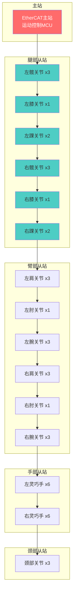
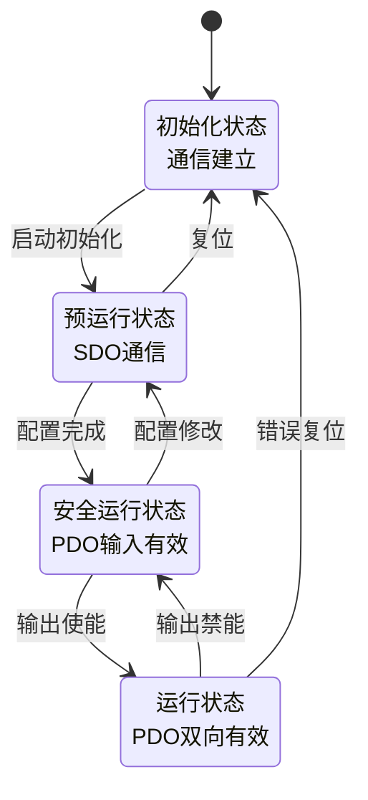
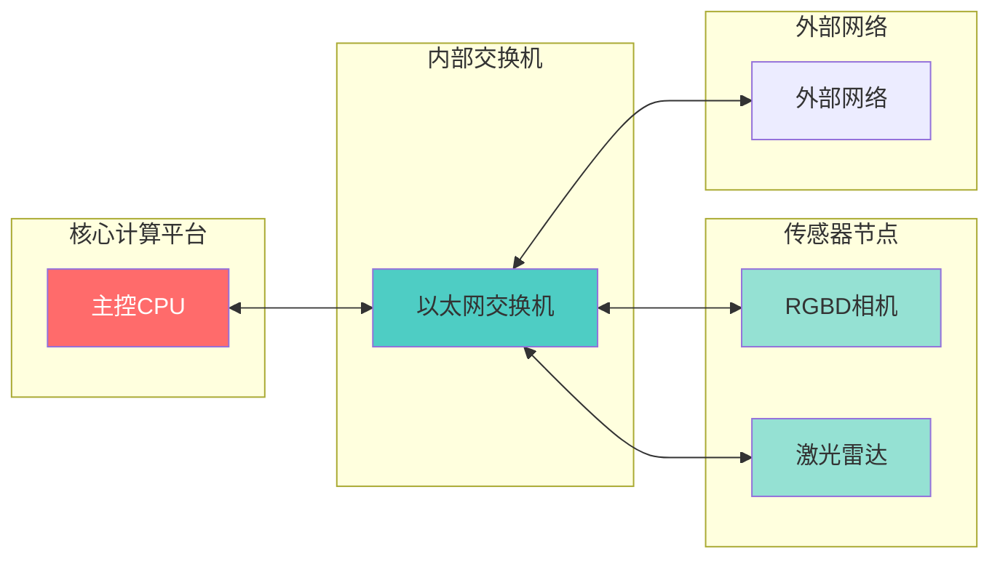
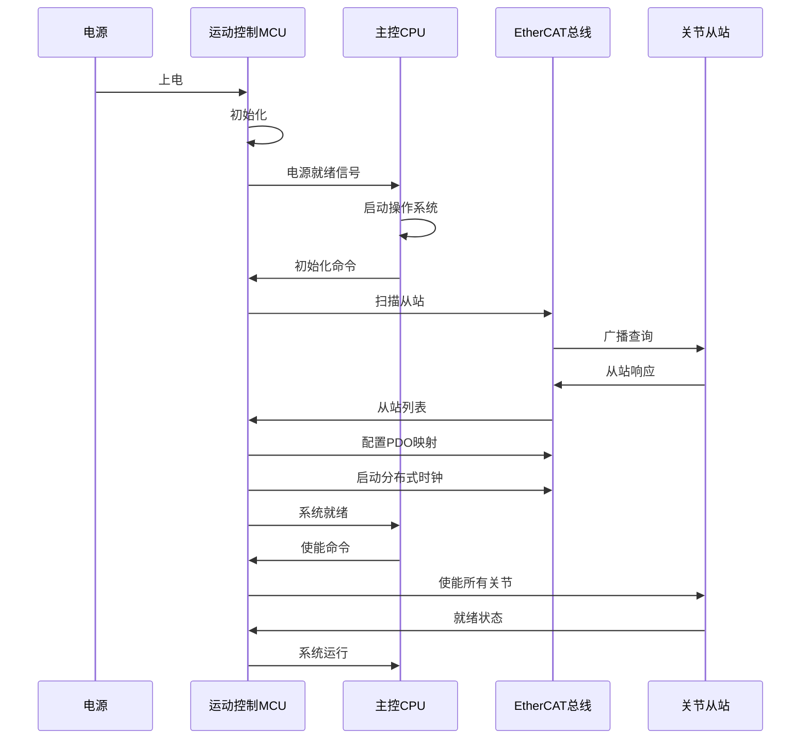
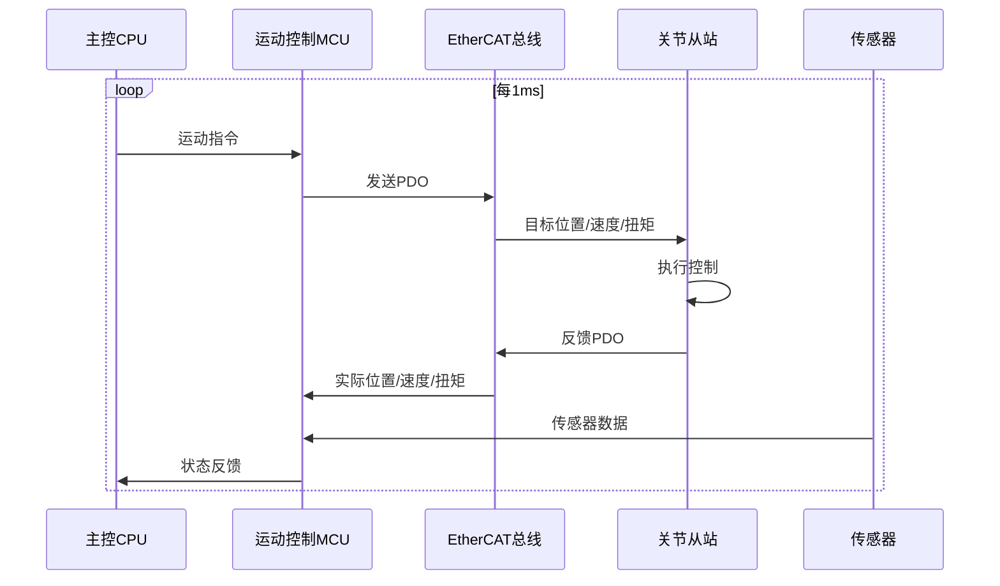
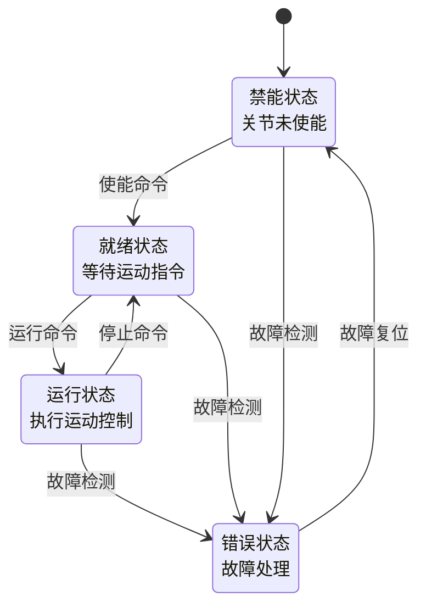
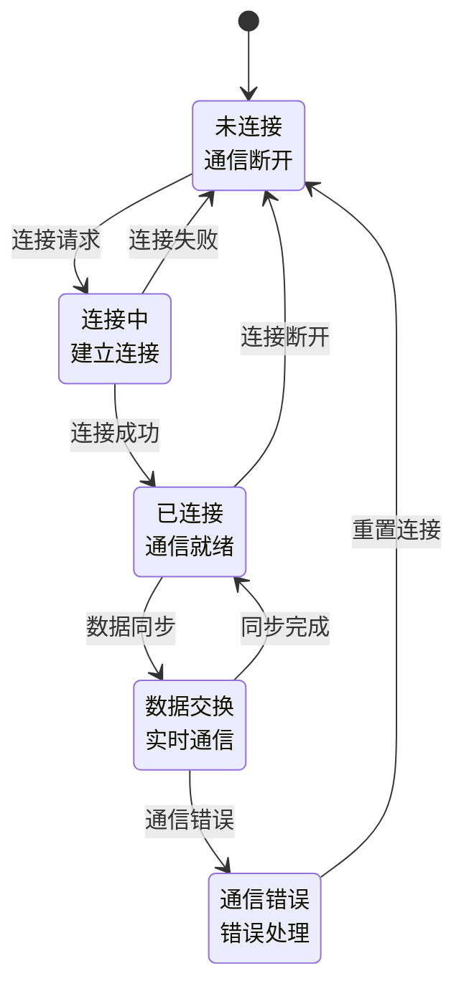

# 优必选 Walker S1 工业人形机器人接口控制文档 (ICD)

## 文档信息

- **产品名称**: Walker S1 工业人形机器人
- **产品型号**: Walker S1
- **文档版本**: V1.0
- **编制日期**: 2024年
- **产品定位**: 高端工业级人形机器人

---

## I. 物理层定义 (Physical Layer)

### A. 接口分配总表

#### A.1 主控接口分配

**核心计算平台接口** [事实]

| 接口编号 | 接口名称 | 连接对象 | 通讯协议 | 波特率/速率 | 引脚定义 |
|---------|---------|---------|---------|-----------|---------|
| ETH0 | 以太网口0 | 外部网络/上位机 | TCP/IP | 10/100/1000Mbps | RJ45标准 |
| ETH1 | 以太网口1 | EtherCAT总线 | EtherCAT | 100Mbps | RJ45标准 |
| USB0 | USB接口0 | 外部设备/调试 | USB 3.0 | 5Gbps | Type-A |
| USB1 | USB接口1 | 外部设备/调试 | USB 3.0 | 5Gbps | Type-A |
| PWR | 电源接口 | 充电器/电池 | 专用协议 | 54.6V DC | 专用接口 |

**运动控制总线接口** [事实]

| 接口编号 | 接口名称 | 连接对象 | 通讯协议 | 波特率/速率 | 引脚定义 |
|---------|---------|---------|---------|-----------|---------|
| ECAT_IN | EtherCAT输入 | 上级从站/主站 | EtherCAT | 100Mbps | RJ45 |
| ECAT_OUT | EtherCAT输出 | 下级从站 | EtherCAT | 100Mbps | RJ45 |

#### A.2 传感器接口分配

**视觉传感器接口** [事实]

| 接口编号 | 接口名称 | 连接对象 | 通讯协议 | 波特率/速率 | 引脚定义 |
|---------|---------|---------|---------|-----------|---------|
| CAM0 | RGBD相机0 | 头部深度相机 | USB3.0/GigE | 5Gbps/1Gbps | USB-A/RJ45 |
| CAM1 | RGBD相机1 | 头部深度相机 | USB3.0/GigE | 5Gbps/1Gbps | USB-A/RJ45 |
| CAM2 | RGBD相机2 | 躯干深度相机 | USB3.0/GigE | 5Gbps/1Gbps | USB-A/RJ45 |
| CAM3 | RGBD相机3 | 躯干深度相机 | USB3.0/GigE | 5Gbps/1Gbps | USB-A/RJ45 |
| FISH_L | 左鱼眼相机 | 左耳全景相机 | USB3.0 | 5Gbps | USB-A |
| FISH_R | 右鱼眼相机 | 右耳全景相机 | USB3.0 | 5Gbps | USB-A |

**激光雷达接口** [关联]

| 接口编号 | 接口名称 | 连接对象 | 通讯协议 | 波特率/速率 | 引脚定义 |
|---------|---------|---------|---------|-----------|---------|
| LIDAR0 | 激光雷达0 | 头部/躯干LiDAR | Ethernet | 100Mbps | RJ45 |
| LIDAR1 | 激光雷达1 | 头部/躯干LiDAR | Ethernet | 100Mbps | RJ45 |

**本体感知传感器接口** [推理]

| 接口编号 | 接口名称 | 连接对象 | 通讯协议 | 波特率/速率 | 引脚定义 |
|---------|---------|---------|---------|-----------|---------|
| IMU0 | 惯性测量单元 | 躯干IMU | SPI/I2C | 10MHz/400kHz | SPI: SCK/MOSI/MISO/CS |
| IMU1 | 惯性测量单元 | 头部IMU | SPI/I2C | 10MHz/400kHz | I2C: SDA/SCL |
| ENC0-40 | 关节编码器 | 41个关节编码器 | BiSS-C/EnDat | 10MHz | 差分信号 |
| FT0-3 | 六维力传感器 | 脚底/手腕力传感器 | RS485/EtherCAT | 10Mbps | RS485: A/B |

**触觉传感器接口** [事实]

| 接口编号 | 接口名称 | 连接对象 | 通讯协议 | 波特率/速率 | 引脚定义 |
|---------|---------|---------|---------|-----------|---------|
| TOUCH_L0-5 | 左手触觉 | 左手6个触觉传感器 | SPI/I2C | 1MHz/400kHz | SPI: SCK/MOSI/MISO/CS |
| TOUCH_R0-5 | 右手触觉 | 右手6个触觉传感器 | SPI/I2C | 1MHz/400kHz | I2C: SDA/SCL |

**音频接口** [事实]

| 接口编号 | 接口名称 | 连接对象 | 通讯协议 | 波特率/速率 | 引脚定义 |
|---------|---------|---------|---------|-----------|---------|
| MIC0-5 | 麦克风阵列 | 6个MEMS麦克风 | I2S/PDM | 48kHz采样 | I2S: BCLK/LRCLK/DIN |
| SPK_L | 左扬声器 | 左扬声器 | I2S | 48kHz采样 | I2S: BCLK/LRCLK/DOUT |
| SPK_R | 右扬声器 | 右扬声器 | I2S | 48kHz采样 | I2S: BCLK/LRCLK/DOUT |

#### A.3 执行器接口分配

**关节执行器接口** [事实]

| 接口编号 | 接口名称 | 连接对象 | 通讯协议 | 波特率/速率 | 引脚定义 |
|---------|---------|---------|---------|-----------|---------|
| JOINT0-40 | 关节驱动器 | 41个关节执行器 | EtherCAT | 100Mbps | EtherCAT从站 |
| HAND_L | 左灵巧手 | 左手6个手指驱动 | EtherCAT | 100Mbps | EtherCAT从站 |
| HAND_R | 右灵巧手 | 右手6个手指驱动 | EtherCAT | 100Mbps | EtherCAT从站 |

### B. 电气特性

#### B.1 逻辑电平标准

**数字信号电平** [推理]

| 信号类型 | 逻辑电平 | 高电平阈值 | 低电平阈值 | 驱动能力 |
|---------|---------|-----------|-----------|---------|
| GPIO | 3.3V CMOS | VIH > 2.0V | VIL < 0.8V | ±8mA |
| SPI | 3.3V CMOS | VIH > 2.0V | VIL < 0.8V | ±8mA |
| I2C | 3.3V开漏 | VIH > 2.0V | VIL < 0.8V | 3mA (上拉) |
| UART | 3.3V CMOS | VIH > 2.0V | VIL < 0.8V | ±8mA |
| EtherCAT | 差分信号 | 差分 > 200mV | 差分 < -200mV | 差分驱动 |

**模拟信号电平** [推理]

| 信号类型 | 电压范围 | 分辨率 | 精度 | 采样率 |
|---------|---------|-------|------|-------|
| ADC输入 | 0-3.3V | 12-16bit | ±1LSB | 1MSPS |
| DAC输出 | 0-3.3V | 12bit | ±1LSB | 1MSPS |

#### B.2 中断触发类型

**外部中断配置** [推理]

| 中断源 | 触发类型 | 优先级 | 响应时间 | 功能描述 |
|-------|---------|-------|---------|---------|
| 急停按钮 | 下降沿 | 最高 | <50μs | 紧急停止 |
| 碰撞检测 | 上升沿/下降沿 | 高 | <100μs | 碰撞响应 |
| 编码器索引 | 上升沿 | 中 | <1ms | 位置校准 |
| 限位开关 | 上升沿/下降沿 | 高 | <100μs | 运动限制 |
| 温度报警 | 电平触发 | 中 | <1ms | 过热保护 |

---

## II. 运动控制总线（人形机器人专属）

### A. EtherCAT总线配置

#### A.1 总线类型与拓扑

**总线配置** [事实]

| 参数 | 规格 | 说明 |
|------|------|------|
| 总线类型 | EtherCAT | 高速实时以太网 |
| 拓扑结构 | 线性+树形混合 | 灵活配置 |
| 物理介质 | 5类/超5类双绞线 | 100BASE-TX |
| 最大从站数 | 65535个 | 理论最大值 |
| 实际从站数 | 50+个 | 41关节+扩展 |

**总线拓扑图**



#### A.2 主站配置

**主站参数** [推理]

| 参数 | 规格 | 说明 |
|------|------|------|
| 主站型号 | EtherCAT主站卡/集成 | 运动控制MCU集成 |
| 主站数量 | 1个 | 集中式控制 |
| 周期时间 | 250μs-1ms | 可配置 |
| 分布式时钟 | 支持 | 同步精度<1μs |
| 从站扫描 | 自动扫描 | 热插拔支持 |

#### A.3 从站配置

**从站地址分配** [推理]

| 从站地址 | 从站名称 | 从站类型 | 功能描述 |
|---------|---------|---------|---------|
| 0x0001 | 左髋屈曲 | 驱动器从站 | 髋关节前后 |
| 0x0002 | 左髋外展 | 驱动器从站 | 髋关节左右 |
| 0x0003 | 左髋旋转 | 驱动器从站 | 髋关节旋转 |
| 0x0004 | 左膝 | 驱动器从站 | 膝关节 |
| 0x0005 | 左踝背屈 | 驱动器从站 | 踝关节上下 |
| 0x0006 | 左踝内翻 | 驱动器从站 | 踝关节左右 |
| 0x0007-0x000C | 右腿关节 | 驱动器从站 | 右腿6关节 |
| 0x000D-0x0013 | 左臂关节 | 驱动器从站 | 左臂7关节 |
| 0x0014-0x001A | 右臂关节 | 驱动器从站 | 右臂7关节 |
| 0x001B-0x0020 | 左手手指 | 驱动器从站 | 左手6手指 |
| 0x0021-0x0026 | 右手手指 | 驱动器从站 | 右手6手指 |
| 0x0027-0x0029 | 颈部关节 | 驱动器从站 | 颈部3关节 |

#### A.4 总线性能参数

**带宽与延迟** [事实]

| 参数 | 规格 | 说明 |
|------|------|------|
| 总线带宽 | 100Mbps | 快速以太网 |
| 实际使用带宽 | 约30-50Mbps | 控制数据 |
| 带宽利用率 | 30-50% | 预留扩展 |
| 通信周期 | 250μs-1ms | 可配置 |
| 同步周期 | 1ms | 控制同步 |
| 通信延迟 | <100μs | 极低延迟 |
| 同步精度 | <1μs | 分布式时钟 |

**总线可靠性** [推理]

| 参数 | 规格 | 说明 |
|------|------|------|
| 错误检测 | CRC校验 | 帧校验 |
| 错误恢复 | 自动重发 | 通信恢复 |
| 冗余设计 | 环形冗余(可选) | 高可靠性 |
| 热插拔 | 支持 | 在线维护 |

### B. EtherCAT协议规范

#### B.1 PDO映射

**过程数据对象映射表** [推理]

| PDO名称 | 方向 | 映射地址 | 数据类型 | 字节长度 | 功能描述 |
|--------|------|---------|---------|---------|---------|
| RxPDO1 | 主站→从站 | 0x1600 | UINT32 | 4字节 | 目标位置 |
| RxPDO2 | 主站→从站 | 0x1601 | UINT32 | 4字节 | 目标速度 |
| RxPDO3 | 主站→从站 | 0x1602 | INT16 | 2字节 | 目标扭矩 |
| RxPDO4 | 主站→从站 | 0x1603 | UINT16 | 2字节 | 控制字 |
| RxPDO5 | 主站→从站 | 0x1604 | UINT16 | 2字节 | 工作模式 |
| TxPDO1 | 从站→主站 | 0x1A00 | UINT32 | 4字节 | 实际位置 |
| TxPDO2 | 从站→主站 | 0x1A01 | UINT32 | 4字节 | 实际速度 |
| TxPDO3 | 从站→主站 | 0x1A02 | INT16 | 2字节 | 实际扭矩 |
| TxPDO4 | 从站→主站 | 0x1A03 | UINT16 | 2字节 | 状态字 |
| TxPDO5 | 从站→主站 | 0x1A04 | INT16 | 2字节 | 电机电流 |
| TxPDO6 | 从站→主站 | 0x1A05 | INT16 | 2字节 | 电机温度 |

**PDO数据帧结构**

```
| 字段 | 长度 | 说明 |
|------|------|------|
| 帧头 | 14字节 | 以太网帧头 |
| EtherCAT头 | 2字节 | EtherCAT协议头 |
| PDO数据 | 变长 | 过程数据对象 |
| FCS | 4字节 | 帧校验序列 |

PDO数据区结构 (单关节):
┌─────────────────────────────────────────────────────────┐
│ RxPDO (主站→从站)                                        │
├─────────────────────────────────────────────────────────┤
│ 目标位置 (4B) │ 目标速度 (4B) │ 目标扭矩 (2B) │ 控制字 (2B) │
└─────────────────────────────────────────────────────────┘

┌─────────────────────────────────────────────────────────┐
│ TxPDO (从站→主站)                                        │
├─────────────────────────────────────────────────────────┤
│ 实际位置 (4B) │ 实际速度 (4B) │ 实际扭矩 (2B) │ 状态字 (2B) │
│ 电流 (2B) │ 温度 (2B) │ 保留 (4B)                    │
└─────────────────────────────────────────────────────────┘
```

#### B.2 SDO配置

**服务数据对象配置参数** [推理]

| SDO索引 | 子索引 | 数据类型 | 访问权限 | 功能描述 |
|--------|-------|---------|---------|---------|
| 0x1000 | 0x00 | UINT32 | 只读 | 设备类型 |
| 0x1001 | 0x00 | UINT8 | 只读 | 错误寄存器 |
| 0x1018 | 0x00 | UINT8 | 只读 | 身份对象数量 |
| 0x1018 | 0x01 | UINT32 | 只读 | 厂商ID |
| 0x1018 | 0x02 | UINT32 | 只读 | 产品代码 |
| 0x1018 | 0x03 | UINT32 | 只读 | 修订版本 |
| 0x1018 | 0x04 | UINT32 | 只读 | 序列号 |
| 0x6040 | 0x00 | UINT16 | 读写 | 控制字 |
| 0x6041 | 0x00 | UINT16 | 只读 | 状态字 |
| 0x6060 | 0x00 | INT8 | 读写 | 操作模式 |
| 0x6061 | 0x00 | INT8 | 只读 | 操作模式显示 |
| 0x6064 | 0x00 | INT32 | 只读 | 位置实际值 |
| 0x606C | 0x00 | INT32 | 只读 | 速度实际值 |
| 0x6077 | 0x00 | INT16 | 只读 | 扭矩实际值 |
| 0x607A | 0x00 | INT32 | 读写 | 目标位置 |
| 0x607B | 0x00 | UINT8 | 只读 | 位置范围限制子索引 |
| 0x607B | 0x01 | INT32 | 读写 | 最小位置限制 |
| 0x607B | 0x02 | INT32 | 读写 | 最大位置限制 |
| 0x6080 | 0x00 | UINT32 | 读写 | 最大电机速度 |
| 0x6081 | 0x00 | UINT32 | 读写 | 速度限制 |
| 0x6082 | 0x00 | UINT32 | 读写 | 最大加速度 |
| 0x6083 | 0x00 | UINT32 | 读写 | 最大减速度 |

#### B.3 同步模式

**分布式时钟(DC)同步配置** [推理]

| 参数 | 规格 | 说明 |
|------|------|------|
| 同步模式 | 分布式时钟(DC) | 精确同步 |
| 同步周期 | 1ms | 控制周期 |
| 同步精度 | <1μs | 时钟偏差 |
| 同步窗口 | 100μs | 同步时间窗口 |
| 参考时钟 | 主站时钟 | 系统时钟源 |

#### B.4 状态机

**EtherCAT状态机转换** [推理]



**状态转换条件**

| 状态转换 | 触发条件 | 动作描述 |
|---------|---------|---------|
| Init→PreOp | 主站请求 | 初始化从站通信 |
| PreOp→SafeOp | 主站请求 | 启动PDO输入 |
| SafeOp→Op | 主站请求 | 启动PDO输出 |
| Op→SafeOp | 主站请求/错误 | 停止PDO输出 |
| SafeOp→PreOp | 主站请求 | 停止PDO输入 |
| PreOp→Init | 主站请求 | 复位从站 |
| Op→Init | 严重错误 | 完全复位 |

#### B.5 错误处理

**错误码定义** [推理]

| 错误码 | 错误名称 | 错误描述 | 恢复方式 |
|-------|---------|---------|---------|
| 0x0000 | 无错误 | 正常运行 | - |
| 0x0001 | 通信错误 | 通信超时或中断 | 自动重连 |
| 0x0002 | 配置错误 | 参数配置无效 | 重新配置 |
| 0x0003 | 过流错误 | 电机电流超限 | 降低负载 |
| 0x0004 | 过压错误 | 电压超限 | 检查电源 |
| 0x0005 | 欠压错误 | 电压过低 | 检查电池 |
| 0x0006 | 过热错误 | 温度超限 | 冷却等待 |
| 0x0007 | 编码器错误 | 编码器信号异常 | 检查连接 |
| 0x0008 | 限位错误 | 超出运动范围 | 位置复位 |
| 0x0009 | 跟踪错误 | 位置偏差过大 | 降低速度 |
| 0x000A | 扭矩错误 | 扭矩超限 | 降低负载 |

---

## III. 传感器接口（人形机器人专属）

### A. 关节位置传感器接口

#### A.1 编码器接口类型

**编码器配置** [推理]

| 参数 | 规格 | 说明 |
|------|------|------|
| 编码器类型 | 绝对值编码器 | 断电位置记忆 |
| 接口类型 | BiSS-C/EnDat 2.2 | 高速数字接口 |
| 分辨率 | ≥17bit (131072线) | 高精度 |
| 精度 | ±0.01° | 高精度控制 |
| 通信速率 | 1-10MHz | 高速传输 |

#### A.2 BiSS-C协议

**BiSS-C接口时序**

```
BiSS-C通信时序图:

MA (主站时钟):  ──┐  ┌──┐  ┌──┐  ┌──┐  ┌──┐  ┌──┐  ┌──┐  ┌──
                └──┘  └──┘  └──┘  └──┘  └──┘  └──┘  └──┘  └──

SL (从站数据):  ──┐  ┌───────────────────────────────────────
                └──┘

                │←START→│←ACK→│←DATA→│←CRC→│
                │  2bit  │ 1bit │ N bit│ 6bit│

数据帧结构:
┌─────────────────────────────────────────────────────────┐
│ START (2bit) │ ACK (1bit) │ DATA (N bit) │ CRC (6bit) │
└─────────────────────────────────────────────────────────┘

DATA字段结构 (位置数据):
┌─────────────────────────────────────────────────────────┐
│ 位置 (17bit) │ 状态 (2bit) │ 错误 (1bit) │ 警告 (1bit) │
└─────────────────────────────────────────────────────────┘
```

**BiSS-C寄存器映射**

| 寄存器地址 | 数据类型 | 访问权限 | 功能描述 |
|-----------|---------|---------|---------|
| 0x00-0x03 | UINT32 | 只读 | 位置数据 |
| 0x04 | UINT8 | 只读 | 状态寄存器 |
| 0x05 | UINT8 | 只读 | 错误寄存器 |
| 0x06-0x07 | UINT16 | 只读 | 温度数据 |
| 0x10-0x13 | UINT32 | 读写 | 零点偏移 |
| 0x14-0x17 | UINT32 | 读写 | 电子齿轮比 |

### B. 关节力矩传感器接口

#### B.1 传感器类型与规格

**力矩传感器配置** [推理]

| 参数 | 规格 | 说明 |
|------|------|------|
| 传感器类型 | 应变式力矩传感器 | 高精度测量 |
| 量程 | 根据关节配置 | 5-250N·m |
| 精度 | 0.1N·m | 高精度 |
| 通信协议 | 模拟量/数字量 | 多种接口 |
| 采样率 | 1kHz | 高频采样 |

#### B.2 模拟量接口

**模拟量信号规格**

| 参数 | 规格 | 说明 |
|------|------|------|
| 输出电压 | 0-5V 或 ±5V | 差分输出 |
| 输出阻抗 | <1kΩ | 低阻抗输出 |
| 带宽 | >1kHz | 高频响应 |
| 分辨率 | 12-16bit ADC | 高分辨率 |

### C. 六维力传感器接口

#### C.1 传感器规格

**六维力传感器配置** [推理]

| 参数 | 规格 | 说明 |
|------|------|------|
| 传感器型号 | 六维力/力矩传感器 | 完整力信息 |
| 力量程 | Fx/Fy: ±500N, Fz: ±1000N | 根据应用 |
| 力矩量程 | Mx/My/Mz: ±50N·m | 根据应用 |
| 精度 | 力: 0.5N, 力矩: 0.05N·m | 高精度 |
| 通信协议 | RS485/EtherCAT | 数字接口 |

#### C.2 RS485接口协议

**RS485通信参数**

| 参数 | 规格 | 说明 |
|------|------|------|
| 波特率 | 921600bps | 高速传输 |
| 数据位 | 8位 | 标准格式 |
| 停止位 | 1位 | 标准格式 |
| 校验位 | 无 | 高速模式 |
| 协议 | Modbus RTU | 标准协议 |

**Modbus RTU数据帧**

```
请求帧:
┌─────────────────────────────────────────────────────────┐
│ 从站地址 (1B) │ 功能码 (1B) │ 起始地址 (2B) │ 数量 (2B) │ CRC (2B) │
└─────────────────────────────────────────────────────────┘

响应帧:
┌─────────────────────────────────────────────────────────┐
│ 从站地址 (1B) │ 功能码 (1B) │ 字节数 (1B) │ 数据 (NB) │ CRC (2B) │
└─────────────────────────────────────────────────────────┘

六维力数据格式 (12字节):
┌─────────────────────────────────────────────────────────┐
│ Fx (2B) │ Fy (2B) │ Fz (2B) │ Mx (2B) │ My (2B) │ Mz (2B) │
└─────────────────────────────────────────────────────────┘
```

### D. IMU接口

#### D.1 IMU规格

**IMU配置** [推理]

| 参数 | 规格 | 说明 |
|------|------|------|
| IMU型号 | 6轴或9轴IMU | 姿态检测 |
| 陀螺仪精度 | 0.01°/s | 高精度 |
| 加速度计精度 | 0.001g | 高精度 |
| 通信协议 | SPI/I2C | 标准接口 |
| 更新频率 | 1kHz | 高频更新 |

#### D.2 SPI接口协议

**SPI通信参数**

| 参数 | 规格 | 说明 |
|------|------|------|
| 模式 | SPI Mode 0/3 | 可配置 |
| 时钟频率 | 1-10MHz | 高速传输 |
| 数据位 | 8位 | 标准格式 |
| 字节序 | MSB优先 | 高位在前 |

**IMU寄存器映射**

| 寄存器地址 | 数据类型 | 访问权限 | 功能描述 |
|-----------|---------|---------|---------|
| 0x00-0x05 | INT16×3 | 只读 | 加速度数据 |
| 0x06-0x0B | INT16×3 | 只读 | 陀螺仪数据 |
| 0x0C-0x11 | INT16×3 | 只读 | 磁力计数据 |
| 0x12-0x15 | INT16×2 | 只读 | 温度数据 |
| 0x1A | UINT8 | 读写 | 配置寄存器 |
| 0x1B | UINT8 | 读写 | 采样率分频 |
| 0x1C | UINT8 | 读写 | 陀螺仪配置 |
| 0x1D | UINT8 | 读写 | 加速度配置 |

### E. 视觉传感器接口

#### E.1 RGBD相机接口

**RGBD相机配置** [事实]

| 参数 | 规格 | 说明 |
|------|------|------|
| 分辨率 | 1920×1080 | 高清图像 |
| 帧率 | 30fps | 实时视频 |
| 接口类型 | USB3.0/GigE | 高速传输 |
| 数据格式 | RGB/YUV/RAW | 多种格式 |
| 深度技术 | 结构光/ToF | 深度感知 |

**USB3.0接口参数**

| 参数 | 规格 | 说明 |
|------|------|------|
| 接口类型 | USB 3.0 SuperSpeed | 5Gbps |
| 供电能力 | 900mA | 自供电 |
| 传输模式 | 批量传输 | 图像数据 |

**图像数据格式**

```
RGBD数据帧结构:
┌─────────────────────────────────────────────────────────┐
│ 帧头 (16B)                                                │
├─────────────────────────────────────────────────────────┤
│ 时间戳 (8B) │ 序列号 (4B) │ 宽度 (2B) │ 高度 (2B)       │
├─────────────────────────────────────────────────────────┤
│ RGB数据 (1920×1080×3 = 6,220,800B)                       │
├─────────────────────────────────────────────────────────┤
│ 深度数据 (1920×1080×2 = 4,147,200B)                      │
├─────────────────────────────────────────────────────────┤
│ 校验和 (4B)                                               │
└─────────────────────────────────────────────────────────┘
```

#### E.2 鱼眼相机接口

**鱼眼相机配置** [事实]

| 参数 | 规格 | 说明 |
|------|------|------|
| 视场角 | 180° | 全景视野 |
| 分辨率 | 高分辨率 | 全景图像 |
| 接口类型 | USB3.0 | 高速传输 |
| 畸变校正 | 软件/硬件 | 图像处理 |

### F. 激光雷达接口

#### F.1 激光雷达规格

**激光雷达配置** [关联]

| 参数 | 规格 | 说明 |
|------|------|------|
| 型号 | WLR-750 (万集科技) | 供应链信息 |
| 测距精度 | ±1cm~±5mm | 毫米级精度 |
| 测距范围 | 0.1-30m | 中远距离 |
| 视场角 | 360°水平 | 全向扫描 |
| 扫描频率 | 10-20Hz | 实时更新 |
| 接口类型 | Ethernet/USB | 标准接口 |

#### F.2 Ethernet接口协议

**以太网通信参数**

| 参数 | 规格 | 说明 |
|------|------|------|
| 接口类型 | RJ45 | 标准接口 |
| 速率 | 100Mbps | 快速以太网 |
| 协议 | UDP/TCP | 数据传输 |

**激光雷达数据格式**

```
激光雷达点云数据帧:
┌─────────────────────────────────────────────────────────┐
│ 帧头 (24B)                                                │
├─────────────────────────────────────────────────────────┤
│ 魔数 (4B) │ 版本 (2B) │ 点数 (4B) │ 时间戳 (8B) │ 保留 (6B) │
├─────────────────────────────────────────────────────────┤
│ 点云数据 (N × 16B)                                        │
├─────────────────────────────────────────────────────────┤
│ X (4B) │ Y (4B) │ Z (4B) │ 强度 (2B) │ 保留 (2B)        │
├─────────────────────────────────────────────────────────┤
│ 校验和 (4B)                                               │
└─────────────────────────────────────────────────────────┘
```

### G. 触觉传感器接口

#### G.1 触觉传感器规格

**触觉传感器配置** [事实]

| 参数 | 规格 | 说明 |
|------|------|------|
| 类型 | 阵列式触觉压力传感器 | 力分布检测 |
| 数量 | 6个/手 | 每手6个 |
| 力测量精度 | 0.1N | 高精度 |
| 力矩测量精度 | 0.01N·m | 高精度 |
| 通信协议 | SPI/I2C | 标准接口 |
| 响应时间 | <1ms | 实时反馈 |

#### G.2 I2C接口协议

**I2C通信参数**

| 参数 | 规格 | 说明 |
|------|------|------|
| 设备地址 | 7位地址 | 多设备支持 |
| 时钟频率 | 400kHz | 快速模式 |
| 数据格式 | 16位数据 | 力数据 |

**触觉传感器寄存器**

| 寄存器地址 | 数据类型 | 访问权限 | 功能描述 |
|-----------|---------|---------|---------|
| 0x00-0x05 | INT16×3 | 只读 | 力数据 (Fx, Fy, Fz) |
| 0x06-0x0B | INT16×3 | 只读 | 力矩数据 (Mx, My, Mz) |
| 0x0C | UINT8 | 只读 | 状态寄存器 |
| 0x0D | UINT8 | 只读 | 温度数据 |
| 0x10 | UINT8 | 读写 | 配置寄存器 |
| 0x11 | UINT8 | 读写 | 采样率配置 |

---

## IV. 执行器接口（人形机器人专属）

### A. 关节执行器接口

#### A.1 执行器规格

**关节执行器配置** [事实]

| 参数 | 规格 | 说明 |
|------|------|------|
| 执行器型号 | 一体化关节 | 高度集成 |
| 控制模式 | 位置/速度/扭矩 | 多模式控制 |
| 通信协议 | EtherCAT | 实时总线 |
| 扭矩范围 | 4.5Nm-250Nm | 不同关节 |
| 转速范围 | 30rpm-90rpm | 不同关节 |

#### A.2 控制模式

**控制模式定义** [推理]

| 模式代码 | 控制模式 | 功能描述 | 适用场景 |
|---------|---------|---------|---------|
| 0x01 | 位置控制 | 控制关节位置 | 轨迹跟踪 |
| 0x02 | 速度控制 | 控制关节速度 | 连续运动 |
| 0x03 | 扭矩控制 | 控制关节扭矩 | 力控制 |
| 0x04 | 位置-速度控制 | 位置+速度限制 | 平滑运动 |
| 0x05 | 位置-扭矩控制 | 位置+扭矩限制 | 柔顺控制 |
| 0x06 | 速度-扭矩控制 | 速度+扭矩限制 | 力控运动 |
| 0x07 | 回零模式 | 自动回零 | 校准 |
| 0x08 | 点动模式 | 手动控制 | 调试 |

### B. 关节执行器协议

#### B.1 指令格式

**位置控制指令** [推理]

```
位置控制指令帧:
┌─────────────────────────────────────────────────────────┐
│ 指令码 (2B) │ 目标位置 (4B) │ 运动速度 (4B) │ 加速度 (4B) │
│ 减速度 (4B) │ 扭矩限制 (2B) │ 保留 (2B)                    │
└─────────────────────────────────────────────────────────┘

字段说明:
- 指令码: 0x0001 (位置控制)
- 目标位置: 32位有符号整数, 单位: 编码器脉冲
- 运动速度: 32位无符号整数, 单位: 脉冲/秒
- 加速度: 32位无符号整数, 单位: 脉冲/秒²
- 减速度: 32位无符号整数, 单位: 脉冲/秒²
- 扭矩限制: 16位无符号整数, 单位: 千分之额定扭矩
```

**速度控制指令**

```
速度控制指令帧:
┌─────────────────────────────────────────────────────────┐
│ 指令码 (2B) │ 目标速度 (4B) │ 加速度 (4B) │ 减速度 (4B) │
│ 扭矩限制 (2B) │ 保留 (6B)                                 │
└─────────────────────────────────────────────────────────┘

字段说明:
- 指令码: 0x0002 (速度控制)
- 目标速度: 32位有符号整数, 单位: 脉冲/秒
- 加速度: 32位无符号整数, 单位: 脉冲/秒²
- 减速度: 32位无符号整数, 单位: 脉冲/秒²
- 扭矩限制: 16位无符号整数, 单位: 千分之额定扭矩
```

**扭矩控制指令**

```
扭矩控制指令帧:
┌─────────────────────────────────────────────────────────┐
│ 指令码 (2B) │ 目标扭矩 (2B) │ 扭矩斜率 (2B) │ 保留 (10B) │
└─────────────────────────────────────────────────────────┘

字段说明:
- 指令码: 0x0003 (扭矩控制)
- 目标扭矩: 16位有符号整数, 单位: 千分之额定扭矩
- 扭矩斜率: 16位无符号整数, 单位: 千分之额定扭矩/毫秒
```

#### B.2 反馈数据格式

**关节状态反馈** [推理]

```
关节状态反馈帧:
┌─────────────────────────────────────────────────────────┐
│ 实际位置 (4B) │ 实际速度 (4B) │ 实际扭矩 (2B) │ 状态字 (2B) │
│ 电机电流 (2B) │ 电机温度 (2B) │ 错误码 (2B) │ 时间戳 (4B) │
└─────────────────────────────────────────────────────────┘

字段说明:
- 实际位置: 32位有符号整数, 单位: 编码器脉冲
- 实际速度: 32位有符号整数, 单位: 脉冲/秒
- 实际扭矩: 16位有符号整数, 单位: 千分之额定扭矩
- 状态字: 16位无符号整数, 见状态字定义
- 电机电流: 16位无符号整数, 单位: mA
- 电机温度: 16位有符号整数, 单位: 0.1°C
- 错误码: 16位无符号整数, 见错误码定义
- 时间戳: 32位无符号整数, 单位: μs
```

**状态字定义**

```
状态字位定义:
| Bit 15 | Bit 14 | Bit 13 | Bit 12 | Bit 11 | Bit 10 | Bit 9 | Bit 8 |
|--------|--------|--------|--------|--------|--------|-------|-------|
|  保留  |  保留   | 警告   | 目标达 | 使能   | 运行   | 故障  | 就绪  |

| Bit 7 | Bit 6 | Bit 5 | Bit 4 | Bit 3 | Bit 2 | Bit 1 | Bit 0 |
|-------|-------|-------|-------|-------|-------|-------|-------|
| 保留  | 保留   | 保留   | 保留   | 模式3 | 模式2 | 模式1 | 模式0 |

状态字位说明:
- Bit 0-3: 当前控制模式 (0x01=位置, 0x02=速度, 0x03=扭矩)
- Bit 8: 就绪状态 (1=就绪, 0=未就绪)
- Bit 9: 故障状态 (1=故障, 0=正常)
- Bit 10: 运行状态 (1=运行, 0=停止)
- Bit 11: 使能状态 (1=使能, 0=禁能)
- Bit 12: 目标到达 (1=到达, 0=未到达)
- Bit 13: 警告状态 (1=警告, 0=正常)
```

#### B.3 参数配置指令

**PID参数配置** [推理]

```
PID参数配置指令:
┌─────────────────────────────────────────────────────────┐
│ 指令码 (2B) │ Kp (4B) │ Ki (4B) │ Kd (4B) │ 积分限幅 (4B) │
│ 输出限幅 (4B) │ 保留 (2B)                                 │
└─────────────────────────────────────────────────────────┘

字段说明:
- 指令码: 0x0100 (PID配置)
- Kp: 比例增益, 32位浮点数
- Ki: 积分增益, 32位浮点数
- Kd: 微分增益, 32位浮点数
- 积分限幅: 积分限幅值, 32位浮点数
- 输出限幅: 输出限幅值, 32位浮点数
```

**运动范围配置**

```
运动范围配置指令:
┌─────────────────────────────────────────────────────────┐
│ 指令码 (2B) │ 最小角度 (4B) │ 最大角度 (4B) │ 软限位使能 (2B) │
│ 保留 (6B)                                                │
└─────────────────────────────────────────────────────────┘

字段说明:
- 指令码: 0x0101 (运动范围配置)
- 最小角度: 最小角度限制, 32位浮点数, 单位: 度
- 最大角度: 最大角度限制, 32位浮点数, 单位: 度
- 软限位使能: 0=禁能, 1=使能
```

**零点标定指令**

```
零点标定指令:
┌─────────────────────────────────────────────────────────┐
│ 指令码 (2B) │ 标定模式 (2B) │ 标定位置 (4B) │ 保留 (10B) │
└─────────────────────────────────────────────────────────┘

字段说明:
- 指令码: 0x0102 (零点标定)
- 标定模式: 0x00=当前位置, 0x01=指定位置
- 标定位置: 标定位置值, 32位有符号整数
```

### C. 手部执行器接口

#### C.1 灵巧手规格

**灵巧手配置** [事实]

| 参数 | 规格 | 说明 |
|------|------|------|
| 执行器型号 | 第三代仿人灵巧手 | 高精度操作 |
| 自由度 | 6个/手 | 灵活操作 |
| 控制方式 | 位置/力控制 | 多模式 |
| 通信协议 | EtherCAT | 实时总线 |

#### C.2 手指控制指令

**手指位置控制**

```
手指位置控制指令:
┌─────────────────────────────────────────────────────────┐
│ 指令码 (2B) │ 手指ID (1B) │ 目标位置 (2B) │ 抓握力 (2B) │
│ 速度 (2B) │ 保留 (7B)                                   │
└─────────────────────────────────────────────────────────┘

字段说明:
- 指令码: 0x0200 (手指位置控制)
- 手指ID: 0-5 (拇指、食指、中指、无名指、小指、手掌)
- 目标位置: 0-1000 (0=完全张开, 1000=完全闭合)
- 抓握力: 0-1000 (最大抓握力的千分比)
- 速度: 0-1000 (最大速度的千分比)
```

---

## V. 通信网络接口（人形机器人专属）

### A. 内部以太网

#### A.1 以太网交换机配置

**内部以太网配置** [推理]

| 参数 | 规格 | 说明 |
|------|------|------|
| 交换机型号 | 工业级以太网交换机 | 高可靠性 |
| 端口数 | 5-8口 | 多设备连接 |
| 速率 | 100Mbps/1Gbps | 高速传输 |
| 拓扑结构 | 星形 | 集中管理 |

#### A.2 内部网络拓扑



### B. WiFi接口

#### B.1 WiFi模块配置

**WiFi配置** [事实]

| 参数 | 规格 | 说明 |
|------|------|------|
| 模块型号 | 工业级WiFi模块 | 高可靠性 |
| 协议标准 | 802.11 a/b/g/n | 主流协议 |
| 频段 | 2.4GHz/5GHz双频 | 抗干扰 |
| 最大速率 | 300-600Mbps | 高速传输 |
| 天线配置 | MIMO 2×2 | 提升性能 |
| 加密方式 | WPA2/WPA3 | 安全加密 |

#### B.2 WiFi接口协议

**TCP/IP协议栈**

| 协议层 | 协议 | 功能描述 |
|-------|------|---------|
| 应用层 | HTTP/HTTPS | Web服务 |
| 应用层 | WebSocket | 实时通信 |
| 应用层 | MQTT | 物联网通信 |
| 应用层 | ROS | 机器人通信 |
| 传输层 | TCP | 可靠传输 |
| 传输层 | UDP | 快速传输 |
| 网络层 | IP | 网络寻址 |
| 链路层 | WiFi | 无线连接 |

### C. 蓝牙接口

#### C.1 蓝牙模块配置

**蓝牙配置** [推理]

| 参数 | 规格 | 说明 |
|------|------|------|
| 模块型号 | 蓝牙5.0模块 | 低功耗 |
| 协议版本 | Bluetooth 5.0+ | 远距离 |
| 支持协议 | A2DP/AVRCP/HFP/BLE | 音频和控制 |
| 传输速率 | 2Mbps | 高速传输 |
| 传输距离 | ≥10m | 近距离通信 |
| 功耗 | 低功耗设计 | 延长续航 |

### D. 4G/5G接口

#### D.1 移动通信配置

**移动通信配置** [推理]

| 参数 | 规格 | 说明 |
|------|------|------|
| 模块型号 | 4G/5G通信模块 | 远程通信 |
| 网络制式 | 4G LTE / 5G NR | 多网络支持 |
| 频段 | 多频段支持 | 全球漫游 |
| 下行速率 | 4G: 150Mbps / 5G: 1Gbps | 高速传输 |
| 上行速率 | 4G: 50Mbps / 5G: 200Mbps | 高速上传 |

---

## VI. 安全接口（人形机器人专属）

### A. 急停接口

#### A.1 急停按钮配置

**急停按钮规格** [推理]

| 参数 | 规格 | 说明 |
|------|------|------|
| 急停按钮数量 | ≥2个 | 本体前后 |
| 触发方式 | 拍击式 | 易于操作 |
| 按钮类型 | 红色蘑菇头 | 标准急停 |
| 触发信号 | 常闭触点 | 安全设计 |
| 响应时间 | <50ms | 快速响应 |

#### A.2 急停信号定义

**急停信号接口**

| 信号名称 | 信号类型 | 有效电平 | 功能描述 |
|---------|---------|---------|---------|
| ESTOP1 | 数字输入 | 低电平有效 | 急停按钮1状态 |
| ESTOP2 | 数字输入 | 低电平有效 | 急停按钮2状态 |
| ESTOP_OUT | 数字输出 | 低电平有效 | 急停状态输出 |

**急停响应动作**

```
急停响应流程:
1. 检测到急停信号 (下降沿触发)
2. 立即停止所有关节运动 (<50ms)
3. 切断动力电源
4. 保持控制系统供电
5. 保持通信功能
6. 发送急停状态到主控
7. 等待人工复位
```

### B. 碰撞检测接口

#### B.1 碰撞传感器配置

**碰撞传感器规格** [推理]

| 参数 | 规格 | 说明 |
|------|------|------|
| 传感器类型 | 电子皮肤/力传感器 | 触觉检测 |
| 检测方式 | 电容/电阻式 | 多种方式 |
| 检测范围 | 全身关键部位 | 全面覆盖 |
| 响应时间 | <10ms | 快速响应 |

#### B.2 碰撞响应信号

**碰撞检测信号**

| 信号名称 | 信号类型 | 有效电平 | 功能描述 |
|---------|---------|---------|---------|
| COLLISION_ARM_L | 数字输入 | 高电平有效 | 左臂碰撞检测 |
| COLLISION_ARM_R | 数字输入 | 高电平有效 | 右臂碰撞检测 |
| COLLISION_TORSO | 数字输入 | 高电平有效 | 躯干碰撞检测 |
| COLLISION_LEG_L | 数字输入 | 高电平有效 | 左腿碰撞检测 |
| COLLISION_LEG_R | 数字输入 | 高电平有效 | 右腿碰撞检测 |

### C. 跌倒检测接口

#### C.1 跌倒检测配置

**跌倒检测传感器** [推理]

| 参数 | 规格 | 说明 |
|------|------|------|
| 传感器类型 | IMU+倾角传感器 | 姿态检测 |
| 检测方式 | 姿态角度+角速度 | 多维检测 |
| 检测阈值 | 可配置 | 自适应 |
| 响应时间 | <100ms | 快速响应 |

#### C.2 跌倒响应信号

**跌倒检测信号**

| 信号名称 | 信号类型 | 数据范围 | 功能描述 |
|---------|---------|---------|---------|
| FALL_ANGLE_X | 模拟输入 | -90°~+90° | X轴倾角 |
| FALL_ANGLE_Y | 模拟输入 | -90°~+90° | Y轴倾角 |
| FALL_GYRO_Z | 模拟输入 | -500°/s~+500°/s | Z轴角速度 |
| FALL_STATUS | 数字输入 | 0/1 | 跌倒状态 |

### D. 过载保护接口

#### D.1 过载检测配置

**过载检测方式** [推理]

| 检测类型 | 检测方式 | 保护阈值 | 保护动作 |
|---------|---------|---------|---------|
| 电机过流 | 电流采样 | 1.5倍额定电流 | 限制电流 |
| 关节过热 | 温度传感器 | 70°C | 降功率运行 |
| 电池过放 | 电压监测 | 42V | 停止工作 |
| 扭矩过载 | 力矩传感器 | 1.2倍额定扭矩 | 限制扭矩 |

### E. 温度监控接口

#### E.1 温度传感器配置

**温度监控配置** [推理]

| 传感器位置 | 传感器类型 | 监控范围 | 报警阈值 |
|-----------|-----------|---------|---------|
| CPU | 内部传感器 | -20°C~100°C | 85°C |
| GPU | 内部传感器 | -20°C~100°C | 85°C |
| 电池 | NTC热敏电阻 | -20°C~60°C | 45°C |
| 关节电机 | NTC热敏电阻 | -20°C~100°C | 70°C |
| 驱动器 | NTC热敏电阻 | -20°C~100°C | 75°C |

---

## VII. 寄存器/指令集映射 (Register/Command Map)

### A. 系统控制指令

#### A.1 系统控制指令集

**系统控制指令** [推理]

| 指令码 | 指令名称 | 参数 | 返回值 | 功能描述 |
|-------|---------|------|-------|---------|
| 0x0001 | 软重启 | 无 | 状态码 | 系统软重启 |
| 0x0002 | 固件版本 | 无 | 版本号 | 读取固件版本 |
| 0x0003 | 工作模式 | 模式号 | 状态码 | 切换工作模式 |
| 0x0004 | 系统状态 | 无 | 状态字 | 读取系统状态 |
| 0x0005 | 错误清除 | 无 | 状态码 | 清除错误状态 |
| 0x0006 | 参数保存 | 无 | 状态码 | 保存当前参数 |
| 0x0007 | 参数恢复 | 无 | 状态码 | 恢复默认参数 |
| 0x0008 | 日志读取 | 起始/数量 | 日志数据 | 读取系统日志 |

**系统状态寄存器**

```
系统状态寄存器 (16位):
| Bit 15 | Bit 14 | Bit 13 | Bit 12 | Bit 11 | Bit 10 | Bit 9 | Bit 8 |
|--------|--------|--------|--------|--------|--------|-------|-------|
|  保留  |  保留   |  保留   |  保留   |  保留   |  保留   |  保留  |  保留  |

| Bit 7 | Bit 6 | Bit 5 | Bit 4 | Bit 3 | Bit 2 | Bit 1 | Bit 0 |
|-------|-------|-------|-------|-------|-------|-------|-------|
| 保留  | 电池低 | 过热  | 通信故障 | 急停  | 运行  | 就绪  | 使能  |

状态位说明:
- Bit 0: 系统使能 (1=使能, 0=禁能)
- Bit 1: 系统就绪 (1=就绪, 0=未就绪)
- Bit 2: 系统运行 (1=运行, 0=停止)
- Bit 3: 急停状态 (1=急停, 0=正常)
- Bit 4: 通信故障 (1=故障, 0=正常)
- Bit 5: 过热警告 (1=过热, 0=正常)
- Bit 6: 电池低电 (1=低电, 0=正常)
```

### B. 传感器数据读取指令

#### B.1 关节数据读取

**关节位置读取** [推理]

| 指令码 | 指令名称 | 参数 | 返回值 | 功能描述 |
|-------|---------|------|-------|---------|
| 0x1000 | 读取所有关节位置 | 无 | 41×4字节 | 读取所有关节位置 |
| 0x1001 | 读取单个关节位置 | 关节ID | 4字节 | 读取指定关节位置 |
| 0x1002 | 读取所有关节速度 | 无 | 41×4字节 | 读取所有关节速度 |
| 0x1003 | 读取所有关节扭矩 | 无 | 41×2字节 | 读取所有关节扭矩 |
| 0x1004 | 读取所有关节温度 | 无 | 41×2字节 | 读取所有关节温度 |

**关节位置数据格式**

```
关节位置数据帧:
┌─────────────────────────────────────────────────────────┐
│ 关节ID (1B) │ 位置数据 (4B) │ 时间戳 (4B) │ 状态 (1B)   │
└─────────────────────────────────────────────────────────┘

位置数据: 32位有符号整数, 单位: 0.001度
时间戳: 32位无符号整数, 单位: 微秒
状态: 0=正常, 1=警告, 2=错误
```

#### B.2 IMU数据读取

**IMU数据读取指令**

| 指令码 | 指令名称 | 参数 | 返回值 | 功能描述 |
|-------|---------|------|-------|---------|
| 0x1100 | 读取加速度 | 无 | 3×2字节 | 读取三轴加速度 |
| 0x1101 | 读取角速度 | 无 | 3×2字节 | 读取三轴角速度 |
| 0x1102 | 读取磁力计 | 无 | 3×2字节 | 读取三轴磁力计 |
| 0x1103 | 读取四元数 | 无 | 4×4字节 | 读取姿态四元数 |
| 0x1104 | 读取欧拉角 | 无 | 3×4字节 | 读取欧拉角 |

#### B.3 视觉数据读取

**视觉数据读取指令**

| 指令码 | 指令名称 | 参数 | 返回值 | 功能描述 |
|-------|---------|------|-------|---------|
| 0x1200 | 图像采集 | 相机ID/分辨率/格式 | 图像数据 | 采集图像 |
| 0x1201 | 深度数据 | 相机ID | 深度图 | 读取深度数据 |
| 0x1202 | 目标识别 | 相机ID/目标类型 | 目标列表 | 目标识别 |
| 0x1203 | 目标跟踪 | 目标ID | 目标位置 | 目标跟踪 |

### C. 安全控制指令

#### C.1 急停指令

**急停控制指令** [推理]

| 指令码 | 指令名称 | 参数 | 返回值 | 功能描述 |
|-------|---------|------|-------|---------|
| 0x2000 | 软件急停 | 无 | 状态码 | 软件触发急停 |
| 0x2001 | 急停复位 | 无 | 状态码 | 急停状态复位 |
| 0x2002 | 急停状态 | 无 | 状态字 | 读取急停状态 |

#### C.2 碰撞响应指令

**碰撞响应指令**

| 指令码 | 指令名称 | 参数 | 返回值 | 功能描述 |
|-------|---------|------|-------|---------|
| 0x2100 | 碰撞检测使能 | 使能位 | 状态码 | 使能碰撞检测 |
| 0x2101 | 碰撞灵敏度 | 灵敏度值 | 状态码 | 设置碰撞灵敏度 |
| 0x2102 | 碰撞响应模式 | 模式号 | 状态码 | 设置碰撞响应模式 |
| 0x2103 | 碰撞状态 | 无 | 状态字 | 读取碰撞状态 |

#### C.3 跌倒保护指令

**跌倒保护指令**

| 指令码 | 指令名称 | 参数 | 返回值 | 功能描述 |
|-------|---------|------|-------|---------|
| 0x2200 | 跌倒检测使能 | 使能位 | 状态码 | 使能跌倒检测 |
| 0x2201 | 跌倒阈值 | 角度阈值 | 状态码 | 设置跌倒检测阈值 |
| 0x2202 | 跌倒保护模式 | 模式号 | 状态码 | 设置跌倒保护模式 |
| 0x2203 | 跌倒状态 | 无 | 状态字 | 读取跌倒状态 |

### D. 系统配置指令

#### D.1 PID参数配置

**PID参数配置指令** [推理]

| 指令码 | 指令名称 | 参数 | 返回值 | 功能描述 |
|-------|---------|------|-------|---------|
| 0x3000 | 设置位置PID | 关节ID/PID参数 | 状态码 | 设置位置环PID |
| 0x3001 | 设置速度PID | 关节ID/PID参数 | 状态码 | 设置速度环PID |
| 0x3002 | 设置电流PID | 关节ID/PID参数 | 状态码 | 设置电流环PID |
| 0x3003 | 读取PID参数 | 关节ID/类型 | PID参数 | 读取PID参数 |

**PID参数数据格式**

```
PID参数数据帧:
┌─────────────────────────────────────────────────────────┐
│ Kp (4B) │ Ki (4B) │ Kd (4B) │ 积分限幅 (4B) │ 输出限幅 (4B) │
└─────────────────────────────────────────────────────────┘

所有参数均为32位浮点数
```

#### D.2 运动范围配置

**运动范围配置指令**

| 指令码 | 指令名称 | 参数 | 返回值 | 功能描述 |
|-------|---------|------|-------|---------|
| 0x3100 | 设置关节限位 | 关节ID/最小/最大 | 状态码 | 设置关节运动范围 |
| 0x3101 | 读取关节限位 | 关节ID | 限位数据 | 读取关节运动范围 |
| 0x3102 | 使能软限位 | 关节ID/使能位 | 状态码 | 使能软件限位 |

#### D.3 零点标定指令

**零点标定指令**

| 指令码 | 指令名称 | 参数 | 返回值 | 功能描述 |
|-------|---------|------|-------|---------|
| 0x3200 | 开始标定 | 关节ID/标定模式 | 状态码 | 开始零点标定 |
| 0x3201 | 标定状态 | 关节ID | 状态字 | 读取标定状态 |
| 0x3202 | 保存标定 | 关节ID | 状态码 | 保存标定结果 |

---

## VIII. 图示生成规范

### A. 软硬件交互时序图

**系统启动时序**



**数据采集时序**



### B. 通讯状态机图

**关节从站状态机**



**通信连接状态机**



### C. 数据/寄存器结构图

**控制字寄存器结构**

```
控制字寄存器 (16位):
┌─────────────────────────────────────────────────────────┐
│ Bit 15-8: 保留                                           │
├─────────────────────────────────────────────────────────┤
│ Bit 7 │ Bit 6 │ Bit 5 │ Bit 4 │ Bit 3 │ Bit 2 │ Bit 1 │ Bit 0 │
│───────│───────│───────│───────│───────│───────│───────│───────│
│ 保留  │ 故障  │ 停止  │ 急停  │ 使能  │ 运行  │ 模式1 │ 模式0 │
│       │ 复位  │       │       │       │       │       │       │
└─────────────────────────────────────────────────────────┘

控制字位定义:
| Bit | 名称 | 功能描述 |
|-----|------|---------|
| 0-1 | 模式选择 | 00=禁能, 01=位置, 10=速度, 11=扭矩 |
| 2 | 运行使能 | 1=使能运行, 0=禁能运行 |
| 3 | 使能命令 | 1=使能关节, 0=禁能关节 |
| 4 | 急停命令 | 1=触发急停, 0=正常 |
| 5 | 停止命令 | 1=停止运动, 0=正常 |
| 6 | 故障复位 | 1=复位故障, 0=正常 |
| 7-15 | 保留 | 保留位, 必须为0 |
```

**状态字寄存器结构**

```
状态字寄存器 (16位):
┌─────────────────────────────────────────────────────────┐
│ Bit 15-8: 保留                                           │
├─────────────────────────────────────────────────────────┤
│ Bit 7 │ Bit 6 │ Bit 5 │ Bit 4 │ Bit 3 │ Bit 2 │ Bit 1 │ Bit 0 │
│───────│───────│───────│───────│───────│───────│───────│───────│
│ 保留  │ 警告  │ 目标  │ 使能  │ 运行  │ 故障  │ 就绪  │ 使能  │
│       │       │ 到达  │ 状态  │ 状态  │ 状态  │ 状态  │ 状态  │
└─────────────────────────────────────────────────────────┘

状态字位定义:
| Bit | 名称 | 功能描述 |
|-----|------|---------|
| 0 | 使能状态 | 1=已使能, 0=未使能 |
| 1 | 就绪状态 | 1=就绪, 0=未就绪 |
| 2 | 故障状态 | 1=故障, 0=正常 |
| 3 | 运行状态 | 1=运行中, 0=已停止 |
| 4 | 使能状态 | 1=已使能, 0=未使能 |
| 5 | 目标到达 | 1=已到达, 0=未到达 |
| 6 | 警告状态 | 1=有警告, 0=无警告 |
| 7-15 | 保留 | 保留位 |
```

**错误码寄存器结构**

```
错误码寄存器 (16位):
┌─────────────────────────────────────────────────────────┐
│ Bit 15-12: 错误等级                                      │
├─────────────────────────────────────────────────────────┤
│ Bit 11-8: 错误类型                                       │
├─────────────────────────────────────────────────────────┤
│ Bit 7-0: 错误代码                                        │
└─────────────────────────────────────────────────────────┘

错误等级定义:
| 代码 | 等级 | 描述 |
|------|------|------|
| 0x0 | 信息 | 仅记录,不影响运行 |
| 0x1 | 警告 | 需要关注,可继续运行 |
| 0x2 | 错误 | 需要处理,停止运行 |
| 0x3 | 严重 | 需要维修,系统停机 |

错误类型定义:
| 代码 | 类型 | 描述 |
|------|------|------|
| 0x0 | 无错误 | 正常运行 |
| 0x1 | 通信错误 | 通信相关错误 |
| 0x2 | 驱动错误 | 驱动器相关错误 |
| 0x3 | 电机错误 | 电机相关错误 |
| 0x4 | 传感器错误 | 传感器相关错误 |
| 0x5 | 机械错误 | 机械相关错误 |
| 0x6 | 系统错误 | 系统相关错误 |
```

### D. 底层时序图描述

#### D.1 I2C时序图

**I2C读时序**

```
I2C读时序图:

SCL:  ──┐  ┌──┐  ┌──┐  ┌──┐  ┌──┐  ┌──┐  ┌──┐  ┌──┐  ┌──┐  ┌──
        └──┘  └──┘  └──┘  └──┘  └──┘  └──┘  └──┘  └──┘  └──┘  └──

SDA:  ──┐  ┌──────────────┐  ┌──┐  ┌──┐  ┌──┐  ┌──────────────┐
        └──┘              └──┘  └──┘  └──┘  └──┘              └──
        │←S→│←地址+R/W→│←A→│←数据→│←A→│←P→│

时序说明:
- S: 起始条件 (SCL高时SDA下降沿)
- 地址+R/W: 7位地址 + 1位读写位 (R=1)
- A: 应答位 (从机拉低SDA)
- 数据: 8位数据
- P: 停止条件 (SCL高时SDA上升沿)
```

**I2C写时序**

```
I2C写时序图:

SCL:  ──┐  ┌──┐  ┌──┐  ┌──┐  ┌──┐  ┌──┐  ┌──┐  ┌──┐  ┌──┐  ┌──
        └──┘  └──┘  └──┘  └──┘  └──┘  └──┘  └──┘  └──┘  └──┘  └──

SDA:  ──┐  ┌──────────────┐  ┌──┐  ┌──────────────┐  ┌──┐  ┌──
        └──┘              └──┘  └──┘              └──┘  └──┘  └──
        │←S→│←地址+R/W→│←A→│←数据→│←A→│←P→│

时序说明:
- S: 起始条件
- 地址+R/W: 7位地址 + 1位读写位 (W=0)
- A: 应答位
- 数据: 8位数据
- P: 停止条件
```

#### D.2 SPI时序图

**SPI Mode 0时序**

```
SPI Mode 0时序图 (CPOL=0, CPHA=0):

SCK:  ──┐  ┌──┐  ┌──┐  ┌──┐  ┌──┐  ┌──┐  ┌──┐  ┌──┐  ┌──
        └──┘  └──┘  └──┘  └──┘  └──┘  └──┘  └──┘  └──┘  └──

CS:   ──┐                                              ┌──
        └──────────────────────────────────────────────┘

MOSI: ──┐  ┌──┐  ┌──┐  ┌──┐  ┌──┐  ┌──┐  ┌──┐  ┌──┐  ┌──
        └──┘  └──┘  └──┘  └──┘  └──┘  └──┘  └──┘  └──┘  └──
        │←D7→│←D6→│←D5→│←D4→│←D3→│←D2→│←D1→│←D0→│

MISO: ──┐  ┌──┐  ┌──┐  ┌──┐  ┌──┐  ┌──┐  ┌──┐  ┌──┐  ┌──
        └──┘  └──┘  └──┘  └──┘  └──┘  └──┘  └──┘  └──┘  └──
        │←D7→│←D6→│←D5→│←D4→│←D3→│←D2→│←D1→│←D0→│

时序说明:
- CS: 片选信号, 低电平有效
- SCK: 时钟信号, 空闲时低电平
- MOSI: 主机输出从机输入
- MISO: 主机输入从机输出
- 数据在上升沿采样, 下降沿变化
```

#### D.3 EtherCAT时序图

**EtherCAT帧结构**

```
EtherCAT帧结构:

以太网帧:
┌─────────────────────────────────────────────────────────┐
│ 前导码 (7B) │ 帧起始 (1B) │ 目标MAC (6B) │ 源MAC (6B)   │
├─────────────────────────────────────────────────────────┤
│ 类型 (2B) │ EtherCAT数据 (变长) │ FCS (4B)              │
└─────────────────────────────────────────────────────────┘

EtherCAT数据区:
┌─────────────────────────────────────────────────────────┐
│ EtherCAT头 (2B) │ EtherCAT数据报文 (变长)               │
├─────────────────────────────────────────────────────────┤
│ 长度 (11bit) │ 类型 (1bit) │ 保留 (4bit)                │
└─────────────────────────────────────────────────────────┘

EtherCAT数据报文:
┌─────────────────────────────────────────────────────────┐
│ 报文头 (10B) │ 数据区 (变长) │ 工作计数器 (2B)           │
├─────────────────────────────────────────────────────────┤
│ 命令 (1B) │ 索引 (1B) │ 地址 (4B) │ 长度 (2B) │ 中断 (2B) │
└─────────────────────────────────────────────────────────┘
```

**EtherCAT通信时序**

```
EtherCAT通信时序:

主站发送:
    ┌─────────────────────────────────────────────────────┐
    │ EtherCAT帧 (包含所有从站数据)                         │
    └─────────────────────────────────────────────────────┘
        │
        ▼
从站1处理: ──┬── 读取输入数据 ──┬── 写入输出数据 ──┬── 转发到下一从站
             │                   │                   │
             ▼                   ▼                   ▼
从站2处理: ──┬── 读取输入数据 ──┬── 写入输出数据 ──┬── 转发到下一从站
             │                   │                   │
             ▼                   ▼                   ▼
从站N处理: ──┬── 读取输入数据 ──┬── 写入输出数据 ──┬── 返回主站
             │                   │                   │
             ▼                   ▼                   ▼
主站接收:
    ┌─────────────────────────────────────────────────────┐
    │ EtherCAT帧 (包含所有从站反馈)                         │
    └─────────────────────────────────────────────────────┘

通信周期: 250μs - 1ms
延迟: <100μs (经过所有从站)
```

---

## IX. 需求确认检查清单

### 物理层确认

- [x] 接口分配表是否完整？(主控、传感器、执行器接口)
- [x] 电气特性是否明确？(逻辑电平、中断触发类型)
- [x] 运动控制总线配置是否完整？(EtherCAT配置)
- [x] 传感器接口是否完整？(编码器、力矩、IMU、视觉、激光雷达、触觉)
- [x] 执行器接口是否完整？(关节执行器、手部执行器)
- [x] 通信网络接口是否完整？(以太网、WiFi、蓝牙、移动通信)
- [x] 安全接口是否完整？(急停、碰撞、跌倒、过载、温度)

### 协议规范确认

- [x] EtherCAT协议规范是否完整？(PDO映射、SDO配置、同步模式、状态机、错误处理)
- [x] 传感器通信协议是否完整？(BiSS-C、Modbus RTU、SPI、I2C)
- [x] 执行器通信协议是否完整？(控制指令、反馈数据、参数配置)

### 指令集确认

- [x] 系统控制指令是否完整？(软重启、版本读取、模式切换)
- [x] 传感器数据读取指令是否完整？(关节、IMU、视觉)
- [x] 安全控制指令是否完整？(急停、碰撞、跌倒)
- [x] 系统配置指令是否完整？(PID、运动范围、零点标定)

### 图示确认

- [x] 软硬件交互时序图是否提供？(Mermaid图)
- [x] 通讯状态机图是否提供？(Mermaid图)
- [x] 数据/寄存器结构图是否提供？(ASCII图)
- [x] 底层时序图是否提供？(ASCII图)

---

## X. 文档修订记录

| 版本 | 日期 | 修订内容 | 修订人 |
|------|------|---------|--------|
| V1.0 | 2024年 | 初始版本，基于调研报告、PRD和HRS生成 | 接口团队 |

---

**文档说明**:
- 本文档基于《优必选Walker S1调研报告》、《01产品需求文档-PRD》和《03硬件需求说明书-HRS》生成
- 标注[事实]的内容直接引用自调研报告，严禁修改
- 标注[关联]的内容基于报告中A信息推导出的B逻辑
- 标注[推理]的内容为调研缺失，基于行业主流接口设计逻辑补全
- 本文档作为接口开发的基准文档，后续变更需经过评审流程
