# 优必选 Walker S1 工业人形机器人软件需求规格书 (SRS)

## 文档信息

- **产品名称**: Walker S1 工业人形机器人
- **产品型号**: Walker S1
- **文档版本**: V1.0
- **编制日期**: 2024年
- **产品定位**: 高端工业级人形机器人

---

## I. 软件架构设计 (Software Architecture)

### A. 系统分层架构

#### A.1 操作系统平台

**操作系统配置** [事实]

| 系统组件 | 技术规格 | 功能描述 |
|---------|---------|---------|
| 操作系统 | ROSA 2.0 (优必选自研) | 机器人操作系统应用框架 |
| 内核类型 | Linux实时内核 | 支持硬实时任务 |
| 实时性 | PREEMPT_RT补丁 | 实时调度支持 |
| 中间件 | 自研中间件 + ROS兼容 | 模块化通信 |

**ROSA 2.0 系统架构** [事实]

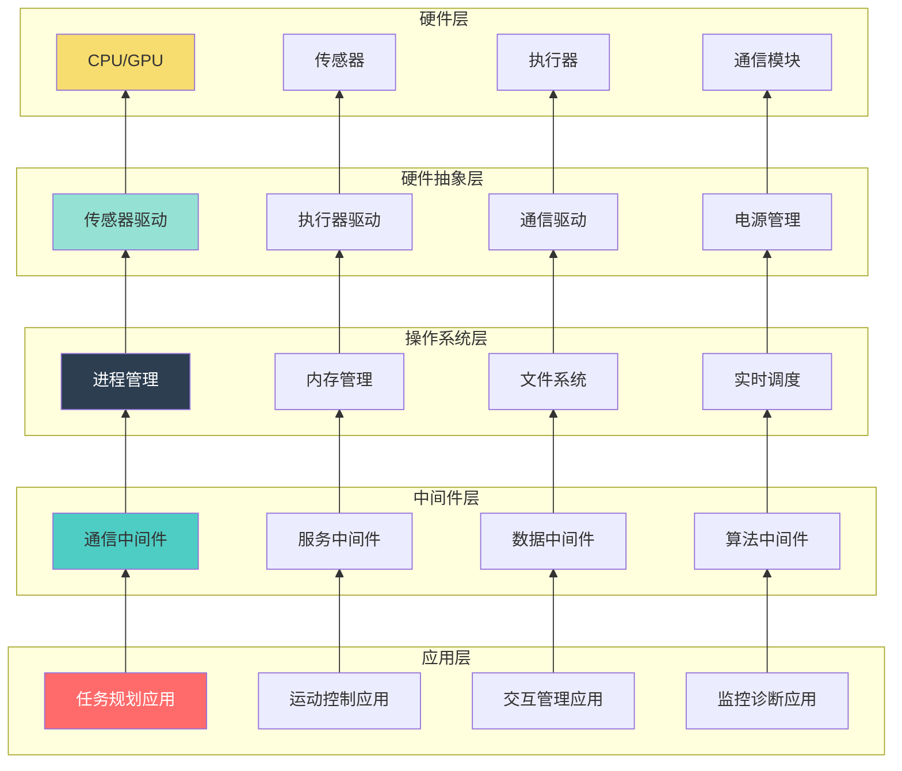
```mermaid
graph BT
    subgraph 应用层
        A1[任务规划应用]
        A2[运动控制应用]
        A3[交互管理应用]
        A4[监控诊断应用]
    end
    
    subgraph 中间件层
        B1[通信中间件]
        B2[服务中间件]
        B3[数据中间件]
        B4[算法中间件]
    end
    
    subgraph 操作系统层
        C1[进程管理]
        C2[内存管理]
        C3[文件系统]
        C4[实时调度]
    end
    
    subgraph 硬件抽象层
        D1[传感器驱动]
        D2[执行器驱动]
        D3[通信驱动]
        D4[电源管理]
    end
    
    subgraph 硬件层
        E1[CPU/GPU]
        E2[传感器]
        E3[执行器]
        E4[通信模块]
    end
    
    A1 --> B1
    A2 --> B2
    A3 --> B3
    A4 --> B4
    
    B1 --> C1
    B2 --> C2
    B3 --> C3
    B4 --> C4
    
    C1 --> D1
    C2 --> D2
    C3 --> D3
    C4 --> D4
    
    D1 --> E1
    D2 --> E2
    D3 --> E3
    D4 --> E4
    
    style A1 fill:#FF6B6B,color:#fff
    style B1 fill:#4ECDC4
    style C1 fill:#2C3E50,color:#fff
    style D1 fill:#95E1D3
    style E1 fill:#F7DC6F
```

#### A.2 任务优先级设计

**实时任务分配** [推理]

| 任务类型 | 任务名称 | 优先级 | 周期时间 | CPU分配 | 实时性要求 |
|---------|---------|--------|---------|---------|-----------|
| 实时任务 | 关节控制 | 最高 | 1ms | MCU | 硬实时 |
| 实时任务 | 平衡控制 | 最高 | 2ms | MCU | 硬实时 |
| 实时任务 | 碰撞检测 | 最高 | 5ms | MCU | 硬实时 |
| 实时任务 | 急停响应 | 最高 | 事件触发 | MCU | 硬实时 |
| 准实时任务 | 步态规划 | 高 | 10ms | CPU核心0 | 软实时 |
| 准实时任务 | 轨迹规划 | 高 | 10ms | CPU核心0 | 软实时 |
| 准实时任务 | 力控制 | 高 | 5ms | MCU | 硬实时 |
| 准实时任务 | 传感器融合 | 高 | 10ms | CPU核心1 | 软实时 |
| 非实时任务 | 视觉感知 | 中 | 33ms | GPU | 非实时 |
| 非实时任务 | 语音识别 | 中 | 100ms | CPU核心2 | 非实时 |
| 非实时任务 | 任务规划 | 中 | 100ms | CPU核心3 | 非实时 |
| 非实时任务 | UI更新 | 低 | 100ms | CPU核心3 | 非实时 |
| 非实时任务 | 日志记录 | 最低 | 1s | CPU核心3 | 非实时 |

**多核任务分配** [推理]

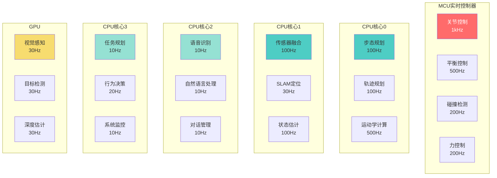
```mermaid
flowchart TD
    subgraph MCU实时控制器
        M1[关节控制<br/>1kHz]
        M2[平衡控制<br/>500Hz]
        M3[碰撞检测<br/>200Hz]
        M4[力控制<br/>200Hz]
    end
    
    subgraph CPU核心0
        C0_1[步态规划<br/>100Hz]
        C0_2[轨迹规划<br/>100Hz]
        C0_3[运动学计算<br/>500Hz]
    end
    
    subgraph CPU核心1
        C1_1[传感器融合<br/>100Hz]
        C1_2[SLAM定位<br/>30Hz]
        C1_3[状态估计<br/>100Hz]
    end
    
    subgraph CPU核心2
        C2_1[语音识别<br/>10Hz]
        C2_2[自然语言处理<br/>10Hz]
        C2_3[对话管理<br/>10Hz]
    end
    
    subgraph CPU核心3
        C3_1[任务规划<br/>10Hz]
        C3_2[行为决策<br/>20Hz]
        C3_3[系统监控<br/>10Hz]
    end
    
    subgraph GPU
        G1[视觉感知<br/>30Hz]
        G2[目标检测<br/>30Hz]
        G3[深度估计<br/>30Hz]
    end
    
    style M1 fill:#FF6B6B,color:#fff
    style C0_1 fill:#4ECDC4
    style C1_1 fill:#4ECDC4
    style C2_1 fill:#95E1D3
    style C3_1 fill:#95E1D3
    style G1 fill:#F7DC6F
```

### B. 运动控制软件架构（人形机器人专属）

#### B.1 控制层级设计

**运动控制四层架构** [关联]

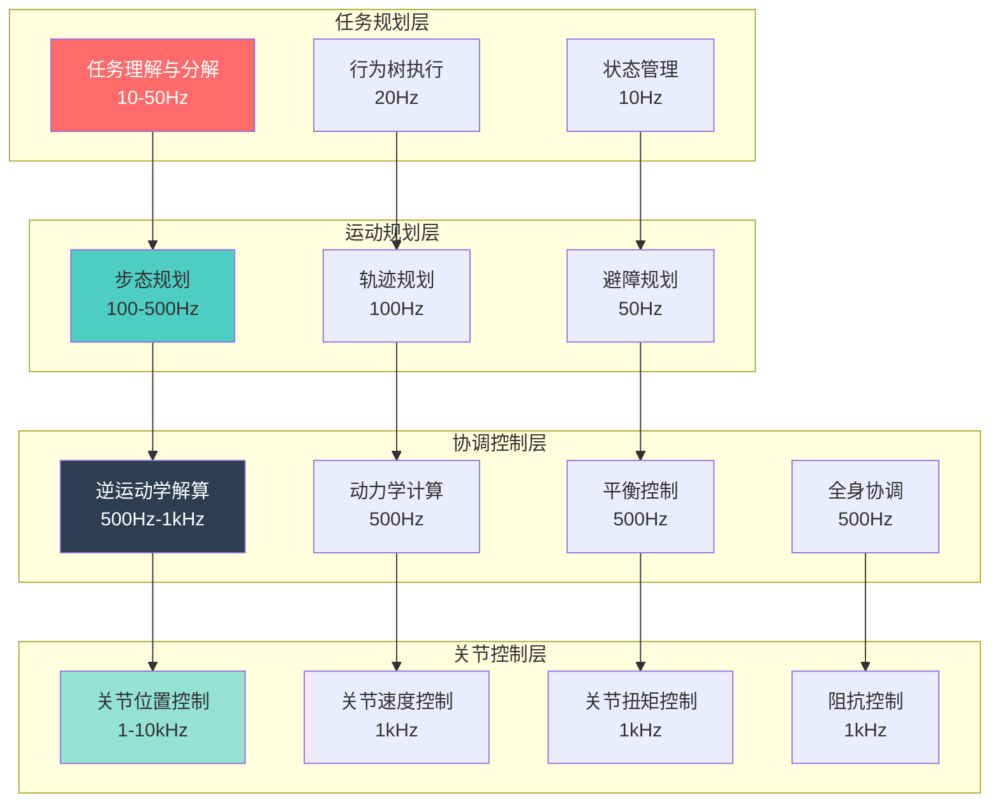
```mermaid
graph TD
    subgraph 任务规划层
        T1[任务理解与分解<br/>10-50Hz]
        T2[行为树执行<br/>20Hz]
        T3[状态管理<br/>10Hz]
    end
    
    subgraph 运动规划层
        M1[步态规划<br/>100-500Hz]
        M2[轨迹规划<br/>100Hz]
        M3[避障规划<br/>50Hz]
    end
    
    subgraph 协调控制层
        C1[逆运动学解算<br/>500Hz-1kHz]
        C2[动力学计算<br/>500Hz]
        C3[平衡控制<br/>500Hz]
        C4[全身协调<br/>500Hz]
    end
    
    subgraph 关节控制层
        J1[关节位置控制<br/>1-10kHz]
        J2[关节速度控制<br/>1kHz]
        J3[关节扭矩控制<br/>1kHz]
        J4[阻抗控制<br/>1kHz]
    end
    
    T1 --> M1
    T2 --> M2
    T3 --> M3
    
    M1 --> C1
    M2 --> C2
    M3 --> C3
    
    C1 --> J1
    C2 --> J2
    C3 --> J3
    C4 --> J4
    
    style T1 fill:#FF6B6B,color:#fff
    style M1 fill:#4ECDC4
    style C1 fill:#2C3E50,color:#fff
    style J1 fill:#95E1D3
```

#### B.2 实时性要求

**运动控制实时性指标** [关联]

| 控制层级 | 控制周期 | 最大延迟 | 抖动要求 | 控制器 |
|---------|---------|---------|---------|--------|
| 关节控制层 | < 1ms | < 100μs | < 10μs | MCU |
| 协调控制层 | < 2ms | < 200μs | < 50μs | MCU/CPU |
| 运动规划层 | < 10ms | < 1ms | < 100μs | CPU |
| 任务规划层 | < 100ms | < 10ms | < 1ms | CPU |

#### B.3 软件模块设计

**运动学模块** [推理]

| 模块名称 | 功能描述 | 输入 | 输出 | 更新频率 |
|---------|---------|------|------|---------|
| 正运动学 | 计算末端位姿 | 关节角度 | 末端位姿 | 1kHz |
| 逆运动学 | 计算关节角度 | 末端位姿 | 关节角度 | 500Hz |
| 雅可比矩阵 | 计算速度映射 | 关节角度 | 雅可比矩阵 | 500Hz |
| 奇异点检测 | 检测运动奇异 | 关节角度 | 奇异标志 | 500Hz |

**动力学模块** [推理]

| 模块名称 | 功能描述 | 输入 | 输出 | 更新频率 |
|---------|---------|------|------|---------|
| 正向动力学 | 计算关节加速度 | 关节力矩 | 关节加速度 | 500Hz |
| 逆向动力学 | 计算关节力矩 | 关节运动 | 关节力矩 | 500Hz |
| 质量矩阵 | 计算惯性矩阵 | 关节角度 | 质量矩阵 | 200Hz |
| 重力补偿 | 计算重力力矩 | 关节角度 | 重力力矩 | 500Hz |

**平衡控制模块** [关联]

| 模块名称 | 功能描述 | 控制方法 | 更新频率 | 响应时间 |
|---------|---------|---------|---------|---------|
| ZMP控制 | 零力矩点控制 | PID控制 | 500Hz | < 10ms |
| MPC控制 | 模型预测控制 | 二次规划 | 100Hz | < 50ms |
| WBC控制 | 全身控制 | 优化求解 | 500Hz | < 10ms |
| 质心控制 | 质心轨迹跟踪 | LQR控制 | 500Hz | < 10ms |

**步态规划模块** [关联]

| 模块名称 | 功能描述 | 输入参数 | 输出结果 | 更新频率 |
|---------|---------|---------|---------|---------|
| 步态生成 | 生成步态轨迹 | 步长/步频/步高 | 关节轨迹 | 100Hz |
| 步态切换 | 步态模式切换 | 当前步态/目标步态 | 切换轨迹 | 事件触发 |
| 步态优化 | 步态参数优化 | 能耗/稳定性指标 | 优化参数 | 10Hz |

### C. 感知导航软件架构（人形机器人专属）

#### C.1 感知层级设计

**感知系统四层架构** [关联]

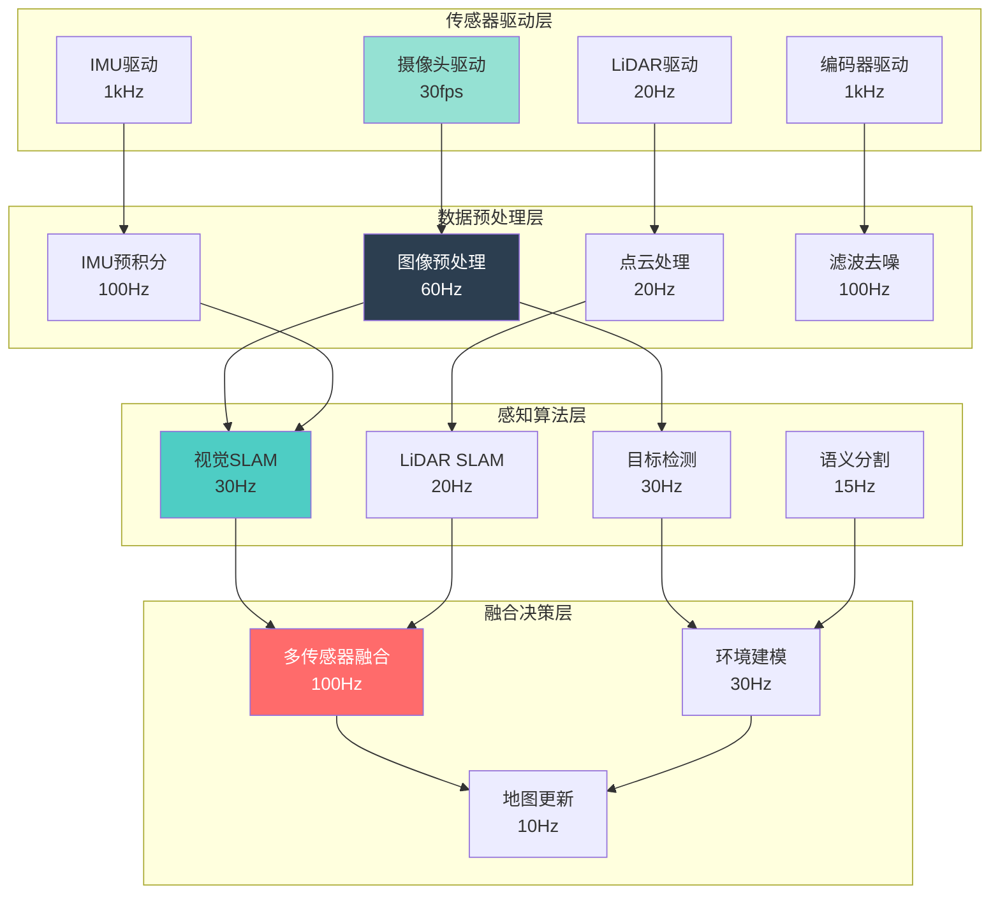
```mermaid
graph TD
    subgraph 融合决策层
        F1[多传感器融合<br/>100Hz]
        F2[环境建模<br/>30Hz]
        F3[地图更新<br/>10Hz]
    end
    
    subgraph 感知算法层
        P1[视觉SLAM<br/>30Hz]
        P2[LiDAR SLAM<br/>20Hz]
        P3[目标检测<br/>30Hz]
        P4[语义分割<br/>15Hz]
    end
    
    subgraph 数据预处理层
        D1[图像预处理<br/>60Hz]
        D2[点云处理<br/>20Hz]
        D3[IMU预积分<br/>100Hz]
        D4[滤波去噪<br/>100Hz]
    end
    
    subgraph 传感器驱动层
        S1[摄像头驱动<br/>30fps]
        S2[LiDAR驱动<br/>20Hz]
        S3[IMU驱动<br/>1kHz]
        S4[编码器驱动<br/>1kHz]
    end
    
    S1 --> D1
    S2 --> D2
    S3 --> D3
    S4 --> D4
    
    D1 --> P1
    D1 --> P3
    D2 --> P2
    D3 --> P1
    
    P1 --> F1
    P2 --> F1
    P3 --> F2
    P4 --> F2
    
    F1 --> F3
    F2 --> F3
    
    style F1 fill:#FF6B6B,color:#fff
    style P1 fill:#4ECDC4
    style D1 fill:#2C3E50,color:#fff
    style S1 fill:#95E1D3
```

#### C.2 实时性要求

**感知系统实时性指标** [关联]

| 感知层级 | 处理频率 | 最大延迟 | 数据吞吐量 | 计算平台 |
|---------|---------|---------|-----------|---------|
| 传感器驱动层 | 30-1000Hz | < 1ms | 高 | MCU/FPGA |
| 数据预处理层 | 20-100Hz | < 10ms | 中 | CPU |
| 感知算法层 | 15-30Hz | < 50ms | 高 | GPU |
| 融合决策层 | 10-100Hz | < 20ms | 低 | CPU |

#### C.3 软件模块设计

**视觉SLAM模块** [推理]

| 模块名称 | 功能描述 | 算法类型 | 更新频率 | 精度要求 |
|---------|---------|---------|---------|---------|
| 特征提取 | 提取图像特征 | ORB/SIFT | 30Hz | - |
| 特征匹配 | 匹配特征点 | BF/FLANN | 30Hz | - |
| 位姿估计 | 估计相机位姿 | PnP/RANSAC | 30Hz | 1cm |
| 回环检测 | 检测回环 | 词袋模型 | 1Hz | - |
| 地图优化 | 优化地图 | 图优化 | 1Hz | - |

**LiDAR SLAM模块** [推理]

| 模块名称 | 功能描述 | 算法类型 | 更新频率 | 精度要求 |
|---------|---------|---------|---------|---------|
| 点云配准 | 配准点云 | ICP/NDT | 20Hz | 1cm |
| 地图构建 | 构建点云地图 | 栅格地图 | 10Hz | 5cm |
| 定位更新 | 更新机器人位姿 | EKF/UKF | 20Hz | 1cm |
| 动态剔除 | 剔除动态物体 | 聚类分割 | 10Hz | - |

**目标检测模块** [关联]

| 模块名称 | 功能描述 | 算法类型 | 更新频率 | 精度要求 |
|---------|---------|---------|---------|---------|
| 目标识别 | 识别目标类别 | YOLO/SSD | 30Hz | >90% |
| 目标跟踪 | 跟踪目标运动 | DeepSORT | 30Hz | - |
| 目标分类 | 分类目标类型 | CNN | 30Hz | >95% |
| 6D位姿估计 | 估计目标位姿 | PoseNet | 30Hz | 毫米级 |

**路径规划模块** [关联]

| 模块名称 | 功能描述 | 算法类型 | 更新频率 | 规划范围 |
|---------|---------|---------|---------|---------|
| 全局规划 | 全局路径搜索 | A*/Dijkstra | 1Hz | 全局地图 |
| 局部规划 | 局部轨迹生成 | TEB/DWA | 10Hz | 5m范围 |
| 避障规划 | 避障轨迹优化 | MPC | 50Hz | 2m范围 |
| 路径跟踪 | 路径跟踪控制 | MPC/PID | 100Hz | - |

### D. 智能交互软件架构（人形机器人专属）

#### D.1 交互层级设计

**智能交互四层架构** [关联]

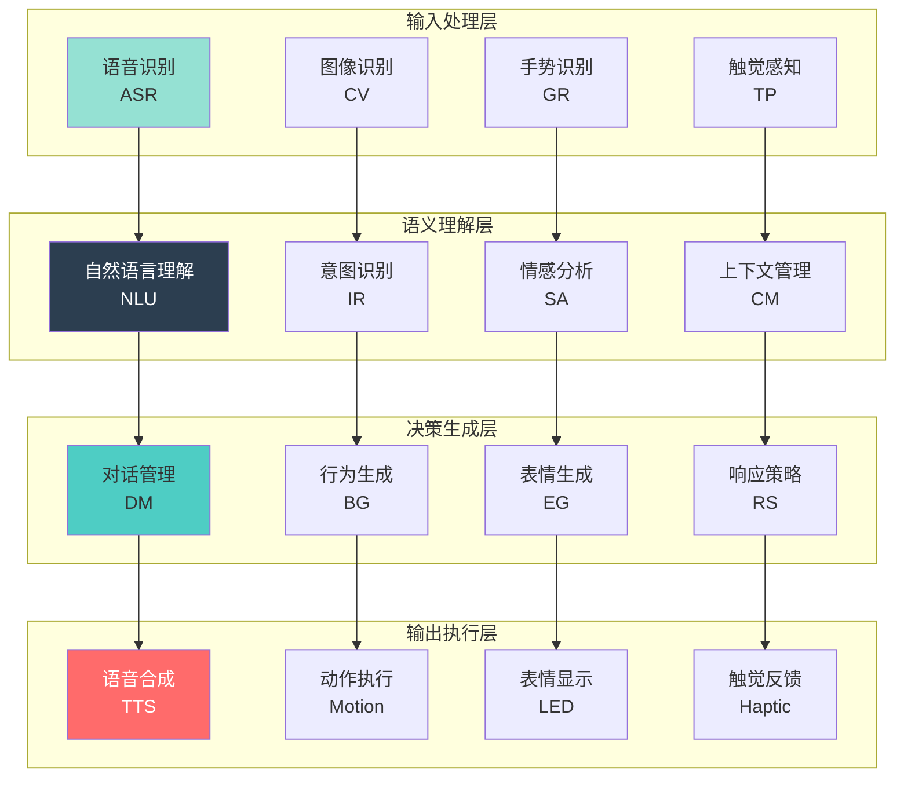
```mermaid
graph TD
    subgraph 输出执行层
        O1[语音合成<br/>TTS]
        O2[动作执行<br/>Motion]
        O3[表情显示<br/>LED]
        O4[触觉反馈<br/>Haptic]
    end
    
    subgraph 决策生成层
        D1[对话管理<br/>DM]
        D2[行为生成<br/>BG]
        D3[表情生成<br/>EG]
        D4[响应策略<br/>RS]
    end
    
    subgraph 语义理解层
        U1[自然语言理解<br/>NLU]
        U2[意图识别<br/>IR]
        U3[情感分析<br/>SA]
        U4[上下文管理<br/>CM]
    end
    
    subgraph 输入处理层
        I1[语音识别<br/>ASR]
        I2[图像识别<br/>CV]
        I3[手势识别<br/>GR]
        I4[触觉感知<br/>TP]
    end
    
    I1 --> U1
    I2 --> U2
    I3 --> U3
    I4 --> U4
    
    U1 --> D1
    U2 --> D2
    U3 --> D3
    U4 --> D4
    
    D1 --> O1
    D2 --> O2
    D3 --> O3
    D4 --> O4
    
    style O1 fill:#FF6B6B,color:#fff
    style D1 fill:#4ECDC4
    style U1 fill:#2C3E50,color:#fff
    style I1 fill:#95E1D3
```

#### D.2 实时性要求

**交互系统实时性指标** [关联]

| 交互层级 | 处理延迟 | 最大延迟 | 用户体验要求 | 计算平台 |
|---------|---------|---------|-------------|---------|
| 输入处理层 | < 100ms | < 200ms | 实时响应 | CPU/GPU |
| 语义理解层 | < 200ms | < 500ms | 自然流畅 | CPU/GPU |
| 决策生成层 | < 100ms | < 300ms | 快速响应 | CPU |
| 输出执行层 | < 100ms | < 200ms | 即时反馈 | MCU/CPU |

#### D.3 软件模块设计

**语音识别模块** [事实]

| 模块名称 | 功能描述 | 技术规格 | 更新频率 | 精度要求 |
|---------|---------|---------|---------|---------|
| 语音唤醒 | 检测唤醒词 | 关键词检测 | 实时 | >95% |
| 语音识别 | 语音转文本 | ASR引擎 | 实时 | 98.7% |
| 语音增强 | 噪声抑制 | 波束成形 | 实时 | - |
| 说话人识别 | 识别说话人 | 声纹识别 | 实时 | >90% |

**语音合成模块** [推理]

| 模块名称 | 功能描述 | 技术规格 | 延迟要求 | 自然度 |
|---------|---------|---------|---------|--------|
| 文本分析 | 分析文本结构 | NLP | < 50ms | - |
| 韵律生成 | 生成韵律参数 | 统计模型 | < 100ms | - |
| 声学合成 | 生成语音波形 | Tacotron | < 200ms | >4.0 MOS |
| 情感调节 | 调节语音情感 | 情感模型 | < 50ms | - |

**人脸识别模块** [推理]

| 模块名称 | 功能描述 | 技术规格 | 更新频率 | 精度要求 |
|---------|---------|---------|---------|---------|
| 人脸检测 | 检测人脸位置 | MTCNN | 30Hz | >99% |
| 人脸识别 | 识别人员身份 | FaceNet | 10Hz | >95% |
| 表情识别 | 识别表情类别 | CNN | 10Hz | >85% |
| 人脸跟踪 | 跟踪人脸运动 | KCF | 30Hz | - |

**手势识别模块** [推理]

| 模块名称 | 功能描述 | 技术规格 | 更新频率 | 精度要求 |
|---------|---------|---------|---------|---------|
| 手势检测 | 检测手势位置 | YOLO | 30Hz | >90% |
| 手势识别 | 识别手势类型 | CNN | 30Hz | >90% |
| 手势跟踪 | 跟踪手势运动 | 卡尔曼滤波 | 30Hz | - |
| 手势响应 | 生成响应动作 | 规则引擎 | 10Hz | - |

### E. 决策规划软件架构（人形机器人专属）

#### E.1 决策层级设计

**决策规划四层架构** [关联]

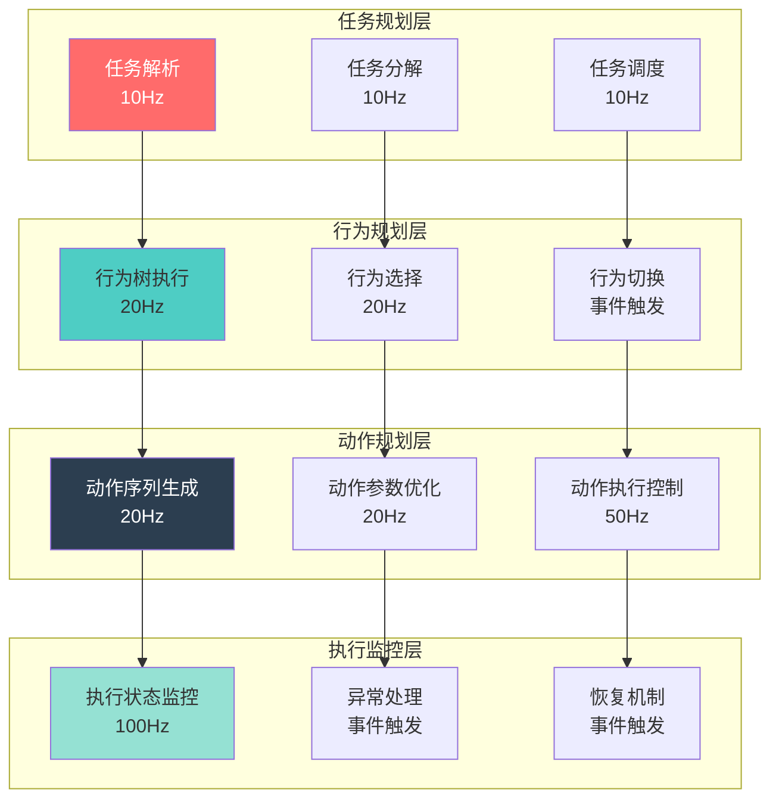
```mermaid
graph TD
    subgraph 执行监控层
        E1[执行状态监控<br/>100Hz]
        E2[异常处理<br/>事件触发]
        E3[恢复机制<br/>事件触发]
    end
    
    subgraph 动作规划层
        A1[动作序列生成<br/>20Hz]
        A2[动作参数优化<br/>20Hz]
        A3[动作执行控制<br/>50Hz]
    end
    
    subgraph 行为规划层
        B1[行为树执行<br/>20Hz]
        B2[行为选择<br/>20Hz]
        B3[行为切换<br/>事件触发]
    end
    
    subgraph 任务规划层
        T1[任务解析<br/>10Hz]
        T2[任务分解<br/>10Hz]
        T3[任务调度<br/>10Hz]
    end
    
    T1 --> B1
    T2 --> B2
    T3 --> B3
    
    B1 --> A1
    B2 --> A2
    B3 --> A3
    
    A1 --> E1
    A2 --> E2
    A3 --> E3
    
    style T1 fill:#FF6B6B,color:#fff
    style B1 fill:#4ECDC4
    style A1 fill:#2C3E50,color:#fff
    style E1 fill:#95E1D3
```

#### E.2 实时性要求

**决策系统实时性指标** [推理]

| 决策层级 | 规划周期 | 最大延迟 | 决策复杂度 | 计算平台 |
|---------|---------|---------|-----------|---------|
| 任务规划层 | 100ms-1s | < 1s | 高 | CPU |
| 行为规划层 | 50-100ms | < 100ms | 中 | CPU |
| 动作规划层 | 10-50ms | < 50ms | 低 | CPU |
| 执行监控层 | 10-100ms | < 10ms | 低 | MCU/CPU |

#### E.3 软件模块设计

**任务规划模块** [关联]

| 模块名称 | 功能描述 | 算法类型 | 更新频率 | 输出结果 |
|---------|---------|---------|---------|---------|
| 任务解析 | 解析任务描述 | NLP | 10Hz | 任务结构 |
| 任务分解 | 分解子任务 | HTN | 10Hz | 子任务列表 |
| 任务调度 | 调度任务执行 | 调度算法 | 10Hz | 执行序列 |
| 任务监控 | 监控任务状态 | 状态机 | 10Hz | 任务状态 |

**行为树模块** [推理]

| 模块名称 | 功能描述 | 节点类型 | 更新频率 | 行为数量 |
|---------|---------|---------|---------|---------|
| 行为树构建 | 构建行为树 | 组合节点 | 初始化 | - |
| 行为树执行 | 执行行为节点 | 执行节点 | 20Hz | 100+ |
| 行为树调试 | 调试行为逻辑 | 调试节点 | 10Hz | - |
| 行为树可视化 | 可视化行为树 | 显示节点 | 1Hz | - |

**状态机模块** [推理]

| 模块名称 | 功能描述 | 状态数量 | 转换条件 | 更新频率 |
|---------|---------|---------|---------|---------|
| 状态定义 | 定义系统状态 | 50+ | - | 初始化 |
| 状态转换 | 状态转换逻辑 | - | 事件驱动 | 100Hz |
| 状态监控 | 监控当前状态 | - | - | 100Hz |
| 状态恢复 | 恢复到安全状态 | - | 异常触发 | 事件触发 |

**异常处理模块** [推理]

| 模块名称 | 功能描述 | 异常类型 | 响应时间 | 恢复策略 |
|---------|---------|---------|---------|---------|
| 异常检测 | 检测异常状态 | 传感器/执行器/通信 | < 10ms | - |
| 异常分类 | 分类异常等级 | 轻微/中等/严重 | < 5ms | - |
| 异常隔离 | 隔离异常模块 | 模块级隔离 | < 10ms | - |
| 异常恢复 | 恢复正常状态 | 自动/手动恢复 | 可变 | 恢复流程 |

### F. 安全监控软件架构（人形机器人专属）

#### F.1 安全层级设计

**安全监控四层架构** [关联]

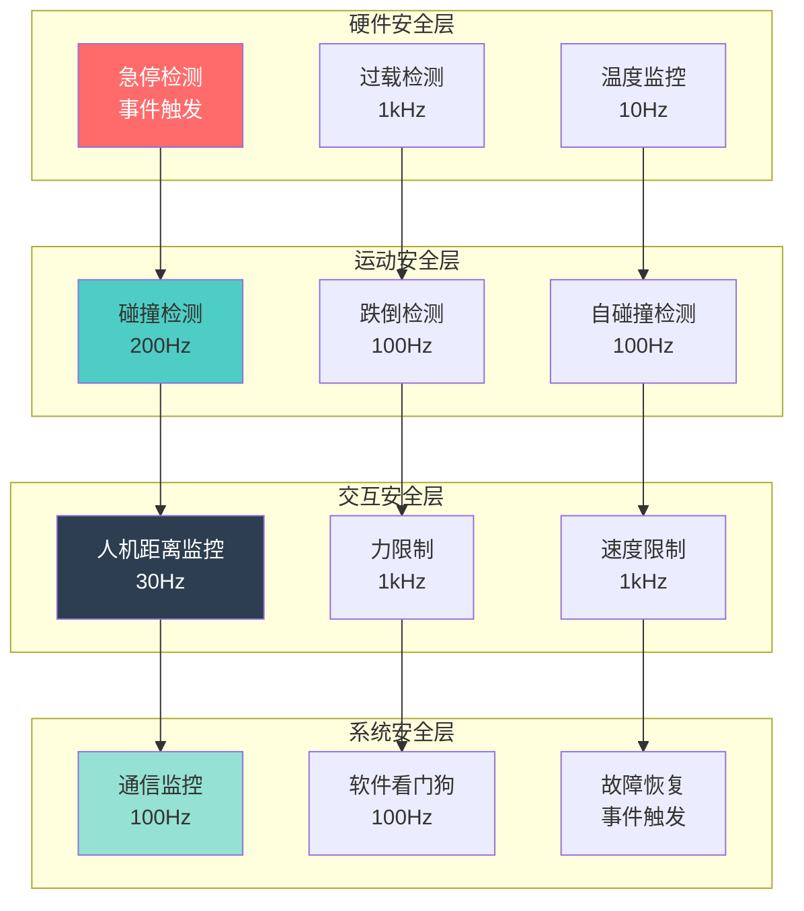
```mermaid
graph TD
    subgraph 系统安全层
        S1[通信监控<br/>100Hz]
        S2[软件看门狗<br/>100Hz]
        S3[故障恢复<br/>事件触发]
    end
    
    subgraph 交互安全层
        I1[人机距离监控<br/>30Hz]
        I2[力限制<br/>1kHz]
        I3[速度限制<br/>1kHz]
    end
    
    subgraph 运动安全层
        M1[碰撞检测<br/>200Hz]
        M2[跌倒检测<br/>100Hz]
        M3[自碰撞检测<br/>100Hz]
    end
    
    subgraph 硬件安全层
        H1[急停检测<br/>事件触发]
        H2[过载检测<br/>1kHz]
        H3[温度监控<br/>10Hz]
    end
    
    H1 --> M1
    H2 --> M2
    H3 --> M3
    
    M1 --> I1
    M2 --> I2
    M3 --> I3
    
    I1 --> S1
    I2 --> S2
    I3 --> S3
    
    style H1 fill:#FF6B6B,color:#fff
    style M1 fill:#4ECDC4
    style I1 fill:#2C3E50,color:#fff
    style S1 fill:#95E1D3
```

#### F.2 实时性要求

**安全系统实时性指标** [推理]

| 安全层级 | 检测周期 | 响应时间 | 安全等级 | 控制器 |
|---------|---------|---------|---------|--------|
| 硬件安全层 | 事件触发 | < 10ms | SIL3 | MCU |
| 运动安全层 | 5-10ms | < 20ms | SIL2 | MCU |
| 交互安全层 | 10-33ms | < 50ms | SIL2 | MCU/CPU |
| 系统安全层 | 10-100ms | < 100ms | SIL1 | CPU |

#### F.3 软件模块设计

**碰撞检测模块** [关联]

| 模块名称 | 检测方式 | 检测周期 | 响应时间 | 检测精度 |
|---------|---------|---------|---------|---------|
| 基于力传感器 | 六维力传感器 | 1kHz | < 5ms | 0.1N |
| 基于电流 | 电机电流监测 | 1kHz | < 5ms | - |
| 基于观测器 | 动量观测器 | 500Hz | < 10ms | - |
| 基于电子皮肤 | 电容式传感器 | 200Hz | < 10ms | - |

**跌倒检测模块** [推理]

| 模块名称 | 检测方式 | 检测周期 | 响应时间 | 预测时间 |
|---------|---------|---------|---------|---------|
| 基于IMU | 姿态角度检测 | 1kHz | < 10ms | - |
| 基于ZMP | ZMP位置计算 | 500Hz | < 20ms | 100ms |
| 基于质心 | 质心轨迹预测 | 500Hz | < 20ms | 200ms |
| 基于学习 | 深度学习预测 | 100Hz | < 50ms | 500ms |

**过载保护模块** [推理]

| 模块名称 | 监控参数 | 监控频率 | 保护阈值 | 保护动作 |
|---------|---------|---------|---------|---------|
| 电流监控 | 电机电流 | 1kHz | 1.5倍额定 | 限制电流 |
| 扭矩监控 | 关节扭矩 | 1kHz | 1.2倍额定 | 限制扭矩 |
| 温度监控 | 电机温度 | 10Hz | 70°C | 降功率 |
| 速度监控 | 关节速度 | 1kHz | 最大速度 | 限制速度 |

**故障恢复模块** [推理]

| 模块名称 | 功能描述 | 故障类型 | 恢复时间 | 恢复方式 |
|---------|---------|---------|---------|---------|
| 故障诊断 | 诊断故障原因 | 硬件/软件 | < 1s | - |
| 故障隔离 | 隔离故障模块 | 模块级 | < 100ms | - |
| 故障恢复 | 恢复正常状态 | 可恢复故障 | 可变 | 自动/手动 |
| 安全降级 | 降级运行模式 | 严重故障 | < 1s | 自动切换 |

---

## II. 功能模块定义 (Module Definitions)

### A. 运动控制功能（人形机器人专属）

#### A.1 关节控制功能

**位置控制功能** [关联]

| 功能名称 | 功能描述 | 输入参数 | 输出结果 | 控制精度 |
|---------|---------|---------|---------|---------|
| 目标位置设定 | 设定关节目标位置 | 目标角度 | 控制指令 | - |
| 运动轨迹生成 | 生成平滑运动轨迹 | 目标位置/速度/加速度 | 轨迹点序列 | - |
| 位置反馈控制 | 闭环位置控制 | 目标位置/实际位置 | 控制输出 | ±0.01° |
| 位置限位保护 | 软件限位保护 | 关节角度 | 限位标志 | - |

**速度控制功能** [推理]

| 功能名称 | 功能描述 | 输入参数 | 输出结果 | 控制精度 |
|---------|---------|---------|---------|---------|
| 目标速度设定 | 设定关节目标速度 | 目标速度 | 控制指令 | - |
| 速度轨迹生成 | 生成平滑速度曲线 | 目标速度/加速度 | 速度序列 | - |
| 速度反馈控制 | 闭环速度控制 | 目标速度/实际速度 | 控制输出 | ±1% |
| 速度限制保护 | 速度超限保护 | 关节速度 | 限制标志 | - |

**扭矩控制功能** [推理]

| 功能名称 | 功能描述 | 输入参数 | 输出结果 | 控制精度 |
|---------|---------|---------|---------|---------|
| 目标扭矩设定 | 设定关节目标扭矩 | 目标扭矩 | 控制指令 | - |
| 扭矩前馈控制 | 前馈扭矩补偿 | 期望扭矩 | 补偿扭矩 | - |
| 扭矩反馈控制 | 闭环扭矩控制 | 目标扭矩/实际扭矩 | 控制输出 | ±1% |
| 扭矩限制保护 | 扭矩超限保护 | 关节扭矩 | 限制标志 | - |

**阻抗控制功能** [推理]

| 功能名称 | 功能描述 | 输入参数 | 输出结果 | 控制参数 |
|---------|---------|---------|---------|---------|
| 刚度设定 | 设定虚拟刚度 | 刚度系数 | 阻抗参数 | K: 0-10000 N/m |
| 阻尼设定 | 设定虚拟阻尼 | 阻尼系数 | 阻抗参数 | D: 0-1000 Ns/m |
| 期望位置设定 | 设定平衡位置 | 期望位置 | 阻抗参数 | - |
| 力响应计算 | 计算力响应 | 位置偏差 | 响应力 | - |

#### A.2 运动规划功能

**步态规划功能** [关联]

| 功能名称 | 功能描述 | 输入参数 | 输出结果 | 更新频率 |
|---------|---------|---------|---------|---------|
| 步态类型选择 | 选择步态模式 | 地形/速度 | 步态类型 | 事件触发 |
| 步态参数设定 | 设定步态参数 | 步长/步频/步高 | 参数配置 | 10Hz |
| 步态生成 | 生成步态轨迹 | 步态参数 | 关节轨迹 | 100Hz |
| 步态切换 | 切换步态模式 | 当前/目标步态 | 切换轨迹 | 事件触发 |

**轨迹规划功能** [推理]

| 功能名称 | 功能描述 | 输入参数 | 输出结果 | 更新频率 |
|---------|---------|---------|---------|---------|
| 轨迹生成 | 生成运动轨迹 | 起点/终点/约束 | 轨迹点序列 | 100Hz |
| 轨迹优化 | 优化轨迹质量 | 轨迹/优化目标 | 优化轨迹 | 10Hz |
| 轨迹跟踪 | 跟踪参考轨迹 | 参考轨迹 | 控制指令 | 1kHz |
| 轨迹插值 | 轨迹平滑插值 | 离散点 | 连续轨迹 | 1kHz |

**避障规划功能** [关联]

| 功能名称 | 功能描述 | 输入参数 | 输出结果 | 更新频率 |
|---------|---------|---------|---------|---------|
| 障碍物检测 | 检测环境障碍 | 传感器数据 | 障碍物列表 | 30Hz |
| 避障路径生成 | 生成避障路径 | 障碍物/目标 | 避障路径 | 10Hz |
| 避障执行 | 执行避障动作 | 避障路径 | 控制指令 | 100Hz |
| 动态避障 | 动态障碍避让 | 动态障碍 | 实时路径 | 50Hz |

#### A.3 平衡控制功能

**站立平衡功能** [推理]

| 功能名称 | 功能描述 | 控制方法 | 更新频率 | 响应时间 |
|---------|---------|---------|---------|---------|
| 质心控制 | 控制质心位置 | LQR | 500Hz | < 20ms |
| ZMP控制 | 控制ZMP位置 | PID | 500Hz | < 10ms |
| 姿态控制 | 控制身体姿态 | PID | 500Hz | < 20ms |
| 扰动抑制 | 抑制外部扰动 | 阻抗控制 | 500Hz | < 50ms |

**行走平衡功能** [推理]

| 功能名称 | 功能描述 | 控制方法 | 更新频率 | 响应时间 |
|---------|---------|---------|---------|---------|
| 步态平衡 | 步态过程平衡 | MPC | 100Hz | < 50ms |
| 动态平衡 | 动态行走平衡 | WBC | 500Hz | < 10ms |
| 扰动恢复 | 扰动后恢复 | 反应控制 | 500Hz | < 100ms |
| 地形适应 | 适应地形变化 | 自适应控制 | 100Hz | < 100ms |

**跌倒保护功能** [推理]

| 功能名称 | 功能描述 | 检测方式 | 响应时间 | 保护策略 |
|---------|---------|---------|---------|---------|
| 跌倒预测 | 预测跌倒风险 | IMU/ZMP | < 10ms | - |
| 跌倒防护 | 执行防护动作 | 预测结果 | < 50ms | 护头/护关节 |
| 跌倒缓冲 | 缓冲跌倒冲击 | 力传感器 | < 10ms | 柔顺控制 |
| 跌倒恢复 | 跌倒后爬起 | 状态检测 | < 30s | 自主爬起 |

### B. 感知导航功能（人形机器人专属）

#### B.1 定位功能

**视觉定位功能** [关联]

| 功能名称 | 功能描述 | 算法类型 | 更新频率 | 定位精度 |
|---------|---------|---------|---------|---------|
| 视觉特征提取 | 提取视觉特征 | ORB/SIFT | 30Hz | - |
| 特征匹配 | 匹配特征点 | BF/FLANN | 30Hz | - |
| 位姿估计 | 估计相机位姿 | PnP/RANSAC | 30Hz | 1cm |
| 视觉里程计 | 估计运动增量 | VO | 30Hz | 2% |

**LiDAR定位功能** [推理]

| 功能名称 | 功能描述 | 算法类型 | 更新频率 | 定位精度 |
|---------|---------|---------|---------|---------|
| 点云配准 | 配准点云数据 | ICP/NDT | 20Hz | 1cm |
| 地图匹配 | 匹配地图数据 | NDT | 10Hz | 2cm |
| 位姿更新 | 更新机器人位姿 | EKF | 20Hz | 1cm |
| 回环检测 | 检测闭环 | 位置识别 | 1Hz | - |

**融合定位功能** [推理]

| 功能名称 | 功能描述 | 融合算法 | 更新频率 | 定位精度 |
|---------|---------|---------|---------|---------|
| 多传感器融合 | 融合多源数据 | EKF/UKF | 100Hz | 1cm |
| 卡尔曼滤波 | 状态估计滤波 | EKF | 100Hz | - |
| 位姿优化 | 优化位姿估计 | 图优化 | 10Hz | 0.5cm |
| 不确定性估计 | 估计定位不确定性 | 协方差 | 100Hz | - |

#### B.2 建图功能

**视觉建图功能** [关联]

| 功能名称 | 功能描述 | 地图类型 | 更新频率 | 地图精度 |
|---------|---------|---------|---------|---------|
| 特征地图构建 | 构建特征点地图 | 稀疏地图 | 10Hz | 5cm |
| 稠密地图构建 | 构建稠密地图 | 稠密点云 | 1Hz | 10cm |
| 语义地图构建 | 构建语义地图 | 语义地图 | 0.1Hz | 20cm |
| 地图维护 | 维护地图数据 | - | 1Hz | - |

**LiDAR建图功能** [推理]

| 功能名称 | 功能描述 | 地图类型 | 更新频率 | 地图精度 |
|---------|---------|---------|---------|---------|
| 点云地图构建 | 构建点云地图 | 点云地图 | 10Hz | 2cm |
| 栅格地图构建 | 构建栅格地图 | 占据栅格 | 1Hz | 5cm |
| 高程地图构建 | 构建高程地图 | 高程图 | 1Hz | 5cm |
| 地图更新 | 增量更新地图 | - | 10Hz | - |

**地图更新功能** [推理]

| 功能名称 | 功能描述 | 更新方式 | 更新频率 | 更新范围 |
|---------|---------|---------|---------|---------|
| 增量更新 | 增量添加新数据 | 增量式 | 10Hz | 局部 |
| 回环优化 | 回环后全局优化 | 批量式 | 事件触发 | 全局 |
| 地图维护 | 清理过期数据 | 周期式 | 1Hz | 全局 |
| 地图存储 | 持久化存储地图 | 按需 | 事件触发 | - |

#### B.3 导航功能

**全局规划功能** [关联]

| 功能名称 | 功能描述 | 算法类型 | 更新频率 | 规划范围 |
|---------|---------|---------|---------|---------|
| 路径搜索 | 搜索最优路径 | A*/Dijkstra | 1Hz | 全局地图 |
| 路径优化 | 优化路径质量 | 路径平滑 | 1Hz | 全局路径 |
| 路径平滑 | 平滑路径曲线 | 样条插值 | 1Hz | 全局路径 |
| 代价计算 | 计算路径代价 | 代价函数 | 1Hz | - |

**局部规划功能** [推理]

| 功能名称 | 功能描述 | 算法类型 | 更新频率 | 规划范围 |
|---------|---------|---------|---------|---------|
| 轨迹生成 | 生成局部轨迹 | TEB/DWA | 10Hz | 5m范围 |
| 避障规划 | 局部避障规划 | MPC | 50Hz | 2m范围 |
| 轨迹跟踪 | 跟踪参考轨迹 | MPC/PID | 100Hz | - |
| 速度控制 | 控制运动速度 | PID | 100Hz | - |

**导航执行功能** [推理]

| 功能名称 | 功能描述 | 控制方式 | 更新频率 | 执行精度 |
|---------|---------|---------|---------|---------|
| 路径跟踪 | 跟踪规划路径 | 纯跟踪 | 100Hz | 20cm |
| 速度控制 | 控制运动速度 | PID | 100Hz | 0.1m/s |
| 到达判断 | 判断是否到达 | 距离判断 | 10Hz | 10cm |
| 导航状态 | 管理导航状态 | 状态机 | 10Hz | - |

### C. 智能交互功能（人形机器人专属）

#### C.1 语音交互功能

**语音唤醒功能** [事实]

| 功能名称 | 功能描述 | 技术规格 | 响应时间 | 识别率 |
|---------|---------|---------|---------|--------|
| 唤醒词检测 | 检测唤醒词 | 关键词检测 | < 500ms | >95% |
| 唤醒响应 | 响应唤醒事件 | 语音+灯光 | < 200ms | - |
| 唤醒状态管理 | 管理唤醒状态 | 状态机 | - | - |
| 多人唤醒 | 支持多人唤醒 | 声纹识别 | < 1s | >90% |

**语音识别功能** [事实]

| 功能名称 | 功能描述 | 技术规格 | 响应时间 | 识别率 |
|---------|---------|---------|---------|--------|
| 语音转文本 | 语音识别为文本 | ASR引擎 | < 500ms | 98.7% |
| 语音增强 | 噪声抑制增强 | 波束成形 | 实时 | - |
| 噪声抑制 | 抑制环境噪声 | 深度学习 | 实时 | >20dB |
| 远场识别 | 远距离语音识别 | 麦克风阵列 | < 1s | >90% |

**语音合成功能** [推理]

| 功能名称 | 功能描述 | 技术规格 | 延迟 | 自然度 |
|---------|---------|---------|------|--------|
| 文本转语音 | 文本合成语音 | TTS引擎 | < 300ms | >4.0 MOS |
| 语音情感 | 情感语音合成 | 情感模型 | < 50ms | - |
| 语速调节 | 调节语音速度 | 参数控制 | 实时 | - |
| 音量调节 | 调节语音音量 | 参数控制 | 实时 | - |

**对话管理功能** [推理]

| 功能名称 | 功能描述 | 技术规格 | 响应时间 | 功能特点 |
|---------|---------|---------|---------|---------|
| 意图识别 | 识别用户意图 | NLU | < 200ms | >90% |
| 对话状态 | 管理对话状态 | 状态机 | - | - |
| 对话策略 | 生成对话策略 | 策略网络 | < 100ms | - |
| 多轮对话 | 支持多轮对话 | 上下文管理 | - | >5轮 |

#### C.2 视觉交互功能

**人脸识别功能** [推理]

| 功能名称 | 功能描述 | 技术规格 | 更新频率 | 识别率 |
|---------|---------|---------|---------|--------|
| 人脸检测 | 检测人脸位置 | MTCNN | 30Hz | >99% |
| 人脸识别 | 识别人员身份 | FaceNet | 10Hz | >95% |
| 人脸跟踪 | 跟踪人脸运动 | KCF | 30Hz | - |
| 表情识别 | 识别表情类别 | CNN | 10Hz | >85% |

**手势识别功能** [推理]

| 功能名称 | 功能描述 | 技术规格 | 更新频率 | 识别率 |
|---------|---------|---------|---------|--------|
| 手势检测 | 检测手势位置 | YOLO | 30Hz | >90% |
| 手势识别 | 识别手势类型 | CNN | 30Hz | >90% |
| 手势跟踪 | 跟踪手势运动 | 卡尔曼滤波 | 30Hz | - |
| 手势响应 | 生成响应动作 | 规则引擎 | 10Hz | - |

**视线跟踪功能** [推理]

| 功能名称 | 功能描述 | 技术规格 | 更新频率 | 精度要求 |
|---------|---------|---------|---------|---------|
| 视线检测 | 检测视线方向 | 眼动追踪 | 30Hz | 5° |
| 视线跟踪 | 跟踪视线变化 | 卡尔曼滤波 | 30Hz | - |
| 视线响应 | 响应视线交互 | 规则引擎 | 10Hz | - |
| 注意力估计 | 估计注意力方向 | 深度学习 | 10Hz | - |

#### C.3 触觉交互功能

**触摸检测功能** [推理]

| 功能名称 | 功能描述 | 检测方式 | 检测频率 | 检测精度 |
|---------|---------|---------|---------|---------|
| 触摸位置检测 | 检测触摸位置 | 电容式 | 200Hz | 1cm |
| 触摸力度检测 | 检测触摸力度 | 压阻式 | 200Hz | 0.1N |
| 触摸类型识别 | 识别触摸类型 | 模式识别 | 100Hz | >90% |
| 触摸响应 | 响应触摸事件 | 规则引擎 | 100Hz | - |

**触觉反馈功能** [推理]

| 功能名称 | 功能描述 | 反馈方式 | 响应时间 | 反馈强度 |
|---------|---------|---------|---------|---------|
| 触觉响应 | 响应触摸事件 | 振动 | < 50ms | 可调 |
| 触觉提示 | 提供触觉提示 | 振动模式 | < 100ms | 可调 |
| 触觉引导 | 引导用户操作 | 振动序列 | < 200ms | 可调 |
| 力反馈 | 提供力反馈 | 力控制 | < 10ms | 可调 |

**力控交互功能** [关联]

| 功能名称 | 功能描述 | 控制方式 | 更新频率 | 控制精度 |
|---------|---------|---------|---------|---------|
| 力感知 | 感知接触力 | 六维力传感器 | 1kHz | 0.1N |
| 力控制 | 控制接触力 | 阻抗控制 | 1kHz | 0.5N |
| 力反馈 | 提供力反馈 | 力反馈控制 | 1kHz | - |
| 柔顺控制 | 柔顺力控制 | 导纳控制 | 1kHz | - |

### D. 决策规划功能（人形机器人专属）

#### D.1 任务规划功能

**任务解析功能** [关联]

| 功能名称 | 功能描述 | 技术规格 | 处理时间 | 输出结果 |
|---------|---------|---------|---------|---------|
| 任务理解 | 理解任务描述 | NLP | < 1s | 任务结构 |
| 任务分解 | 分解子任务 | HTN | < 500ms | 子任务列表 |
| 任务优先级 | 确定任务优先级 | 规则引擎 | < 100ms | 优先级序列 |
| 任务验证 | 验证任务可行性 | 约束检查 | < 100ms | 可行性标志 |

**任务调度功能** [推理]

| 功能名称 | 功能描述 | 调度算法 | 更新频率 | 调度策略 |
|---------|---------|---------|---------|---------|
| 任务队列 | 管理任务队列 | 优先队列 | 10Hz | FIFO/优先级 |
| 任务执行 | 执行任务序列 | 状态机 | 10Hz | 顺序执行 |
| 任务监控 | 监控任务状态 | 状态监控 | 10Hz | 超时检测 |
| 任务恢复 | 恢复中断任务 | 检查点 | 事件触发 | 断点续传 |

**任务恢复功能** [推理]

| 功能名称 | 功能描述 | 恢复方式 | 恢复时间 | 恢复条件 |
|---------|---------|---------|---------|---------|
| 任务中断 | 中断当前任务 | 保存状态 | < 100ms | 异常触发 |
| 任务恢复 | 恢复中断任务 | 恢复状态 | < 500ms | 条件满足 |
| 任务重试 | 重试失败任务 | 重新执行 | 可变 | 重试次数 |
| 任务取消 | 取消任务执行 | 清理状态 | < 100ms | 用户请求 |

#### D.2 行为规划功能

**行为选择功能** [推理]

| 功能名称 | 功能描述 | 选择方式 | 更新频率 | 行为数量 |
|---------|---------|---------|---------|---------|
| 行为树执行 | 执行行为树 | 行为树 | 20Hz | 100+ |
| 状态机转换 | 状态转换 | 状态机 | 100Hz | 50+ |
| 行为优先级 | 行为优先级管理 | 优先级队列 | 20Hz | - |
| 行为冲突 | 解决行为冲突 | 冲突消解 | 事件触发 | - |

**行为执行功能** [推理]

| 功能名称 | 功能描述 | 执行方式 | 更新频率 | 执行状态 |
|---------|---------|---------|---------|---------|
| 动作序列 | 执行动作序列 | 序列执行 | 50Hz | 运行/完成/失败 |
| 动作参数 | 设置动作参数 | 参数配置 | 事件触发 | - |
| 动作监控 | 监控动作执行 | 状态监控 | 50Hz | 超时检测 |
| 动作调整 | 调整动作参数 | 自适应 | 10Hz | - |

**行为调试功能** [推理]

| 功能名称 | 功能描述 | 调试方式 | 更新频率 | 输出内容 |
|---------|---------|---------|---------|---------|
| 行为日志 | 记录行为日志 | 日志记录 | 实时 | 行为状态 |
| 行为调试 | 调试行为逻辑 | 断点调试 | 按需 | 调试信息 |
| 行为可视化 | 可视化行为树 | 图形显示 | 1Hz | 行为树图 |
| 行为回放 | 回放行为执行 | 日志回放 | 按需 | 执行轨迹 |

### E. 安全监控功能（人形机器人专属）

#### E.1 碰撞检测功能

**基于力传感器检测** [关联]

| 功能名称 | 功能描述 | 检测方式 | 检测频率 | 检测精度 |
|---------|---------|---------|---------|---------|
| 力数据采集 | 采集力传感器数据 | 六维力传感器 | 1kHz | 0.1N |
| 碰撞判断 | 判断是否碰撞 | 阈值检测 | 1kHz | - |
| 碰撞定位 | 定位碰撞位置 | 力分解 | 1kHz | 关节级 |
| 碰撞响应 | 响应碰撞事件 | 停止/避让 | < 5ms | - |

**基于电流检测** [推理]

| 功能名称 | 功能描述 | 检测方式 | 检测频率 | 检测精度 |
|---------|---------|---------|---------|---------|
| 电流监测 | 监测电机电流 | 电流采样 | 1kHz | 0.1A |
| 异常检测 | 检测电流异常 | 阈值检测 | 1kHz | - |
| 碰撞推断 | 推断碰撞状态 | 模型估计 | 1kHz | - |
| 响应执行 | 执行响应动作 | 停止/减速 | < 5ms | - |

**基于观测器检测** [推理]

| 功能名称 | 功能描述 | 检测方式 | 检测频率 | 检测精度 |
|---------|---------|---------|---------|---------|
| 动量观测器 | 动量观测计算 | 模型计算 | 500Hz | - |
| 扰动观测器 | 扰动观测计算 | 模型计算 | 500Hz | - |
| 碰撞检测 | 检测外部碰撞 | 阈值判断 | 500Hz | - |
| 响应执行 | 执行响应动作 | 停止/避让 | < 10ms | - |

#### E.2 跌倒检测功能

**基于IMU检测** [推理]

| 功能名称 | 功能描述 | 检测方式 | 检测频率 | 检测精度 |
|---------|---------|---------|---------|---------|
| 加速度监测 | 监测加速度 | IMU | 1kHz | 0.001g |
| 姿态监测 | 监测身体姿态 | IMU | 1kHz | 0.1° |
| 跌倒判断 | 判断跌倒状态 | 阈值检测 | 1kHz | - |
| 跌倒响应 | 响应跌倒事件 | 保护动作 | < 10ms | - |

**基于ZMP检测** [推理]

| 功能名称 | 功能描述 | 检测方式 | 检测频率 | 检测精度 |
|---------|---------|---------|---------|---------|
| ZMP计算 | 计算ZMP位置 | 力传感器 | 500Hz | 1cm |
| 支撑区域判断 | 判断ZMP位置 | 几何计算 | 500Hz | - |
| 跌倒预测 | 预测跌倒风险 | 预测模型 | 500Hz | 100ms |
| 跌倒响应 | 响应跌倒事件 | 保护动作 | < 20ms | - |

**基于质心检测** [推理]

| 功能名称 | 功能描述 | 检测方式 | 检测频率 | 检测精度 |
|---------|---------|---------|---------|---------|
| 质心轨迹 | 计算质心轨迹 | 运动学 | 500Hz | 1cm |
| 质心速度 | 计算质心速度 | 运动学 | 500Hz | 0.01m/s |
| 跌倒预测 | 预测跌倒风险 | 轨迹预测 | 500Hz | 200ms |
| 跌倒响应 | 响应跌倒事件 | 保护动作 | < 20ms | - |

#### E.3 安全保护功能

**急停功能** [推理]

| 功能名称 | 功能描述 | 触发方式 | 响应时间 | 响应动作 |
|---------|---------|---------|---------|---------|
| 急停触发 | 触发急停状态 | 按钮/软件 | 事件触发 | - |
| 急停响应 | 响应急停事件 | 停止运动 | < 10ms | 立即停止 |
| 急停恢复 | 恢复急停状态 | 手动确认 | - | 系统复位 |
| 急停状态 | 管理急停状态 | 状态机 | - | - |

**过载保护功能** [推理]

| 功能名称 | 功能描述 | 保护方式 | 检测频率 | 保护动作 |
|---------|---------|---------|---------|---------|
| 电流限制 | 限制电机电流 | 电流控制 | 1kHz | 限制输出 |
| 扭矩限制 | 限制关节扭矩 | 扭矩控制 | 1kHz | 限制输出 |
| 温度限制 | 限制工作温度 | 功率控制 | 10Hz | 降功率 |
| 速度限制 | 限制运动速度 | 速度控制 | 1kHz | 限制速度 |

**故障恢复功能** [推理]

| 功能名称 | 功能描述 | 恢复方式 | 恢复时间 | 恢复条件 |
|---------|---------|---------|---------|---------|
| 故障检测 | 检测系统故障 | 自诊断 | < 1s | - |
| 故障隔离 | 隔离故障模块 | 模块隔离 | < 100ms | - |
| 故障恢复 | 恢复正常状态 | 自动/手动 | 可变 | 条件满足 |
| 安全降级 | 降级运行模式 | 模式切换 | < 1s | 故障持续 |

---

## III. 用户交互与状态机 (UI & State Machine)

### A. 机器人状态机（人形机器人专属）

#### A.1 系统状态定义

**系统状态机** [推理]

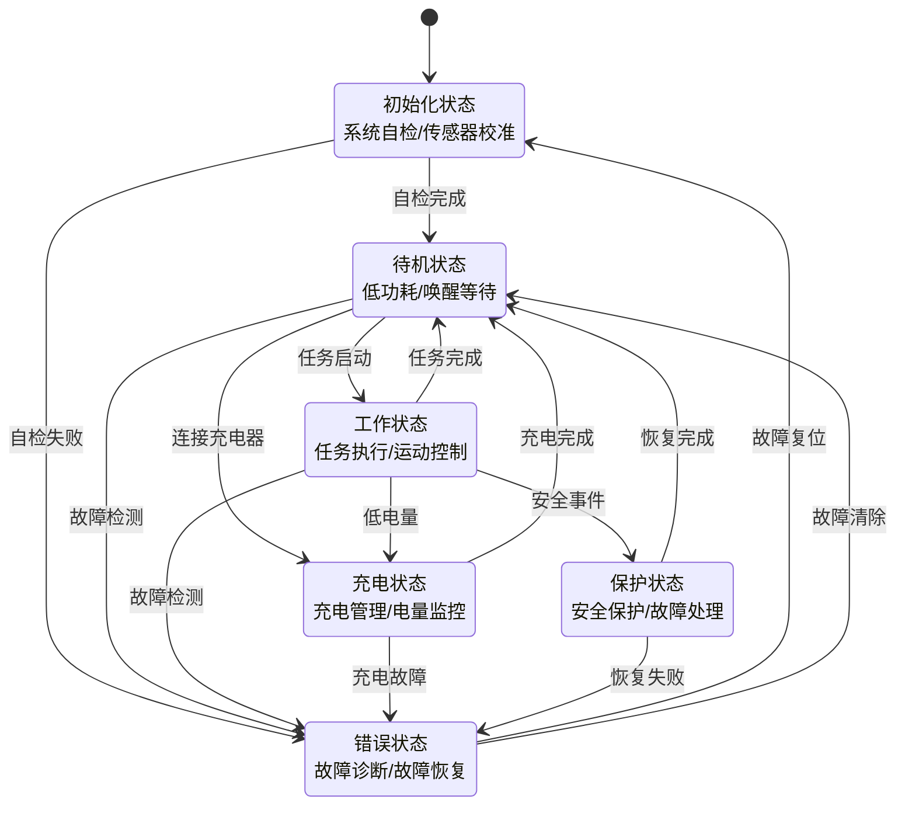
```mermaid
stateDiagram-v2
    [*] --> 初始化
    
    初始化 --> 待机: 自检完成
    初始化 --> 错误: 自检失败
    
    待机 --> 工作: 任务启动
    待机 --> 充电: 连接充电器
    待机 --> 错误: 故障检测
    
    工作 --> 待机: 任务完成
    工作 --> 充电: 低电量
    工作 --> 错误: 故障检测
    工作 --> 保护: 安全事件
    
    充电 --> 待机: 充电完成
    充电 --> 错误: 充电故障
    
    保护 --> 待机: 恢复完成
    保护 --> 错误: 恢复失败
    
    错误 --> 初始化: 故障复位
    错误 --> 待机: 故障清除
    
    初始化: 初始化状态<br/>系统自检/传感器校准
    待机: 待机状态<br/>低功耗/唤醒等待
    工作: 工作状态<br/>任务执行/运动控制
    充电: 充电状态<br/>充电管理/电量监控
    保护: 保护状态<br/>安全保护/故障处理
    错误: 错误状态<br/>故障诊断/故障恢复
```

**系统状态描述** [推理]

| 状态名称 | 状态描述 | 进入条件 | 退出条件 | 状态行为 |
|---------|---------|---------|---------|---------|
| 初始化 | 系统自检和初始化 | 系统上电 | 自检完成/失败 | 自检、校准、参数加载 |
| 待机 | 低功耗待机状态 | 自检完成/任务完成 | 任务启动/充电 | 低功耗、唤醒等待 |
| 工作 | 正常工作状态 | 任务启动 | 任务完成/低电量/故障 | 任务执行、运动控制 |
| 充电 | 电池充电状态 | 连接充电器/低电量 | 充电完成/故障 | 充电管理、电量监控 |
| 保护 | 安全保护状态 | 安全事件 | 恢复完成/失败 | 安全保护、故障处理 |
| 错误 | 故障处理状态 | 故障检测 | 故障清除/复位 | 故障诊断、故障恢复 |

#### A.2 运动状态定义

**运动状态机** [推理]

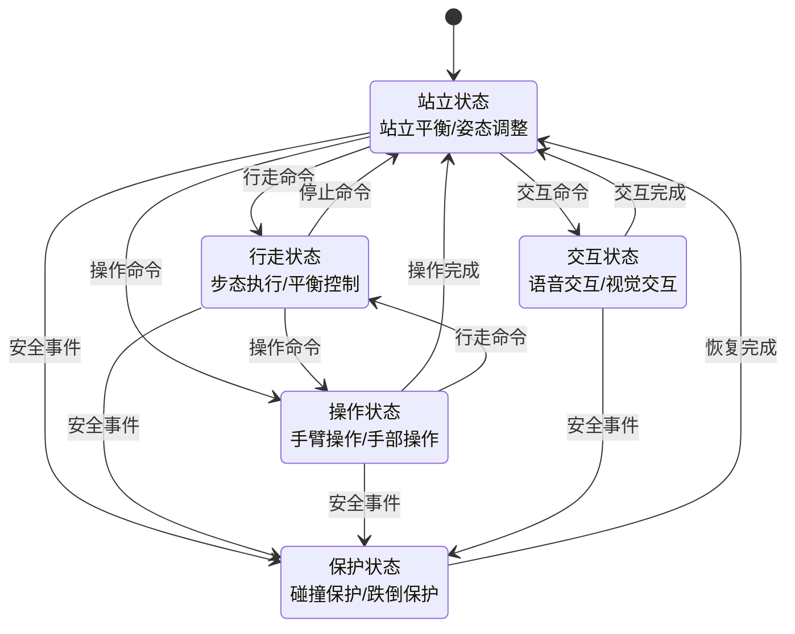
```mermaid
stateDiagram-v2
    [*] --> 站立
    
    站立 --> 行走: 行走命令
    站立 --> 操作: 操作命令
    站立 --> 交互: 交互命令
    站立 --> 保护: 安全事件
    
    行走 --> 站立: 停止命令
    行走 --> 操作: 操作命令
    行走 --> 保护: 安全事件
    
    操作 --> 站立: 操作完成
    操作 --> 行走: 行走命令
    操作 --> 保护: 安全事件
    
    交互 --> 站立: 交互完成
    交互 --> 保护: 安全事件
    
    保护 --> 站立: 恢复完成
    
    站立: 站立状态<br/>站立平衡/姿态调整
    行走: 行走状态<br/>步态执行/平衡控制
    操作: 操作状态<br/>手臂操作/手部操作
    交互: 交互状态<br/>语音交互/视觉交互
    保护: 保护状态<br/>碰撞保护/跌倒保护
```

**运动状态描述** [推理]

| 状态名称 | 状态描述 | 进入条件 | 退出条件 | 状态行为 |
|---------|---------|---------|---------|---------|
| 站立 | 站立平衡状态 | 系统就绪/停止命令 | 行走/操作/交互命令 | 站立平衡、姿态调整 |
| 行走 | 行走运动状态 | 行走命令 | 停止/操作命令 | 步态执行、平衡控制 |
| 操作 | 操作执行状态 | 操作命令 | 操作完成/行走命令 | 手臂操作、手部操作 |
| 交互 | 交互执行状态 | 交互命令 | 交互完成 | 语音交互、视觉交互 |
| 保护 | 安全保护状态 | 安全事件 | 恢复完成 | 碰撞保护、跌倒保护 |

#### A.3 安全状态定义

**安全状态机** [推理]

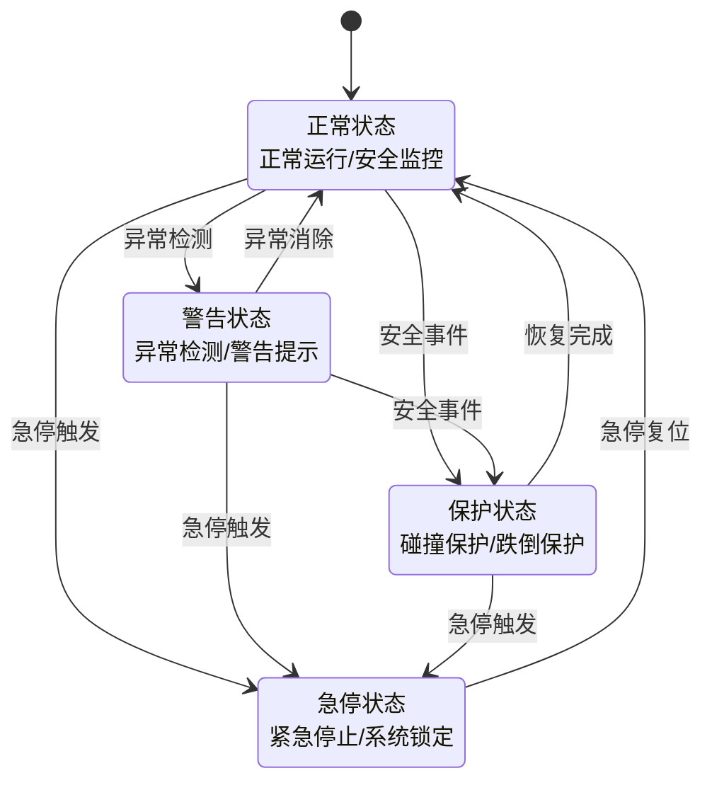
```mermaid
stateDiagram-v2
    [*] --> 正常
    
    正常 --> 警告: 异常检测
    正常 --> 保护: 安全事件
    正常 --> 急停: 急停触发
    
    警告 --> 正常: 异常消除
    警告 --> 保护: 安全事件
    警告 --> 急停: 急停触发
    
    保护 --> 正常: 恢复完成
    保护 --> 急停: 急停触发
    
    急停 --> 正常: 急停复位
    
    正常: 正常状态<br/>正常运行/安全监控
    警告: 警告状态<br/>异常检测/警告提示
    保护: 保护状态<br/>碰撞保护/跌倒保护
    急停: 急停状态<br/>紧急停止/系统锁定
```

**安全状态描述** [推理]

| 状态名称 | 状态描述 | 进入条件 | 退出条件 | 状态行为 |
|---------|---------|---------|---------|---------|
| 正常 | 正常运行状态 | 系统就绪/恢复完成 | 异常检测/安全事件 | 正常运行、安全监控 |
| 警告 | 警告提示状态 | 异常检测 | 异常消除/安全事件 | 警告提示、限制运行 |
| 保护 | 安全保护状态 | 安全事件 | 恢复完成 | 碰撞保护、跌倒保护 |
| 急停 | 紧急停止状态 | 急停触发 | 急停复位 | 紧急停止、系统锁定 |

### B. 异常处理逻辑（人形机器人专属）

#### B.1 传感器异常处理

**编码器异常处理** [推理]

| 异常类型 | 检测方式 | 响应动作 | 恢复方式 | 优先级 |
|---------|---------|---------|---------|--------|
| 信号丢失 | 通信超时检测 | 停止相关关节 | 检查连接/重启 | 高 |
| 数据异常 | 数据校验检测 | 停止相关关节 | 重新校准 | 高 |
| 零点漂移 | 位置偏差检测 | 校准零点 | 自动校准 | 中 |
| 温度过高 | 温度传感器检测 | 降功率运行 | 冷却等待 | 中 |

**IMU异常处理** [推理]

| 异常类型 | 检测方式 | 响应动作 | 恢复方式 | 优先级 |
|---------|---------|---------|---------|--------|
| 数据异常 | 数据校验检测 | 切换备用IMU | 重启IMU | 高 |
| 漂移过大 | 姿态偏差检测 | 重新校准 | 自动校准 | 中 |
| 温度过高 | 温度传感器检测 | 降采样率 | 冷却等待 | 中 |
| 通信故障 | 通信超时检测 | 切换备用IMU | 检查连接 | 高 |

**力传感器异常处理** [推理]

| 异常类型 | 检测方式 | 响应动作 | 恢复方式 | 优先级 |
|---------|---------|---------|---------|--------|
| 信号异常 | 数据校验检测 | 禁用力控 | 重新校准 | 中 |
| 零点漂移 | 零点偏差检测 | 自动校零 | 自动校准 | 低 |
| 过载检测 | 力值超限检测 | 限制输出 | 恢复正常负载 | 高 |
| 通信故障 | 通信超时检测 | 禁用力控 | 检查连接 | 高 |

**视觉传感器异常处理** [推理]

| 异常类型 | 检测方式 | 响应动作 | 恢复方式 | 优先级 |
|---------|---------|---------|---------|--------|
| 摄像头故障 | 设备状态检测 | 切换备用相机 | 重启摄像头 | 高 |
| 图像异常 | 图像质量检测 | 重新采集 | 重启采集 | 中 |
| 光照不足 | 光照检测 | 调整曝光 | 环境改善 | 低 |
| 数据传输故障 | 传输超时检测 | 重新连接 | 检查连接 | 中 |

#### B.2 执行器异常处理

**电机异常处理** [推理]

| 异常类型 | 检测方式 | 响应动作 | 恢复方式 | 优先级 |
|---------|---------|---------|---------|--------|
| 过热 | 温度传感器检测 | 降功率运行 | 冷却等待 | 高 |
| 过载 | 电流检测 | 限制输出 | 降低负载 | 高 |
| 堵转 | 电流/速度检测 | 停止电机 | 检查机械 | 最高 |
| 编码器故障 | 编码器检测 | 停止电机 | 更换编码器 | 最高 |

**驱动器异常处理** [推理]

| 异常类型 | 检测方式 | 响应动作 | 恢复方式 | 优先级 |
|---------|---------|---------|---------|--------|
| 过热 | 温度传感器检测 | 降功率运行 | 冷却等待 | 高 |
| 过流 | 电流检测 | 限制输出 | 检查电机 | 高 |
| 过压 | 电压检测 | 停止驱动 | 检查电源 | 高 |
| 欠压 | 电压检测 | 停止驱动 | 检查电池 | 高 |

**关节异常处理** [推理]

| 异常类型 | 检测方式 | 响应动作 | 恢复方式 | 优先级 |
|---------|---------|---------|---------|--------|
| 超限 | 位置检测 | 停止运动 | 位置复位 | 高 |
| 卡死 | 电流/位置检测 | 停止运动 | 检查机械 | 最高 |
| 异响 | 声音检测 | 降速运行 | 检查机械 | 中 |
| 振动 | 加速度检测 | 降速运行 | 检查机械 | 中 |

#### B.3 通信异常处理

**总线异常处理** [关联]

| 异常类型 | 检测方式 | 响应动作 | 恢复方式 | 优先级 |
|---------|---------|---------|---------|--------|
| 总线断开 | 通信超时检测 | 停止所有运动 | 检查连接 | 最高 |
| 总线错误 | 错误帧检测 | 重试通信 | 自动恢复 | 高 |
| 总线超时 | 超时检测 | 重试通信 | 自动恢复 | 高 |
| 数据错误 | CRC校验检测 | 重试通信 | 自动恢复 | 中 |

**网络异常处理** [推理]

| 异常类型 | 检测方式 | 响应动作 | 恢复方式 | 优先级 |
|---------|---------|---------|---------|--------|
| WiFi断开 | 连接状态检测 | 切换备用网络 | 自动重连 | 中 |
| 蓝牙断开 | 连接状态检测 | 重新配对 | 自动重连 | 低 |
| 网络延迟 | 延迟检测 | 降低数据率 | 网络恢复 | 低 |
| 数据丢失 | 序列号检测 | 重传数据 | 自动恢复 | 中 |

**云端异常处理** [推理]

| 异常类型 | 检测方式 | 响应动作 | 恢复方式 | 优先级 |
|---------|---------|---------|---------|--------|
| 服务器断开 | 连接状态检测 | 本地模式运行 | 自动重连 | 中 |
| 数据上传失败 | 上传状态检测 | 本地缓存 | 自动重试 | 低 |
| OTA失败 | 下载状态检测 | 保持原版本 | 手动更新 | 中 |
| 认证失败 | 认证状态检测 | 本地模式运行 | 重新认证 | 中 |

#### B.4 环境异常处理

**碰撞异常处理** [关联]

| 异常类型 | 检测方式 | 响应动作 | 恢复方式 | 优先级 |
|---------|---------|---------|---------|--------|
| 碰撞检测 | 力传感器检测 | 停止运动/避让 | 确认安全后恢复 | 最高 |
| 碰撞响应 | 力反馈检测 | 柔顺控制 | 自动恢复 | 高 |
| 碰撞定位 | 力分解计算 | 局部避让 | 自动恢复 | 高 |
| 碰撞记录 | 日志记录 | 记录事件 | - | 低 |

**跌倒异常处理** [推理]

| 异常类型 | 检测方式 | 响应动作 | 恢复方式 | 优先级 |
|---------|---------|---------|---------|--------|
| 跌倒检测 | IMU检测 | 保护动作 | 自主爬起 | 最高 |
| 跌倒保护 | 姿态检测 | 护头/护关节 | 检查损伤 | 最高 |
| 跌倒恢复 | 状态检测 | 自主爬起 | 手动辅助 | 高 |
| 跌倒记录 | 日志记录 | 记录事件 | - | 低 |

**地面异常处理** [推理]

| 异常类型 | 检测方式 | 响应动作 | 恢复方式 | 优先级 |
|---------|---------|---------|---------|--------|
| 地面不平 | 视觉/力觉检测 | 调整步态 | 通过后恢复 | 中 |
| 地面打滑 | 力传感器检测 | 调整步态 | 恢复抓地 | 高 |
| 地面障碍 | 视觉检测 | 避障规划 | 通过后恢复 | 中 |
| 地面倾斜 | IMU检测 | 调整姿态 | 通过后恢复 | 中 |

### C. UI状态图

#### C.1 App主界面状态

**App界面状态机** [推理]

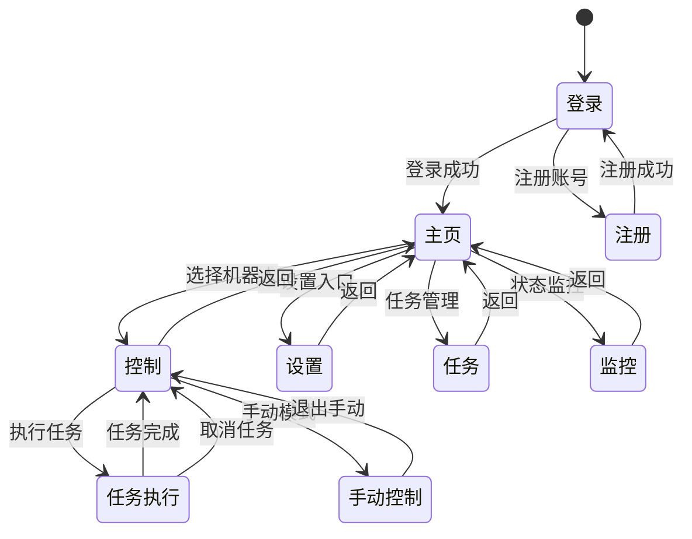
```mermaid
stateDiagram-v2
    [*] --> 登录
    
    登录 --> 主页: 登录成功
    登录 --> 注册: 注册账号
    注册 --> 登录: 注册成功
    
    主页 --> 控制: 选择机器人
    主页 --> 设置: 设置入口
    主页 --> 任务: 任务管理
    主页 --> 监控: 状态监控
    
    控制 --> 主页: 返回
    控制 --> 任务执行: 执行任务
    控制 --> 手动控制: 手动模式
    
    任务执行 --> 控制: 任务完成
    任务执行 --> 控制: 取消任务
    
    手动控制 --> 控制: 退出手动
    
    设置 --> 主页: 返回
    任务 --> 主页: 返回
    监控 --> 主页: 返回
```

#### C.2 机器人控制面板

**控制面板布局** [推理]

```
┌─────────────────────────────────────────────────────────────────┐
│                        Walker S1 控制面板                         │
├─────────────────────────────────────────────────────────────────┤
│ ┌─────────────────────────────────────────────────────────────┐ │
│ │                     状态显示区域                              │ │
│ │  ┌─────────┐  ┌─────────┐  ┌─────────┐  ┌─────────┐        │ │
│ │  │ 电量    │  │ 温度    │  │ 状态    │  │ 网络    │        │ │
│ │  │ 85%     │  │ 42°C    │  │ 工作    │  │ 良好    │        │ │
│ │  │ ████████│  │ ████    │  │ ●绿色   │  │ ●绿色   │        │ │
│ │  └─────────┘  └─────────┘  └─────────┘  └─────────┘        │ │
│ └─────────────────────────────────────────────────────────────┘ │
│ ┌─────────────────────────────────────────────────────────────┐ │
│ │                     运动控制区域                              │ │
│ │  ┌──────────────────┐  ┌──────────────────┐                │ │
│ │  │     前进         │  │     后退         │                │ │
│ │  │      ▲          │  │      ▼          │                │ │
│ │  └──────────────────┘  └──────────────────┘                │ │
│ │  ┌─────────┐  ┌─────────┐  ┌─────────┐                    │ │
│ │  │ 左转    │  │ 停止    │  │ 右转    │                    │ │
│ │  │  ◄     │  │   ■    │  │     ►   │                    │ │
│ │  └─────────┘  └─────────┘  └─────────┘                    │ │
│ └─────────────────────────────────────────────────────────────┘ │
│ ┌─────────────────────────────────────────────────────────────┐ │
│ │                     任务控制区域                              │ │
│ │  ┌────────────┐  ┌────────────┐  ┌────────────┐            │ │
│ │  │ 任务列表   │  │ 开始任务   │  │ 停止任务   │            │ │
│ │  └────────────┘  └────────────┘  └────────────┘            │ │
│ └─────────────────────────────────────────────────────────────┘ │
│ ┌─────────────────────────────────────────────────────────────┐ │
│ │                     安全控制区域                              │ │
│ │  ┌────────────────────────────────────────────────────┐    │ │
│ │  │                    急停按钮                         │    │ │
│ │  │                      ⛔                            │    │ │
│ │  └────────────────────────────────────────────────────┘    │ │
│ └─────────────────────────────────────────────────────────────┘ │
└─────────────────────────────────────────────────────────────────┘
```

**控制面板功能说明** [推理]

| 区域名称 | 功能描述 | 交互方式 | 更新频率 |
|---------|---------|---------|---------|
| 状态显示区域 | 显示机器人状态信息 | 自动更新 | 1Hz |
| 运动控制区域 | 控制机器人运动 | 触摸/按键 | 实时 |
| 任务控制区域 | 管理任务执行 | 触摸选择 | 事件触发 |
| 安全控制区域 | 急停和安全控制 | 触摸/按键 | 事件触发 |

#### C.3 状态监控界面

**监控界面布局** [推理]

```
┌─────────────────────────────────────────────────────────────────┐
│                        Walker S1 状态监控                         │
├─────────────────────────────────────────────────────────────────┤
│ ┌─────────────────────────────────────────────────────────────┐ │
│ │                     关节状态区域                              │ │
│ │  ┌──────────────────────────────────────────────────────┐  │ │
│ │  │ 关节ID │ 角度(°) │ 速度(°/s) │ 扭矩(N·m) │ 温度(°C) │  │ │
│ │  ├──────────────────────────────────────────────────────┤  │ │
│ │  │ 左髋1  │  15.2   │   12.5    │   45.3    │   42.1   │  │ │
│ │  │ 左髋2  │  -5.3   │    8.2    │   32.1    │   41.5   │  │ │
│ │  │ 左髋3  │   2.1   │    5.6    │   18.7    │   40.8   │  │ │
│ │  │ ...    │  ...    │   ...     │   ...     │   ...    │  │ │
│ │  └──────────────────────────────────────────────────────┘  │ │
│ └─────────────────────────────────────────────────────────────┘ │
│ ┌─────────────────────────────────────────────────────────────┐ │
│ │                     传感器数据区域                            │ │
│ │  ┌───────────────────────────────────────────────────────┐ │ │
│ │  │ IMU:  Roll=2.1° Pitch=-1.5° Yaw=45.2°                │ │ │
│ │  │ 加速度: X=0.02g Y=-0.01g Z=1.00g                      │ │ │
│ │  │ 角速度: X=0.5°/s Y=-0.3°/s Z=2.1°/s                   │ │ │
│ │  └───────────────────────────────────────────────────────┘ │ │
│ │  ┌───────────────────────────────────────────────────────┐ │ │
│ │  │ 六维力(左手): Fx=1.2N Fy=-0.5N Fz=15.3N              │ │ │
│ │  │             Mx=0.2N·m My=-0.1N·m Mz=0.3N·m           │ │ │
│ │  └───────────────────────────────────────────────────────┘ │ │
│ └─────────────────────────────────────────────────────────────┘ │
│ ┌─────────────────────────────────────────────────────────────┐ │
│ │                     系统状态区域                              │ │
│ │  ┌───────────────────────────────────────────────────────┐ │ │
│ │  │ CPU: 45% │ 内存: 62% │ GPU: 55% │ 温度: 58°C          │ │ │
│ │  │ 电池: 85% │ 电压: 52.3V │ 电流: 8.5A │ 功率: 444W     │ │ │
│ │  │ 网络: WiFi-5G │ 延迟: 15ms │ 丢包: 0%                 │ │ │
│ │  └───────────────────────────────────────────────────────┘ │ │
│ └─────────────────────────────────────────────────────────────┘ │
└─────────────────────────────────────────────────────────────────┘
```

**监控界面数据说明** [推理]

| 数据类型 | 数据内容 | 更新频率 | 显示格式 |
|---------|---------|---------|---------|
| 关节状态 | 角度/速度/扭矩/温度 | 100Hz | 数值+图表 |
| IMU数据 | 姿态/加速度/角速度 | 100Hz | 数值+图表 |
| 六维力数据 | 力/力矩 | 100Hz | 数值+图表 |
| 系统状态 | CPU/内存/电池/网络 | 1Hz | 数值+进度条 |

---

## IV. 软件逻辑流程图

### A. 系统启动流程

**系统启动流程图** [推理]

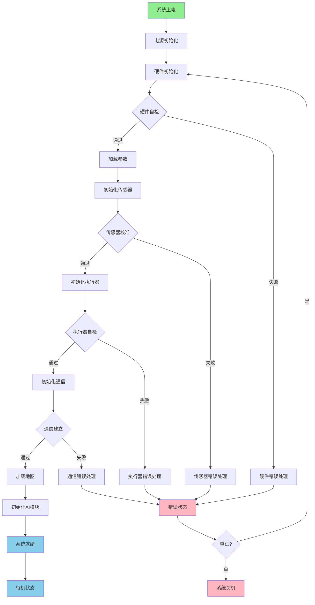
```mermaid
flowchart TD
    Start[系统上电] --> PowerOn[电源初始化]
    PowerOn --> HWInit[硬件初始化]
    HWInit --> CheckHW{硬件自检}
    
    CheckHW -->|通过| LoadParam[加载参数]
    CheckHW -->|失败| HWError[硬件错误处理]
    
    LoadParam --> InitSensor[初始化传感器]
    InitSensor --> CheckSensor{传感器校准}
    
    CheckSensor -->|通过| InitMotor[初始化执行器]
    CheckSensor -->|失败| SensorError[传感器错误处理]
    
    InitMotor --> CheckMotor{执行器自检}
    
    CheckMotor -->|通过| InitComm[初始化通信]
    CheckMotor -->|失败| MotorError[执行器错误处理]
    
    InitComm --> CheckComm{通信建立}
    
    CheckComm -->|通过| LoadMap[加载地图]
    CheckComm -->|失败| CommError[通信错误处理]
    
    LoadMap --> InitAI[初始化AI模块]
    InitAI --> Ready[系统就绪]
    
    HWError --> ErrorState[错误状态]
    SensorError --> ErrorState
    MotorError --> ErrorState
    CommError --> ErrorState
    
    ErrorState --> Retry{重试?}
    Retry -->|是| HWInit
    Retry -->|否| Shutdown[系统关机]
    
    Ready --> Standby[待机状态]
    
    style Start fill:#90EE90
    style Ready fill:#87CEEB
    style Standby fill:#87CEEB
    style ErrorState fill:#FFB6C1
    style Shutdown fill:#FFB6C1
```

### B. 任务执行流程

**任务执行流程图** [关联]

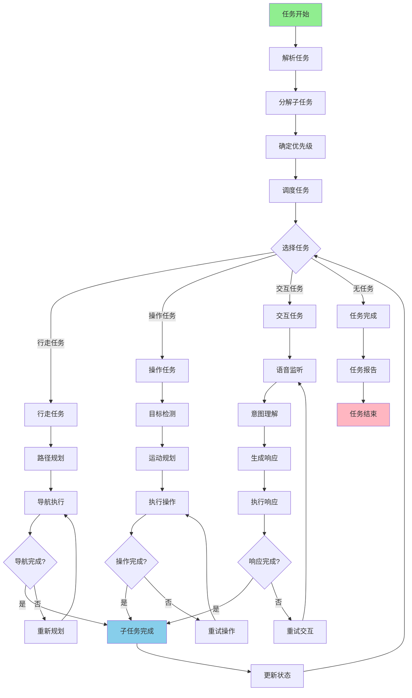
```mermaid
flowchart TD
    Start[任务开始] --> ParseTask[解析任务]
    ParseTask --> Decompose[分解子任务]
    Decompose --> Prioritize[确定优先级]
    Prioritize --> Schedule[调度任务]
    
    Schedule --> SelectTask{选择任务}
    SelectTask -->|行走任务| WalkTask[行走任务]
    SelectTask -->|操作任务| ManipTask[操作任务]
    SelectTask -->|交互任务| InteractTask[交互任务]
    SelectTask -->|无任务| Complete[任务完成]
    
    WalkTask --> PlanPath[路径规划]
    PlanPath --> Navigate[导航执行]
    Navigate --> CheckNav{导航完成?}
    CheckNav -->|是| TaskDone[子任务完成]
    CheckNav -->|否| Replan[重新规划]
    Replan --> Navigate
    
    ManipTask --> Detect[目标检测]
    Detect --> PlanMotion[运动规划]
    PlanMotion --> Execute[执行操作]
    Execute --> CheckExec{操作完成?}
    CheckExec -->|是| TaskDone
    CheckExec -->|否| Retry[重试操作]
    Retry --> Execute
    
    InteractTask --> Listen[语音监听]
    Listen --> Understand[意图理解]
    Understand --> Generate[生成响应]
    Generate --> Respond[执行响应]
    Respond --> CheckResp{响应完成?}
    CheckResp -->|是| TaskDone
    CheckResp -->|否| RetryInteract[重试交互]
    RetryInteract --> Listen
    
    TaskDone --> UpdateStatus[更新状态]
    UpdateStatus --> SelectTask
    
    Complete --> Report[任务报告]
    Report --> End[任务结束]
    
    style Start fill:#90EE90
    style End fill:#FFB6C1
    style TaskDone fill:#87CEEB
```

### C. 安全响应流程

**安全响应流程图** [推理]

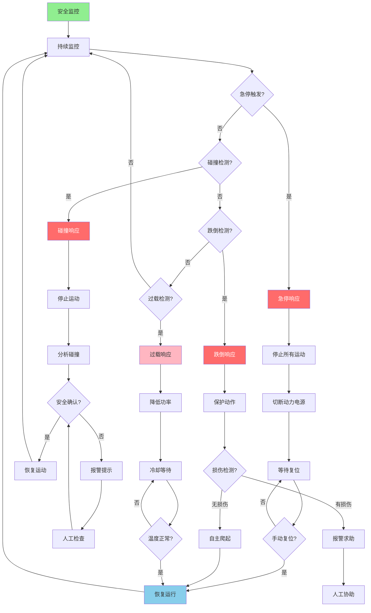
```mermaid
flowchart TD
    Start[安全监控] --> Monitor[持续监控]
    
    Monitor --> CheckEstop{急停触发?}
    CheckEstop -->|是| Estop[急停响应]
    CheckEstop -->|否| CheckCollision{碰撞检测?}
    
    Estop --> StopAll[停止所有运动]
    StopAll --> CutPower[切断动力电源]
    CutPower --> WaitReset[等待复位]
    WaitReset --> ManualReset{手动复位?}
    ManualReset -->|是| Resume[恢复运行]
    ManualReset -->|否| WaitReset
    
    CheckCollision -->|是| Collision[碰撞响应]
    CheckCollision -->|否| CheckFall{跌倒检测?}
    
    Collision --> StopMotion[停止运动]
    StopMotion --> Analyze[分析碰撞]
    Analyze --> Safe{安全确认?}
    Safe -->|是| Recover[恢复运动]
    Safe -->|否| Alert[报警提示]
    Alert --> ManualCheck[人工检查]
    ManualCheck --> Safe
    
    CheckFall -->|是| Fall[跌倒响应]
    CheckFall -->|否| CheckOverload{过载检测?}
    
    Fall --> Protect[保护动作]
    Protect --> CheckDamage{损伤检测?}
    CheckDamage -->|无损伤| Standup[自主爬起]
    CheckDamage -->|有损伤| AlertHelp[报警求助]
    Standup --> Resume
    AlertHelp --> ManualHelp[人工协助]
    
    CheckOverload -->|是| Overload[过载响应]
    CheckOverload -->|否| Monitor
    
    Overload --> ReducePower[降低功率]
    ReducePower --> CoolDown[冷却等待]
    CoolDown --> CheckTemp{温度正常?}
    CheckTemp -->|是| Resume
    CheckTemp -->|否| CoolDown
    
    Recover --> Monitor
    Resume --> Monitor
    
    style Start fill:#90EE90
    style Estop fill:#FF6B6B,color:#fff
    style Collision fill:#FF6B6B,color:#fff
    style Fall fill:#FF6B6B,color:#fff
    style Overload fill:#FFB6C1
    style Resume fill:#87CEEB
```

### D. 配网流程

**配网流程图** [推理]

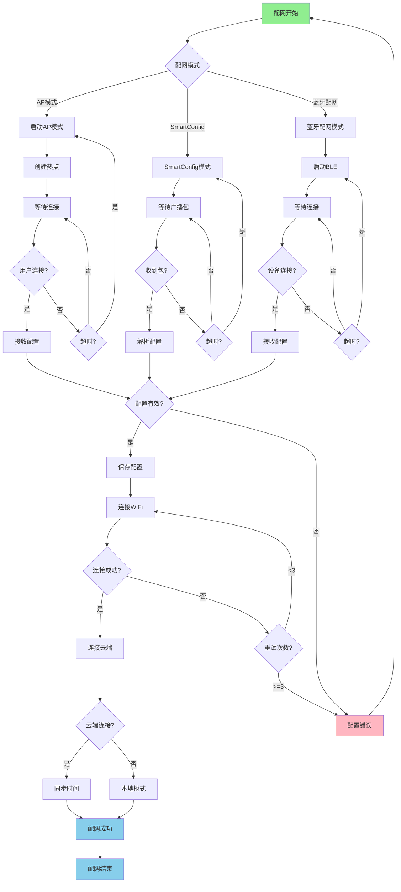
```mermaid
flowchart TD
    Start[配网开始] --> CheckMode{配网模式}
    
    CheckMode -->|AP模式| APMode[启动AP模式]
    CheckMode -->|SmartConfig| SmartConfig[SmartConfig模式]
    CheckMode -->|蓝牙配网| BLEConfig[蓝牙配网模式]
    
    APMode --> CreateAP[创建热点]
    CreateAP --> WaitConnect[等待连接]
    WaitConnect --> UserConnect{用户连接?}
    UserConnect -->|是| ReceiveConfig[接收配置]
    UserConnect -->|否| Timeout{超时?}
    Timeout -->|是| APMode
    Timeout -->|否| WaitConnect
    
    SmartConfig --> WaitPacket[等待广播包]
    WaitPacket --> ReceivePacket{收到包?}
    ReceivePacket -->|是| ParseConfig[解析配置]
    ReceivePacket -->|否| Timeout2{超时?}
    Timeout2 -->|是| SmartConfig
    Timeout2 -->|否| WaitPacket
    
    BLEConfig --> StartBLE[启动BLE]
    StartBLE --> WaitBLEConnect[等待连接]
    WaitBLEConnect --> BLEConnect{设备连接?}
    BLEConnect -->|是| ReceiveBLEConfig[接收配置]
    BLEConnect -->|否| Timeout3{超时?}
    Timeout3 -->|是| StartBLE
    Timeout3 -->|否| WaitBLEConnect
    
    ReceiveConfig --> ValidateConfig{配置有效?}
    ParseConfig --> ValidateConfig
    ReceiveBLEConfig --> ValidateConfig
    
    ValidateConfig -->|是| SaveConfig[保存配置]
    ValidateConfig -->|否| ConfigError[配置错误]
    ConfigError --> Start
    
    SaveConfig --> ConnectWiFi[连接WiFi]
    ConnectWiFi --> CheckConnect{连接成功?}
    CheckConnect -->|是| ConnectCloud[连接云端]
    CheckConnect -->|否| RetryCount{重试次数?}
    RetryCount -->|<3| ConnectWiFi
    RetryCount -->|>=3| ConfigError
    
    ConnectCloud --> CheckCloud{云端连接?}
    CheckCloud -->|是| SyncTime[同步时间]
    CheckCloud -->|否| LocalMode[本地模式]
    
    SyncTime --> Success[配网成功]
    LocalMode --> Success
    
    Success --> End[配网结束]
    
    style Start fill:#90EE90
    style End fill:#87CEEB
    style Success fill:#87CEEB
    style ConfigError fill:#FFB6C1
```

---

## V. 数据流与通信设计

### A. 内部数据流

**运动控制数据流** [关联]

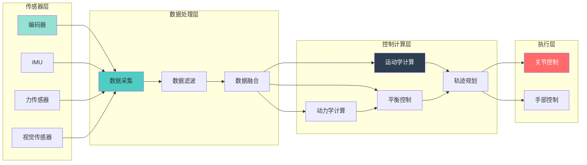
```mermaid
flowchart LR
    subgraph 传感器层
        S1[编码器]
        S2[IMU]
        S3[力传感器]
        S4[视觉传感器]
    end
    
    subgraph 数据处理层
        D1[数据采集]
        D2[数据滤波]
        D3[数据融合]
    end
    
    subgraph 控制计算层
        C1[运动学计算]
        C2[动力学计算]
        C3[平衡控制]
        C4[轨迹规划]
    end
    
    subgraph 执行层
        E1[关节控制]
        E2[手部控制]
    end
    
    S1 --> D1
    S2 --> D1
    S3 --> D1
    S4 --> D1
    
    D1 --> D2
    D2 --> D3
    
    D3 --> C1
    D3 --> C2
    D3 --> C3
    
    C1 --> C4
    C2 --> C3
    C3 --> C4
    
    C4 --> E1
    C4 --> E2
    
    style S1 fill:#95E1D3
    style D1 fill:#4ECDC4
    style C1 fill:#2C3E50,color:#fff
    style E1 fill:#FF6B6B,color:#fff
```

**感知导航数据流** [关联]

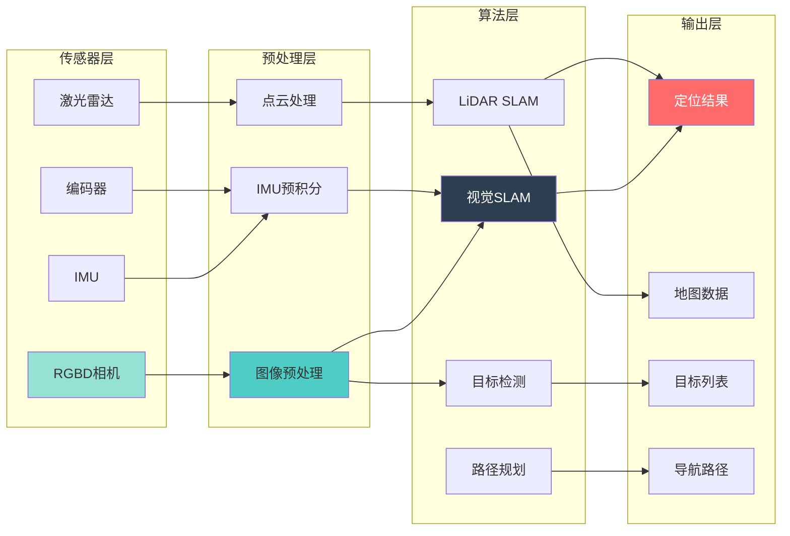
```mermaid
flowchart LR
    subgraph 传感器层
        S1[RGBD相机]
        S2[激光雷达]
        S3[IMU]
        S4[编码器]
    end
    
    subgraph 预处理层
        P1[图像预处理]
        P2[点云处理]
        P3[IMU预积分]
    end
    
    subgraph 算法层
        A1[视觉SLAM]
        A2[LiDAR SLAM]
        A3[目标检测]
        A4[路径规划]
    end
    
    subgraph 输出层
        O1[定位结果]
        O2[地图数据]
        O3[目标列表]
        O4[导航路径]
    end
    
    S1 --> P1
    S2 --> P2
    S3 --> P3
    S4 --> P3
    
    P1 --> A1
    P1 --> A3
    P2 --> A2
    P3 --> A1
    
    A1 --> O1
    A2 --> O1
    A2 --> O2
    A3 --> O3
    A4 --> O4
    
    style S1 fill:#95E1D3
    style P1 fill:#4ECDC4
    style A1 fill:#2C3E50,color:#fff
    style O1 fill:#FF6B6B,color:#fff
```

### B. 外部通信协议

**ROS通信协议** [推理]

| 通信类型 | 话题/服务名称 | 消息类型 | 发布频率 | 数据内容 |
|---------|-------------|---------|---------|---------|
| 话题 | /joint_states | sensor_msgs/JointState | 1kHz | 关节状态 |
| 话题 | /odom | nav_msgs/Odometry | 100Hz | 里程计 |
| 话题 | /imu_data | sensor_msgs/Imu | 1kHz | IMU数据 |
| 话题 | /point_cloud | sensor_msgs/PointCloud2 | 20Hz | 点云数据 |
| 话题 | /image | sensor_msgs/Image | 30Hz | 图像数据 |
| 话题 | /cmd_vel | geometry_msgs/Twist | 100Hz | 速度命令 |
| 服务 | /enable_motors | std_srvs/SetBool | 按需 | 使能电机 |
| 服务 | /reset_odometry | std_srvs/Empty | 按需 | 重置里程计 |
| 服务 | /get_robot_state | 自定义 | 按需 | 获取状态 |

**API接口定义** [推理]

| API名称 | 请求方法 | 请求参数 | 响应数据 | 功能描述 |
|---------|---------|---------|---------|---------|
| /api/v1/robot/status | GET | - | 状态JSON | 获取机器人状态 |
| /api/v1/robot/control | POST | 控制命令 | 执行结果 | 控制机器人运动 |
| /api/v1/task/start | POST | 任务参数 | 任务ID | 启动任务 |
| /api/v1/task/stop | POST | 任务ID | 执行结果 | 停止任务 |
| /api/v1/map/save | POST | 地图名称 | 执行结果 | 保存地图 |
| /api/v1/map/load | POST | 地图名称 | 地图数据 | 加载地图 |
| /api/v1/sensor/data | GET | 传感器类型 | 传感器数据 | 获取传感器数据 |

---

## VI. 需求确认检查清单

### 软件架构确认

- [x] 系统分层架构是否完整？(操作系统、任务优先级、多核分配)
- [x] 运动控制软件架构是否完整？(控制层级、实时性、软件模块)
- [x] 感知导航软件架构是否完整？(感知层级、实时性、软件模块)
- [x] 智能交互软件架构是否完整？(交互层级、实时性、软件模块)
- [x] 决策规划软件架构是否完整？(决策层级、实时性、软件模块)
- [x] 安全监控软件架构是否完整？(安全层级、实时性、软件模块)

### 功能模块确认

- [x] 运动控制功能是否完整？(关节控制、运动规划、平衡控制)
- [x] 感知导航功能是否完整？(定位、建图、导航)
- [x] 智能交互功能是否完整？(语音交互、视觉交互、触觉交互)
- [x] 决策规划功能是否完整？(任务规划、行为规划)
- [x] 安全监控功能是否完整？(碰撞检测、跌倒检测、安全保护)

### 状态机确认

- [x] 系统状态机是否完整？(初始化、待机、工作、充电、保护、错误)
- [x] 运动状态机是否完整？(站立、行走、操作、交互、保护)
- [x] 安全状态机是否完整？(正常、警告、保护、急停)
- [x] 异常处理逻辑是否完整？(传感器、执行器、通信、环境异常)

### 流程图确认

- [x] 系统启动流程图是否提供？(Mermaid图)
- [x] 任务执行流程图是否提供？(Mermaid图)
- [x] 安全响应流程图是否提供？(Mermaid图)
- [x] 配网流程图是否提供？(Mermaid图)

### 数据流确认

- [x] 内部数据流是否完整？(运动控制、感知导航)
- [x] 外部通信协议是否完整？(ROS、API)

### UI设计确认

- [x] 控制面板布局是否提供？(ASCII图)
- [x] 监控界面布局是否提供？(ASCII图)
- [x] App界面状态机是否提供？(Mermaid图)

---

## VII. 文档修订记录

| 版本 | 日期 | 修订内容 | 修订人 |
|------|------|---------|--------|
| V1.0 | 2024年 | 初始版本，基于调研报告、PRD和ICD生成 | 软件团队 |

---

**文档说明**:
- 本文档基于《优必选Walker S1调研报告》、《01产品需求文档-PRD》和《05接口控制文档-ICD》生成
- 标注[事实]的内容直接引用自调研报告，严禁修改
- 标注[关联]的内容基于报告中A信息推导出的B逻辑
- 标注[推理]的内容为调研缺失，基于行业主流软件设计逻辑补全
- 本文档作为软件开发的基准需求文档，后续变更需经过评审流程
- 软件定义的变量与操作指令与《接口控制文档》中的寄存器一一对应
