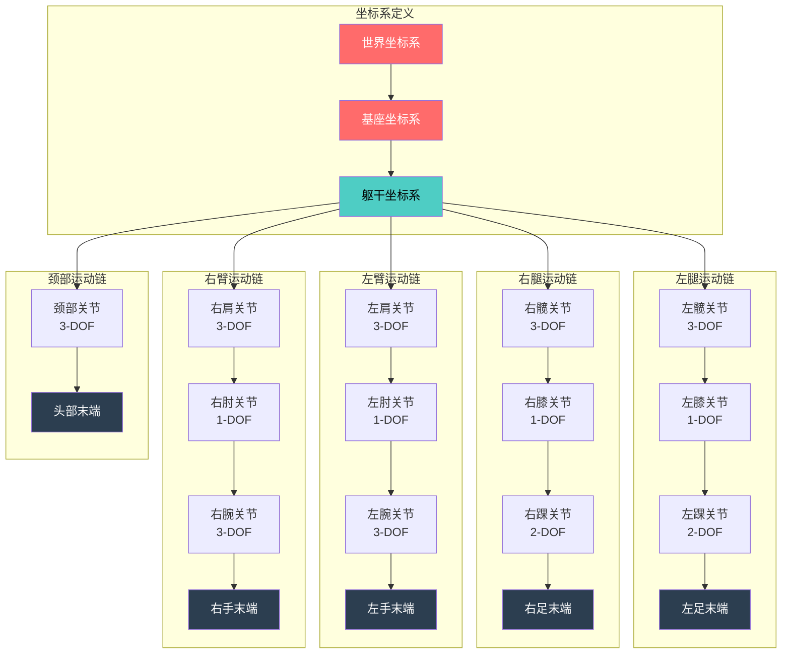
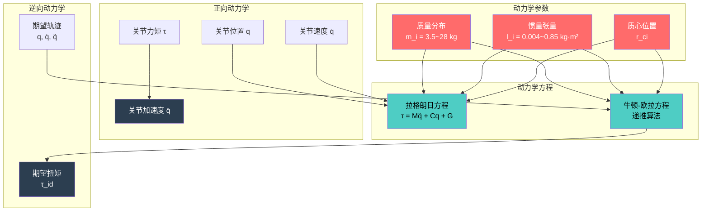
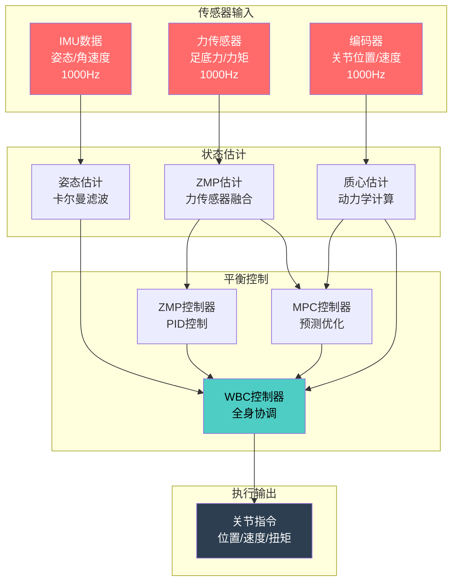
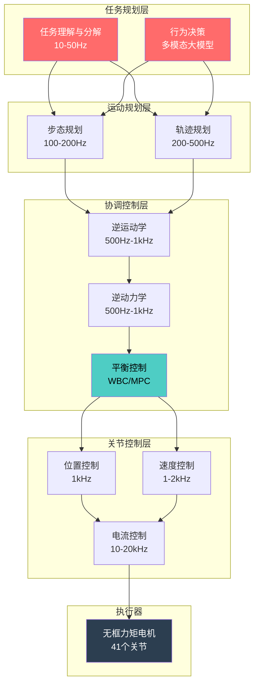

# 优必选 Walker S1 工业人形机器人运动控制与规划文档 (MCP)

## 文档信息

- **产品名称**: Walker S1 工业人形机器人
- **产品型号**: Walker S1
- **文档版本**: V1.0
- **编制日期**: 2024年
- **产品定位**: 高端工业级人形机器人

---

## I. 运动学建模 (Kinematics Modeling)

### A. DH参数定义

#### A.1 坐标系定义

**基坐标系定义** [事实]

| 坐标系 | 定义位置 | 坐标轴方向 | 说明 |
|--------|---------|-----------|------|
| 世界坐标系 | 地面固定点 | X:前进方向, Y:左侧, Z:垂直向上 | 全局参考 |
| 基座坐标系 | 骨盆中心 | X:前进方向, Y:左侧, Z:垂直向上 | 机器人本体参考 |
| 躯干坐标系 | 躯干质心 | X:前进方向, Y:左侧, Z:垂直向上 | 上半身参考 |

**关节坐标系定义** [推理]

| 部位 | 关节坐标系 | 原点位置 | 说明 |
|------|-----------|---------|------|
| 髋关节 | 髋关节中心 | 股骨头位置 | 大腿运动起点 |
| 膝关节 | 膝关节中心 | 股骨髁位置 | 小腿运动起点 |
| 踝关节 | 踝关节中心 | 胫骨下端 | 足部运动起点 |
| 肩关节 | 肩关节中心 | 肱骨头位置 | 手臂运动起点 |
| 肘关节 | 肘关节中心 | 肱骨髁位置 | 前臂运动起点 |
| 腕关节 | 腕关节中心 | 桡尺骨远端 | 手部运动起点 |

**末端坐标系定义** [推理]

| 末端 | 坐标系位置 | 功能描述 |
|------|-----------|---------|
| 左足末端 | 左脚底中心 | 步态规划末端 |
| 右足末端 | 右脚底中心 | 步态规划末端 |
| 左手末端 | 左手掌心 | 操作规划末端 |
| 右手末端 | 右手掌心 | 操作规划末端 |

#### A.2 DH参数表

**左腿DH参数** [关联]

| 关节 | a (mm) | α (°) | d (mm) | θ (°) | 关节范围 |
|------|--------|-------|--------|-------|---------|
| 髋屈曲 | 0 | -90 | 0 | θ1 | -30~+120 |
| 髋外展 | 0 | 90 | 0 | θ2 | -30~+45 |
| 髋旋转 | 0 | 90 | 0 | θ3 | -45~+45 |
| 膝关节 | 350 | 0 | 0 | θ4 | 0~+140 |
| 踝背屈 | 0 | -90 | 400 | θ5 | -40~+30 |
| 踝内翻 | 0 | 90 | 0 | θ6 | -20~+20 |

**右腿DH参数** [关联]

| 关节 | a (mm) | α (°) | d (mm) | θ (°) | 关节范围 |
|------|--------|-------|--------|-------|---------|
| 髋屈曲 | 0 | -90 | 0 | θ1 | -30~+120 |
| 髋外展 | 0 | 90 | 0 | θ2 | -30~+45 |
| 髋旋转 | 0 | 90 | 0 | θ3 | -45~+45 |
| 膝关节 | 350 | 0 | 0 | θ4 | 0~+140 |
| 踝背屈 | 0 | -90 | 400 | θ5 | -40~+30 |
| 踝内翻 | 0 | 90 | 0 | θ6 | -20~+20 |

**左臂DH参数** [关联]

| 关节 | a (mm) | α (°) | d (mm) | θ (°) | 关节范围 |
|------|--------|-------|--------|-------|---------|
| 肩屈曲 | 0 | -90 | 0 | θ1 | -45~+180 |
| 肩外展 | 0 | 90 | 0 | θ2 | -30~+180 |
| 肩旋转 | 0 | 90 | 0 | θ3 | -90~+90 |
| 肘关节 | 0 | 0 | 300 | θ4 | 0~+145 |
| 腕屈曲 | 0 | -90 | 0 | θ5 | -70~+80 |
| 腕桡偏 | 0 | 90 | 250 | θ6 | -25~+25 |
| 腕旋转 | 0 | 0 | 0 | θ7 | -90~+90 |

**右臂DH参数** [关联]

| 关节 | a (mm) | α (°) | d (mm) | θ (°) | 关节范围 |
|------|--------|-------|--------|-------|---------|
| 肩屈曲 | 0 | -90 | 0 | θ1 | -45~+180 |
| 肩外展 | 0 | 90 | 0 | θ2 | -30~+180 |
| 肩旋转 | 0 | 90 | 0 | θ3 | -90~+90 |
| 肘关节 | 0 | 0 | 300 | θ4 | 0~+145 |
| 腕屈曲 | 0 | -90 | 0 | θ5 | -70~+80 |
| 腕桡偏 | 0 | 90 | 250 | θ6 | -25~+25 |
| 腕旋转 | 0 | 0 | 0 | θ7 | -90~+90 |

**颈部DH参数** [关联]

| 关节 | a (mm) | α (°) | d (mm) | θ (°) | 关节范围 |
|------|--------|-------|--------|-------|---------|
| 颈俯仰 | 0 | 0 | 0 | θ1 | -45~+45 |
| 颈偏航 | 0 | 90 | 100 | θ2 | -60~+60 |
| 颈侧倾 | 0 | 90 | 0 | θ3 | -30~+30 |

### B. 正运动学 (Forward Kinematics)

#### B.1 正运动学方程

**正运动学计算方法** [事实]

Walker S1的运动学建模采用基于Denavit-Hartenberg（D-H）参数的连杆坐标系方法，建立了41个自由度的多连杆运动学模型。运动学模型能够精确计算机器人末端执行器在空间中的位置和姿态。

**正运动学变换矩阵** [推理]

```
齐次变换矩阵 T_i^(i-1):
        ┌ cos(θ)    -sin(θ)cos(α)   sin(θ)sin(α)    a·cos(θ) ┐
T =     │ sin(θ)     cos(θ)cos(α)  -cos(θ)sin(α)    a·sin(θ) │
        │   0          sin(α)          cos(α)           d     │
        └   0            0               0              1     ┘

末端位姿 = T_0^n = T_0^1 · T_1^2 · ... · T_(n-1)^n
```

**腿部正运动学** [推理]

从髋关节到足端的变换：

```
T_hip_to_foot = T_hip_flex · T_hip_abd · T_hip_rot · T_knee · T_ankle_flex · T_ankle_inv

足端位置:
P_foot = [x, y, z]^T = T_hip_to_foot · [0, 0, 0, 1]^T

足端姿态:
R_foot = T_hip_to_foot(1:3, 1:3)
```

**手臂正运动学** [推理]

从肩关节到手端的变换：

```
T_shoulder_to_hand = T_shoulder_flex · T_shoulder_abd · T_shoulder_rot · T_elbow · T_wrist_flex · T_wrist_rad · T_wrist_rot

手端位置:
P_hand = [x, y, z]^T = T_shoulder_to_hand · [0, 0, 0, 1]^T

手端姿态:
R_hand = T_shoulder_to_hand(1:3, 1:3)
```

#### B.2 雅可比矩阵

**腿部雅可比矩阵** [推理]

足端速度与关节速度的关系：

```
v_foot = J_leg · q̇_leg

其中:
v_foot = [ẋ, ẏ, ż, ωx, ωy, ωz]^T (6维速度向量)
q̇_leg = [θ̇1, θ̇2, θ̇3, θ̇4, θ̇5, θ̇6]^T (6维关节速度)
J_leg = 6×6 雅可比矩阵

雅可比矩阵计算:
J = [J_v; J_ω]
J_v(i) = z_(i-1) × (p_n - p_(i-1))  (线速度部分)
J_ω(i) = z_(i-1)                      (角速度部分)
```

**手臂雅可比矩阵** [推理]

手端速度与关节速度的关系：

```
v_hand = J_arm · q̇_arm

其中:
v_hand = [ẋ, ẏ, ż, ωx, ωy, ωz]^T (6维速度向量)
q̇_arm = [θ̇1, θ̇2, θ̇3, θ̇4, θ̇5, θ̇6, θ̇7]^T (7维关节速度)
J_arm = 6×7 雅可比矩阵 (冗余机械臂)
```

**质心雅可比矩阵** [推理]

质心速度与关节速度的关系：

```
v_CoM = J_CoM · q̇

其中:
v_CoM = [ẋ_CoM, ẏ_CoM, ż_CoM]^T (质心速度)
q̇ = [θ̇1, θ̇2, ..., θ̇41]^T (41维关节速度)
J_CoM = 3×41 质心雅可比矩阵

质心位置计算:
r_CoM = Σ(m_i · r_i) / M_total

其中:
m_i: 第i个连杆质量
r_i: 第i个连杆质心位置
M_total: 机器人总质量 (76kg)
```

### C. 逆运动学 (Inverse Kinematics)

#### C.1 逆运动学解法

**解析解方法** [推理]

对于6自由度腿部，采用几何法+代数法求解：

```
腿部逆运动学解析解:

1. 计算髋关节中心到足端的距离:
   d = ||P_foot - P_hip||

2. 利用余弦定理求解膝关节角度:
   cos(θ_knee) = (L_thigh^2 + L_shank^2 - d^2) / (2·L_thigh·L_shank)
   θ_knee = arccos(cos(θ_knee))

3. 求解髋关节角度:
   θ_hip_flex = atan2(P_foot_z, P_foot_x) - atan2(L_shank·sin(θ_knee), L_thigh + L_shank·cos(θ_knee))
   θ_hip_abd = atan2(P_foot_y, sqrt(P_foot_x^2 + P_foot_z^2))
   θ_hip_rot = 根据足端姿态求解

4. 求解踝关节角度:
   θ_ankle_flex, θ_ankle_inv = 根据足端姿态和已求关节角度计算
```

**数值解方法** [推理]

雅可比伪逆法：

```
迭代公式:
Δq = J^+ · Δx
q_(k+1) = q_k + Δq

其中:
J^+ = J^T · (J · J^T)^(-1) (伪逆)
Δx = x_d - x_k (期望位姿与当前位姿差)

收敛条件:
||Δx|| < ε (位置误差阈值)
迭代次数 < N_max
```

#### C.2 多解处理

**关节限位约束** [推理]

```
关节限位检查:
if θ_i < θ_min_i:
    θ_i = θ_min_i
elif θ_i > θ_max_i:
    θ_i = θ_max_i

最优解选择准则:
1. 关节限位约束优先
2. 最小关节运动量
3. 避免奇异点
4. 能耗最优
```

**冗余机械臂多解选择** [推理]

对于7自由度手臂，存在无限多解：

```
冗余解优化目标:
minimize: f(q) = w1·||q - q_ref||^2 + w2·||q̇||^2 + w3·E(q)

其中:
q_ref: 参考关节角度 (舒适姿态)
E(q): 能耗函数
w1, w2, w3: 权重系数

约束条件:
1. 末端位姿约束: x = x_d
2. 关节限位约束: θ_min ≤ q ≤ θ_max
3. 避障约束: d(q, obstacle) > d_safe
```

#### C.3 奇异点处理

**奇异点检测** [推理]

```
奇异点条件:
det(J · J^T) ≈ 0

可操作度指标:
w = sqrt(det(J · J^T))

奇异点类型:
1. 边界奇异: 关节达到极限位置
2. 内部奇异: 两关节轴线共线
3. 手腕奇异: 手腕关节轴线共线

奇异点规避策略:
1. 奇异点邻域检测: w < w_threshold
2. 阻尼最小二乘法: Δq = J^T · (J·J^T + λ^2·I)^(-1) · Δx
3. 关节空间规划: 在奇异点附近切换到关节空间控制
```

### D. 运动学模型架构图



---

## II. 动力学建模 (Dynamics Modeling)

### A. 质量分布

#### A.1 各部件质量参数

**质量分布表** [事实]

| 部件 | 质量 (kg) | 占比 | 说明 |
|------|----------|------|------|
| 头部 | 3.5 | 4.6% | 含传感器 |
| 躯干 | 28.0 | 36.8% | 含电池、计算平台 |
| 左臂 | 5.5 | 7.2% | 含灵巧手 |
| 右臂 | 5.5 | 7.2% | 含灵巧手 |
| 左腿 | 12.5 | 16.4% | 含执行器 |
| 右腿 | 12.5 | 16.4% | 含执行器 |
| 其他 | 8.5 | 11.2% | 外壳、线缆等 |
| **总计** | **76.0** | **100%** | - |

**各部件质心位置** [推理]

| 部件 | 质心位置 (相对局部坐标系) | 说明 |
|------|-------------------------|------|
| 头部 | (0, 0, 0.05) m | 头部中心偏上 |
| 躯干 | (0, 0, 0.15) m | 躯干中心偏上 |
| 上臂 | (0, 0, -0.15) m | 上臂中心 |
| 前臂 | (0, 0, -0.12) m | 前臂中心 |
| 大腿 | (0, 0, -0.18) m | 大腿中心 |
| 小腿 | (0, 0, -0.20) m | 小腿中心 |
| 足部 | (0.02, 0, -0.05) m | 足部中心偏前 |

#### A.2 惯量张量

**各部件惯量张量** [推理]

| 部件 | Ixx (kg·m²) | Iyy (kg·m²) | Izz (kg·m²) | 说明 |
|------|------------|------------|------------|------|
| 躯干 | 0.85 | 0.72 | 0.45 | 主惯量 |
| 上臂 | 0.025 | 0.025 | 0.008 | 绕关节轴 |
| 前臂 | 0.015 | 0.015 | 0.004 | 绕关节轴 |
| 大腿 | 0.12 | 0.12 | 0.025 | 绕关节轴 |
| 小腿 | 0.08 | 0.08 | 0.015 | 绕关节轴 |
| 足部 | 0.008 | 0.015 | 0.012 | 绕踝关节 |

**整机参数** [关联]

| 参数 | 数值 | 说明 |
|------|------|------|
| 整机质量 | 76 kg | [事实] |
| 整机质心高度 | 约0.85 m | 站立姿态 |
| 整机惯量 | 根据姿态动态计算 | 变惯量系统 |

### B. 正向动力学 (Forward Dynamics)

#### B.1 动力学方程

**拉格朗日动力学方程** [事实]

Walker S1的动力学建模采用了拉格朗日动力学方法和牛顿-欧拉方程相结合的技术路线。

```
拉格朗日方程:
τ = M(q)q̈ + C(q,q̇)q̇ + G(q) + τf + τd

其中:
τ: 关节力矩向量 (41×1)
M(q): 惯性矩阵 (41×41)
C(q,q̇): 科里奥利力和离心力矩阵 (41×41)
G(q): 重力向量 (41×1)
τf: 摩擦力矩 (41×1)
τd: 干扰力矩 (41×1)
q: 关节位置向量 (41×1)
q̇: 关节速度向量 (41×1)
q̈: 关节加速度向量 (41×1)
```

**惯性矩阵特性** [推理]

```
惯性矩阵 M(q) 特性:
1. 对称正定: M(q) = M(q)^T > 0
2. 有界性: m_min·I ≤ M(q) ≤ m_max·I
3. 动态变化: 随构型变化

惯性矩阵元素计算:
M_ij = Σ[m_k · (∂r_k/∂q_i) · (∂r_k/∂q_j) + ω_k^T · I_k · ω_k]

其中:
m_k: 第k个连杆质量
r_k: 第k个连杆质心位置
I_k: 第k个连杆惯量张量
```

**科氏力矩阵** [推理]

```
科氏力矩阵 C(q,q̇) 计算:
C_ij = Σ_k c_ijk · q̇_k

Christoffel符号:
c_ijk = (1/2) · (∂M_ij/∂q_k + ∂M_ik/∂q_j - ∂M_jk/∂q_i)

科氏力特性:
1. 反对称性: q̇^T · (Ṁ - 2C) · q̇ = 0
2. 能量耗散: 科氏力不做功
```

#### B.2 递推牛顿-欧拉算法

**递推算法流程** [事实]

Walker S1的动力学计算采用了高效的算法，能够在实时控制系统中快速计算所需的关节力矩。通过优化的数值计算方法和并行处理技术，系统能够在1ms以内完成一次动力学计算。

```
递推牛顿-欧拉算法:

前向递推 (i = 1 to n):
  1. 角速度: ω_i = R_(i-1)^i · ω_(i-1) + q̇_i · z_i
  2. 角加速度: α_i = R_(i-1)^i · α_(i-1) + q̈_i · z_i + q̇_i · (ω_i × z_i)
  3. 线加速度: a_i = R_(i-1)^i · (a_(i-1) + α_(i-1) × p_i + ω_(i-1) × (ω_(i-1) × p_i))
  4. 质心线加速度: a_ci = a_i + α_i × r_ci + ω_i × (ω_i × r_ci)
  5. 力: F_i = m_i · a_ci
  6. 力矩: N_i = I_i · α_i + ω_i × (I_i · ω_i)

后向递推 (i = n to 1):
  1. 力: f_i = R_i^(i+1) · f_(i+1) + F_i
  2. 力矩: n_i = N_i + R_i^(i+1) · n_(i+1) + p_ci × F_i + p_(i+1) × R_i^(i+1) · f_(i+1)
  3. 关节力矩: τ_i = n_i^T · z_i
```

### C. 逆向动力学 (Inverse Dynamics)

#### C.1 逆向动力学计算

**逆向动力学应用** [推理]

| 应用场景 | 输入 | 输出 | 说明 |
|---------|------|------|------|
| 前馈控制 | 期望轨迹 | 期望扭矩 | 计算期望轨迹所需的扭矩 |
| 碰撞检测 | 期望扭矩, 实际扭矩 | 碰撞判断 | 比较期望与实际扭矩 |
| 负载估计 | 运动状态, 扭矩 | 外部负载 | 估计外部力和力矩 |
| 参数辨识 | 运动数据 | 动力学参数 | 辨识惯量、摩擦等参数 |

**计算效率** [事实]

| 参数 | 数值 | 说明 |
|------|------|------|
| 计算时间 | <1ms | 单次动力学计算 |
| 更新频率 | 1kHz | 动力学计算频率 |
| 并行处理 | 支持 | 多核并行计算 |

### D. 动力学模型架构图



---

## III. 平衡控制 (Balance Control)

### A. ZMP平衡控制

#### A.1 ZMP定义与计算

**ZMP理论基础** [事实]

Walker S1采用基于零力矩点理论的平衡控制策略。ZMP是指地面反作用力的合力作用点，当ZMP位于支撑多边形内时，机器人能够保持静态平衡。

```
ZMP计算公式:

ZMP位置:
P_ZMP = [x_zmp, y_zmp]^T

x_zmp = (Σ m_i (ẍ_i + g) x_i - Σ m_i ẍ_i z_i) / (Σ m_i (ẍ_i + g))
y_zmp = (Σ m_i (ÿ_i + g) y_i - Σ m_i ÿ_i z_i) / (Σ m_i (ÿ_i + g))

其中:
m_i: 第i个质点质量
(x_i, y_i, z_i): 第i个质点位置
(ẍ_i, ÿ_i): 第i个质点加速度
g: 重力加速度 (9.81 m/s²)
```

**支撑区域定义** [推理]

```
支撑多边形计算:

单腿支撑:
支撑区域 = 足底接触区域 (凸包)

双腿支撑:
支撑区域 = conv(左足接触点 ∪ 右足接触点)

稳定判据:
ZMP ∈ 支撑区域 ⟹ 稳定
ZMP ∉ 支撑区域 ⟹ 不稳定
```

#### A.2 ZMP控制策略

**ZMP跟踪控制** [推理]

```
ZMP控制器设计:

误差定义:
e_zmp = P_zmp_d - P_zmp

控制律:
u = Kp · e_zmp + Kd · ė_zmp + Ki · ∫e_zmp dt

其中:
P_zmp_d: 期望ZMP位置
P_zmp: 实际ZMP位置
Kp, Kd, Ki: PID控制器增益

ZMP调整方法:
1. 质心位置调整
2. 躯干姿态调整
3. 步态参数调整
```

**ZMP预测控制** [推理]

```
预测模型:
基于质心动力学模型预测未来ZMP轨迹

质心动力学:
ẍ_cm = (x_cm - x_zmp) · g / z_cm
ÿ_cm = (y_cm - y_zmp) · g / z_cm

预测时域:
T_predict = N · Δt (N步预测)

优化目标:
minimize Σ ||P_zmp_ref - P_zmp_pred||² + λ·||u||²

约束条件:
1. ZMP在支撑区域内
2. 质心高度约束
3. 关节限位约束
```

### B. MPC平衡控制

#### B.1 模型预测控制框架

**MPC控制架构** [推理]

Walker S1的平衡控制采用模型预测控制(MPC)方法，通过预测未来状态并优化控制输入实现稳定平衡。

```
MPC控制框架:

状态空间模型:
x_(k+1) = A·x_k + B·u_k
y_k = C·x_k

状态向量:
x = [x_cm, ẋ_cm, ÿ_cm, y_cm, ẏ_cm, ż_cm]^T (质心状态)

控制输入:
u = [ẍ_cm_ref, ÿ_cm_ref]^T (质心加速度参考)

输出:
y = [x_zmp, y_zmp]^T (ZMP位置)
```

**预测模型参数** [推理]

| 参数 | 数值 | 说明 |
|------|------|------|
| 预测步数 | 20-50步 | 预测时域 |
| 预测时间 | 0.5-2s | 预测范围 |
| 控制周期 | 10-20ms | MPC更新周期 |
| 优化变量 | 2×N | N步控制输入 |

#### B.2 MPC优化求解

**优化问题定义** [推理]

```
二次规划(QP)问题:

minimize: (1/2)·U^T·H·U + f^T·U

subject to: A_eq·U = b_eq (等式约束)
            A_ineq·U ≤ b_ineq (不等式约束)

其中:
U = [u_0, u_1, ..., u_(N-1)]^T (控制输入序列)
H = 2·(Φ^T·Q·Φ + R) (Hessian矩阵)
f = 2·(Φ^T·Q·(Ψ·x_0 - Y_ref)) (线性项)

约束条件:
1. ZMP约束: Y_min ≤ Y ≤ Y_max
2. 输入约束: U_min ≤ U ≤ U_max
3. 状态约束: X_min ≤ X ≤ X_max
```

**求解器选择** [推理]

| 求解器 | 特点 | 适用场景 |
|--------|------|---------|
| qpOASES | 热启动快 | 实时控制 |
| OSQP | 稀疏矩阵优化 | 大规模问题 |
| HPIPM | 高性能内点法 | 高精度需求 |

**实时性要求** [推理]

| 参数 | 要求值 | 说明 |
|------|--------|------|
| 求解时间 | <5ms | 单次QP求解 |
| 更新频率 | 50-100Hz | MPC控制频率 |
| 延迟补偿 | 支持 | 预测延迟补偿 |

### C. WBC平衡控制

#### C.1 全身控制架构

**WBC理论基础** [事实]

Walker S1的全身控制器是人形机器人控制系统中的核心模块，其目标是实现对机器人全身所有自由度的协同、鲁棒、实时、高精度运动控制。该控制器并非仅关注单关节伺服或局部运动链，而是以"全身"为统一控制对象，统筹处理平衡维持、接触力分配、质心轨迹跟踪、ZMP约束、关节力矩协调等多重耦合问题。

**控制任务定义** [推理]

| 任务 | 优先级 | 维度 | 权重 | 说明 |
|------|--------|------|------|------|
| 质心控制 | 最高 | 3 | 1000 | 平衡维持 |
| 姿态控制 | 高 | 3 | 100 | 躯干姿态 |
| 足部控制 | 中 | 6×2 | 10 | 步态跟踪 |
| 手部控制 | 低 | 6×2 | 1 | 操作任务 |

**任务优先级控制** [推理]

```
层次化任务控制:

任务1 (最高优先级 - 质心控制):
J_1·q̈ = J̇_1·q̇ + ë_1
τ_1 = J_1^T·Λ_1·(J_1·q̈ - J̇_1·q̇ - ë_1)

任务2 (次高优先级 - 姿态控制):
J_2·q̈ = J̇_2·q̇ + ë_2
τ_2 = N_1^T·J_2^T·Λ_2·(J_2·q̈ - J̇_2·q̇ - ë_2)

其中:
N_i = I - J_i^T·J_i (零空间投影)
Λ_i = (J_i·M^(-1)·J_i^T)^(-1) (任务空间惯量)

总控制力矩:
τ = τ_1 + τ_2 + ... + τ_n
```

#### C.2 WBC实现方法

**加权最小二乘法** [推理]

```
WBC优化问题:

minimize: Σ w_i·||J_i·q̈ - J̇_i·q̇ - ë_i||²

subject to: M·q̈ + C·q̇ + G = S·τ + J_c^T·f_c
            τ_min ≤ τ ≤ τ_max
            f_c ∈ FC (摩擦锥约束)

求解:
q̈ = M^(-1)·(S·τ + J_c^T·f_c - C·q̇ - G)
τ = S^T·(M·q̈ + C·q̇ + G - J_c^T·f_c)
```

**约束处理** [推理]

```
关节约束:
1. 位置限位: q_min ≤ q ≤ q_max
2. 速度限位: q̇_min ≤ q̇ ≤ q̇_max
3. 扭矩限位: τ_min ≤ τ ≤ τ_max

接触约束:
1. 单边接触: f_n ≥ 0
2. 摩擦锥: ||f_t|| ≤ μ·f_n
3. 不滑动: ||v_contact|| < v_threshold
```

### D. 平衡控制系统架构图



---

## IV. 步态规划 (Gait Planning)

### A. 步态类型

#### A.1 静态步态

**静态步态特点** [推理]

| 特性 | 描述 | Walker S1参数 |
|------|------|--------------|
| 支撑点数 | 始终≥3个支撑点 | 双腿支撑为主 |
| 质心位置 | 始终在支撑区域内 | ZMP约束 |
| 适用场景 | 低速行走、不平地面 | 工业场景精细移动 |
| 步态参数 | 步幅小、步频低 | 步幅0.2-0.4m |

**静态步态参数** [推理]

| 参数 | 数值范围 | 说明 |
|------|---------|------|
| 步幅 | 0.2-0.4 m | 小步幅保证稳定 |
| 步高 | 0.03-0.05 m | 抬脚高度 |
| 步频 | 0.5-1.0 Hz | 低步频 |
| 双支撑时间比 | 60-80% | 大部分时间双支撑 |

#### A.2 动态步态

**动态步态特点** [事实]

Walker S1支持动态步态，最大行走速度达到3km/h，具备动态平衡能力。

| 特性 | 描述 | Walker S1参数 |
|------|------|--------------|
| 支撑点数 | 存在单腿支撑阶段 | 单腿支撑期 |
| 质心位置 | 可短暂离开支撑区域 | ZMP控制 |
| 适用场景 | 快速行走、跑步 | 高效移动 |
| 步态参数 | 步幅大、步频高 | 步幅0.4-0.6m |

**动态步态参数** [推理]

| 参数 | 数值范围 | 说明 |
|------|---------|------|
| 步幅 | 0.4-0.6 m | 大步幅提高效率 |
| 步高 | 0.05-0.08 m | 足够的抬脚高度 |
| 步频 | 1.0-1.5 Hz | 较高步频 |
| 双支撑时间比 | 15-30% | 快速过渡 |
| 最大行走速度 | 3 km/h | [事实] |

#### A.3 特殊步态

**爬楼梯步态** [事实]

Walker S1具备上下楼梯能力，最大上下台阶高度为15cm。

| 参数 | 数值 | 说明 |
|------|------|------|
| 最大台阶高度 | 15 cm | [事实] |
| 楼梯宽度要求 | ≥30 cm | 脚部放置空间 |
| 步态调整 | 质心前倾 | 稳定性优化 |
| 行走速度 | 0.5-1.0 km/h | 安全速度 |

**斜坡行走步态** [事实]

Walker S1具备斜坡行走能力，最大上下斜坡角度为20°。

| 参数 | 数值 | 说明 |
|------|------|------|
| 最大斜坡角度 | 20° | [事实] |
| 质心调整 | 前倾/后倾 | 根据坡度方向 |
| 步态调整 | 步幅减小 | 稳定性优化 |
| 行走速度 | 1.0-2.0 km/h | 安全速度 |

**不平整地面步态** [事实]

Walker S1具备不平整地面适应能力，最大不平整适应能力为3cm。

| 参数 | 数值 | 说明 |
|------|------|------|
| 最大不平整高度 | 3 cm | [事实] |
| 地形感知 | 实时检测 | 视觉/力觉融合 |
| 步态调整 | 自适应步高 | 根据地形变化 |
| 行走成功率 | >95% | 不平整地面 |

### B. 步态生成

#### B.1 足端轨迹生成

**多项式插值方法** [推理]

```
五次多项式轨迹:

位置轨迹:
x(t) = a0 + a1·t + a2·t² + a3·t³ + a4·t⁴ + a5·t⁵

边界条件:
x(0) = x0, ẋ(0) = v0, ẍ(0) = a0
x(T) = xT, ẋ(T) = vT, ẍ(T) = aT

系数求解:
[a0, a1, a2, a3, a4, a5]^T = M^(-1)·[x0, v0, a0, xT, vT, aT]^T
```

**摆动腿轨迹约束** [推理]

```
轨迹约束条件:

1. 边界约束:
   - 起始位置: 足端离地点
   - 终止位置: 足端落地点
   - 起始速度: 继承上一步态
   - 终止速度: 零速度 (软着陆)

2. 避障约束:
   - 最小抬脚高度: h_min = 0.03m
   - 障碍物高度: h_obstacle
   - 安全裕度: h_safe = h_obstacle + 0.02m

3. 平滑约束:
   - 连续位置: x(t) ∈ C²
   - 连续速度: ẋ(t) ∈ C¹
   - 连续加速度: ẍ(t) ∈ C⁰
```

**B样条轨迹** [推理]

```
B样条轨迹定义:

P(t) = Σ N_i,p(t)·P_i

其中:
N_i,p(t): B样条基函数 (p阶)
P_i: 控制点

B样条基函数递推公式:
N_i,0(t) = 1, if t_i ≤ t < t_(i+1); 0, otherwise
N_i,p(t) = (t-t_i)/(t_(i+p)-t_i)·N_i,p-1(t) + (t_(i+p+1)-t)/(t_(i+p+1)-t_(i+1))·N_(i+1),p-1(t)

B样条优点:
1. 局部支撑性: 单个控制点影响有限区间
2. 凸包性质: 轨迹位于控制点凸包内
3. 变差缩减性: 平滑性好
```

#### B.2 质心轨迹生成

**质心动力学模型** [推理]

```
三维线性倒立摆模型 (3D-LIPM):

ẍ_cm = (x_cm - x_zmp)·g / z_cm
ÿ_cm = (y_cm - y_zmp)·g / z_cm
z̈_cm = g - (z_cm - z_zmp)·g / z_cm

简化假设:
1. 质心高度恒定: z_cm = const
2. ZMP在支撑区域内
3. 忽略角动量变化
```

**质心轨迹优化** [推理]

```
质心轨迹优化问题:

minimize: ∫[w1·||ẍ_cm||² + w2·||ÿ_cm||² + w3·||z̈_cm||²] dt

subject to:
1. 动力学约束: ẍ_cm = (x_cm - x_zmp)·g / z_cm
2. ZMP约束: (x_zmp, y_zmp) ∈ 支撑区域
3. 边界约束: x_cm(0) = x0, x_cm(T) = xT
4. 连续性约束: x_cm ∈ C²

求解方法:
1. 离散化为QP问题
2. 使用凸优化求解器
3. 实时滚动优化
```

### C. 步态周期图

**步态周期时序图 (ASCII)**

```
步态周期时序图 (动态步态):

时间轴:  0%      25%      50%      75%      100%
         |        |        |        |        |
         
左腿:    ═════════╪────────╪════════╪────────╪
         支撑相    │        │ 支撑相  │        │
         (60%)    │        │ (60%)  │        │
                  │        │        │        │
右腿:    ─────────╪════════╪────────╪════════╪
         摆动相    │ 支撑相  │ 摆动相  │ 支撑相  │
         (40%)    │ (60%)  │ (40%)  │ (60%)  │
                  │        │        │        │
双支撑:  ═════════          ═════════        
         双支撑期            双支撑期
         (20%)              (20%)

图例:
═══ 支撑相 (足部接触地面)
─── 摆动相 (足部离地)
╪   相位切换点

步态参数:
- 步态周期: T = 0.8s (步频1.25Hz)
- 单腿支撑时间: 0.48s (60%)
- 摆动相时间: 0.32s (40%)
- 双支撑时间: 0.16s (20%)
```

**足端轨迹图 (ASCII)**

```
摆动腿足端轨迹 (侧视图):

高度(m)
  │
0.08│                    ╭──────╮
    │                  ╭╯        ╰╮
0.06│                ╭╯            ╰╮
    │              ╭╯                ╰╮
0.04│            ╭╯                    ╰╮
    │          ╭╯                        ╰╮
0.02│        ╭╯                            ╰╮
    │      ╭╯                                ╰──────
0.00│──────╯
    └──────┬──────┬──────┬──────┬──────┬──────┬──────> 位置(m)
          0.0    0.1    0.2    0.3    0.4    0.5    0.6
          
          │←抬脚→│←    摆动相    →│← 落脚 →│
          
轨迹参数:
- 步幅: 0.5m
- 最大抬脚高度: 0.08m
- 抬脚距离: 0.1m
- 落脚距离: 0.1m
```

### D. 步态切换

#### D.1 步态切换策略

**切换触发条件** [推理]

| 触发因素 | 检测方式 | 切换目标 | 说明 |
|---------|---------|---------|------|
| 速度变化 | 速度指令 | 静态/动态步态 | 根据目标速度选择 |
| 地形变化 | 视觉/力觉 | 平地/楼梯/斜坡 | 根据地形类型选择 |
| 负载变化 | 力传感器 | 调整步态参数 | 根据负载调整步幅 |
| 任务变化 | 任务指令 | 行走/操作步态 | 根据任务需求选择 |

**平滑过渡方法** [推理]

```
步态切换过渡:

1. 轨迹衔接:
   - 当前轨迹终点 = 新轨迹起点
   - 速度连续: v_end = v_start
   - 加速度连续: a_end = a_start

2. 参数插值:
   - 步幅: S(t) = S_old + (S_new - S_old)·α(t)
   - 步频: f(t) = f_old + (f_new - f_old)·α(t)
   - 步高: h(t) = h_old + (h_new - h_old)·α(t)
   
   其中 α(t) 为平滑过渡函数 (如S型曲线)

3. 稳定性保证:
   - 切换过程中ZMP始终在支撑区域内
   - 质心轨迹平滑过渡
   - 关节运动连续
```

#### D.2 步态参数自适应

**速度适应** [推理]

```
速度-步态参数关系:

v = S · f (速度 = 步幅 × 步频)

参数调整策略:
- 低速 (v < 1 km/h): 静态步态, S=0.2-0.3m, f=0.5-0.8Hz
- 中速 (1 ≤ v < 2 km/h): 动态步态, S=0.3-0.5m, f=1.0-1.2Hz
- 高速 (v ≥ 2 km/h): 动态步态, S=0.5-0.6m, f=1.2-1.5Hz

约束条件:
- 步幅上限: S_max = 0.6m (关节限位)
- 步频上限: f_max = 1.5Hz (稳定性)
- 抬脚高度: h_min = 0.03m (避障)
```

**地形适应** [推理]

```
地形类型检测与步态调整:

1. 平地:
   - 标准步态参数
   - 正常步幅和步频

2. 楼梯:
   - 步幅 = 楼梯深度
   - 步高 = 楼梯高度 + 安全裕度
   - 质心前倾

3. 斜坡:
   - 步幅减小
   - 质心调整 (前倾/后倾)
   - 增加双支撑时间

4. 不平整地面:
   - 实时检测地面高度
   - 自适应调整步高
   - 降低行走速度
```

---

## V. 轨迹规划 (Trajectory Planning)

### A. 关节空间轨迹规划

#### A.1 点对点运动

**五次多项式轨迹** [推理]

```
五次多项式轨迹规划:

q(t) = a0 + a1·t + a2·t² + a3·t³ + a4·t⁴ + a5·t⁵

边界条件:
q(0) = q0, q̇(0) = 0, q̈(0) = 0
q(T) = qT, q̇(T) = 0, q̈(T) = 0

系数:
a0 = q0
a1 = 0
a2 = 0
a3 = 10·(qT - q0)/T³
a4 = -15·(qT - q0)/T⁴
a5 = 6·(qT - q0)/T⁵

特点:
- 位置、速度、加速度连续
- 起止点速度、加速度为零
- 运动平滑无冲击
```

**梯形速度轨迹** [推理]

```
梯形速度轨迹:

速度曲线:
      v_max
        ┌────────┐
       /│        │\
      / │        │ \
     /  │        │  \
────┘   │        │   └────
    │←a→│←  c  →│←d→│
    
其中:
a: 加速段时间
c: 匀速段时间
d: 减速段时间

参数计算:
a = v_max / a_max
d = v_max / d_max
c = (qT - q0) / v_max - (a + d) / 2

约束条件:
- 最大速度: v_max
- 最大加速度: a_max
- 最大减速度: d_max
```

#### A.2 多点运动

**样条插值轨迹** [推理]

```
三次B样条轨迹:

控制点: P0, P1, ..., Pn
节点向量: t0, t1, ..., t_(n+k)

轨迹定义:
q(t) = Σ N_i,k(t)·P_i

特点:
1. 局部修改性: 修改单个控制点只影响局部轨迹
2. 凸包性质: 轨迹位于控制点凸包内
3. 连续性: C²连续

中间点约束:
通过调整控制点位置,使轨迹经过指定中间点
```

**时间最优轨迹** [推理]

```
时间最优轨迹规划:

目标: minimize T (总运动时间)

约束条件:
1. 关节位置: q_min ≤ q(t) ≤ q_max
2. 关节速度: q̇_min ≤ q̇(t) ≤ q̇_max
3. 关节加速度: q̈_min ≤ q̈(t) ≤ q̈_max
4. 关节加加速度: q⃛_min ≤ q⃛(t) ≤ q⃛_max
5. 边界条件: q(0)=q0, q(T)=qT, q̇(0)=q̇(T)=0

求解方法:
1. 离散化路径点
2. 对每个路径段求解最优时间
3. 迭代优化直到收敛
```

### B. 笛卡尔空间轨迹规划

#### B.1 末端轨迹规划

**直线轨迹** [推理]

```
直线轨迹规划:

位置轨迹:
P(t) = P0 + (PT - P0)·s(t)

其中 s(t) 为归一化位置函数:
s(0) = 0, s(T) = 1
ṡ(0) = 0, ṡ(T) = 0

姿态轨迹:
使用四元数球面线性插值 (SLERP):
Q(t) = Q0·sin((1-s)·θ)/sin(θ) + QT·sin(s·θ)/sin(θ)

其中:
θ = arccos(Q0·QT) (两姿态间夹角)
s = s(t) (归一化位置)
```

**圆弧轨迹** [推理]

```
圆弧轨迹规划:

圆心: C
半径: R
起始角度: θ0
终止角度: θT

位置轨迹:
P(t) = C + R·[cos(θ(t)), sin(θ(t)), 0]^T

角度函数:
θ(t) = θ0 + (θT - θ0)·s(t)

切向速度:
v(t) = R·θ̇(t)

约束条件:
- 最大切向速度: v_max
- 最大向心加速度: a_c_max = v²/R
```

#### B.2 姿态轨迹规划

**四元数插值** [推理]

```
球面线性插值 (SLERP):

Q(t) = Q0·sin((1-s)·θ)/sin(θ) + QT·sin(s·θ)/sin(θ)

其中:
θ = arccos(Q0·QT)
s = t/T (归一化时间)

角速度:
ω(t) = 2·Q̇(t)·Q*(t)

角加速度:
α(t) = dω/dt

特点:
1. 最短路径旋转
2. 恒定角速度
3. 无奇异性
```

**欧拉角插值** [推理]

```
欧拉角线性插值:

φ(t) = φ0 + (φT - φ0)·s(t)
θ(t) = θ0 + (θT - θ0)·s(t)
ψ(t) = ψ0 + (ψT - ψ0)·s(t)

问题:
1. 万向节锁死 (奇异点)
2. 非最短路径
3. 角速度不恒定

适用场景:
- 小角度旋转
- 无奇异点区域
```

### C. 避障轨迹规划

#### C.1 避障方法

**人工势场法** [推理]

```
人工势场法:

合力: F = F_att + F_rep

引力 (目标点):
F_att = -k_att·∇U_att
U_att = (1/2)·k_att·||P - P_goal||²

斥力 (障碍物):
F_rep = -k_rep·∇U_rep
U_rep = (1/2)·k_rep·(1/ρ - 1/ρ0)², if ρ < ρ0
U_rep = 0, if ρ ≥ ρ0

其中:
ρ: 到障碍物的距离
ρ0: 斥力影响范围
k_att, k_rep: 引力、斥力系数

优点:
- 计算简单
- 实时性好

缺点:
- 局部极小值
- 目标不可达问题
```

**RRT算法** [推理]

```
快速扩展随机树 (RRT):

算法流程:
1. 初始化: T = {q_start}
2. 循环:
   a. 随机采样: q_rand
   b. 最近邻搜索: q_near = Nearest(T, q_rand)
   c. 扩展: q_new = Steer(q_near, q_rand, step_size)
   d. 碰撞检测: if CollisionFree(q_near, q_new):
      T = T ∪ {q_new}
   e. 目标检测: if ||q_new - q_goal|| < threshold:
      return Path

RRT*改进:
- 重连: 优化路径
- 重选: 选择最优父节点
- 渐近最优性

特点:
1. 概率完备性
2. 适合高维空间
3. 可处理复杂约束
```

#### C.2 避障约束

**碰撞检测** [推理]

```
碰撞检测方法:

1. 几何方法:
   - 包围盒 (AABB, OBB)
   - 距离计算
   - 穿透检测

2. 机器人自碰撞:
   - 关节限位检查
   - 连杆间距离计算
   - 安全裕度设置

3. 环境碰撞:
   - 障碍物建模
   - 实时距离计算
   - 碰撞预测

安全距离:
d_safe = d_min + v·t_reaction + margin

其中:
d_min: 最小安全距离
v: 相对速度
t_reaction: 反应时间
margin: 安全裕度
```

---

## VI. 控制系统实现 (Control System Implementation)

### A. 控制架构

#### A.1 分层控制架构

**四层控制架构** [事实]

Walker S1采用"大小脑"协同的全身控制架构，将智能决策和运动控制进行了清晰的功能划分。

| 控制层级 | 功能描述 | 更新频率 | 响应时间 |
|---------|---------|---------|---------|
| 任务规划层 | 任务分解、行为决策 | 10-50Hz | 秒级 |
| 运动规划层 | 步态规划、轨迹规划 | 100-500Hz | 毫秒级 |
| 协调控制层 | 逆运动学、动力学计算 | 500Hz-1kHz | 毫秒级 |
| 关节控制层 | 单关节控制 | 1-10kHz | 微秒级 |

**控制周期配置** [推理]

| 控制环 | 频率 | 周期 | 功能 |
|--------|------|------|------|
| 电流环 | 10-20kHz | 50-100μs | 电机电流控制 |
| 速度环 | 1-2kHz | 0.5-1ms | 电机速度控制 |
| 位置环 | 1kHz | 1ms | 关节位置控制 |
| 力矩环 | 1kHz | 1ms | 关节力矩控制 |
| 步态控制 | 100-200Hz | 5-10ms | 步态规划 |
| 任务控制 | 10-50Hz | 20-100ms | 任务规划 |

#### A.2 "大小脑"协同机制

**超级大脑** [事实]

基于多模态大模型（如DeepSeek-R1）进行任务理解和推理，具备类似人类常识推理的能力。

| 功能 | 实现方式 | 更新频率 |
|------|---------|---------|
| 任务理解 | 多模态大模型 | 10Hz |
| 行为决策 | 混合决策技术 | 10-20Hz |
| 任务分解 | HTN规划 | 10Hz |
| 知识推理 | COT思维链 | 10Hz |

**智能小脑** [事实]

负责高精度、高实时性的全身运动控制，基于融合感知技术和多机协同控制技术。

| 功能 | 实现方式 | 更新频率 |
|------|---------|---------|
| 运动规划 | 步态/轨迹规划 | 100-500Hz |
| 平衡控制 | ZMP/MPC/WBC | 500Hz-1kHz |
| 关节控制 | 伺服控制 | 1-10kHz |
| 传感器融合 | 卡尔曼滤波 | 1kHz |

### B. 控制算法

#### B.1 关节控制算法

**位置控制** [推理]

```
位置控制 (PD控制):

τ = Kp·(q_d - q) + Kd·(q̇_d - q̇)

其中:
q_d: 期望位置
q: 实际位置
q̇_d: 期望速度
q̇: 实际速度
Kp: 比例增益
Kd: 微分增益

参数整定:
- Kp: 决定位置跟踪刚度
- Kd: 决定阻尼特性
- 临界阻尼: Kd = 2·sqrt(Kp·M)
```

**速度控制** [推理]

```
速度控制 (PI控制):

τ = Kp·(q̇_d - q̇) + Ki·∫(q̇_d - q̇)dt

其中:
q̇_d: 期望速度
q̇: 实际速度
Kp: 比例增益
Ki: 积分增益

积分抗饱和:
- 积分限幅
- 条件积分
- 抗饱和算法
```

**扭矩控制** [推理]

```
扭矩控制 (电流环控制):

τ = Kt·I

其中:
Kt: 扭矩常数
I: 电机电流

电流环控制:
I_ref = τ_ref / Kt
V = Kp_i·(I_ref - I) + Ki_i·∫(I_ref - I)dt

特点:
- 高带宽响应
- 精确力矩输出
- 支持力控操作
```

#### B.2 协调控制算法

**逆运动学求解** [推理]

```
数值逆运动学 (雅可比伪逆法):

迭代公式:
Δq = J^+·Δx + (I - J^+·J)·Δq_null
q_(k+1) = q_k + Δq

其中:
J^+ = J^T·(J·J^T)^(-1) (伪逆)
Δx = x_d - x_k (末端误差)
Δq_null: 零空间优化项

零空间优化:
Δq_null = α·∇f(q) (优化函数f)
或 Δq_null = -β·(q - q_ref) (参考姿态)
```

**逆动力学计算** [推理]

```
逆动力学 (前馈控制):

τ_ff = M(q)·q̈_d + C(q, q̇)·q̇_d + G(q)

前馈+反馈控制:
τ = τ_ff + τ_fb
τ_fb = Kp·(q_d - q) + Kd·(q̇_d - q̇)

优点:
- 补偿动力学非线性
- 提高跟踪精度
- 减小反馈增益需求
```

### C. 参数整定

#### C.1 PID参数整定

**位置环PID参数** [推理]

| 关节类型 | Kp | Ki | Kd | 说明 |
|---------|-----|-----|-----|------|
| 髋关节 | 800-1200 | 10-50 | 20-50 | 大惯量关节 |
| 膝关节 | 600-1000 | 10-50 | 15-40 | 大惯量关节 |
| 踝关节 | 400-800 | 5-30 | 10-30 | 中等惯量 |
| 肩关节 | 500-900 | 10-40 | 15-35 | 中等惯量 |
| 肘关节 | 400-700 | 5-30 | 10-25 | 中等惯量 |
| 腕关节 | 200-400 | 2-15 | 5-15 | 小惯量关节 |
| 手指关节 | 100-200 | 1-10 | 2-8 | 精细控制 |

**速度环PI参数** [推理]

| 关节类型 | Kp | Ki | 说明 |
|---------|-----|-----|------|
| 大惯量关节 | 50-100 | 5-20 | 髋、膝关节 |
| 中等惯量关节 | 30-70 | 3-15 | 肩、肘、踝关节 |
| 小惯量关节 | 10-40 | 1-10 | 腕、手指关节 |

#### C.2 控制参数优化

**参数优化方法** [推理]

```
参数优化流程:

1. 目标函数定义:
   J = ∫[w1·||q_d - q||² + w2·||q̇_d - q̇||² + w3·||τ||²] dt

2. 约束条件:
   - 稳定性约束
   - 响应时间约束
   - 超调量约束
   - 能耗约束

3. 优化算法:
   - 遗传算法 (GA)
   - 粒子群优化 (PSO)
   - 梯度下降法

4. 验证测试:
   - 阶跃响应测试
   - 轨迹跟踪测试
   - 扰动恢复测试
```

### D. 控制系统架构图



---

## VII. ZMP轨迹图

**ZMP轨迹与支撑区域 (ASCII)**

```
ZMP轨迹图 (俯视图):

Y (m)
  │
0.2│    ┌─────────────────────────────┐
   │    │                             │
   │    │    支撑区域 (双腿支撑)        │
0.1│    │                             │
   │    │      ┌───┐     ┌───┐       │
   │    │      │左足│     │右足│       │
0.0│────│──────└───┴─────┴───┴───────│────→ X (m)
   │    │         ↑         ↑        │
   │    │      左足ZMP    右足ZMP     │
   │    │                             │
-0.1│    │      ZMP轨迹:              │
   │    │         ~~~~~~~~            │
   │    │        ↗         ↘          │
-0.2│    └─────────────────────────────┘
   │
   └────┬──────┬──────┬──────┬──────┬──────
       -0.3   -0.15    0     0.15   0.3

ZMP轨迹说明:
- 虚线框: 支撑区域边界
- ~~~线: ZMP运动轨迹
- 左足ZMP: 左腿支撑相
- 右足ZMP: 右腿支撑相
- ZMP始终在支撑区域内: 稳定

单腿支撑时支撑区域:
    ┌───┐
    │   │
    │足部│ ← 支撑区域 = 足底接触面
    │   │
    └───┘
```

**ZMP随时间变化图 (ASCII)**

```
ZMP位置随时间变化:

位置(m)
  │
0.15│    ╭──────╮          ╭──────╮
    │   ╱        ╲        ╱        ╲
0.10│  ╱          ╲      ╱          ╲
    │ ╱            ╲    ╱            ╲
0.05│╱              ╲  ╱              ╲
    │                ╲╱                ╲
0.00│────────────────────────────────────→ 时间(s)
    │  0   0.2  0.4  0.6  0.8  1.0  1.2
    │
    │  │←左腿支撑→│←右腿支撑→│←左腿支撑→│

Y方向ZMP:
位置(m)
  │
0.05│  ╭╮      ╭╮      ╭╮      ╭╮
    │ ╱  ╲    ╱  ╲    ╱  ╲    ╱  ╲
0.00│╱    ╲──╯    ╲──╯    ╲──╯    ╲──→ 时间(s)
    │
-0.05│
    │  0   0.2  0.4  0.6  0.8  1.0  1.2

说明:
- X方向ZMP: 前后摆动
- Y方向ZMP: 左右摆动
- 周期性变化: 对应步态周期
- 幅值限制: 在支撑区域内
```

---

## VIII. 质心轨迹图

**质心高度轨迹 (ASCII)**

```
质心高度随时间变化:

高度(m)
  │
0.90│  ╭────╮  ╭────╮  ╭────╮  ╭────╮
    │ ╱    ╲╱    ╲╱    ╲╱    ╲╱    ╲
0.85│╱                              ╲
    │                                
0.80│────────────────────────────────→ 时间(s)
    │  0   0.2  0.4  0.6  0.8  1.0  1.2
    │
    │  │←步态周期→│←步态周期→│

质心高度变化特点:
- 平均高度: 约0.85m
- 波动幅度: ±0.03m
- 周期性变化: 与步态同步
- 双支撑期: 高度较高
- 单支撑期: 高度略低
```

**质心水平轨迹 (ASCII)**

```
质心水平轨迹 (俯视图):

Y (m)
  │
0.1│        ╭───╮     ╭───╮
   │       ╱     ╲   ╱     ╲
   │      ╱       ╲ ╱       ╲
0.0│─────╱─────────╳─────────╲─────→ X (m)
   │    ╱         ╱ ╲         ╲
   │   ╱         ╱   ╲         ╲
-0.1│  ╰─────────╯     ╰─────────╯
   │
   └────┬──────┬──────┬──────┬──────
        0     0.2    0.4    0.6    0.8

质心轨迹说明:
- ╳: 质心位置
- 曲线: 质心运动轨迹
- 左右摆动: 对应步态
- 前进方向: X轴正向
- 摆动幅度: 约±0.1m
```

**质心速度变化图 (ASCII)**

```
质心速度随时间变化:

X方向速度 (m/s):
速度
  │
0.9│  ╭──────────────────────────────╮
   │ ╱                                ╲
0.6│╱                                  ╲
   │                                    
0.3││                                    │
   │                                    
0.0│────────────────────────────────────→ 时间(s)
   │  0   0.2  0.4  0.6  0.8  1.0  1.2
   
Y方向速度 (m/s):
速度
  │
0.2│  ╭╮      ╭╮      ╭╮      ╭╮
   │ ╱  ╲    ╱  ╲    ╱  ╲    ╱  ╲
0.0│╱    ╲──╯    ╲──╯    ╲──╯    ╲──→ 时间(s)
   │
-0.2│
   │  0   0.2  0.4  0.6  0.8  1.0  1.2

说明:
- X方向: 持续前进速度
- Y方向: 周期性左右摆动
- 平均前进速度: 0.6-0.8 m/s (约2.5 km/h)
- Y方向摆动速度: ±0.15 m/s
```

---

## IX. 需求确认检查清单

### 运动学建模确认

- [x] DH参数定义是否完整？(坐标系定义、DH参数表)
- [x] 正运动学方程是否完整？(变换矩阵、雅可比矩阵)
- [x] 逆运动学解法是否完整？(解析解、数值解、多解处理、奇异点处理)
- [x] 运动学模型架构图是否提供？(Mermaid图)

### 动力学建模确认

- [x] 质量分布是否完整？(各部件质量、质心位置、惯量张量)
- [x] 正向动力学是否完整？(动力学方程、递推算法)
- [x] 逆向动力学是否完整？(计算方法、应用场景)
- [x] 动力学模型架构图是否提供？(Mermaid图)

### 平衡控制确认

- [x] ZMP平衡控制是否完整？(ZMP定义、计算、控制策略)
- [x] MPC平衡控制是否完整？(预测模型、优化求解)
- [x] WBC平衡控制是否完整？(任务定义、实现方法)
- [x] 平衡控制系统架构图是否提供？(Mermaid图)

### 步态规划确认

- [x] 步态类型是否完整？(静态步态、动态步态、特殊步态)
- [x] 步态生成是否完整？(足端轨迹、质心轨迹)
- [x] 步态周期图是否提供？(ASCII图)
- [x] 步态切换是否完整？(切换策略、参数自适应)

### 轨迹规划确认

- [x] 关节空间轨迹规划是否完整？(点对点、多点运动)
- [x] 笛卡尔空间轨迹规划是否完整？(末端轨迹、姿态轨迹)
- [x] 避障轨迹规划是否完整？(避障方法、约束条件)

### 控制系统实现确认

- [x] 控制架构是否完整？(分层架构、大小脑协同)
- [x] 控制算法是否完整？(关节控制、协调控制)
- [x] 参数整定是否完整？(PID参数、优化方法)
- [x] 控制系统架构图是否提供？(Mermaid图)

### 图示确认

- [x] 运动学模型图是否提供？(Mermaid图)
- [x] 动力学模型图是否提供？(Mermaid图)
- [x] 平衡控制系统图是否提供？(Mermaid图)
- [x] 控制系统架构图是否提供？(Mermaid图)
- [x] 步态周期图是否提供？(ASCII图)
- [x] ZMP轨迹图是否提供？(ASCII图)
- [x] 质心轨迹图是否提供？(ASCII图)

---

## X. 文档修订记录

| 版本 | 日期 | 修订内容 | 修订人 |
|------|------|---------|--------|
| V1.0 | 2024年 | 初始版本，基于调研报告、HRS和ICD生成 | 运动控制团队 |

---

**文档说明**:
- 本文档基于《优必选Walker S1调研报告》、《03硬件需求说明书-HRS》和《05接口控制文档-ICD》生成
- 标注[事实]的内容直接引用自调研报告，严禁修改
- 标注[关联]的内容基于报告中A信息推导出的B逻辑
- 标注[推理]的内容为调研缺失，基于行业主流运动控制设计逻辑补全
- 本文档作为运动控制开发的基准文档，后续变更需经过评审流程
