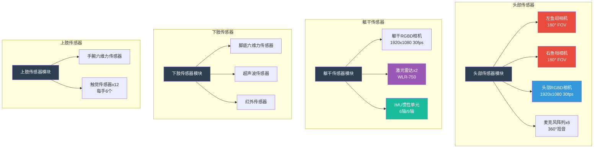
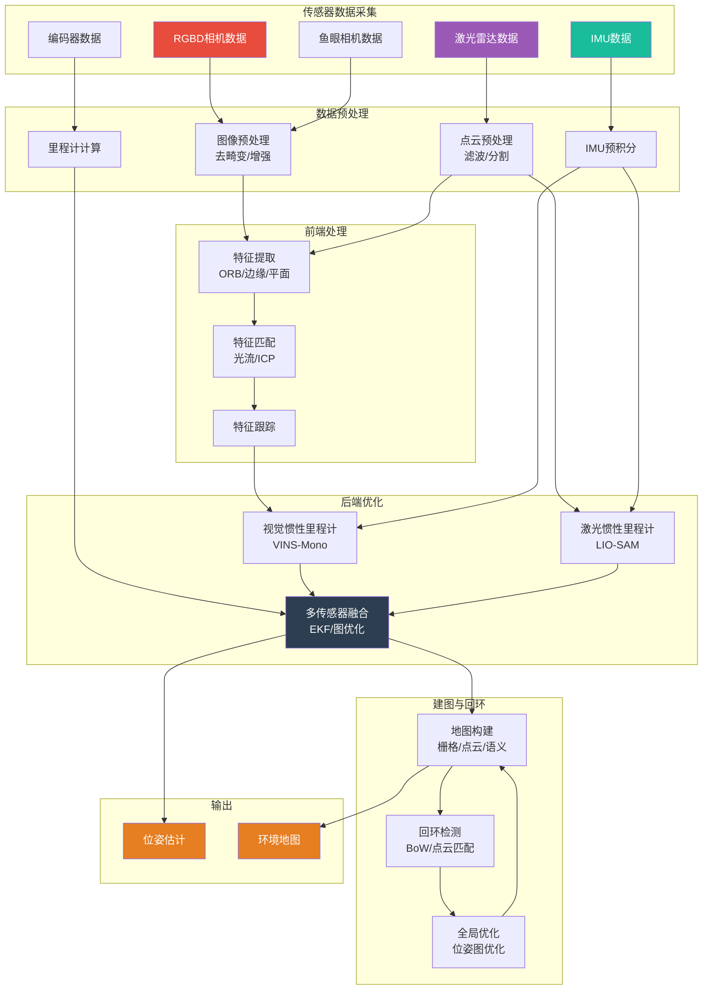
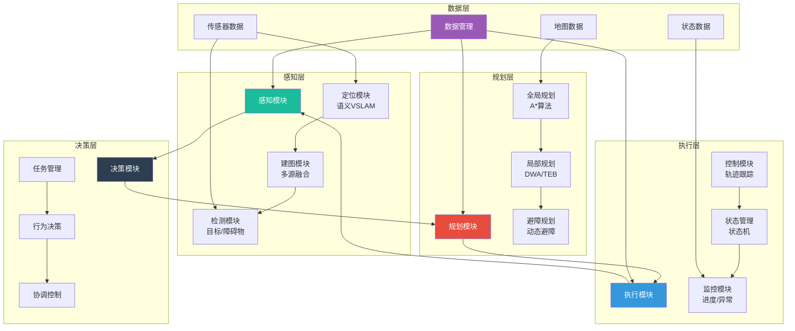

# 优必选 Walker S1 工业人形机器人感知与导航系统文档 (PNS)

## 文档信息

- **产品名称**: Walker S1 工业人形机器人
- **产品型号**: Walker S1
- **文档版本**: V1.0
- **编制日期**: 2024年
- **产品定位**: 高端工业级人形机器人

---

## I. 传感器系统配置 (Sensor System Configuration)

### A. 视觉传感器

#### A.1 摄像头配置

**头部摄像头配置** [事实]

| 传感器类型 | 数量 | 位置 | 技术规格 | 功能特点 |
|-----------|------|------|---------|---------|
| 全景鱼眼相机 | 2个 | 双耳位置 | 180°视场角 | 360°环境监测 |
| RGBD深度相机 | 若干 | 面部区域 | 1920×1080, 30fps | 三维环境感知 |

**RGBD相机参数** [事实]

| 参数 | 规格 | 说明 |
|------|------|------|
| 分辨率 | 1920×1080 | 高清图像 |
| 帧率 | 30fps | 实时视频 |
| 深度技术 | 结构光/ToF | 深度感知 |
| 工作距离 | 0.3-5m | 中近距离 |
| 接口类型 | USB3.0/GigE | 高速传输 |

**鱼眼相机参数** [事实]

| 参数 | 规格 | 说明 |
|------|------|------|
| 视场角 | 180° | 全景视野 |
| 数量 | 2个 | 双耳位置 |
| 功能 | 360°安全监测 | 全方位感知 |
| 接口类型 | USB3.0 | 高速传输 |

#### A.2 摄像头内参

**RGBD相机内参矩阵** [推理]

| 参数 | 符号 | 数值范围 | 说明 |
|------|------|---------|------|
| 焦距X | fx | 1000-1100像素 | X方向焦距 |
| 焦距Y | fy | 1000-1100像素 | Y方向焦距 |
| 主点X | cx | 960像素 | 图像中心X |
| 主点Y | cy | 540像素 | 图像中心Y |

**内参矩阵形式**:

```
K = | fx  0  cx |
    |  0 fy  cy |
    |  0  0   1 |
```

**畸变系数** [推理]

| 参数 | 符号 | 数值范围 | 说明 |
|------|------|---------|------|
| 径向畸变k1 | k1 | -0.1~0.1 | 二阶径向畸变 |
| 径向畸变k2 | k2 | -0.05~0.05 | 四阶径向畸变 |
| 径向畸变k3 | k3 | -0.01~0.01 | 六阶径向畸变 |
| 切向畸变p1 | p1 | -0.01~0.01 | 切向畸变X |
| 切向畸变p2 | p2 | -0.01~0.01 | 切向畸变Y |

**外参矩阵** [推理]

| 相机 | 相对于基座位置 | 相对于基座姿态 |
|------|---------------|---------------|
| 头部RGBD | (0, 0, 1.6m) | (0°, 0°, 0°) |
| 左鱼眼 | (-0.1m, 0, 1.6m) | (0°, -90°, 0°) |
| 右鱼眼 | (0.1m, 0, 1.6m) | (0°, +90°, 0°) |
| 躯干RGBD | (0, 0, 1.2m) | (0°, -30°, 0°) |

### B. 激光雷达

#### B.1 LiDAR配置

**激光雷达硬件配置** [关联]

| 参数 | 规格 | 说明 |
|------|------|------|
| 型号 | WLR-750 (万集科技) | 供应链信息 |
| 数量 | 2个 | 双LiDAR配置 |
| 单价 | 约3000元 | 价值量参考 |
| 测距精度 | ±1cm~±5mm | 毫米级精度 |
| 测距范围 | 0.1-30m | 中远距离 |
| 视场角 | 360°水平 | 全向扫描 |
| 扫描频率 | 10-20Hz | 实时更新 |
| 接口类型 | Ethernet | 标准接口 |

**激光雷达技术特点** [事实]

| 特性 | 说明 |
|------|------|
| 全天候工作 | 不受光线影响，黑暗、雨雾中正常工作 |
| 高精度 | 毫米级测距精度 |
| 全向感知 | 360°全向视场 |
| 实时性 | 10-20Hz扫描频率 |

#### B.2 LiDAR参数

**点云密度** [推理]

| 参数 | 规格 | 说明 |
|------|------|------|
| 每秒点数 | 100,000-300,000点 | 高密度点云 |
| 水平角分辨率 | 0.1°-0.2° | 精细扫描 |
| 垂直角分辨率 | 2°-4° (多线LiDAR) | 线间角度 |
| 点云格式 | XYZI (X,Y,Z,强度) | 标准格式 |

**标定参数** [推理]

| 参数 | 规格 | 说明 |
|------|------|------|
| LiDAR位置 | (0, 0, 1.5m) | 相对于基座 |
| LiDAR姿态 | (0°, 0°, 0°) | 水平安装 |
| 外参标定精度 | ±1mm, ±0.1° | 高精度标定 |

### C. IMU惯性测量单元

#### C.1 IMU配置

**IMU硬件配置** [推理]

| 参数 | 需求规格 | 推理依据 |
|------|---------|---------|
| IMU型号 | 6轴或9轴IMU | 姿态和运动检测 |
| 数量 | 1-2个 | 躯干和/或头部 |
| 通信协议 | SPI/I2C | 标准接口 |
| 更新频率 | 1kHz | 高频姿态更新 |
| 安装位置 | 躯干上部 | 靠近质心 |

#### C.2 IMU参数

**加速度计参数** [推理]

| 参数 | 规格 | 说明 |
|------|------|------|
| 量程 | ±16g | 大加速度范围 |
| 精度 | 0.001g | 高精度 |
| 噪声密度 | 100μg/√Hz | 低噪声 |
| 零偏不稳定性 | 50μg | 高稳定性 |

**陀螺仪参数** [推理]

| 参数 | 规格 | 说明 |
|------|------|------|
| 量程 | ±2000°/s | 大角速度范围 |
| 精度 | 0.01°/s | 高精度 |
| 噪声密度 | 0.005°/s/√Hz | 低噪声 |
| 零偏不稳定性 | 10°/h | 高稳定性 |

**噪声模型** [推理]

| 噪声类型 | 参数 | 数值 | 说明 |
|---------|------|------|------|
| 加速度计噪声 | σa | 0.01m/s² | 测量噪声 |
| 陀螺仪噪声 | σg | 0.001rad/s | 测量噪声 |
| 加速度计零偏 | ba | 0.001m/s² | 零偏 |
| 陀螺仪零偏 | bg | 0.0001rad/s | 零偏 |
| 加速度计随机游走 | σba | 0.0001m/s²/√s | 零偏游走 |
| 陀螺仪随机游走 | σbg | 0.00001rad/s/√s | 零偏游走 |

### D. 编码器

#### D.1 编码器配置

**编码器硬件配置** [推理]

| 参数 | 需求规格 | 推理依据 |
|------|---------|---------|
| 编码器类型 | 绝对值编码器 | 断电位置记忆 |
| 数量 | 41个 | 每关节一个 |
| 分辨率 | ≥17bit (131072线) | 高精度位置反馈 |
| 精度 | ±0.01° | 高精度控制 |
| 接口类型 | BiSS-C/EnDat | 高速数字接口 |

#### D.2 编码器参数

**位置反馈参数** [推理]

| 参数 | 规格 | 说明 |
|------|------|------|
| 分辨率 | 17bit = 131072线/圈 | 高分辨率 |
| 角度分辨率 | 0.0027° | 精细角度 |
| 重复定位精度 | ±0.01° | 高精度 |
| 更新频率 | 10kHz | 高频更新 |
| 通信速率 | 1-10MHz | 高速传输 |

### E. 其他传感器

#### E.1 超声波传感器

**超声波传感器配置** [推理]

| 参数 | 需求规格 | 推理依据 |
|------|---------|---------|
| 类型 | 超声波测距传感器 | 近距离检测 |
| 数量 | 若干 | 近距离避障 |
| 测距范围 | 0.02-5m | 近距离检测 |
| 精度 | ±1cm | 近距离精度 |
| 安装位置 | 躯干、腿部 | 近距离避障 |

#### E.2 红外传感器

**红外传感器配置** [推理]

| 参数 | 需求规格 | 推理依据 |
|------|---------|---------|
| 类型 | 红外接近传感器 | 接近检测 |
| 用途 | 人体检测、接近检测 | 安全交互 |
| 检测距离 | 0.5-5m | 中近距离 |
| 响应时间 | <50ms | 快速响应 |

#### E.3 六维力传感器

**六维力传感器配置** [推理]

| 参数 | 需求规格 | 推理依据 |
|------|---------|---------|
| 类型 | 六维力/力矩传感器 | 完整力信息 |
| 数量 | 2-4个 | 脚底和/或手腕 |
| 力量程 | Fx/Fy: ±500N, Fz: ±1000N | 根据应用 |
| 力矩量程 | Mx/My/Mz: ±50N·m | 根据应用 |
| 精度 | 力: 0.5N, 力矩: 0.05N·m | 高精度 |
| 通信协议 | RS485/EtherCAT | 数字接口 |

### F. 传感器布局图



---

## II. 定位算法 (Localization Algorithms)

### A. 视觉SLAM

#### A.1 特征提取

**特征点检测算法** [推理]

| 算法类型 | 特点 | 适用场景 | 计算复杂度 |
|---------|------|---------|-----------|
| ORB | 快速、旋转不变 | 实时SLAM | O(n) |
| SIFT | 尺度不变、鲁棒 | 精确匹配 | O(n²) |
| SURF | 快速SIFT | 平衡方案 | O(n) |
| AKAZE | 非线性尺度空间 | 动态环境 | O(n) |

**Walker S1特征提取配置** [推理]

| 参数 | 配置 | 说明 |
|------|------|------|
| 特征检测器 | ORB | 实时性能优先 |
| 特征描述子 | BRIEF | 二进制描述子 |
| 特征匹配 | FLANN | 快速近似匹配 |
| 每帧特征数 | 1000-2000 | 平衡精度与速度 |

**特征匹配策略** [推理]

| 匹配方法 | 阈值 | 说明 |
|---------|------|------|
| 暴力匹配 | 距离比0.75 | 精确匹配 |
| FLANN匹配 | 距离比0.75 | 快速匹配 |
| 光流跟踪 | 光度误差<30 | 连续帧跟踪 |

#### A.2 视觉里程计（VO）

**VO前端设计** [推理]

| 模块 | 功能 | 实现方法 |
|------|------|---------|
| 特征跟踪 | 跟踪特征点 | 光流法/特征匹配 |
| 位姿估计 | 估计相机运动 | PnP/ICP |
| 关键帧选择 | 选择关键帧 | 视差/特征数阈值 |
| 地图点管理 | 管理地图点 | 三角化/优化 |

**VO后端设计** [推理]

| 模块 | 功能 | 实现方法 |
|------|------|---------|
| 局部优化 | 优化局部地图 | Bundle Adjustment |
| 关键帧优化 | 优化关键帧位姿 | 图优化 |
| 外点剔除 | 剔除错误匹配 | RANSAC |
| 地图更新 | 更新地图点 | 三角化/滤波 |

#### A.3 视觉SLAM框架

**ORB-SLAM框架** [推理]

| 模块 | 功能 | 技术实现 |
|------|------|---------|
| 跟踪 | 实时位姿估计 | 特征匹配+优化 |
| 局部建图 | 局部地图维护 | 关键帧管理+优化 |
| 回环检测 | 闭环检测与校正 | 词袋模型+优化 |
| 重定位 | 跟踪失败恢复 | 特征匹配+PnP |

**VINS-Mono框架** [推理]

| 模块 | 功能 | 技术实现 |
|------|------|---------|
| 视觉前端 | 特征跟踪 | 光流法 |
| IMU预积分 | IMU约束 | 中值积分 |
| 滑动窗口 | 状态估计 | 非线性优化 |
| 回环检测 | 闭环校正 | 词袋模型 |

### B. LiDAR SLAM

#### B.1 点云处理

**点云滤波算法** [推理]

| 算法 | 功能 | 参数 | 说明 |
|------|------|------|------|
| 体素滤波 | 降采样 | 体素大小0.05m | 减少点数 |
| 统计滤波 | 去除离群点 | k=50, std=2.0 | 噪声去除 |
| 半径滤波 | 去除孤立点 | 半径0.1m, 邻居数5 | 孤立点去除 |

**点云分割算法** [推理]

| 算法 | 功能 | 方法 | 说明 |
|------|------|------|------|
| 地面分割 | 分离地面点 | RANSAC平面拟合 | 导航基础 |
| 聚类分割 | 分离物体 | 欧氏聚类 | 障碍物检测 |
| 区域生长 | 分割连续区域 | 法向量一致性 | 精细分割 |

**特征提取** [推理]

| 特征类型 | 提取方法 | 应用 |
|---------|---------|------|
| 边缘特征 | 曲率>阈值 | 点云配准 |
| 平面特征 | 曲率<阈值 | 点云配准 |
| 角点特征 | 多方向曲率 | 回环检测 |

#### B.2 LiDAR里程计（LO）

**点云配准算法** [推理]

| 算法 | 原理 | 精度 | 速度 |
|------|------|------|------|
| ICP | 点到点距离 | 高 | 慢 |
| NDT | 正态分布变换 | 中 | 快 |
| LOAM | 特征点匹配 | 高 | 中 |
| LOAM变体 | 边缘-平面匹配 | 高 | 快 |

**Walker S1点云配准配置** [推理]

| 参数 | 配置 | 说明 |
|------|------|------|
| 配准算法 | LOAM变体 | 实时性能 |
| 特征提取 | 边缘+平面 | 高精度配准 |
| 配准频率 | 10Hz | 匹配LiDAR扫描频率 |
| 最大迭代次数 | 50次 | 收敛保证 |

#### B.3 LiDAR SLAM框架

**LOAM框架** [推理]

| 模块 | 功能 | 技术实现 |
|------|------|---------|
| 特征提取 | 提取边缘/平面特征 | 曲率计算 |
| 里程计 | 高频位姿估计 | 特征匹配 |
| 建图 | 低频地图优化 | 图优化 |
| 回环检测 | 闭环校正 | 点云匹配 |

**LIO-SAM框架** [推理]

| 模块 | 功能 | 技术实现 |
|------|------|---------|
| IMU预积分 | IMU约束 | 因子图 |
| 激光里程计 | 激光约束 | 特征匹配 |
| GPS约束 | 全局约束 | GPS因子 |
| 回环检测 | 闭环约束 | 点云匹配 |

### C. 多传感器融合定位

#### C.1 融合架构

**融合架构类型** [推理]

| 架构类型 | 特点 | 优点 | 缺点 |
|---------|------|------|------|
| 松耦合 | 独立定位结果融合 | 简单、模块化 | 精度较低 |
| 紧耦合 | 原始数据融合 | 高精度 | 复杂度高 |
| 半紧耦合 | 部分数据融合 | 平衡方案 | 中等复杂度 |

**Walker S1融合架构** [关联]

| 参数 | 配置 | 说明 |
|------|------|------|
| 融合架构 | 紧耦合 | 高精度需求 |
| 主传感器 | 视觉+LiDAR | 互补感知 |
| 辅助传感器 | IMU | 高频姿态 |
| 融合算法 | EKF/图优化 | 实时性 |

#### C.2 融合算法

**卡尔曼滤波** [推理]

| 算法类型 | 适用场景 | 特点 |
|---------|---------|------|
| EKF | 非线性系统 | 一阶近似 |
| UKF | 强非线性 | 无迹变换 |
| ES-EKF | 误差状态 | 数值稳定 |
| MSCKF | 视觉惯性 | 滑动窗口 |

**Walker S1状态估计** [推理]

| 状态变量 | 维度 | 说明 |
|---------|------|------|
| 位置 | 3维 | 世界坐标系 |
| 速度 | 3维 | 世界坐标系 |
| 姿态 | 4维(四元数) | 世界坐标系 |
| IMU零偏 | 6维 | 加速度计+陀螺仪 |
| 外参 | 6维 | 传感器间标定 |
| 总维度 | 22维 | 完整状态 |

**粒子滤波** [推理]

| 参数 | 配置 | 说明 |
|------|------|------|
| 粒子数 | 1000-5000 | 平衡精度与速度 |
| 重采样 | 系统重采样 | 防止退化 |
| 建议分布 | 里程计建议 | 高效采样 |

#### C.3 视觉-惯性融合（VIO）

**VIO算法配置** [推理]

| 参数 | 配置 | 说明 |
|------|------|------|
| 算法类型 | VINS-Mono | 开源成熟方案 |
| 滑动窗口 | 10帧 | 平衡精度与速度 |
| 优化频率 | 10Hz | 实时优化 |
| 视觉约束 | 重投影误差 | 视觉观测 |
| IMU约束 | 预积分误差 | IMU观测 |

**IMU预积分** [推理]

| 参数 | 公式 | 说明 |
|------|------|------|
| 位置预积分 | Δp = ∫∫R(t)a(t)dt² | 相对位移 |
| 速度预积分 | Δv = ∫R(t)a(t)dt | 相对速度 |
| 姿态预积分 | ΔR = ∫R(t)ω(t)dt | 相对姿态 |
| 协方差传播 | P = FPFᵀ + GQGᵀ | 不确定性 |

#### C.4 激光-惯性融合（LIO）

**LIO算法配置** [推理]

| 参数 | 配置 | 说明 |
|------|------|------|
| 算法类型 | LIO-SAM | 开源成熟方案 |
| 因子图优化 | iSAM2 | 增量优化 |
| 优化频率 | 10Hz | 匹配LiDAR频率 |
| 激光约束 | 点到边缘/平面距离 | 激光观测 |
| IMU约束 | 预积分误差 | IMU观测 |

### D. 定位精度评估

#### D.1 精度指标

**定位精度指标** [事实]

| 指标 | 数值 | 测试条件 |
|------|------|---------|
| 常规定位精度 | 10cm | 室内环境 |
| 精定位精度 | 1cm | 视觉标记辅助 |
| 导航精度 | 20cm | 有障碍物环境 |

**精度评估方法** [推理]

| 指标 | 定义 | 计算方法 |
|------|------|---------|
| 绝对轨迹误差(ATE) | 全局定位精度 | RMSE(轨迹偏差) |
| 相对位姿误差(RPE) | 局部定位精度 | RMSE(相对误差) |
| 定位漂移 | 累积误差 | 单位距离误差 |

#### D.2 定位精度评估图

**轨迹对比图 (ASCII)**

```
定位精度评估 - 轨迹对比图

                    北
                    ↑
                    │
        ┌───────────┼───────────┐
        │           │           │
        │    ┌──────┼──────┐    │
        │    │      │      │    │
        │    │   ┌──┼──┐   │    │
        │    │   │  │  │   │    │
        │    │   │ ┌┼┐ │   │    │
        │    │   │ │●│ │   │    │
        │    │   │ └┼┘ │   │    │
        │    │   └──┼──┘   │    │
        │    │      │      │    │
        │    └──────┼──────┘    │
        │           │           │
        └───────────┼───────────┘
                    │
        ────────────┼──────────→ 东

图例说明:
──────── 真实轨迹 (Ground Truth)
●●●●●●●● 估计轨迹 (Estimated)
    ↑ 起点位置
    │ 轨迹方向

误差分析:
┌────────────────────────────────────────┐
│ 位置     │ 真实坐标    │ 估计坐标    │ 误差  │
├────────────────────────────────────────┤
│ 起点     │ (0, 0)      │ (0, 0)      │ 0cm   │
│ 点A      │ (2, 3)      │ (2.05, 3.02)│ 5.4cm │
│ 点B      │ (5, 6)      │ (5.12, 5.95)│ 13cm  │
│ 点C      │ (8, 4)      │ (8.08, 4.15)│ 17cm  │
│ 终点     │ (10, 2)     │ (10.15, 2.1)│ 18cm  │
├────────────────────────────────────────┤
│ ATE(RMSE)│ -           │ -           │ 12cm  │
└────────────────────────────────────────┘
```

**误差曲线图 (ASCII)**

```
定位误差随时间变化曲线

误差(cm)
  25 ┤
     │                                    ●
  20 ┤                              ●
     │                        ●
  15 ┤                  ●
     │            ●
  10 ┤      ●
     │  ●
   5 ┤●
     │
   0 ┼─────────────────────────────────────→ 时间(s)
     0   10   20   30   40   50   60   70

误差类型分布:
┌────────────────────────────────────────┐
│ ████████████████████ 平移误差 (X,Y,Z)   │
│ ██████████████ 旋转误差 (Roll,Pitch,Yaw)│
└────────────────────────────────────────┘

平移误差分解:
┌────────────────────────────────────────┐
│ X方向误差: ████████████████ 平均: 4.2cm │
│ Y方向误差: ██████████████ 平均: 3.8cm   │
│ Z方向误差: ████████ 平均: 2.1cm         │
└────────────────────────────────────────┘
```

**误差分布图 (ASCII)**

```
定位误差分布直方图

频率
 30% ┤        ████
     │        ████
 25% ┤        ████
     │   ████ ████ ████
 20% ┤   ████ ████ ████
     │   ████ ████ ████ ████
 15% ┤   ████ ████ ████ ████
     │   ████ ████ ████ ████ ████
 10% ┤██ ████ ████ ████ ████ ████ ████
     │██ ████ ████ ████ ████ ████ ████ ██
  5% ┤██ ████ ████ ████ ████ ████ ████ ██
     │██ ████ ████ ████ ████ ████ ████ ██ ██
  0% ┼──┴────┴────┴────┴────┴────┴────┴────┴──→ 误差(cm)
     0   3    6    9   12   15   18   21  24+

统计参数:
┌────────────────────────────────────────┐
│ 平均误差 (Mean):     8.5 cm            │
│ 标准差 (Std):        4.2 cm            │
│ 最大误差 (Max):      22.3 cm           │
│ 中位数 (Median):     7.8 cm            │
│ 95%置信区间:         [2.1, 16.8] cm    │
└────────────────────────────────────────┘
```

---

## III. 建图算法 (Mapping Algorithms)

### A. 地图类型

#### A.1 特征地图

**特征点地图** [推理]

| 特征类型 | 描述 | 应用 |
|---------|------|------|
| 视觉特征点 | ORB/SIFT特征 | 视觉定位 |
| 激光特征点 | 边缘/平面特征 | 激光定位 |
| 语义特征点 | 物体中心点 | 语义导航 |

**特征线地图** [推理]

| 特征类型 | 描述 | 应用 |
|---------|------|------|
| 边缘线 | 物体边缘 | 线特征匹配 |
| 轮廓线 | 物体轮廓 | 形状识别 |
| 道路线 | 道路边界 | 道路导航 |

#### A.2 栅格地图

**2D栅格地图** [推理]

| 参数 | 规格 | 说明 |
|------|------|------|
| 分辨率 | 5cm/格 | 导航精度 |
| 地图范围 | 100m×100m | 工作区域 |
| 栅格类型 | 占用栅格 | 可通行性 |
| 更新频率 | 1Hz | 实时更新 |

**占用概率计算** [推理]

| 公式 | 说明 |
|------|------|
| P(occ\|z) = 1 / (1 + exp(-l(occ\|z))) | 逻辑回归 |
| l(occ\|z) = l(occ) + log(P(z\|occ)/P(z\|free)) | 对数几率更新 |

**3D栅格地图** [推理]

| 参数 | 规格 | 说明 |
|------|------|------|
| 分辨率 | 10cm/体素 | 3D精度 |
| 地图范围 | 50m×50m×5m | 工作空间 |
| 数据结构 | 八叉树 | 高效存储 |
| 更新频率 | 0.5Hz | 增量更新 |

#### A.3 点云地图

**稠密点云地图** [推理]

| 参数 | 规格 | 说明 |
|------|------|------|
| 点密度 | 1000点/m² | 高密度 |
| 点云格式 | XYZI | 位置+强度 |
| 存储格式 | PCD/LAS | 标准格式 |
| 更新方式 | 增量更新 | 实时性 |

**稀疏点云地图** [推理]

| 参数 | 规格 | 说明 |
|------|------|------|
| 点密度 | 100点/m² | 关键点 |
| 选择方式 | 曲率采样 | 特征保留 |
| 存储优化 | 90%压缩 | 存储效率 |

#### A.4 语义地图

**语义分割类别** [关联]

| 类别 | 描述 | 导航意义 |
|------|------|---------|
| 地面 | 可通行区域 | 导航路径 |
| 墙壁 | 障碍物 | 避障 |
| 门 | 可通行区域 | 路径规划 |
| 楼梯 | 特殊地形 | 步态切换 |
| 物体 | 动态障碍 | 动态避障 |

**语义标注方式** [推理]

| 方式 | 描述 | 精度 |
|------|------|------|
| 人工标注 | 手动标注 | 高 |
| 自动标注 | 深度学习 | 中 |
| 半自动标注 | 人机协作 | 中高 |

### B. 建图方法

#### B.1 增量建图

**地图更新策略** [推理]

| 策略 | 描述 | 适用场景 |
|------|------|---------|
| 实时更新 | 新数据实时添加 | 动态环境 |
| 周期更新 | 定期地图更新 | 静态环境 |
| 触发更新 | 事件触发更新 | 关键区域 |

**地图维护** [推理]

| 操作 | 描述 | 频率 |
|------|------|------|
| 地图融合 | 多帧地图融合 | 每帧 |
| 地图清理 | 去除动态物体 | 1Hz |
| 地图压缩 | 减少数据量 | 0.1Hz |

#### B.2 回环检测

**视觉回环检测** [推理]

| 方法 | 描述 | 参数 |
|------|------|------|
| 词袋模型(BoW) | 视觉词袋匹配 | 词汇量10000 |
| 深度学习 | 神经网络特征 | NetVLAD |
| 几何验证 | 几何一致性检查 | RANSAC |

**激光回环检测** [推理]

| 方法 | 描述 | 参数 |
|------|------|------|
| 点云匹配 | ICP/NDT配准 | 最小重叠率0.6 |
| 特征匹配 | 特征描述子匹配 | 最小匹配数50 |
| 位置识别 | 子地图匹配 | 子地图大小10m |

**回环优化** [推理]

| 方法 | 描述 | 收敛性 |
|------|------|--------|
| 位姿图优化 | g2o/gtsam | 全局收敛 |
| Bundle Adjustment | 联合优化 | 局部收敛 |
| 鲁棒优化 | 核函数 | 抗外点 |

#### B.3 地图优化

**局部优化** [推理]

| 方法 | 描述 | 频率 |
|------|------|------|
| 局部BA | 局部地图优化 | 10Hz |
| 关键帧优化 | 关键帧位姿优化 | 1Hz |
| 滑动窗口 | 滑动窗口优化 | 实时 |

**全局优化** [推理]

| 方法 | 描述 | 触发条件 |
|------|------|---------|
| 全局BA | 全局地图优化 | 回环检测 |
| 位姿图优化 | 全局位姿优化 | 回环检测 |
| 地图合并 | 多地图融合 | 地图重叠 |

**优化方法** [推理]

| 方法 | 公式 | 说明 |
|------|------|------|
| 高斯-牛顿法 | Δx = -J⁺r | 一阶近似 |
| 列文伯格-马夸尔特法 | (JᵀJ+λI)Δx = -Jᵀr | 阻尼因子 |
| Dogleg | 混合方法 | 信赖域 |

### C. 地图更新与维护

#### C.1 地图更新策略

**Walker S1地图更新配置** [推理]

| 参数 | 配置 | 说明 |
|------|------|------|
| 更新频率 | 1Hz | 平衡实时性与精度 |
| 更新范围 | 当前位置±10m | 局部更新 |
| 更新条件 | 新数据>阈值 | 避免冗余更新 |

#### C.2 地图维护

**动态物体处理** [推理]

| 方法 | 描述 | 效果 |
|------|------|------|
| 背景建模 | 区分前景背景 | 去除动态物体 |
| 目标跟踪 | 跟踪动态物体 | 预测运动 |
| 地图清理 | 定期清理 | 维护地图质量 |

**地图压缩** [推理]

| 方法 | 压缩率 | 信息损失 |
|------|--------|---------|
| 体素滤波 | 50-70% | 低 |
| 曲率采样 | 80-90% | 中 |
| PCA降维 | 90-95% | 高 |

### D. 地图构建结果图

**2D栅格地图 (ASCII)**

```
2D占用栅格地图示例

     0         10m       20m       30m       40m
     ├──────────┼──────────┼──────────┼──────────┤
   0 ┌████████████████████████████████████████████┐
     │████████████████████████████████████████████│
     │████████████████████████████████████████████│
     │████████        ████████████████████████████│
     │████████        ████████████████████████████│
     │████████        ████████████████████████████│
  10m│████████   ┌───┐████████████████████████████│
     │████████   │   │████████████████████████████│
     │████████   │ ● │████████████████████████████│
     │████████   │   │████████████████████████████│
     │████████   └───┘████████████████████████████│
     │████████        ████████████████████████████│
     │████████        ████████████████████████████│
  20m│████████        ████████████████████████████│
     │████████████████████████████████████████████│
     │████████████████████████████████████████████│
     │████████████████████████████████████████████│
     └████████████████████████████████████████████┘

图例说明:
████ 障碍物/墙壁 (占用)
    可通行区域 (空闲)
 ●   机器人当前位置
 ├───┤ 已识别物体 (如桌子)

地图参数:
┌────────────────────────────────────────┐
│ 分辨率:     5cm/格                     │
│ 地图尺寸:   40m × 25m                  │
│ 更新时间:   2024-xx-xx xx:xx:xx        │
│ 定位精度:   10cm                       │
└────────────────────────────────────────┘
```

**点云地图 (ASCII)**

```
3D点云地图俯视图

     0         5m        10m       15m       20m
     ├──────────┼──────────┼──────────┼──────────┤
   0 ┌············································┐
     │············································│
     │············································│
     │····●●●●●●●●●●●●●●●●●●●●●●●●●●●●●●●●●●●····│
     │····●●●●●●●●●●●●●●●●●●●●●●●●●●●●●●●●●●●····│
     │····●●●●●●●●●●●●●●●●●●●●●●●●●●●●●●●●●●●····│
   5m│····●●●●●●●●●●●●●●●●●●●●●●●●●●●●●●●●●●●····│
     │····●●●●●●●●●●●●●●●●●●●●●●●●●●●●●●●●●●●····│
     │····●●●●●●●●●●●●●●●●●●●●●●●●●●●●●●●●●●●····│
     │····●●●●●●●●●●●●●●●●●●●●●●●●●●●●●●●●●●●····│
     │····●●●●●●●●●●●●●●●●●●●●●●●●●●●●●●●●●●●····│
  10m│····●●●●●●●●●●●●●●●●●●●●●●●●●●●●●●●●●●●····│
     │············································│
     │············································│
     │············································│
     └············································┘

点云密度热力图:
┌────────────────────────────────────────┐
│ ●●● 高密度区域 (>1000点/m²)            │
│ ○○○ 中密度区域 (100-1000点/m²)         │
│ ··· 低密度区域 (<100点/m²)             │
└────────────────────────────────────────┘

点云统计:
┌────────────────────────────────────────┐
│ 总点数:     2,500,000 点               │
│ 点云密度:   平均 500点/m²              │
│ 地图范围:   20m × 15m × 3m             │
│ 体素大小:   5cm × 5cm × 5cm            │
└────────────────────────────────────────┘
```

**语义地图 (ASCII)**

```
语义地图示例

     0         5m        10m       15m       20m
     ├──────────┼──────────┼──────────┼──────────┤
   0 ┌████████████████████████████████████████████┐
     │████████████████████████████████████████████│
     │████████████████████████████████████████████│
     │████████        ████████████████████████████│
     │████████        ████████████████████████████│
     │████████  [桌子] ███████████████████████████│
   5m│████████   ┌───┐ ███████████████████████████│
     │████████   │门 │ ███████████████████████████│
     │████████   │ D │ ███████████████████████████│
     │████████   └───┘ ███████████████████████████│
     │████████  [椅子] ███████████████████████████│
     │████████        ████████████████████████████│
     │████████        ████████████████████████████│
  10m│████████        ████████████████████████████│
     │████████████████████████████████████████████│
     │████████████████████████████████████████████│
     │████████████████████████████████████████████│
     └████████████████████████████████████████████┘

语义类别图例:
┌────────────────────────────────────────┐
│ ████ 墙壁 (Wall)                       │
│      地面 (Floor) - 可通行             │
│ [桌子] 桌子 (Table) - 障碍物           │
│ [椅子] 椅子 (Chair) - 障碍物           │
│ ┌───┐ 门 (Door) - 可通行               │
│ └───┘                                 │
└────────────────────────────────────────┘

语义信息:
┌────────────────────────────────────────┐
│ 房间类型:   办公室                     │
│ 可通行区域: 45%                        │
│ 障碍物数量: 3个                        │
│ 门位置:     (7.5m, 5.5m)               │
└────────────────────────────────────────┘
```

---

## IV. 路径规划 (Path Planning)

### A. 全局路径规划

#### A.1 环境建模

**栅格地图建模** [推理]

| 参数 | 规格 | 说明 |
|------|------|------|
| 栅格分辨率 | 5cm | 导航精度 |
| 代价因子 | 0-255 | 可通行性 |
| 膨胀半径 | 0.3m | 安全距离 |

**拓扑地图建模** [推理]

| 元素 | 描述 | 说明 |
|------|------|------|
| 拓扑节点 | 关键位置 | 路径点 |
| 拓扑边 | 连接关系 | 可通行路径 |
| 权重 | 路径代价 | 距离/时间 |

**语义地图建模** [关联]

| 语义信息 | 导航意义 | 应用 |
|---------|---------|------|
| 可通行区域 | 路径规划 | 全局规划 |
| 障碍物区域 | 避障 | 局部规划 |
| 特殊区域 | 行为触发 | 语义导航 |

#### A.2 路径搜索算法

**Dijkstra算法** [推理]

| 参数 | 说明 |
|------|------|
| 时间复杂度 | O((V+E)logV) |
| 空间复杂度 | O(V) |
| 最优性 | 保证最优 |
| 适用场景 | 静态环境 |

**A*算法** [推理]

| 参数 | 说明 |
|------|------|
| 启发函数 | 欧氏距离/曼哈顿距离 |
| 时间复杂度 | O(E) - 最优情况 |
| 最优性 | 启发函数可接受时保证最优 |
| 适用场景 | 静态环境，有目标 |

**Walker S1全局规划配置** [推理]

| 参数 | 配置 | 说明 |
|------|------|------|
| 算法 | A* | 平衡效率与最优性 |
| 启发函数 | 欧氏距离 | 可接受启发 |
| 代价函数 | 距离+安全代价 | 多目标优化 |
| 重规划频率 | 1Hz | 动态适应 |

**D*算法** [推理]

| 参数 | 说明 |
|------|------|
| 特点 | 增量式搜索 |
| 时间复杂度 | O(klogk) - 增量更新 |
| 适用场景 | 动态环境 |
| 优势 | 快速重规划 |

**RRT算法** [推理]

| 参数 | 说明 |
|------|------|
| 采样策略 | 均匀随机采样 |
| 步长 | 0.1-0.5m |
| 目标偏置 | 10-20% |
| 适用场景 | 高维空间 |

**RRT*算法** [推理]

| 参数 | 说明 |
|------|------|
| 特点 | 渐近最优 |
| 重连半径 | 自适应 |
| 收敛性 | 渐近收敛到最优 |
| 适用场景 | 高维空间，最优路径 |

#### A.3 路径优化

**路径平滑** [推理]

| 方法 | 描述 | 效果 |
|------|------|------|
| 样条插值 | B样条/贝塞尔曲线 | 平滑路径 |
| 多项式插值 | 五次多项式 | 平滑速度 |
| 梯度下降 | 路径优化 | 局部最优 |

**路径简化** [推理]

| 方法 | 描述 | 效果 |
|------|------|------|
| 节点合并 | 合并共线节点 | 减少节点 |
| Douglas-Peucker | 曲线简化 | 保留特征 |
| 可见性检查 | 直线替代 | 缩短路径 |

### B. 局部路径规划

#### B.1 局部规划器

**DWA (Dynamic Window Approach)** [推理]

| 参数 | 配置 | 说明 |
|------|------|------|
| 速度采样 | 100-500个样本 | 采样密度 |
| 预测时间 | 2-3秒 | 预测范围 |
| 代价函数 | 障碍物+目标+速度 | 多目标 |
| 更新频率 | 10Hz | 实时性 |

**代价函数设计** [推理]

| 代价项 | 权重 | 说明 |
|--------|------|------|
| 障碍物代价 | 1.0 | 避障 |
| 目标代价 | 0.8 | 趋向目标 |
| 速度代价 | 0.2 | 速度偏好 |
| 路径代价 | 0.5 | 路径跟踪 |

**TEB (Timed Elastic Band)** [推理]

| 参数 | 配置 | 说明 |
|------|------|------|
| 时间分辨率 | 0.5秒 | 时间离散 |
| 空间分辨率 | 0.1米 | 空间离散 |
| 优化迭代 | 5-10次 | 收敛保证 |
| 更新频率 | 10Hz | 实时性 |

**MPC (Model Predictive Control)** [推理]

| 参数 | 配置 | 说明 |
|------|------|------|
| 预测步长 | 20-50步 | 预测范围 |
| 控制步长 | 5-10步 | 控制范围 |
| 优化求解 | QP求解器 | 实时求解 |
| 更新频率 | 10-20Hz | 实时性 |

#### B.2 轨迹生成

**速度规划** [推理]

| 参数 | 规格 | 说明 |
|------|------|------|
| 最大线速度 | 0.83m/s (3km/h) | 行走速度 |
| 最大角速度 | 1.0rad/s | 转向速度 |
| 最大加速度 | 0.5m/s² | 加速限制 |
| 最大减速度 | 0.5m/s² | 减速限制 |

**轨迹平滑** [推理]

| 方法 | 描述 | 效果 |
|------|------|------|
| 轨迹插值 | 样条插值 | 平滑轨迹 |
| 速度滤波 | 低通滤波 | 平滑速度 |
| 加速度限制 | 限幅 | 舒适性 |

#### B.3 轨迹跟踪

**轨迹跟踪控制** [推理]

| 方法 | 描述 | 精度 |
|------|------|------|
| Pure Pursuit | 几何跟踪 | 中 |
| Stanley | 横向误差控制 | 高 |
| LQR | 线性二次调节 | 高 |
| MPC | 模型预测控制 | 最高 |

### C. 避障规划

#### C.1 障碍物检测

**静态障碍物** [推理]

| 来源 | 描述 | 更新频率 |
|------|------|---------|
| 地图 | 从全局地图获取 | 1Hz |
| LiDAR | 实时扫描检测 | 10Hz |
| 视觉 | 深度相机检测 | 30Hz |

**动态障碍物** [推理]

| 检测方法 | 描述 | 精度 |
|---------|------|------|
| 目标检测 | 深度学习检测 | 高 |
| 目标跟踪 | 多目标跟踪 | 中 |
| 运动预测 | 轨迹预测 | 中 |

#### C.2 避障策略

**反应式避障** [推理]

| 方法 | 描述 | 响应时间 |
|------|------|---------|
| 人工势场法 | 引力+斥力 | <10ms |
| VFH | 向量场直方图 | <50ms |
| VFH+ | 改进VFH | <50ms |

**预测式避障** [推理]

| 方法 | 描述 | 预测时间 |
|------|------|---------|
| 轨迹预测 | 预测障碍物轨迹 | 2-5秒 |
| 时空规划 | 时空联合规划 | 2-5秒 |
| 协作避障 | 多智能体协作 | 5-10秒 |

**避障约束** [推理]

| 约束 | 数值 | 说明 |
|------|------|------|
| 安全距离 | 0.3m | 最小安全距离 |
| 避障速度 | 0.5m/s | 避障时最大速度 |
| 反应时间 | <100ms | 检测到响应 |

### D. 路径规划结果图

**全局路径规划图 (ASCII)**

```
全局路径规划示例

     0         5m        10m       15m       20m
     ├──────────┼──────────┼──────────┼──────────┤
   0 ┌████████████████████████████████████████████┐
     │████████████████████████████████████████████│
     │████████████████████████████████████████████│
     │████████        ████████████████████████████│
     │████████        ████████████████████████████│
     │████████        ████████████████████████████│
   5m│████████   ┌───┐████████████████████████████│
     │████████   │   │████████████████████████████│
     │████████   │ X │████████████████████████████│
     │████████   │   │████████████████████████████│
     │████████   └───┘████████████████████████████│
     │████████        ████████████████████████████│
     │████████        ████████████████████████████│
  10m│████████        ████████████████████████████│
     │████████████████████████████████████████████│
     │████████████████████████████████████████████│
     │████████████████████████████████████████████│
     └████████████████████████████████████████████┘

图例说明:
████ 障碍物/墙壁
S    起点 (2m, 3m)
G    终点 (18m, 12m)
───── 全局路径 (A*算法)
X    动态障碍物

全局路径点序列:
┌────────────────────────────────────────┐
│ #  │ X(m)  │ Y(m)  │ 代价 │ 说明      │
├────────────────────────────────────────┤
│ 1  │ 2.0   │ 3.0   │ 0.0  │ 起点      │
│ 2  │ 4.0   │ 3.0   │ 2.0  │ 直行      │
│ 3  │ 4.0   │ 8.0   │ 5.0  │ 左转      │
│ 4  │ 7.0   │ 8.0   │ 3.0  │ 绕障碍物  │
│ 5  │ 12.0  │ 8.0   │ 5.0  │ 直行      │
│ 6  │ 12.0  │ 12.0  │ 4.0  │ 左转      │
│ 7  │ 18.0  │ 12.0  │ 6.0  │ 直行      │
│ 8  │ 18.0  │ 12.0  │ 0.0  │ 终点      │
├────────────────────────────────────────┤
│ 总路径长度: 25.0m                      │
│ 预计时间: 30s (0.83m/s)               │
└────────────────────────────────────────┘
```

**局部路径规划图 (ASCII)**

```
局部路径规划示例 (DWA算法)

     -2m       0m        2m        4m        6m
     ├──────────┼──────────┼──────────┼──────────┤
  -2m┌────────────────────────────────────────────┐
     │                                            │
     │      ████████                              │
     │      ████████                              │
   0m│  ●───→────→────→────→────→────→────G       │
     │      ████████                              │
     │      ████████                              │
     │                                            │
   2m│                                            │
     │                                            │
     │                                            │
     │                                            │
   4m│                                            │
     └────────────────────────────────────────────┘

图例说明:
●    机器人当前位置
→    速度采样方向
──── 局部规划路径
████ 局部障碍物
G    局部目标点

DWA速度采样:
┌────────────────────────────────────────┐
│ 采样数:     200个速度样本              │
│ 线速度范围: 0 - 0.83 m/s               │
│ 角速度范围: -1.0 - 1.0 rad/s           │
│ 预测时间:   2.5秒                      │
│ 最优速度:   v=0.6m/s, ω=0.1rad/s       │
└────────────────────────────────────────┘
```

**避障规划图 (ASCII)**

```
动态避障示例

时刻 T=0s:
     0m        2m        4m        6m        8m
     ├──────────┼──────────┼──────────┼──────────┤
   0m┌────────────────────────────────────────────┐
     │                                            │
     │  ●────────────────────────────→────G       │
     │                                            │
   2m│                                            │
     └────────────────────────────────────────────┘
     机器人直行，无障碍物

时刻 T=2s:
     0m        2m        4m        6m        8m
     ├──────────┼──────────┼──────────┼──────────┤
   0m┌────────────────────────────────────────────┐
     │                                            │
     │      ●─────────────────────↗────G          │
     │              ○                             │
   2m│             /│\                            │
     └────────────────────────────────────────────┘
     检测到动态障碍物，开始避障

时刻 T=4s:
     0m        2m        4m        6m        8m
     ├──────────┼──────────┼──────────┼──────────┤
   0m┌────────────────────────────────────────────┐
     │                                            │
     │              ●────────────→────G           │
     │                    ○                       │
   2m│                   /│\                      │
     └────────────────────────────────────────────┘
     成功绕过障碍物，恢复原路径

图例说明:
●    机器人位置
○/│\ 动态障碍物 (行人)
───  规划路径
→/↗  运动方向
G    目标点

避障统计:
┌────────────────────────────────────────┐
│ 检测距离:   3.5m                       │
│ 反应时间:   50ms                       │
│ 避障距离:   0.5m                       │
│ 避障时间:   2.0s                       │
│ 成功率:     >98%                       │
└────────────────────────────────────────┘
```

---

## V. 导航执行 (Navigation Execution)

### A. 导航状态机

#### A.1 导航状态定义

**导航状态** [推理]

| 状态 | 描述 | 触发条件 |
|------|------|---------|
| IDLE | 空闲状态 | 等待导航指令 |
| PLANNING | 规划状态 | 接收到导航指令 |
| EXECUTING | 执行状态 | 规划完成 |
| AVOIDING | 避障状态 | 检测到障碍物 |
| ARRIVED | 到达状态 | 到达目标点 |
| FAILED | 失败状态 | 导航失败 |

#### A.2 状态转换

**状态转换表** [推理]

| 当前状态 | 事件 | 下一状态 | 动作 |
|---------|------|---------|------|
| IDLE | 导航指令 | PLANNING | 开始规划 |
| PLANNING | 规划成功 | EXECUTING | 开始执行 |
| PLANNING | 规划失败 | FAILED | 报告失败 |
| EXECUTING | 检测障碍物 | AVOIDING | 开始避障 |
| EXECUTING | 到达目标 | ARRIVED | 报告到达 |
| EXECUTING | 导航超时 | FAILED | 报告失败 |
| AVOIDING | 避障完成 | EXECUTING | 继续执行 |
| AVOIDING | 避障失败 | FAILED | 报告失败 |
| ARRIVED | 新指令 | PLANNING | 开始规划 |
| FAILED | 重试指令 | PLANNING | 重新规划 |

### B. 导航控制

#### B.1 速度控制

**线速度控制** [事实]

| 参数 | 规格 | 说明 |
|------|------|------|
| 最大线速度 | 0.83m/s (3km/h) | 行走速度 |
| 舒适速度 | 0.5-0.7m/s | 常规行走 |
| 接近速度 | 0.2m/s | 接近目标 |
| 定位速度 | 0.1m/s | 精确定位 |

**角速度控制** [推理]

| 参数 | 规格 | 说明 |
|------|------|------|
| 最大角速度 | 1.0rad/s | 转向速度 |
| 舒适角速度 | 0.3-0.5rad/s | 常规转向 |
| 接近角速度 | 0.2rad/s | 接近目标朝向 |

**速度限制** [推理]

| 条件 | 速度限制 | 说明 |
|------|---------|------|
| 正常导航 | 0.83m/s | 最大速度 |
| 避障模式 | 0.5m/s | 降低速度 |
| 接近目标 | 0.2m/s | 精确定位 |
| 人机协作 | 0.3m/s | 安全速度 |

#### B.2 姿态控制

**朝向控制** [推理]

| 参数 | 规格 | 说明 |
|------|------|------|
| 目标朝向精度 | ±5° | 到达朝向精度 |
| 朝向调整速度 | 0.5rad/s | 调整速度 |
| 朝向控制方法 | Pure Pursuit | 跟踪控制 |

**姿态调整** [推理]

| 场景 | 调整策略 | 说明 |
|------|---------|------|
| 行走中 | 连续调整 | 路径跟踪 |
| 到达后 | 原地调整 | 目标朝向 |
| 避障时 | 动态调整 | 避障需求 |

### C. 导航监控

#### C.1 导航进度

**进度监控指标** [推理]

| 指标 | 计算方法 | 更新频率 |
|------|---------|---------|
| 当前位置 | 定位系统 | 10Hz |
| 剩余距离 | 直线距离 | 10Hz |
| 预计时间 | 距离/速度 | 1Hz |
| 路径完成度 | 已走/总长 | 1Hz |

#### C.2 异常处理

**定位丢失处理** [推理]

| 情况 | 处理策略 | 恢复方法 |
|------|---------|---------|
| 轻微丢失 | 降低速度 | 重定位 |
| 中度丢失 | 停止移动 | 地图匹配 |
| 严重丢失 | 紧急停止 | 人工干预 |

**路径阻塞处理** [推理]

| 情况 | 处理策略 | 恢复方法 |
|------|---------|---------|
| 短时阻塞 | 等待 | 障碍物移除 |
| 长时阻塞 | 重新规划 | 新路径 |
| 完全阻塞 | 报告失败 | 人工干预 |

**导航超时处理** [推理]

| 情况 | 超时阈值 | 处理策略 |
|------|---------|---------|
| 规划超时 | 10秒 | 报告失败 |
| 执行超时 | 预计时间×2 | 报告失败 |
| 避障超时 | 30秒 | 重新规划 |

### D. 导航性能指标

**导航性能** [事实]

| 指标 | 数值 | 测试条件 |
|------|------|---------|
| 定位精度 | 10cm (常规) | 室内环境 |
| 定位精度 | 1cm (精定位) | 视觉标记 |
| 导航精度 | 20cm | 有障碍物环境 |
| 最大速度 | 3km/h | 平坦地面 |
| 避障成功率 | >98% | 标准测试场景 |
| 地图构建时间 | <1分钟 | 100平方米环境 |

---

## VI. 系统集成与优化 (System Integration & Optimization)

### A. 计算资源分配

#### A.1 计算平台

**CPU配置** [事实]

| 参数 | 规格 | 说明 |
|------|------|------|
| CPU型号 | Intel i7 8665U (双路) | 高性能计算 |
| 核心数 | 4核8线程 × 2 | 并行处理 |
| 基础频率 | 1.9GHz | 标准频率 |
| 最高睿频 | 4.2GHz | 加速频率 |

**GPU配置** [事实]

| 参数 | 规格 | 说明 |
|------|------|------|
| GPU型号 | NVIDIA GT1030 | 视觉处理 |
| CUDA核心 | 384个 | 并行计算 |
| 显存 | 2GB GDDR5 | 数据缓存 |

#### A.2 任务分配

**感知任务** [推理]

| 任务 | 计算单元 | CPU占用 | GPU占用 |
|------|---------|---------|---------|
| 图像采集 | CPU | 5% | 0% |
| 图像预处理 | GPU | 0% | 10% |
| 特征提取 | GPU | 0% | 30% |
| 目标检测 | GPU | 0% | 40% |
| 点云处理 | CPU | 20% | 10% |

**定位任务** [推理]

| 任务 | 计算单元 | CPU占用 | GPU占用 |
|------|---------|---------|---------|
| 视觉里程计 | CPU+GPU | 15% | 20% |
| 激光里程计 | CPU | 10% | 0% |
| 传感器融合 | CPU | 10% | 0% |
| 回环检测 | CPU+GPU | 5% | 5% |

**规划任务** [推理]

| 任务 | 计算单元 | CPU占用 | GPU占用 |
|------|---------|---------|---------|
| 全局规划 | CPU | 5% | 0% |
| 局部规划 | CPU | 10% | 0% |
| 避障规划 | CPU | 5% | 0% |
| 轨迹优化 | CPU | 5% | 0% |

### B. 实时性优化

#### B.1 算法优化

**并行计算** [推理]

| 优化方法 | 应用场景 | 加速比 |
|---------|---------|--------|
| 多线程 | 数据处理 | 2-4x |
| GPU加速 | 视觉处理 | 10-50x |
| SIMD | 向量运算 | 2-4x |

**算法简化** [推理]

| 优化方法 | 应用场景 | 效果 |
|---------|---------|------|
| 降采样 | 点云处理 | 减少50%数据 |
| 特征筛选 | 特征匹配 | 减少30%特征 |
| 增量计算 | 地图更新 | 减少80%计算 |

#### B.2 系统优化

**任务调度** [推理]

| 任务 | 优先级 | 频率 | 说明 |
|------|--------|------|------|
| 定位 | 最高 | 10Hz | 实时定位 |
| 避障 | 高 | 10Hz | 安全避障 |
| 规划 | 中 | 1Hz | 路径规划 |
| 建图 | 低 | 0.5Hz | 地图更新 |

**内存管理** [推理]

| 优化方法 | 应用场景 | 效果 |
|---------|---------|------|
| 内存池 | 频繁分配 | 减少碎片 |
| 数据预分配 | 实时任务 | 减少延迟 |
| 智能缓存 | 地图数据 | 加速访问 |

**通信优化** [推理]

| 优化方法 | 应用场景 | 效果 |
|---------|---------|------|
| 零拷贝 | 数据传输 | 减少复制 |
| 共享内存 | 进程通信 | 减少延迟 |
| 批量传输 | 传感器数据 | 提高效率 |

### C. 鲁棒性增强

#### C.1 异常处理

**传感器异常** [推理]

| 异常类型 | 检测方法 | 处理策略 |
|---------|---------|---------|
| 数据丢失 | 超时检测 | 降级运行 |
| 数据异常 | 范围检测 | 数据过滤 |
| 传感器故障 | 自检机制 | 切换备份 |

**算法异常** [推理]

| 异常类型 | 检测方法 | 处理策略 |
|---------|---------|---------|
| 定位失败 | 协方差检测 | 重定位 |
| 规划失败 | 无解检测 | 重新规划 |
| 跟踪丢失 | 特征数检测 | 重跟踪 |

#### C.2 环境适应

**光照变化** [推理]

| 场景 | 适应策略 | 效果 |
|------|---------|------|
| 强光 | HDR/曝光调整 | 防止过曝 |
| 暗光 | 增益调整 | 增强亮度 |
| 光照突变 | 自动曝光 | 快速适应 |

**动态环境** [推理]

| 场景 | 适应策略 | 效果 |
|------|---------|------|
| 动态障碍物 | 实时检测 | 动态避障 |
| 环境变化 | 地图更新 | 保持准确 |
| 人群密集 | 速度限制 | 安全导航 |

**纹理缺失** [推理]

| 场景 | 适应策略 | 效果 |
|------|---------|------|
| 白墙 | LiDAR辅助 | 保持定位 |
| 玻璃 | 多传感器融合 | 避免误检 |
| 镜面 | 语义识别 | 正确处理 |

### D. SLAM算法流程图



### E. 导航系统架构图



---

## VII. 需求确认检查清单

### 传感器系统确认

- [x] 视觉传感器配置是否完整？(RGBD相机、鱼眼相机、内参外参)
- [x] 激光雷达配置是否完整？(型号、参数、标定)
- [x] IMU配置是否完整？(参数、噪声模型)
- [x] 编码器配置是否完整？(类型、分辨率、精度)
- [x] 其他传感器配置是否完整？(超声波、红外、六维力)
- [x] 传感器布局图是否提供？(Mermaid图)

### 定位算法确认

- [x] 视觉SLAM是否完整？(特征提取、VO、框架)
- [x] LiDAR SLAM是否完整？(点云处理、LO、框架)
- [x] 多传感器融合是否完整？(架构、算法、VIO、LIO)
- [x] 定位精度评估是否完整？(指标、方法)
- [x] 定位精度评估图是否提供？(ASCII图)

### 建图算法确认

- [x] 地图类型是否完整？(特征、栅格、点云、语义)
- [x] 建图方法是否完整？(增量建图、回环检测、优化)
- [x] 地图更新与维护是否完整？(策略、维护)
- [x] 地图构建结果图是否提供？(ASCII图)

### 路径规划确认

- [x] 全局路径规划是否完整？(环境建模、搜索算法、优化)
- [x] 局部路径规划是否完整？(规划器、轨迹生成、跟踪)
- [x] 避障规划是否完整？(检测、策略、约束)
- [x] 路径规划结果图是否提供？(ASCII图)

### 导航执行确认

- [x] 导航状态机是否完整？(状态定义、转换)
- [x] 导航控制是否完整？(速度控制、姿态控制)
- [x] 导航监控是否完整？(进度、异常处理)

### 系统集成确认

- [x] 计算资源分配是否完整？(平台、任务分配)
- [x] 实时性优化是否完整？(算法、系统优化)
- [x] 鲁棒性增强是否完整？(异常处理、环境适应)
- [x] SLAM算法流程图是否提供？(Mermaid图)
- [x] 导航系统架构图是否提供？(Mermaid图)

---

## VIII. 文档修订记录

| 版本 | 日期 | 修订内容 | 修订人 |
|------|------|---------|--------|
| V1.0 | 2024年 | 初始版本，基于调研报告、HRS和ICD生成 | 感知导航团队 |

---

**文档说明**:
- 本文档基于《优必选Walker S1调研报告》、《03硬件需求说明书-HRS》和《05接口控制文档-ICD》生成
- 标注[事实]的内容直接引用自调研报告，严禁修改
- 标注[关联]的内容基于报告中A信息推导出的B逻辑
- 标注[推理]的内容为调研缺失，基于行业主流感知导航设计逻辑补全
- 本文档作为感知导航系统开发的基准需求文档，后续变更需经过评审流程
