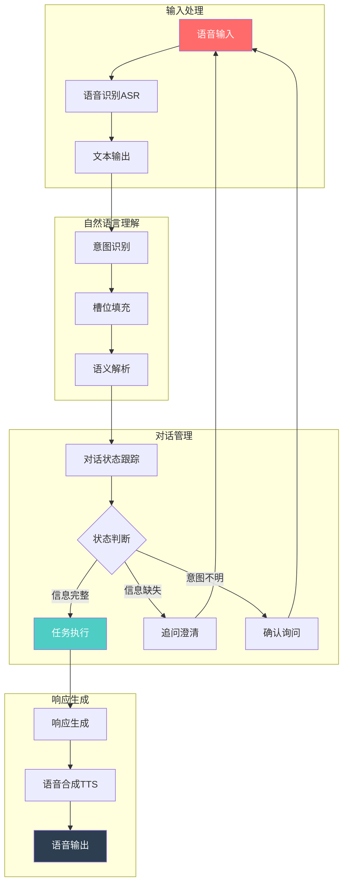
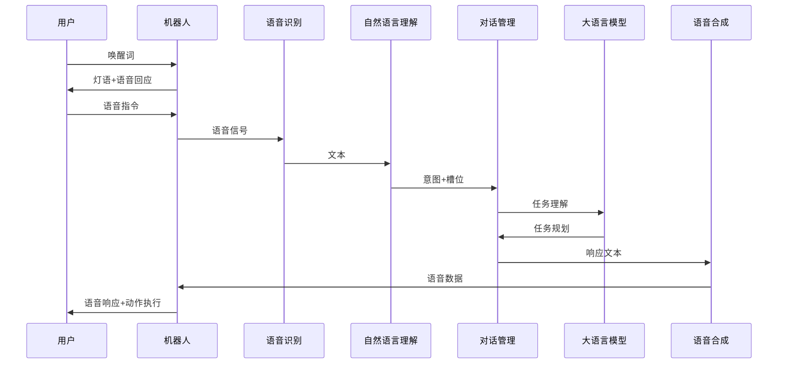
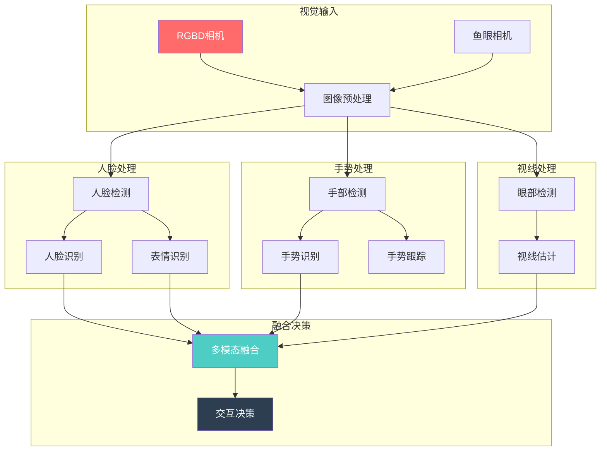
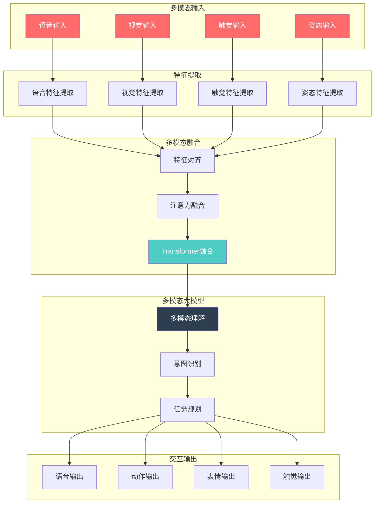
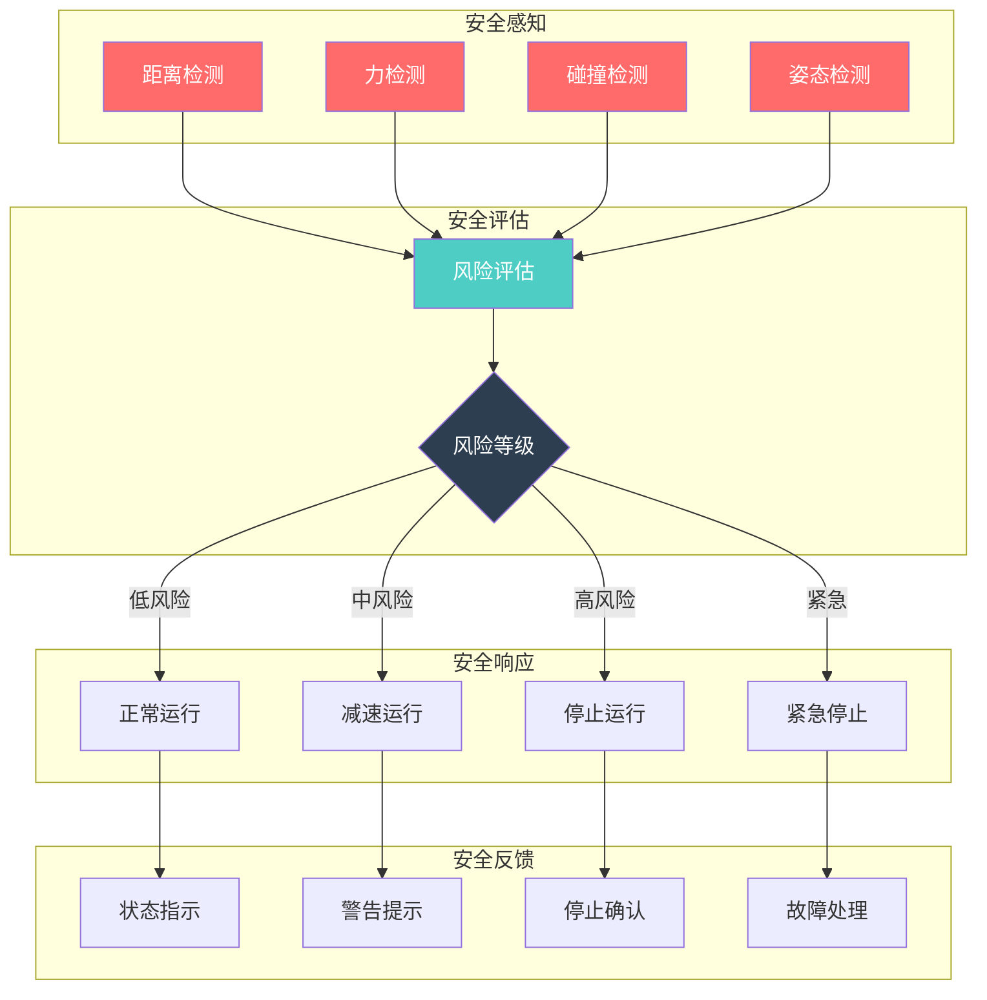

# 优必选 Walker S1 工业人形机器人智能交互系统文档 (IIS)

## 文档信息

- **产品名称**: Walker S1 工业人形机器人
- **产品型号**: Walker S1
- **文档版本**: V1.0
- **编制日期**: 2024年
- **产品定位**: 高端工业级人形机器人

---

## I. 语音交互系统 (Voice Interaction System)

### A. 语音识别（ASR）

#### A.1 语音采集

**麦克风阵列配置** [事实]

| 参数 | 规格 | 说明 |
|------|------|------|
| 麦克风类型 | 驻极体或MEMS麦克风 | 高质量拾音 |
| 麦克风数量 | 6个 | 阵列配置 |
| 布局方式 | 360°环绕分布 | 全向拾音 |
| 指向性 | 全向 | 360°听觉感知 |
| 频率响应 | 100Hz-16kHz | 语音频段 |
| 信噪比 | >60dB | 高质量拾音 |
| 灵敏度 | -35dB±3dB | 灵敏拾音 |
| 有效距离 | 3-5m | 远场拾音 |

**声源定位（DOA估计）** [推理]

| 参数 | 需求规格 | 推理依据 |
|------|---------|---------|
| 定位精度 | ±5° | 6麦克风阵列支持 |
| 定位范围 | 360°全向 | 环绕布局 |
| 定位延迟 | <50ms | 实时交互需求 |
| 算法 | SRP-PHAT/MUSIC | 行业标准声源定位 |

**语音增强技术** [推理]

| 技术模块 | 功能描述 | 技术实现 |
|---------|---------|---------|
| 噪声抑制 | 抑制工业环境噪声 | 深度学习降噪 |
| 回声消除 | 消除扬声器回声 | AEC算法 |
| 语音分离 | 分离多人语音 | 盲源分离 |
| 波束形成 | 增强目标方向语音 | 自适应波束形成 |

#### A.2 语音识别引擎

**识别模型配置** [推理]

| 参数 | 需求规格 | 推理依据 |
|------|---------|---------|
| 识别模型 | Transformer/Conformer | 行业先进模型 |
| 声学模型 | 深度神经网络 | 高精度识别 |
| 语言模型 | N-gram + 神经网络 | 提升准确率 |
| 解码器 | CTC + 注意力机制 | 端到端识别 |
| 语言支持 | 8种语言（含粤语、英语） | 调研报告明确 |

**识别性能指标** [事实]

| 参数 | 规格 | 说明 |
|------|------|------|
| 识别准确率 | 98.7% | 调研报告明确 |
| 支持语言 | 8种（粤语、英语等） | 多语言支持 |
| 识别延迟 | <500ms | 实时交互 |
| 噪声鲁棒性 | SNR≥5dB可用 | 工业环境适应 |

**特殊功能** [推理]

| 功能 | 需求规格 | 推理依据 |
|------|---------|---------|
| 唤醒词检测 | 自定义唤醒词 | 语音交互标配 |
| 命令词识别 | 预定义命令词 | 快速响应 |
| 说话人识别 | 说话人验证/辨识 | 个性化服务 |
| 多语言切换 | 自动语言检测 | 8语言支持 |

#### A.3 语音识别流程

```
语音识别流程:

┌─────────────────────────────────────────────────────────────────────┐
│                        语音输入                                      │
│                          ↓                                          │
│  ┌─────────────────────────────────────────────────────────────┐   │
│  │                    麦克风阵列采集                              │   │
│  │    MIC0 ─┐                                                   │   │
│  │    MIC1 ─┼──→ 波束形成 ──→ 语音增强 ──→ 降噪处理              │   │
│  │    MIC2 ─┤                                                   │   │
│  │    MIC3 ─┤                                                   │   │
│  │    MIC4 ─┤                                                   │   │
│  │    MIC5 ─┘                                                   │   │
│  └─────────────────────────────────────────────────────────────┘   │
│                          ↓                                          │
│  ┌─────────────────────────────────────────────────────────────┐   │
│  │                    语音识别引擎                               │   │
│  │  声学特征提取 ──→ 声学模型 ──→ 语言模型 ──→ 解码器            │   │
│  └─────────────────────────────────────────────────────────────┘   │
│                          ↓                                          │
│                    文本输出                                          │
└─────────────────────────────────────────────────────────────────────┘
```

### B. 语音合成（TTS）

#### B.1 文本处理

**文本规范化** [推理]

| 处理模块 | 功能描述 | 技术实现 |
|---------|---------|---------|
| 数字处理 | 数字转文字 | 规则+统计 |
| 日期处理 | 日期格式转换 | 规则模板 |
| 缩写处理 | 缩写展开 | 词典匹配 |
| 韵律预测 | 停顿、重音预测 | 深度学习 |
| 音素转换 | G2P转换 | 神经网络 |

#### B.2 语音合成引擎

**合成模型配置** [推理]

| 参数 | 需求规格 | 推理依据 |
|------|---------|---------|
| 合成模型 | VITS/FastSpeech2 | 行业先进模型 |
| 声码器 | HiFi-GAN | 高质量合成 |
| 采样率 | 16-48kHz | 高保真输出 |
| 比特率 | 128-256kbps | 高质量音频 |

**合成质量指标** [推理]

| 参数 | 需求规格 | 推理依据 |
|------|---------|---------|
| 自然度MOS | ≥4.0 | 高质量交互 |
| 合成速度RTF | <0.5 | 实时合成 |
| 音质 | 高保真 | 清晰输出 |

**情感表达** [推理]

| 情感类型 | 表达方式 | 应用场景 |
|---------|---------|---------|
| 中性 | 标准语调 | 任务执行 |
| 高兴 | 轻快语调 | 任务完成 |
| 道歉 | 缓慢语调 | 错误处理 |
| 疑问 | 升调 | 确认询问 |

#### B.3 扬声器配置

**扬声器规格** [推理]

| 参数 | 需求规格 | 推理依据 |
|------|---------|---------|
| 扬声器数量 | 2个 | 立体声输出 |
| 功率 | 5-10W | 清晰音量 |
| 频率响应 | 100Hz-20kHz | 全频段 |
| 安装位置 | 头部或躯干 | 声音传播 |

### C. 对话管理

#### C.1 自然语言理解（NLU）

**意图识别** [推理]

| 参数 | 需求规格 | 推理依据 |
|------|---------|---------|
| 意图分类 | 任务类、查询类、控制类 | 工业场景需求 |
| 分类准确率 | ≥95% | 高效交互 |
| 置信度阈值 | 0.7 | 拒识机制 |

**槽位填充** [推理]

| 槽位类型 | 示例 | 说明 |
|---------|------|------|
| 物体类型 | 料箱、零件、工具 | 操作对象 |
| 位置信息 | A区、B区、货架 | 目标位置 |
| 数量信息 | 1个、5箱 | 数量指定 |
| 动作类型 | 搬运、分拣、检测 | 任务类型 |

#### C.2 对话状态管理

**对话状态跟踪** [推理]

| 状态类型 | 描述 | 处理方式 |
|---------|------|---------|
| 初始状态 | 等待用户输入 | 监听状态 |
| 意图识别 | 解析用户意图 | NLU处理 |
| 槽位填充 | 收集必要参数 | 多轮对话 |
| 确认状态 | 确认用户意图 | 确认机制 |
| 执行状态 | 执行任务 | 任务执行 |
| 完成状态 | 反馈执行结果 | 结果播报 |

**上下文管理** [推理]

| 功能 | 描述 | 技术实现 |
|------|------|---------|
| 上下文理解 | 理解代词指代 | 指代消解 |
| 话题跟踪 | 跟踪对话主题 | 话题模型 |
| 历史记录 | 记录对话历史 | 会话管理 |
| 状态恢复 | 恢复中断对话 | 状态保存 |

#### C.3 大语言模型（LLM）集成

**LLM配置** [事实]

| 参数 | 规格 | 说明 |
|------|------|------|
| 模型类型 | 多模态大模型 | DeepSeek-R1 |
| 推理能力 | 常识推理 | 类人类推理 |
| 部署方式 | 端云协同 | BrainNet架构 |
| 功能 | 意图理解、任务规划 | 智能决策 |

**提示工程** [推理]

| 技术方法 | 描述 | 应用场景 |
|---------|------|---------|
| Few-shot学习 | 少样本学习 | 新任务适应 |
| Chain-of-Thought | 思维链推理 | 复杂任务 |
| 角色扮演 | 定义机器人角色 | 交互风格 |
| 任务分解 | 复杂任务分解 | 多步骤任务 |

#### C.4 对话管理流程



### D. 语音交互流程

#### D.1 唤醒流程

**唤醒词检测** [推理]

| 参数 | 需求规格 | 推理依据 |
|------|---------|---------|
| 唤醒词 | 自定义（如"小优小优"） | 品牌定制 |
| 检测灵敏度 | 可调节 | 环境适应 |
| 误唤醒率 | <1次/小时 | 用户体验 |
| 响应延迟 | <300ms | 快速响应 |

**唤醒响应机制** [推理]

```
唤醒响应流程:

用户: "小优小优"
         ↓
机器人: 
  1. LED灯语提示（蓝色闪烁）
  2. 头部转向声源方向
  3. 语音回应："我在，请说"
  4. 进入监听状态
         ↓
用户: "把那个红色的料箱搬到A区"
         ↓
机器人:
  1. 意图识别：搬运任务
  2. 槽位提取：物体=红色料箱，目标=A区
  3. 确认："好的，我将把红色料箱搬到A区"
  4. 执行任务
```

#### D.2 完整交互流程



---

## II. 视觉交互系统 (Visual Interaction System)

### A. 人脸识别

#### A.1 人脸检测

**检测算法配置** [推理]

| 参数 | 需求规格 | 推理依据 |
|------|---------|---------|
| 检测算法 | RetinaFace/YOLO | 行业先进 |
| 检测精度 | mAP≥95% | 高精度检测 |
| 检测速度 | <30ms | 实时检测 |
| 多角度支持 | 正脸/侧脸/仰视/俯视 | 全角度检测 |

**人脸检测性能** [推理]

| 检测条件 | 检测率 | 说明 |
|---------|--------|------|
| 正脸 | ≥99% | 最佳条件 |
| 侧脸（±45°） | ≥95% | 多角度支持 |
| 仰视/俯视（±30°） | ≥90% | 姿态适应 |
| 遮挡（<30%） | ≥85% | 部分遮挡适应 |

#### A.2 人脸识别

**特征提取配置** [推理]

| 参数 | 需求规格 | 推理依据 |
|------|---------|---------|
| 特征提取 | ArcFace/CosFace | 行业先进 |
| 特征维度 | 512维 | 高区分度 |
| 相似度计算 | 余弦相似度 | 标准方法 |

**识别性能指标** [推理]

| 参数 | 需求规格 | 推理依据 |
|------|---------|---------|
| TAR（真接受率） | ≥99% | LFW测试 |
| FAR（假接受率） | ≤0.1% | 安全要求 |
| 识别速度 | <100ms | 实时识别 |
| 人脸库容量 | ≥1000人 | 工业应用 |

**活体检测** [推理]

| 检测方法 | 描述 | 防攻击能力 |
|---------|------|-----------|
| 眨眼检测 | 检测眨眼动作 | 防照片攻击 |
| 动作配合 | 点头/摇头检测 | 防视频攻击 |
| 深度检测 | RGBD深度信息 | 防3D面具 |

#### A.3 人脸识别应用

**应用场景** [推理]

| 场景 | 功能描述 | 应用效果 |
|------|---------|---------|
| 员工识别 | 识别工厂员工 | 权限管理 |
| 访客管理 | 记录访客信息 | 安全管理 |
| 个性化服务 | 识别用户身份 | 定制服务 |
| 考勤管理 | 自动考勤记录 | 效率提升 |

### B. 表情识别

#### B.1 表情检测

**表情分类** [推理]

| 表情类别 | 描述 | 应用场景 |
|---------|------|---------|
| 高兴 | 微笑、大笑 | 正向反馈 |
| 悲伤 | 皱眉、沮丧 | 情感关怀 |
| 愤怒 | 皱眉、咬牙 | 冲突预警 |
| 惊讶 | 睁大眼睛 | 意外响应 |
| 中性 | 正常表情 | 默认状态 |

**表情识别性能** [推理]

| 参数 | 需求规格 | 推理依据 |
|------|---------|---------|
| 识别准确率 | ≥85% | 实际应用需求 |
| 识别速度 | <50ms | 实时响应 |
| 强度估计 | 1-5级 | 情感强度 |

#### B.2 表情响应

**机器人表情表达** [事实]

| 表达方式 | 描述 | 技术实现 |
|---------|------|---------|
| LED灯语 | 不同颜色和模式 | 状态指示 |
| 头部姿态 | 点头、摇头、倾斜 | 姿态表达 |
| 语音语调 | 不同情感语调 | TTS情感控制 |

### C. 手势识别

#### C.1 手势检测

**手部检测配置** [推理]

| 参数 | 需求规格 | 推理依据 |
|------|---------|---------|
| 检测算法 | MediaPipe/YOLO | 行业先进 |
| 关键点数量 | 21个 | 手部关键点 |
| 检测速度 | <30ms | 实时检测 |
| 检测距离 | 0.5-3m | 交互距离 |

#### C.2 手势识别

**手势类别定义** [推理]

| 手势类型 | 描述 | 触发动作 |
|---------|------|---------|
| 挥手 | 左右挥手 | 打招呼/确认 |
| 点赞 | 竖起大拇指 | 正向反馈 |
| 停止 | 手掌向前 | 停止动作 |
| 指向 | 手指指向 | 选择目标 |
| 握拳 | 握紧拳头 | 确认/开始 |
| 比心 | 双手比心 | 表达感谢 |

**手势识别性能** [推理]

| 参数 | 需求规格 | 推理依据 |
|------|---------|---------|
| 识别准确率 | ≥90% | 可靠交互 |
| 识别速度 | <50ms | 实时响应 |
| 动态手势 | 支持序列识别 | 复杂手势 |

#### C.3 手势跟踪

**手部跟踪配置** [推理]

| 参数 | 需求规格 | 推理依据 |
|------|---------|---------|
| 跟踪方式 | 卡尔曼滤波 | 平滑跟踪 |
| 跟踪频率 | 30fps | 实时跟踪 |
| 丢失恢复 | <1秒 | 快速恢复 |

### D. 视线跟踪

#### D.1 视线检测

**视线估计配置** [推理]

| 参数 | 需求规格 | 推理依据 |
|------|---------|---------|
| 检测方法 | 瞳孔检测+视线估计 | 标准方法 |
| 视线精度 | ±5° | 交互精度 |
| 检测速度 | <50ms | 实时检测 |

#### D.2 视线应用

**交互意图理解** [推理]

| 应用场景 | 描述 | 响应方式 |
|---------|------|---------|
| 注意力检测 | 检测用户关注点 | 主动交互 |
| 目标选择 | 确定用户关注目标 | 辅助识别 |
| 交互确认 | 确认用户交互意图 | 执行确认 |

### E. 视觉交互系统架构



---

## III. 触觉交互系统 (Tactile Interaction System)

### A. 触摸检测

#### A.1 触摸传感器配置

**传感器类型** [推理]

| 传感器类型 | 应用部位 | 特点 |
|-----------|---------|------|
| 电容式触摸 | 躯干表面 | 高灵敏度 |
| 电阻式触摸 | 手臂表面 | 成本低 |
| 压电式触摸 | 关键部位 | 响应快 |

**触摸区域布局** [推理]

| 触摸区域 | 位置 | 功能 |
|---------|------|------|
| 头部触摸 | 头顶、后脑 | 交互触发 |
| 躯干触摸 | 胸部、背部 | 安全检测 |
| 手臂触摸 | 上臂、前臂 | 人机协作 |

#### A.2 触摸检测功能

**触摸类型识别** [推理]

| 触摸类型 | 持续时间 | 功能描述 |
|---------|---------|---------|
| 轻触 | <0.5秒 | 选择/确认 |
| 长按 | >1秒 | 模式切换 |
| 滑动 | 移动>5cm | 方向控制 |
| 双击 | 间隔<0.5秒 | 快速确认 |

**触摸力度检测** [推理]

| 力度等级 | 力度范围 | 响应方式 |
|---------|---------|---------|
| 轻触 | 0.1-0.5N | 正常响应 |
| 中等 | 0.5-2N | 加强反馈 |
| 重按 | >2N | 安全警告 |

#### A.3 触摸响应

**响应方式** [推理]

| 响应类型 | 描述 | 技术实现 |
|---------|------|---------|
| 视觉反馈 | LED指示灯 | 状态指示 |
| 触觉反馈 | 振动马达 | 触感确认 |
| 声音反馈 | 提示音 | 听觉确认 |
| 语音反馈 | 语音播报 | 详细说明 |

### B. 力控交互

#### B.1 力传感器配置

**灵巧手触觉传感器** [事实]

| 参数 | 规格 | 说明 |
|------|------|------|
| 传感器类型 | 阵列式触觉压力传感器 | 力分布检测 |
| 数量 | 6个/手 | 每手6个 |
| 分布 | 手指关键部位 | 精准感知 |
| 力测量精度 | 0.1N | 高精度 |
| 力矩测量精度 | 0.01N·m | 高精度 |
| 响应时间 | <1ms | 实时反馈 |
| 检测维度 | Fx、Fy、Fz、Mx、My、Mz | 六维力/力矩 |

**六维力传感器** [推理]

| 参数 | 需求规格 | 推理依据 |
|------|---------|---------|
| 传感器位置 | 脚底、手腕 | 接触力检测 |
| 力量程 | Fx/Fy: ±500N, Fz: ±1000N | 根据应用 |
| 力矩量程 | Mx/My/Mz: ±50N·m | 根据应用 |
| 精度 | 力: 0.5N, 力矩: 0.05N·m | 高精度 |

#### B.2 力感知技术

**力测量方式** [推理]

| 测量方式 | 描述 | 应用场景 |
|---------|------|---------|
| 直接测量 | 力传感器直接测量 | 精确测量 |
| 电流估计 | 基于电机电流估计 | 快速响应 |
| 观测器估计 | 基于动力学观测器 | 补充估计 |

**力反馈控制** [推理]

| 控制模式 | 描述 | 应用场景 |
|---------|------|---------|
| 阻抗控制 | 位置-力关系控制 | 柔顺交互 |
| 导纳控制 | 力-运动关系控制 | 力引导 |
| 混合控制 | 位置/力混合控制 | 精细操作 |

#### B.3 力控交互应用

**导引示教** [推理]

| 功能 | 描述 | 实现方式 |
|------|------|---------|
| 拖动示教 | 人工拖动机器人 | 力引导 |
| 轨迹记录 | 记录运动轨迹 | 位置记录 |
| 力度学习 | 学习操作力度 | 力数据记录 |

**人机协作** [事实]

| 协作模式 | 描述 | 安全措施 |
|---------|------|---------|
| 协作搬运 | 人机共同搬运 | 力限制 |
| 协作装配 | 人机共同装配 | 速度限制 |
| 安全避让 | 检测到人时避让 | 距离监控 |

### C. 触觉反馈

#### C.1 触觉执行器配置

**执行器类型** [推理]

| 执行器类型 | 应用部位 | 特点 |
|-----------|---------|------|
| 振动马达 | 手柄、躯干 | 简单反馈 |
| 线性谐振执行器 | 关键部位 | 精确反馈 |
| 气动执行器 | 手部 | 力反馈 |

#### C.2 触觉反馈模式

**振动反馈模式** [推理]

| 模式 | 振动方式 | 应用场景 |
|------|---------|---------|
| 单次振动 | 短促振动 | 确认反馈 |
| 连续振动 | 持续振动 | 警告提示 |
| 模式振动 | 特定节奏 | 状态指示 |

**力反馈模式** [推理]

| 模式 | 描述 | 应用场景 |
|------|------|---------|
| 阻力反馈 | 提供运动阻力 | 边界提示 |
| 弹性反馈 | 提供弹性力 | 位置反馈 |
| 纹理反馈 | 模拟表面纹理 | 虚拟触感 |

### D. 触觉交互系统架构

```
触觉交互系统架构:

┌─────────────────────────────────────────────────────────────────────┐
│                         触觉感知层                                   │
│  ┌───────────────┐  ┌───────────────┐  ┌───────────────┐          │
│  │ 触摸传感器    │  │ 力传感器      │  │ 压力传感器    │          │
│  │ (电容/电阻)   │  │ (六维力)      │  │ (阵列式)      │          │
│  └───────┬───────┘  └───────┬───────┘  └───────┬───────┘          │
│          │                  │                  │                   │
│          └──────────────────┼──────────────────┘                   │
│                             ↓                                       │
│  ┌─────────────────────────────────────────────────────────────┐   │
│  │                    信号处理与融合                             │   │
│  │  触摸检测 ──→ 力估计 ──→ 接触识别 ──→ 意图理解              │   │
│  └─────────────────────────────────────────────────────────────┘   │
│                             ↓                                       │
│                         交互决策层                                   │
│                             ↓                                       │
│  ┌─────────────────────────────────────────────────────────────┐   │
│  │                    触觉反馈层                                 │   │
│  │  振动反馈 ──→ 力反馈 ──→ 温度反馈 ──→ 复合反馈              │   │
│  └─────────────────────────────────────────────────────────────┘   │
└─────────────────────────────────────────────────────────────────────┘
```

---

## IV. 多模态融合 (Multimodal Fusion)

### A. 多模态感知

#### A.1 模态类型

**输入模态** [事实]

| 模态类型 | 传感器 | 信息内容 |
|---------|--------|---------|
| 语音模态 | 6麦克风阵列 | 语音信号、文本信息 |
| 视觉模态 | RGBD相机、鱼眼相机 | 图像信息、深度信息 |
| 触觉模态 | 触觉传感器、力传感器 | 触摸信息、力信息 |
| 姿态模态 | IMU、编码器 | 姿态信息、位置信息 |

**输出模态** [事实]

| 模态类型 | 执行器 | 信息表达 |
|---------|--------|---------|
| 语音输出 | 扬声器 | 语音反馈 |
| 动作输出 | 关节执行器 | 肢体动作 |
| 表情输出 | LED灯语 | 状态表达 |
| 触觉输出 | 振动马达 | 触感反馈 |

#### A.2 特征提取

**语音特征** [推理]

| 特征类型 | 描述 | 维度 |
|---------|------|------|
| 声学特征 | MFCC、声谱图 | 40-80维 |
| 语义特征 | 文本嵌入 | 512维 |
| 情感特征 | 情感向量 | 8维 |

**视觉特征** [推理]

| 特征类型 | 描述 | 维度 |
|---------|------|------|
| 图像特征 | CNN特征图 | 2048维 |
| 人脸特征 | 人脸嵌入 | 512维 |
| 手势特征 | 关键点坐标 | 42维(21点×2) |

**触觉特征** [推理]

| 特征类型 | 描述 | 维度 |
|---------|------|------|
| 力特征 | 六维力向量 | 6维 |
| 触摸特征 | 触摸位置、类型 | 变长 |
| 压力分布 | 压力分布图 | 2D矩阵 |

### B. 多模态融合策略

#### B.1 融合层次

**层次化融合架构** [推理]

| 融合层次 | 描述 | 优势 |
|---------|------|------|
| 早期融合 | 特征级融合 | 信息完整 |
| 中期融合 | 决策级融合 | 灵活性高 |
| 晚期融合 | 语义级融合 | 可解释性强 |

#### B.2 融合方法

**注意力机制融合** [推理]

| 方法 | 描述 | 应用场景 |
|------|------|---------|
| 跨模态注意力 | 模态间注意力计算 | 语音-视觉对齐 |
| 自注意力 | 模态内注意力计算 | 特征增强 |
| 多头注意力 | 多子空间注意力 | 复杂融合 |

**Transformer融合** [推理]

| 参数 | 需求规格 | 推理依据 |
|------|---------|---------|
| 模型架构 | 多模态Transformer | 行业先进 |
| 注意力头数 | 8-16头 | 计算平衡 |
| 隐藏维度 | 512-1024 | 表达能力 |

#### B.3 多模态大模型

**大模型配置** [事实]

| 参数 | 规格 | 说明 |
|------|------|------|
| 模型类型 | 多模态具身推理大模型 | DeepSeek-R1 |
| 推理能力 | 类人类常识推理 | 智能决策 |
| 部署方式 | 端云协同 | BrainNet架构 |
| 功能 | 多模态理解、任务规划 | 智能交互 |

**多模态理解能力** [推理]

| 能力类型 | 描述 | 应用场景 |
|---------|------|---------|
| 视觉问答 | 图像理解+问答 | 场景理解 |
| 图像描述 | 图像内容描述 | 状态报告 |
| 指代表达 | 指代消解 | 目标定位 |
| 情感理解 | 多模态情感分析 | 情感交互 |

### C. 多模态交互

#### C.1 交互意图理解

**意图识别** [推理]

| 意图类型 | 模态组合 | 示例 |
|---------|---------|------|
| 任务指令 | 语音+手势 | "把那个（指向）给我" |
| 查询问答 | 语音+视觉 | "这是什么？" |
| 情感表达 | 语音+表情 | 表达满意/不满 |
| 协作请求 | 触觉+语音 | 拖动示教+语音说明 |

**意图消歧** [推理]

| 消歧方法 | 描述 | 应用场景 |
|---------|------|---------|
| 多模态验证 | 多模态信息交叉验证 | 意图确认 |
| 上下文推理 | 基于上下文推理 | 代词消解 |
| 主动询问 | 主动询问澄清 | 意图不明 |

#### C.2 交互决策

**决策模型** [推理]

| 模型类型 | 描述 | 优势 |
|---------|------|------|
| 规则引擎 | 基于规则的决策 | 可解释 |
| 强化学习 | 学习最优策略 | 自适应 |
| 混合模型 | 规则+学习结合 | 平衡性 |

**决策执行** [推理]

| 执行步骤 | 描述 | 时间要求 |
|---------|------|---------|
| 意图解析 | 解析用户意图 | <100ms |
| 任务规划 | 生成执行计划 | <500ms |
| 动作生成 | 生成动作序列 | <100ms |
| 动作执行 | 执行动作 | 实时 |

### D. 多模态融合架构图



---

## V. 交互安全 (Interaction Safety)

### A. 人机距离监控

#### A.1 距离检测

**检测方法** [事实]

| 检测方式 | 传感器 | 检测范围 | 响应时间 |
|---------|--------|---------|---------|
| 视觉检测 | RGBD相机、鱼眼相机 | 0.3-10m | <30ms |
| 激光雷达检测 | LiDAR | 0.1-30m | <100ms |
| 红外检测 | 红外传感器 | 0.5-5m | <50ms |

**距离计算** [推理]

| 参数 | 需求规格 | 推理依据 |
|------|---------|---------|
| 检测精度 | ±10cm | 安全监控需求 |
| 更新频率 | 30Hz | 实时监控 |
| 最近距离计算 | 3D距离计算 | 安全边界 |

#### A.2 安全距离设定

**安全区域划分** [推理]

| 区域 | 距离范围 | 安全等级 | 响应措施 |
|------|---------|---------|---------|
| 安全区 | >2m | 低 | 正常运行 |
| 警戒区 | 1-2m | 中 | 减速运行 |
| 危险区 | 0.5-1m | 高 | 停止准备 |
| 禁止区 | <0.5m | 最高 | 立即停止 |

**人机安全距离图**

```
人机安全距离示意图:

                    安全区 (>2m)
        ┌─────────────────────────────────────┐
        │                                      │
        │      警戒区 (1-2m)                   │
        │   ┌─────────────────────────────┐   │
        │   │                              │   │
        │   │    危险区 (0.5-1m)           │   │
        │   │  ┌───────────────────────┐  │   │
        │   │  │                        │  │   │
        │   │  │   禁止区 (<0.5m)       │  │   │
        │   │  │  ┌─────────────────┐  │  │   │
        │   │  │  │                  │  │  │   │
        │   │  │  │    ┌───────┐    │  │  │   │
        │   │  │  │    │ 机器人│    │  │  │   │
        │   │  │  │    │   R    │    │  │  │   │
        │   │  │  │    └───────┘    │  │  │   │
        │   │  │  │                  │  │  │   │
        │   │  │  └─────────────────┘  │  │   │
        │   │  │                        │  │   │
        │   │  └───────────────────────┘  │   │
        │   │                              │   │
        │   └─────────────────────────────┘   │
        │                                      │
        └─────────────────────────────────────┘

响应策略:
- 安全区: 正常运行，无限制
- 警戒区: 降低速度至50%，增强监控
- 危险区: 降低速度至20%，准备停止
- 禁止区: 立即停止，等待人工干预
```

#### A.3 距离预警与响应

**预警机制** [推理]

| 预警级别 | 触发条件 | 预警方式 |
|---------|---------|---------|
| 一级预警 | 进入警戒区 | LED黄色闪烁 |
| 二级预警 | 进入危险区 | LED红色闪烁+语音提示 |
| 三级预警 | 进入禁止区 | 语音警告+立即停止 |

**响应措施** [事实]

| 响应类型 | 描述 | 响应时间 |
|---------|------|---------|
| 减速 | 降低运动速度 | <100ms |
| 停止 | 停止运动 | <50ms |
| 避让 | 主动避让 | <200ms |
| 后退 | 向后移动 | <300ms |

### B. 力限制与速度限制

#### B.1 力限制

**接触力限制** [事实]

| 限制类型 | 限制值 | 说明 |
|---------|--------|------|
| 最大接触力 | 150N | 安全接触力 |
| 持续接触力 | 65N | 持续接触限制 |
| 碰撞力限制 | 130N | 碰撞力上限 |

**关节扭矩限制** [推理]

| 关节类型 | 最大扭矩 | 安全扭矩 | 说明 |
|---------|---------|---------|------|
| 核心关节 | 250N·m | 150N·m | 髋、膝关节 |
| 手臂关节 | 100N·m | 60N·m | 肩、肘关节 |
| 手指关节 | 10N·m | 5N·m | 灵巧手 |

#### B.2 速度限制

**运动速度限制** [推理]

| 运动类型 | 正常速度 | 交互速度 | 说明 |
|---------|---------|---------|------|
| 行走速度 | 3km/h | 1km/h | 人机交互时 |
| 手臂速度 | 1m/s | 0.3m/s | 协作时 |
| 手指速度 | 0.5m/s | 0.2m/s | 操作时 |

**接近速度限制** [推理]

| 距离范围 | 速度限制 | 说明 |
|---------|---------|------|
| >2m | 不限制 | 安全区 |
| 1-2m | 50%速度 | 警戒区 |
| 0.5-1m | 20%速度 | 危险区 |
| <0.5m | 停止 | 禁止区 |

### C. 碰撞检测与响应

#### C.1 碰撞检测

**检测方法** [事实]

| 检测方式 | 检测原理 | 响应时间 | 检测精度 |
|---------|---------|---------|---------|
| 力传感器检测 | 力传感器检测异常力 | <10ms | 高 |
| 电流检测 | 电机电流异常检测 | <5ms | 中 |
| 观测器检测 | 动量/扰动观测器 | <20ms | 中 |
| 电子皮肤 | 触觉传感器检测 | <10ms | 高 |

**碰撞检测阈值** [推理]

| 检测类型 | 阈值设置 | 说明 |
|---------|---------|------|
| 力阈值 | 50N | 接触力检测 |
| 扭矩阈值 | 5N·m | 关节扭矩检测 |
| 电流阈值 | 1.5倍额定 | 电机电流检测 |

#### C.2 碰撞响应

**响应策略** [事实]

| 响应级别 | 触发条件 | 响应动作 |
|---------|---------|---------|
| 轻微接触 | 力<30N | 记录日志，继续运行 |
| 中等碰撞 | 力30-80N | 减速，调整轨迹 |
| 严重碰撞 | 力>80N | 立即停止，后退 |

**碰撞恢复** [推理]

| 恢复步骤 | 描述 | 时间要求 |
|---------|------|---------|
| 碰撞检测 | 检测碰撞事件 | <10ms |
| 紧急停止 | 停止所有运动 | <50ms |
| 状态评估 | 评估碰撞影响 | <500ms |
| 安全后退 | 向后移动安全距离 | <1s |
| 等待确认 | 等待人工确认 | 人工操作 |
| 恢复运行 | 恢复正常操作 | <1s |

### D. 安全交互模式

#### D.1 协作模式

**协作模式配置** [推理]

| 模式类型 | 描述 | 安全措施 |
|---------|------|---------|
| 协作搬运 | 人机共同搬运物体 | 力限制、速度限制 |
| 协作装配 | 人机共同装配零件 | 位置限制、力限制 |
| 演示学习 | 人工演示机器人学习 | 柔顺控制、力限制 |
| 远程操作 | 远程控制机器人 | 延迟补偿、安全停止 |

#### D.2 安全监控

**实时监控参数** [推理]

| 监控参数 | 监控方式 | 报警阈值 |
|---------|---------|---------|
| 人机距离 | 视觉+LiDAR | <0.5m |
| 接触力 | 力传感器 | >50N |
| 关节扭矩 | 扭矩传感器 | >安全值 |
| 运动速度 | 编码器 | >限制值 |
| 电池电量 | BMS | <20% |
| 系统温度 | 温度传感器 | >70°C |

### E. 交互安全系统架构



---

## VI. 交互场景设计 (Interaction Scenario Design)

### A. 日常交互场景

#### A.1 问候场景

**问候场景流程**

```
问候场景交互流程:

时间轴:
┌─────────────────────────────────────────────────────────────────────┐
│ 用户进入检测范围                                                    │
│    ↓                                                                │
│ ┌─────────────────────────────────────────────────────────────────┐│
│ │ T0: 视觉检测到用户                                               ││
│ │     - 人脸检测: 检测到人脸                                       ││
│ │     - 距离估计: 约3米                                            ││
│ │     - 身份识别: 识别为员工张三                                   ││
│ └─────────────────────────────────────────────────────────────────┘│
│    ↓                                                                │
│ ┌─────────────────────────────────────────────────────────────────┐│
│ │ T1: 机器人响应 (延迟<500ms)                                      ││
│ │     - 头部转向: 转向用户方向                                     ││
│ │     - LED灯语: 蓝色常亮                                          ││
│ │     - 语音输出: "张三，你好！"                                   ││
│ └─────────────────────────────────────────────────────────────────┘│
│    ↓                                                                │
│ ┌─────────────────────────────────────────────────────────────────┐│
│ │ T2: 等待用户响应                                                 ││
│ │     - 监听状态: 等待用户语音                                     ││
│ │     - 视觉跟踪: 跟踪用户位置                                     ││
│ └─────────────────────────────────────────────────────────────────┘│
│    ↓                                                                │
│ 用户: "小优，今天有什么任务？"                                      │
│    ↓                                                                │
│ ┌─────────────────────────────────────────────────────────────────┐│
│ │ T3: 任务查询响应                                                 ││
│ │     - 语音识别: 识别用户问题                                     ││
│ │     - 意图理解: 查询任务列表                                     ││
│ │     - 数据检索: 查询MES系统                                      ││
│ │     - 语音响应: "今天有3项任务..."                               ││
│ └─────────────────────────────────────────────────────────────────┘│
└─────────────────────────────────────────────────────────────────────┘
```

#### A.2 指令执行场景

**语音指令执行流程**

```
指令执行场景:

用户: "把红色料箱搬到A区货架"

┌─────────────────────────────────────────────────────────────────────┐
│ Step 1: 语音识别                                                    │
│ ┌─────────────────────────────────────────────────────────────────┐│
│ │ ASR输出: "把红色料箱搬到A区货架"                                 ││
│ │ 置信度: 0.95                                                    ││
│ └─────────────────────────────────────────────────────────────────┘│
│                          ↓                                          │
│ Step 2: 意图理解                                                    │
│ ┌─────────────────────────────────────────────────────────────────┐│
│ │ 意图类型: 搬运任务                                               ││
│ │ 槽位提取:                                                        ││
│ │   - 物体类型: 红色料箱                                           ││
│ │   - 目标位置: A区货架                                            ││
│ │   - 动作类型: 搬运                                               ││
│ └─────────────────────────────────────────────────────────────────┘│
│                          ↓                                          │
│ Step 3: 任务确认                                                    │
│ ┌─────────────────────────────────────────────────────────────────┐│
│ │ 机器人: "好的，我将把红色料箱搬到A区货架，请确认"               ││
│ │ 用户: "确认" 或 "取消"                                           ││
│ └─────────────────────────────────────────────────────────────────┘│
│                          ↓                                          │
│ Step 4: 任务执行                                                    │
│ ┌─────────────────────────────────────────────────────────────────┐│
│ │ 4.1 视觉搜索: 搜索红色料箱位置                                   ││
│ │ 4.2 路径规划: 规划到料箱的路径                                   ││
│ │ 4.3 移动到目标: 移动到料箱位置                                   ││
│ │ 4.4 抓取料箱: 使用灵巧手抓取                                     ││
│ │ 4.5 搬运到目标: 搬运到A区货架                                    ││
│ │ 4.6 放置料箱: 放置到指定位置                                     ││
│ └─────────────────────────────────────────────────────────────────┘│
│                          ↓                                          │
│ Step 5: 结果反馈                                                    │
│ ┌─────────────────────────────────────────────────────────────────┐│
│ │ 机器人: "任务完成，红色料箱已放置到A区货架"                     ││
│ │ LED灯语: 绿色常亮（表示完成）                                    ││
│ └─────────────────────────────────────────────────────────────────┘│
└─────────────────────────────────────────────────────────────────────┘
```

#### A.3 问答场景

**多模态问答流程**

```
问答场景:

用户指向一个物体并问: "这是什么？"

┌─────────────────────────────────────────────────────────────────────┐
│ Step 1: 多模态输入                                                  │
│ ┌─────────────────────────────────────────────────────────────────┐│
│ │ 语音输入: "这是什么？"                                           ││
│ │ 手势输入: 指向动作                                               ││
│ │ 视觉输入: 指向方向的图像                                         ││
│ └─────────────────────────────────────────────────────────────────┘│
│                          ↓                                          │
│ Step 2: 多模态融合                                                  │
│ ┌─────────────────────────────────────────────────────────────────┐│
│ │ 语音理解: 查询问题                                               ││
│ │ 手势理解: 指向目标                                               ││
│ │ 视觉理解: 目标物体识别                                           ││
│ │ 融合结果: 查询指向物体的信息                                     ││
│ └─────────────────────────────────────────────────────────────────┘│
│                          ↓                                          │
│ Step 3: 目标识别                                                    │
│ ┌─────────────────────────────────────────────────────────────────┐│
│ │ 视觉识别:                                                        ││
│ │   - 物体类型: 汽车零件                                           ││
│ │   - 具体名称: 车门锁                                             ││
│ │   - 编号: DL-2024-001                                            ││
│ └─────────────────────────────────────────────────────────────────┘│
│                          ↓                                          │
│ Step 4: 信息检索                                                    │
│ ┌─────────────────────────────────────────────────────────────────┐│
│ │ MES系统查询:                                                     ││
│ │   - 零件名称: 车门锁                                             ││
│ │   - 生产批次: B2024-001                                          ││
│ │   - 质检状态: 待检测                                             ││
│ └─────────────────────────────────────────────────────────────────┘│
│                          ↓                                          │
│ Step 5: 语音响应                                                    │
│ ┌─────────────────────────────────────────────────────────────────┐│
│ │ 机器人: "这是车门锁，编号DL-2024-001，                           ││
│ │         生产批次B2024-001，当前状态为待检测"                     ││
│ └─────────────────────────────────────────────────────────────────┘│
└─────────────────────────────────────────────────────────────────────┘
```

### B. 特殊交互场景

#### B.1 情感陪伴场景

**情感识别与响应** [推理]

| 用户情感 | 识别方式 | 机器人响应 |
|---------|---------|-----------|
| 高兴 | 表情识别+语音情感 | 共同高兴，语音祝贺 |
| 悲伤 | 表情识别+语音情感 | 安慰语音，温和动作 |
| 愤怒 | 表情识别+语音情感 | 保持距离，冷静回应 |
| 疑惑 | 表情识别+语音语调 | 主动询问，提供帮助 |

#### B.2 教育辅导场景

**知识问答功能** [推理]

| 问题类型 | 处理方式 | 响应方式 |
|---------|---------|---------|
| 事实性问题 | 知识库检索 | 直接回答 |
| 操作性问题 | 规则推理 | 步骤指导 |
| 推理性问题 | LLM推理 | 详细解释 |
| 开放性问题 | LLM生成 | 自由回答 |

#### B.3 服务协助场景

**物品递送服务** [推理]

| 服务步骤 | 描述 | 时间要求 |
|---------|------|---------|
| 需求识别 | 识别用户需求 | <1s |
| 物品定位 | 定位目标物品 | <2s |
| 路径规划 | 规划递送路径 | <1s |
| 物品获取 | 获取物品 | <10s |
| 递送执行 | 递送到用户 | 根据距离 |
| 完成确认 | 确认用户接收 | <1s |

### C. 交互流程时序图

```
多模态交互流程时序图:

时间轴 →
┌────────┬────────┬────────┬────────┬────────┬────────┬────────┬────────┐
│  0ms   │  100ms │  200ms │  300ms │  500ms │  800ms │ 1000ms │ 1500ms │
├────────┼────────┼────────┼────────┼────────┼────────┼────────┼────────┤
│        │        │        │        │        │        │        │        │
│ 语音   │████████│        │        │        │        │        │        │
│ 输入   │ 采集   │        │        │        │        │        │        │
│        │        │        │        │        │        │        │        │
├────────┼────────┼────────┼────────┼────────┼────────┼────────┼────────┤
│        │        │████████│████████│        │        │        │        │
│ 视觉   │        │ 采集   │ 处理   │        │        │        │        │
│ 输入   │        │        │        │        │        │        │        │
│        │        │        │        │        │        │        │        │
├────────┼────────┼────────┼────────┼────────┼────────┼────────┼────────┤
│        │        │        │████████│████████│████████│        │        │
│ 触觉   │        │        │ 检测   │ 处理   │ 融合   │        │        │
│ 输入   │        │        │        │        │        │        │        │
│        │        │        │        │        │        │        │        │
├────────┼────────┼────────┼────────┼────────┼────────┼────────┼────────┤
│        │        │        │        │        │████████│████████│████████│
│ 信息   │        │        │        │        │ 特征   │ 融合   │ 意图   │
│ 处理   │        │        │        │        │ 提取   │ 决策   │ 理解   │
│        │        │        │        │        │        │        │        │
├────────┼────────┼────────┼────────┼────────┼────────┼────────┼────────┤
│        │        │        │        │        │        │        │████████│
│ 交互   │        │        │        │        │        │        │ 响应   │
│ 输出   │        │        │        │        │        │        │ 生成   │
│        │        │        │        │        │        │        │        │
└────────┴────────┴────────┴────────┴────────┴────────┴────────┴────────┘

图例:
████████ 表示活动状态
语音输入: 麦克风阵列采集语音信号
视觉输入: RGBD相机采集图像数据
触觉输入: 触觉/力传感器采集触觉数据
信息处理: 特征提取、多模态融合、意图理解
交互输出: 语音合成、动作生成、表情表达
```

---

## VII. 系统集成与优化

### A. 计算资源分配

#### A.1 硬件资源

**计算平台配置** [事实]

| 资源类型 | 规格 | 分配用途 |
|---------|------|---------|
| CPU | Intel i7 8665U ×2 | 逻辑控制、任务调度 |
| GPU | NVIDIA GT1030 (384核心) | 视觉处理、深度学习 |
| 内存 | ≥16GB DDR4 | 数据缓存、模型加载 |
| 存储 | ≥256GB SSD | 系统、模型、日志 |

#### A.2 资源分配策略

**计算资源分配** [推理]

| 功能模块 | CPU占用 | GPU占用 | 内存占用 | 优先级 |
|---------|---------|---------|---------|--------|
| 语音识别 | 10% | 5% | 500MB | 高 |
| 语音合成 | 5% | 5% | 200MB | 中 |
| 人脸识别 | 5% | 15% | 300MB | 高 |
| 手势识别 | 5% | 10% | 200MB | 中 |
| 多模态融合 | 10% | 20% | 500MB | 高 |
| LLM推理 | 20% | 30% | 2GB | 高 |
| 安全监控 | 10% | 5% | 200MB | 最高 |

### B. 实时性优化

#### B.1 延迟优化

**关键路径延迟** [推理]

| 处理环节 | 目标延迟 | 优化方法 |
|---------|---------|---------|
| 语音采集 | <10ms | 高速ADC |
| 语音识别 | <300ms | 模型优化 |
| 意图理解 | <100ms | 规则+模型 |
| 响应生成 | <100ms | 预生成模板 |
| 语音合成 | <200ms | 流式合成 |
| 总延迟 | <800ms | 流水线优化 |

#### B.2 并行处理

**并行处理策略** [推理]

| 并行方式 | 描述 | 应用场景 |
|---------|------|---------|
| 数据并行 | 多数据并行处理 | 传感器数据 |
| 任务并行 | 多任务并行执行 | 语音+视觉 |
| 流水线并行 | 流水线处理 | 识别流程 |

### C. 鲁棒性优化

#### C.1 噪声鲁棒性

**噪声处理策略** [推理]

| 噪声类型 | 处理方法 | 效果 |
|---------|---------|------|
| 环境噪声 | 深度学习降噪 | SNR提升10dB |
| 语音干扰 | 盲源分离 | 分离成功>90% |
| 视觉遮挡 | 多视角融合 | 识别率保持>85% |

#### C.2 异常处理

**异常处理机制** [推理]

| 异常类型 | 检测方法 | 处理方式 |
|---------|---------|---------|
| 识别失败 | 置信度检测 | 请求重说 |
| 意图不明 | 意图分类失败 | 主动询问 |
| 执行失败 | 执行监控 | 错误恢复 |
| 通信中断 | 心跳检测 | 重连机制 |

---

## VIII. 需求确认检查清单

### 语音交互系统确认

- [x] 语音采集是否完整？(麦克风阵列、声源定位、语音增强)
- [x] 语音识别是否完整？(识别引擎、识别性能、特殊功能)
- [x] 语音合成是否完整？(文本处理、合成引擎、情感表达)
- [x] 对话管理是否完整？(NLU、对话状态、LLM集成)
- [x] 语音交互流程是否完整？(唤醒流程、完整交互流程)

### 视觉交互系统确认

- [x] 人脸识别是否完整？(人脸检测、人脸识别、活体检测)
- [x] 表情识别是否完整？(表情检测、表情响应)
- [x] 手势识别是否完整？(手势检测、手势识别、手势跟踪)
- [x] 视线跟踪是否完整？(视线检测、视线应用)
- [x] 视觉交互架构图是否提供？(Mermaid图)

### 触觉交互系统确认

- [x] 触摸检测是否完整？(触摸传感器、触摸类型、触摸响应)
- [x] 力控交互是否完整？(力传感器、力感知、力控应用)
- [x] 触觉反馈是否完整？(执行器配置、反馈模式)
- [x] 触觉交互架构图是否提供？(ASCII图)

### 多模态融合确认

- [x] 多模态感知是否完整？(模态类型、特征提取)
- [x] 融合策略是否完整？(融合层次、融合方法、大模型)
- [x] 多模态交互是否完整？(意图理解、交互决策)
- [x] 多模态融合架构图是否提供？(Mermaid图)

### 交互安全确认

- [x] 人机距离监控是否完整？(距离检测、安全距离、预警响应)
- [x] 力限制与速度限制是否完整？(力限制、速度限制)
- [x] 碰撞检测与响应是否完整？(碰撞检测、碰撞响应)
- [x] 安全交互模式是否完整？(协作模式、安全监控)
- [x] 人机安全距离图是否提供？(ASCII图)

### 交互场景设计确认

- [x] 日常交互场景是否完整？(问候、指令执行、问答)
- [x] 特殊交互场景是否完整？(情感陪伴、教育辅导、服务协助)
- [x] 交互场景图是否提供？(ASCII图)
- [x] 交互流程时序图是否提供？(ASCII图)

---

## IX. 文档修订记录

| 版本 | 日期 | 修订内容 | 修订人 |
|------|------|---------|--------|
| V1.0 | 2024年 | 初始版本，基于调研报告、HRS和ICD生成 | 交互系统团队 |

---

**文档说明**:
- 本文档基于《优必选Walker S1调研报告》、《03硬件需求说明书-HRS》和《05接口控制文档-ICD》生成
- 标注[事实]的内容直接引用自调研报告，严禁修改
- 标注[关联]的内容基于报告中A信息推导出的B逻辑
- 标注[推理]的内容为调研缺失，基于行业主流交互系统设计逻辑补全
- 本文档作为智能交互系统开发的基准需求文档，后续变更需经过评审流程
