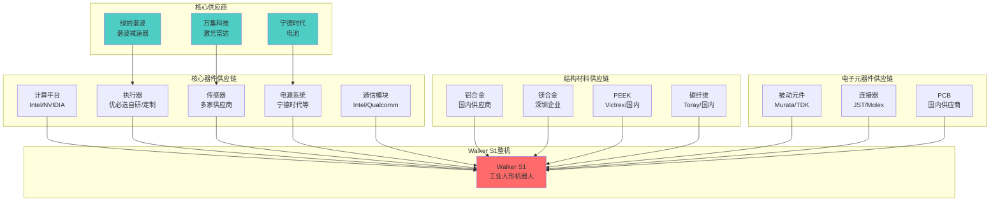
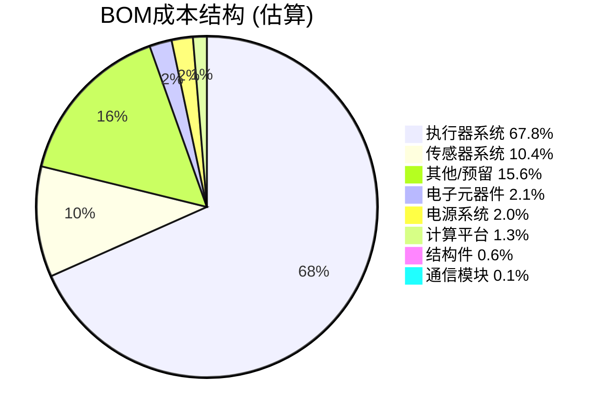
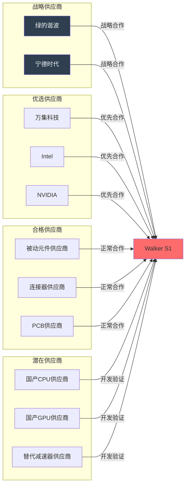

# 优必选 Walker S1 工业人形机器人供应链与成本分析 (SCA)

## 文档信息

- **产品名称**: Walker S1 工业人形机器人
- **产品型号**: Walker S1
- **文档版本**: V1.0
- **编制日期**: 2024年
- **产品定位**: 高端工业级人形机器人

---

## I. 核心器件供应链 (Core Component Supply Chain)

### A. 计算平台供应链

#### A.1 主控芯片

**CPU配置** [事实]

| 参数 | 规格 | 供应商 | 采购价格估算 | 供货周期 |
|------|------|--------|-------------|---------|
| 主控芯片 | Intel i7 8665U (双路) | Intel | 约2,000-3,000元/颗 | 8-12周 |
| CPU架构 | x86-64, 14nm工艺 | Intel | - | - |
| 核心数 | 4核8线程 × 2 | Intel | - | - |
| 基础频率 | 1.9GHz | Intel | - | - |
| 最高睿频 | 4.2GHz | Intel | - | - |
| TDP | 15W (单颗) | Intel | - | - |

**替代方案** [推理]

| 替代型号 | 供应商 | 性能对比 | 价格对比 | 可行性 |
|---------|--------|---------|---------|--------|
| AMD Ryzen 7 8840U | AMD | 性能相当 | 价格略低 | 高 |
| Intel i7 1365U | Intel | 性能更强 | 价格相当 | 高 |

**GPU配置** [事实]

| 参数 | 规格 | 供应商 | 采购价格估算 | 供货周期 |
|------|------|--------|-------------|---------|
| GPU型号 | NVIDIA GT1030 | NVIDIA | 约500-800元 | 6-10周 |
| CUDA核心 | 384个 | NVIDIA | - | - |
| 显存容量 | 2GB GDDR5 | Samsung/Micron | - | - |
| 功耗 | 30W | NVIDIA | - | - |

**替代方案** [推理]

| 替代型号 | 供应商 | 性能对比 | 价格对比 | 可行性 |
|---------|--------|---------|---------|--------|
| NVIDIA Jetson Orin | NVIDIA | AI算力更强 | 价格较高 | 中 |
| AMD RX 640 | AMD | 性能相当 | 价格略低 | 高 |

#### A.2 存储芯片

**内存配置** [推理]

| 参数 | 需求规格 | 供应商 | 采购价格估算 | 供货周期 |
|------|---------|--------|-------------|---------|
| 内存容量 | ≥16GB DDR4 | Samsung/Micron/SK Hynix | 约300-500元 | 4-8周 |
| 内存类型 | DDR4-2400/2666 | Samsung/Micron/SK Hynix | - | - |
| 内存通道 | 双通道 | - | - | - |

**存储配置** [推理]

| 参数 | 需求规格 | 供应商 | 采购价格估算 | 供货周期 |
|------|---------|--------|-------------|---------|
| 存储容量 | ≥256GB SSD | Samsung/Western Digital | 约200-400元 | 4-8周 |
| 存储类型 | NVMe SSD | Samsung/Western Digital | - | - |
| 读取速度 | ≥500MB/s | - | - | - |

### B. 执行器供应链

#### B.1 伺服电机

**电机配置** [事实]

| 参数 | 规格 | 供应商 | 采购价格估算 | 供货周期 |
|------|------|--------|-------------|---------|
| 电机类型 | 无框力矩电机 | 优必选自研/定制 | 约2,000-5,000元/个 | 12-16周 |
| 数量 | 41个 | - | - | - |
| 额定功率 | 100-500W (不同关节) | - | - | - |
| 额定扭矩 | 1-50Nm (电机端) | - | - | - |

**供应商分析** [推理]

| 供应商类型 | 供应商 | 产品特点 | 价格水平 | 供货稳定性 |
|-----------|--------|---------|---------|-----------|
| 国际一线 | Maxon/Faulhaber | 高性能、高精度 | 高 | 稳定 |
| 国际二线 | Kollmorgen | 性能较好 | 中高 | 稳定 |
| 国内供应商 | 优必选自研/国内定制 | 性价比高 | 中 | 需培养 |

**替代方案** [推理]

| 替代型号 | 供应商 | 性能对比 | 价格对比 | 可行性 |
|---------|--------|---------|---------|--------|
| Maxon EC系列 | Maxon | 性能更强 | 价格高2-3倍 | 高 |
| Faulhaber系列 | Faulhaber | 性能更强 | 价格高2-3倍 | 高 |

#### B.2 减速器

**谐波减速器配置** [事实]

| 参数 | 规格 | 供应商 | 采购价格估算 | 供货周期 |
|------|------|--------|-------------|---------|
| 主要类型 | 谐波减速器 | 绿的谐波 | 5,000-8,000元/个 | 8-12周 |
| 占采购量 | 超过40%关节总成 | 绿的谐波 | - | - |
| 重复定位精度 | ±0.05° | 绿的谐波 | - | - |
| 控制误差 | ≤0.1° | 绿的谐波 | - | - |
| 寿命 | >30,000小时 | 绿的谐波 | - | - |

**谐波减速器供应商分析** [关联]

| 供应商 | 市场地位 | 产品特点 | 价格水平 | 单机价值量 |
|--------|---------|---------|---------|-----------|
| 绿的谐波 | 国内龙头 | 高精度、长寿命 | 中 | 5,000-8,000元 |
| Harmonic Drive | 国际龙头 | 最高精度 | 高 | 8,000-15,000元 |
| 新宝谐波 | 国内二线 | 性价比高 | 中低 | 3,000-5,000元 |
| 来福谐波 | 国内二线 | 性价比高 | 中低 | 3,000-5,000元 |

**行星减速器配置** [推理]

| 参数 | 需求规格 | 供应商 | 采购价格估算 | 供货周期 |
|------|---------|--------|-------------|---------|
| 应用部位 | 髋、膝等大扭矩关节 | 新宝/来福/国内供应商 | 2,000-4,000元/个 | 6-10周 |
| 减速比 | 80:1~120:1 | - | - | - |
| 传动效率 | ≥90% | - | - | - |

#### B.3 电机驱动器

**驱动器配置** [推理]

| 参数 | 需求规格 | 供应商 | 采购价格估算 | 供货周期 |
|------|---------|--------|-------------|---------|
| 驱动芯片 | 电机驱动芯片 | TI/Infineon/ST | 约200-500元/个 | 6-10周 |
| 数量 | 41个关节驱动器 | - | - | - |
| 控制模式 | 位置/速度/力矩/电流 | - | - | - |
| 通信接口 | EtherCAT | - | - | - |

### C. 传感器供应链

#### C.1 IMU传感器

**IMU配置** [推理]

| 参数 | 需求规格 | 供应商 | 采购价格估算 | 供货周期 |
|------|---------|--------|-------------|---------|
| 类型 | 6轴或9轴IMU | Xsens/InvenSense/ST/Bosch | 约500-2,000元 | 4-8周 |
| 数量 | 1-2个 | - | - | - |
| 陀螺仪精度 | 0.01°/s | - | - | - |
| 加速度计精度 | 0.001g | - | - | - |
| 更新频率 | 1kHz | - | - | - |

#### C.2 编码器

**编码器配置** [推理]

| 参数 | 需求规格 | 供应商 | 采购价格估算 | 供货周期 |
|------|---------|--------|-------------|---------|
| 类型 | 绝对值编码器 | Heidenhain/Sick/Omron/国内 | 约300-800元/个 | 6-10周 |
| 数量 | 41个 | - | - | - |
| 分辨率 | ≥17bit | - | - | - |
| 精度 | ±0.01° | - | - | - |

#### C.3 力传感器

**六维力传感器配置** [推理]

| 参数 | 需求规格 | 供应商 | 采购价格估算 | 供货周期 |
|------|---------|--------|-------------|---------|
| 类型 | 六维力/力矩传感器 | ATI/Robotiq/OnRobot/国内 | 约3,000-10,000元/个 | 8-12周 |
| 数量 | 2-4个 | - | - | - |
| 量程 | 力: ±500N, 力矩: ±50N·m | - | - | - |
| 精度 | 力: 0.5N, 力矩: 0.05N·m | - | - | - |

**触觉传感器配置** [事实]

| 参数 | 规格 | 供应商 | 采购价格估算 | 供货周期 |
|------|------|--------|-------------|---------|
| 类型 | 阵列式触觉压力传感器 | 定制/国内供应商 | 约500-1,500元/个 | 8-12周 |
| 数量 | 12个 (6个/手) | - | - | - |
| 检测量 | Fx、Fy、Fz、Mx、My、Mz | - | - | - |

#### C.4 视觉传感器

**视觉传感器配置** [事实]

| 传感器类型 | 数量 | 供应商 | 采购价格估算 | 供货周期 |
|-----------|------|--------|-------------|---------|
| RGBD深度相机 | 4个 | Intel/Orbbec/国内 | 约1,000-3,000元/个 | 4-8周 |
| 全景鱼眼相机 | 2个 | 定制/国内供应商 | 约800-2,000元/个 | 6-10周 |
| 分辨率 | 1920×1080, 30fps | - | - | - |
| 视场角 | 鱼眼180° | - | - | - |

#### C.5 激光雷达

**激光雷达配置** [关联]

| 参数 | 规格 | 供应商 | 采购价格估算 | 供货周期 |
|------|------|--------|-------------|---------|
| 型号 | WLR-750 | 万集科技 | 约3,000元/个 | 8-12周 |
| 数量 | 2个 | 万集科技 | 总价约6,000元 | - |
| 测距精度 | ±1cm~±5mm | 万集科技 | - | - |
| 测距范围 | 0.1-30m | 万集科技 | - | - |
| 视场角 | 360°水平 | 万集科技 | - | - |

**激光雷达供应商分析** [关联]

| 供应商 | 市场地位 | 产品特点 | 价格水平 | 单机价值量 |
|--------|---------|---------|---------|-----------|
| 万集科技 | 国内供应商 | 性价比高 | 中 | 约6,000元 (2颗) |
| Velodyne | 国际龙头 | 最高性能 | 高 | 15,000-30,000元 |
| Hesai禾赛 | 国内龙头 | 高性能 | 中高 | 8,000-15,000元 |
| RoboSense速腾 | 国内一线 | 高性能 | 中 | 6,000-12,000元 |

### D. 电源系统供应链

#### D.1 电池

**电池配置** [事实]

| 参数 | 规格 | 供应商 | 采购价格估算 | 供货周期 |
|------|------|--------|-------------|---------|
| 电池类型 | 锂电池 | 宁德时代/比亚迪/LG Chem | 约5,000-10,000元 | 8-12周 |
| 电压平台 | 54.6V | - | - | - |
| 容量 | 10Ah | - | - | - |
| 能量 | 546Wh | - | - | - |
| 重量 | 3.6kg | - | - | - |
| 能量密度 | 约150Wh/kg | - | - | - |

**电池供应商分析** [推理]

| 供应商 | 市场地位 | 产品特点 | 价格水平 | 供货稳定性 |
|--------|---------|---------|---------|-----------|
| 宁德时代 | 全球龙头 | 高能量密度、高安全性 | 中高 | 稳定 |
| 比亚迪 | 国内龙头 | 高安全性、性价比 | 中 | 稳定 |
| LG Chem | 国际一线 | 高能量密度 | 高 | 稳定 |
| Samsung SDI | 国际一线 | 高能量密度 | 高 | 稳定 |

#### D.2 电池管理系统（BMS）

**BMS配置** [推理]

| 参数 | 需求规格 | 供应商 | 采购价格估算 | 供货周期 |
|------|---------|--------|-------------|---------|
| BMS芯片 | 专用电池管理芯片 | TI/ADI/国内供应商 | 约200-500元 | 4-8周 |
| 功能 | 电压/电流/温度监测 | - | - | - |
| 保护功能 | 过充/过放/过流/过热 | - | - | - |

### E. 通信模块供应链

#### E.1 Wi-Fi模块

**Wi-Fi配置** [事实]

| 参数 | 规格 | 供应商 | 采购价格估算 | 供货周期 |
|------|------|--------|-------------|---------|
| 协议支持 | 802.11 a/b/g/n | Intel/Qualcomm/Realtek | 约50-150元 | 4-8周 |
| 频段 | 5GHz/2.4GHz双频 | - | - | - |
| 传输速率 | 最高300-600Mbps | - | - | - |

#### E.2 蓝牙模块

**蓝牙配置** [推理]

| 参数 | 需求规格 | 供应商 | 采购价格估算 | 供货周期 |
|------|---------|--------|-------------|---------|
| 协议版本 | Bluetooth 5.0+ | Nordic/TI/国内供应商 | 约20-50元 | 4-8周 |
| 支持协议 | A2DP/AVRCP/HFP/BLE | - | - | - |

#### E.3 以太网接口

**以太网配置** [事实]

| 参数 | 规格 | 供应商 | 采购价格估算 | 供货周期 |
|------|------|--------|-------------|---------|
| 接口类型 | RJ45 | 标准接口 | 约10-30元 | 2-4周 |
| 速率 | 10/100/1000Mbps | - | - | - |

---

## II. 结构材料供应链 (Structural Material Supply Chain)

### A. 骨架材料

#### A.1 铝合金

**铝合金配置** [事实]

| 参数 | 规格 | 供应商 | 采购价格估算 | 供货周期 |
|------|------|--------|-------------|---------|
| 型号 | 6061/7075 | 国内铝材供应商 | 约20-40元/kg | 2-4周 |
| 密度 | 2.63~2.85g/cm³ | - | - | - |
| 强度 | 110~270MPa | - | - | - |
| 应用 | 外壳/结构件 | - | - | - |
| 加工工艺 | CNC加工/压铸 | - | - | - |

#### A.2 镁合金

**镁合金配置** [事实]

| 参数 | 规格 | 供应商 | 采购价格估算 | 供货周期 |
|------|------|--------|-------------|---------|
| 型号 | 铌微合金化镁铝复合材料 | 深圳企业研发 | 约50-80元/kg | 4-8周 |
| 密度 | 1.80~2.00g/cm³ | - | - | - |
| 强度 | 200~250MPa | - | - | - |
| 应用 | 脊椎支撑结构 | - | - | - |
| 特性 | 超轻、高强度、耐疲劳 | - | - | - |

#### A.3 高性能工程塑料

**PEEK配置** [事实]

| 参数 | 规格 | 供应商 | 采购价格估算 | 供货周期 |
|------|------|--------|-------------|---------|
| 材料类型 | PEEK (聚醚醚酮) | Victrex/国内供应商 | 约300-500元/kg | 4-8周 |
| 密度 | 1.30~1.32g/cm³ | - | - | - |
| 强度 | 90~100MPa | - | - | - |
| 摩擦系数 | 0.1-0.2 | - | - | - |
| 应用 | 手臂骨架、关节齿轮/轴承 | - | - | - |

**PA66-GF30配置** [事实]

| 参数 | 规格 | 供应商 | 采购价格估算 | 供货周期 |
|------|------|--------|-------------|---------|
| 材料类型 | PA66-GF30 (玻纤增强尼龙) | BASF/DuPont/国内供应商 | 约30-50元/kg | 2-4周 |
| 密度 | 1.30~1.40g/cm³ | - | - | - |
| 强度 | 150~180MPa | - | - | - |
| 应用 | 腰部关节 | - | - | - |
| 特性 | 高强度、耐磨 | - | - | - |

### B. 外壳材料

#### B.1 工程塑料

**工程塑料配置** [推理]

| 参数 | 需求规格 | 供应商 | 采购价格估算 | 供货周期 |
|------|---------|--------|-------------|---------|
| 型号 | ABS/PC/PA | BASF/DuPont/国内供应商 | 约15-30元/kg | 2-4周 |
| 加工工艺 | 注塑/吹塑 | - | - | - |
| 应用 | 外壳覆盖件 | - | - | - |

#### B.2 碳纤维

**碳纤维配置** [事实]

| 参数 | 规格 | 供应商 | 采购价格估算 | 供货周期 |
|------|------|--------|-------------|---------|
| 型号 | T300/T700 | Toray/国内碳纤维供应商 | 约100-200元/kg | 4-8周 |
| 应用 | 脊柱外部套管 | - | - | - |
| 壁厚 | 3-5mm | - | - | - |
| 加工工艺 | 模压/缠绕 | - | - | - |

### C. 关节外壳

**金属关节外壳配置** [推理]

| 参数 | 需求规格 | 供应商 | 采购价格估算 | 供货周期 |
|------|---------|--------|-------------|---------|
| 材料 | 铝合金/镁合金 | 国内金属加工供应商 | 约50-100元/个 | 4-8周 |
| 数量 | 41个关节外壳 | - | - | - |
| 加工工艺 | CNC加工/压铸 | - | - | - |

---

## III. 电子元器件供应链 (Electronic Components Supply Chain)

### A. 被动元件

**电阻电容配置** [推理]

| 参数 | 需求规格 | 供应商 | 采购价格估算 | 供货周期 |
|------|---------|--------|-------------|---------|
| 类型 | 各类电阻电容 | Murata/TDK/国巨/华新科 | 约500-1,000元/台 | 2-4周 |
| 数量 | 大量 | - | - | - |

**电感配置** [推理]

| 参数 | 需求规格 | 供应商 | 采购价格估算 | 供货周期 |
|------|---------|--------|-------------|---------|
| 类型 | 功率电感/信号电感 | Murata/TDK/国内供应商 | 约100-300元/台 | 2-4周 |

### B. 连接器

**连接器配置** [推理]

| 连接器类型 | 数量估算 | 供应商 | 采购价格估算 | 供货周期 |
|-----------|---------|--------|-------------|---------|
| 板对板连接器 | 若干 | JAE/Hirose/国内供应商 | 约200-500元/台 | 2-4周 |
| 线对板连接器 | 若干 | JST/Molex/国内供应商 | 约300-600元/台 | 2-4周 |
| 电源连接器 | 若干 | JST/Molex/国内供应商 | 约100-300元/台 | 2-4周 |

### C. PCB

**PCB配置** [推理]

| 参数 | 需求规格 | 供应商 | 采购价格估算 | 供货周期 |
|------|---------|--------|-------------|---------|
| 主控板层数 | 6层板 | 国内PCB供应商 | 约500-1,000元/块 | 2-4周 |
| 关节驱动板层数 | 4层板 | 国内PCB供应商 | 约100-200元/块 | 2-4周 |
| 数量 | 主控板1块+驱动板41块+其他 | - | - | - |
| 工艺 | HDI/盲埋孔 | - | - | - |

---

## IV. 成本结构分析 (Cost Structure Analysis)

### A. BOM成本（物料成本）

#### A.1 核心器件成本

**计算平台成本** [推理]

| 器件类型 | 规格 | 数量 | 单价估算 | 总价估算 | 占比 |
|---------|------|------|---------|---------|------|
| CPU | Intel i7 8665U | 2颗 | 2,500元 | 5,000元 | - |
| GPU | NVIDIA GT1030 | 1颗 | 600元 | 600元 | - |
| 内存 | DDR4 16GB | 1套 | 400元 | 400元 | - |
| 存储 | SSD 256GB | 1块 | 300元 | 300元 | - |
| **计算平台小计** | - | - | - | **6,300元** | **1.3%** |

**执行器成本** [关联]

| 器件类型 | 规格 | 数量 | 单价估算 | 总价估算 | 占比 |
|---------|------|------|---------|---------|------|
| 无框力矩电机 | 各规格 | 41个 | 3,000元 | 123,000元 | - |
| 谐波减速器 | 绿的谐波 | 约20个 | 6,000元 | 120,000元 | - |
| 行星减速器 | 国内供应商 | 约21个 | 3,000元 | 63,000元 | - |
| 电机驱动器 | 定制 | 41个 | 300元 | 12,300元 | - |
| 编码器 | 绝对值编码器 | 41个 | 500元 | 20,500元 | - |
| **执行器小计** | - | - | - | **338,800元** | **67.8%** |

**传感器成本** [推理]

| 器件类型 | 规格 | 数量 | 单价估算 | 总价估算 | 占比 |
|---------|------|------|---------|---------|------|
| IMU | 6轴/9轴 | 2个 | 1,000元 | 2,000元 | - |
| 六维力传感器 | 高精度 | 4个 | 5,000元 | 20,000元 | - |
| 触觉传感器 | 阵列式 | 12个 | 1,000元 | 12,000元 | - |
| RGBD相机 | 深度相机 | 4个 | 2,000元 | 8,000元 | - |
| 鱼眼相机 | 全景相机 | 2个 | 1,500元 | 3,000元 | - |
| 激光雷达 | WLR-750 | 2个 | 3,000元 | 6,000元 | - |
| 麦克风阵列 | 6个 | 1套 | 500元 | 500元 | - |
| 扬声器 | 高保真 | 2个 | 200元 | 400元 | - |
| **传感器小计** | - | - | - | **51,900元** | **10.4%** |

**电源系统成本** [推理]

| 器件类型 | 规格 | 数量 | 单价估算 | 总价估算 | 占比 |
|---------|------|------|---------|---------|------|
| 锂电池 | 54.6V/10Ah | 1块 | 8,000元 | 8,000元 | - |
| BMS | 电池管理系统 | 1套 | 300元 | 300元 | - |
| 充电器 | 专用充电器 | 1个 | 500元 | 500元 | - |
| DC-DC转换器 | 多路输出 | 1套 | 1,000元 | 1,000元 | - |
| **电源系统小计** | - | - | - | **9,800元** | **2.0%** |

**通信模块成本** [推理]

| 器件类型 | 规格 | 数量 | 单价估算 | 总价估算 | 占比 |
|---------|------|------|---------|---------|------|
| Wi-Fi模块 | 双频 | 1个 | 100元 | 100元 | - |
| 蓝牙模块 | BLE 5.0 | 1个 | 30元 | 30元 | - |
| 以太网接口 | RJ45 | 1个 | 20元 | 20元 | - |
| EtherCAT模块 | 实时总线 | 1套 | 500元 | 500元 | - |
| **通信模块小计** | - | - | - | **650元** | **0.1%** |

#### A.2 结构件成本

**骨架材料成本** [推理]

| 材料类型 | 规格 | 重量估算 | 单价估算 | 总价估算 | 占比 |
|---------|------|---------|---------|---------|------|
| 铝合金 | 6061/7075 | 约20kg | 30元/kg | 600元 | - |
| 镁铝复合材料 | 定制 | 约6kg | 60元/kg | 360元 | - |
| PEEK | 高性能 | 约3kg | 400元/kg | 1,200元 | - |
| PA66-GF30 | 玻纤增强 | 约2kg | 40元/kg | 80元 | - |
| 碳纤维 | T300/T700 | 约1kg | 150元/kg | 150元 | - |
| **骨架材料小计** | - | - | - | **2,390元** | **0.5%** |

**外壳成本** [推理]

| 材料类型 | 规格 | 重量估算 | 单价估算 | 总价估算 | 占比 |
|---------|------|---------|---------|---------|------|
| 工程塑料 | ABS/PC | 约5kg | 20元/kg | 100元 | - |
| 金属外壳 | 铝合金 | 约8kg | 40元/kg | 320元 | - |
| 关节外壳 | 铝合金 | 约5kg | 50元/kg | 250元 | - |
| **外壳小计** | - | - | - | **670元** | **0.1%** |

#### A.3 电子元器件成本

**电子元器件成本** [推理]

| 器件类型 | 规格 | 总价估算 | 占比 |
|---------|------|---------|------|
| 被动元件 | 电阻/电容/电感 | 1,500元 | - |
| 连接器 | 各类连接器 | 1,000元 | - |
| PCB | 多层板 | 8,000元 | - |
| **电子元器件小计** | - | **10,500元** | **2.1%** |

#### A.4 BOM成本汇总

**BOM成本分布** [推理]

```
BOM成本分布图 (ASCII):

┌─────────────────────────────────────────────────────────────┐
│                    BOM成本分布 (估算)                        │
├─────────────────────────────────────────────────────────────┤
│                                                              │
│  执行器系统    ████████████████████████████████  338,800元  │
│               ████████████████████████████████   (67.8%)    │
│                                                              │
│  传感器系统    ████                        51,900元          │
│               ████                         (10.4%)          │
│                                                              │
│  计算平台      █                            6,300元          │
│               █                              (1.3%)          │
│                                                              │
│  电源系统      █                            9,800元          │
│               █                              (2.0%)          │
│                                                              │
│  电子元器件    ███                         10,500元          │
│               ███                            (2.1%)          │
│                                                              │
│  结构件        █                            3,060元          │
│               █                              (0.6%)          │
│                                                              │
│  通信模块      █                              650元          │
│               █                              (0.1%)          │
│                                                              │
│  其他/预留     ████████████████████████    78,000元          │
│               ████████████████████████      (15.6%)          │
│                                                              │
├─────────────────────────────────────────────────────────────┤
│  BOM总成本估算: 约 500,000 元                                │
│                                                              │
│  注: 以上为批量生产估算成本,单台研发样机成本更高              │
│      实际成本可能因供应商、批量、工艺等因素有所波动           │
└─────────────────────────────────────────────────────────────┘
```

**BOM成本占比表** [推理]

| 成本类别 | 金额估算 | 占比 | 说明 |
|---------|---------|------|------|
| 执行器系统 | 338,800元 | 67.8% | 最大成本项,含电机、减速器 |
| 传感器系统 | 51,900元 | 10.4% | 视觉、力觉、触觉传感器 |
| 其他/预留 | 78,000元 | 15.6% | 线束、结构件加工、组装 |
| 电子元器件 | 10,500元 | 2.1% | PCB、被动元件、连接器 |
| 电源系统 | 9,800元 | 2.0% | 电池、BMS、充电器 |
| 计算平台 | 6,300元 | 1.3% | CPU、GPU、内存、存储 |
| 结构件 | 3,060元 | 0.6% | 骨架材料、外壳材料 |
| 通信模块 | 650元 | 0.1% | Wi-Fi、蓝牙、以太网 |
| **BOM总成本** | **约500,000元** | **100%** | 批量生产估算 |

### B. 制造成本

> **数据说明**：以下制造成本估算基于中国制造业普遍水平推算，实际成本以厂商数据为准。

#### B.1 组装成本

**组装成本估算** [推理]

| 成本项目 | 估算金额 | 说明 |
|---------|---------|------|
| 人工成本 | 约800元/台 | 组装人工,约15小时×55元/小时(技工平均时薪) |
| 设备折旧 | 约300元/台 | 组装设备折旧分摊 |
| 场地成本 | 约200元/台 | 组装场地租金分摊 |
| 管理成本 | 约200元/台 | 管理费用分摊 |
| **组装成本小计** | **约1,500元/台** | - |

#### B.2 测试成本

**测试成本估算** [推理]

| 成本项目 | 估算金额 | 说明 |
|---------|---------|------|
| 测试设备折旧 | 约200元/台 | 测试设备折旧分摊 |
| 测试人工 | 约400元/台 | 测试人工,约8小时×50元/小时 |
| 测试耗材 | 约100元/台 | 测试耗材成本 |
| **测试成本小计** | **约700元/台** | - |

#### B.3 包装运输成本

**包装运输成本估算** [推理]

| 成本项目 | 估算金额 | 说明 |
|---------|---------|------|
| 包装材料 | 约400元/台 | 专用包装箱、缓冲材料(EPE珍珠棉+木架) |
| 运输费用 | 约250元/台 | 物流运输费用(约70kg,德邦/顺丰大件) |
| **包装运输小计** | **约650元/台** | - |

#### B.4 制造成本汇总

**制造成本汇总** [推理]

| 成本类别 | 金额估算 | 占比 | 说明 |
|---------|---------|------|------|
| 组装成本 | 1,500元 | 52.6% | 人工、设备、场地、管理 |
| 测试成本 | 700元 | 24.6% | 设备、人工、耗材 |
| 包装运输 | 650元 | 22.8% | 包装、运输 |
| **制造成本总计** | **约2,850元/台** | **100%** | - |

### C. 研发成本

#### C.1 人力成本

**研发人力成本估算** [推理]

| 成本项目 | 估算金额 | 说明 |
|---------|---------|------|
| 研发人员 | 约50,000,000元 | 研发团队工资,约100人×50万/年 |
| 管理人员 | 约10,000,000元 | 管理人员工资 |
| 外包成本 | 约20,000,000元 | 外包研发成本 |
| **人力成本小计** | **约80,000,000元** | - |

#### C.2 设备成本

**研发设备成本估算** [推理]

| 成本项目 | 估算金额 | 说明 |
|---------|---------|------|
| 研发设备 | 约30,000,000元 | 研发设备折旧 |
| 软件工具 | 约10,000,000元 | 软件工具费用 |
| **设备成本小计** | **约40,000,000元** | - |

#### C.3 试验成本

**试验成本估算** [推理]

| 成本项目 | 估算金额 | 说明 |
|---------|---------|------|
| 样机制作 | 约20,000,000元 | 样机制作成本 |
| 测试验证 | 约10,000,000元 | 测试验证成本 |
| **试验成本小计** | **约30,000,000元** | - |

#### C.4 研发成本汇总

**研发成本汇总** [推理]

| 成本类别 | 金额估算 | 占比 | 说明 |
|---------|---------|------|------|
| 人力成本 | 80,000,000元 | 53.3% | 研发、管理、外包 |
| 设备成本 | 40,000,000元 | 26.7% | 设备、软件 |
| 试验成本 | 30,000,000元 | 20.0% | 样机、测试 |
| **研发成本总计** | **约150,000,000元** | **100%** | - |

**研发成本分摊** [推理]

| 参数 | 数值 | 说明 |
|------|------|------|
| 研发总成本 | 约150,000,000元 | - |
| 预计产量 | 约1,000台 | 首批生产 |
| 单台分摊 | 约150,000元/台 | 研发成本分摊 |

### D. 总成本

#### D.1 总成本计算

**总成本汇总** [推理]

| 成本类别 | 金额估算 | 占比 | 说明 |
|---------|---------|------|------|
| BOM成本 | 约500,000元 | 76.5% | 物料成本 |
| 研发分摊 | 约150,000元 | 23.0% | 研发成本分摊 |
| 制造成本 | 约2,850元 | 0.4% | 组装、测试、包装运输 |
| **总成本** | **约653,000元/台** | **100%** | - |

#### D.2 成本对比

**市场价格对比** [事实]

| 价格类型 | 金额 | 说明 |
|---------|------|------|
| 原价 | 104.2万元 | 官方定价 |
| 补贴后价格 | 97.2万元 | 政府补贴后 |
| 批量订单价格 | 约50万元 | 华泰证券研报数据 |
| 成本估算 | 约65.3万元 | 本文档估算 |
| 毛利率(原价) | 约37% | (104.2-65.3)/104.2 |
| 毛利率(批量) | 约-23% | (50-65.3)/50 批量亏损 |

**成本优化空间** [推理]

| 优化方向 | 当前成本 | 优化后成本 | 优化幅度 | 说明 |
|---------|---------|-----------|---------|------|
| 执行器国产化 | 338,800元 | 270,000元 | -20% | 电机、减速器国产替代 |
| 传感器优化 | 51,900元 | 40,000元 | -23% | 传感器选型优化 |
| 规模效应 | 653,000元 | 520,000元 | -20% | 批量生产降本 |
| **优化后总成本** | - | **约520,000元** | -20% | 综合优化 |

---

## V. 供应链风险评估 (Supply Chain Risk Assessment)

### A. 供应商风险

#### A.1 单一供应商风险

**高风险器件** [推理]

| 器件类型 | 供应商 | 风险等级 | 风险描述 | 应对策略 |
|---------|--------|---------|---------|---------|
| 谐波减速器 | 绿的谐波 | 中 | 依赖度高,占40%+ | 开发替代供应商 |
| 激光雷达 | 万集科技 | 中 | 单一供应商 | 开发备选供应商 |
| 镁铝复合材料 | 深圳企业 | 高 | 单一供应商,技术独特 | 战略合作,技术储备 |

**中风险器件** [推理]

| 器件类型 | 供应商 | 风险等级 | 风险描述 | 应对策略 |
|---------|--------|---------|---------|---------|
| CPU | Intel | 低 | 国际大厂,供应稳定 | 保持库存 |
| GPU | NVIDIA | 低 | 国际大厂,供应稳定 | 保持库存 |
| 电池 | 宁德时代等 | 低 | 多供应商可选 | 多供应商策略 |

#### A.2 供应商稳定性风险

**供应商稳定性评估** [推理]

| 供应商 | 经营风险 | 技术风险 | 质量风险 | 综合评估 |
|--------|---------|---------|---------|---------|
| 绿的谐波 | 低 | 低 | 低 | 稳定 |
| 万集科技 | 中 | 低 | 低 | 需关注 |
| Intel | 低 | 低 | 低 | 稳定 |
| NVIDIA | 低 | 低 | 低 | 稳定 |
| 宁德时代 | 低 | 低 | 低 | 稳定 |

#### A.3 地缘政治风险

**地缘政治风险评估** [推理]

| 风险类型 | 影响器件 | 风险等级 | 应对策略 |
|---------|---------|---------|---------|
| 贸易摩擦 | Intel CPU、NVIDIA GPU | 中 | 国产替代方案储备 |
| 技术封锁 | 高端芯片 | 中 | 国产替代方案储备 |
| 供应链中断 | 进口器件 | 中 | 安全库存 |

### B. 供货风险

#### B.1 供货周期风险

**长周期器件** [推理]

| 器件类型 | 供货周期 | 风险等级 | 应对策略 |
|---------|---------|---------|---------|
| 无框力矩电机 | 12-16周 | 高 | 提前备货 |
| 谐波减速器 | 8-12周 | 中 | 提前备货 |
| 电池 | 8-12周 | 中 | 提前备货 |
| CPU/GPU | 6-12周 | 中 | 提前备货 |

#### B.2 供货波动风险

**供货波动因素** [推理]

| 波动因素 | 影响器件 | 风险等级 | 应对策略 |
|---------|---------|---------|---------|
| 需求波动 | 全部器件 | 中 | 需求预测 |
| 产能波动 | 电机、减速器 | 中 | 多供应商 |
| 价格波动 | 芯片、电池 | 中 | 年度合同 |

### C. 质量风险

#### C.1 器件质量风险

**关键器件质量风险** [推理]

| 器件类型 | 质量风险 | 风险等级 | 检测方法 | 应对策略 |
|---------|---------|---------|---------|---------|
| 谐波减速器 | 精度下降 | 低 | 定期检测 | 供应商质量协议 |
| 电机 | 过热、失效 | 中 | 温度监测 | 过载保护设计 |
| 电池 | 安全风险 | 高 | BMS监控 | 安全认证 |

#### C.2 供应商质量风险

**供应商质量管理** [推理]

| 供应商 | 质量管理体系 | 质量历史 | 改进措施 |
|--------|-------------|---------|---------|
| 绿的谐波 | ISO9001 | 良好 | 持续改进 |
| 万集科技 | ISO9001 | 良好 | 持续改进 |
| Intel | ISO9001 | 优秀 | 定期审核 |
| 宁德时代 | ISO9001/IATF16949 | 优秀 | 定期审核 |

### D. 风险应对策略

#### D.1 供应商多元化

**替代供应商开发** [推理]

| 器件类型 | 主供应商 | 替代供应商 | 开发进度 |
|---------|---------|-----------|---------|
| 谐波减速器 | 绿的谐波 | 新宝、来福 | 已验证 |
| 激光雷达 | 万集科技 | 禾赛、速腾 | 评估中 |
| 电池 | 宁德时代 | 比亚迪、国轩 | 已验证 |
| CPU | Intel | AMD | 已验证 |

#### D.2 库存管理

**安全库存策略** [推理]

| 器件类型 | 安全库存 | 库存周期 | 库存预警 |
|---------|---------|---------|---------|
| 长周期器件 | 3个月用量 | 12周 | 低于2个月预警 |
| 中周期器件 | 2个月用量 | 8周 | 低于1个月预警 |
| 短周期器件 | 1个月用量 | 4周 | 低于2周预警 |

#### D.3 技术储备

**替代方案储备** [推理]

| 器件类型 | 当前方案 | 替代方案 | 技术储备状态 |
|---------|---------|---------|-------------|
| CPU | Intel | 国产CPU(龙芯、飞腾) | 评估中 |
| GPU | NVIDIA | 国产GPU(景嘉微) | 评估中 |
| 谐波减速器 | 绿的谐波 | 自研方案 | 研发中 |

---

## VI. 成本优化策略 (Cost Optimization Strategy)

### A. 设计优化

#### A.1 器件选型优化

**性价比选型** [推理]

| 器件类型 | 当前方案 | 优化方案 | 成本降低 | 性能影响 |
|---------|---------|---------|---------|---------|
| CPU | Intel i7 | Intel i5/国产CPU | 30-50% | 轻微 |
| GPU | GT1030 | 集成显卡/Jetson | 50-70% | 需评估 |
| 激光雷达 | 万集WLR-750 | 国产替代 | 20-30% | 轻微 |

**国产替代** [推理]

| 器件类型 | 进口方案 | 国产替代 | 成本降低 | 可行性 |
|---------|---------|---------|---------|--------|
| 谐波减速器 | Harmonic Drive | 绿的谐波 | 30-50% | 高 |
| 电机 | Maxon | 国内定制 | 40-60% | 高 |
| 电池 | LG Chem | 宁德时代 | 20-30% | 高 |

#### A.2 设计简化

**结构简化** [推理]

| 简化方向 | 当前设计 | 简化方案 | 成本降低 | 说明 |
|---------|---------|---------|---------|------|
| 关节数量 | 41个 | 优化布局 | 10-20% | 非关键关节简化 |
| 外壳设计 | 复杂造型 | 简化造型 | 20-30% | 模具成本降低 |
| 散热系统 | 复杂风道 | 简化风道 | 15-25% | 设计优化 |

### B. 采购优化

#### B.1 批量采购

**批量折扣** [推理]

| 器件类型 | 单价 | 批量(100台) | 批量(500台) | 折扣幅度 |
|---------|------|------------|------------|---------|
| 谐波减速器 | 6,000元 | 5,400元 | 4,800元 | 10-20% |
| 电机 | 3,000元 | 2,700元 | 2,400元 | 10-20% |
| 电池 | 8,000元 | 7,200元 | 6,400元 | 10-20% |

**年度合同** [推理]

| 合同类型 | 优势 | 风险 | 适用器件 |
|---------|------|------|---------|
| 年度框架合同 | 价格锁定、优先供货 | 需求预测风险 | 通用器件 |
| 长期战略合作 | 价格优惠、技术支持 | 依赖度高 | 核心器件 |

#### B.2 供应商谈判

**谈判策略** [推理]

| 谈判方向 | 目标 | 策略 | 预期效果 |
|---------|------|------|---------|
| 价格谈判 | 降低5-10% | 批量承诺、长期合作 | 成本降低 |
| 付款条件 | 延长账期 | 信用合作 | 现金流改善 |
| 技术支持 | 免费技术支持 | 战略合作 | 研发成本降低 |

### C. 制造优化

#### C.1 工艺优化

**自动化提升** [推理]

| 优化方向 | 当前状态 | 优化方案 | 效果 |
|---------|---------|---------|------|
| 组装自动化 | 手工为主 | 自动化产线 | 人工成本降低50% |
| 测试自动化 | 半自动 | 全自动测试 | 测试效率提升100% |
| 质量检测 | 人工检测 | 自动化检测 | 质量一致性提升 |

**精益生产** [推理]

| 优化方向 | 当前状态 | 优化方案 | 效果 |
|---------|---------|---------|------|
| 生产布局 | 功能布局 | 单元布局 | 物流效率提升30% |
| 库存管理 | 批量生产 | 准时制生产 | 库存成本降低40% |
| 质量管理 | 检验为主 | 预防为主 | 不良率降低50% |

---

## VII. 供应链管理策略 (Supply Chain Management Strategy)

### A. 供应商管理

#### A.1 供应商评估

**评估维度** [推理]

| 评估维度 | 权重 | 评估内容 | 评估方法 |
|---------|------|---------|---------|
| 质量评估 | 30% | 质量体系、质量历史、质量改进 | 审核、统计 |
| 成本评估 | 25% | 价格水平、成本结构、降本能力 | 比价、分析 |
| 交付评估 | 25% | 交付准时率、交付周期、应急能力 | 统计、评估 |
| 技术评估 | 20% | 技术能力、创新能力、技术支持 | 评估、验证 |

#### A.2 供应商分级

**供应商分级管理** [推理]

| 供应商等级 | 定义 | 管理策略 | 代表供应商 |
|-----------|------|---------|-----------|
| 战略供应商 | 核心器件、不可替代 | 战略合作、深度绑定 | 绿的谐波、宁德时代 |
| 优选供应商 | 重要器件、多供应商 | 优先合作、定期评估 | 万集科技、Intel |
| 合格供应商 | 通用器件、可替代 | 正常合作、比价采购 | 连接器、被动元件供应商 |
| 潜在供应商 | 备选供应商 | 开发验证、定期评估 | 国产替代供应商 |

#### A.3 供应商关系管理

**战略合作** [推理]

| 合作类型 | 合作内容 | 合作对象 | 合作目标 |
|---------|---------|---------|---------|
| 技术合作 | 联合开发、技术支持 | 绿的谐波、宁德时代 | 技术领先 |
| 产能合作 | 产能锁定、优先供货 | 核心器件供应商 | 供应保障 |
| 成本合作 | 成本透明、联合降本 | 战略供应商 | 成本优化 |

### B. 采购策略

#### B.1 采购计划

**需求预测** [推理]

| 预测周期 | 预测内容 | 预测方法 | 准确率目标 |
|---------|---------|---------|-----------|
| 年度预测 | 年度采购总量 | 市场分析+销售预测 | ≥80% |
| 季度预测 | 季度采购计划 | 滚动预测 | ≥90% |
| 月度预测 | 月度采购订单 | 订单驱动 | ≥95% |

#### B.2 采购执行

**采购流程** [推理]

| 流程环节 | 主要内容 | 责任部门 | 时效要求 |
|---------|---------|---------|---------|
| 需求提报 | 采购需求申请 | 生产部门 | T+0 |
| 询价比价 | 供应商报价比较 | 采购部门 | T+3 |
| 合同签订 | 采购合同签订 | 采购部门 | T+5 |
| 订单执行 | 订单跟踪交付 | 采购部门 | 按合同 |

#### B.3 采购监控

**监控指标** [推理]

| 监控指标 | 目标值 | 监控频率 | 预警阈值 |
|---------|--------|---------|---------|
| 交付准时率 | ≥95% | 每周 | <90% |
| 质量合格率 | ≥99% | 每批 | <98% |
| 成本达成率 | ≥95% | 每月 | <90% |

### C. 库存管理

#### C.1 库存策略

**ABC分类管理** [推理]

| 分类 | 器件类型 | 库存策略 | 盘点频率 |
|------|---------|---------|---------|
| A类(高价值) | 电机、减速器、电池 | 安全库存+定期补货 | 每周 |
| B类(中价值) | 传感器、PCB | 定期补货 | 每月 |
| C类(低价值) | 被动元件、连接器 | 批量采购 | 每季度 |

#### C.2 库存优化

**库存优化目标** [推理]

| 优化指标 | 当前水平 | 目标水平 | 优化措施 |
|---------|---------|---------|---------|
| 库存周转率 | 4次/年 | 6次/年 | 准时制采购 |
| 库存成本占比 | 15% | 10% | 库存优化 |
| 呆滞库存占比 | 5% | 2% | 定期清理 |

---

## VIII. 供应链架构图 (Mermaid)



---

## IX. 成本结构图 (Mermaid)



---

## X. 供应商关系图 (Mermaid)



---

## XI. 供应链风险矩阵图 (ASCII)

```
供应链风险矩阵图 (ASCII):

┌─────────────────────────────────────────────────────────────────────┐
│                        供应链风险评估矩阵                            │
├─────────────────────────────────────────────────────────────────────┤
│                                                                      │
│  风险等级:  ● 高风险    ◐ 中风险    ○ 低风险                        │
│                                                                      │
│  ┌─────────────────────────────────────────────────────────────┐    │
│  │                    │ 供应商风险 │ 供货风险 │ 质量风险 │ 综合  │    │
│  ├─────────────────────────────────────────────────────────────┤    │
│  │ 谐波减速器(绿的谐波) │     ◐      │    ◐    │    ○     │  ◐   │    │
│  │ 激光雷达(万集科技)   │     ◐      │    ◐    │    ○     │  ◐   │    │
│  │ 镁铝复合材料(深圳)   │     ●      │    ◐    │    ○     │  ●   │    │
│  │ 无框力矩电机(定制)   │     ◐      │    ●    │    ◐     │  ◐   │    │
│  │ CPU(Intel)          │     ○      │    ◐    │    ○     │  ○   │    │
│  │ GPU(NVIDIA)         │     ○      │    ◐    │    ○     │  ○   │    │
│  │ 电池(宁德时代)       │     ○      │    ◐    │    ○     │  ○   │    │
│  │ 传感器(多家)         │     ○      │    ○    │    ◐     │  ○   │    │
│  │ 被动元件(多家)       │     ○      │    ○    │    ○     │  ○   │    │
│  └─────────────────────────────────────────────────────────────┘    │
│                                                                      │
│  风险应对优先级:                                                     │
│  1. 镁铝复合材料 - 开发替代供应商,建立战略合作                       │
│  2. 无框力矩电机 - 提前备货,开发国产替代                             │
│  3. 谐波减速器 - 维持现有合作,开发备选供应商                         │
│  4. 激光雷达 - 开发禾赛、速腾等备选供应商                            │
│                                                                      │
└─────────────────────────────────────────────────────────────────────┘
```

---

## XII. 成本优化路径图 (ASCII)

```
成本优化路径图 (ASCII):

┌─────────────────────────────────────────────────────────────────────┐
│                          成本优化路径                                │
├─────────────────────────────────────────────────────────────────────┤
│                                                                      │
│  当前成本: 约653,000元/台                                            │
│  目标成本: 约520,000元/台 (优化20%)                                  │
│                                                                      │
│  ┌─────────────────────────────────────────────────────────────┐    │
│  │                    成本优化措施                              │    │
│  ├─────────────────────────────────────────────────────────────┤    │
│  │                                                              │    │
│  │  设计优化                    采购优化                        │    │
│  │  ┌─────────────┐            ┌─────────────┐                 │    │
│  │  │ 器件选型优化 │            │ 批量采购折扣 │                 │    │
│  │  │ -10%        │            │ -10%        │                 │    │
│  │  └─────────────┘            └─────────────┘                 │    │
│  │         │                          │                         │    │
│  │         ▼                          ▼                         │    │
│  │  ┌─────────────┐            ┌─────────────┐                 │    │
│  │  │ 国产替代    │            │ 供应商谈判   │                 │    │
│  │  │ -15%        │            │ -5%         │                 │    │
│  │  └─────────────┘            └─────────────┘                 │    │
│  │         │                          │                         │    │
│  │         ▼                          ▼                         │    │
│  │  ┌─────────────┐            ┌─────────────┐                 │    │
│  │  │ 设计简化    │            │ 年度合同    │                 │    │
│  │  │ -10%        │            │ -5%         │                 │    │
│  │  └─────────────┘            └─────────────┘                 │    │
│  │                                                              │    │
│  │  制造优化                                                    │    │
│  │  ┌─────────────┐            ┌─────────────┐                 │    │
│  │  │ 自动化提升  │            │ 精益生产    │                 │    │
│  │  │ -20%人工成本│            │ -15%制造成本│                 │    │
│  │  └─────────────┘            └─────────────┘                 │    │
│  │                                                              │    │
│  └─────────────────────────────────────────────────────────────┘    │
│                                                                      │
│  优化效果预估:                                                       │
│  ┌─────────────────────────────────────────────────────────────┐    │
│  │ 成本项目     │ 当前成本    │ 优化后成本  │ 优化幅度         │    │
│  ├─────────────────────────────────────────────────────────────┤    │
│  │ 执行器系统   │ 338,800元   │ 270,000元   │ -20%             │    │
│  │ 传感器系统   │ 51,900元    │ 40,000元    │ -23%             │    │
│  │ 制造成本     │ 2,850元     │ 2,400元     │ -16%             │    │
│  │ 其他         │ 59,300元    │ 50,000元    │ -16%             │    │
│  ├─────────────────────────────────────────────────────────────┤    │
│  │ 研发分摊     │ 150,000元   │ 120,000元   │ -20% (规模效应)  │    │
│  │ BOM成本      │ 500,000元   │ 400,000元   │ -20%             │    │
│  ├─────────────────────────────────────────────────────────────┤    │
│  │ 总成本       │ 653,000元   │ 520,000元   │ -20%             │    │
│  └─────────────────────────────────────────────────────────────┘    │
│                                                                      │
└─────────────────────────────────────────────────────────────────────┘
```

---

## XIII. 需求确认检查清单

### 核心器件供应链确认

- [x] 计算平台供应链是否完整？(CPU、GPU、存储芯片)
- [x] 执行器供应链是否完整？(伺服电机、减速器、电机驱动器)
- [x] 传感器供应链是否完整？(IMU、编码器、力传感器、视觉传感器、激光雷达)
- [x] 电源系统供应链是否完整？(电池、BMS)
- [x] 通信模块供应链是否完整？(Wi-Fi、蓝牙、以太网)

### 结构材料供应链确认

- [x] 骨架材料供应链是否完整？(铝合金、镁合金、PEEK、PA66-GF30)
- [x] 外壳材料供应链是否完整？(工程塑料、金属外壳)
- [x] 关节外壳供应链是否完整？

### 电子元器件供应链确认

- [x] 被动元件供应链是否完整？(电阻、电容、电感)
- [x] 连接器供应链是否完整？(板对板、线对板、电源连接器)
- [x] PCB供应链是否完整？

### 成本结构分析确认

- [x] BOM成本是否完整？(核心器件、结构件、电子元器件)
- [x] 制造成本是否完整？(组装、测试、包装运输)
- [x] 研发成本是否完整？(人力、设备、试验)
- [x] 总成本计算是否完整？

### 供应链风险评估确认

- [x] 供应商风险是否完整？(单一供应商、稳定性、地缘政治)
- [x] 供货风险是否完整？(周期、波动)
- [x] 质量风险是否完整？(器件质量、供应商质量)
- [x] 风险应对策略是否完整？

### 成本优化策略确认

- [x] 设计优化是否完整？(器件选型、国产替代、设计简化)
- [x] 采购优化是否完整？(批量采购、供应商谈判)
- [x] 制造优化是否完整？(自动化、精益生产)

### 供应链管理策略确认

- [x] 供应商管理是否完整？(评估、分级、关系管理)
- [x] 采购策略是否完整？(计划、执行、监控)
- [x] 库存管理是否完整？(策略、优化)

### 图示生成确认

- [x] 供应链架构图(Mermaid)是否提供？
- [x] 成本结构图(Mermaid)是否提供？
- [x] 供应商关系图(Mermaid)是否提供？
- [x] 供应链风险矩阵图(ASCII)是否提供？
- [x] 成本优化路径图(ASCII)是否提供？
- [x] BOM成本分布图(ASCII)是否提供？

---

## XIV. 文档修订记录

| 版本 | 日期 | 修订内容 | 修订人 |
|------|------|---------|--------|
| V1.0 | 2024年 | 初始版本，基于调研报告、HRS和MD生成 | 供应链团队 |

---

**文档说明**:
- 本文档基于《优必选Walker S1调研报告》、《03硬件需求说明书-HRS》和《04结构设计说明书-MD》生成
- 标注[事实]的内容直接引用自调研报告，严禁修改
- 标注[关联]的内容基于报告中A信息推导出的B逻辑
- 标注[推理]的内容为调研缺失，基于行业主流供应链和成本分析逻辑补全
- 本文档作为供应链管理和成本控制的基准文档，后续变更需经过评审流程
- 成本数据为估算值，实际成本可能因供应商、批量、工艺等因素有所波动
