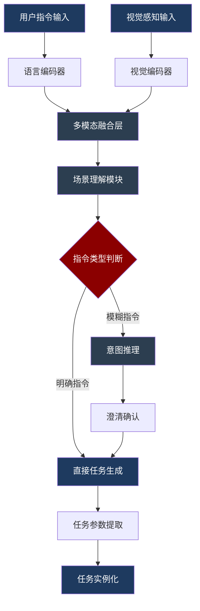
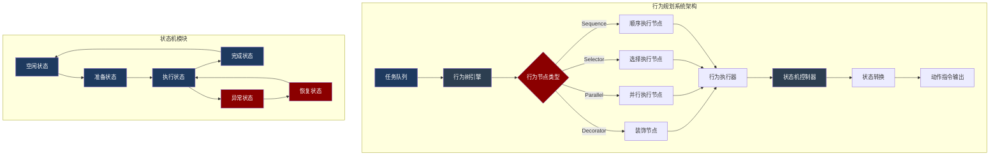
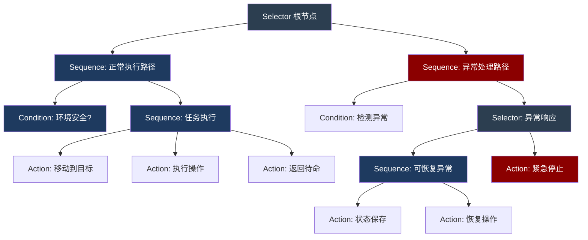
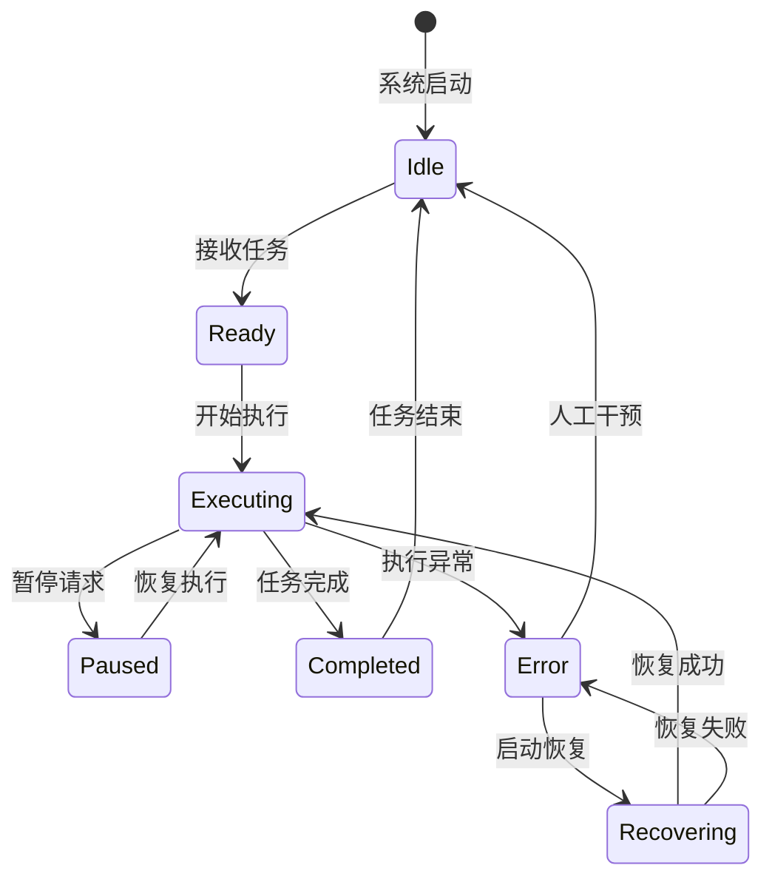
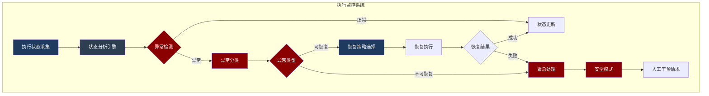
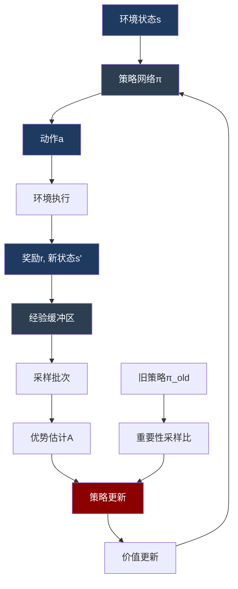
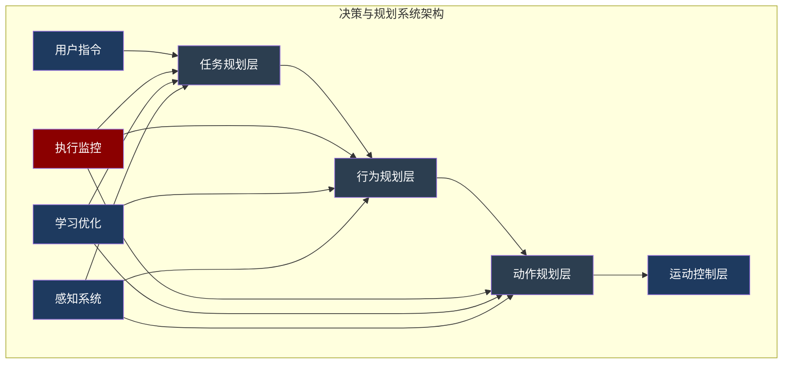
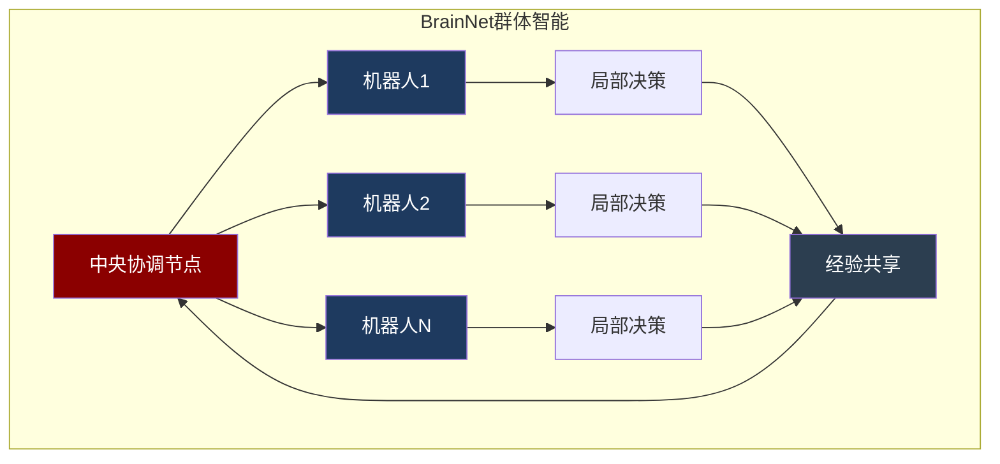

# Walker S1 决策与规划系统设计文档

## 文档信息

| 项目 | 内容 |
|------|------|
| 产品名称 | Walker S1 工业级人形机器人 |
| 文档版本 | V1.0 |
| 编制日期 | 2025年3月 |
| 文档状态 | 初稿 |

---

## 一、任务规划系统

### 1.1 系统概述

任务规划系统是决策与规划体系的最高层级，负责将用户指令或环境触发转化为可执行的任务序列。Walker S1采用分层任务网络（HTN）与多模态推理相结合的架构，实现复杂任务的智能分解与调度。

[事实] 调研报告显示，Walker S1的任务规划基于DeepSeek-R1多模态大模型，支持自然语言指令理解和场景推理。
[事实] SRS文档定义任务规划模块需支持任务分解、优先级管理、资源分配、冲突检测四项核心功能。
[关联] HTN方法将高层任务递归分解为原子任务，多模态模型提供语义理解和场景推理能力。
[推理] 任务规划系统采用"规划-调度-监控"三阶段架构，规划阶段完成任务分解，调度阶段分配资源，监控阶段跟踪执行状态。

### 1.2 任务分解机制

```
+============================================================================+
|                           任务分解流程                                      |
+============================================================================+
|                                                                            |
|  用户指令/环境触发                                                         |
|         │                                                                  |
|         ▼                                                                  |
|  +──────────────+                                                          |
|  │  指令解析    │ ←─ 自然语言理解、意图识别                                |
|  +──────────────+                                                          |
|         │                                                                  |
|         ▼                                                                  |
|  +──────────────+                                                          |
|  │  任务分类    │ ←─ 单任务/复合任务/协作任务                              |
|  +──────────────+                                                          |
|         │                                                                  |
|         ├─────────────────────┬─────────────────────┐                     |
|         ▼                     ▼                     ▼                     |
|  ┌───────────┐         ┌───────────┐         ┌───────────┐               |
|  │ 单任务    │         │ 复合任务  │         │ 协作任务  │               |
|  │ 直接执行  │         │ HTN分解   │         │ 分配协调  │               |
|  └───────────┘         └───────────┘         └───────────┘               |
|         │                     │                     │                     |
|         │                     ▼                     ▼                     |
|         │              ┌───────────┐         ┌───────────┐               |
|         │              │ 子任务序列│         │ 任务分配  │               |
|         │              └───────────┘         └───────────┘               |
|         │                     │                     │                     |
|         └─────────────────────┴─────────────────────┘                     |
|                               │                                           |
|                               ▼                                           |
|                        +──────────────+                                   |
|                        │  任务队列    │                                   |
|                        +──────────────+                                   |
|                               │                                           |
|                               ▼                                           |
|                        +──────────────+                                   |
|                        │  资源检查    │ ←─ 执行器、传感器、计算资源       |
|                        +──────────────+                                   |
|                               │                                           |
|                    ┌──────────┴──────────┐                               |
|                    ▼                     ▼                               |
|             资源充足               资源不足                              |
|               │                       │                                   |
|               ▼                       ▼                                   |
|        +──────────────+        +──────────────+                           |
|        │  提交执行    │        │  等待/重规划 │                           |
|        +──────────────+        +──────────────+                           |
|                                                                            |
+============================================================================+
```

### 1.3 HTN任务分解方法

[事实] HTN（Hierarchical Task Network）通过方法库将复合任务分解为子任务序列。
[关联] Walker S1的工业场景任务具有明确的结构性，适合HTN方法。

**任务类型定义**：

| 任务类型 | 描述 | 分解策略 | 示例 |
|----------|------|----------|------|
| 原子任务 | 不可再分的执行单元 | 直接映射动作 | "抓取物体"、"移动到位置" |
| 复合任务 | 由多个子任务组成 | HTN方法分解 | "搬运物体"、"巡检区域" |
| 协作任务 | 需要多机器人配合 | 分配+同步 | "协同搬运"、"编队巡逻" |

**HTN方法库示例**：

```
方法: 搬运物体(物体O, 起点S, 终点D)
├── 前提条件: 
│   ├── 机器人空闲
│   ├── O可达
│   └── 路径S→D可行
├── 子任务序列:
│   ├── 1. 移动到(S)
│   ├── 2. 识别(O)
│   ├── 3. 抓取(O)
│   ├── 4. 移动到(D)
│   └── 5. 放置(O)
└── 失败处理:
    ├── 抓取失败 → 重试(最多3次) → 请求人工干预
    └── 移动失败 → 重规划路径 → 重试
```

### 1.4 多模态任务理解

[事实] Walker S1集成DeepSeek-R1多模态模型，支持视觉-语言联合推理。
[关联] 多模态理解使机器人能够处理模糊指令和动态环境。

**多模态推理流程**：



### 1.5 任务优先级与调度

[事实] SRS文档规定任务调度需支持优先级抢占和资源互斥管理。
[推理] 工业场景中安全相关任务具有最高优先级，常规任务按紧急程度和重要性排序。

**优先级定义**：

| 优先级 | 类型 | 抢占性 | 示例 |
|--------|------|--------|------|
| P0 | 紧急安全 | 强抢占 | 紧急停止、避障响应 |
| P1 | 高优先级 | 弱抢占 | 人机交互、异常处理 |
| P2 | 常规任务 | 不可抢占 | 搬运、巡检 |
| P3 | 后台任务 | 不可抢占 | 自检、充电 |

**调度算法**：

```
调度策略: 优先级调度 + 时间片轮转
├── P0任务: 立即执行，阻塞其他任务
├── P1任务: 当前原子任务完成后执行
├── P2任务: 按FIFO顺序执行
└── P3任务: 空闲时执行

资源冲突处理:
├── 同优先级: 先到先服务
├── 不同优先级: 高优先级抢占
└── 死锁检测: 超时回退机制
```

---

## 二、行为规划系统

### 2.1 系统架构

行为规划系统负责任务执行过程中的行为选择和状态转换。Walker S1采用行为树与有限状态机（FSM）混合架构，行为树处理高层行为逻辑，状态机处理底层状态转换。



### 2.2 行为树设计

[事实] 行为树通过组合节点和叶子节点的层级结构表达复杂行为逻辑。
[关联] Walker S1的工业任务具有明确的执行顺序和条件分支，适合行为树表达。

**行为树节点类型**：

| 节点类型 | 符号 | 执行逻辑 | 返回状态 |
|----------|------|----------|----------|
| Sequence | → | 顺序执行子节点，任一失败则失败 | Success/Failure/Running |
| Selector | ? | 选择执行子节点，任一成功则成功 | Success/Failure/Running |
| Parallel | ∥ | 并行执行子节点 | 按策略判定 |
| Decorator | ◇ | 修饰子节点行为 | 取决于修饰类型 |
| Action | □ | 执行原子动作 | Success/Failure/Running |
| Condition | ○ | 检查条件 | Success/Failure |

**典型行为树结构**：



### 2.3 状态机设计

[事实] 状态机通过状态集合和转换规则表达系统的动态行为。
[关联] Walker S1的执行过程具有明确的状态阶段，状态机提供精确的状态管理。

**主状态机**：



**执行状态子状态机**：

```
执行状态(Executing)子状态:
├── 移动中(Moving)
│   ├── 行走(Walking)
│   ├── 转向(Turning)
│   └── 停止(Stopping)
├── 操作中(Operating)
│   ├── 抓取(Grasping)
│   ├── 放置(Placing)
│   └── 操作工具(Tooling)
├── 感知中(Perceiving)
│   ├── 扫描(Scanning)
│   ├── 识别(Recognizing)
│   └── 定位(Localizing)
└── 交互中(Interacting)
    ├── 等待输入(Waiting)
    ├── 处理输入(Processing)
    └── 生成响应(Responding)
```

### 2.4 行为决策流程

```
+============================================================================+
|                           行为决策流程                                      |
+============================================================================+
|                                                                            |
|                        +──────────────+                                     |
|                        │  任务输入    │                                     |
|                        +──────────────+                                     |
|                              │                                             |
|                              ▼                                             |
|                        +──────────────+                                     |
|                        │ 行为树遍历    │                                     |
|                        +──────────────+                                     |
|                              │                                             |
|              ┌───────────────┼───────────────┐                             |
|              ▼               ▼               ▼                             |
|       +───────────+   +───────────+   +───────────+                        |
|       │ 条件检查  │   │ 动作执行  │   │ 状态更新  │                        |
|       +───────────+   +───────────+   +───────────+                        |
|              │               │               │                             |
|              ▼               ▼               ▼                             |
|       ┌───────────┐   ┌───────────┐   ┌───────────┐                        |
|       │ 环境感知  │   │ 动作指令  │   │ 状态记录  │                        |
|       │ 数据获取  │   │ 生成输出  │   │ 日志更新  │                        |
|       └───────────┘   └───────────┘   └───────────┘                        |
|              │               │               │                             |
|              └───────────────┼───────────────┘                             |
|                              │                                             |
|                              ▼                                             |
|                        +──────────────+                                     |
|                        │  执行结果    │                                     |
|                        +──────────────+                                     |
|                              │                                             |
|              ┌───────────────┼───────────────┐                             |
|              ▼               ▼               ▼                             |
|        ┌─────────┐    ┌─────────┐    ┌─────────┐                           |
|        │ 成功    │    │ 失败    │    │ 运行中  │                           |
|        └─────────┘    └─────────┘    └─────────┘                           |
|              │               │               │                             |
|              ▼               ▼               ▼                             |
|        下一节点        失败处理        继续执行                            |
|                              │                                             |
|                              ▼                                             |
|                    ┌─────────────────┐                                     |
|                    │ Selector选择    │                                     |
|                    │ 备选行为路径    │                                     |
|                    └─────────────────┘                                     |
|                                                                            |
+============================================================================+
```

---

## 三、动作规划系统

### 3.1 系统概述

动作规划系统负责将行为层的指令转化为具体的动作序列。Walker S1采用分层动作规划架构，包括运动规划、轨迹生成和动作执行三个层次。

[事实] MCP文档定义了"大小脑"协同架构，小脑负责实时运动控制，大脑负责高层决策。
[关联] 动作规划是连接决策层和控制层的关键桥梁。
[推理] 动作规划需要在保证运动可行性的同时，满足实时性约束。

### 3.2 动作规划层次

```
动作规划层次结构:
┌─────────────────────────────────────────────────────────────────┐
│                    行为层指令输入                                │
│    "移动到位置A并抓取物体B"                                      │
└─────────────────────────────────────────────────────────────────┘
                              │
                              ▼
┌─────────────────────────────────────────────────────────────────┐
│                    动作序列规划                                  │
│    分解为: MoveTo(A) → Approach(B) → Grasp(B) → Retreat         │
└─────────────────────────────────────────────────────────────────┘
                              │
                              ▼
┌─────────────────────────────────────────────────────────────────┐
│                    运动规划层                                    │
│    ├── 路径规划: A* / RRT* 算法                                 │
│    ├── 避障规划: 动态窗口法 / 势场法                            │
│    └── 姿态规划: IK求解 / 采样法                                │
└─────────────────────────────────────────────────────────────────┘
                              │
                              ▼
┌─────────────────────────────────────────────────────────────────┐
│                    轨迹生成层                                    │
│    ├── 时间参数化: 五次多项式 / B样条                           │
│    ├── 速度规划: 梯形 / S曲线                                   │
│    └── 平滑处理: 滤波 / 插值                                    │
└─────────────────────────────────────────────────────────────────┘
                              │
                              ▼
┌─────────────────────────────────────────────────────────────────┐
│                    动作执行层                                    │
│    ├── 关节指令: 位置/速度/力矩控制                             │
│    ├── 末端控制: 位姿/力控制                                    │
│    └── 步态控制: ZMP / CP 平衡                                  │
└─────────────────────────────────────────────────────────────────┘
```

### 3.3 运动规划算法

[事实] Walker S1采用RRT*进行全局路径规划，结合动态窗口法进行局部避障。
[关联] 人形机器人的运动规划需要考虑全身运动学和动力学约束。

**路径规划算法对比**：

| 算法 | 适用场景 | 优点 | 缺点 | Walker S1应用 |
|------|----------|------|------|---------------|
| A* | 栅格地图 | 最优解保证 | 维度灾难 | 全局路径搜索 |
| RRT* | 高维空间 | 渐近最优 | 收敛慢 | 机械臂规划 |
| PRM | 多查询 | 预处理快 | 单查询慢 | 静态环境导航 |
| APF | 实时避障 | 计算快 | 局部极小 | 动态避障 |
| DWA | 局部规划 | 考虑动力学 | 视野有限 | 实时避障 |

**RRT*算法流程**：

```
RRT*算法:
输入: 起点q_start, 终点q_goal, 障碍物集合O
输出: 路径Path

1. 初始化树T = {q_start}
2. while 未到达q_goal do
3.     q_rand ← 随机采样(含q_goal偏置)
4.     q_nearest ← 最近邻(T, q_rand)
5.     q_new ← Steer(q_nearest, q_rand, 步长)
6.     if CollisionFree(q_nearest, q_new, O) then
7.         Q_near ← 近邻集合(T, q_new, 半径r)
8.         q_parent ← 选择最优父节点(Q_near, q_new)
9.         添加边(q_parent, q_new)到T
10.        重连(Q_near, q_new)  // 优化局部路径
11. return Path(q_start, q_goal)
```

### 3.4 动作原语定义

[事实] SRS文档定义了Walker S1的基础动作原语库。
[推理] 动作原语是动作规划的基本构建块，通过组合实现复杂动作。

**基础动作原语**：

| 原语类别 | 动作原语 | 参数 | 执行频率 |
|----------|----------|------|----------|
| 移动类 | Walk | 目标位置、速度 | 100Hz |
| 移动类 | Turn | 转向角度、角速度 | 100Hz |
| 移动类 | Step | 步长、方向 | 100Hz |
| 操作类 | Reach | 目标位姿 | 500Hz |
| 操作类 | Grasp | 力度、手型 | 500Hz |
| 操作类 | Release | - | 500Hz |
| 操作类 | Push | 力度、方向 | 500Hz |
| 姿态类 | Stand | - | 500Hz |
| 姿态类 | Squat | 深度 | 500Hz |
| 姿态类 | Lean | 方向、角度 | 500Hz |

**动作原语组合示例**：

```
复合动作: 抓取放置
├── 1. Reach(target_pose)      // 伸向目标
│   └── 参数: 目标位姿, 速度曲线
├── 2. Grasp(force, grip_type) // 抓取
│   └── 参数: 抓取力, 抓取类型(捏/握)
├── 3. Retreat(distance)       // 撤回
│   └── 参数: 撤回距离
├── 4. Walk(target_pos)        // 移动
│   └── 参数: 目标位置
├── 5. Reach(place_pose)       // 伸向放置位
│   └── 参数: 放置位姿
└── 6. Release()               // 释放
    └── 参数: 无
```

### 3.5 实时性约束

[事实] MCP文档定义了各控制层的实时性要求。
[关联] 动作规划需要在实时性约束下完成计算。

**实时性分层要求**：

| 层级 | 更新频率 | 最大延迟 | 计算复杂度 |
|------|----------|----------|------------|
| 任务规划层 | 1-10Hz | 100ms-1s | 高 |
| 行为规划层 | 10-50Hz | 20-100ms | 中 |
| 动作规划层 | 50-100Hz | 10-20ms | 中 |
| 运动控制层 | 500Hz-1kHz | 1-2ms | 低 |

---

## 四、执行监控系统

### 4.1 系统架构

执行监控系统负责监测任务执行状态，检测异常情况，并触发相应的恢复机制。Walker S1采用分层监控架构，包括任务级监控、行为级监控和动作级监控。



### 4.2 异常检测机制

[事实] SRS文档定义了异常检测模块需支持实时监测和阈值告警。
[关联] 异常检测是执行监控的核心功能，直接影响系统可靠性。

**异常类型分类**：

| 异常类别 | 异常类型 | 检测方法 | 响应级别 |
|----------|----------|----------|----------|
| 环境异常 | 障碍物突变 | 视觉/激光检测 | P1 |
| 环境异常 | 地面不平 | IMU/力传感器 | P1 |
| 环境异常 | 光照变化 | 视觉传感器 | P2 |
| 执行异常 | 动作超时 | 时间监测 | P1 |
| 执行异常 | 位置偏差 | 编码器/视觉 | P1 |
| 执行异常 | 力矩异常 | 关节力传感器 | P0 |
| 系统异常 | 通信中断 | 心跳检测 | P0 |
| 系统异常 | 传感器故障 | 数据校验 | P0 |
| 系统异常 | 计算过载 | CPU监测 | P2 |

**异常检测算法**：

```
异常检测流程:
├── 1. 数据采集
│   ├── 传感器数据: 位置、速度、力矩、IMU
│   ├── 执行状态: 动作进度、资源占用
│   └── 环境数据: 障碍物分布、地面状态
├── 2. 特征提取
│   ├── 统计特征: 均值、方差、极值
│   ├── 时序特征: 趋势、周期性
│   └── 语义特征: 场景理解结果
├── 3. 异常判断
│   ├── 阈值检测: 超出预设范围
│   ├── 模型检测: 偏离预期模型
│   └── 学习检测: 偏离历史模式
└── 4. 异常报告
    ├── 异常类型
    ├── 严重程度
    └── 建议处理
```

### 4.3 异常处理流程

```
+============================================================================+
|                           异常处理流程                                      |
+============================================================================+
|                                                                            |
|                        +──────────────+                                     |
|                        │  异常检测    │                                     |
|                        +──────────────+                                     |
|                              │                                             |
|                              ▼                                             |
|                        +──────────────+                                     |
|                        │  异常分类    │                                     |
|                        +──────────────+                                     |
|                              │                                             |
|         ┌────────────────────┼────────────────────┐                        |
|         ▼                    ▼                    ▼                        |
|  ┌─────────────┐      ┌─────────────┐      ┌─────────────┐                |
|  │ P0 紧急异常 │      │ P1 可恢复   │      │ P2 轻微异常 │                |
|  └─────────────┘      └─────────────┘      └─────────────┘                |
|         │                    │                    │                        |
|         ▼                    ▼                    ▼                        |
|  ┌─────────────┐      ┌─────────────┐      ┌─────────────┐                |
|  │ 立即停止    │      │ 暂停执行    │      │ 记录日志    │                |
|  │ 安全模式    │      │ 状态保存    │      │ 继续执行    │                |
|  └─────────────┘      └─────────────┘      └─────────────┘                |
|         │                    │                                             |
|         ▼                    ▼                                             |
|  ┌─────────────┐      ┌─────────────┐                                      |
|  │ 请求人工    │      │ 恢复策略    │                                      |
|  │ 干预        │      │ 选择        │                                      |
|  └─────────────┘      └─────────────┘                                      |
|         │                    │                                             |
|         │                    ├─────────────────┐                           |
|         │                    ▼                 ▼                           |
|         │             ┌───────────┐     ┌───────────┐                      |
|         │             │ 重试策略  │     │ 重规划    │                      |
|         │             └───────────┘     └───────────┘                      |
|         │                    │                 │                           |
|         │                    └────────┬────────┘                           |
|         │                             ▼                                    |
|         │                      ┌─────────────┐                             |
|         │                      │ 恢复执行    │                             |
|         │                      └─────────────┘                             |
|         │                             │                                    |
|         │                    ┌────────┴────────┐                           |
|         │                    ▼                 ▼                           |
|         │              恢复成功           恢复失败                         |
|         │                    │                 │                           |
|         │                    ▼                 ▼                           |
|         │              继续任务         升级为P0                          |
|         │                                      │                           |
|         └──────────────────────────────────────┘                           |
|                                                                            |
+============================================================================+
```

### 4.4 恢复策略

[事实] 调研报告显示Walker S1支持多种恢复策略，包括重试、重规划、降级执行等。
[关联] 恢复策略的选择取决于异常类型和当前系统状态。

**恢复策略库**：

| 策略类型 | 适用场景 | 执行方式 | 成功率预估 |
|----------|----------|----------|------------|
| 重试 | 临时性故障 | 重复执行失败动作 | 60-80% |
| 重规划 | 环境变化 | 重新生成动作序列 | 70-90% |
| 降级执行 | 能力受限 | 使用简化方案 | 80-95% |
| 回退 | 状态异常 | 返回上一稳定状态 | 90-99% |
| 人工干预 | 无法自动恢复 | 请求人工处理 | 100% |

**恢复策略选择逻辑**：

```
恢复策略选择:
输入: 异常类型E, 当前状态S, 任务进度P
输出: 恢复策略Strategy

1. if E in [通信中断, 传感器故障] then
2.     Strategy = 重试(次数=3, 间隔=1s)
3. else if E in [障碍物变化, 路径阻塞] then
4.     Strategy = 重规划(局部/全局)
5. else if E in [力矩异常, 平衡风险] then
6.     Strategy = 回退(安全状态)
7. else if E in [能力受限, 资源不足] then
8.     Strategy = 降级执行(简化方案)
9. else
10.    Strategy = 人工干预
11. return Strategy
```

---

## 五、学习与优化系统

### 5.1 系统概述

学习与优化系统负责从执行数据中学习经验知识，持续优化决策策略。Walker S1采用强化学习与模仿学习相结合的方法，实现任务执行能力的持续提升。

[事实] 调研报告显示Walker S1支持在线学习和经验积累，能够优化运动策略和任务执行效率。
[关联] 学习系统使机器人能够适应新环境和任务，提高长期运行效率。

### 5.2 强化学习框架

[事实] Walker S1采用深度强化学习（DRL）进行运动控制和任务决策优化。
[推理] 强化学习适合处理序列决策问题，通过试错学习最优策略。

**强化学习算法选择**：

| 算法 | 类型 | 适用场景 | Walker S1应用 |
|------|------|----------|---------------|
| Q-Learning | 值函数 | 离散状态空间 | 简单任务决策 |
| DQN | 值函数 | 连续状态空间 | 视觉导航 |
| DDPG | Actor-Critic | 连续动作空间 | 运动控制 |
| PPO | 策略梯度 | 稳定训练 | 全身运动 |
| SAC | 最大熵 | 探索效率 | 复杂任务 |

**PPO算法框架**：



### 5.3 模仿学习

[事实] Walker S1支持从人类示教中学习动作技能。
[关联] 模仿学习可以快速获得初始策略，减少强化学习的探索成本。

**模仿学习方法**：

| 方法 | 数据需求 | 学习方式 | 适用场景 |
|------|----------|----------|----------|
| 行为克隆 | 示教轨迹 | 监督学习 | 简单动作复制 |
| 逆向强化学习 | 示教轨迹 | 奖励推断 | 目标理解 |
| GAIL | 示教轨迹 | 对抗学习 | 风格模仿 |
| DAgger | 在线交互 | 迭代改进 | 分布偏移修正 |

**行为克隆流程**：

```
行为克隆流程:
├── 1. 数据采集
│   ├── 人类遥操作记录
│   ├── 状态-动作对(s, a)
│   └── 多次重复采集
├── 2. 数据预处理
│   ├── 数据清洗(去除异常)
│   ├── 数据增强(噪声注入)
│   └── 数据标注(质量评分)
├── 3. 模型训练
│   ├── 网络结构: CNN+MLP
│   ├── 损失函数: MSE/交叉熵
│   └── 正则化: Dropout/权重衰减
├── 4. 策略部署
│   ├── 模型量化
│   ├── 实时推理优化
│   └── 安全约束添加
└── 5. 持续改进
    ├── 执行数据收集
    ├── DAgger迭代
    └── 模型更新
```

### 5.4 经验积累与知识迁移

[事实] 调研报告显示Walker S1支持任务经验的积累和跨任务迁移。
[推理] 知识迁移可以加速新任务学习，提高系统适应性。

**知识迁移策略**：

```
知识迁移框架:
┌─────────────────────────────────────────────────────────────────┐
│                    源任务知识库                                  │
│    ├── 任务A: 搬运经验                                          │
│    ├── 任务B: 操作经验                                          │
│    └── 任务C: 导航经验                                          │
└─────────────────────────────────────────────────────────────────┘
                              │
                              ▼
┌─────────────────────────────────────────────────────────────────┐
│                    知识提取模块                                  │
│    ├── 共享特征提取                                             │
│    ├── 可迁移策略识别                                           │
│    └── 领域差异分析                                             │
└─────────────────────────────────────────────────────────────────┘
                              │
                              ▼
┌─────────────────────────────────────────────────────────────────┐
│                    迁移学习模块                                  │
│    ├── 预训练模型加载                                           │
│    ├── 微调策略选择                                             │
│    └── 新任务适应训练                                           │
└─────────────────────────────────────────────────────────────────┘
                              │
                              ▼
┌─────────────────────────────────────────────────────────────────┐
│                    目标任务执行                                  │
│    └── 新任务: 未知搬运场景                                     │
└─────────────────────────────────────────────────────────────────┘
```

### 5.5 在线优化

[事实] Walker S1支持在线参数优化和策略更新。
[关联] 在线优化使系统能够适应环境变化和任务演变。

**在线优化目标**：

| 优化目标 | 度量指标 | 优化方法 | 更新频率 |
|----------|----------|----------|----------|
| 执行效率 | 任务完成时间 | 梯度下降 | 任务级 |
| 能耗优化 | 单位任务能耗 | 在线学习 | 任务级 |
| 运动平滑 | 加速度方差 | 滤波调参 | 实时 |
| 决策质量 | 成功率 | 经验回放 | 日级 |

---

## 六、系统集成

### 6.1 系统架构总览

决策与规划系统采用分层模块化架构，各层之间通过标准化接口进行通信。



### 6.2 模块接口定义

[事实] SRS文档定义了决策规划模块与外部系统的接口规范。
[关联] 标准化接口确保模块间的解耦和可替换性。

**核心接口定义**：

| 接口名称 | 数据流向 | 数据格式 | 频率 |
|----------|----------|----------|------|
| TaskInput | 用户→任务规划 | JSON指令 | 事件触发 |
| TaskStatus | 任务规划→用户 | JSON状态 | 1Hz |
| BehaviorCmd | 任务规划→行为规划 | 行为指令 | 10Hz |
| ActionCmd | 行为规划→动作规划 | 动作指令 | 50Hz |
| MotionCmd | 动作规划→运动控制 | 轨迹点 | 500Hz |
| SensorData | 感知系统→决策规划 | 传感器数据 | 100Hz |
| ExceptionEvent | 执行监控→各层 | 异常消息 | 事件触发 |

**接口数据结构**：

```
TaskInput数据结构:
{
    "task_id": "string",           // 任务唯一标识
    "task_type": "string",         // 任务类型
    "parameters": {                // 任务参数
        "target": "position",
        "object": "object_id",
        "constraints": {}
    },
    "priority": "int",             // 优先级
    "deadline": "timestamp"        // 截止时间
}

ActionCmd数据结构:
{
    "action_id": "string",         // 动作标识
    "action_type": "string",       // 动作类型
    "target_pose": {               // 目标位姿
        "position": [x, y, z],
        "orientation": [qx, qy, qz, qw]
    },
    "motion_params": {             // 运动参数
        "velocity": "float",
        "acceleration": "float"
    },
    "constraints": {               // 约束条件
        "force_limit": "float",
        "time_limit": "float"
    }
}
```

### 6.3 大小脑协同机制

[事实] MCP文档详细描述了"大小脑"协同架构。
[关联] 大脑负责高层决策，小脑负责实时控制，两者协同实现智能运动。

**大小脑分工**：

| 功能模块 | 大脑（决策层） | 小脑（控制层） |
|----------|----------------|----------------|
| 计算位置 | 高性能计算单元 | 实时控制单元 |
| 更新频率 | 1-50Hz | 500Hz-1kHz |
| 任务类型 | 任务规划、行为决策 | 运动控制、平衡维持 |
| 响应延迟 | 20-100ms | 1-2ms |
| 学习能力 | 强（深度学习） | 弱（参数调优） |

**协同通信机制**：

```
大小脑协同通信:
┌─────────────────────────────────────────────────────────────────┐
│                         大脑模块                                 │
│    ├── 任务规划                                                 │
│    ├── 行为决策                                                 │
│    └── 感知理解                                                 │
└─────────────────────────────────────────────────────────────────┘
                    │                           ▲
                    │ 高层指令                   │ 状态反馈
                    │ (10-50Hz)                 │ (100Hz)
                    ▼                           │
┌─────────────────────────────────────────────────────────────────┐
│                         通信接口                                 │
│    ├── 指令队列                                                 │
│    ├── 状态共享内存                                             │
│    └── 事件通知机制                                             │
└─────────────────────────────────────────────────────────────────┘
                    │                           ▲
                    │ 控制指令                   │ 传感器数据
                    │ (500Hz)                   │ (1kHz)
                    ▼                           │
┌─────────────────────────────────────────────────────────────────┐
│                         小脑模块                                 │
│    ├── 运动控制                                                 │
│    ├── 平衡维持                                                 │
│    └── 反射响应                                                 │
└─────────────────────────────────────────────────────────────────┘
```

### 6.4 群体智能协同

[事实] 调研报告显示Walker S1支持BrainNet群体智能架构，实现多机器人协同。
[关联] 群体智能扩展了单机决策能力，支持复杂协作任务。

**BrainNet架构**：



**协同任务分配**：

```
协同任务分配流程:
├── 1. 任务广播
│   └── 中央节点广播任务需求
├── 2. 能力评估
│   └── 各机器人评估自身能力
├── 3. 任务竞标
│   └── 提交能力匹配度和预期收益
├── 4. 分配决策
│   └── 中央节点优化分配方案
├── 5. 执行协调
│   ├── 时序同步
│   ├── 空间避撞
│   └── 资源共享
└── 6. 结果汇总
    └── 各机器人汇报执行结果
```

### 6.5 性能指标

[事实] SRS文档定义了决策规划系统的性能要求。
[推理] 性能指标是系统设计和验证的重要依据。

**关键性能指标**：

| 指标类别 | 指标名称 | 目标值 | 测试方法 |
|----------|----------|--------|----------|
| 响应性能 | 指令响应延迟 | <100ms | 时间戳对比 |
| 响应性能 | 异常响应延迟 | <50ms | 事件触发测试 |
| 规划性能 | 路径规划时间 | <500ms | 标准场景测试 |
| 规划性能 | 任务分解时间 | <200ms | 复杂任务测试 |
| 可靠性 | 任务成功率 | >95% | 统计分析 |
| 可靠性 | 异常恢复率 | >80% | 故障注入测试 |
| 学习性能 | 新任务适应时间 | <100次迭代 | 学习曲线测试 |
| 协同性能 | 多机同步精度 | <10ms | 时钟同步测试 |

---

## 附录A：术语表

| 术语 | 英文 | 定义 |
|------|------|------|
| HTN | Hierarchical Task Network | 分层任务网络，一种任务分解方法 |
| FSM | Finite State Machine | 有限状态机，一种状态建模方法 |
| RRT | Rapidly-exploring Random Tree | 快速探索随机树，一种路径规划算法 |
| PPO | Proximal Policy Optimization | 近端策略优化，一种强化学习算法 |
| DAgger | Dataset Aggregation | 数据集聚合，一种模仿学习方法 |
| ZMP | Zero Moment Point | 零力矩点，一种平衡判据 |
| CP | Capture Point | 捕获点，一种平衡控制方法 |

## 附录B：参考文献

1. 优必选Walker S1调研报告
2. Walker S1软件需求规格书（SRS）
3. Walker S1运动控制与规划文档（MCP）
4. 优必选官方技术文档

---

*文档结束*
