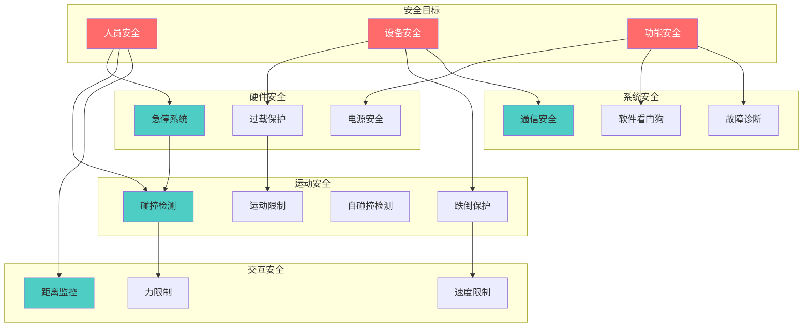
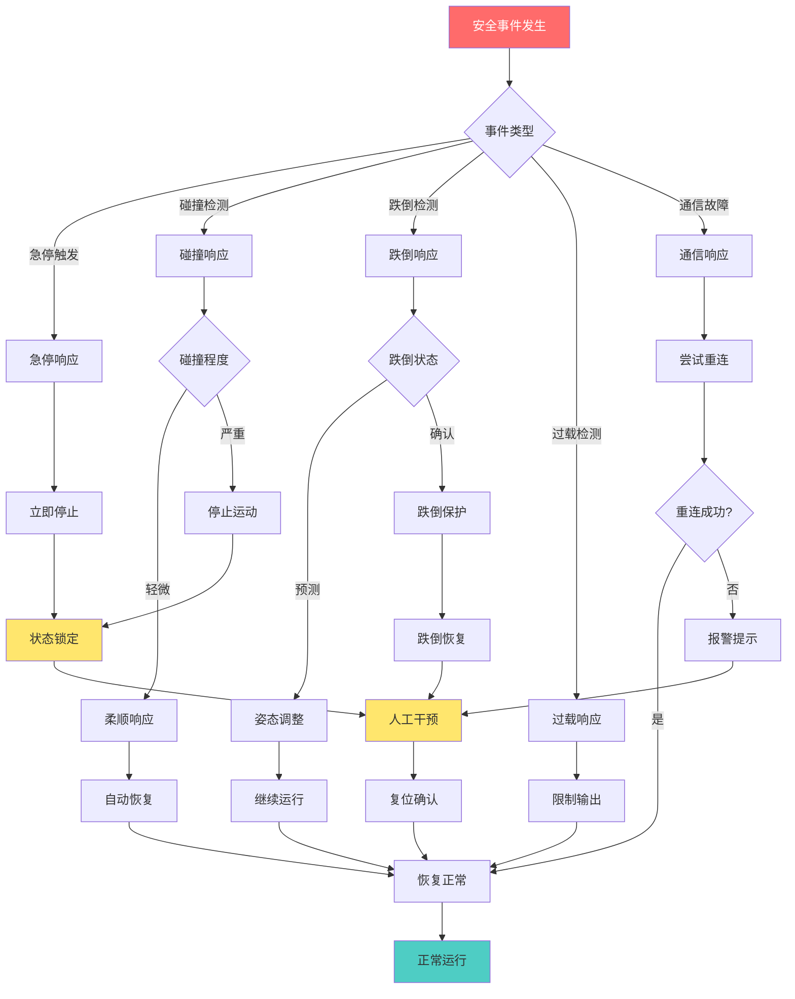

# 优必选 Walker S1 工业人形机器人安全系统设计 (SSD)

## 文档信息

- **产品名称**: Walker S1 工业人形机器人
- **产品型号**: Walker S1
- **文档版本**: V1.0
- **编制日期**: 2024年
- **产品定位**: 高端工业级人形机器人

---

## I. 安全系统概述 (Safety System Overview)

### A. 安全目标

#### A.1 人员安全

**操作人员安全** [事实]

Walker S1 作为工业级人形机器人，在汽车制造、3C电子、物流仓储等场景中与人类工人协同作业，人员安全是首要目标。

| 安全目标 | 具体要求 | 实现方式 |
|---------|---------|---------|
| 防止碰撞伤害 | 碰撞力控制在安全范围内 | 多层级力控与碰撞检测系统 |
| 防止挤压伤害 | 保持安全距离或限制接触力 | 人机距离监控、力限制 |
| 防止跌倒伤害 | 跌倒时避免对人员造成伤害 | 跌倒保护、姿态调整 |
| 防止电击伤害 | 电气系统安全防护 | 绝缘防护、接地保护 |

**周围人员安全** [事实]

Walker S1 配备多层级力控与碰撞检测系统，确保与工人共处一室无风险。通过360°多模态感知，实现对周围环境的全方位安全监测。

| 感知能力 | 技术实现 | 安全功能 |
|---------|---------|---------|
| 360°视觉感知 | 双耳鱼眼相机 + RGBD相机 | 全方位环境监测 |
| 距离感知 | 激光雷达 + 超声波 | 障碍物检测 |
| 接触感知 | 力传感器 + 触觉传感器 | 碰撞检测 |

**用户安全** [关联]

基于工业场景应用需求，Walker S1 的安全设计需保障操作用户的交互安全：

- 语音交互安全：支持8种语言，识别准确率98.7%
- 触觉交互安全：灵巧手配备6个阵列式触觉压力传感器
- 物理交互安全：接触力限制在安全范围内

#### A.2 设备安全

**机器人本体安全** [事实]

| 保护类型 | 保护对象 | 保护机制 | 响应时间 |
|---------|---------|---------|---------|
| 过载保护 | 关节电机 | 电流/扭矩监测 | <10ms |
| 过热保护 | 电机、驱动器、控制器 | 温度监测 | <100ms |
| 过压保护 | 电气系统 | 电压监测 | <1ms |
| 过流保护 | 驱动电路 | 电流采样 | <100μs |

**周边设备安全** [推理]

Walker S1 在工业环境中与无人物流车、无人叉车等自动化设备协同作业，需保障周边设备安全：

| 协同设备 | 安全风险 | 安全措施 |
|---------|---------|---------|
| 无人物流车 | 碰撞风险 | 通信协调、路径规划 |
| 无人叉车 | 干扰风险 | 任务调度、区域避让 |
| 传送带 | 卡滞风险 | 状态监测、异常停止 |
| 其他机器人 | 冲突风险 | 群体智能协调 |

**环境安全** [事实]

Walker S1 具备强环境适应性，可在-10℃至50℃、湿度80%以下的车间环境中长期运行，外壳防护等级达到IP67。

#### A.3 功能安全

**系统可靠性** [事实]

| 可靠性指标 | 目标值 | 说明 |
|-----------|-------|------|
| MTBF | >1000小时 | 平均故障间隔时间 |
| MTTR | <2小时 | 平均修复时间 |
| 可用度 | >99% | 系统可用性 |

**故障安全** [推理]

故障安全设计原则：当系统发生故障时，自动进入安全状态，避免造成危害。

| 故障类型 | 安全状态 | 恢复方式 |
|---------|---------|---------|
| 通信故障 | 停止运动，保持姿态 | 自动重连或人工干预 |
| 传感器故障 | 降级运行或停止 | 自动诊断或人工检修 |
| 执行器故障 | 停止相关关节 | 自动隔离或人工维修 |
| 电源故障 | 安全关机 | 充电或更换电池 |

**容错能力** [推理]

Walker S1 采用分布式控制架构，具备一定的容错能力：

- 单关节故障：可隔离故障关节，其他关节继续工作
- 单传感器故障：可通过传感器融合维持基本功能
- 通信故障：具备本地控制备份能力

### B. 安全等级

#### B.1 安全完整性等级（SIL）

**SIL等级选择** [推理]

根据风险评估结果，Walker S1 的安全系统设计目标为SIL2等级，适用于工业协作机器人场景。

| SIL等级 | PFH（每小时危险失效概率） | 适用场景 |
|--------|-------------------------|---------|
| SIL1 | 10⁻⁶ ~ 10⁻⁵ | 低风险场景 |
| SIL2 | 10⁻⁷ ~ 10⁻⁶ | 中等风险场景（Walker S1目标） |
| SIL3 | 10⁻⁸ ~ 10⁻⁷ | 高风险场景 |
| SIL4 | 10⁻⁹ ~ 10⁻⁸ | 极高风险场景 |

**SIL2等级要求** [推理]

| 要求项 | 具体要求 | 实现措施 |
|-------|---------|---------|
| 硬件故障裕度 | HFT=0或1 | 冗余设计 |
| 诊断覆盖率 | DC≥60% | 自诊断功能 |
| 安全功能验证 | 定期测试 | 安全测试程序 |

#### B.2 性能等级（PL）

**PL等级选择** [推理]

根据ISO 13849标准，Walker S1 的安全控制系统目标性能等级为PLd。

| PL等级 | PFHd（每小时危险失效概率） | 适用场景 |
|--------|--------------------------|---------|
| PLa | <10⁻⁴ | 低风险 |
| PLb | <3×10⁻⁵ | 较低风险 |
| PLc | <10⁻⁵ | 中等风险 |
| PLd | <10⁻⁶ | 较高风险（Walker S1目标） |
| PLe | <10⁻⁷ | 高风险 |

### C. 安全标准

#### C.1 国际标准

**ISO 10218 工业机器人安全标准** [关联]

Walker S1 作为工业机器人，需符合ISO 10218-1（机器人本体）和ISO 10218-2（机器人系统）的安全要求：

| 标准要求 | Walker S1实现 |
|---------|--------------|
| 急停功能 | 本体配备多个急停按钮 |
| 安全停止 | 多种停止模式（停止0/1/2） |
| 速度监控 | 实时速度监测和限制 |
| 力限制 | 多层级力控系统 |
| 安全距离 | 人机距离监控 |

**ISO 13482 个人护理机器人安全标准** [推理]

虽然Walker S1主要面向工业应用，但部分安全设计参考ISO 13482标准：

| 安全功能 | 标准要求 | Walker S1实现 |
|---------|---------|--------------|
| 碰撞检测 | 检测并响应碰撞 | 力传感器+电流监测 |
| 接触力限制 | 限制接触力 | 阻抗控制 |
| 速度限制 | 限制运动速度 | 速度监控 |
| 稳定性 | 保持平衡 | ZMP控制 |

**ISO 13849 机械安全控制系统安全标准** [推理]

| 标准要求 | Walker S1实现 |
|---------|--------------|
| 安全相关部件 | 急停系统、碰撞检测 |
| 性能等级 | 目标PLd |
| 诊断功能 | 自诊断、故障检测 |
| 可靠性 | MTBF>1000小时 |

**IEC 61508 电气/电子/可编程电子安全系统标准** [推理]

| 标准要求 | Walker S1实现 |
|---------|--------------|
| 安全完整性等级 | 目标SIL2 |
| 安全生命周期 | 设计、验证、运维 |
| 功能安全管理 | 安全手册、风险评估 |

#### C.2 国家标准

**GB 11291 工业机器人安全标准** [关联]

| 标准要求 | Walker S1实现 |
|---------|--------------|
| 急停装置 | 本体急停按钮 |
| 安全防护 | 碰撞检测、力限制 |
| 电气安全 | 绝缘、接地保护 |
| 控制安全 | 安全控制功能 |

**GB/T 33263 机器人软件功能安全标准** [推理]

| 标准要求 | Walker S1实现 |
|---------|--------------|
| 软件安全等级 | 目标SIL2 |
| 软件验证 | 测试验证 |
| 软件文档 | 安全手册 |

**GB/T 36008 机器人与机器人装备协作机器人标准** [关联]

Walker S1 在工业场景中与人类工人协作作业，需符合协作机器人安全标准：

| 协作模式 | 安全要求 | Walker S1实现 |
|---------|---------|--------------|
| 安全监控停止 | 人员进入时停止 | 人机距离监控 |
| 手动引导 | 操作员引导时安全 | 力控制 |
| 速度和位置监控 | 限制速度和位置 | 实时监控 |
| 功率和力限制 | 限制接触力 | 力限制系统 |

---

## II. 硬件安全系统 (Hardware Safety System)

### A. 急停系统

#### A.1 急停按钮

**急停按钮配置** [事实]

Walker S1 在机器人本体上设置多个急停按钮，确保紧急情况下的安全停机。

| 参数 | 规格 | 说明 |
|------|------|------|
| 急停按钮数量 | ≥2个 | 本体前后位置 |
| 按钮类型 | 红色蘑菇头 | 标准急停按钮 |
| 触发方式 | 拍击式 | 易于操作 |
| 触发信号 | 常闭触点 | 安全设计 |
| 触发力度 | 约20N | 易于触发 |

**急停按钮位置** [推理]

| 位置 | 数量 | 可达性 | 说明 |
|------|------|--------|------|
| 躯干前侧 | 1个 | 高 | 正常操作位置可达 |
| 躯干后侧 | 1个 | 高 | 后方操作位置可达 |
| 背部 | 1个（可选） | 中 | 特殊情况可达 |

#### A.2 急停响应

**急停响应性能** [推理]

| 参数 | 规格 | 说明 |
|------|------|------|
| 响应时间 | <50ms | 从触发到停止 |
| 停止方式 | 断电停止+刹车 | 安全停止 |
| 停止状态 | 所有关节停止、电机断电 | 完全停止 |
| 状态锁定 | 急停状态锁定 | 防止误复位 |

**急停响应流程**

```
急停响应流程:
┌─────────────────────────────────────────────────────────────┐
│                                                             │
│  ┌──────────┐    ┌──────────┐    ┌──────────┐              │
│  │ 急停触发 │───>│ 信号检测 │───>│ 停止指令 │              │
│  │ (按下)   │    │ (<1ms)   │    │ 发送     │              │
│  └──────────┘    └──────────┘    └──────────┘              │
│                                       │                     │
│                                       ▼                     │
│  ┌──────────┐    ┌──────────┐    ┌──────────┐              │
│  │ 状态锁定 │<───│ 电机断电 │<───│ 关节停止 │              │
│  │ (等待)   │    │ (<20ms)  │    │ (<30ms)  │              │
│  └──────────┘    └──────────┘    └──────────┘              │
│                                                             │
│  总响应时间: <50ms                                          │
│                                                             │
└─────────────────────────────────────────────────────────────┘
```

#### A.3 急停恢复

**急停恢复条件** [推理]

| 条件 | 要求 | 说明 |
|------|------|------|
| 急停按钮释放 | 必须 | 物理释放按钮 |
| 故障清除 | 必须 | 无活动故障 |
| 系统自检通过 | 必须 | 安全状态检查 |
| 人工确认 | 必须 | 操作员确认 |

**急停恢复流程**

```
急停恢复流程:
┌─────────────────────────────────────────────────────────────┐
│                                                             │
│  ┌──────────┐    ┌──────────┐    ┌──────────┐              │
│  │ 释放急停 │───>│ 故障检查 │───>│ 系统自检 │              │
│  │ 按钮     │    │ (通过?)  │    │ (通过?)  │              │
│  └──────────┘    └──────────┘    └──────────┘              │
│                       │              │                      │
│                       ▼              ▼                      │
│                    ┌──────┐    ┌──────────┐                 │
│                    │ 否   │    │ 是       │                 │
│                    └──┬───┘    └────┬─────┘                 │
│                       │              │                      │
│                       ▼              ▼                      │
│  ┌──────────┐    ┌──────────┐    ┌──────────┐              │
│  │ 等待处理 │<───│ 报警提示 │    │ 人工确认 │              │
│  │          │    │          │    │          │              │
│  └──────────┘    └──────────┘    └──────────┘              │
│                                       │                     │
│                                       ▼                     │
│                                  ┌──────────┐               │
│                                  │ 恢复运行 │               │
│                                  └──────────┘               │
│                                                             │
└─────────────────────────────────────────────────────────────┘
```

### B. 过载保护

#### B.1 电流过载保护

**电流保护配置** [推理]

| 参数 | 规格 | 说明 |
|------|------|------|
| 检测方式 | 电流传感器采样 | 实时监测 |
| 采样精度 | ≥12bit | 精确检测 |
| 保护阈值 | 1.5倍额定电流 | 合理裕度 |
| 保护动作 | 限流或断电 | 分级响应 |
| 响应时间 | <100μs | 快速响应 |

**电流保护分级响应**

| 过载程度 | 阈值范围 | 保护动作 | 恢复方式 |
|---------|---------|---------|---------|
| 轻度过载 | 100%-120% | 限流运行 | 自动恢复 |
| 中度过载 | 120%-150% | 降功率运行 | 延时恢复 |
| 严重过载 | >150% | 立即断电 | 人工复位 |

#### B.2 扭矩过载保护

**扭矩保护配置** [推理]

| 参数 | 规格 | 说明 |
|------|------|------|
| 检测方式 | 扭矩传感器/电流估计 | 双重检测 |
| 保护阈值 | 1.2倍额定扭矩 | 安全裕度 |
| 保护动作 | 扭矩限制或停止 | 分级响应 |
| 响应时间 | <1ms | 快速响应 |

**关节扭矩保护阈值** [事实]

| 关节类型 | 额定扭矩 | 保护阈值 | 说明 |
|---------|---------|---------|------|
| 核心关节 | 250N·m | 300N·m | 髋、膝关节 |
| 一般关节 | 50-100N·m | 60-120N·m | 肩、肘关节 |
| 精细关节 | 4.5-20N·m | 5.4-24N·m | 腕、手指关节 |

#### B.3 温度过载保护

**温度监测配置** [推理]

| 监测位置 | 传感器类型 | 正常范围 | 报警阈值 | 保护阈值 |
|---------|-----------|---------|---------|---------|
| CPU | 内部传感器 | 30-70°C | 80°C | 85°C |
| GPU | 内部传感器 | 30-70°C | 80°C | 85°C |
| 电池 | NTC热敏电阻 | 15-40°C | 45°C | 50°C |
| 关节电机 | NTC热敏电阻 | 30-60°C | 65°C | 70°C |
| 驱动器 | NTC热敏电阻 | 30-60°C | 70°C | 75°C |

**温度保护策略**

| 温度范围 | 状态 | 保护动作 |
|---------|------|---------|
| 正常范围 | 正常运行 | 无 |
| 报警阈值 | 警告 | 降低功率、加强散热 |
| 保护阈值 | 保护 | 停止运动、等待冷却 |

### C. 电源安全

#### C.1 电池安全

**电池保护配置** [事实]

| 保护类型 | 保护机制 | 阈值设定 | 说明 |
|---------|---------|---------|------|
| 过充保护 | 充电电压限制 | 单节<4.25V | 防止过充 |
| 过放保护 | 放电电压限制 | 单节>2.75V | 防止过放 |
| 过流保护 | 放电电流限制 | 根据配置 | 防止过流 |
| 过热保护 | 温度监测 | >60°C停止 | 防止过热 |
| 短路保护 | 短路检测 | 立即断开 | 防止短路 |

**BMS电池管理系统** [推理]

| 功能 | 规格 | 说明 |
|------|------|------|
| 电压监测 | 每节电芯监测 | 精度±10mV |
| 电流监测 | 高精度电流检测 | 精度±1% |
| 温度监测 | 多点温度监测 | 精度±1°C |
| SOC估算 | 高精度算法 | 精度±5% |
| 均衡功能 | 主动/被动均衡 | 电芯均衡 |

#### C.2 电源管理

**电量监测** [推理]

| 参数 | 规格 | 说明 |
|------|------|------|
| SOC显示 | 实时显示 | 电量百分比 |
| 续航预测 | 基于负载预测 | 剩余工作时间 |
| 低电量警告 | 20% | 提前预警 |
| 低电量保护 | 10% | 限制功能 |

**低电量保护策略**

| 电量范围 | 系统状态 | 功能限制 |
|---------|---------|---------|
| >30% | 正常运行 | 无限制 |
| 20%-30% | 低电量警告 | 提示充电 |
| 10%-20% | 省电模式 | 限制高功耗功能 |
| <10% | 保护模式 | 仅保持基本功能 |

---

## III. 运动安全系统 (Motion Safety System)

### A. 碰撞检测与保护

#### A.1 碰撞检测方法

**基于力传感器的碰撞检测** [事实]

Walker S1 搭载第三代仿人灵巧手，内置6个阵列式触觉压力传感器，可精准感知抓握力度。系统配备多层级力控与碰撞检测系统。

| 检测方式 | 传感器配置 | 检测范围 | 响应时间 |
|---------|-----------|---------|---------|
| 关节力传感器 | 关节输出端 | 0-250N·m | <1ms |
| 六维力传感器 | 脚底/手腕 | 力±500N，力矩±50N·m | <1ms |
| 触觉传感器 | 灵巧手 | 六维力/力矩 | <1ms |

**基于电流的碰撞检测** [推理]

| 参数 | 规格 | 说明 |
|------|------|------|
| 检测方式 | 电机电流监测 | 无额外传感器 |
| 检测原理 | 电流异常推断碰撞 | 模型估计 |
| 检测灵敏度 | 中等 | 适合大幅度碰撞 |
| 响应时间 | <10ms | 较快响应 |

**基于观测器的碰撞检测** [推理]

| 观测器类型 | 检测原理 | 特点 |
|-----------|---------|------|
| 动量观测器 | 动量变化检测 | 灵敏度高 |
| 扰动观测器 | 外力扰动估计 | 定量估计 |
| 残差分析 | 残差信号分析 | 实时性好 |

#### A.2 碰撞响应策略

**碰撞响应分级** [推理]

| 碰撞程度 | 检测阈值 | 响应动作 | 恢复方式 |
|---------|---------|---------|---------|
| 轻微接触 | <10N | 柔顺响应 | 自动恢复 |
| 轻度碰撞 | 10-50N | 减速+柔顺 | 自动恢复 |
| 中度碰撞 | 50-150N | 停止+回退 | 人工确认 |
| 严重碰撞 | >150N | 急停+报警 | 人工处理 |

**碰撞检测与响应流程**

```
碰撞检测与响应流程:
┌─────────────────────────────────────────────────────────────┐
│                                                             │
│  ┌──────────────────────────────────────────────────────┐  │
│  │                   碰撞检测层                          │  │
│  │  ┌─────────┐  ┌─────────┐  ┌─────────┐              │  │
│  │  │力传感器 │  │电流监测 │  │观测器   │              │  │
│  │  │检测     │  │检测     │  │检测     │              │  │
│  │  └────┬────┘  └────┬────┘  └────┬────┘              │  │
│  │       │            │            │                    │  │
│  │       └────────────┼────────────┘                    │  │
│  │                    │                                 │  │
│  │                    ▼                                 │  │
│  │            ┌───────────────┐                         │  │
│  │            │  数据融合判断  │                         │  │
│  │            └───────┬───────┘                         │  │
│  └────────────────────┼────────────────────────────────┬┘  │
│                       │                                │   │
│                       ▼                                │   │
│  ┌────────────────────────────────────────────────────┐│   │
│  │                   碰撞判断层                        ││   │
│  │            ┌───────────────┐                        ││   │
│  │            │ 碰撞程度评估  │                        ││   │
│  │            └───────┬───────┘                        ││   │
│  │                    │                                ││   │
│  │     ┌──────────────┼──────────────┐                ││   │
│  │     │              │              │                ││   │
│  │     ▼              ▼              ▼                ││   │
│  │ ┌───────┐    ┌───────┐    ┌───────┐               ││   │
│  │ │轻微   │    │中度   │    │严重   │               ││   │
│  │ │接触   │    │碰撞   │    │碰撞   │               ││   │
│  │ └───┬───┘    └───┬───┘    └───┬───┘               ││   │
│  └─────┼────────────┼────────────┼───────────────────┘│   │
│        │            │            │                     │   │
│        ▼            ▼            ▼                     │   │
│  ┌────────────────────────────────────────────────────┐│   │
│  │                   响应执行层                        ││   │
│  │  ┌───────┐    ┌───────┐    ┌───────┐               ││   │
│  │  │柔顺   │    │停止   │    │急停   │               ││   │
│  │  │响应   │    │回退   │    │报警   │               ││   │
│  │  └───────┘    └───────┘    └───────┘               ││   │
│  └────────────────────────────────────────────────────┘│   │
│                                                         │   │
└─────────────────────────────────────────────────────────────┘
```

#### A.3 碰撞定位

**碰撞信息估计** [推理]

| 信息类型 | 估计方法 | 精度 |
|---------|---------|------|
| 碰撞位置 | 力分布分析 | 关节级别 |
| 碰撞方向 | 力方向分析 | ±15° |
| 碰撞力度 | 力幅值估计 | ±10% |

### B. 跌倒检测与保护

#### B.1 跌倒检测方法

**基于IMU的跌倒检测** [推理]

| 参数 | 规格 | 说明 |
|------|------|------|
| IMU配置 | 6轴或9轴 | 躯干/头部 |
| 加速度监测 | ±16g范围 | 异常检测 |
| 姿态监测 | 欧拉角/四元数 | 姿态角监测 |
| 角速度监测 | ±2000°/s | 异常检测 |
| 更新频率 | 1kHz | 高频更新 |

**基于ZMP的跌倒预测** [推理]

| 参数 | 规格 | 说明 |
|------|------|------|
| ZMP计算 | 实时计算 | 零力矩点 |
| 支撑区域 | 支撑多边形 | 稳定区域 |
| 稳定判断 | ZMP在支撑区域内 | 稳定条件 |
| 跌倒预测 | ZMP趋势分析 | 提前预警 |

**基于质心的跌倒预测** [推理]

| 参数 | 规格 | 说明 |
|------|------|------|
| 质心位置 | 实时计算 | 全身质心 |
| 质心速度 | 实时计算 | 质心运动 |
| 捕获点 | 质心轨迹外推 | 稳定性判断 |

#### B.2 跌倒保护策略

**跌倒前保护** [推理]

| 保护措施 | 触发条件 | 执行动作 |
|---------|---------|---------|
| 姿态调整 | 跌倒预测 | 调整落地姿态 |
| 关节锁定 | 跌倒确认 | 锁定关节保护结构 |
| 手部保护 | 向前跌倒 | 手部伸出缓冲 |
| 护头动作 | 跌倒确认 | 保护头部 |

**跌倒中保护** [推理]

| 保护措施 | 执行动作 | 目的 |
|---------|---------|------|
| 柔性落地 | 关节柔顺控制 | 减少冲击 |
| 关节放松 | 适度放松关节 | 减少伤害 |
| 保护性动作 | 护头护胸 | 保护关键部位 |

**跌倒后保护** [推理]

| 保护措施 | 执行动作 | 目的 |
|---------|---------|------|
| 断电保护 | 切断动力电源 | 防止二次伤害 |
| 状态锁定 | 锁定跌倒状态 | 防止误操作 |
| 报警通知 | 发送跌倒报警 | 通知操作员 |

#### B.3 跌倒恢复

**跌倒恢复流程**

```
跌倒检测与恢复流程:
┌─────────────────────────────────────────────────────────────┐
│                                                             │
│  ┌──────────┐    ┌──────────┐    ┌──────────┐              │
│  │ IMU监测  │───>│ ZMP分析  │───>│ 跌倒判断 │              │
│  │ 姿态数据 │    │ 稳定性   │    │ (是/否)  │              │
│  └──────────┘    └──────────┘    └──────────┘              │
│                                       │                     │
│                        ┌──────────────┴──────────────┐     │
│                        │                             │     │
│                        ▼                             ▼     │
│                   ┌──────────┐                 ┌──────────┐│
│                   │ 正常运行 │                 │ 跌倒保护 ││
│                   └──────────┘                 └────┬─────┘│
│                                                     │      │
│                        ┌────────────────────────────┘      │
│                        │                                  │
│                        ▼                                  │
│  ┌──────────────────────────────────────────────────────┐ │
│  │                   跌倒保护执行                        │ │
│  │  ┌──────────┐  ┌──────────┐  ┌──────────┐           │ │
│  │  │姿态调整  │->│关节锁定  │->│柔性落地  │           │ │
│  │  └──────────┘  └──────────┘  └──────────┘           │ │
│  └──────────────────────────────────────────────────────┘ │
│                        │                                  │
│                        ▼                                  │
│  ┌──────────────────────────────────────────────────────┐ │
│  │                   跌倒后处理                          │ │
│  │  ┌──────────┐  ┌──────────┐  ┌──────────┐           │ │
│  │  │断电保护  │->│状态锁定  │->│报警通知  │           │ │
│  │  └──────────┘  └──────────┘  └──────────┘           │ │
│  └──────────────────────────────────────────────────────┘ │
│                        │                                  │
│                        ▼                                  │
│  ┌──────────────────────────────────────────────────────┐ │
│  │                   跌倒恢复                            │ │
│  │  ┌──────────┐  ┌──────────┐  ┌──────────┐           │ │
│  │  │姿态评估  │->│恢复规划  │->│恢复执行  │           │ │
│  │  └──────────┘  └──────────┘  └──────────┘           │ │
│  └──────────────────────────────────────────────────────┘ │
│                                                             │
└─────────────────────────────────────────────────────────────┘
```

### C. 自碰撞检测

#### C.1 自碰撞检测方法

**几何方法** [推理]

| 方法 | 原理 | 特点 |
|------|------|------|
| AABB包围盒 | 轴对齐包围盒 | 快速粗检 |
| OBB包围盒 | 方向包围盒 | 精确检测 |
| 球体包围 | 球体包围 | 简单高效 |

**运动学方法** [推理]

| 方法 | 原理 | 特点 |
|------|------|------|
| 关节空间监测 | 关节角度监测 | 实时性好 |
| 工作空间监测 | 末端位置监测 | 直观 |
| 自碰撞区域 | 预定义危险区域 | 快速判断 |

#### C.2 自碰撞避免

**关节限位** [推理]

| 限位类型 | 实现方式 | 特点 |
|---------|---------|------|
| 软件限位 | 软件角度限制 | 灵活可调 |
| 硬件限位 | 机械限位 | 可靠安全 |
| 配合使用 | 软件+硬件 | 双重保护 |

**轨迹规划** [推理]

自碰撞避免轨迹规划：在运动规划阶段考虑自碰撞约束，生成无碰撞轨迹。

### D. 运动范围限制

#### D.1 关节限位

**关节运动范围限制** [推理]

| 关节 | 软件限位 | 硬件限位 | 说明 |
|------|---------|---------|------|
| 髋关节屈曲/伸展 | -30°~+120° | -35°~+125° | 大腿前后 |
| 髋关节外展/内收 | -30°~+45° | -35°~+50° | 大腿左右 |
| 膝关节屈曲/伸展 | 0°~+140° | -5°~+145° | 小腿弯曲 |
| 肩关节屈曲/伸展 | -45°~+180° | -50°~+185° | 上臂前后 |
| 肘关节屈曲/伸展 | 0°~+145° | -5°~+150° | 前臂弯曲 |

#### D.2 速度限制

**关节速度限制** [推理]

| 关节类型 | 最大速度 | 安全速度 | 说明 |
|---------|---------|---------|------|
| 髋关节 | 300°/s | 180°/s | 大幅度运动 |
| 膝关节 | 350°/s | 200°/s | 快速弯曲 |
| 踝关节 | 250°/s | 150°/s | 平衡调整 |
| 肩关节 | 300°/s | 180°/s | 手臂运动 |
| 肘关节 | 350°/s | 200°/s | 快速操作 |

---

## IV. 交互安全系统 (Interaction Safety System)

### A. 人机距离监控

#### A.1 距离检测

**视觉检测** [事实]

Walker S1 采用RGBD相机 + 双耳鱼眼相机的多模态感知方案，实现360°多模态感知，能对作业环境进行全方位安全监测。

| 检测方式 | 传感器配置 | 检测范围 | 精度 |
|---------|-----------|---------|------|
| 人体检测 | RGBD相机+鱼眼相机 | 0.3-5m | 10cm |
| 距离估计 | 深度相机 | 0.3-5m | 1cm |
| 全向监测 | 鱼眼相机 | 360° | 半定量 |

**传感器检测** [推理]

| 传感器类型 | 检测范围 | 响应时间 | 特点 |
|-----------|---------|---------|------|
| 超声波传感器 | 0.02-5m | <50ms | 近距离检测 |
| 红外传感器 | 0.5-5m | <30ms | 人体检测 |
| 激光雷达 | 0.1-30m | <100ms | 高精度测距 |

#### A.2 安全区域划分

**安全区域定义** [推理]

| 区域类型 | 距离范围 | 系统响应 | 运动状态 |
|---------|---------|---------|---------|
| 安全区域 | >1.5m | 正常运行 | 正常速度 |
| 警告区域 | 0.5-1.5m | 减速+警告 | 降低速度 |
| 危险区域 | <0.5m | 停止+报警 | 停止运动 |

**安全区域划分图**

```
人机安全区域划分图:
                           机器人
                              │
                              │
                              ▼
                    ┌─────────────────┐
                    │                 │
                    │    危险区域     │
                    │    < 0.5m       │
                    │    停止+报警    │
                    │                 │
                    ├─────────────────┤
                    │                 │
                    │    警告区域     │
                    │    0.5-1.5m     │
                    │    减速+警告    │
                    │                 │
                    ├─────────────────┤
                    │                 │
                    │    安全区域     │
                    │    > 1.5m       │
                    │    正常运行     │
                    │                 │
                    └─────────────────┘
                              │
                              │
                              ▼
                           人员

区域响应策略:
┌─────────────────────────────────────────────────────────────┐
│                                                             │
│  安全区域 (>1.5m):                                          │
│  - 正常运行，无速度限制                                      │
│  - 正常感知，持续监测                                        │
│  - 无特殊警告                                               │
│                                                             │
│  警告区域 (0.5-1.5m):                                       │
│  - 降低运动速度至安全速度                                    │
│  - 发出警告提示（灯光/语音）                                  │
│  - 加强感知监测频率                                          │
│  - 准备停止响应                                             │
│                                                             │
│  危险区域 (<0.5m):                                          │
│  - 立即停止运动                                             │
│  - 发出报警信号                                             │
│  - 保持安全姿态                                             │
│  - 等待人工确认                                             │
│                                                             │
└─────────────────────────────────────────────────────────────┘
```

#### A.3 距离响应

**响应策略** [推理]

| 区域 | 速度限制 | 警告方式 | 停止条件 |
|------|---------|---------|---------|
| 安全区域 | 正常速度 | 无 | 无 |
| 警告区域 | 50%正常速度 | 灯光+语音 | 无 |
| 危险区域 | 停止 | 报警 | 立即停止 |

### B. 力限制

#### B.1 接触力限制

**最大接触力限制** [推理]

根据ISO 13482标准，Walker S1的接触力限制设计如下：

| 接触部位 | 最大接触力 | 准静态力 | 动态力 |
|---------|-----------|---------|--------|
| 头部/颈部 | 65N | 65N | 130N |
| 胸部 | 140N | 140N | 280N |
| 腹部 | 140N | 140N | 280N |
| 四肢 | 150N | 150N | 300N |

**力监测** [事实]

Walker S1 配备多层级力控与碰撞检测系统，灵巧手内置6个阵列式触觉压力传感器，可精准感知抓握力度。

| 监测位置 | 传感器类型 | 监测范围 | 精度 |
|---------|-----------|---------|------|
| 关节 | 扭矩传感器 | 0-250N·m | 0.1N·m |
| 手腕 | 六维力传感器 | ±500N | 0.5N |
| 脚底 | 六维力传感器 | ±1000N | 1N |
| 手指 | 触觉传感器 | ±50N | 0.1N |

#### B.2 关节扭矩限制

**关节扭矩限制** [事实]

| 关节类型 | 额定扭矩 | 安全扭矩 | 峰值扭矩 |
|---------|---------|---------|---------|
| 核心关节 | 250N·m | 200N·m | 300N·m |
| 一般关节 | 50-100N·m | 40-80N·m | 60-120N·m |
| 精细关节 | 4.5-20N·m | 3.6-16N·m | 5.4-24N·m |

#### B.3 力限制策略

**阻抗控制** [推理]

Walker S1 的力控制系统采用阻抗控制策略，使机器人末端表现出期望的阻抗特性：

| 控制参数 | 调节范围 | 说明 |
|---------|---------|------|
| 刚度 | 10-10000N/m | 位置刚度 |
| 阻尼 | 10-1000Ns/m | 运动阻尼 |
| 惯性 | 1-100kg | 等效惯性 |

### C. 速度限制

#### C.1 运动速度限制

**最大速度限制** [事实]

Walker S1 的最大行走速度为3km/h，各关节速度根据安全需求进行限制。

| 运动类型 | 最大速度 | 安全速度 | 协作速度 |
|---------|---------|---------|---------|
| 行走 | 3km/h | 2km/h | 1km/h |
| 手臂运动 | 300°/s | 180°/s | 90°/s |
| 手指运动 | 400°/s | 250°/s | 120°/s |

#### C.2 接近速度限制

**距离相关速度限制** [推理]

| 人机距离 | 速度限制 | 说明 |
|---------|---------|------|
| >1.5m | 100%最大速度 | 正常运行 |
| 1.0-1.5m | 50%最大速度 | 警告区域 |
| 0.5-1.0m | 25%最大速度 | 接近危险 |
| <0.5m | 0% | 停止 |

#### C.3 交互速度限制

**协作模式速度限制** [推理]

| 协作模式 | 速度限制 | 力限制 | 说明 |
|---------|---------|--------|------|
| 安全监控停止 | 0 | 0 | 人员进入时停止 |
| 手动引导 | 250mm/s | 150N | 操作员引导 |
| 速度监控 | 1500mm/s | 150N | 限制速度 |
| 功率限制 | 250mm/s | 150N | 限制功率 |

---

## V. 系统安全系统 (System Safety System)

### A. 通信安全

#### A.1 通信监控

**心跳检测** [推理]

| 参数 | 规格 | 说明 |
|------|------|------|
| 心跳周期 | 10ms | 快速检测 |
| 超时阈值 | 50ms | 故障判断 |
| 重试次数 | 3次 | 恢复尝试 |
| 故障响应 | 停止运动 | 安全响应 |

**超时检测** [推理]

| 通信类型 | 超时阈值 | 响应动作 |
|---------|---------|---------|
| EtherCAT通信 | 1ms | 停止运动 |
| 传感器通信 | 10ms | 降级运行 |
| 外部网络 | 100ms | 警告提示 |

**错误检测** [事实]

Walker S1 采用EtherCAT高速实时总线，具有错误检测和自动重发机制：

| 检测类型 | 检测方式 | 响应动作 |
|---------|---------|---------|
| CRC校验 | 帧校验 | 自动重发 |
| 通信超时 | 超时检测 | 故障处理 |
| 数据异常 | 数据校验 | 丢弃重收 |

#### A.2 通信冗余

**双总线设计** [推理]

| 冗余类型 | 实现方式 | 切换时间 |
|---------|---------|---------|
| 双EtherCAT总线 | 主备切换 | <10ms |
| 通信备份 | 备份通道 | <100ms |

#### A.3 数据安全

**数据加密** [推理]

| 安全措施 | 实现方式 | 说明 |
|---------|---------|------|
| 传输加密 | TLS/SSL | 数据传输安全 |
| 数据校验 | CRC/校验和 | 数据完整性 |
| 数据备份 | 关键数据备份 | 数据恢复 |

### B. 软件看门狗

#### B.1 看门狗监测

**任务监测** [推理]

| 监测对象 | 监测周期 | 超时阈值 | 响应动作 |
|---------|---------|---------|---------|
| 运动控制任务 | 1ms | 5ms | 停止运动 |
| 感知处理任务 | 10ms | 50ms | 降级运行 |
| 通信任务 | 1ms | 10ms | 通信复位 |
| 决策规划任务 | 100ms | 500ms | 暂停任务 |

**线程监测** [推理]

| 线程类型 | 优先级 | 监测方式 | 故障响应 |
|---------|--------|---------|---------|
| 实时控制线程 | 最高 | 周期监测 | 立即停止 |
| 感知线程 | 高 | 周期监测 | 降级运行 |
| 通信线程 | 中 | 周期监测 | 重启线程 |
| 日志线程 | 低 | 超时监测 | 忽略 |

#### B.2 看门狗响应

**超时响应策略** [推理]

| 故障等级 | 响应动作 | 恢复方式 |
|---------|---------|---------|
| 轻微超时 | 警告记录 | 自动恢复 |
| 中度超时 | 任务重启 | 自动恢复 |
| 严重超时 | 系统复位 | 人工干预 |

### C. 故障诊断与恢复

#### C.1 故障检测

**传感器故障检测** [推理]

| 故障类型 | 检测方式 | 检测时间 |
|---------|---------|---------|
| 编码器故障 | 信号异常检测 | <1ms |
| IMU故障 | 数据合理性检查 | <10ms |
| 力传感器故障 | 零点漂移检测 | <10ms |
| 视觉传感器故障 | 图像质量检测 | <100ms |

**执行器故障检测** [推理]

| 故障类型 | 检测方式 | 检测时间 |
|---------|---------|---------|
| 电机故障 | 电流异常检测 | <1ms |
| 驱动器故障 | 状态监测 | <1ms |
| 减速器故障 | 扭矩异常检测 | <10ms |

**通信故障检测** [推理]

| 故障类型 | 检测方式 | 检测时间 |
|---------|---------|---------|
| 总线故障 | 心跳检测 | <10ms |
| 节点故障 | 响应超时 | <10ms |
| 数据错误 | CRC校验 | <1ms |

#### C.2 故障诊断

**故障定位** [推理]

| 诊断方法 | 实现方式 | 定位精度 |
|---------|---------|---------|
| 自诊断 | 各模块自检 | 模块级 |
| 交叉诊断 | 多传感器交叉验证 | 组件级 |
| 专家系统 | 故障知识库 | 部件级 |

**故障分类** [推理]

| 故障等级 | 定义 | 影响 | 响应 |
|---------|------|------|------|
| 信息级 | 轻微异常 | 无影响 | 记录日志 |
| 警告级 | 需要关注 | 可能影响 | 警告提示 |
| 错误级 | 功能异常 | 影响功能 | 降级运行 |
| 严重级 | 安全风险 | 影响安全 | 停止运行 |

#### C.3 故障恢复

**自动恢复** [推理]

| 故障类型 | 恢复方式 | 恢复时间 |
|---------|---------|---------|
| 通信瞬时故障 | 自动重连 | <100ms |
| 传感器瞬时故障 | 数据补偿 | <10ms |
| 任务超时 | 任务重启 | <1s |

**降级运行** [推理]

| 降级模式 | 功能限制 | 适用场景 |
|---------|---------|---------|
| 感知降级 | 减少传感器依赖 | 部分传感器故障 |
| 运动降级 | 降低速度/精度 | 部分关节故障 |
| 功能降级 | 禁用部分功能 | 非关键故障 |

**安全停止** [推理]

| 停止类型 | 停止方式 | 适用场景 |
|---------|---------|---------|
| 停止0 | 立即断电 | 紧急情况 |
| 停止1 | 可控停止后断电 | 一般故障 |
| 停止2 | 可控停止后保持 | 暂停状态 |

---

## VI. 安全测试与认证 (Safety Testing & Certification)

### A. 安全测试

#### A.1 功能安全测试

**急停测试** [推理]

| 测试项目 | 测试方法 | 验收标准 |
|---------|---------|---------|
| 急停响应时间 | 触发急停测量停止时间 | <50ms |
| 急停可靠性 | 多次触发测试 | 100%可靠 |
| 急停复位 | 复位流程测试 | 正确复位 |
| 急停状态保持 | 状态保持测试 | 可靠锁定 |

**过载保护测试** [推理]

| 测试项目 | 测试方法 | 验收标准 |
|---------|---------|---------|
| 电流过载保护 | 施加过载电流 | 正确保护 |
| 扭矩过载保护 | 施加过载扭矩 | 正确保护 |
| 温度过载保护 | 模拟过热条件 | 正确保护 |

**碰撞保护测试** [推理]

| 测试项目 | 测试方法 | 验收标准 |
|---------|---------|---------|
| 碰撞检测灵敏度 | 模拟碰撞测试 | 正确检测 |
| 碰撞响应时间 | 测量响应时间 | <10ms |
| 碰撞力限制 | 测量接触力 | <150N |

**跌倒保护测试** [推理]

| 测试项目 | 测试方法 | 验收标准 |
|---------|---------|---------|
| 跌倒检测 | 模拟跌倒条件 | 正确检测 |
| 跌倒保护响应 | 测量保护响应 | 正确执行 |
| 跌倒恢复 | 跌倒后恢复测试 | 正确恢复 |

#### A.2 性能安全测试

**响应时间测试** [推理]

| 安全功能 | 响应时间要求 | 测试方法 |
|---------|-------------|---------|
| 急停响应 | <50ms | 示波器测量 |
| 碰撞响应 | <10ms | 力传感器测量 |
| 跌倒响应 | <100ms | IMU数据测量 |

**可靠性测试** [事实]

| 可靠性指标 | 目标值 | 测试方法 |
|-----------|-------|---------|
| MTBF | >1000小时 | 加速寿命测试 |
| 可用度 | >99% | 长期运行测试 |

**环境适应性测试** [事实]

| 测试项目 | 测试条件 | 验收标准 |
|---------|---------|---------|
| 高温测试 | 50°C | 正常工作 |
| 低温测试 | -10°C | 正常工作 |
| 湿度测试 | 80%RH | 正常工作 |
| 振动测试 | 工业环境振动 | 正常工作 |

#### A.3 人机安全测试

**碰撞力测试** [推理]

| 测试场景 | 测试方法 | 验收标准 |
|---------|---------|---------|
| 静态接触 | 测量静态接触力 | <150N |
| 动态碰撞 | 测量动态碰撞力 | <300N |
| 夹持测试 | 测量夹持力 | <140N |

**速度测试** [推理]

| 测试场景 | 测试方法 | 验收标准 |
|---------|---------|---------|
| 最大速度 | 测量各关节最大速度 | 符合规格 |
| 安全速度 | 测量限制后的速度 | 符合限制 |
| 协作速度 | 测量协作模式速度 | 符合标准 |

### B. 安全认证

#### B.1 CE认证

**机械指令 (2006/42/EC)** [推理]

| 要求项 | Walker S1符合性 |
|-------|----------------|
| 风险评估 | 完成风险评估报告 |
| 安全设计 | 符合安全设计要求 |
| 技术文件 | 编制完整技术文件 |
| EC符合性声明 | 签署符合性声明 |

**EMC指令 (2014/30/EU)** [推理]

| 测试项目 | 测试标准 | 符合性 |
|---------|---------|--------|
| 电磁发射 | EN 55032 | 符合 |
| 电磁抗扰度 | EN 55035 | 符合 |

**低电压指令 (2014/35/EU)** [推理]

| 测试项目 | 测试标准 | 符合性 |
|---------|---------|--------|
| 电气安全 | EN 60204-1 | 符合 |

#### B.2 国内认证

**CCC认证** [推理]

| 认证要求 | 符合性 |
|---------|--------|
| 电气安全 | 符合GB 4943.1 |
| 电磁兼容 | 符合GB/T 9254 |
| 安全标准 | 符合GB 11291 |

#### B.3 行业认证

**ISO 10218认证** [关联]

| 标准要求 | Walker S1符合性 |
|---------|----------------|
| 急停功能 | 符合 |
| 安全停止 | 符合 |
| 速度监控 | 符合 |
| 力限制 | 符合 |

### C. 安全文档

#### C.1 安全手册

**安全手册内容** [推理]

| 章节 | 内容 |
|------|------|
| 安全概述 | 安全目标、安全等级 |
| 安全功能 | 各安全功能说明 |
| 操作规程 | 安全操作流程 |
| 维护指南 | 安全维护要求 |
| 应急处理 | 应急响应流程 |

#### C.2 风险评估报告

**风险评估方法** [推理]

采用ISO 12100标准的风险评估方法：

| 步骤 | 内容 |
|------|------|
| 危险识别 | 识别所有潜在危险 |
| 风险估计 | 估计伤害严重程度和发生概率 |
| 风险评价 | 评价风险等级 |
| 风险降低 | 制定风险降低措施 |

**风险等级定义**

| 风险等级 | 伤害严重程度 | 发生概率 | 处理优先级 |
|---------|-------------|---------|-----------|
| 高 | 严重伤害/死亡 | 高 | 立即处理 |
| 中 | 可恢复伤害 | 中 | 优先处理 |
| 低 | 轻微伤害 | 低 | 计划处理 |

#### C.3 安全验证报告

**安全验证内容** [推理]

| 验证项目 | 验证方法 | 验证结果 |
|---------|---------|---------|
| 急停功能 | 功能测试 | 通过 |
| 碰撞保护 | 功能测试 | 通过 |
| 跌倒保护 | 功能测试 | 通过 |
| 力限制 | 性能测试 | 通过 |
| 速度限制 | 性能测试 | 通过 |

---

## VII. 安全系统架构图

### A. 安全系统总体架构



### B. 安全响应流程图



### C. 急停系统架构图

```
急停系统架构图:
┌─────────────────────────────────────────────────────────────┐
│                                                             │
│  ┌─────────────────────────────────────────────────────┐   │
│  │                    急停触发层                        │   │
│  │                                                     │   │
│  │   ┌─────────┐    ┌─────────┐    ┌─────────┐        │   │
│  │   │急停按钮1│    │急停按钮2│    │软件急停 │        │   │
│  │   │ (前侧)  │    │ (后侧)  │    │ (远程)  │        │   │
│  │   └────┬────┘    └────┬────┘    └────┬────┘        │   │
│  │        │              │              │              │   │
│  │        └──────────────┼──────────────┘              │   │
│  │                       │                             │   │
│  │                       ▼                             │   │
│  │               ┌───────────────┐                     │   │
│  │               │  信号处理     │                     │   │
│  │               │  (硬件优先)   │                     │   │
│  │               └───────┬───────┘                     │   │
│  └───────────────────────┼─────────────────────────────┘   │
│                          │                                 │
│                          ▼                                 │
│  ┌─────────────────────────────────────────────────────┐   │
│  │                    急停响应层                        │   │
│  │                                                     │   │
│  │   ┌─────────────────────────────────────────┐       │   │
│  │   │           响应时间: <50ms               │       │   │
│  │   └─────────────────────────────────────────┘       │   │
│  │                                                     │   │
│  │   ┌─────────┐    ┌─────────┐    ┌─────────┐        │   │
│  │   │发送停止 │───>│切断动力 │───>│锁定状态 │        │   │
│  │   │指令     │    │电源     │    │         │        │   │
│  │   └─────────┘    └─────────┘    └─────────┘        │   │
│  │                                                     │   │
│  └─────────────────────────────────────────────────────┘   │
│                          │                                 │
│                          ▼                                 │
│  ┌─────────────────────────────────────────────────────┐   │
│  │                    急停恢复层                        │   │
│  │                                                     │   │
│  │   ┌─────────┐    ┌─────────┐    ┌─────────┐        │   │
│  │   │释放按钮 │───>│故障检查 │───>│系统自检 │        │   │
│  │   └─────────┘    └─────────┘    └─────────┘        │   │
│  │                                        │            │   │
│  │                                        ▼            │   │
│  │                                  ┌─────────┐       │   │
│  │                                  │人工确认 │       │   │
│  │                                  └────┬────┘       │   │
│  │                                       │            │   │
│  │                                       ▼            │   │
│  │                                  ┌─────────┐       │   │
│  │                                  │恢复运行 │       │   │
│  │                                  └─────────┘       │   │
│  │                                                     │   │
│  └─────────────────────────────────────────────────────┘   │
│                                                             │
└─────────────────────────────────────────────────────────────┘
```

---

## VIII. 需求确认检查清单

### 安全系统概述确认

- [x] 安全目标是否完整？(人员安全、设备安全、功能安全)
- [x] 安全等级是否明确？(SIL等级、PL等级)
- [x] 安全标准是否覆盖？(国际标准、国家标准)

### 硬件安全系统确认

- [x] 急停系统是否完整？(按钮配置、响应性能、恢复流程)
- [x] 过载保护是否完整？(电流、扭矩、温度保护)
- [x] 电源安全是否完整？(电池保护、电源管理)

### 运动安全系统确认

- [x] 碰撞检测与保护是否完整？(检测方法、响应策略)
- [x] 跌倒检测与保护是否完整？(检测方法、保护策略、恢复流程)
- [x] 自碰撞检测是否完整？(检测方法、避免策略)
- [x] 运动范围限制是否完整？(关节限位、速度限制)

### 交互安全系统确认

- [x] 人机距离监控是否完整？(距离检测、区域划分、响应策略)
- [x] 力限制是否完整？(接触力限制、扭矩限制、控制策略)
- [x] 速度限制是否完整？(运动速度、接近速度、交互速度)

### 系统安全系统确认

- [x] 通信安全是否完整？(通信监控、冗余设计、数据安全)
- [x] 软件看门狗是否完整？(监测对象、响应策略)
- [x] 故障诊断与恢复是否完整？(故障检测、诊断、恢复)

### 安全测试与认证确认

- [x] 安全测试是否完整？(功能测试、性能测试、人机测试)
- [x] 安全认证是否完整？(CE认证、国内认证、行业认证)
- [x] 安全文档是否完整？(安全手册、风险评估、验证报告)

### 图示确认

- [x] 安全系统架构图是否提供？(Mermaid图)
- [x] 安全响应流程图是否提供？(Mermaid图)
- [x] 急停系统架构图是否提供？(ASCII图)
- [x] 安全区域划分图是否提供？(ASCII图)
- [x] 碰撞检测流程图是否提供？(ASCII图)
- [x] 跌倒检测流程图是否提供？(ASCII图)

---

## IX. 文档修订记录

| 版本 | 日期 | 修订内容 | 修订人 |
|------|------|---------|--------|
| V1.0 | 2024年 | 初始版本，基于调研报告、HRS和ICD生成 | 安全团队 |

---

**文档说明**:
- 本文档基于《优必选Walker S1调研报告》、《03硬件需求说明书-HRS》和《05接口控制文档-ICD》生成
- 标注[事实]的内容直接引用自调研报告，严禁修改
- 标注[关联]的内容基于报告中A信息推导出的B逻辑
- 标注[推理]的内容为调研缺失，基于行业主流安全设计逻辑补全
- 本文档作为安全系统开发的基准需求文档，后续变更需经过评审流程
