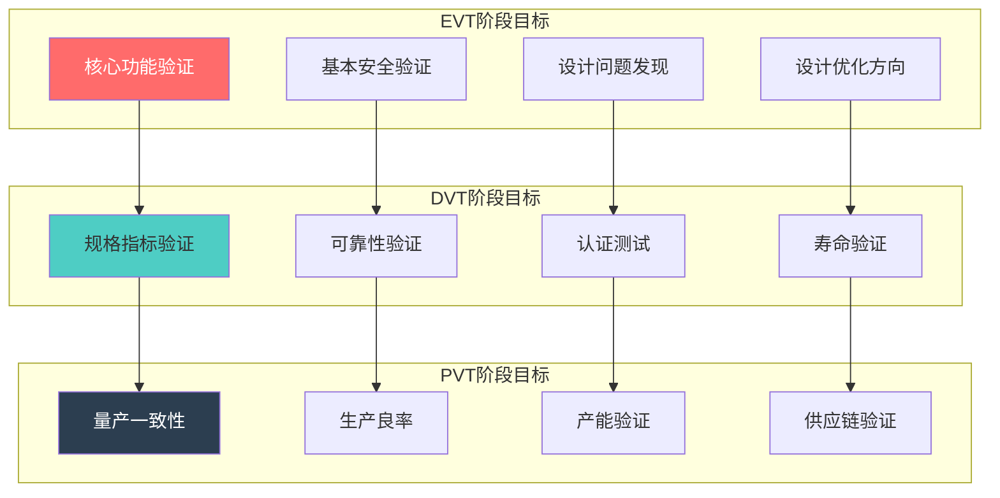
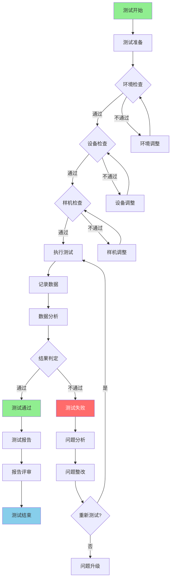
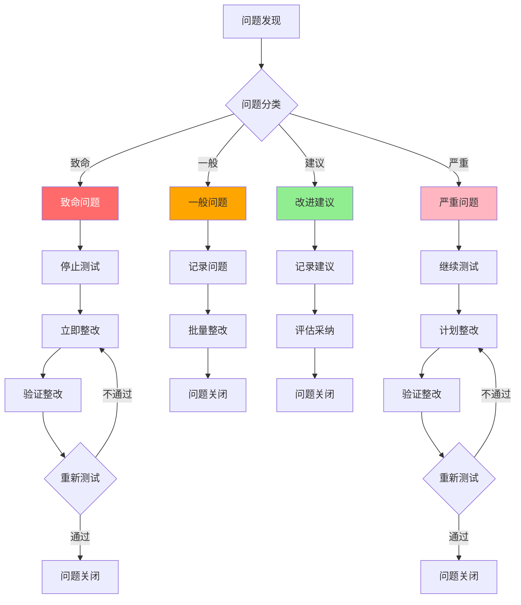
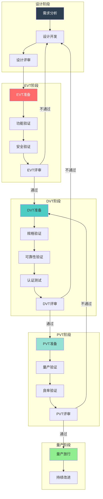

# 优必选 Walker S1 工业人形机器人设计验证计划 (DVP)

## 文档信息

- **产品名称**: Walker S1 工业人形机器人
- **产品型号**: Walker S1
- **文档版本**: V1.0
- **编制日期**: 2024年
- **产品定位**: 高端工业级人形机器人

---

## I. 验证计划概述 (Verification Plan Overview)

### A. 验证阶段定义

#### A.1 三阶段验证体系

**验证阶段划分** [推理]

| 验证阶段 | 英文名称 | 验证目标 | 样机数量 | 验证周期 | 通过标准 |
|---------|---------|---------|---------|---------|---------|
| EVT | Engineering Verification Test | 工程验证，验证设计可行性 | 3-5台 | 2-3个月 | 核心功能实现 |
| DVT | Design Verification Test | 设计验证，验证设计规格 | 10-15台 | 3-4个月 | 规格指标达标 |
| PVT | Production Verification Test | 生产验证，验证量产能力 | 30-50台 | 2-3个月 | 量产良率达标 |

**阶段转换门禁** [推理]

```
验证阶段转换流程 (ASCII):

┌─────────────────────────────────────────────────────────────────────────┐
│                          验证阶段转换门禁                                │
├─────────────────────────────────────────────────────────────────────────┤
│                                                                          │
│   ┌──────────┐     EVT门禁      ┌──────────┐     DVT门禁      ┌──────────┐│
│   │  设计    │ ──────────────→ │   EVT    │ ──────────────→ │   DVT    ││
│   │  阶段    │                  │  阶段    │                  │  阶段    ││
│   └──────────┘                  └──────────┘                  └──────────┘│
│        │                              │                              │    │
│        │                              │                              │    │
│        ▼                              ▼                              ▼    │
│   ┌──────────┐                  ┌──────────┐                  ┌──────────┐│
│   │ 设计评审 │                  │ EVT评审  │                  │ DVT评审  ││
│   │ - 设计文档│                 │ - 功能测试│                 │ - 规格测试││
│   │ - 仿真验证│                 │ - 安全测试│                 │ - 可靠性  ││
│   │ - 风险评估│                 │ - 问题整改│                 │ - 认证测试││
│   └──────────┘                  └──────────┘                  └──────────┘│
│                                                                      │    │
│                                                                      ▼    │
│                                                                 ┌──────────┐│
│                                                                 │   PVT    ││
│                                                                 │  阶段    ││
│                                                                 └──────────┘│
│                                                                      │    │
│                                                                      ▼    │
│                                                                 ┌──────────┐│
│                                                                 │ PVT评审  ││
│                                                                 │ - 量产验证││
│                                                                 │ - 良率达标││
│                                                                 │ - 产能验证││
│                                                                 └──────────┘│
│                                                                      │    │
│                                                                      ▼    │
│                                                                 ┌──────────┐│
│                                                                 │ 量产放行 ││
│                                                                 └──────────┘│
│                                                                          │
└─────────────────────────────────────────────────────────────────────────┘
```

#### A.2 各阶段验证重点

**EVT阶段验证重点** [推理]

| 验证类别 | 验证项目 | 验证目标 | 通过标准 |
|---------|---------|---------|---------|
| 功能验证 | 核心功能实现 | 验证设计可行性 | 核心功能可用 |
| 安全验证 | 基本安全功能 | 验证安全设计 | 急停功能正常 |
| 性能验证 | 关键性能指标 | 初步性能验证 | 主要指标达标 |
| 问题发现 | 设计问题发现 | 发现设计缺陷 | 问题记录完整 |

**DVT阶段验证重点** [推理]

| 验证类别 | 验证项目 | 验证目标 | 通过标准 |
|---------|---------|---------|---------|
| 规格验证 | 全部规格指标 | 验证设计规格 | 100%规格达标 |
| 可靠性验证 | 环境适应性 | 验证可靠性设计 | 可靠性指标达标 |
| 认证验证 | 法规认证 | 获取认证证书 | 认证通过 |
| 寿命验证 | 关键部件寿命 | 验证寿命设计 | 寿命指标达标 |

**PVT阶段验证重点** [推理]

| 验证类别 | 验证项目 | 验证目标 | 通过标准 |
|---------|---------|---------|---------|
| 量产验证 | 生产一致性 | 验证量产能力 | 一致性达标 |
| 良率验证 | 生产良率 | 验证良率目标 | 良率≥95% |
| 产能验证 | 生产效率 | 验证产能目标 | 产能达标 |
| 供应链验证 | 供应稳定性 | 验证供应链 | 供应稳定 |

### B. 验证目标与指标

#### B.1 核心性能指标汇总

**运动性能指标** [事实]

| 指标类别 | 指标项目 | 目标值 | 测试方法 | 验证阶段 |
|---------|---------|--------|---------|---------|
| 行走性能 | 最大行走速度 | 3km/h | 速度测试 | DVT |
| 行走性能 | 最大爬坡角度 | 20° | 斜坡测试 | DVT |
| 行走性能 | 最大台阶高度 | 15cm | 台阶测试 | DVT |
| 行走性能 | 不平整地面成功率 | >95% | 地形测试 | DVT |
| 负载性能 | 最大负载(行走) | 15kg | 负载测试 | DVT |
| 负载性能 | 单臂最大负载 | ≥5kg | 负载测试 | DVT |
| 操作性能 | 重复定位精度 | ±0.1mm | 精度测试 | DVT |
| 操作性能 | 视觉识别速度 | <70ms | 响应测试 | DVT |

**感知导航指标** [事实]

| 指标类别 | 指标项目 | 目标值 | 测试方法 | 验证阶段 |
|---------|---------|--------|---------|---------|
| 定位性能 | 常规定位精度 | 10cm | 定位测试 | DVT |
| 定位性能 | 精定位精度 | 1cm | 定位测试 | DVT |
| 导航性能 | 导航精度 | 20cm | 导航测试 | DVT |
| 避障性能 | 避障成功率 | >98% | 避障测试 | DVT |
| 建图性能 | 建图速度 | 100m²<1min | 建图测试 | DVT |

**交互性能指标** [事实]

| 指标类别 | 指标项目 | 目标值 | 测试方法 | 验证阶段 |
|---------|---------|--------|---------|---------|
| 语音交互 | 识别准确率 | 98.7% | 语音测试 | DVT |
| 语音交互 | 支持语言 | 8种 | 语言测试 | DVT |
| 语音交互 | 响应时间 | <1秒 | 响应测试 | DVT |
| 视觉交互 | 人脸识别准确率 | >95% | 识别测试 | DVT |
| 触觉交互 | 力感知精度 | 0.1N | 力觉测试 | DVT |

**安全性能指标** [关联]

| 指标类别 | 指标项目 | 目标值 | 测试方法 | 验证阶段 |
|---------|---------|--------|---------|---------|
| 急停性能 | 急停响应时间 | <50ms | 急停测试 | EVT |
| 碰撞检测 | 检测响应时间 | <10ms | 碰撞测试 | EVT |
| 力限制 | 接触力限制 | <150N | 力控测试 | DVT |
| 安全等级 | 安全完整性等级 | SIL2 | 安全评估 | DVT |
| 安全等级 | 性能等级 | PLd | 安全评估 | DVT |

**可靠性指标** [关联]

| 指标类别 | 指标项目 | 目标值 | 测试方法 | 验证阶段 |
|---------|---------|--------|---------|---------|
| 续航性能 | 正常行走续航 | 2-3小时 | 续航测试 | DVT |
| 续航性能 | 高负载续航 | 约2小时 | 续航测试 | DVT |
| 续航性能 | 充电时间 | 2小时 | 充电测试 | DVT |
| 可靠性 | MTBF | >1000小时 | 可靠性测试 | DVT |
| 寿命 | 关节寿命 | >10万次循环 | 寿命测试 | DVT |
| 寿命 | 电池循环寿命 | >500次 | 寿命测试 | DVT |

#### B.2 验证目标矩阵



---

## II. 核心验证矩阵 (Core Verification Matrix)

### A. 功能验证矩阵

#### A.1 运动功能验证

**行走功能验证** [关联]

| 测试编号 | 测试项目 | 测试方法 | 测试条件 | 通过标准 | 验证阶段 |
|---------|---------|---------|---------|---------|---------|
| MF-001 | 平地行走测试 | 速度测量 | 平坦地面,无负载 | 速度≥3km/h | DVT |
| MF-002 | 负载行走测试 | 速度测量 | 平坦地面,15kg负载 | 速度≥2km/h | DVT |
| MF-003 | 爬坡测试 | 角度测量 | 干燥斜坡 | 爬坡≥20° | DVT |
| MF-004 | 下坡测试 | 角度测量 | 干燥斜坡 | 下坡≥20° | DVT |
| MF-005 | 上台阶测试 | 高度测量 | 标准台阶 | 台阶高度≥15cm | DVT |
| MF-006 | 下台阶测试 | 高度测量 | 标准台阶 | 台阶高度≥15cm | DVT |
| MF-007 | 不平整地面测试 | 成功率统计 | 3cm障碍物 | 成功率>95% | DVT |
| MF-008 | 地面材质适应性 | 行走测试 | 地毯/地板/大理石 | 稳定行走 | DVT |

**操作功能验证** [关联]

| 测试编号 | 测试项目 | 测试方法 | 测试条件 | 通过标准 | 验证阶段 |
|---------|---------|---------|---------|---------|---------|
| MF-010 | 手臂工作空间测试 | 范围测量 | 标准姿态 | 工作范围扩大30% | DVT |
| MF-011 | 重复定位精度测试 | 位置测量 | 末端执行器 | ±0.1mm | DVT |
| MF-012 | 抓取精度测试 | 位置测量 | 标准物体 | 毫米级精度 | DVT |
| MF-013 | 柔软物体抓取测试 | 抓取测试 | 柔软物体 | 微米级控制 | DVT |
| MF-014 | 双臂协调测试 | 同步测量 | 协调任务 | 同步精度<10ms | DVT |
| MF-015 | 力控制测试 | 力测量 | 力控制任务 | 精度±0.5N | DVT |

**平衡功能验证** [关联]

| 测试编号 | 测试项目 | 测试方法 | 测试条件 | 通过标准 | 验证阶段 |
|---------|---------|---------|---------|---------|---------|
| MF-020 | 站立平衡测试 | 扰动测试 | 静止站立 | 保持平衡 | EVT |
| MF-021 | 行走平衡测试 | 扰动测试 | 行走状态 | 恢复平衡 | DVT |
| MF-022 | 负载平衡测试 | 扰动测试 | 15kg负载 | 保持平衡 | DVT |
| MF-023 | 跌倒恢复测试 | 爬起测试 | 平坦地面 | 自主爬起<30s | DVT |

#### A.2 感知功能验证

**环境感知验证** [关联]

| 测试编号 | 测试项目 | 测试方法 | 测试条件 | 通过标准 | 验证阶段 |
|---------|---------|---------|---------|---------|---------|
| MF-030 | 建图测试 | 地图质量评估 | 100m²环境 | 建图时间<1min | DVT |
| MF-031 | 定位精度测试 | 位置测量 | 已知环境 | 精度≤10cm | DVT |
| MF-032 | 精定位测试 | 位置测量 | 标记环境 | 精度≤1cm | DVT |
| MF-033 | 避障测试 | 成功率统计 | 动态环境 | 成功率>98% | DVT |
| MF-034 | 动态障碍测试 | 避障测试 | 移动障碍物 | 成功避让 | DVT |

**目标识别验证** [关联]

| 测试编号 | 测试项目 | 测试方法 | 测试条件 | 通过标准 | 验证阶段 |
|---------|---------|---------|---------|---------|---------|
| MF-040 | 视觉识别速度测试 | 时间测量 | 标准目标 | <70ms | DVT |
| MF-041 | 6D位姿识别测试 | 位姿测量 | 标准物体 | 精度达标 | DVT |
| MF-042 | 条码识别测试 | 识别测试 | 一维码/二维码 | 识别准确 | DVT |
| MF-043 | OCR识别测试 | 文字识别 | 标准文字 | 识别准确 | DVT |
| MF-044 | 人脸识别测试 | 识别测试 | 标准人脸 | 准确率>95% | DVT |

#### A.3 交互功能验证

**语音交互验证** [事实]

| 测试编号 | 测试项目 | 测试方法 | 测试条件 | 通过标准 | 验证阶段 |
|---------|---------|---------|---------|---------|---------|
| MF-050 | 语音识别准确率测试 | 准确率统计 | 标准语音库 | 准确率98.7% | DVT |
| MF-051 | 多语言支持测试 | 语言测试 | 8种语言 | 全部支持 | DVT |
| MF-052 | 远场拾音测试 | 拾音测试 | 3-5米距离 | 有效拾音 | DVT |
| MF-053 | 噪声环境测试 | 识别测试 | 嘈杂环境 | 有效识别 | DVT |
| MF-054 | 响应时间测试 | 时间测量 | 语音交互 | <1秒 | DVT |

**视觉交互验证** [关联]

| 测试编号 | 测试项目 | 测试方法 | 测试条件 | 通过标准 | 验证阶段 |
|---------|---------|---------|---------|---------|---------|
| MF-060 | 手势识别测试 | 识别测试 | 标准手势 | 准确率>90% | DVT |
| MF-061 | 表情识别测试 | 识别测试 | 标准表情 | 准确率>85% | DVT |
| MF-062 | 视线跟踪测试 | 跟踪测试 | 标准场景 | 精度5° | DVT |
| MF-063 | LED灯语测试 | 显示测试 | 状态显示 | 正确显示 | EVT |

**触觉交互验证** [关联]

| 测试编号 | 测试项目 | 测试方法 | 测试条件 | 通过标准 | 验证阶段 |
|---------|---------|---------|---------|---------|---------|
| MF-070 | 触觉感知测试 | 力测量 | 标准力 | 精度0.1N | DVT |
| MF-071 | 六维力测试 | 力/力矩测量 | 标准负载 | 精度达标 | DVT |
| MF-072 | 触摸响应测试 | 响应测试 | 触摸事件 | 响应正确 | EVT |

### B. 硬件验证矩阵

#### B.1 计算平台验证

**CPU验证** [关联]

| 测试编号 | 测试项目 | 测试方法 | 测试条件 | 通过标准 | 验证阶段 |
|---------|---------|---------|---------|---------|---------|
| HW-001 | CPU性能测试 | 基准测试 | 标准负载 | 性能达标 | EVT |
| HW-002 | CPU温度测试 | 温度测量 | 满负载 | 温度<85°C | DVT |
| HW-003 | CPU稳定性测试 | 压力测试 | 长时间运行 | 无故障 | DVT |

**GPU验证** [关联]

| 测试编号 | 测试项目 | 测试方法 | 测试条件 | 通过标准 | 验证阶段 |
|---------|---------|---------|---------|---------|---------|
| HW-010 | GPU性能测试 | 基准测试 | 标准负载 | 性能达标 | EVT |
| HW-011 | GPU温度测试 | 温度测量 | 满负载 | 温度<85°C | DVT |
| HW-012 | 视觉处理测试 | 处理测试 | 视觉任务 | 处理正常 | EVT |

**存储验证** [推理]

| 测试编号 | 测试项目 | 测试方法 | 测试条件 | 通过标准 | 验证阶段 |
|---------|---------|---------|---------|---------|---------|
| HW-020 | 内存测试 | 内存测试 | 标准测试 | 无错误 | EVT |
| HW-021 | 存储读写测试 | 读写测试 | 标准测试 | 速度达标 | EVT |
| HW-022 | 存储可靠性测试 | 压力测试 | 长时间运行 | 无故障 | DVT |

#### B.2 执行器验证

**关节执行器验证** [关联]

| 测试编号 | 测试项目 | 测试方法 | 测试条件 | 通过标准 | 验证阶段 |
|---------|---------|---------|---------|---------|---------|
| HW-030 | 关节扭矩测试 | 扭矩测量 | 额定负载 | 扭矩达标 | EVT |
| HW-031 | 关节速度测试 | 速度测量 | 额定负载 | 速度达标 | EVT |
| HW-032 | 关节精度测试 | 位置测量 | 标准位置 | 精度±0.01° | DVT |
| HW-033 | 关节温度测试 | 温度测量 | 满负载 | 温度<70°C | DVT |
| HW-034 | 关节寿命测试 | 循环测试 | 额定负载 | >10万次 | DVT |
| HW-035 | 关节过载测试 | 过载测试 | 1.5倍负载 | 保护正常 | EVT |

**灵巧手验证** [关联]

| 测试编号 | 测试项目 | 测试方法 | 测试条件 | 通过标准 | 验证阶段 |
|---------|---------|---------|---------|---------|---------|
| HW-040 | 手指运动测试 | 运动测试 | 全行程 | 运动正常 | EVT |
| HW-041 | 抓取力测试 | 力测量 | 标准物体 | 力达标 | EVT |
| HW-042 | 触觉传感器测试 | 传感器测试 | 标准力 | 精度0.1N | DVT |
| HW-043 | 抓取精度测试 | 位置测量 | 精细物体 | 毫米级 | DVT |

#### B.3 传感器验证

**IMU验证** [关联]

| 测试编号 | 测试项目 | 测试方法 | 测试条件 | 通过标准 | 验证阶段 |
|---------|---------|---------|---------|---------|---------|
| HW-050 | IMU精度测试 | 精度测量 | 标准姿态 | 精度0.1° | DVT |
| HW-051 | IMU漂移测试 | 漂移测量 | 静止状态 | 漂移达标 | DVT |
| HW-052 | IMU响应测试 | 响应测试 | 动态运动 | 响应正常 | EVT |

**视觉传感器验证** [关联]

| 测试编号 | 测试项目 | 测试方法 | 测试条件 | 通过标准 | 验证阶段 |
|---------|---------|---------|---------|---------|---------|
| HW-060 | RGBD相机测试 | 图像质量 | 标准环境 | 图像清晰 | EVT |
| HW-061 | 深度精度测试 | 深度测量 | 标准距离 | 精度达标 | DVT |
| HW-062 | 鱼眼相机测试 | 图像质量 | 标准环境 | 180°覆盖 | EVT |
| HW-063 | 相机同步测试 | 同步测试 | 多相机 | 同步正常 | DVT |

**激光雷达验证** [关联]

| 测试编号 | 测试项目 | 测试方法 | 测试条件 | 通过标准 | 验证阶段 |
|---------|---------|---------|---------|---------|---------|
| HW-070 | 测距精度测试 | 距离测量 | 标准距离 | 精度±1cm | DVT |
| HW-071 | 测距范围测试 | 范围测试 | 标准环境 | 0.1-30m | DVT |
| HW-072 | 扫描频率测试 | 频率测量 | 标准工作 | 10-20Hz | DVT |
| HW-073 | 点云质量测试 | 质量评估 | 标准环境 | 质量达标 | DVT |

**力传感器验证** [关联]

| 测试编号 | 测试项目 | 测试方法 | 测试条件 | 通过标准 | 验证阶段 |
|---------|---------|---------|---------|---------|---------|
| HW-080 | 六维力精度测试 | 力测量 | 标准力 | 力精度0.5N | DVT |
| HW-081 | 六维力矩精度测试 | 力矩测量 | 标准力矩 | 力矩精度0.05N·m | DVT |
| HW-082 | 触觉传感器测试 | 力测量 | 标准力 | 精度0.1N | DVT |

#### B.4 电源系统验证

**电池验证** [关联]

| 测试编号 | 测试项目 | 测试方法 | 测试条件 | 通过标准 | 验证阶段 |
|---------|---------|---------|---------|---------|---------|
| HW-090 | 电池容量测试 | 容量测量 | 标准放电 | 容量≥10Ah | DVT |
| HW-091 | 电池续航测试 | 续航测量 | 正常工作 | 续航2-3小时 | DVT |
| HW-092 | 充电时间测试 | 时间测量 | 0-100% | 时间≤2小时 | DVT |
| HW-093 | 电池温度测试 | 温度测量 | 充放电 | 温度<45°C | DVT |
| HW-094 | 电池安全测试 | 安全测试 | 异常条件 | 保护正常 | EVT |
| HW-095 | 电池循环寿命测试 | 循环测试 | 充放电循环 | >500次 | DVT |

**电源管理验证** [推理]

| 测试编号 | 测试项目 | 测试方法 | 测试条件 | 通过标准 | 验证阶段 |
|---------|---------|---------|---------|---------|---------|
| HW-100 | 功耗测试 | 功率测量 | 各工作模式 | 功耗达标 | DVT |
| HW-101 | 电源效率测试 | 效率测量 | 标准负载 | 效率>90% | DVT |
| HW-102 | 电源保护测试 | 保护测试 | 异常条件 | 保护正常 | EVT |

#### B.5 通信系统验证

**内部通信验证** [关联]

| 测试编号 | 测试项目 | 测试方法 | 测试条件 | 通过标准 | 验证阶段 |
|---------|---------|---------|---------|---------|---------|
| HW-110 | EtherCAT通信测试 | 通信测试 | 标准配置 | 通信正常 | EVT |
| HW-111 | 通信延迟测试 | 延迟测量 | 标准负载 | 延迟<100μs | DVT |
| HW-112 | 通信稳定性测试 | 稳定性测试 | 长时间运行 | 无故障 | DVT |
| HW-113 | 同步精度测试 | 同步测量 | 分布式时钟 | 精度<1μs | DVT |

**外部通信验证** [关联]

| 测试编号 | 测试项目 | 测试方法 | 测试条件 | 通过标准 | 验证阶段 |
|---------|---------|---------|---------|---------|---------|
| HW-120 | Wi-Fi测试 | 连接测试 | 标准环境 | 连接正常 | EVT |
| HW-121 | 蓝牙测试 | 连接测试 | 标准环境 | 连接正常 | EVT |
| HW-122 | 以太网测试 | 通信测试 | 标准配置 | 通信正常 | EVT |
| HW-123 | 网络延迟测试 | 延迟测量 | 标准网络 | 延迟达标 | DVT |

### C. 结构验证矩阵

#### C.1 骨架结构验证

**骨架强度验证** [关联]

| 测试编号 | 测试项目 | 测试方法 | 测试条件 | 通过标准 | 验证阶段 |
|---------|---------|---------|---------|---------|---------|
| ST-001 | 骨架静载测试 | 载荷测试 | 1.5倍负载 | 无变形 | EVT |
| ST-002 | 骨架动载测试 | 载荷测试 | 动态负载 | 无损坏 | DVT |
| ST-003 | 脊椎承载测试 | 承载测试 | 50kg负载 | 承载正常 | DVT |
| ST-004 | 疲劳寿命测试 | 循环测试 | 额定负载 | >20,000次 | DVT |

**关节结构验证** [关联]

| 测试编号 | 测试项目 | 测试方法 | 测试条件 | 通过标准 | 验证阶段 |
|---------|---------|---------|---------|---------|---------|
| ST-010 | 关节刚度测试 | 刚度测量 | 额定负载 | 刚度达标 | DVT |
| ST-011 | 关节强度测试 | 强度测试 | 1.5倍负载 | 无损坏 | EVT |
| ST-012 | 关节磨损测试 | 磨损测试 | 循环运动 | 磨损达标 | DVT |

#### C.2 外壳结构验证

**防护性能验证** [关联]

| 测试编号 | 测试项目 | 测试方法 | 测试条件 | 通过标准 | 验证阶段 |
|---------|---------|---------|---------|---------|---------|
| ST-020 | IP防护测试 | 防护测试 | IP67标准 | 防护达标 | DVT |
| ST-021 | 密封性测试 | 密封测试 | 水浸测试 | 密封良好 | DVT |
| ST-022 | 防尘测试 | 防尘测试 | 粉尘环境 | 无粉尘进入 | DVT |

**碰撞防护验证** [推理]

| 测试编号 | 测试项目 | 测试方法 | 测试条件 | 通过标准 | 验证阶段 |
|---------|---------|---------|---------|---------|---------|
| ST-030 | 碰撞测试 | 碰撞测试 | 标准碰撞 | 无损坏 | DVT |
| ST-031 | 跌落测试 | 跌落测试 | 标准高度 | 功能正常 | DVT |
| ST-032 | 缓冲性能测试 | 缓冲测试 | 标准冲击 | 缓冲有效 | DVT |

#### C.3 散热系统验证

**散热性能验证** [关联]

| 测试编号 | 测试项目 | 测试方法 | 测试条件 | 通过标准 | 验证阶段 |
|---------|---------|---------|---------|---------|---------|
| ST-040 | CPU散热测试 | 温度测量 | 满负载 | 温度<85°C | DVT |
| ST-041 | GPU散热测试 | 温度测量 | 满负载 | 温度<85°C | DVT |
| ST-042 | 关节散热测试 | 温度测量 | 满负载 | 温度<70°C | DVT |
| ST-043 | 连续工作散热测试 | 温度测量 | 8小时工作 | 温度稳定 | DVT |

### D. 软件验证矩阵

#### D.1 运动控制软件验证

**运动学验证** [关联]

| 测试编号 | 测试项目 | 测试方法 | 测试条件 | 通过标准 | 验证阶段 |
|---------|---------|---------|---------|---------|---------|
| SW-001 | 正运动学精度测试 | 精度测试 | 标准姿态 | 误差<1mm | DVT |
| SW-002 | 逆运动学精度测试 | 精度测试 | 标准位置 | 误差<0.1° | DVT |
| SW-003 | 奇异点处理测试 | 奇异点测试 | 奇异姿态 | 处理正确 | EVT |
| SW-004 | 工作空间测试 | 范围测试 | 全范围 | 范围达标 | DVT |

**动力学验证** [关联]

| 测试编号 | 测试项目 | 测试方法 | 测试条件 | 通过标准 | 验证阶段 |
|---------|---------|---------|---------|---------|---------|
| SW-010 | 动力学计算精度测试 | 精度测试 | 标准运动 | 误差<5% | DVT |
| SW-011 | 重力补偿测试 | 补偿测试 | 静止姿态 | 补偿准确 | DVT |
| SW-012 | 惯性参数测试 | 参数测试 | 标准运动 | 参数准确 | DVT |

**平衡控制验证** [关联]

| 测试编号 | 测试项目 | 测试方法 | 测试条件 | 通过标准 | 验证阶段 |
|---------|---------|---------|---------|---------|---------|
| SW-020 | ZMP控制测试 | 控制测试 | 站立平衡 | 控制稳定 | EVT |
| SW-021 | MPC控制测试 | 控制测试 | 行走平衡 | 控制稳定 | DVT |
| SW-022 | WBC控制测试 | 控制测试 | 动态平衡 | 控制稳定 | DVT |
| SW-023 | 扰动恢复测试 | 扰动测试 | 外部扰动 | 恢复正常 | DVT |

**步态规划验证** [关联]

| 测试编号 | 测试项目 | 测试方法 | 测试条件 | 通过标准 | 验证阶段 |
|---------|---------|---------|---------|---------|---------|
| SW-030 | 步态生成测试 | 步态测试 | 标准步态 | 步态正常 | EVT |
| SW-031 | 步态切换测试 | 切换测试 | 步态切换 | 切换平滑 | DVT |
| SW-032 | 地形适应测试 | 适应测试 | 不同地形 | 适应正常 | DVT |

#### D.2 感知导航软件验证

**SLAM验证** [关联]

| 测试编号 | 测试项目 | 测试方法 | 测试条件 | 通过标准 | 验证阶段 |
|---------|---------|---------|---------|---------|---------|
| SW-040 | 视觉SLAM测试 | SLAM测试 | 标准环境 | 定位精度≤10cm | DVT |
| SW-041 | LiDAR SLAM测试 | SLAM测试 | 标准环境 | 定位精度≤5cm | DVT |
| SW-042 | 回环检测测试 | 回环测试 | 闭环路径 | 检测正确 | DVT |
| SW-043 | 地图质量测试 | 质量评估 | 标准环境 | 质量达标 | DVT |

**目标检测验证** [关联]

| 测试编号 | 测试项目 | 测试方法 | 测试条件 | 通过标准 | 验证阶段 |
|---------|---------|---------|---------|---------|---------|
| SW-050 | 目标识别测试 | 识别测试 | 标准目标 | 准确率>90% | DVT |
| SW-051 | 目标跟踪测试 | 跟踪测试 | 移动目标 | 跟踪稳定 | DVT |
| SW-052 | 6D位姿估计测试 | 位姿测试 | 标准物体 | 精度达标 | DVT |

**路径规划验证** [关联]

| 测试编号 | 测试项目 | 测试方法 | 测试条件 | 通过标准 | 验证阶段 |
|---------|---------|---------|---------|---------|---------|
| SW-060 | 全局规划测试 | 规划测试 | 标准地图 | 路径最优 | DVT |
| SW-061 | 局部规划测试 | 规划测试 | 动态环境 | 避障成功 | DVT |
| SW-062 | 路径跟踪测试 | 跟踪测试 | 标准路径 | 精度≤20cm | DVT |

#### D.3 智能交互软件验证

**语音识别验证** [事实]

| 测试编号 | 测试项目 | 测试方法 | 测试条件 | 通过标准 | 验证阶段 |
|---------|---------|---------|---------|---------|---------|
| SW-070 | ASR准确率测试 | 准确率测试 | 标准语音库 | 准确率98.7% | DVT |
| SW-071 | 唤醒词测试 | 唤醒测试 | 唤醒词 | 准确率>95% | DVT |
| SW-072 | 噪声抑制测试 | 抑制测试 | 嘈杂环境 | 抑制>20dB | DVT |
| SW-073 | 多语言测试 | 语言测试 | 8种语言 | 全部支持 | DVT |

**自然语言理解验证** [关联]

| 测试编号 | 测试项目 | 测试方法 | 测试条件 | 通过标准 | 验证阶段 |
|---------|---------|---------|---------|---------|---------|
| SW-080 | 意图识别测试 | 识别测试 | 标准指令 | 准确率>90% | DVT |
| SW-081 | 多轮对话测试 | 对话测试 | 多轮对话 | >5轮对话 | DVT |
| SW-082 | 任务分解测试 | 分解测试 | 复杂任务 | 分解正确 | DVT |

#### D.4 安全监控软件验证

**碰撞检测验证** [关联]

| 测试编号 | 测试项目 | 测试方法 | 测试条件 | 通过标准 | 验证阶段 |
|---------|---------|---------|---------|---------|---------|
| SW-090 | 碰撞检测响应测试 | 响应测试 | 碰撞事件 | 响应<10ms | EVT |
| SW-091 | 碰撞定位测试 | 定位测试 | 碰撞事件 | 定位准确 | DVT |
| SW-092 | 碰撞响应测试 | 响应测试 | 碰撞事件 | 响应正确 | EVT |

**跌倒检测验证** [关联]

| 测试编号 | 测试项目 | 测试方法 | 测试条件 | 通过标准 | 验证阶段 |
|---------|---------|---------|---------|---------|---------|
| SW-100 | 跌倒预测测试 | 预测测试 | 跌倒风险 | 预测准确 | DVT |
| SW-101 | 跌倒保护测试 | 保护测试 | 跌倒事件 | 保护有效 | EVT |
| SW-102 | 跌倒恢复测试 | 恢复测试 | 跌倒状态 | 自主爬起 | DVT |

**安全监控验证** [关联]

| 测试编号 | 测试项目 | 测试方法 | 测试条件 | 通过标准 | 验证阶段 |
|---------|---------|---------|---------|---------|---------|
| SW-110 | 急停响应测试 | 响应测试 | 急停触发 | 响应<50ms | EVT |
| SW-111 | 过载保护测试 | 保护测试 | 过载条件 | 保护正常 | EVT |
| SW-112 | 故障恢复测试 | 恢复测试 | 故障条件 | 恢复正常 | DVT |

---

## III. 人形机器人专属测试项 (Humanoid-Specific Tests)

### A. 运动能力测试

#### A.1 双足行走测试

**行走稳定性测试** [关联]

| 测试编号 | 测试项目 | 测试方法 | 测试条件 | 通过标准 | 验证阶段 |
|---------|---------|---------|---------|---------|---------|
| HM-001 | 直线行走测试 | 行走测试 | 平坦地面10m | 完成行走 | EVT |
| HM-002 | 转弯行走测试 | 行走测试 | 90°转弯 | 转弯稳定 | DVT |
| HM-003 | 后退行走测试 | 行走测试 | 平坦地面5m | 完成后退 | DVT |
| HM-004 | 侧向移动测试 | 移动测试 | 侧向移动 | 移动稳定 | DVT |
| HM-005 | 原地转向测试 | 转向测试 | 360°转向 | 转向稳定 | DVT |

**地形适应性测试** [关联]

| 测试编号 | 测试项目 | 测试方法 | 测试条件 | 通过标准 | 验证阶段 |
|---------|---------|---------|---------|---------|---------|
| HM-010 | 斜坡行走测试 | 行走测试 | 20°斜坡 | 行走稳定 | DVT |
| HM-011 | 台阶行走测试 | 行走测试 | 15cm台阶 | 上下稳定 | DVT |
| HM-012 | 不平整地面测试 | 行走测试 | 3cm障碍 | 成功率>95% | DVT |
| HM-013 | 地毯行走测试 | 行走测试 | 地毯地面 | 行走稳定 | DVT |
| HM-014 | 光滑地面测试 | 行走测试 | 大理石地面 | 行走稳定 | DVT |

**负载行走测试** [关联]

| 测试编号 | 测试项目 | 测试方法 | 测试条件 | 通过标准 | 验证阶段 |
|---------|---------|---------|---------|---------|---------|
| HM-020 | 轻负载行走测试 | 行走测试 | 5kg负载 | 行走稳定 | DVT |
| HM-021 | 中负载行走测试 | 行走测试 | 10kg负载 | 行走稳定 | DVT |
| HM-022 | 满负载行走测试 | 行走测试 | 15kg负载 | 行走稳定 | DVT |
| HM-023 | 负载上下台阶测试 | 行走测试 | 15kg负载+台阶 | 完成测试 | DVT |

#### A.2 平衡能力测试

**静态平衡测试** [推理]

| 测试编号 | 测试项目 | 测试方法 | 测试条件 | 通过标准 | 验证阶段 |
|---------|---------|---------|---------|---------|---------|
| HM-030 | 单脚站立测试 | 平衡测试 | 单脚站立10s | 保持平衡 | DVT |
| HM-031 | 负载平衡测试 | 平衡测试 | 15kg负载站立 | 保持平衡 | DVT |
| HM-032 | 姿态保持测试 | 平衡测试 | 各种姿态 | 保持稳定 | DVT |

**动态平衡测试** [推理]

| 测试编号 | 测试项目 | 测试方法 | 测试条件 | 通过标准 | 验证阶段 |
|---------|---------|---------|---------|---------|---------|
| HM-040 | 推力扰动测试 | 扰动测试 | 50N推力 | 恢复平衡 | DVT |
| HM-041 | 拉力扰动测试 | 扰动测试 | 50N拉力 | 恢复平衡 | DVT |
| HM-042 | 碰撞扰动测试 | 扰动测试 | 侧面碰撞 | 恢复平衡 | DVT |
| HM-043 | 地面扰动测试 | 扰动测试 | 地面移动 | 保持平衡 | DVT |

#### A.3 操作能力测试

**手臂操作测试** [关联]

| 测试编号 | 测试项目 | 测试方法 | 测试条件 | 通过标准 | 验证阶段 |
|---------|---------|---------|---------|---------|---------|
| HM-050 | 手臂工作空间测试 | 范围测试 | 全范围运动 | 范围扩大30% | DVT |
| HM-051 | 手臂速度测试 | 速度测试 | 最大速度 | 速度达标 | DVT |
| HM-052 | 手臂精度测试 | 精度测试 | 定位任务 | 精度±0.1mm | DVT |
| HM-053 | 手臂负载测试 | 负载测试 | 5kg负载 | 操作正常 | DVT |

**手部操作测试** [关联]

| 测试编号 | 测试项目 | 测试方法 | 测试条件 | 通过标准 | 验证阶段 |
|---------|---------|---------|---------|---------|---------|
| HM-060 | 精细抓取测试 | 抓取测试 | 小物体 | 抓取成功 | DVT |
| HM-061 | 力控抓取测试 | 抓取测试 | 柔软物体 | 微米级控制 | DVT |
| HM-062 | 工具操作测试 | 操作测试 | 标准工具 | 操作正常 | DVT |
| HM-063 | 双手协调测试 | 协调测试 | 双手任务 | 协调正常 | DVT |

### B. 执行器专项测试

#### B.1 关节执行器测试

**扭矩性能测试** [关联]

| 测试编号 | 测试项目 | 测试方法 | 测试条件 | 通过标准 | 验证阶段 |
|---------|---------|---------|---------|---------|---------|
| AC-001 | 额定扭矩测试 | 扭矩测量 | 额定条件 | 扭矩达标 | EVT |
| AC-002 | 峰值扭矩测试 | 扭矩测量 | 峰值条件 | 扭矩达标 | DVT |
| AC-003 | 扭矩精度测试 | 精度测量 | 标准扭矩 | 精度达标 | DVT |
| AC-004 | 扭矩响应测试 | 响应测试 | 扭矩指令 | 响应<1ms | DVT |

**速度性能测试** [关联]

| 测试编号 | 测试项目 | 测试方法 | 测试条件 | 通过标准 | 验证阶段 |
|---------|---------|---------|---------|---------|---------|
| AC-010 | 额定速度测试 | 速度测量 | 额定条件 | 速度达标 | EVT |
| AC-011 | 最高速度测试 | 速度测量 | 最高条件 | 速度达标 | DVT |
| AC-012 | 速度精度测试 | 精度测量 | 标准速度 | 精度达标 | DVT |
| AC-013 | 加减速测试 | 动态测试 | 加减速 | 平滑过渡 | DVT |

**位置精度测试** [关联]

| 测试编号 | 测试项目 | 测试方法 | 测试条件 | 通过标准 | 验证阶段 |
|---------|---------|---------|---------|---------|---------|
| AC-020 | 位置精度测试 | 位置测量 | 标准位置 | 精度±0.01° | DVT |
| AC-021 | 重复定位精度测试 | 重复测试 | 多次定位 | 精度±0.01° | DVT |
| AC-022 | 位置稳定性测试 | 稳定性测试 | 保持位置 | 漂移达标 | DVT |

**寿命测试** [关联]

| 测试编号 | 测试项目 | 测试方法 | 测试条件 | 通过标准 | 验证阶段 |
|---------|---------|---------|---------|---------|---------|
| AC-030 | 关节寿命测试 | 循环测试 | 额定负载 | >10万次 | DVT |
| AC-031 | 减速器寿命测试 | 循环测试 | 额定负载 | >3万小时 | DVT |
| AC-032 | 电机寿命测试 | 运行测试 | 额定条件 | 寿命达标 | DVT |

#### B.2 灵巧手测试

**手指运动测试** [关联]

| 测试编号 | 测试项目 | 测试方法 | 测试条件 | 通过标准 | 验证阶段 |
|---------|---------|---------|---------|---------|---------|
| AC-040 | 手指运动范围测试 | 范围测量 | 全行程 | 范围达标 | EVT |
| AC-041 | 手指速度测试 | 速度测量 | 最大速度 | 速度达标 | DVT |
| AC-042 | 手指力度测试 | 力测量 | 最大力度 | 力度达标 | DVT |
| AC-043 | 手指协调测试 | 协调测试 | 多指运动 | 协调正常 | DVT |

**触觉感知测试** [事实]

| 测试编号 | 测试项目 | 测试方法 | 测试条件 | 通过标准 | 验证阶段 |
|---------|---------|---------|---------|---------|---------|
| AC-050 | 触觉传感器测试 | 传感器测试 | 标准力 | 精度0.1N | DVT |
| AC-051 | 六维力测试 | 力测量 | 标准负载 | 精度达标 | DVT |
| AC-052 | 力矩测试 | 力矩测量 | 标准力矩 | 精度达标 | DVT |

### C. 传感器专项测试

#### C.1 本体感知传感器测试

**编码器测试** [关联]

| 测试编号 | 测试项目 | 测试方法 | 测试条件 | 通过标准 | 验证阶段 |
|---------|---------|---------|---------|---------|---------|
| SE-001 | 编码器分辨率测试 | 分辨率测试 | 标准条件 | ≥17bit | DVT |
| SE-002 | 编码器精度测试 | 精度测试 | 标准条件 | 精度±0.01° | DVT |
| SE-003 | 编码器稳定性测试 | 稳定性测试 | 长时间运行 | 稳定可靠 | DVT |

**IMU测试** [关联]

| 测试编号 | 测试项目 | 测试方法 | 测试条件 | 通过标准 | 验证阶段 |
|---------|---------|---------|---------|---------|---------|
| SE-010 | IMU精度测试 | 精度测试 | 标准姿态 | 精度0.1° | DVT |
| SE-011 | IMU漂移测试 | 漂移测试 | 静止状态 | 漂移达标 | DVT |
| SE-012 | IMU响应测试 | 响应测试 | 动态运动 | 响应1kHz | DVT |

**力传感器测试** [关联]

| 测试编号 | 测试项目 | 测试方法 | 测试条件 | 通过标准 | 验证阶段 |
|---------|---------|---------|---------|---------|---------|
| SE-020 | 六维力精度测试 | 精度测试 | 标准力 | 力精度0.5N | DVT |
| SE-021 | 六维力矩精度测试 | 精度测试 | 标准力矩 | 力矩精度0.05N·m | DVT |
| SE-022 | 六维力响应测试 | 响应测试 | 力变化 | 响应<1ms | DVT |

#### C.2 环境感知传感器测试

**视觉传感器测试** [关联]

| 测试编号 | 测试项目 | 测试方法 | 测试条件 | 通过标准 | 验证阶段 |
|---------|---------|---------|---------|---------|---------|
| SE-030 | RGBD分辨率测试 | 分辨率测试 | 标准条件 | 1920×1080 | EVT |
| SE-031 | RGBD帧率测试 | 帧率测试 | 标准条件 | 30fps | EVT |
| SE-032 | 深度精度测试 | 精度测试 | 标准距离 | 精度达标 | DVT |
| SE-033 | 鱼眼相机测试 | 视场测试 | 标准条件 | 180°视场 | EVT |

**激光雷达测试** [关联]

| 测试编号 | 测试项目 | 测试方法 | 测试条件 | 通过标准 | 验证阶段 |
|---------|---------|---------|---------|---------|---------|
| SE-040 | 测距精度测试 | 精度测试 | 标准距离 | 精度±1cm | DVT |
| SE-041 | 测距范围测试 | 范围测试 | 标准环境 | 0.1-30m | DVT |
| SE-042 | 扫描频率测试 | 频率测试 | 标准工作 | 10-20Hz | DVT |
| SE-043 | 视场角测试 | 视场测试 | 标准条件 | 360°水平 | DVT |

### D. 感知导航专项测试

#### D.1 定位测试

**视觉定位测试** [关联]

| 测试编号 | 测试项目 | 测试方法 | 测试条件 | 通过标准 | 验证阶段 |
|---------|---------|---------|---------|---------|---------|
| PN-001 | 视觉定位精度测试 | 定位测试 | 已知环境 | 精度≤10cm | DVT |
| PN-002 | 视觉定位稳定性测试 | 稳定性测试 | 长时间运行 | 稳定可靠 | DVT |
| PN-003 | 视觉里程计测试 | 里程测试 | 标准路径 | 精度2% | DVT |

**LiDAR定位测试** [关联]

| 测试编号 | 测试项目 | 测试方法 | 测试条件 | 通过标准 | 验证阶段 |
|---------|---------|---------|---------|---------|---------|
| PN-010 | LiDAR定位精度测试 | 定位测试 | 已知环境 | 精度≤5cm | DVT |
| PN-011 | LiDAR地图匹配测试 | 匹配测试 | 标准地图 | 匹配准确 | DVT |
| PN-012 | LiDAR回环检测测试 | 回环测试 | 闭环路径 | 检测正确 | DVT |

**融合定位测试** [关联]

| 测试编号 | 测试项目 | 测试方法 | 测试条件 | 通过标准 | 验证阶段 |
|---------|---------|---------|---------|---------|---------|
| PN-020 | 多传感器融合测试 | 融合测试 | 标准环境 | 精度≤1cm | DVT |
| PN-021 | 融合定位稳定性测试 | 稳定性测试 | 动态环境 | 稳定可靠 | DVT |
| PN-022 | 不确定性估计测试 | 估计测试 | 标准条件 | 估计准确 | DVT |

#### D.2 建图测试

**视觉建图测试** [关联]

| 测试编号 | 测试项目 | 测试方法 | 测试条件 | 通过标准 | 验证阶段 |
|---------|---------|---------|---------|---------|---------|
| PN-030 | 特征地图构建测试 | 建图测试 | 标准环境 | 地图完整 | DVT |
| PN-031 | 稠密地图构建测试 | 建图测试 | 标准环境 | 地图完整 | DVT |
| PN-032 | 语义地图构建测试 | 建图测试 | 标准环境 | 语义正确 | DVT |

**LiDAR建图测试** [关联]

| 测试编号 | 测试项目 | 测试方法 | 测试条件 | 通过标准 | 验证阶段 |
|---------|---------|---------|---------|---------|---------|
| PN-040 | 点云地图构建测试 | 建图测试 | 标准环境 | 地图完整 | DVT |
| PN-041 | 栅格地图构建测试 | 建图测试 | 标准环境 | 地图完整 | DVT |
| PN-042 | 高程地图构建测试 | 建图测试 | 标准环境 | 地图完整 | DVT |

#### D.3 导航测试

**全局导航测试** [关联]

| 测试编号 | 测试项目 | 测试方法 | 测试条件 | 通过标准 | 验证阶段 |
|---------|---------|---------|---------|---------|---------|
| PN-050 | 全局路径规划测试 | 规划测试 | 标准地图 | 路径最优 | DVT |
| PN-051 | 全局导航精度测试 | 导航测试 | 标准路径 | 精度≤20cm | DVT |
| PN-052 | 长距离导航测试 | 导航测试 | 100m路径 | 完成导航 | DVT |

**局部导航测试** [关联]

| 测试编号 | 测试项目 | 测试方法 | 测试条件 | 通过标准 | 验证阶段 |
|---------|---------|---------|---------|---------|---------|
| PN-060 | 局部避障测试 | 避障测试 | 动态障碍 | 成功率>98% | DVT |
| PN-061 | 动态避障测试 | 避障测试 | 移动障碍 | 避障成功 | DVT |
| PN-062 | 窄通道导航测试 | 导航测试 | 窄通道 | 通过成功 | DVT |

### E. 智能交互专项测试

#### E.1 语音交互测试

**语音识别测试** [事实]

| 测试编号 | 测试项目 | 测试方法 | 测试条件 | 通过标准 | 验证阶段 |
|---------|---------|---------|---------|---------|---------|
| II-001 | ASR准确率测试 | 准确率测试 | 标准语音库 | 准确率98.7% | DVT |
| II-002 | 唤醒词检测测试 | 检测测试 | 唤醒词 | 准确率>95% | DVT |
| II-003 | 远场拾音测试 | 拾音测试 | 3-5米 | 有效拾音 | DVT |
| II-004 | 噪声抑制测试 | 抑制测试 | 嘈杂环境 | 抑制>20dB | DVT |

**语音合成测试** [推理]

| 测试编号 | 测试项目 | 测试方法 | 测试条件 | 通过标准 | 验证阶段 |
|---------|---------|---------|---------|---------|---------|
| II-010 | TTS自然度测试 | 自然度测试 | 标准文本 | MOS>4.0 | DVT |
| II-011 | TTS延迟测试 | 延迟测试 | 标准文本 | 延迟<300ms | DVT |
| II-012 | 情感语音测试 | 情感测试 | 情感文本 | 情感正确 | DVT |

**对话管理测试** [推理]

| 测试编号 | 测试项目 | 测试方法 | 测试条件 | 通过标准 | 验证阶段 |
|---------|---------|---------|---------|---------|---------|
| II-020 | 意图识别测试 | 识别测试 | 标准指令 | 准确率>90% | DVT |
| II-021 | 多轮对话测试 | 对话测试 | 多轮对话 | >5轮对话 | DVT |
| II-022 | 上下文理解测试 | 理解测试 | 上下文 | 理解正确 | DVT |

#### E.2 视觉交互测试

**人脸识别测试** [推理]

| 测试编号 | 测试项目 | 测试方法 | 测试条件 | 通过标准 | 验证阶段 |
|---------|---------|---------|---------|---------|---------|
| II-030 | 人脸检测测试 | 检测测试 | 标准人脸 | 准确率>99% | DVT |
| II-031 | 人脸识别测试 | 识别测试 | 标准人脸 | 准确率>95% | DVT |
| II-032 | 表情识别测试 | 识别测试 | 标准表情 | 准确率>85% | DVT |

**手势识别测试** [推理]

| 测试编号 | 测试项目 | 测试方法 | 测试条件 | 通过标准 | 验证阶段 |
|---------|---------|---------|---------|---------|---------|
| II-040 | 手势检测测试 | 检测测试 | 标准手势 | 准确率>90% | DVT |
| II-041 | 手势识别测试 | 识别测试 | 标准手势 | 准确率>90% | DVT |
| II-042 | 手势跟踪测试 | 跟踪测试 | 动态手势 | 跟踪稳定 | DVT |

#### E.3 触觉交互测试

**触觉感知测试** [关联]

| 测试编号 | 测试项目 | 测试方法 | 测试条件 | 通过标准 | 验证阶段 |
|---------|---------|---------|---------|---------|---------|
| II-050 | 触觉精度测试 | 精度测试 | 标准力 | 精度0.1N | DVT |
| II-051 | 触觉响应测试 | 响应测试 | 触摸事件 | 响应<1ms | DVT |
| II-052 | 力反馈测试 | 反馈测试 | 力控制 | 反馈准确 | DVT |

### F. 安全系统专项测试

#### F.1 急停系统测试

**急停响应测试** [关联]

| 测试编号 | 测试项目 | 测试方法 | 测试条件 | 通过标准 | 验证阶段 |
|---------|---------|---------|---------|---------|---------|
| SS-001 | 急停响应时间测试 | 时间测量 | 急停触发 | 响应<50ms | EVT |
| SS-002 | 急停距离测试 | 距离测量 | 正常速度 | 距离<0.1m | DVT |
| SS-003 | 急停复位测试 | 复位测试 | 急停状态 | 复位正常 | EVT |
| SS-004 | 多急停按钮测试 | 功能测试 | 多按钮触发 | 全部有效 | EVT |

#### F.2 碰撞检测测试

**碰撞检测响应测试** [关联]

| 测试编号 | 测试项目 | 测试方法 | 测试条件 | 通过标准 | 验证阶段 |
|---------|---------|---------|---------|---------|---------|
| SS-010 | 碰撞检测响应测试 | 响应测试 | 碰撞事件 | 响应<10ms | EVT |
| SS-011 | 碰撞定位测试 | 定位测试 | 碰撞事件 | 定位准确 | DVT |
| SS-012 | 碰撞响应模式测试 | 响应测试 | 不同碰撞 | 响应正确 | DVT |
| SS-013 | 碰撞恢复测试 | 恢复测试 | 碰撞后 | 恢复正常 | DVT |

#### F.3 跌倒保护测试

**跌倒检测测试** [关联]

| 测试编号 | 测试项目 | 测试方法 | 测试条件 | 通过标准 | 验证阶段 |
|---------|---------|---------|---------|---------|---------|
| SS-020 | 跌倒预测测试 | 预测测试 | 跌倒风险 | 预测准确 | DVT |
| SS-021 | 跌倒检测响应测试 | 响应测试 | 跌倒事件 | 响应<100ms | EVT |
| SS-022 | 跌倒保护动作测试 | 保护测试 | 跌倒事件 | 保护有效 | EVT |
| SS-023 | 跌倒恢复测试 | 恢复测试 | 跌倒后 | 自主爬起<30s | DVT |

#### F.4 力限制测试

**接触力限制测试** [关联]

| 测试编号 | 测试项目 | 测试方法 | 测试条件 | 通过标准 | 验证阶段 |
|---------|---------|---------|---------|---------|---------|
| SS-030 | 接触力限制测试 | 力测量 | 人机接触 | 力<150N | DVT |
| SS-031 | 力控制响应测试 | 响应测试 | 力变化 | 响应<10ms | DVT |
| SS-032 | 柔顺控制测试 | 控制测试 | 接触任务 | 控制正常 | DVT |

#### F.5 安全距离测试

**人机距离测试** [推理]

| 测试编号 | 测试项目 | 测试方法 | 测试条件 | 通过标准 | 验证阶段 |
|---------|---------|---------|---------|---------|---------|
| SS-040 | 人体检测测试 | 检测测试 | 人体接近 | 检测准确 | DVT |
| SS-041 | 安全距离测试 | 距离测试 | 人机交互 | 距离≥0.5m | DVT |
| SS-042 | 速度限制测试 | 速度测试 | 人机区域 | 速度限制 | DVT |

### G. 可靠性测试

#### G.1 环境适应性测试

**温度测试** [关联]

| 测试编号 | 测试项目 | 测试方法 | 测试条件 | 通过标准 | 验证阶段 |
|---------|---------|---------|---------|---------|---------|
| RL-001 | 高温工作测试 | 温度测试 | 50°C环境 | 功能正常 | DVT |
| RL-002 | 低温工作测试 | 温度测试 | -10°C环境 | 功能正常 | DVT |
| RL-003 | 温度循环测试 | 循环测试 | -10°C~50°C | 功能正常 | DVT |
| RL-004 | 温度冲击测试 | 冲击测试 | 温度突变 | 功能正常 | DVT |

**湿度测试** [关联]

| 测试编号 | 测试项目 | 测试方法 | 测试条件 | 通过标准 | 验证阶段 |
|---------|---------|---------|---------|---------|---------|
| RL-010 | 高湿工作测试 | 湿度测试 | 80% RH | 功能正常 | DVT |
| RL-011 | 湿度循环测试 | 循环测试 | 湿度变化 | 功能正常 | DVT |
| RL-012 | 冷凝测试 | 冷凝测试 | 温湿度变化 | 功能正常 | DVT |

**防护测试** [关联]

| 测试编号 | 测试项目 | 测试方法 | 测试条件 | 通过标准 | 验证阶段 |
|---------|---------|---------|---------|---------|---------|
| RL-020 | IP67防尘测试 | 防尘测试 | 粉尘环境 | 无粉尘进入 | DVT |
| RL-021 | IP67防水测试 | 防水测试 | 1米水深 | 功能正常 | DVT |
| RL-022 | 密封性测试 | 密封测试 | 气压测试 | 密封良好 | DVT |

#### G.2 机械可靠性测试

**振动测试** [推理]

| 测试编号 | 测试项目 | 测试方法 | 测试条件 | 通过标准 | 验证阶段 |
|---------|---------|---------|---------|---------|---------|
| RL-030 | 随机振动测试 | 振动测试 | 标准振动 | 功能正常 | DVT |
| RL-031 | 正弦振动测试 | 振动测试 | 正弦振动 | 功能正常 | DVT |
| RL-032 | 运输振动测试 | 振动测试 | 模拟运输 | 功能正常 | DVT |

**冲击测试** [推理]

| 测试编号 | 测试项目 | 测试方法 | 测试条件 | 通过标准 | 验证阶段 |
|---------|---------|---------|---------|---------|---------|
| RL-040 | 跌落测试 | 跌落测试 | 标准高度 | 功能正常 | DVT |
| RL-041 | 冲击测试 | 冲击测试 | 标准冲击 | 功能正常 | DVT |
| RL-042 | 碰撞测试 | 碰撞测试 | 标准碰撞 | 功能正常 | DVT |

#### G.3 电气可靠性测试

**EMC测试** [关联]

| 测试编号 | 测试项目 | 测试方法 | 测试条件 | 通过标准 | 验证阶段 |
|---------|---------|---------|---------|---------|---------|
| RL-050 | 辐射发射测试 | EMC测试 | 标准条件 | EN 55032 Class A | DVT |
| RL-051 | 传导发射测试 | EMC测试 | 标准条件 | EN 55032 Class A | DVT |
| RL-052 | 静电放电测试 | ESD测试 | ±6kV接触 | 功能正常 | DVT |
| RL-053 | 射频抗扰度测试 | EMC测试 | 标准条件 | 功能正常 | DVT |

**电气安全测试** [关联]

| 测试编号 | 测试项目 | 测试方法 | 测试条件 | 通过标准 | 验证阶段 |
|---------|---------|---------|---------|---------|---------|
| RL-060 | 绝缘电阻测试 | 绝缘测试 | 标准条件 | >10MΩ | DVT |
| RL-061 | 耐压测试 | 耐压测试 | 1500V AC | 无击穿 | DVT |
| RL-062 | 漏电流测试 | 漏电流测试 | 标准条件 | <0.5mA | DVT |
| RL-063 | 接地电阻测试 | 接地测试 | 标准条件 | 电阻达标 | DVT |

#### G.4 寿命测试

**关节寿命测试** [关联]

| 测试编号 | 测试项目 | 测试方法 | 测试条件 | 通过标准 | 验证阶段 |
|---------|---------|---------|---------|---------|---------|
| RL-070 | 关节循环寿命测试 | 循环测试 | 额定负载 | >10万次 | DVT |
| RL-071 | 减速器寿命测试 | 寿命测试 | 额定负载 | >3万小时 | DVT |
| RL-072 | 电机寿命测试 | 寿命测试 | 额定条件 | 寿命达标 | DVT |

**电池寿命测试** [关联]

| 测试编号 | 测试项目 | 测试方法 | 测试条件 | 通过标准 | 验证阶段 |
|---------|---------|---------|---------|---------|---------|
| RL-080 | 电池循环寿命测试 | 循环测试 | 充放电循环 | >500次 | DVT |
| RL-081 | 电池容量衰减测试 | 容量测试 | 循环后 | 容量>80% | DVT |

**系统可靠性测试** [关联]

| 测试编号 | 测试项目 | 测试方法 | 测试条件 | 通过标准 | 验证阶段 |
|---------|---------|---------|---------|---------|---------|
| RL-090 | MTBF测试 | 可靠性测试 | 长时间运行 | MTBF>1000h | DVT |
| RL-091 | 连续运行测试 | 运行测试 | 72小时 | 功能正常 | DVT |
| RL-092 | 压力测试 | 压力测试 | 极限条件 | 功能正常 | DVT |

---

## IV. 合规性与认证要求 (Compliance & Certification)

### A. 产品认证要求

#### A.1 目标市场认证

**中国认证** [关联]

| 认证类型 | 认证标准 | 认证机构 | 认证周期 | 验证阶段 |
|---------|---------|---------|---------|---------|
| CCC认证 | GB标准 | CQC | 2-3个月 | DVT |
| SRRC认证 | 无线电设备 | SRRC | 1-2个月 | DVT |
| 机器人CR认证 | GB/T 36006 | CQC | 2-3个月 | DVT |

**欧盟认证** [关联]

| 认证类型 | 认证标准 | 认证机构 | 认证周期 | 验证阶段 |
|---------|---------|---------|---------|---------|
| CE-MD认证 | 机械指令 | 公告机构 | 2-3个月 | DVT |
| CE-EMC认证 | EMC指令 | 公告机构 | 1-2个月 | DVT |
| CE-LVD认证 | 低电压指令 | 公告机构 | 1-2个月 | DVT |

**美国认证** [关联]

| 认证类型 | 认证标准 | 认证机构 | 认证周期 | 验证阶段 |
|---------|---------|---------|---------|---------|
| UL认证 | UL标准 | UL | 3-4个月 | DVT |
| FCC认证 | FCC标准 | FCC | 1-2个月 | DVT |

#### A.2 机器人安全标准

**安全标准要求** [关联]

| 标准编号 | 标准名称 | 适用范围 | 验证阶段 |
|---------|---------|---------|---------|
| ISO 13482 | 机器人安全要求 | 个人护理机器人 | DVT |
| ISO 10218-1/2 | 机器人与机器人系统安全要求 | 工业机器人 | DVT |
| IEC 61508 | 电气/电子/可编程电子安全相关系统 | 安全相关系统 | DVT |
| GB/T 36006 | 工业机器人安全要求 | 工业机器人 | DVT |

### B. 安全等级验证

#### B.1 安全完整性等级(SIL)

**SIL2验证要求** [关联]

| 验证项目 | 验证方法 | 验证标准 | 验证阶段 |
|---------|---------|---------|---------|
| 功能安全评估 | 安全分析 | IEC 61508 | DVT |
| 失效率分析 | FMEA/FMEDA | IEC 61508 | DVT |
| 安全验证测试 | 安全测试 | IEC 61508 | DVT |

#### B.2 性能等级(PL)

**PLd验证要求** [关联]

| 验证项目 | 验证方法 | 验证标准 | 验证阶段 |
|---------|---------|---------|---------|
| 性能等级评估 | 安全分析 | ISO 13849 | DVT |
| MTTFd计算 | 可靠性分析 | ISO 13849 | DVT |
| DC计算 | 诊断分析 | ISO 13849 | DVT |
| CCF分析 | 共因失效分析 | ISO 13849 | DVT |

### C. EMC认证测试

#### C.1 EMI测试

**电磁发射测试** [关联]

| 测试项目 | 测试标准 | 测试限值 | 验证阶段 |
|---------|---------|---------|---------|
| 辐射发射 | EN 55032 | Class A | DVT |
| 传导发射 | EN 55032 | Class A | DVT |
| 谐波电流 | EN 61000-3-2 | Class A | DVT |
| 电压波动 | EN 61000-3-3 | 限值 | DVT |

#### C.2 EMS测试

**电磁抗扰度测试** [关联]

| 测试项目 | 测试标准 | 测试等级 | 验证阶段 |
|---------|---------|---------|---------|
| 静电放电 | IEC 61000-4-2 | Level 3 (±6kV) | DVT |
| 射频电磁场 | IEC 61000-4-3 | Level 3 (10V/m) | DVT |
| 电快速瞬变 | IEC 61000-4-4 | Level 3 (2kV) | DVT |
| 浪涌 | IEC 61000-4-5 | Level 3 (2kV) | DVT |
| 传导骚扰 | IEC 61000-4-6 | Level 3 (10V) | DVT |
| 工频磁场 | IEC 61000-4-8 | Level 3 (10A/m) | DVT |
| 电压跌落 | IEC 61000-4-11 | 标准要求 | DVT |

### D. 电气安全认证

#### D.1 绝缘测试

**绝缘要求** [关联]

| 测试项目 | 测试标准 | 测试要求 | 验证阶段 |
|---------|---------|---------|---------|
| 绝缘电阻 | GB/T 5226.1 | >10MΩ | DVT |
| 耐压测试 | GB/T 5226.1 | 1500V AC, 1min | DVT |
| 漏电流测试 | GB/T 5226.1 | <0.5mA | DVT |

#### D.2 接地测试

**接地要求** [关联]

| 测试项目 | 测试标准 | 测试要求 | 验证阶段 |
|---------|---------|---------|---------|
| 接地连续性 | GB/T 5226.1 | <0.1Ω | DVT |
| 接地电阻 | GB/T 5226.1 | <0.1Ω | DVT |

---

## V. 验证流程与方法 (Verification Process & Methods)

### A. 测试流程

#### A.1 标准测试流程



#### A.2 问题处理流程



### B. 测试方法

#### B.1 功能测试方法

**测试方法规范** [推理]

| 测试类型 | 测试方法 | 测试工具 | 数据记录 | 判定标准 |
|---------|---------|---------|---------|---------|
| 功能测试 | 黑盒测试 | 测试用例 | 测试记录 | 功能实现 |
| 性能测试 | 基准测试 | 测试仪器 | 性能数据 | 指标达标 |
| 安全测试 | 安全测试 | 安全工具 | 安全报告 | 安全达标 |
| 可靠性测试 | 寿命测试 | 测试设备 | 可靠性数据 | 可靠性达标 |

#### B.2 测试数据记录

**数据记录要求** [推理]

| 记录项目 | 记录内容 | 记录格式 | 存储要求 |
|---------|---------|---------|---------|
| 测试信息 | 测试编号、日期、人员 | 表格 | 电子存档 |
| 测试条件 | 环境、设备、样机 | 表格 | 电子存档 |
| 测试数据 | 原始数据、计算结果 | 数据文件 | 电子存档 |
| 测试结果 | 通过/失败、问题描述 | 表格 | 电子存档 |
| 测试证据 | 照片、视频、日志 | 多媒体 | 电子存档 |

### C. 测试环境

#### C.1 测试环境要求

**环境条件要求** [推理]

| 环境参数 | 标准条件 | 允许偏差 | 监控要求 |
|---------|---------|---------|---------|
| 温度 | 23°C | ±5°C | 连续监控 |
| 湿度 | 50% RH | ±20% | 连续监控 |
| 气压 | 101.3kPa | ±5kPa | 定期检查 |
| 照明 | 500lux | ±100lux | 定期检查 |
| 噪声 | <60dB | - | 定期检查 |
| 振动 | <0.1g | - | 定期检查 |

#### C.2 测试设备要求

**设备校准要求** [推理]

| 设备类型 | 校准周期 | 校准精度 | 校准机构 |
|---------|---------|---------|---------|
| 测量仪器 | 1年 | 国家标准 | 计量机构 |
| 测试设备 | 1年 | 国家标准 | 计量机构 |
| 安全设备 | 1年 | 国家标准 | 计量机构 |

---

## VI. 验证资源计划 (Verification Resources)

### A. 测试设备清单

#### A.1 功能测试设备

**运动测试设备** [推理]

| 设备名称 | 设备型号 | 设备用途 | 数量 | 验证阶段 |
|---------|---------|---------|------|---------|
| 速度测量仪 | 激光测速仪 | 行走速度测试 | 1 | EVT/DVT |
| 角度测量仪 | 数字角度仪 | 关节角度测试 | 2 | EVT/DVT |
| 力测量仪 | 测力计 | 力测量测试 | 2 | EVT/DVT |
| 位置测量仪 | 激光跟踪仪 | 位置精度测试 | 1 | DVT |

**感知测试设备** [推理]

| 设备名称 | 设备型号 | 设备用途 | 数量 | 验证阶段 |
|---------|---------|---------|------|---------|
| 标定板 | 标准标定板 | 相机标定 | 2 | EVT/DVT |
| 标准目标 | 标准目标物 | 目标识别测试 | 1套 | DVT |
| 光照度计 | 数字照度计 | 光照测试 | 1 | DVT |
| 声级计 | 数字声级计 | 噪声测试 | 1 | DVT |

#### A.2 安全测试设备

**安全测试设备** [推理]

| 设备名称 | 设备型号 | 设备用途 | 数量 | 验证阶段 |
|---------|---------|---------|------|---------|
| 急停测试仪 | 专用测试仪 | 急停响应测试 | 1 | EVT/DVT |
| 碰撞测试仪 | 专用测试仪 | 碰撞检测测试 | 1 | EVT/DVT |
| 力测量系统 | 六维力测量 | 力限制测试 | 1 | DVT |

#### A.3 环境测试设备

**环境测试设备** [推理]

| 设备名称 | 设备型号 | 设备用途 | 数量 | 验证阶段 |
|---------|---------|---------|------|---------|
| 高低温箱 | 环境试验箱 | 温度测试 | 1 | DVT |
| 湿热箱 | 湿热试验箱 | 湿度测试 | 1 | DVT |
| 振动台 | 振动试验台 | 振动测试 | 1 | DVT |
| 跌落台 | 跌落试验台 | 跌落测试 | 1 | DVT |
| IP测试设备 | IP测试设备 | 防护测试 | 1 | DVT |

#### A.4 EMC测试设备

**EMC测试设备** [推理]

| 设备名称 | 设备型号 | 设备用途 | 数量 | 验证阶段 |
|---------|---------|---------|------|---------|
| EMC测试系统 | EMC测试系统 | EMC测试 | 1 | DVT |
| ESD测试仪 | ESD测试仪 | 静电测试 | 1 | DVT |
| 电快速瞬变测试仪 | EFT测试仪 | 瞬变测试 | 1 | DVT |
| 浪涌测试仪 | 浪涌测试仪 | 浪涌测试 | 1 | DVT |

### B. 人力资源计划

#### B.1 测试团队配置

**测试团队结构** [推理]

| 角色 | 人数 | 职责 | 验证阶段 |
|------|------|------|---------|
| 测试经理 | 1 | 测试管理、资源协调 | EVT/DVT/PVT |
| 功能测试工程师 | 2 | 功能测试执行 | EVT/DVT |
| 性能测试工程师 | 2 | 性能测试执行 | DVT |
| 安全测试工程师 | 1 | 安全测试执行 | EVT/DVT |
| 可靠性测试工程师 | 1 | 可靠性测试执行 | DVT |
| EMC测试工程师 | 1 | EMC测试执行 | DVT |
| 数据分析工程师 | 1 | 数据分析、报告编写 | EVT/DVT/PVT |

### C. 时间计划

#### C.1 验证时间计划

**EVT阶段时间计划** [推理]

| 阶段 | 时间 | 主要活动 | 交付物 |
|------|------|---------|--------|
| 准备阶段 | 2周 | 测试准备、环境搭建 | 测试计划 |
| 功能测试 | 4周 | 核心功能测试 | 功能测试报告 |
| 安全测试 | 2周 | 基本安全测试 | 安全测试报告 |
| 问题整改 | 2周 | 问题整改验证 | 整改报告 |
| 评审阶段 | 1周 | EVT评审 | EVT评审报告 |

**DVT阶段时间计划** [推理]

| 阶段 | 时间 | 主要活动 | 交付物 |
|------|------|---------|--------|
| 准备阶段 | 2周 | 测试准备、样机准备 | 测试计划 |
| 功能测试 | 4周 | 全功能测试 | 功能测试报告 |
| 性能测试 | 4周 | 性能指标测试 | 性能测试报告 |
| 可靠性测试 | 4周 | 可靠性测试 | 可靠性测试报告 |
| 认证测试 | 4周 | 认证测试 | 认证证书 |
| 问题整改 | 3周 | 问题整改验证 | 整改报告 |
| 评审阶段 | 1周 | DVT评审 | DVT评审报告 |

**PVT阶段时间计划** [推理]

| 阶段 | 时间 | 主要活动 | 交付物 |
|------|------|---------|--------|
| 准备阶段 | 1周 | 测试准备、产线准备 | 测试计划 |
| 量产测试 | 4周 | 量产验证测试 | 量产测试报告 |
| 良率验证 | 2周 | 良率统计验证 | 良率报告 |
| 产能验证 | 2周 | 产能验证 | 产能报告 |
| 评审阶段 | 1周 | PVT评审 | PVT评审报告 |

---

## VII. 验证输出与交付物 (Verification Deliverables)

### A. 测试报告

#### A.1 测试报告模板

**测试报告结构** [推理]

```
测试报告结构:

1. 报告概述
   - 测试目的
   - 测试范围
   - 测试依据

2. 测试对象
   - 样机信息
   - 软件版本
   - 配置信息

3. 测试环境
   - 环境条件
   - 测试设备
   - 测试工具

4. 测试执行
   - 测试用例
   - 测试步骤
   - 测试数据

5. 测试结果
   - 测试结论
   - 数据分析
   - 问题列表

6. 附录
   - 原始数据
   - 测试照片
   - 测试视频
```

#### A.2 报告交付清单

**各阶段交付物** [推理]

| 验证阶段 | 交付物 | 交付时间 | 交付对象 |
|---------|--------|---------|---------|
| EVT | EVT测试报告 | EVT结束 | 项目组 |
| EVT | EVT评审报告 | EVT评审后 | 管理层 |
| DVT | DVT测试报告 | DVT结束 | 项目组 |
| DVT | 认证证书 | 认证完成 | 项目组 |
| DVT | DVT评审报告 | DVT评审后 | 管理层 |
| PVT | PVT测试报告 | PVT结束 | 项目组 |
| PVT | 量产放行报告 | PVT评审后 | 管理层 |

### B. 问题跟踪

#### B.1 问题跟踪表

**问题跟踪模板** [推理]

| 问题编号 | 问题描述 | 问题等级 | 发现阶段 | 责任人 | 状态 | 关闭日期 |
|---------|---------|---------|---------|--------|------|---------|
| PRB-001 | 问题描述 | 致命/严重/一般 | EVT/DVT/PVT | 姓名 | 开放/关闭 | 日期 |

#### B.2 问题统计

**问题统计要求** [推理]

| 统计项目 | 统计内容 | 统计周期 | 报告对象 |
|---------|---------|---------|---------|
| 问题总数 | 各等级问题数量 | 每周 | 项目组 |
| 问题趋势 | 问题发现/关闭趋势 | 每周 | 项目组 |
| 问题分布 | 按模块/类型分布 | 每周 | 项目组 |
| 整改效率 | 整改时间统计 | 每周 | 项目组 |

---

## VIII. 图示生成 (Diagrams)

### A. 验证流程总览图



### B. 验证能力雷达图

```
验证能力雷达图 (ASCII):

                        功能验证
                           ▲
                          /│\
                         / │ \
                        /  │  \
                       /   │   \
                      /    │    \
        可靠性验证 ◄──────┼──────► 安全验证
                      \    │    /
                       \   │   /
                        \  │  /
                         \ │ /
                          \│/
                           ▼
                        性能验证

各维度能力评估:
┌─────────────────────────────────────────────────────────────────┐
│ 验证维度     │ EVT阶段 │ DVT阶段 │ PVT阶段 │ 总体能力 │
├─────────────────────────────────────────────────────────────────┤
│ 功能验证     │   ●●●   │   ●●●●● │   ●●●●●  │   强     │
│ 性能验证     │   ●●    │   ●●●●  │   ●●●●●  │   较强   │
│ 安全验证     │   ●●●   │   ●●●●  │   ●●●●   │   较强   │
│ 可靠性验证   │   ●     │   ●●●●  │   ●●●●   │   中等   │
│ 认证验证     │   ○     │   ●●●●  │   ●●●●●  │   较强   │
├─────────────────────────────────────────────────────────────────┤
│ 综合能力     │   中等  │   较强  │   强     │   较强   │
└─────────────────────────────────────────────────────────────────┘

图例: ● = 能力等级 (5级制), ○ = 不涉及
```

### C. 测试环境示意图

```
测试环境布局示意图 (ASCII):

┌─────────────────────────────────────────────────────────────────────────┐
│                           Walker S1 测试环境布局                         │
├─────────────────────────────────────────────────────────────────────────┤
│                                                                          │
│  ┌─────────────────────────────────────────────────────────────────┐    │
│  │                        功能测试区                                │    │
│  │  ┌───────────┐  ┌───────────┐  ┌───────────┐  ┌───────────┐   │    │
│  │  │ 行走测试  │  │ 操作测试  │  │ 交互测试  │  │ 平衡测试  │   │    │
│  │  │ 区域      │  │ 区域      │  │ 区域      │  │ 区域      │   │    │
│  │  │ 10m×5m   │  │ 5m×5m    │  │ 5m×5m    │  │ 5m×5m    │   │    │
│  │  └───────────┘  └───────────┘  └───────────┘  └───────────┘   │    │
│  └─────────────────────────────────────────────────────────────────┘    │
│                                                                          │
│  ┌─────────────────────────────────────────────────────────────────┐    │
│  │                        安全测试区                                │    │
│  │  ┌───────────┐  ┌───────────┐  ┌───────────┐  ┌───────────┐   │    │
│  │  │ 急停测试  │  │ 碰撞测试  │  │ 跌倒测试  │  │ 力限制    │   │    │
│  │  │ 区域      │  │ 区域      │  │ 区域      │  │ 测试区域  │   │    │
│  │  └───────────┘  └───────────┘  └───────────┘  └───────────┘   │    │
│  └─────────────────────────────────────────────────────────────────┘    │
│                                                                          │
│  ┌─────────────────────────────────────────────────────────────────┐    │
│  │                        环境测试区                                │    │
│  │  ┌───────────┐  ┌───────────┐  ┌───────────┐  ┌───────────┐   │    │
│  │  │ 高低温箱  │  │ 湿热箱    │  │ 振动台    │  │ IP测试    │   │    │
│  │  │           │  │           │  │           │  │ 设备      │   │    │
│  │  └───────────┘  └───────────┘  └───────────┘  └───────────┘   │    │
│  └─────────────────────────────────────────────────────────────────┘    │
│                                                                          │
│  ┌─────────────────────────────────────────────────────────────────┐    │
│  │                        EMC测试区                                 │    │
│  │  ┌─────────────────────────────────────────────────────────┐   │    │
│  │  │                    EMC暗室                              │   │    │
│  │  │    ┌─────────────────────────────────────────────┐     │   │    │
│  │  │    │              转台 + 天线                     │     │   │    │
│  │  │    └─────────────────────────────────────────────┘     │   │    │
│  │  └─────────────────────────────────────────────────────────┘   │    │
│  └─────────────────────────────────────────────────────────────────┘    │
│                                                                          │
│  ┌─────────────────────────────────────────────────────────────────┐    │
│  │                        测试控制室                                │    │
│  │  ┌───────────┐  ┌───────────┐  ┌───────────┐  ┌───────────┐   │    │
│  │  │ 测试管理  │  │ 数据采集  │  │ 视频监控  │  │ 报告生成  │   │    │
│  │  │ 工作站    │  │ 系统      │  │ 系统      │  │ 系统      │   │    │
│  │  └───────────┘  └───────────┘  └───────────┘  └───────────┘   │    │
│  └─────────────────────────────────────────────────────────────────┘    │
│                                                                          │
└─────────────────────────────────────────────────────────────────────────┘
```

### D. 测试场景图

```
典型测试场景示意图 (ASCII):

场景1: 行走功能测试
┌─────────────────────────────────────────────────────────────────┐
│                        行走测试区域                              │
│                                                                  │
│  起点 ──────────────────────────────────────────────────── 终点 │
│   ●                                                        ●    │
│   │                                                        │    │
│   │    ┌─────────────────────────────────────────────┐    │    │
│   │    │              10m 测试跑道                    │    │    │
│   │    │                                              │    │    │
│   │    │         🤖 Walker S1                        │    │    │
│   │    │           →                                 │    │    │
│   │    │                                              │    │    │
│   │    └─────────────────────────────────────────────┘    │    │
│   │                                                        │    │
│   ▼                                                        ▼    │
│  速度测量仪                                            速度测量仪│
└─────────────────────────────────────────────────────────────────┘

场景2: 爬坡测试
┌─────────────────────────────────────────────────────────────────┐
│                         爬坡测试区域                             │
│                                                                  │
│                        ┌─────────────────┐                      │
│                        │    20°斜坡      │                      │
│                        │                 │                      │
│                        │    🤖           │                      │
│                        │     ↑           │                      │
│                        │                 │                      │
│                        └─────────────────┘                      │
│                                                                  │
│  测试参数:                                                       │
│  - 斜坡角度: 20°                                                 │
│  - 斜坡长度: 3m                                                  │
│  - 地面材质: 防滑表面                                            │
└─────────────────────────────────────────────────────────────────┘

场景3: 避障测试
┌─────────────────────────────────────────────────────────────────┐
│                        避障测试区域                              │
│                                                                  │
│  ┌─────────────────────────────────────────────────────────┐    │
│  │                                                          │    │
│  │    ▲                           ▲                        │    │
│  │    │                           │                        │    │
│  │    │ 障碍物1                   │ 障碍物2                │    │
│  │    │                           │                        │    │
│  │         🤖                                              │    │
│  │           →                                             │    │
│  │                                                          │    │
│  │                    ▲                                    │    │
│  │                    │                                    │    │
│  │                    │ 障碍物3                            │    │
│  │                    │                                    │    │
│  │                                                          │    │
│  └─────────────────────────────────────────────────────────┘    │
│                                                                  │
│  测试参数:                                                       │
│  - 障碍物数量: 3-5个                                             │
│  - 障碍物类型: 静态/动态                                         │
│  - 避障成功率: >98%                                              │
└─────────────────────────────────────────────────────────────────┘

场景4: 安全测试
┌─────────────────────────────────────────────────────────────────┐
│                        安全测试区域                              │
│                                                                  │
│  ┌─────────────────────────────────────────────────────────┐    │
│  │                                                          │    │
│  │    急停测试:                                             │    │
│  │    ┌─────────────────────────────────────────────┐      │    │
│  │    │  🤖 ───→ ───→ ───→ ⛔ (急停)               │      │    │
│  │    │                                              │      │    │
│  │    │  测试: 响应时间 < 50ms                       │      │    │
│  │    └─────────────────────────────────────────────┘      │    │
│  │                                                          │    │
│  │    碰撞测试:                                             │    │
│  │    ┌─────────────────────────────────────────────┐      │    │
│  │    │  🤖 ───→ 💥 (碰撞)                          │      │    │
│  │    │                                              │      │    │
│  │    │  测试: 检测响应 < 10ms                       │      │    │
│  │    └─────────────────────────────────────────────┘      │    │
│  │                                                          │    │
│  └─────────────────────────────────────────────────────────┘    │
└─────────────────────────────────────────────────────────────────┘
```

---

## IX. 验证计划检查清单 (Verification Checklist)

### A. 验证计划完整性检查

- [x] 验证阶段定义是否完整？(EVT/DVT/PVT)
- [x] 验证目标与指标是否完整？(性能/安全/可靠性)
- [x] 核心验证矩阵是否完整？(功能/硬件/结构/软件)
- [x] 人形机器人专属测试项是否完整？(运动/执行器/传感器/感知导航/交互/安全/可靠性)
- [x] 合规性与认证要求是否完整？(认证/安全等级/EMC/电气安全)
- [x] 验证流程与方法是否完整？(流程/方法/环境)
- [x] 验证资源计划是否完整？(设备/人力/时间)
- [x] 验证输出与交付物是否完整？(报告/问题跟踪)

### B. 测试覆盖度检查

- [x] 运动功能测试覆盖度是否足够？(行走/操作/平衡)
- [x] 感知功能测试覆盖度是否足够？(定位/建图/导航)
- [x] 交互功能测试覆盖度是否足够？(语音/视觉/触觉)
- [x] 安全功能测试覆盖度是否足够？(急停/碰撞/跌倒/力限制)
- [x] 可靠性测试覆盖度是否足够？(环境/寿命/EMC)
- [x] 认证测试覆盖度是否足够？(CCC/CE/UL)

### C. 图示生成检查

- [x] 验证流程总览图(Mermaid)是否提供？
- [x] 验证能力雷达图(ASCII)是否提供？
- [x] 测试环境示意图(ASCII)是否提供？
- [x] 测试场景图(ASCII)是否提供？

---

## X. 文档修订记录

| 版本 | 日期 | 修订内容 | 修订人 |
|------|------|---------|--------|
| V1.0 | 2024年 | 初始版本，基于所有参考文档生成 | 验证团队 |

---

**文档说明**:
- 本文档基于《优必选Walker S1调研报告》及所有技术文档生成
- 标注[事实]的内容直接引用自调研报告，严禁修改
- 标注[关联]的内容基于报告中A信息推导出的B逻辑
- 标注[推理]的内容为调研缺失，基于行业主流验证逻辑补全
- 本文档作为产品验证的基准文档，后续变更需经过评审流程
- 所有测试项目、通过标准需根据实际研发进度动态调整
