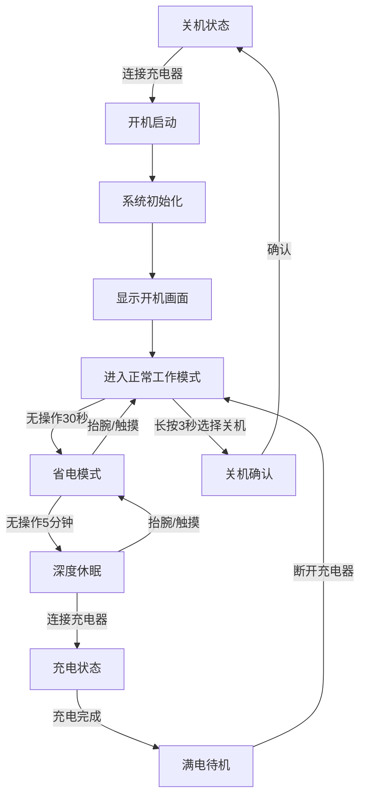
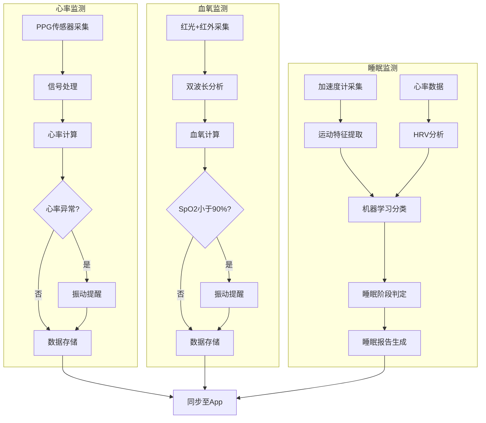
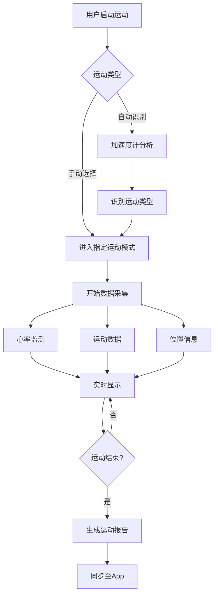
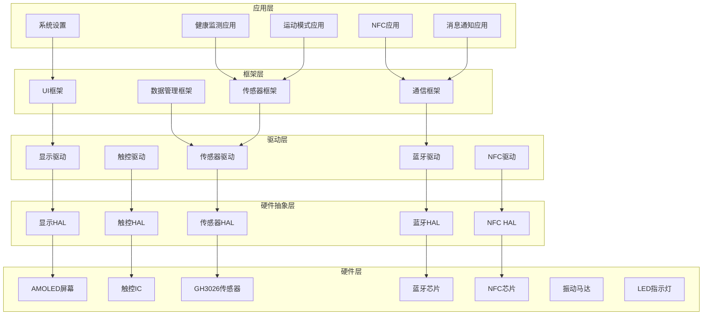
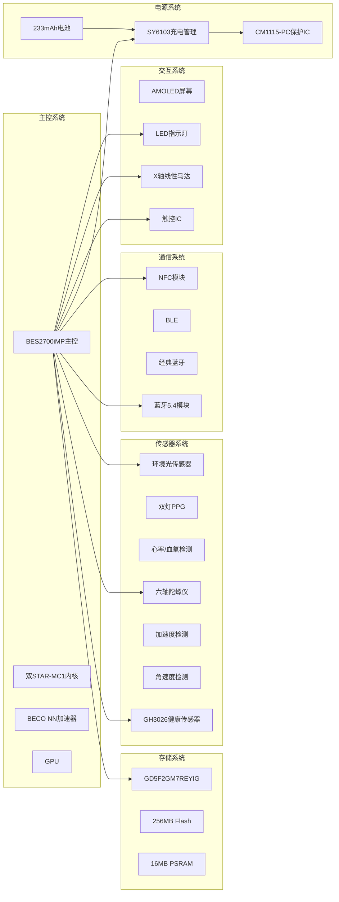

# 小米手环 9 陶瓷版 产品需求文档 (PRD)


---

## I. 产品定位与目标

### 1.1 市场画像

**目标用户群体**：**[事实]**
- 追求品质感的都市白领用户
- 对佩戴质感有更高要求的用户群体
- 礼品市场消费者

**定价策略**：**[事实]**
- 官方定价：349元
- 产品定位：小米手环9系列顶配版本
- 与竞品对比：标准版249元、NFC版299元

**核心受众特征**：**[关联]**
- 基于陶瓷材质"温润如玉"的触感特性，目标用户注重产品外观与佩戴体验
- 基于氟橡胶腕带配置，目标用户对舒适度有较高要求
- 基于NFC功能标配，目标用户有公交/门禁/车钥匙使用需求

### 1.2 核心卖点 (USP)

| 优先级 | 功能卖点 | 说明 |
|--------|----------|------|
| P0 | 陶瓷材质中框 | **[事实]** 首次在小米手环系列采用陶瓷材质，硬度高、耐磨性强，触感温润如玉 |
| P0 | 21天超长续航 | **[事实]** 典型使用模式下续航达21天，AOD模式下约9天 |
| P0 | 150+运动模式 | **[事实]** 支持跑步、游泳、骑行等150+种运动模式，自动识别6种运动 |
| P1 | 双灯心率检测 | **[事实]** 准确度比前代提升16%，支持房颤预警 |
| P1 | NFC全功能 | **[事实]** 支持公交卡、门禁卡、车钥匙（小米SU7/路特斯） |
| P1 | 5ATM防水 | **[事实]** 50米防水，支持泳池游泳 |
| P2 | 1200nits高亮屏 | **[事实]** 强光下清晰可见 |
| P2 | 60Hz高刷新率 | **[事实]** 流畅的操作体验 |

### 1.3 产品差异化定位

**与标准版差异**：**[事实]**
| 对比项 | 标准版 | 陶瓷版 |
|--------|--------|--------|
| 中框材质 | 铝合金 | 陶瓷 |
| 腕带材质 | TPU | 氟橡胶 |
| NFC功能 | 无 | 有 |
| 重量（不含腕带） | 15.8g | 22.4g |
| 售价 | 249元 | 349元 |

---

## II. 功能需求详细定义

### 2.1 硬件交互逻辑

#### 2.1.1 触控手势定义

**[事实]** 产品采用无实体按键的全触控交互设计。

| 手势 | 主界面操作 | 功能界面操作 | 响应时间 |
|------|-----------|-------------|----------|
| 单击 | 进入选中功能 | 确认/选择 | <50ms |
| 双击 | 唤醒屏幕（需开启） | - | <50ms |
| 长按 | 进入表盘切换/快捷功能 | 显示更多选项 | 500ms触发 |
| 上滑 | 查看通知消息 | 向上滚动 | <50ms |
| 下滑 | 打开快捷设置 | 返回/退出 | <50ms |
| 左滑 | 进入快捷应用 | 切换到上一项 | <50ms |
| 右滑 | 返回上一级 | 切换到下一项 | <50ms |

#### 2.1.2 屏幕唤醒逻辑

**[事实]** 唤醒方式定义：

| 唤醒方式 | 触发条件 | 响应时间要求 |
|----------|----------|--------------|
| 抬腕亮屏 | 加速度计检测抬腕动作 | **[推理]** <50ms |
| 触摸亮屏 | 轻触屏幕任意位置 | **[推理]** <20ms |
| 双击亮屏 | 双击屏幕（需App开启） | **[推理]** <50ms |

#### 2.1.3 LED指示灯语定义

**[事实]** LED指示灯位于充电触点上方，颜色为绿色/红色。

| 状态 | 灯语 | 含义 |
|------|------|------|
| 充电中 | 绿色呼吸灯闪烁 | 正在充电 |
| 充电完成 | 绿色常亮 | 电量已满 |
| 电量低 | 红色闪烁 | 电量低于20% |
| 充电异常 | 红色常亮 | 充电故障 |

#### 2.1.4 振动反馈定义

**[事实]** 配备X轴线性马达，支持20种震动模式。

| 场景 | 振动模式 | 持续时间 |
|------|----------|----------|
| 通知提醒 | 短振 | 100ms |
| 来电提醒 | 连续振动 | 持续至接听/挂断 |
| 闹钟提醒 | 渐强振动 | 持续至关闭 |
| 心率异常 | 紧急振动 | 200ms×3次 |
| 血氧异常 | 紧急振动 | 200ms×3次 |
| NFC支付 | 确认振动 | 50ms |

#### 2.1.5 充电接口逻辑

**[事实]** 采用磁吸式充电接口，充电触点位于手环底部凹槽内。

| 参数 | 规格 |
|------|------|
| 充电时间 | 0-100%约60分钟 |
| 充电限制电压 | 4.48V |
| 输入规格 | DC 5.0V/500mA |
| 插拔寿命 | >1000次 |

**[推理]** 充电状态机逻辑：
1. 连接充电器 → 检测充电器接入 → 显示充电界面 → 开始充电
2. 充电过程中 → LED绿色呼吸灯闪烁 → 屏幕显示电量百分比
3. 充电完成 → LED绿色常亮 → 屏幕显示100%
4. 充电异常 → LED红色常亮 → 屏幕显示错误提示

### 2.2 软件业务流

#### 2.2.1 开关机逻辑

**[事实]** 开机方式：
- 首次使用：连接充电器自动开机
- 关机后开机：连接充电座自动开机

**[推理]** 开关机状态机：

```
┌─────────────────────────────────────────────────────────────┐
│                        开机状态                               │
├─────────────────────────────────────────────────────────────┤
│  正常工作 ←→ 省电模式 ←→ 深度休眠 ←→ 关机                    │
│      ↑           ↑           ↑           ↑                  │
│      └───────────┴───────────┴───────────┘                  │
│                     自动/手动切换                             │
└─────────────────────────────────────────────────────────────┘
```

**状态切换条件**：**[推理]**
- 正常工作→省电模式：无操作超过30秒（可配置）
- 省电模式→深度休眠：无操作超过5分钟
- 深度休眠→省电模式：抬腕亮屏或轻触屏幕
- 省电模式→正常工作：抬腕亮屏或轻触屏幕
- 任意状态→关机：长按屏幕3秒（在设置中选择关机）

#### 2.2.2 蓝牙连接逻辑

**[事实]** 蓝牙版本：Bluetooth 5.4，支持BLE和经典蓝牙双模。

**配网流程**：**[事实]**
1. 打开小米运动健康App
2. 点击添加设备 → 选择"小米手环9"
3. App自动搜索附近设备
4. 在手环上确认配对请求
5. 配对成功，同步数据

**重连机制**：**[推理]**
- 首次配对后，手环在有效范围内自动连接
- 断连后30秒内自动重连
- 超出范围后返回自动重连
- 支持双设备切换

**BLE连接参数**：**[推理]**
| 参数 | 规格 |
|------|------|
| 连接间隔 | 7.5ms-4s（自适应） |
| 从机延迟 | 0-500ms |
| 监督超时 | 4s-20s |

#### 2.2.3 健康监测业务流

**心率监测**：**[事实]**
- 24小时心率监测（静息心率、运动心率）
- 心率异常提醒（房颤预警）
- 双灯PPG传感器，准确度提升16%

**[推理]** 心率监测逻辑：
1. 传感器采集：双灯PPG以设定频率采集心率数据
2. 数据处理：BECO NN加速器进行信号处理
3. 算法分析：心率变异性（HRV）分析
4. 异常检测：房颤等心律失常检测
5. 结果输出：屏幕显示 + App同步 + 异常振动提醒

**血氧监测**：**[事实]**
- 全天血氧饱和度监测
- 安静状态下每10分钟检测一次
- SpO2<90%时振动提醒
- 静息状态误差率±2%

**睡眠监测**：**[事实]**
- 识别入睡、浅睡、深睡、REM快速眼动期
- 细分7个睡眠阶段
- 误判率比前代降低40%
- 睡眠监测准确率提升7.9%

#### 2.2.4 运动模式业务流

**[事实]** 支持150+种运动模式，自动识别6种运动。

**运动数据采集**：**[事实]**
- 运动时心率、速度、步频记录
- 最大摄氧量（VO2 Max）检测
- 运动恢复时间评估
- 游泳实时心率监测

**跑步专业功能**：**[事实]**
- 10种腕上跑步课程
- 垂直步幅比、垂直振幅、触地时间等跑姿数据
- 跑步豆模式，监测步频、步幅

**游泳专业功能**：**[事实]**
- 识别四种泳姿（蛙泳、自由泳、蝶泳、仰泳）
- 室内游泳可监测划水次数、趟数
- 5ATM防水支持泳池游泳和开放水域游泳

#### 2.2.5 NFC功能业务流

**[事实]** NFC功能清单：

| 功能 | 说明 |
|------|------|
| 公交卡 | 覆盖全国320个城市 |
| 门禁卡 | 兼容90%以上社区门禁系统 |
| 车钥匙 | 小米SU7、路特斯等车型 |
| 支付响应 | 0.3秒 |

**[推理]** NFC刷卡逻辑：
1. 手环靠近读卡器 → NFC芯片唤醒
2. 读取卡片类型 → 匹配已绑定卡片
3. 执行刷卡操作 → 振动反馈
4. 显示刷卡结果 → 记录刷卡日志

#### 2.2.6 消息通知业务流

**[事实]** 支持来电提醒、短信通知、消息推送（微信、QQ等App）。

**[推理]** 消息通知逻辑：
1. 手机收到通知 → 通过蓝牙推送到手环
2. 手环接收通知 → 振动提醒 + 屏幕显示
3. 用户查看通知 → 上滑查看详情
4. 用户处理通知 → 可选择忽略或在手机上处理

### 2.3 核心算法逻辑

#### 2.3.1 心率算法

**[事实]** 采用双灯PPG传感器 + 双通道光路设计。

**[推理]** 算法参数：
| 指标 | 性能要求 |
|------|----------|
| 静息心率准确率 | ±3BPM |
| 运动心率准确率 | ±5BPM |
| 采样频率 | 10Hz（运动模式）/ 1Hz（日常监测） |

#### 2.3.2 血氧算法

**[事实]** 红光+红外双波长PPG。

**[推理]** 算法参数：
| 指标 | 性能要求 |
|------|----------|
| 血氧准确率 | ±2% |
| 检测频率 | 安静状态每10分钟一次 |
| 低血氧阈值 | <90%触发提醒 |

#### 2.3.3 睡眠算法

**[事实]** 基于三轴加速度计与PPG数据进行机器学习分类。

**[推理]** 算法参数：
| 指标 | 性能要求 |
|------|----------|
| 深睡识别准确率 | 78% |
| REM识别率 | 62% |
| 睡眠阶段细分 | 7个阶段 |

#### 2.3.4 运动算法

**[推理]** 基于加速度计的步态识别：
- 步数误差 <5%
- 自动识别运动类型准确率 >85%
- 运动特征：7种运动特征 + 4类HRV指标

---

## III. 非功能性需求

### 3.1 环境适应性

#### 3.1.1 工作环境要求

**[事实]** 工作温度范围：
| 参数 | 规格 |
|------|------|
| 工作温度 | 0℃～45℃ |
| 存储温度 | -20℃～60℃ |
| 工作湿度 | 10%-90%（无冷凝） |

#### 3.1.2 防水等级

**[事实]** 5ATM防水等级（50米水深）。

**认证信息**：**[事实]**
- 认证标准：GB/T 30106:2013
- 认证机构：TÜV SÜD
- 认证报告编号：68.189.24.0135.01

**适用场景**：**[事实]**
- 泳池游泳、浅滩游泳
- 日常洗漱、淋浴（避免热水）
- 户外运动时的汗水和雨水

**不适用场景**：**[事实]**
- 热水淋浴、桑拿
- 潜水活动
- 高速水流的直接冲击
- 海水中使用后需及时用清水冲洗

#### 3.1.3 材质特性

**[事实]** 陶瓷中框材质特性：
| 特性 | 参数 |
|------|------|
| 材质 | 氧化锆陶瓷（ZrO₂） |
| 硬度 | 莫氏硬度8-9级 |
| 特点 | 耐磨、温润质感 |
| 表面处理 | 抛光处理，镜面光泽 |

### 3.2 整机功耗预算

#### 3.2.1 电池规格

**[事实]** 电池参数：
| 参数 | 规格 |
|------|------|
| 电池型号 | BW24 |
| 电池类型 | 锂离子聚合物电池 |
| 额定容量 | 233mAh |
| 额定能量 | 0.91Wh |
| 标称电压 | 3.89V |
| 充电限制电压 | 4.48V |

#### 3.2.2 功耗模式定义

**[推理]** 基于续航时长和电池容量反推：

| 工作模式 | 说明 | 典型功耗 | 理论计算依据 |
|----------|------|----------|--------------|
| 正常工作 | 屏幕点亮、心率监测开启 | 15-25mA | 233mAh÷21天≈0.46mA平均 |
| 息屏常亮（AOD） | 屏幕显示时间但不刷新 | 5-8mA | 233mAh÷9天≈1.08mA平均 |
| 省电模式 | 仅显示时间，关闭传感器 | 1-2mA | 233mAh÷21天≈0.46mA平均 |
| 深度休眠 | 屏幕关闭，蓝牙断连 | 0.5-1mA | 待机功耗 |
| 关机 | 完全断电 | <10μA | 电池自放电 |

#### 3.2.3 续航场景分析

**[事实]** 官方标称续航：
| 使用场景 | 官方标称续航 | 典型用户实际续航 |
|----------|--------------|------------------|
| 日常使用（AOD开启） | 约7天 | 约5-7天 |
| 日常使用（AOD关闭） | 约9天 | 约7-10天 |
| 重度使用（持续心率监测） | 约5天 | 约4-5天 |
| 基础使用（仅看时间） | 约21天 | 约12-14天 |
| 纯蓝牙待机 | - | 约15天 |

**[推理]** 功耗影响因素：
- 屏幕常亮（AOD）模式：功耗增加约50%
- 心率监测频率：高频监测功耗增加约20%
- 蓝牙连接状态：持续连接功耗增加约10%
- NFC功能使用：刷卡瞬间功耗增加约100mA
- 运动模式使用：GPS/传感器功耗增加约30-50mA

#### 3.2.4 电源轨分配

**[推理]** 基于电路设计规范：

| 电源轨 | 电压 | 用途 | 芯片 |
|--------|------|------|------|
| Vbat | 3.0-4.48V | 电池输入 | - |
| VDD_IO | 1.8V/3.3V | GPIO供电 | LDO |
| VDD_CORE | 0.9-1.2V | 核心供电 | DCDC |
| VDD_RF | 3.3V | 射频供电 | LDO |
| VDD_ANALOG | 1.8V | 模拟电路 | LDO |

### 3.3 性能指标

#### 3.3.1 屏幕性能

**[事实]** 屏幕规格：
| 参数 | 规格 |
|------|------|
| 屏幕尺寸 | 1.62英寸AMOLED |
| 分辨率 | 192×490像素 |
| 刷新率 | 60Hz |
| 峰值亮度 | 1200nits |
| 像素密度 | 326 PPI |
| 盖板 | 2.5D强化玻璃 |

#### 3.3.2 处理器性能

**[事实]** BES2700iMP处理器规格：
| 参数 | 规格 |
|------|------|
| 内核架构 | 双STAR-MC1内核 |
| 制程工艺 | 22nm |
| PSRAM | 16MB |
| NAND Flash | 256MB |
| NN加速器 | 双BECO NN |

#### 3.3.3 通信性能

**[事实]** 蓝牙规格：
| 参数 | 规格 |
|------|------|
| 蓝牙版本 | Bluetooth 5.4 |
| 工作频率 | 2402-2480MHz |
| 最大输出功率 | ≤14dBm |
| 通信模式 | BLE + 经典蓝牙双模 |

### 3.4 可靠性要求

#### 3.4.1 机械可靠性

**[推理]** 基于行业标准：

| 测试项目 | 条件 | 标准 |
|----------|------|------|
| 跌落测试 | 1m跌落至硬地面 | 功能正常 |
| 振动测试 | 10-500Hz/1.5mm | 无松脱 |
| 触控寿命 | 10万次触控操作 | 功能正常 |

#### 3.4.2 环境可靠性

**[推理]** 基于行业标准：

| 测试项目 | 条件 | 标准 |
|----------|------|------|
| 高温工作 | 45℃/8h | 功能正常 |
| 低温工作 | 0℃/8h | 功能正常 |
| 恒温恒湿 | 40℃/90%RH/48h | 功能正常 |
| 温度循环 | -20℃~60℃/循环 | 无裂纹 |

#### 3.4.3 ESD防护

**[推理]** 基于可穿戴设备特性：

| 参数 | 规格 |
|------|------|
| 接触放电 | ±2kV |
| 空气放电 | ±4kV |
| 测试标准 | GB/T 17626.2 |

### 3.5 安全要求

#### 3.5.1 电池安全

**[事实]** 电池保护功能：
| 保护类型 | 阈值 |
|----------|------|
| 过充电保护 | 4.48V切断 |
| 过放电保护 | 2.4V切断 |
| 过电流保护 | 1.5A限制 |
| 短路保护 | <1μs响应 |

#### 3.5.2 电气安全

**[推理]** 基于3C认证要求：

| 参数 | 规格 |
|------|------|
| 绝缘电阻 | ≥10MΩ |
| 漏电流 | ≤0.25mA |
| 耐压测试 | 500VAC/1分钟 |

### 3.6 认证要求

**[事实]** 需通过的认证：
| 认证类型 | 标准/机构 |
|----------|-----------|
| 3C认证 | GB 17625.1-2012等 |
| SRRC认证 | 工信部 |
| 防水认证 | TÜV SÜD |
| RoHS认证 | SGS |
| FCC认证 | FCC Part 15B/C |

---

## IV. 图示规范

### 4.1 逻辑流程图

#### 4.1.1 开关机与状态切换流程



#### 4.1.2 健康监测业务流程



#### 4.1.3 运动模式业务流程



### 4.2 功能模块架构



### 4.3 硬件架构图



### 4.4 物理外观示意图

#### 4.4.1 正面视图

```
    ┌─────────────────────────────────────┐
    │                                     │
    │      ┌───────────────────────┐      │
    │      │                       │      │
    │      │    ┌─────────────┐    │      │
    │      │    │   1.62"     │    │      │
    │      │    │  AMOLED     │    │      │
    │      │    │  192×490    │    │      │
    │      │    │   屏幕      │    │      │
    │      │    └─────────────┘    │      │
    │      │                       │      │
    │      │    陶瓷中框（白色）    │      │
    │      │                       │      │
    │      └───────────────────────┘      │
    │                                     │
    │         跑道形表盘设计               │
    │                                     │
    └─────────────────────────────────────┘
    
    尺寸: 47.50×22.73×10.95mm
    重量: 约22.4g（不含腕带）
```

#### 4.4.2 背面视图

```
    ┌─────────────────────────────────────┐
    │                                     │
    │      ┌───────────────────────┐      │
    │      │                       │      │
    │      │   ┌───┐     ┌───┐    │      │
    │      │   │LED│     │PPG│    │      │
    │      │   │   │     │双灯│    │      │
    │      │   └───┘     └───┘    │      │
    │      │                       │      │
    │      │   ┌───────────────┐   │      │
    │      │   │  充电触点     │   │      │
    │      │   │  ○ ○ ○       │   │      │
    │      │   └───────────────┘   │      │
    │      │                       │      │
    │      │   纤维高强聚合物背壳   │      │
    │      │                       │      │
    │      └───────────────────────┘      │
    │                                     │
    └─────────────────────────────────────┘
    
    充电触点: 磁吸式设计
    PPG传感器: 双灯心率/血氧检测
```

#### 4.4.3 侧视图

```
         ┌─────────────────────────────┐
         │                             │
         │    2.5D强化玻璃盖板         │
         │                             │
    ─────┼─────────────────────────────┼─────
         │                             │
         │      AMOLED显示屏           │
         │                             │
    ─────┼─────────────────────────────┼─────
         │                             │
         │      PCB主板层              │
         │      (BES2700iMP等芯片)     │
         │                             │
    ─────┼─────────────────────────────┼─────
         │                             │
         │      电池层                 │
         │      (233mAh锂电池)         │
         │                             │
    ─────┼─────────────────────────────┼─────
         │                             │
         │      传感器模组层           │
         │      (GH3026等传感器)       │
         │                             │
    ─────┴─────────────────────────────┴─────
    
    总厚度: 10.95mm
```

### 4.5 交互手势示意图

```
    ┌─────────────────────────────────────────────────────┐
    │                   主界面交互                         │
    ├─────────────────────────────────────────────────────┤
    │                                                     │
    │    单击 ──────────→ 进入选中功能                    │
    │                                                     │
    │    双击 ──────────→ 唤醒屏幕（需开启）              │
    │                                                     │
    │    长按 ──────────→ 表盘切换/快捷功能               │
    │                                                     │
    │    上滑 ↑ ─────────→ 查看通知消息                  │
    │                                                     │
    │    下滑 ↓ ─────────→ 打开快捷设置                  │
    │                                                     │
    │    左滑 ← ─────────→ 进入快捷应用                  │
    │                                                     │
    │    右滑 → ─────────→ 返回上一级                    │
    │                                                     │
    └─────────────────────────────────────────────────────┘
```

---

## V. 附录

### 5.1 术语表

| 术语 | 全称 | 说明 |
|------|------|------|
| PPG | Photoplethysmography | 光电容积脉搏波描记法 |
| SpO2 | Oxygen Saturation | 血氧饱和度 |
| HRV | Heart Rate Variability | 心率变异性 |
| AOD | Always On Display | 屏幕常亮显示 |
| BLE | Bluetooth Low Energy | 低功耗蓝牙 |
| NFC | Near Field Communication | 近场通信 |
| AMOLED | Active Matrix OLED | 有源矩阵有机发光二极管 |
| REM | Rapid Eye Movement | 快速眼动期 |

### 5.2 参考文档

1. 小米手环9陶瓷版深度产品调研报告
2. GB/T 30106:2013 防水手表标准
3. GB 17625.1-2012 电磁兼容限值要求
4. BES2700iMP芯片技术规格书


---

> **声明**：本文档基于小米手环9陶瓷版深度产品调研报告生成，所有标注[事实]的内容直接引用自调研报告，标注[关联]的内容基于报告信息推导，标注[推理]的内容基于行业经验和主流设计逻辑补全。
