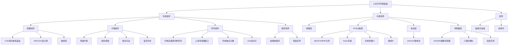
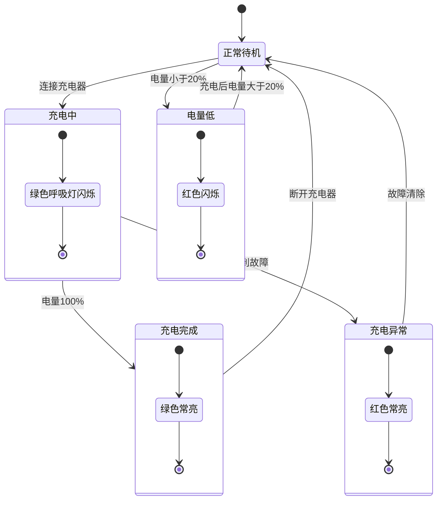

# 小米手环 9 陶瓷版 工业设计规格书 (ID Spec)


---

## I. 工业设计概述

### 1.1 视觉语言

**设计风格**：**[事实]**
- **极简主义**：延续小米手环家族式跑道屏设计语言，整体呈现椭圆形表盘造型
- **温润高雅**：白色陶瓷机身搭配氟橡胶腕带，呈现"羊脂玉般"的温润洁白质感
- **一体化设计**：陶瓷中框与纤维高强聚合物背壳的无缝结合，表带扣环同样采用陶瓷材质，实现设计的统一性

**设计关键词**：**[关联]**
- 纯净、高雅、温润如玉
- 跑道形、全触控、无实体按键
- 轻量化、人体工学

**设计理念**：**[关联]**
- 基于陶瓷材质特性，追求"温润如玉"的触感体验
- 基于无实体按键设计，实现简洁的一体化外观
- 基于5ATM防水需求，采用密封式结构设计

### 1.2 CMF 定义

#### 1.2.1 C (Color) - 颜色定义

**[事实]** 陶瓷版独有白色配色：

| 部件 | 颜色名称 | 颜色描述 | 色号参考 |
|------|----------|----------|----------|
| 陶瓷中框 | 陶瓷白 | 温润洁白，羊脂玉质感 | **[推理]** RAL 9010 / Pantone 11-0602 |
| 背壳 | 磨砂白 | 哑光白色，磨砂质感 | **[推理]** RAL 9003 / Pantone 11-0601 |
| 腕带 | 氟橡胶白 | 纯白色，哑光表面 | **[推理]** Pantone 11-0601 |
| 表带扣环 | 陶瓷白 | 与中框同色同材质 | 同陶瓷中框 |
| 屏幕盖板 | 透明 | 2.5D强化玻璃，高透光 | - |

**[关联]** 颜色设计逻辑：
- 通体亮白的外观设计，给人以纯净、高雅的视觉感受
- 陶瓷中框与白色真皮/氟橡胶腕带搭配，整体呈现高雅的视觉效果

#### 1.2.2 M (Material) - 材质定义

**[事实]** 材质构成：

| 部件 | 主材质 | 规格/型号 | 特性 |
|------|--------|-----------|------|
| 中框 | 氧化锆陶瓷 | ZrO₂ | 莫氏硬度8-9级，耐磨，温润质感 |
| 背壳 | 纤维高强聚合物 | 玻璃纤维增强PC | 高强度，轻量化 |
| 屏幕盖板 | 2.5D强化玻璃 | - | 高透光，防指纹涂层 |
| 腕带 | 氟橡胶 | FKM | 耐高温、耐油、柔软亲肤 |
| 表带扣环 | 氧化锆陶瓷 | ZrO₂ | 与中框同材质 |

**[推理]** 材质选型依据：

| 材质 | 选型理由 |
|------|----------|
| 氧化锆陶瓷 | 硬度高、耐磨性强，日常使用不易产生划痕；质感温润如玉，触感细腻光滑 |
| 纤维高强聚合物 | 在保证强度的同时控制重量和成本；磨砂质感避免指纹残留 |
| 氟橡胶（FKM） | 相比TPU材质更加柔软亲肤；耐高温、耐油，适合运动场景 |
| 2.5D强化玻璃 | 边缘弧形设计提升触控手感；防指纹涂层保持外观整洁 |

#### 1.2.3 F (Finishing) - 表面处理工艺

**[事实]** 表面处理：

| 部件 | 处理工艺 | 效果描述 |
|------|----------|----------|
| 陶瓷中框 | 精密抛光 | 镜面光泽，温润触感 |
| 背壳 | 磨砂处理 | 哑光质感，防滑 |
| 屏幕盖板 | AF防指纹涂层 | 减少指纹残留 |
| 腕带 | 哑光表面处理 | 柔和触感，防汗 |

**[推理]** 工艺细节：

| 工艺 | 技术参数 | 目的 |
|------|----------|------|
| 陶瓷抛光 | Ra<0.1μm | 实现镜面光泽和温润触感 |
| 纳米涂层 | 厚度1-2μm | 提升表面疏水性，辅助防水 |
| AF涂层 | 厚度50-100nm | 防指纹，易清洁 |
| 磨砂处理 | Ra 1.0-2.0μm | 哑光质感，防滑 |

### 1.3 材质明细表

**[事实]** 完整材质构成：

```
┌─────────────────────────────────────────────────────────────┐
│                      材质构成明细                            │
├─────────────────────────────────────────────────────────────┤
│                                                             │
│  ┌─────────────┐                                            │
│  │ 屏幕盖板    │  2.5D强化玻璃 + AF防指纹涂层              │
│  └─────────────┘                                            │
│         ↓                                                   │
│  ┌─────────────┐                                            │
│  │ 中框        │  氧化锆陶瓷（ZrO₂）+ 精密抛光             │
│  └─────────────┘                                            │
│         ↓                                                   │
│  ┌─────────────┐                                            │
│  │ 背壳        │  纤维高强聚合物 + 磨砂处理                │
│  └─────────────┘                                            │
│         ↓                                                   │
│  ┌─────────────┐                                            │
│  │ 腕带        │  氟橡胶（FKM）+ 哑光表面处理              │
│  └─────────────┘                                            │
│         ↓                                                   │
│  ┌─────────────┐                                            │
│  │ 表带扣环    │  氧化锆陶瓷（ZrO₂）+ 精密抛光             │
│  └─────────────┘                                            │
│                                                             │
└─────────────────────────────────────────────────────────────┘
```

---

## II. 物理规格与空间堆叠

### 2.1 整机尺寸规格

**[事实]** 尺寸参数：

| 参数 | 规格 | 备注 |
|------|------|------|
| 整机尺寸 | 47.50×22.73×10.95mm | 不含心率凸台 |
| 重量（不含腕带） | 约22.4g | 陶瓷版 |
| 重量（含腕带） | 约44g | 含氟橡胶腕带 |
| 腕带可调长度 | 135-210mm | 适合不同手腕尺寸 |

**[事实]** 与标准版对比：

| 参数 | 标准版/NFC版 | 陶瓷版 | 差异 |
|------|--------------|--------|------|
| 尺寸 | 46.53×21.63×10.95mm | 47.50×22.73×10.95mm | 陶瓷版略大 |
| 重量（不含腕带） | 15.8g | 22.4g | 陶瓷版重6.6g |
| 重量（含腕带） | 27g | 44g | 陶瓷版重17g |

**[关联]** 尺寸差异分析：
- 陶瓷版尺寸略大，主要是由于陶瓷材质的加工工艺和结构设计需求
- 重量差异主要源于陶瓷材质本身的密度较高，以及可能采用了更大容量的电池

### 2.2 外观组件布局

**[事实]** 外观组件分布：

| 组件 | 位置 | 尺寸/规格 |
|------|------|-----------|
| 屏幕 | 正面中央 | 1.62英寸跑道形AMOLED |
| 心率传感器 | 背面中央凸台 | 双灯PPG模组 |
| 充电触点 | 背面凹槽内 | 磁吸式3触点 |
| LED指示灯 | 充电触点上方 | 绿色/红色LED |
| 环境光传感器 | 屏幕上方 | 自动亮度调节 |
| 快拆按键 | 两侧 | 表带快拆机构 |

### 2.3 空间堆叠架构

**[事实]** 内部结构层级：

```
┌─────────────────────────────────────────────────────────────┐
│                     空间堆叠架构（侧视剖面）                  │
├─────────────────────────────────────────────────────────────┤
│                                                             │
│    ╔═════════════════════════════════════════════════════╗  │
│    ║              第一层：屏幕组件                        ║  │
│    ║  ┌─────────────────────────────────────────────┐    ║  │
│    ║  │  2.5D强化玻璃盖板                            │    ║  │
│    ║  ├─────────────────────────────────────────────┤    ║  │
│    ║  │  AMOLED显示屏 (1.62英寸)                    │    ║  │
│    ║  ├─────────────────────────────────────────────┤    ║  │
│    ║  │  触摸屏 (电容式)                            │    ║  │
│    ║  └─────────────────────────────────────────────┘    ║  │
│    ╚═════════════════════════════════════════════════════╝  │
│                            ↓                                │
│    ╔═════════════════════════════════════════════════════╗  │
│    ║              第二层：PCB主板层                       ║  │
│    ║  ┌─────────────────────────────────────────────┐    ║  │
│    ║  │  BES2700iMP主控芯片                         │    ║  │
│    ║  │  兆易创新Flash存储                          │    ║  │
│    ║  │  充电管理芯片SY6103                         │    ║  │
│    ║  │  电池保护芯片CM1115-PC                      │    ║  │
│    ║  │  触控IC                                    │    ║  │
│    ║  └─────────────────────────────────────────────┘    ║  │
│    ╚═════════════════════════════════════════════════════╝  │
│                            ↓                                │
│    ╔═════════════════════════════════════════════════════╗  │
│    ║              第三层：电池层                          ║  │
│    ║  ┌─────────────────────────────────────────────┐    ║  │
│    ║  │  锂离子聚合物电池 BW24 (233mAh)             │    ║  │
│    ║  │  尺寸: 约35×15×3mm (推测)                   │    ║  │
│    ║  └─────────────────────────────────────────────┘    ║  │
│    ╚═════════════════════════════════════════════════════╝  │
│                            ↓                                │
│    ╔═════════════════════════════════════════════════════╗  │
│    ║              第四层：传感器模组层                    ║  │
│    ║  ┌─────────────────────────────────────────────┐    ║  │
│    ║  │  GH3026健康监测传感器 (叠层小板设计)        │    ║  │
│    ║  │  六轴陀螺仪                                 │    ║  │
│    ║  │  硅麦克风                                   │    ║  │
│    ║  └─────────────────────────────────────────────┘    ║  │
│    ╚═════════════════════════════════════════════════════╝  │
│                            ↓                                │
│    ╔═════════════════════════════════════════════════════╗  │
│    ║              第五层：背壳组件                        ║  │
│    ║  ┌─────────────────────────────────────────────┐    ║  │
│    ║  │  纤维高强聚合物背壳                         │    ║  │
│    ║  │  心率检测窗口                               │    ║  │
│    ║  │  充电触点凹槽                               │    ║  │
│    ║  └─────────────────────────────────────────────┘    ║  │
│    ╚═════════════════════════════════════════════════════╝  │
│                                                             │
└─────────────────────────────────────────────────────────────┘
```

### 2.4 堆叠参数估算

**[推理]** 基于整机尺寸和组件规格推算：

| 层级 | 估算厚度 | 主要组件 |
|------|----------|----------|
| 屏幕组件 | 1.2-1.5mm | 玻璃盖板+AMOLED+触控 |
| PCB主板 | 0.8-1.0mm | 6层HDI板+元器件高度 |
| 电池层 | 2.5-3.0mm | 233mAh锂电池 |
| 传感器层 | 1.5-2.0mm | 传感器模组+心率凸台 |
| 背壳 | 0.8-1.0mm | 纤维高强聚合物 |
| **总计** | **约7-9mm** | 不含中框壁厚 |

**[关联]** 堆叠设计特点：
- 传感器模组采用叠层小板设计，有效节省空间
- 振动马达嵌入在中框内，不占用主板空间
- 蓝牙天线贴附在中框内侧，通过金属弹片连接

### 2.5 关键组件尺寸

**[事实]** 已知组件尺寸：

| 组件 | 尺寸规格 | 备注 |
|------|----------|------|
| 屏幕 | 1.62英寸对角线 | 跑道形设计 |
| 屏幕分辨率 | 192×490像素 | 326 PPI |
| 电池容量 | 233mAh | 锂离子聚合物 |

**[推理]** 组件尺寸估算：

| 组件 | 估算尺寸 | 估算依据 |
|------|----------|----------|
| PCB主板 | 约45×20mm | 基于整机内腔尺寸 |
| 电池 | 约35×15×3mm | 基于233mAh容量和锂聚合物能量密度 |
| 振动马达 | 约8×8×3mm | 基于X轴线性马达常见尺寸 |
| 心率传感器模组 | 约10×10×3mm | 基于双灯PPG模组常见尺寸 |

### 2.6 接口与开孔布局

**[事实]** 接口配置：

| 接口/开孔 | 位置 | 规格 | 功能 |
|-----------|------|------|------|
| 充电触点 | 背面凹槽 | 2触点，磁吸式 | 充电+数据通信 |
| 心率窗口 | 背面中央 | 透明窗口 | PPG传感器光路 |
| 快拆按键 | 两侧 | 弹性按键 | 表带拆卸 |

**[推理]** 开孔密封设计：

| 开孔 | 密封方案 | 防水等级要求 |
|------|----------|--------------|
| 充电触点 | 凹槽设计+硅胶密封圈 | 5ATM |
| 心率窗口 | 光学胶全贴合 | 5ATM |
| 麦克风孔 | 防水防尘网+透气膜 | 5ATM |

---

## III. 用户物理交互

### 3.1 触控交互设计

**[事实]** 触控规格：

| 参数 | 规格 |
|------|------|
| 触控类型 | 电容式触摸屏 |
| 触控面积 | 1.62英寸全屏 |
| 支持手势 | 单击、双击、长按、滑动 |
| 湿屏防误触 | 支持 |

**[推理]** 触控性能参数：

| 参数 | 规格 | 依据 |
|------|------|------|
| 触控响应时间 | <50ms | 主流触控IC性能 |
| 触控精度 | ±2mm | 电容式触控标准 |
| 触控点数 | 单点触控 | 手环产品特性 |
| 触控寿命 | >10万次 | 行业标准 |

### 3.2 屏幕唤醒交互

**[事实]** 唤醒方式：

| 唤醒方式 | 触发机制 | 物理实现 |
|----------|----------|----------|
| 抬腕亮屏 | 加速度计检测 | 六轴陀螺仪 |
| 触摸亮屏 | 电容触控检测 | 触控IC |
| 双击亮屏 | 双击手势识别 | 触控IC+算法 |

**[推理]** 抬腕亮屏参数：

| 参数 | 规格 |
|------|------|
| 抬腕角度阈值 | 30-45度 |
| 响应时间 | <50ms |
| 误触发率 | <5次/天 |

### 3.3 振动反馈设计

**[事实]** 振动马达规格：

| 参数 | 规格 |
|------|------|
| 马达类型 | X轴线性马达 |
| 震动模式 | 20种 |
| 位置 | 嵌入中框内 |

**[推理]** 振动性能参数：

| 场景 | 振动强度 | 振动时长 | 频率 |
|------|----------|----------|------|
| 通知提醒 | 中等 | 100ms | 200Hz |
| 来电提醒 | 强 | 持续 | 200Hz |
| 闹钟提醒 | 渐强 | 持续 | 200Hz |
| 心率异常 | 强 | 200ms×3次 | 250Hz |
| NFC确认 | 弱 | 50ms | 150Hz |
| 触控反馈 | 弱 | 20ms | 150Hz |

### 3.4 LED灯语设计

**[事实]** LED规格：

| 参数 | 规格 |
|------|------|
| 位置 | 充电触点上方 |
| 颜色 | 绿色/红色 |
| 类型 | 单色LED |

**[事实]** 灯语定义：

| 状态 | 灯语 | 视觉效果 |
|------|------|----------|
| 充电中 | 绿色呼吸灯闪烁 | 1秒周期，渐亮渐暗 |
| 充电完成 | 绿色常亮 | 持续亮起 |
| 电量低 | 红色闪烁 | 0.5秒周期，快速闪烁 |
| 充电异常 | 红色常亮 | 持续亮起 |

**[推理]** LED光学参数：

| 参数 | 规格 |
|------|------|
| 绿色LED波长 | 520-530nm |
| 红色LED波长 | 620-630nm |
| 发光角度 | 120度 |
| 可视距离 | >30cm |
| 导光方式 | 侧面导光+雾面扩散 |

### 3.5 充电接口交互

**[事实]** 充电接口规格：

| 参数 | 规格 |
|------|------|
| 接口类型 | 磁吸式充电触点 |
| 触点数量 | 3个 |
| 防呆设计 | 磁吸定位 |
| 插拔寿命 | >1000次 |

**[推理]** 磁吸力参数：

| 参数 | 规格 |
|------|------|
| 吸合力度 | 0.3-0.5N |
| 对位容差 | ±2mm |
| 吸合距离 | <5mm |

### 3.6 表带快拆交互

**[事实]** 快拆机制：

| 参数 | 规格 |
|------|------|
| 快拆方式 | 双侧按键 |
| 操作时间 | <5秒 |
| 兼容性 | 标准快拆表带 |

**[推理]** 快拆力度参数：

| 参数 | 规格 |
|------|------|
| 按键触发力度 | 1.5-3.0N |
| 按键行程 | 0.5-1.0mm |
| 卡扣保持力 | >20N |

### 3.7 佩戴舒适度设计

**[事实]** 佩戴相关参数：

| 参数 | 规格 |
|------|------|
| 腕带材质 | 氟橡胶（FKM） |
| 腕带宽度 | 约18mm |
| 可调长度 | 135-210mm |
| 整机重量 | 约44g（含腕带） |
| 皮肤接触材质 | 氟橡胶+纤维高强聚合物 |

**[事实]** 安全认证：

| 认证 | 标准 |
|------|------|
| 皮肤过敏测试 | ISO10993-10 |

**[关联]** 舒适度设计要点：
- 反扣式设计，材质柔软亲肤
- 重量虽比标准版略重，但仍保持在合理范围内
- 睡眠佩戴无负担
- 氟橡胶材质透气性好，适合运动场景

---

## IV. 防水与密封设计

### 4.1 防水等级要求

**[事实]** 防水规格：

| 参数 | 规格 |
|------|------|
| 防水等级 | 5ATM |
| 等效水深 | 50米 |
| 认证标准 | GB/T 30106:2013 |
| 认证机构 | TÜV SÜD |
| 认证报告编号 | 68.189.24.0135.01 |

### 4.2 密封系统设计

**[推理]** 密封方案：

| 密封位置 | 密封方式 | 材料 |
|----------|----------|------|
| 屏幕与中框 | 防水泡棉胶+点胶 | 3M防水胶带+UV胶 |
| 后盖与中框 | 防水胶圈 | 硅胶O型圈 |
| 充电触点 | 凹槽+硅胶垫圈 | 硅胶密封圈 |
| 心率窗口 | 光学胶全贴合 | LOCA光学胶 |
| 麦克风孔 | 防水防尘网 | ePTFE透气膜 |

### 4.3 防水测试要求

**[推理]** 测试项目：

| 测试项目 | 条件 | 标准 |
|----------|------|------|
| 静态水压测试 | 5ATM，30分钟 | 无渗漏 |
| 动态水压测试 | 模拟游泳动作 | 无渗漏 |
| 温度冲击测试 | 40℃冷水→25℃温水 | 无凝结 |
| 盐雾测试 | 5% NaCl，24小时 | 无腐蚀 |

---

## V. 图示规范

### 5.1 外观布局逻辑图



### 5.2 LED灯语状态图



### 5.3 物理外观示意图

#### 5.3.1 正面视图

```
                    正面视图
    ╔═══════════════════════════════════════╗
    ║                                       ║
    ║    ┌───────────────────────────┐      ║
    ║    │                           │      ║
    ║    │    ┌─────────────────┐    │      ║
    ║    │    │                 │    │      ║
    ║    │    │   1.62英寸      │    │      ║
    ║    │    │   AMOLED屏幕    │    │      ║
    ║    │    │   192×490像素   │    │      ║
    ║    │    │   60Hz刷新率    │    │      ║
    ║    │    │   1200nits亮度  │    │      ║
    ║    │    │                 │    │      ║
    ║    │    └─────────────────┘    │      ║
    ║    │                           │      ║
    ║    │     陶瓷中框（白色）       │      ║
    ║    │     氧化锆陶瓷 ZrO₂       │      ║
    ║    │     莫氏硬度 8-9级        │      ║
    ║    │     镜面抛光处理          │      ║
    ║    │                           │      ║
    ║    └───────────────────────────┘      ║
    ║                                       ║
    ║         跑道形表盘设计                 ║
    ║         尺寸: 47.50×22.73mm           ║
    ║                                       ║
    ╚═══════════════════════════════════════╝
```

#### 5.3.2 背面视图

```
                    背面视图
    ╔═══════════════════════════════════════╗
    ║                                       ║
    ║    ┌───────────────────────────┐      ║
    ║    │                           │      ║
    ║    │   ┌─────┐     ┌─────┐    │      ║
    ║    │   │ LED │     │ PPG │    │      ║
    ║    │   │指示灯│     │双灯 │    │      ║
    ║    │   │绿/红│     │传感器│    │      ║
    ║    │   └─────┘     └─────┘    │      ║
    ║    │                           │      ║
    ║    │   ┌───────────────────┐   │      ║
    ║    │   │    充电触点       │   │      ║
    ║    │   │   ●   ●   ●      │   │      ║
    ║    │   │   磁吸式3触点     │   │      ║
    ║    │   └───────────────────┘   │      ║
    ║    │                           │      ║
    ║    │   纤维高强聚合物背壳       │      ║
    ║    │   磨砂处理                 │      ║
    ║    │   厚度: 约0.8-1.0mm       │      ║
    ║    │                           │      ║
    ║    └───────────────────────────┘      ║
    ║                                       ║
    ╚═══════════════════════════════════════╝
```

#### 5.3.3 侧视图

```
                    侧视图（堆叠剖面）
    
         ╔═══════════════════════════════════╗
         ║                                   ║
         ║    2.5D强化玻璃盖板               ║  ← 厚度约0.5mm
         ║    AF防指纹涂层                   ║
         ║                                   ║
    ─────╬═══════════════════════════════════╬─────
         ║                                   ║
         ║    AMOLED显示屏                   ║  ← 厚度约0.3mm
         ║    1.62英寸 / 192×490像素         ║
         ║                                   ║
    ─────╬═══════════════════════════════════╬─────
         ║                                   ║
         ║    触控层 (电容式)                ║  ← 厚度约0.2mm
         ║                                   ║
    ─────╬═══════════════════════════════════╬─────
         ║                                   ║
         ║    PCB主板层                      ║  ← 厚度约0.8mm
         ║    BES2700iMP / Flash / 充电IC    ║     + 元器件高度
         ║    6层HDI板                       ║
         ║                                   ║
    ─────╬═══════════════════════════════════╬─────
         ║                                   ║
         ║    电池层                         ║  ← 厚度约2.5-3mm
         ║    233mAh 锂离子聚合物电池        ║
         ║                                   ║
    ─────╬═══════════════════════════════════╬─────
         ║                                   ║
         ║    传感器模组层                   ║  ← 厚度约1.5-2mm
         ║    GH3026 / 六轴陀螺仪 / 麦克风   ║     含心率凸台
         ║                                   ║
    ─────╬═══════════════════════════════════╬─────
         ║                                   ║
         ║    纤维高强聚合物背壳             ║  ← 厚度约0.8mm
         ║    磨砂处理                       ║
         ║                                   ║
         ╚═══════════════════════════════════╝
    
         总厚度: 10.95mm (不含心率凸台)
         心率凸台高度: 约1-1.5mm (推测)
```

#### 5.3.4 表带快拆机构

```
                表带快拆机构示意
    
         手环主体侧视图
    ┌─────────────────────────────────────┐
    │                                     │
    │    ┌───────────────────────────┐    │
    │    │                           │    │
    │    │      陶瓷中框             │    │
    │    │                           │    │
    │    └───────────────────────────┘    │
    │            ↓           ↓            │
    │        ┌─────┐    ┌─────┐          │
    │        │快拆 │    │快拆 │          │
    │        │按键 │    │按键 │          │
    │        └─────┘    └─────┘          │
    │            ↓           ↓            │
    │    ┌───────────────────────────┐    │
    │    │      氟橡胶腕带           │    │
    │    │      (可拆卸)             │    │
    │    └───────────────────────────┘    │
    │                                     │
    └─────────────────────────────────────┘
    
    快拆操作流程:
    1. 按下两侧快拆按键
    2. 将腕带向外拉出分离
    3. 安装时对准扣合
    4. 听到"咔哒"声即完成
    
    操作时间: <5秒
    按键力度: 1.5-3.0N
    按键行程: 0.5-1.0mm
```

### 5.4 密封结构示意图

```
                防水密封结构示意
    
    ┌─────────────────────────────────────────────────────┐
    │                    密封系统                         │
    ├─────────────────────────────────────────────────────┤
    │                                                     │
    │  1. 屏幕密封                                        │
    │     ┌─────────────────────────────────────┐        │
    │     │  2.5D玻璃盖板                       │        │
    │     ├─────────────────────────────────────┤        │
    │     │  防水泡棉胶带 + UV胶密封            │        │
    │     ├─────────────────────────────────────┤        │
    │     │  陶瓷中框                           │        │
    │     └─────────────────────────────────────┘        │
    │                                                     │
    │  2. 后盖密封                                        │
    │     ┌─────────────────────────────────────┐        │
    │     │  陶瓷中框                           │        │
    │     ├─────────────────────────────────────┤        │
    │     │  硅胶O型密封圈                      │        │
    │     ├─────────────────────────────────────┤        │
    │     │  纤维高强聚合物背壳                 │        │
    │     └─────────────────────────────────────┘        │
    │                                                     │
    │  3. 充电触点密封                                    │
    │     ┌─────────────────────────────────────┐        │
    │     │  凹槽设计                           │        │
    │     │  ┌─────────────────────────────┐    │        │
    │     │  │  充电触点                   │    │        │
    │     │  │  ●   ●   ●                 │    │        │
    │     │  └─────────────────────────────┘    │        │
    │     │  硅胶密封圈                         │        │
    │     └─────────────────────────────────────┘        │
    │                                                     │
    │  4. 传感器窗口密封                                  │
    │     ┌─────────────────────────────────────┐        │
    │     │  背壳                               │        │
    │     ├─────────────────────────────────────┤        │
    │     │  LOCA光学胶全贴合                   │        │
    │     ├─────────────────────────────────────┤        │
    │     │  PPG传感器窗口                      │        │
    │     └─────────────────────────────────────┘        │
    │                                                     │
    │  防水等级: 5ATM (50米水深)                         │
    │  认证标准: GB/T 30106:2013                         │
    │  认证机构: TÜV SÜD                                 │
    │                                                     │
    └─────────────────────────────────────────────────────┘
```

---

## VI. 附录

### 6.1 术语表

| 术语 | 全称 | 说明 |
|------|------|------|
| CMF | Color Material Finishing | 颜色、材质、表面处理 |
| ZrO₂ | Zirconium Dioxide | 氧化锆陶瓷 |
| FKM | Fluoroelastomer | 氟橡胶 |
| PC | Polycarbonate | 聚碳酸酯 |
| AF | Anti-Fingerprint | 防指纹涂层 |
| LOCA | Liquid Optically Clear Adhesive | 液态光学透明胶 |
| PPG | Photoplethysmography | 光电容积脉搏波描记法 |
| 5ATM | 5 Atmospheres | 5个大气压防水等级 |

### 6.2 材料物性参数

**[推理]** 陶瓷材料物性：

| 参数 | 规格 |
|------|------|
| 材质 | 氧化锆陶瓷（ZrO₂） |
| 密度 | 5.6-6.0 g/cm³ |
| 莫氏硬度 | 8-9级 |
| 抗弯强度 | 900-1200 MPa |
| 断裂韧性 | 8-10 MPa·m¹/² |
| 热膨胀系数 | 10-11×10⁻⁶/℃ |

**[推理]** 氟橡胶物性：

| 参数 | 规格 |
|------|------|
| 材质 | FKM氟橡胶 |
| 密度 | 1.8-1.9 g/cm³ |
| 硬度 | 50-70 Shore A |
| 拉伸强度 | 10-20 MPa |
| 工作温度 | -20℃～200℃ |
| 耐油性 | 优秀 |

### 6.3 参考文档

1. 小米手环9陶瓷版深度产品调研报告
2. 产品需求文档-PRD
3. GB/T 30106:2013 防水手表标准
4. ISO10993-10 皮肤过敏测试标准

---

> **声明**：本文档基于小米手环9陶瓷版深度产品调研报告和产品需求文档生成，所有标注[事实]的内容直接引用自调研报告，标注[关联]的内容基于报告信息推导，标注[推理]的内容基于行业经验和主流设计逻辑补全。
