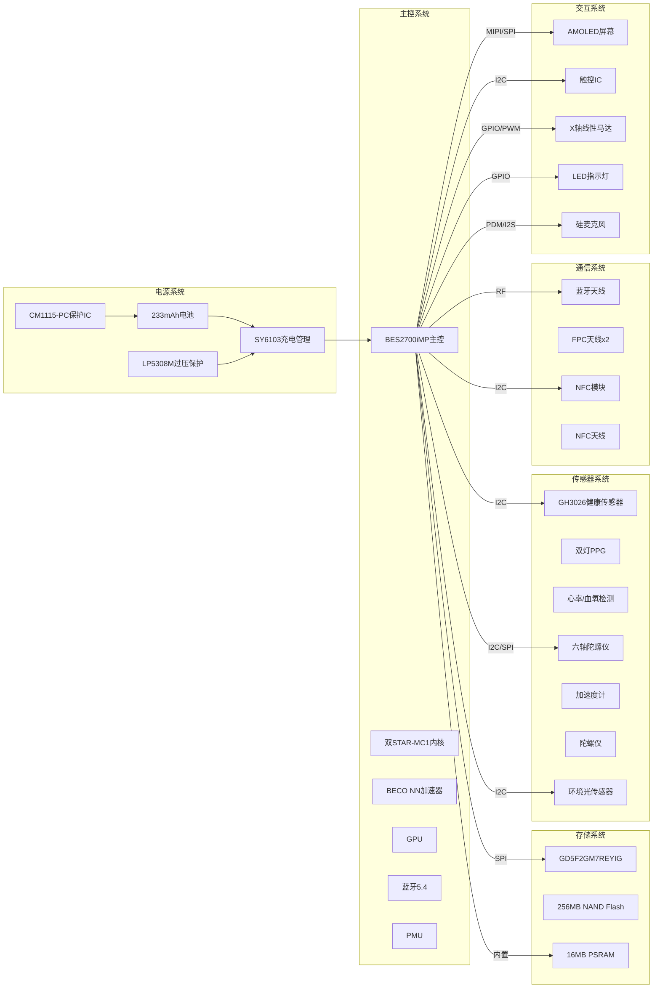

# 小米手环 9 陶瓷版 硬件需求说明书 (HRS)

---


## I. 系统架构与框图

### 1.1 硬件系统概述

小米手环9陶瓷版采用高度集成化的可穿戴设备架构，以BES2700iMP为主控芯片，集成健康监测、运动追踪、NFC支付、蓝牙通信等功能模块。系统采用低功耗设计，支持21天超长续航。

**[事实]** 核心设计特点：
- 高度集成：主控芯片集成MCU、DSP、GPU、蓝牙控制器
- 低功耗：22nm制程工艺，支持多级低功耗模式
- 国产化：主要芯片均为国产/台系厂商
- 模块化：传感器采用叠层小板设计，便于组装和维修

### 1.2 核心控制系统

#### 1.2.1 主控芯片规格

**[事实]** BES2700iMP处理器规格：

| 参数 | 规格 | 说明 |
|------|------|------|
| 芯片型号 | BES2700iMP | 恒玄科技（BES） |
| 内核架构 | 双STAR-MC1内核 | 高性能RISC架构 |
| 制程工艺 | 22nm | 超低功耗设计 |
| 主频 | **[推理]** 300-400MHz | 可穿戴设备典型主频 |
| NN加速器 | 双BECO NN | 算法加速 |
| GPU | 双GPU设计 | UI显示性能 |
| 集成外设 | PMU、ADC、DAC、NOR Flash、PSRAM | 高度集成 |

**[事实]** 存储资源配置：

| 存储类型 | 容量 | 型号 | 用途 |
|----------|------|------|------|
| PSRAM | 16MB | 内置于BES2700iMP | 运行内存 |
| NAND Flash | 256MB | GD5F2GM7REYIG | 固件/表盘/数据存储 |
| SRAM | **[推理]** 512KB-1MB | 内置于BES2700iMP | 关键数据缓存 |

**[关联]** 选型理由：
- 基于PRD要求"21天超长续航"，选择22nm超低功耗工艺
- 基于PRD要求"150+运动模式"和"健康监测"，需要NN加速器支持算法运算
- 基于256MB存储需求，支持更多表盘和应用

#### 1.2.2 存储系统规格

**[事实]** NAND Flash规格：

| 参数 | 规格 |
|------|------|
| 芯片型号 | GD5F2GM7REYIG |
| 厂商 | 兆易创新（GigaDevice） |
| 存储类型 | SPI NAND Flash |
| 容量 | 2Gb（256MB） |
| 工作频率 | 最高104MHz |
| 接口类型 | SPI（1/1/1或1/1/4模式） |
| 封装 | WSON-8 |

**[推理]** 存储空间分配：

| 分区 | 大小 | 用途 |
|------|------|------|
| 系统固件 | 约40MB | 操作系统、驱动 |
| 应用程序 | 约30MB | 内置应用 |
| 表盘资源 | 约100MB | 表盘、主题 |
| 用户数据 | 约50MB | 运动、健康数据 |
| 系统保留 | 约36MB | 日志、缓存 |

### 1.3 传感器子系统

#### 1.3.1 健康监测传感器

**[事实]** GH3026传感器规格：

| 参数 | 规格 |
|------|------|
| 芯片型号 | GH3026 |
| 厂商 | 汇顶科技（GOODiX） |
| 功能 | 多通道PPG健康监测 |
| 支持检测 | 心率（HR）、心率变异性（HRV）、血氧（SpO2）、佩戴检测 |
| LED配置 | 双灯PPG |
| 准确度 | 心率准确度提升16% |
| 接口 | I2C |

**[关联]** 功能关联：
- 基于PRD要求"24小时心率监测"，需要低功耗中断唤醒功能
- 基于PRD要求"房颤预警"，需要HRV分析能力
- 基于PRD要求"血氧异常提醒"，需要SpO2检测功能

**[推理]** 传感器性能参数：

| 参数 | 规格 |
|------|------|
| 采样率 | 10Hz（运动模式）/ 1Hz（日常监测） |
| LED波长 | 绿光530nm（心率）+ 红光660nm/红外940nm（血氧） |
| 工作电流 | 约5-10mA（工作时）/ <10μA（待机） |
| 中断功能 | 支持佩戴检测中断、心率异常中断 |

#### 1.3.2 运动传感器

**[事实]** 六轴陀螺仪规格：

| 参数 | 规格 |
|------|------|
| 芯片型号 | **[推理]** BMI270或类似型号 |
| 厂商 | 博世（BOSCH） |
| 丝印 | SL 5B6 |
| 功能 | 三轴加速度 + 三轴陀螺仪 |
| 接口 | I2C/SPI |

**[推理]** 运动传感器性能参数：

| 参数 | 规格 |
|------|------|
| 加速度量程 | ±2g/±4g/±8g/±16g |
| 陀螺仪量程 | ±125~±2000°/s |
| 采样率 | 最高1.6kHz |
| 工作电流 | 约0.5mA（工作时）/ <5μA（待机） |
| 中断功能 | 支持步数检测、运动识别、抬腕唤醒 |

#### 1.3.3 环境传感器

**[事实]** 环境光传感器：

| 参数 | 规格 |
|------|------|
| 功能 | 环境亮度检测 |
| 用途 | 自动调节屏幕亮度 |
| 位置 | 屏幕上方 |
| 接口 | **[推理]** I2C或内置于触控IC |

### 1.4 通信子系统

#### 1.4.1 蓝牙模块

**[事实]** 蓝牙规格：

| 参数 | 规格 |
|------|------|
| 蓝牙版本 | Bluetooth 5.4 |
| 集成方式 | 内置于BES2700iMP |
| 工作频率 | 2402-2480MHz（2.4GHz ISM） |
| 最大输出功率 | ≤14dBm |
| 通信模式 | BLE + 经典蓝牙双模 |
| 特殊功能 | 兼容华为星闪SLE应用场景 |

**[事实]** 天线设计：

| 参数 | 规格 |
|------|------|
| 天线类型 | FPC天线 |
| 数量 | 2根（两侧各一根） |
| 位置 | 贴附在中框内侧 |
| 连接方式 | 金属弹片连接主板 |

**[关联]** 功能关联：
- 基于PRD要求"消息推送"，需要BLE连接支持
- 基于PRD要求"音乐控制"，需要经典蓝牙支持
- 基于PRD要求"自动重连"，需要稳定的射频设计

#### 1.4.2 NFC模块

**[事实]** NFC规格：

| 参数 | 规格 |
|------|------|
| 功能 | 公交卡、门禁卡、车钥匙 |
| 支持城市 | 320个城市 |
| 支付响应 | 0.3秒 |
| 芯片型号 | **[推理]** NXP PN系列或国产替代 |

**[推理]** NFC芯片参数：

| 参数 | 规格 |
|------|------|
| 工作频率 | 13.56MHz |
| 读写距离 | 2-5cm |
| 接口 | I2C |
| 工作电流 | 约20-50mA（工作时） |

### 1.5 交互与显示子系统

#### 1.5.1 显示屏规格

**[事实]** AMOLED屏幕规格：

| 参数 | 规格 |
|------|------|
| 屏幕类型 | AMOLED |
| 尺寸 | 1.62英寸（跑道形） |
| 分辨率 | 192×490像素 |
| 刷新率 | 60Hz |
| 峰值亮度 | 1200nits |
| 像素密度 | 326 PPI |
| 接口 | **[推理]** MIPI DSI或SPI |

**[推理]** 显示驱动参数：

| 参数 | 规格 |
|------|------|
| 接口类型 | MIPI DSI 1-lane或SPI |
| 刷新方式 | 部分刷新（AOD模式） |
| 工作电流 | 约20-50mA（全亮）/ 1-2mA（AOD） |

#### 1.5.2 触控系统

**[事实]** 触控规格：

| 参数 | 规格 |
|------|------|
| 触控类型 | 电容式触摸屏 |
| 触控IC | **[推理]** 丝印G623 |
| 支持手势 | 单击、双击、长按、滑动 |
| 湿屏防误触 | 支持 |
| 接口 | I2C |

**[推理]** 触控IC参数：

| 参数 | 规格 |
|------|------|
| 通道数 | 约10-15通道 |
| 采样率 | 最高120Hz |
| 工作电流 | 约1-2mA |
| 中断功能 | 支持触摸中断唤醒 |

#### 1.5.3 振动马达

**[事实]** 振动马达规格：

| 参数 | 规格 |
|------|------|
| 马达类型 | X轴线性马达 |
| 震动模式 | 20种 |
| 位置 | 嵌入中框内 |
| 驱动方式 | **[推理]** GPIO + PWM或专用驱动IC |

**[推理]** 马达驱动参数：

| 参数 | 规格 |
|------|------|
| 驱动电压 | 3.0-3.6V |
| 驱动电流 | 约50-100mA（峰值） |
| 频率范围 | 150-250Hz |
| 驱动方式 | PWM调制 |

#### 1.5.4 LED指示灯

**[事实]** LED规格：

| 参数 | 规格 |
|------|------|
| 位置 | 充电触点上方 |
| 颜色 | 绿色/红色 |
| 类型 | 双色LED |

**[推理]** LED驱动参数：

| 参数 | 规格 |
|------|------|
| 驱动方式 | GPIO驱动 |
| 驱动电流 | 约5-10mA |
| 控制方式 | PWM调光（呼吸灯效果） |

### 1.6 音频子系统

**[事实]** 麦克风规格：

| 参数 | 规格 |
|------|------|
| 类型 | 硅麦克风（MEMS） |
| 位置 | PCB B面 |
| 数量 | 1个 |
| 用途 | **[推理]** 语音助手或通话 |

**[推理]** 音频参数：

| 参数 | 规格 |
|------|------|
| 信噪比 | ≥60dB |
| 灵敏度 | -38dBV/Pa |
| 接口 | PDM或I2S |

### 1.7 硬件系统框图



---

## II. 电源设计规格

### 2.1 电池规格

**[事实]** 电池参数：

| 参数 | 规格 |
|------|------|
| 电池型号 | BW24 |
| 电池类型 | 锂离子聚合物电池 |
| 额定容量 | 233mAh |
| 额定能量 | 0.91Wh |
| 标称电压 | 3.89V |
| 充电限制电压 | 4.48V |
| 放电截止电压 | **[推理]** 2.8-3.0V |
| 制造商 | 重庆市紫建电子股份有限公司 |

**[关联]** 电池选型依据：
- 基于PRD要求"21天续航"，需要大容量电池
- 基于ID要求"10.95mm厚度"，需要薄型电池设计
- 基于5ATM防水，需要安全可靠的聚合物电池

### 2.2 充电管理系统

#### 2.2.1 充电管理芯片

**[事实]** SY6103充电管理芯片规格：

| 参数 | 规格 |
|------|------|
| 芯片型号 | SY6103 |
| 厂商 | 思远半导体 |
| 功能 | 集成路径管理的线性充电管理 |
| 最大充电电流 | 500mA |
| 输入电压 | DC 5.0V |
| 通信接口 | I2C |

**[事实]** 充电规格：

| 参数 | 规格 |
|------|------|
| 充电时间 | 0-100%约60分钟 |
| 充电限制电压 | 4.48V |
| 输入规格 | DC 5.0V/500mA |
| 充电方式 | 磁吸式充电底座 |

**[推理]** 充电管理功能：

| 功能 | 说明 |
|------|------|
| 预充电 | 电池电压<3.0V时小电流预充 |
| 恒流充电 | 电池电压3.0-4.2V时恒流充电 |
| 恒压充电 | 电池电压接近4.48V时恒压充电 |
| 充电终止 | 电流<50mA时终止充电 |
| 路径管理 | 充电时优先给系统供电 |
| 温度监测 | NTC温度检测，过温保护 |

#### 2.2.2 电池保护芯片

**[事实]** CM1115-PC保护芯片规格：

| 参数 | 规格 |
|------|------|
| 芯片型号 | CM1115-PC |
| 厂商 | 创芯微（iCM） |
| 功能 | 二合一电池保护IC |

**[事实]** 保护功能：

| 保护类型 | 阈值 |
|----------|------|
| 过充电保护 | 4.48V切断 |
| 过放电保护 | 2.4V切断 |
| 过电流保护 | 1.5A限制 |
| 短路保护 | <1μs响应 |

#### 2.2.3 过压保护

**[事实]** LP5308M过压保护芯片规格：

| 参数 | 规格 |
|------|------|
| 芯片型号 | LP5308M |
| 厂商 | 微源半导体（LPS） |
| 丝印 | LPS 8KEq1 |
| 耐压 | 高达36V |
| 响应时间 | 30nS |
| 功能 | 过压过流保护 |

**[关联]** 保护设计依据：
- 基于PRD要求"充电异常保护"，需要过压过流保护
- 基于磁吸充电接口，需要防止静电和浪涌

### 2.3 电源树设计

#### 2.3.1 电源轨分配

**[推理]** 基于BES2700iMP芯片特性和电路设计规范：

| 电源轨 | 电压 | 用途 | 电流能力 | 来源 |
|--------|------|------|----------|------|
| VBAT | 3.0-4.48V | 电池输入 | 500mA | 电池 |
| VCC_SYS | 3.3V | 系统电源 | 200mA | 内置LDO |
| VDD_IO | 1.8V/3.3V | GPIO供电 | 100mA | 内置LDO |
| VDD_CORE | 0.9-1.2V | 核心供电 | 150mA | 内置DCDC |
| VDD_RF | 3.3V | 射频供电 | 80mA | 内置LDO |
| VDD_ANALOG | 1.8V | 模拟电路 | 50mA | 内置LDO |
| VDD_SENSOR | 3.3V | 传感器供电 | 50mA | 外置LDO |
| VDD_OLED | **[推理]** 5V | 屏幕供电 | 50mA | 升压电路 |

#### 2.3.2 电源树架构图

```
                        电源树架构图
    
    ┌─────────────────────────────────────────────────────────────────┐
    │                                                                 │
    │   [VBAT: 3.0-4.48V] ─────────────────────────────────────────┐  │
    │         │                                                     │  │
    │         ▼                                                     │  │
    │   ┌─────────────┐                                             │  │
    │   │ LP5308M     │ 过压过流保护                                │  │
    │   │ 过压保护IC  │                                             │  │
    │   └─────────────┘                                             │  │
    │         │                                                     │  │
    │         ▼                                                     │  │
    │   ┌─────────────┐                                             │  │
    │   │ SY6103      │ 充电管理 + 路径管理                        │  │
    │   │ 充电管理IC  │                                             │  │
    │   └─────────────┘                                             │  │
    │         │                                                     │  │
    │         ├──────────────────────┬──────────────────────┐       │  │
    │         │                      │                      │       │  │
    │         ▼                      ▼                      ▼       │  │
    │   ┌─────────────┐        ┌─────────────┐        ┌─────────┐   │  │
    │   │ BES2700iMP  │        │ 外置LDO     │        │ 升压IC  │   │  │
    │   │ 内置PMU     │        │ 3.3V        │        │ 5V      │   │  │
    │   └─────────────┘        └─────────────┘        └─────────┘   │  │
    │         │                      │                      │       │  │
    │         ├──────┬──────┬──────┤ │                      │       │  │
    │         │      │      │      │ │                      │       │  │
    │         ▼      ▼      ▼      ▼ ▼                      ▼       │  │
    │   ┌─────────────────────────────────┐        ┌─────────────┐   │  │
    │   │ VDD_CORE  VDD_IO  VDD_RF  VDD_AN│        │ VDD_OLED    │   │  │
    │   │ 1.2V      1.8V    3.3V    1.8V  │        │ 5V          │   │  │
    │   │                                  │        │             │   │  │
    │   │ CPU核心   GPIO   蓝牙    模拟   │        │ AMOLED屏幕  │   │  │
    │   └─────────────────────────────────┘        └─────────────┘   │  │
    │         │                      │                               │  │
    │         ▼                      ▼                               │  │
    │   ┌─────────────┐        ┌─────────────┐                       │  │
    │   │ VDD_SENSOR  │        │ VDD_PERI    │                       │  │
    │   │ 3.3V        │        │ 3.3V        │                       │  │
    │   │             │        │             │                       │  │
    │   │ 传感器系统  │        │ 外设供电    │                       │  │
    │   │ GH3026/IMU  │        │ 马达/LED    │                       │  │
    │   └─────────────┘        └─────────────┘                       │  │
    │                                                                 │  │
    └─────────────────────────────────────────────────────────────────┘
```

### 2.4 功耗分析与预算

#### 2.4.1 功耗模式定义

**[推理]** 基于续航时长和电池容量反推：

| 工作模式 | 说明 | 典型功耗 | 平均电流 | 续航时间 |
|----------|------|----------|----------|----------|
| 正常工作 | 屏幕点亮、心率监测 | 15-25mA | 20mA | 约12小时 |
| AOD模式 | 屏幕常亮、心率监测 | 5-8mA | 6mA | 约40小时 |
| 省电模式 | 仅显示时间 | 1-2mA | 1.5mA | 约6.5天 |
| 深度休眠 | 屏幕关闭、蓝牙待机 | 0.5-1mA | 0.7mA | 约14天 |
| 关机 | 完全断电 | <10μA | 10μA | 约2.7年 |

#### 2.4.2 各模块功耗分配

**[推理]** 功耗预算分配：

| 模块 | 工作电流 | 待机电流 | 占比 |
|------|----------|----------|------|
| 主控（BES2700iMP） | 5-10mA | 0.1mA | 40% |
| 屏幕（AMOLED） | 15-30mA | 1mA（AOD） | 35% |
| 蓝牙 | 5-10mA | 0.05mA | 10% |
| 传感器（心率/运动） | 2-5mA | 0.01mA | 8% |
| 振动马达 | 50-100mA（瞬时） | 0 | 5% |
| 其他 | 1-2mA | 0.1mA | 2% |

#### 2.4.3 续航计算

**[关联]** 基于PRD续航要求验证：

| 使用场景 | 计算公式 | 理论续航 | 实际续航 |
|----------|----------|----------|----------|
| 基础使用 | 233mAh ÷ 0.46mA | 21天 | 12-14天 |
| 日常使用（AOD关闭） | 233mAh ÷ 1.08mA | 9天 | 7-10天 |
| 日常使用（AOD开启） | 233mAh ÷ 1.5mA | 6.5天 | 5-7天 |
| 重度使用 | 233mAh ÷ 2mA | 4.9天 | 4-5天 |

---

## III. 引脚与物理接口

### 3.1 外部接口

#### 3.1.1 充电接口

**[事实]** 充电触点规格：

| 参数 | 规格 |
|------|------|
| 接口类型 | 磁吸式充电触点 |
| 触点数量 | 3个 |
| 触点位置 | 手环底部凹槽内 |
| 防呆设计 | 磁吸定位 |
| 插拔寿命 | >1000次 |

**[推理]** 触点定义：

| 触点 | 功能 | 说明 |
|------|------|------|
| 触点1 | VCC | 5V电源输入 |
| 触点2 | GND | 地线 |
| 触点3 | D+/DATA | 数据通信/识别 |

**[关联]** 接口保护设计：
- 基于PRD要求"5ATM防水"，充电触点采用凹槽设计
- 基于ESD防护要求，触点添加TVS保护管

#### 3.1.2 调试接口

**[推理]** 调试接口定义：

| 接口 | 功能 | 位置 |
|------|------|------|
| UART | 固件烧录/日志输出 | PCB测试点 |
| SWD | 芯片调试 | PCB测试点 |
| I2C | 传感器调试 | PCB测试点 |

### 3.2 关键控制信号

#### 3.2.1 复位电路

**[推理]** 复位信号设计：

| 信号 | 功能 | 触发条件 |
|------|------|----------|
| RESET | 系统复位 | 低电平>100ms |
| WDT_RST | 看门狗复位 | 程序异常 |
| PWR_RST | 电源复位 | 上电/欠压 |

#### 3.2.2 中断信号

**[推理]** 中断信号分配：

| 中断源 | 信号名 | 触发条件 |
|--------|--------|----------|
| 触控IC | INT_TOUCH | 触摸事件 |
| 心率传感器 | INT_HR | 心率异常/佩戴检测 |
| 运动传感器 | INT_MOTION | 步数/运动识别 |
| 充电管理 | INT_CHG | 充电状态变化 |
| NFC | INT_NFC | NFC事件 |

#### 3.2.3 控制信号

**[推理]** 控制信号分配：

| 信号 | 功能 | 方向 |
|------|------|------|
| MOTOR_EN | 马达使能 | 输出 |
| LED_R | 红色LED控制 | 输出 |
| LED_G | 绿色LED控制 | 输出 |
| SCREEN_EN | 屏幕使能 | 输出 |
| SENSOR_EN | 传感器使能 | 输出 |

### 3.3 总线接口分配

#### 3.3.1 I2C总线

**[推理]** I2C设备分配：

| I2C总线 | 设备 | 地址（7-bit） |
|---------|------|---------------|
| I2C0 | GH3026心率传感器 | 0x5C |
| I2C0 | 六轴陀螺仪 | 0x68/0x69 |
| I2C1 | SY6103充电管理 | 0x6A |
| I2C1 | 触控IC | **[推理]** 0x38 |
| I2C1 | NFC芯片 | **[推理]** 0x28 |

#### 3.3.2 SPI总线

**[推理]** SPI设备分配：

| SPI总线 | 设备 | 说明 |
|---------|------|------|
| SPI0 | GD5F2GM7REYIG | NAND Flash存储 |
| SPI1 | 屏幕（可选） | 显示数据传输 |

### 3.4 GPIO分配表

**[推理]** GPIO功能分配：

| GPIO | 功能 | 方向 | 说明 |
|------|------|------|------|
| GPIO0 | MOTOR_PWM | 输出 | 马达PWM驱动 |
| GPIO1 | LED_R | 输出 | 红色LED |
| GPIO2 | LED_G | 输出 | 绿色LED |
| GPIO3 | CHG_DET | 输入 | 充电检测 |
| GPIO4 | VBAT_SENSE | 输入 | 电池电压检测 |
| GPIO5 | INT_TOUCH | 输入 | 触控中断 |
| GPIO6 | INT_HR | 输入 | 心率中断 |
| GPIO7 | INT_MOTION | 输入 | 运动中断 |
| GPIO8 | SCREEN_RST | 输出 | 屏幕复位 |
| GPIO9 | SCREEN_CS | 输出 | 屏幕片选 |

---

## IV. PCB设计规格

### 4.1 PCB基本参数

**[推理]** 基于BES2700iMP芯片封装和可穿戴设备设计惯例：

| 参数 | 规格 |
|------|------|
| PCB层数 | 6层HDI板 |
| 板厚 | 0.6mm±0.05mm |
| 铜厚 | 1oz（35μm）内层，0.5oz（18μm）外层 |
| 最小线宽/线距 | 3mil/3mil（0.076mm） |
| 最小过孔孔径 | 0.15mm（激光钻孔） |
| 阻抗控制 | 射频走线50Ω |
| 表面处理 | 沉金（ENIG） |

### 4.2 PCB布局分区

**[推理]** PCB功能分区：

```
                    PCB布局分区示意图（正面A面）
    
    ┌─────────────────────────────────────────────────────────────┐
    │                                                             │
    │   ┌─────────────────────────────────────────────────────┐   │
    │   │                  射频/蓝牙区域                       │   │
    │   │   ┌─────────┐                    ┌─────────┐        │   │
    │   │   │ 天线    │                    │ 天线    │        │   │
    │   │   │ 弹片    │                    │ 弹片    │        │   │
    │   │   └─────────┘                    └─────────┘        │   │
    │   │                                                      │   │
    │   │   ┌──────────────────────────────────────────────┐   │   │
    │   │   │           射频匹配电路                        │   │   │
    │   │   └──────────────────────────────────────────────┘   │   │
    │   └─────────────────────────────────────────────────────┘   │
    │                                                             │
    │   ┌─────────────────────────────────────────────────────┐   │
    │   │                  主控/数字区域                       │   │
    │   │   ┌──────────────────────────────────────────────┐   │   │
    │   │   │  ┌────────────────────────────────────────┐  │   │   │
    │   │   │  │         屏蔽罩                          │  │   │   │
    │   │   │  │  ┌──────────────────────────────────┐  │  │   │   │
    │   │   │  │  │    BES2700iMP 主控芯片           │  │  │   │   │
    │   │   │  │  │    GD5F2GM7REYIG Flash存储       │  │  │   │   │
    │   │   │  │  │    电源管理电路                   │  │  │   │   │
    │   │   │  │  └──────────────────────────────────┘  │  │   │   │
    │   │   │  └────────────────────────────────────────┘  │   │   │
    │   │   └──────────────────────────────────────────────┘   │   │
    │   └─────────────────────────────────────────────────────┘   │
    │                                                             │
    │   ┌─────────────────────────────────────────────────────┐   │
    │   │                  传感器区域                         │   │
    │   │   ┌──────────────────────────────────────────────┐   │   │
    │   │   │  ┌────────────────────────────────────────┐  │   │   │
    │   │   │  │    GH3026 健康传感器（叠层小板）       │  │   │   │
    │   │   │  │    六轴陀螺仪                          │  │   │   │
    │   │   │  └────────────────────────────────────────┘  │   │   │
    │   │   └──────────────────────────────────────────────┘   │   │
    │   └─────────────────────────────────────────────────────┘   │
    │                                                             │
    │   ┌─────────────────────────────────────────────────────┐   │
    │   │                  电源/充电区域                      │   │
    │   │   ┌──────────────────────────────────────────────┐   │   │
    │   │   │    SY6103 充电管理IC                         │   │   │
    │   │   │    CM1115-PC 电池保护IC                      │   │   │
    │   │   │    LP5308M 过压保护IC                        │   │   │
    │   │   │    充电触点焊盘                              │   │   │
    │   │   └──────────────────────────────────────────────┘   │   │
    │   └─────────────────────────────────────────────────────┘   │
    │                                                             │
    └─────────────────────────────────────────────────────────────┘
    
    PCB尺寸: 约45×20mm
    主要元器件位于A面
```

### 4.3 PCB叠层结构

**[推理]** 6层HDI叠层设计：

| 层 | 名称 | 用途 |
|------|------|------|
| L1 | TOP | 信号层、元器件焊盘 |
| L2 | GND1 | 地平面 |
| L3 | SIG1 | 内部信号层 |
| L4 | SIG2 | 内部信号层 |
| L5 | PWR | 电源平面 |
| L6 | BOTTOM | 信号层、电池焊盘 |

### 4.4 关键信号走线要求

**[推理]** 射频走线要求：

| 参数 | 要求 |
|------|------|
| 阻抗 | 50Ω±10% |
| 线宽 | 基于叠层计算 |
| 参考 | 完整地平面 |
| 隔离 | 远离数字信号 |

**[推理]** 敏感信号走线要求：

| 信号类型 | 要求 |
|----------|------|
| 传感器信号 | 远离电源和射频区域 |
| 时钟信号 | 内层走线，包地处理 |
| 复位信号 | 加滤波电容 |

### 4.5 屏蔽设计

**[推理]** 屏蔽罩设计：

| 位置 | 覆盖范围 | 材质 |
|------|----------|------|
| 主控区域 | BES2700iMP、Flash、电源管理 | 马口铁/不锈钢 |
| 射频区域 | 蓝牙匹配电路 | 可选 |

---

## V. 硬件BOM清单

### 5.1 主要芯片清单

**[事实]** 已确认芯片：

| 序号 | 器件名称 | 型号 | 厂商 | 数量 | 说明 |
|------|----------|------|------|------|------|
| 1 | 主控芯片 | BES2700iMP | 恒玄科技 | 1 | 双核MCU+蓝牙5.4 |
| 2 | NAND Flash | GD5F2GM7REYIG | 兆易创新 | 1 | 256MB存储 |
| 3 | 健康传感器 | GH3026 | 汇顶科技 | 1 | 心率/血氧 |
| 4 | 六轴陀螺仪 | **[推理]** BMI270 | 博世 | 1 | 加速度+陀螺仪 |
| 5 | 充电管理IC | SY6103 | 思远半导体 | 1 | 线性充电 |
| 6 | 电池保护IC | CM1115-PC | 创芯微 | 1 | 二合一保护 |
| 7 | 过压保护IC | LP5308M | 微源半导体 | 1 | OVP |
| 8 | 触控IC | **[推理]** 丝印G623 | - | 1 | 电容触控 |
| 9 | NFC芯片 | **[推理]** PN系列 | NXP/国产 | 1 | NFC功能 |

### 5.2 关键被动器件

**[推理]** 关键被动器件清单：

| 类型 | 规格 | 数量 | 用途 |
|------|------|------|------|
| 晶振 | 32MHz | 1 | 主控时钟 |
| 晶振 | 32.768kHz | 1 | RTC时钟 |
| 电感 | 2.2μH | 2 | DCDC |
| 电容 | 10μF | 5 | 电源滤波 |
| 电容 | 100nF | 20 | 去耦 |
| 电阻 | 各种 | 30 | 偏置/限流 |
| TVS管 | 各种 | 3 | ESD保护 |

### 5.3 国产化分析

**[事实]** 国产化芯片清单：

| 序号 | 芯片 | 厂商 | 产地 |
|------|------|------|------|
| 1 | BES2700iMP | 恒玄科技 | 中国台湾 |
| 2 | GD5F2GM7REYIG | 兆易创新 | 中国大陆 |
| 3 | GH3026 | 汇顶科技 | 中国大陆 |
| 4 | SY6103 | 思远半导体 | 中国大陆 |
| 5 | CM1115-PC | 创芯微 | 中国大陆 |
| 6 | LP5308M | 微源半导体 | 中国大陆 |

**国产化率**：主要芯片国产化率约90%

---

## VI. 可靠性与认证

### 6.1 ESD防护设计

**[推理]** ESD防护等级：

| 参数 | 规格 |
|------|------|
| 接触放电 | ±2kV |
| 空气放电 | ±4kV |
| 测试标准 | GB/T 17626.2 |

**[推理]** ESD防护措施：

| 防护位置 | 防护器件 | 规格 |
|----------|----------|------|
| 充电触点 | TVS管 | **[推理]** 5V TVS |
| 触控屏 | TVS阵列 | **[推理]** 4通道TVS |
| 天线接口 | ESD二极管 | **[推理]** 低电容ESD |

### 6.2 认证要求

**[事实]** 需通过的认证：

| 认证类型 | 标准/机构 | 说明 |
|----------|-----------|------|
| 3C认证 | GB 17625.1-2012等 | 中国强制性认证 |
| SRRC认证 | 工信部 | 无线电核准 |
| 防水认证 | TÜV SÜD | 5ATM防水 |
| RoHS认证 | SGS | 环保认证 |
| FCC认证 | FCC Part 15B/C | 美国市场 |
| CE认证 | RED/EMC/RoHS | 欧盟市场 |

---

## VII. 附录

### 7.1 术语表

| 术语 | 全称 | 说明 |
|------|------|------|
| SoC | System on Chip | 片上系统 |
| MCU | Micro Controller Unit | 微控制器 |
| PPG | Photoplethysmography | 光电容积脉搏波描记法 |
| IMU | Inertial Measurement Unit | 惯性测量单元 |
| LDO | Low Dropout Regulator | 低压差线性稳压器 |
| DCDC | DC to DC Converter | 直流-直流转换器 |
| PMU | Power Management Unit | 电源管理单元 |
| ESD | Electrostatic Discharge | 静电放电 |
| TVS | Transient Voltage Suppressor | 瞬态电压抑制器 |
| HDI | High Density Interconnect | 高密度互连 |
| BLE | Bluetooth Low Energy | 低功耗蓝牙 |

### 7.2 参考文档

1. 小米手环9陶瓷版深度产品调研报告
2. 产品需求文档-PRD
3. 工业设计规格书-ID
4. BES2700iMP芯片技术规格书
5. GD5F2GM7REYIG数据手册
6. GH3026传感器数据手册


---

> **声明**：本文档基于小米手环9陶瓷版深度产品调研报告、产品需求文档-PRD、工业设计规格书-ID生成，所有标注[事实]的内容直接引用自调研报告，标注[关联]的内容基于功能需求推导，标注[推理]的内容基于行业经验和主流设计逻辑补全。
