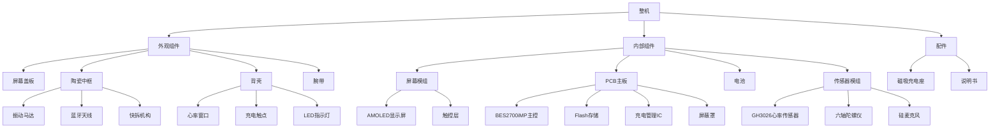
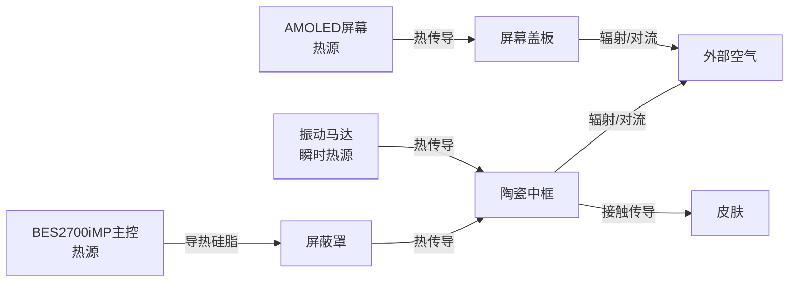

# 小米手环 9 陶瓷版 结构设计说明书 (MD)

---

## I. 堆叠方案与拆解逻辑

### 1.1 整体堆叠架构

小米手环9陶瓷版采用紧凑高效的层叠式结构设计，整机由外至内分为以下层级：

**[事实]** 堆叠层级结构：

| 层级 | 组件 | 材质 | 厚度 |
|------|------|------|------|
| 第1层 | 屏幕盖板 | 2.5D强化玻璃 | 约0.5mm |
| 第2层 | 显示模组 | AMOLED+触控 | 约0.5mm |
| 第3层 | 陶瓷中框 | 氧化锆陶瓷 | 约1.5-2mm |
| 第4层 | PCB主板 | 6层HDI板 | 约0.8mm |
| 第5层 | 电池 | 锂离子聚合物 | 约2.5-3mm |
| 第6层 | 传感器模组 | 叠层小板 | 约1.5-2mm |
| 第7层 | 背壳 | 纤维高强聚合物 | 约0.8-1mm |

**[关联]** 堆叠设计依据：
- 基于ID要求"10.95mm整机厚度"，各层级需精确控制厚度
- 基于HRS要求"5ATM防水"，需预留密封结构空间
- 基于PRD要求"21天续航"，需容纳233mAh大容量电池

### 1.2 堆叠架构图

```
                    整机堆叠架构图（Y-Z剖面）
    
    ═══════════════════════════════════════════════════════════════
    │                                                               │
    │   ┌─────────────────────────────────────────────────────┐    │
    │   │              第1层：屏幕盖板                        │    │
    │   │              2.5D强化玻璃 + AF涂层                  │    │
    │   │              厚度: 约0.5mm                          │    │
    │   └─────────────────────────────────────────────────────┘    │
    │                            ↓                                  │
    │   ┌─────────────────────────────────────────────────────┐    │
    │   │              第2层：显示模组                        │    │
    │   │              AMOLED显示屏 + 触控层                  │    │
    │   │              厚度: 约0.5mm                          │    │
    │   └─────────────────────────────────────────────────────┘    │
    │                            ↓                                  │
    │   ┌─────────────────────────────────────────────────────┐    │
    │   │              第3层：陶瓷中框                        │    │
    │   │              氧化锆陶瓷（ZrO₂）                     │    │
    │   │              厚度: 约1.5-2mm（壁厚）                │    │
    │   │              ┌─────────────────────────────────┐    │    │
    │   │              │  振动马达嵌入中框内              │    │    │
    │   │              │  蓝牙天线贴附中框内侧            │    │    │
    │   │              └─────────────────────────────────┘    │    │
    │   └─────────────────────────────────────────────────────┘    │
    │                            ↓                                  │
    │   ┌─────────────────────────────────────────────────────┐    │
    │   │              第4层：PCB主板                         │    │
    │   │              6层HDI板 + 元器件                      │    │
    │   │              厚度: 约0.8mm + 元器件高度             │    │
    │   │              ┌─────────────────────────────────┐    │    │
    │   │              │  BES2700iMP / Flash / 充电IC    │    │    │
    │   │              │  屏蔽罩覆盖主控区域              │    │    │
    │   │              └─────────────────────────────────┘    │    │
    │   └─────────────────────────────────────────────────────┘    │
    │                            ↓                                  │
    │   ┌─────────────────────────────────────────────────────┐    │
    │   │              第5层：电池                            │    │
    │   │              233mAh 锂离子聚合物电池                │    │
    │   │              厚度: 约2.5-3mm                        │    │
    │   └─────────────────────────────────────────────────────┘    │
    │                            ↓                                  │
    │   ┌─────────────────────────────────────────────────────┐    │
    │   │              第6层：传感器模组                      │    │
    │   │              GH3026健康传感器（叠层小板）           │    │
    │   │              六轴陀螺仪 / 硅麦克风                  │    │
    │   │              厚度: 约1.5-2mm                        │    │
    │   └─────────────────────────────────────────────────────┘    │
    │                            ↓                                  │
    │   ┌─────────────────────────────────────────────────────┐    │
    │   │              第7层：背壳                            │    │
    │   │              纤维高强聚合物 + 磨砂处理              │    │
    │   │              厚度: 约0.8-1mm                        │    │
    │   │              ┌─────────────────────────────────┐    │    │
    │   │              │  心率传感器窗口                  │    │    │
    │   │              │  充电触点凹槽                    │    │    │
    │   │              │  LED指示灯                       │    │    │
    │   │              └─────────────────────────────────┘    │    │
    │   └─────────────────────────────────────────────────────┘    │
    │                                                               │
    ═══════════════════════════════════════════════════════════════
    
    整机厚度: 10.95mm（不含心率凸台）
    心率凸台高度: 约1-1.5mm
```

### 1.3 组装顺序

**[事实]** 组装方式：
- 采用层叠式结构设计，组件之间通过螺丝和卡扣固定
- PCB主板通过螺丝固定在上层，与排线通过ZIF连接器连接
- 主板布局紧密，绝大多数元器件集中在A面

**[推理]** 工厂组装顺序（由内而外）：

| 步骤 | 操作 | 说明 |
|------|------|------|
| 1 | 传感器模组安装 | 将GH3026等传感器安装到背壳内 |
| 2 | 电池安装 | 将电池放入背壳，焊接导线到主板 |
| 3 | 主板安装 | 将PCB主板通过螺丝固定到中框 |
| 4 | 屏幕模组安装 | 将屏幕模组通过ZIF连接器连接 |
| 5 | 中框装配 | 将陶瓷中框与背壳扣合 |
| 6 | 密封处理 | 点胶密封，安装密封圈 |
| 7 | 屏幕安装 | 将屏幕盖板贴合到中框 |
| 8 | 腕带安装 | 安装氟橡胶腕带 |

### 1.4 拆解顺序

**[推理]** 拆解顺序（组装的逆向）：

| 步骤 | 操作 | 工具 | 注意事项 |
|------|------|------|----------|
| 1 | 拆卸腕带 | 手动 | 按下快拆按键 |
| 2 | 加热软化胶 | 热风枪 | 温度约80-100℃ |
| 3 | 分离屏幕盖板 | 吸盘+撬片 | 避免损伤屏幕 |
| 4 | 分离中框与背壳 | 撬片 | 沿缝隙小心分离 |
| 5 | 拆除螺丝 | 十字螺丝刀 | 螺丝数量约2颗 |
| 6 | 断开排线 | 镊子 | ZIF连接器 |
| 7 | 取出主板 | 镊子 | 注意电池焊接 |
| 8 | 取出电池 | 镊子 | 焊接连接 |

### 1.5 内部组件层级关系



---

## II. 关键组件固定方案

### 2.1 PCB固定方案

**[事实]** PCB固定方式：
- PCB主板通过螺丝固定在上层
- 与排线通过ZIF连接器连接

**[推理]** PCB固定设计：

| 固定方式 | 规格 | 数量 | 位置 |
|----------|------|------|------|
| 螺丝固定 | Φ1.5mm×3mm十字螺丝 | 2颗 | 主板对角位置 |
| 支撑柱 | 塑料/金属支柱 | 4个 | 四角支撑 |
| 定位销 | Φ1mm定位销 | 2个 | 防止旋转 |

**[推理]** PCB支撑设计：

```
                    PCB固定方案示意图（俯视）
    
    ┌─────────────────────────────────────────────────────────────┐
    │                                                             │
    │    ┌───────────────────────────────────────────────────┐    │
    │    │                                                   │    │
    │    │    ●──────────────────────────────────────●       │    │
    │    │    │  螺丝孔1                    螺丝孔2  │       │    │
    │    │    │                                        │       │    │
    │    │    │      ┌────────────────────────┐       │       │    │
    │    │    │      │                        │       │       │    │
    │    │    │      │      PCB主板           │       │       │    │
    │    │    │      │      约45×20mm         │       │       │    │
    │    │    │      │                        │       │       │    │
    │    │    │      └────────────────────────┘       │       │    │
    │    │    │                                        │       │    │
    │    │    │  支撑柱                    支撑柱      │       │    │
    │    │    ●──────────────────────────────────────●       │    │
    │    │                                                   │    │
    │    │    ●: 螺丝固定点                                  │    │
    │    │    ○: 支撑柱位置                                  │    │
    │    │    △: 定位销位置                                  │    │
    │    │                                                   │    │
    │    │    ○──────△────────────────────△──────○           │    │
    │    │                                                   │    │
    │    └───────────────────────────────────────────────────┘    │
    │                                                             │
    └─────────────────────────────────────────────────────────────┘
```

### 2.2 电池固定方案

**[事实]** 电池连接方式：
- 电池通过导线焊接在主板上

**[推理]** 电池固定设计：

| 固定方式 | 说明 |
|----------|------|
| 焊接连接 | 电池正负极导线焊接至主板焊盘 |
| 双面胶固定 | 电池底部贴双面胶固定到背壳 |
| 泡棉缓冲 | 电池周围填充泡棉防震 |
| 预留膨胀空间 | 电池仓预留0.3-0.5mm膨胀空间 |

**[关联]** 电池固定依据：
- 基于HRS要求"233mAh电池"，需要稳固的固定方案
- 基于PRD要求"5ATM防水"，电池仓需要密封保护
- 基于可靠性要求，需要防震缓冲设计

### 2.3 屏幕模组固定方案

**[事实]** 屏幕固定方式：
- 屏幕与中框之间采用防水胶密封

**[推理]** 屏幕固定设计：

| 固定方式 | 规格 | 说明 |
|----------|------|------|
| 光学胶贴合 | OCA/LOCA | 屏幕各层贴合 |
| 防水胶密封 | 环氧树脂胶 | 屏幕与中框密封 |
| 防水泡棉胶带 | 3M防水胶带 | 边缘密封 |
| 点胶工艺 | UV胶 | 二次密封 |

### 2.4 传感器模组固定方案

**[事实]** 传感器设计：
- 传感器模组采用叠层小板设计
- 包括心率检测LED、血氧检测LED和双通道光线接收感应器

**[推理]** 传感器固定设计：

| 组件 | 固定方式 | 说明 |
|------|----------|------|
| GH3026传感器 | 叠层小板+连接器 | 通过ZIF连接器连接主板 |
| 心率LED | SMT焊接 | 焊接在传感器小板 |
| 光线接收器 | SMT焊接 | 双通道设计 |
| 传感器窗口 | 光学胶全贴合 | LOCA光学胶密封 |

### 2.5 振动马达固定方案

**[事实]** 马达位置：
- 振动马达嵌入在中框内
- 通过排线露铜与主板连接

**[推理]** 马达固定设计：

| 固定方式 | 说明 |
|----------|------|
| 嵌入式设计 | 马达嵌入中框预留槽位 |
| 导电胶/焊接 | 排线露铜与主板连接 |
| 泡棉缓冲 | 马达周围填充泡棉固定 |

### 2.6 天线固定方案

**[事实]** 天线设计：
- 蓝牙天线采用FPC天线，贴附在中框内侧
- 天线数量：2根（两侧各一根）
- 连接方式：通过金属弹片露铜连接到主板

**[推理]** 天线固定设计：

| 固定方式 | 说明 |
|----------|------|
| 背胶固定 | FPC天线通过背胶贴附中框 |
| 金属弹片 | 天线与主板通过弹片接触 |
| 净空区设计 | 天线区域下方无金属遮挡 |

### 2.7 充电触点固定方案

**[事实]** 充电接口设计：
- 充电触点位于手环底部凹槽内
- 采用磁吸式设计

**[推理]** 充电触点固定设计：

| 固定方式 | 说明 |
|----------|------|
| 凹槽设计 | 触点嵌入背壳凹槽内 |
| 焊接连接 | 触点焊接至主板焊盘 |
| 硅胶密封圈 | 触点周围密封 |
| 磁铁嵌入 | 凹槽内嵌入磁铁用于定位 |

---

## III. 密封与防水设计

### 3.1 防水等级要求

**[事实]** 防水规格：

| 参数 | 规格 |
|------|------|
| 防水等级 | 5ATM |
| 等效水深 | 50米 |
| 认证标准 | GB/T 30106:2013 |
| 认证机构 | TÜV SÜD |
| 认证报告编号 | 68.189.24.0135.01 |

### 3.2 密封系统设计

**[事实]** 密封结构：
- 采用IP68级防护与纳米涂层工艺
- 充电触点采用凹槽设计

**[推理]** 密封方案：

| 密封位置 | 密封方式 | 材料 | 规格 |
|----------|----------|------|------|
| 屏幕与中框 | 防水泡棉胶+点胶 | 3M胶带+UV胶 | 胶宽1-1.5mm |
| 后盖与中框 | O型密封圈 | 硅胶 | 线径0.8-1mm |
| 充电触点 | 凹槽+硅胶垫圈 | 硅胶 | 垫圈厚度0.5mm |
| 心率窗口 | 光学胶全贴合 | LOCA | 厚度0.1-0.2mm |
| 麦克风孔 | 防水防尘网 | ePTFE透气膜 | 孔径<1μm |
| 按键孔 | 硅胶防水膜 | 硅胶 | 膜厚0.3mm |

### 3.3 密封结构示意图

```
                    密封结构示意图（Y-Z剖面）
    
    ═══════════════════════════════════════════════════════════════
    │                                                               │
    │   ┌─────────────────────────────────────────────────────┐    │
    │   │                  屏幕盖板                           │    │
    │   └─────────────────────────────────────────────────────┘    │
    │                            ↓                                  │
    │   ╔═════════════════════════════════════════════════════╗    │
    │   ║                                                   ║    │
    │   ║   ┌───────────────────────────────────────────┐   ║    │
    │   ║   │         防水泡棉胶带 + UV胶密封            │   ║    │
    │   ║   │         ════════════════════════          │   ║    │
    │   ║   └───────────────────────────────────────────┘   ║    │
    │   ║                                                   ║    │
    │   ║               陶瓷中框                            ║    │
    │   ║                                                   ║    │
    │   ║   ┌───────────────────────────────────────────┐   ║    │
    │   ║   │                                           │   ║    │
    │   ║   │              内部组件                      │   ║    │
    │   ║   │                                           │   ║    │
    │   ║   └───────────────────────────────────────────┘   ║    │
    │   ║                                                   ║    │
    │   ║   ┌───────────────────────────────────────────┐   ║    │
    │   ║   │         O型硅胶密封圈                      │   ║    │
    │   ║   │         ────────────────                  │   ║    │
    │   ║   └───────────────────────────────────────────┘   ║    │
    │   ║                                                   ║    │
    │   ╚═════════════════════════════════════════════════════╝    │
    │                            ↓                                  │
    │   ┌─────────────────────────────────────────────────────┐    │
    │   │                  背壳                               │    │
    │   │   ┌─────────────────────────────────────────────┐   │    │
    │   │   │  心率窗口: LOCA光学胶全贴合                 │   │    │
    │   │   │  ──────────────────────                    │   │    │
    │   │   └─────────────────────────────────────────────┘   │    │
    │   │   ┌─────────────────────────────────────────────┐   │    │
    │   │   │  充电触点凹槽: 硅胶密封圈                   │   │    │
    │   │   │  ┌───┐  ┌───┐                               │   │    │
    │   │   │  │ ● │  │ ● │            磁吸触点            │   │    │
    │   │   │  └───┘  └───┘                               │   │    │
    │   │   └─────────────────────────────────────────────┘   │    │
    │   └─────────────────────────────────────────────────────┘    │
    │                                                               │
    ═══════════════════════════════════════════════════════════════
```

### 3.4 纳米涂层工艺

**[事实]** 防水设计特点：
- 采用纳米涂层工艺，提升表面疏水性

**[推理]** 纳米涂层规格：

| 参数 | 规格 |
|------|------|
| 涂层材料 | 氟硅烷类疏水涂层 |
| 涂层厚度 | 1-2μm |
| 接触角 | >100° |
| 涂覆位置 | PCB表面、关键接口 |

---

## IV. 热管理与可靠性

### 4.1 热源分析

**[推理]** 主要发热源：

| 热源 | 功耗 | 发热量 | 位置 |
|------|------|--------|------|
| BES2700iMP主控 | 约50-100mW | 中等 | PCB中央 |
| AMOLED屏幕 | 约50-150mW | 中等 | 屏幕区域 |
| 蓝牙射频 | 约30-50mW | 低 | 射频区域 |
| 心率传感器 | 约20-50mW | 低 | 传感器区域 |
| 振动马达 | 约100-300mW（瞬时） | 低 | 中框内 |

### 4.2 散热路径设计

**[关联]** 散热设计依据：
- 基于HRS要求"22nm低功耗工艺"，整体发热量小
- 基于ID要求"陶瓷中框"，陶瓷材质有利于热量扩散
- 基于PRD要求"5ATM防水"，需全密封设计，无主动散热

**[推理]** 散热路径：

```
                    散热路径示意图
    
    ┌─────────────────────────────────────────────────────────────┐
    │                        散热路径                              │
    ├─────────────────────────────────────────────────────────────┤
    │                                                             │
    │   热源                                                      │
    │   ┌─────────────────────────────────────────────────────┐  │
    │   │  BES2700iMP主控芯片                                 │  │
    │   │  功耗: 50-100mW                                     │  │
    │   └─────────────────────────────────────────────────────┘  │
    │                            │                                │
    │                            ▼                                │
    │   导热介质                                                  │
    │   ┌─────────────────────────────────────────────────────┐  │
    │   │  导热硅脂 / 导热垫                                   │  │
    │   │  厚度: 0.1-0.3mm                                    │  │
    │   │  导热系数: 1-3 W/m·K                                │  │
    │   └─────────────────────────────────────────────────────┘  │
    │                            │                                │
    │                            ▼                                │
    │   散热体                                                    │
    │   ┌─────────────────────────────────────────────────────┐  │
    │   │  屏蔽罩 → 陶瓷中框 → 外部空气                        │  │
    │   │  陶瓷材质有利于热量扩散                              │  │
    │   └─────────────────────────────────────────────────────┘  │
    │                            │                                │
    │                            ▼                                │
    │   热量散发                                                  │
    │   ┌─────────────────────────────────────────────────────┐  │
    │   │  通过陶瓷中框表面辐射 + 皮肤接触传导                 │  │
    │   │  空气对流散热（有限）                                │  │
    │   └─────────────────────────────────────────────────────┘  │
    │                                                             │
    └─────────────────────────────────────────────────────────────┘
```

### 4.3 散热措施

**[推理]** 散热设计方案：

| 措施 | 说明 | 效果 |
|------|------|------|
| 屏蔽罩散热 | 金属屏蔽罩覆盖主控区域 | 热量传导至中框 |
| 导热硅脂 | 主控芯片与屏蔽罩之间 | 减小热阻 |
| 陶瓷中框散热 | 陶瓷材质导热性好 | 热量扩散 |
| 内部空气对流 | 预留空气间隙 | 辅助散热 |

### 4.4 热流路径图



### 4.5 可靠性设计

#### 4.5.1 跌落防护设计

**[推理]** 跌落防护措施：

| 措施 | 说明 |
|------|------|
| 陶瓷中框强度 | 莫氏硬度8-9级，抗冲击 |
| 内部支撑结构 | 加强筋设计 |
| 泡棉缓冲 | 电池和传感器周围填充 |
| 屏幕保护 | 2.5D玻璃边缘过渡 |

#### 4.5.2 抗震设计

**[推理]** 抗震措施：

| 措施 | 说明 |
|------|------|
| 螺丝固定+锁紧胶 | 防止螺丝松脱 |
| 焊接连接 | 电池导线焊接 |
| 泡棉填充 | 组件间隙填充 |
| 柔性连接 | 排线预留余量 |

#### 4.5.3 温度适应性

**[事实]** 工作温度范围：
- 工作温度：0℃～45℃
- 存储温度：-20℃～60℃

**[推理]** 温度适应措施：

| 措施 | 说明 |
|------|------|
| 电池低温保护 | 低温下限制充电 |
| 屏幕温度补偿 | 温度影响显示效果 |
| 材料热膨胀匹配 | 各材料CTE匹配 |

---

## V. 连接器与线缆设计

### 5.1 连接器清单

**[推理]** 内部连接器：

| 连接器类型 | 位置 | 规格 | 用途 |
|------------|------|------|------|
| ZIF连接器 | 主板-屏幕 | 30pin FPC | 屏幕显示/触控 |
| ZIF连接器 | 主板-传感器 | 10pin FPC | 心率/血氧传感 |
| 弹片连接器 | 主板-天线 | 2pin | 蓝牙天线 |
| 焊接 | 主板-电池 | 2线 | 电源连接 |
| 焊接 | 主板-马达 | 2线 | 马达驱动 |
| 焊接 | 主板-充电触点 | 3线 | 充电/数据 |

### 5.2 排线设计

**[推理]** FPC排线规格：

| 排线 | 规格 | 长度 |
|------|------|------|
| 屏幕排线 | 30pin FPC，0.1mm间距 | 约15-20mm |
| 传感器排线 | 10pin FPC，0.1mm间距 | 约10-15mm |

### 5.3 线缆走向

```
                    内部线缆走向示意图
    
    ┌─────────────────────────────────────────────────────────────┐
    │                                                             │
    │    ┌───────────────────────────────────────────────────┐    │
    │    │                    屏幕                           │    │
    │    └───────────────────────────────────────────────────┘    │
    │                            │                                │
    │                            │ 屏幕FPC排线                    │
    │                            │ (沿边缘走线)                    │
    │                            ▼                                │
    │    ┌───────────────────────────────────────────────────┐    │
    │    │                                                   │    │
    │    │    ┌─────────────────────────────────────────┐    │    │
    │    │    │              PCB主板                    │    │    │
    │    │    │                                         │    │    │
    │    │    │   ZIF连接器 ←── 屏幕排线                │    │    │
    │    │    │   ZIF连接器 ←── 传感器排线              │    │    │
    │    │    │   焊盘 ←── 电池导线                     │    │    │
    │    │    │   焊盘 ←── 马达导线                     │    │    │
    │    │    │   焊盘 ←── 充电触点                     │    │    │
    │    │    │   弹片 ←── 天线                         │    │    │
    │    │    │                                         │    │    │
    │    │    └─────────────────────────────────────────┘    │    │
    │    │                                                   │    │
    │    └───────────────────────────────────────────────────┘    │
    │                            │                                │
    │                            │ 传感器FPC排线                  │
    │                            │ (垂直向下)                      │
    │                            ▼                                │
    │    ┌───────────────────────────────────────────────────┐    │
    │    │              传感器模组                           │    │
    │    └───────────────────────────────────────────────────┘    │
    │                                                             │
    └─────────────────────────────────────────────────────────────┘
```

---

## VI. 爆炸图与装配关系

### 6.1 爆炸图

```
                    整机爆炸图（Z轴分层）
    
    Z轴
    ↑
    │
    │    ┌─────────────────────────────────────────────────────┐
    │    │              腕带（氟橡胶）                        │  第8层
    │    └─────────────────────────────────────────────────────┘
    │                            ‖
    │                            ‖ 快拆连接
    │                            ‖
    │    ┌─────────────────────────────────────────────────────┐
    │    │              屏幕盖板（2.5D玻璃）                  │  第7层
    │    └─────────────────────────────────────────────────────┘
    │                            ‖
    │                            ‖ 光学胶贴合
    │                            ‖
    │    ┌─────────────────────────────────────────────────────┐
    │    │              显示模组（AMOLED+触控）               │  第6层
    │    └─────────────────────────────────────────────────────┘
    │                            ‖
    │                            ‖ 防水胶密封
    │                            ‖
    │    ╔═════════════════════════════════════════════════════╗
    │    ║              陶瓷中框                              ║  第5层
    │    ║  ┌─────────────────────────────────────────────┐   ║
    │    ║  │  振动马达（嵌入）                           │   ║
    │    ║  └─────────────────────────────────────────────┘   ║
    │    ║  ┌─────────────────────────────────────────────┐   ║
    │    ║  │  蓝牙天线（贴附内侧）                       │   ║
    │    ║  └─────────────────────────────────────────────┘   ║
    │    ╚═════════════════════════════════════════════════════╝
    │                            ‖
    │                            ‖ 螺丝固定 + 卡扣
    │                            ‖
    │    ┌─────────────────────────────────────────────────────┐
    │    │              PCB主板（6层HDI）                     │  第4层
    │    │  ┌─────────────────────────────────────────────┐   │
    │    │  │  BES2700iMP / Flash / 充电IC               │   │
    │    │  │  屏蔽罩                                     │   │
    │    │  └─────────────────────────────────────────────┘   │
    │    └─────────────────────────────────────────────────────┘
    │                            ‖
    │                            ‖ 双面胶固定 + 焊接
    │                            ‖
    │    ┌─────────────────────────────────────────────────────┐
    │    │              电池（233mAh锂电池）                  │  第3层
    │    └─────────────────────────────────────────────────────┘
    │                            ‖
    │                            ‖ 焊接 + 泡棉固定
    │                            ‖
    │    ┌─────────────────────────────────────────────────────┐
    │    │              传感器模组（叠层小板）                │  第2层
    │    │  ┌─────────────────────────────────────────────┐   │
    │    │  │  GH3026 / 六轴陀螺仪 / 麦克风              │   │
    │    │  └─────────────────────────────────────────────┘   │
    │    └─────────────────────────────────────────────────────┘
    │                            ‖
    │                            ‖ O型密封圈 + 卡扣
    │                            ‖
    │    ┌─────────────────────────────────────────────────────┐
    │    │              背壳（纤维高强聚合物）                │  第1层
    │    │  ┌─────────────────────────────────────────────┐   │
    │    │  │  心率窗口 / 充电触点 / LED指示灯           │   │
    │    │  └─────────────────────────────────────────────┘   │
    │    └─────────────────────────────────────────────────────┘
    │
    └─────────────────────────────────────────────────────────────→ X/Y轴
```

### 6.2 装配关系表

**[推理]** 装配关系：

| 层级 | 组件 | 与上层关系 | 固定方式 |
|------|------|------------|----------|
| 1 | 背壳 | - | 基准件 |
| 2 | 传感器模组 | 背壳内 | 焊接+泡棉 |
| 3 | 电池 | 传感器模组上方 | 双面胶+焊接 |
| 4 | PCB主板 | 电池上方 | 螺丝+支撑柱 |
| 5 | 陶瓷中框 | PCB主板外侧 | 卡扣+密封圈 |
| 6 | 显示模组 | 中框内 | ZIF连接器 |
| 7 | 屏幕盖板 | 显示模组上方 | 光学胶贴合 |
| 8 | 腕带 | 中框两侧 | 快拆机构 |

---

## VII. 材料与工艺

### 7.1 主要材料清单

**[事实]** 材料构成：

| 零件 | 材料 | 牌号/规格 | 表面处理 |
|------|------|-----------|----------|
| 中框 | 氧化锆陶瓷 | ZrO₂ | 精密抛光 |
| 背壳 | 纤维高强聚合物 | 玻璃纤维增强PC | 磨砂处理 |
| 屏幕盖板 | 强化玻璃 | - | AF涂层 |
| 腕带 | 氟橡胶 | FKM | 哑光处理 |
| 表带扣环 | 氧化锆陶瓷 | ZrO₂ | 精密抛光 |

### 7.2 粘接材料

**[推理]** 粘接材料：

| 粘接位置 | 材料 | 规格 |
|----------|------|------|
| 屏幕与中框 | OCA光学胶 | 厚度0.1-0.2mm |
| 屏幕边缘 | UV胶 | 点胶工艺 |
| 电池与背壳 | 双面胶 | 厚度0.1mm |
| 传感器模组 | 环氧树脂胶 | 结构固定 |
| 天线与中框 | 背胶 | FPC自带 |

### 7.3 密封材料

**[推理]** 密封材料：

| 密封位置 | 材料 | 规格 |
|----------|------|------|
| 后盖密封圈 | 硅胶O型圈 | 线径0.8-1mm |
| 充电触点 | 硅胶垫圈 | 厚度0.5mm |
| 屏幕边缘 | 防水泡棉胶带 | 宽度1-1.5mm |
| 心率窗口 | LOCA光学胶 | 厚度0.1-0.2mm |

---

## VIII. 可维修性评估

### 8.1 维修性分析

**[事实]** 维修特点：
- 采用模块化设计，主要组件相对独立
- 螺丝固定方式，拆解工具要求简单
- 排线采用ZIF连接器，便于插拔

**[推理]** 维修性评估：

| 项目 | 评分 | 说明 |
|------|------|------|
| 拆解难度 | 中等 | 需加热软化胶，螺丝固定 |
| 工具要求 | 简单 | 十字螺丝刀、撬片、热风枪 |
| 零件可获性 | 低 | 需原厂零件 |
| 维修成本 | 高 | 需专业技术人员 |

### 8.2 维修策略建议

**[推理]** 维修策略：

| 维修项目 | 可行性 | 建议 |
|----------|--------|------|
| 腕带更换 | 高 | 用户可自行更换 |
| 屏幕更换 | 中 | 需专业人员，需重新密封 |
| 电池更换 | 低 | 焊接连接，需专业人员 |
| 主板维修 | 低 | 需专业设备和技术 |
| 防水修复 | 低 | 需专业密封处理 |

---

## IX. 附录

### 9.1 术语表

| 术语 | 全称 | 说明 |
|------|------|------|
| ZIF | Zero Insertion Force | 零插拔力连接器 |
| FPC | Flexible Printed Circuit | 柔性电路板 |
| OCA | Optically Clear Adhesive | 光学透明胶 |
| LOCA | Liquid Optically Clear Adhesive | 液态光学透明胶 |
| HDI | High Density Interconnect | 高密度互连板 |
| CTE | Coefficient of Thermal Expansion | 热膨胀系数 |
| ePTFE | Expanded Polytetrafluoroethylene | 膨胀聚四氟乙烯 |

### 9.2 参考文档

1. 小米手环9陶瓷版深度产品调研报告
2. 工业设计规格书-ID
3. 硬件需求说明书-HRS
4. GB/T 30106:2013 防水手表标准


---

> **声明**：本文档基于小米手环9陶瓷版深度产品调研报告、工业设计规格书-ID、硬件需求说明书-HRS生成，所有标注[事实]的内容直接引用自调研报告，标注[关联]的内容基于功能需求推导，标注[推理]的内容基于行业经验和主流设计逻辑补全。
