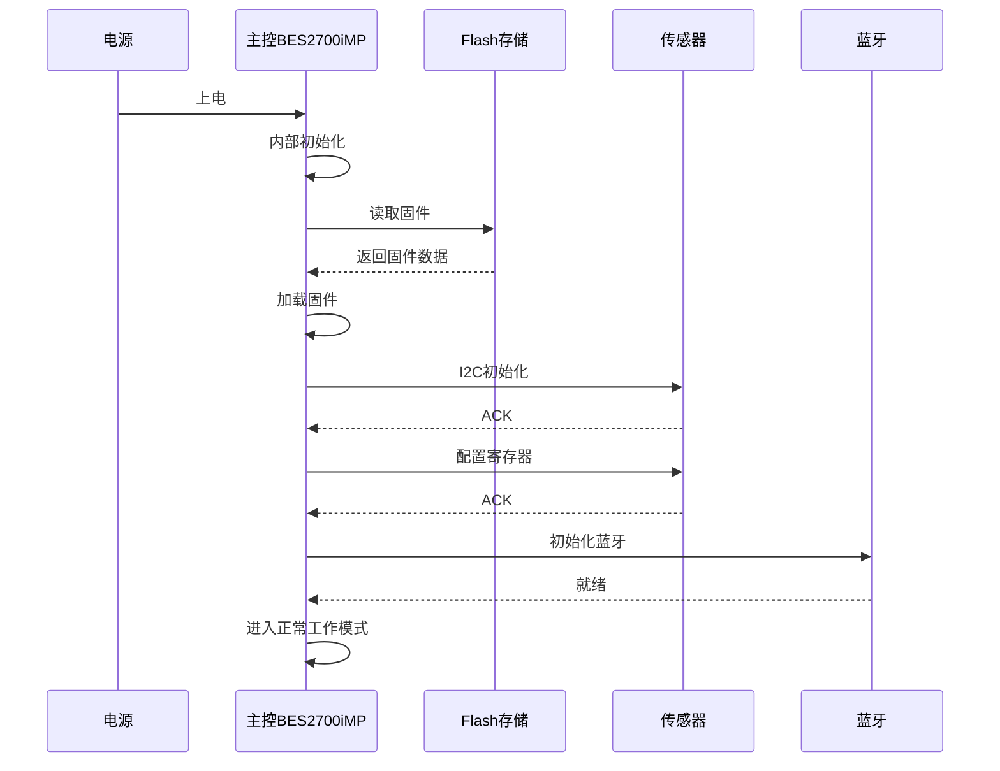
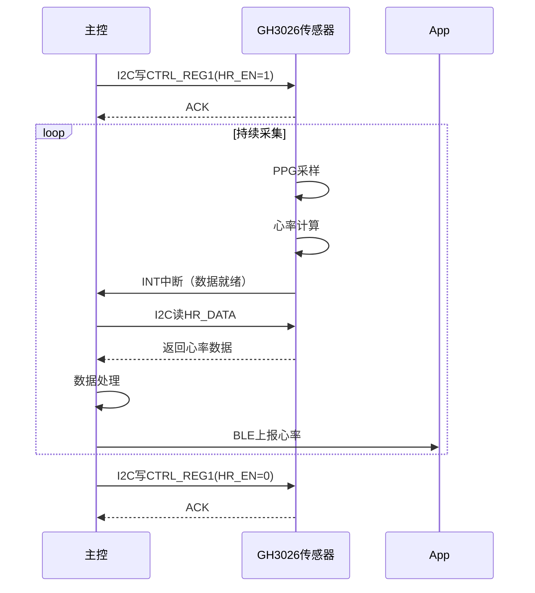
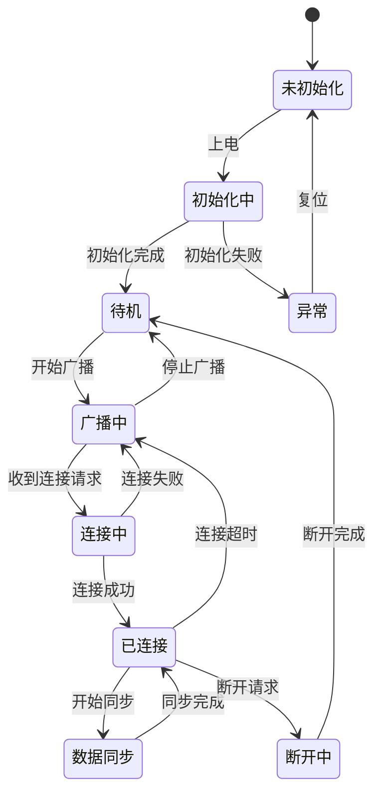
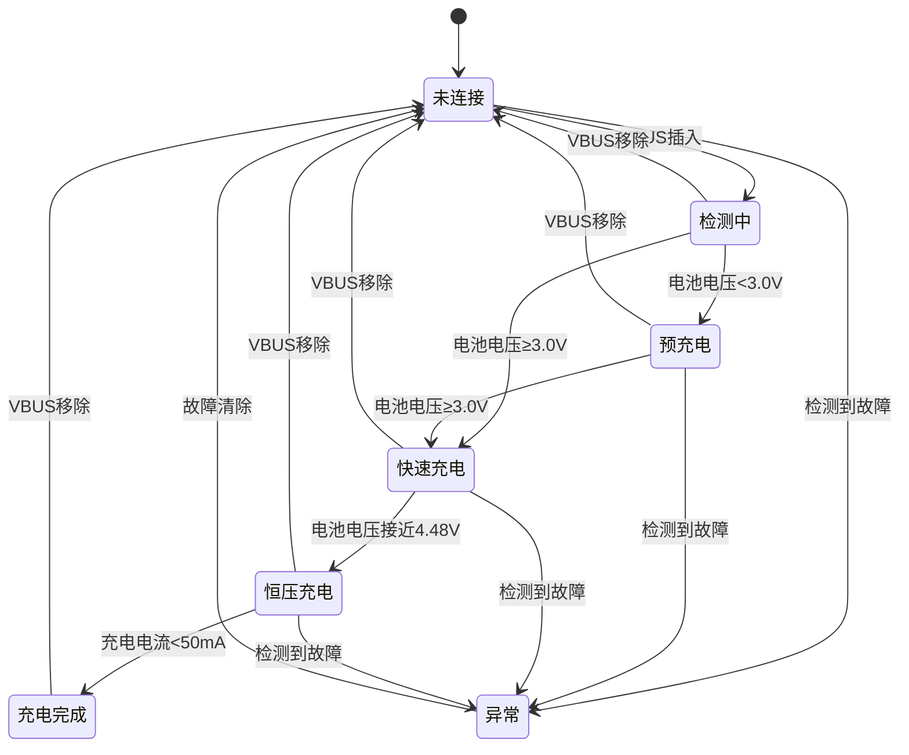

# 小米手环 9 陶瓷版 接口控制文档 (ICD)

---

## I. 物理层定义

### 1.1 接口分配总表

**[事实]** 基于HRS文档确认的接口分配：

| 接口类型 | 主控引脚 | 连接对象 | 通讯协议 | 速率/频率 | 用途 |
|----------|----------|----------|----------|-----------|------|
| I2C0 | SDA0/SCL0 | GH3026心率传感器 | I2C | 400kHz | 心率/血氧数据 |
| I2C0 | SDA0/SCL0 | 六轴陀螺仪 | I2C | 400kHz | 运动数据 |
| I2C1 | SDA1/SCL1 | SY6103充电管理 | I2C | 100kHz | 充电状态 |
| I2C1 | SDA1/SCL1 | 触控IC | I2C | 400kHz | 触控数据 |
| I2C1 | SDA1/SCL1 | NFC芯片 | I2C | 400kHz | NFC通讯 |
| SPI0 | MOSI/MISO/SCK/CS | GD5F2GM7REYIG | SPI | 104MHz | Flash存储 |
| SPI1 | MOSI/MISO/SCK/CS | AMOLED屏幕 | SPI/MIPI | 60Hz刷新 | 显示数据 |
| UART0 | TX/RX | 调试接口 | UART | 115200bps | 调试日志 |
| GPIO | 多个引脚 | LED/马达/检测 | GPIO | - | 控制信号 |
| RF | ANT | 蓝牙天线 | RF | 2.4GHz | 无线通讯 |

### 1.2 GPIO详细分配

**[推理]** 基于功能需求和硬件设计规范：

| GPIO编号 | 信号名 | 方向 | 电气特性 | 功能描述 |
|----------|--------|------|----------|----------|
| GPIO0 | MOTOR_PWM | 输出 | 3.3V TTL | 马达PWM驱动 |
| GPIO1 | LED_R | 输出 | 3.3V TTL | 红色LED控制 |
| GPIO2 | LED_G | 输出 | 3.3V TTL | 绿色LED控制 |
| GPIO3 | CHG_DET | 输入 | 3.3V TTL | 充电检测 |
| GPIO4 | VBAT_SENSE | 输入 | ADC | 电池电压检测 |
| GPIO5 | INT_TOUCH | 输入 | 3.3V TTL，下降沿 | 触控中断 |
| GPIO6 | INT_HR | 输入 | 3.3V TTL，下降沿 | 心率中断 |
| GPIO7 | INT_MOTION | 输入 | 3.3V TTL，下降沿 | 运动中断 |
| GPIO8 | SCREEN_RST | 输出 | 3.3V TTL | 屏幕复位 |
| GPIO9 | SCREEN_CS | 输出 | 3.3V TTL | 屏幕片选 |
| GPIO10 | FLASH_CS | 输出 | 3.3V TTL | Flash片选 |
| GPIO11 | SENSOR_EN | 输出 | 3.3V TTL | 传感器使能 |
| GPIO12 | NFC_EN | 输出 | 3.3V TTL | NFC使能 |

### 1.3 电气特性定义

**[推理]** 基于BES2700iMP芯片特性和3.3V系统设计：

| 参数 | 规格 | 说明 |
|------|------|------|
| 逻辑电平（高） | VIH ≥ 0.7×VDD (≥2.31V) | 3.3V系统 |
| 逻辑电平（低） | VIL ≤ 0.3×VDD (≤0.99V) | 3.3V系统 |
| 输出高电平 | VOH ≥ VDD-0.4V (≥2.9V) | IO输出 |
| 输出低电平 | VOL ≤ 0.4V | IO输出 |
| 输入漏电流 | ILEAK ≤ 1μA | 高阻态 |
| 输出驱动电流 | IOH/IOL ≤ 8mA | 单引脚 |
| 上拉电阻 | 内置20kΩ~50kΩ | 可配置 |
| 下拉电阻 | 内置20kΩ~50kΩ | 可配置 |

### 1.4 中断配置

**[推理]** 基于功能需求的中断配置：

| 中断源 | 触发类型 | 优先级 | 响应时间 | 功能 |
|--------|----------|--------|----------|------|
| INT_TOUCH | 下降沿 | 高 | <1ms | 触摸事件 |
| INT_HR | 下降沿 | 高 | <10ms | 心率异常/佩戴检测 |
| INT_MOTION | 下降沿 | 中 | <10ms | 步数/运动识别 |
| CHG_DET | 双边沿 | 中 | <100ms | 充电状态变化 |
| RTC_ALARM | 电平 | 低 | <1s | 闹钟/定时器 |
| BLE_EVENT | 电平 | 中 | <10ms | 蓝牙事件 |

---

## II. 通讯协议规范

### 2.1 I2C总线协议

#### 2.1.1 I2C总线配置

**[事实]** I2C总线参数：

| 参数 | 规格 |
|------|------|
| 总线频率 | 100kHz（标准）/ 400kHz（快速） |
| 地址模式 | 7-bit地址 |
| 数据格式 | 大端模式（MSB First） |
| 应答机制 | ACK/NACK |

#### 2.1.2 I2C设备地址分配

**[关联]** 基于芯片Datasheet和HRS文档：

| 设备 | I2C地址（7-bit） | R/W位 | 总线 | 说明 |
|------|------------------|-------|------|------|
| GH3026心率传感器 | 0x5C | 0xB8/0xB9 | I2C0 | 心率/血氧 |
| 六轴陀螺仪（BMI270） | 0x68 | 0xD0/0xD1 | I2C0 | 加速度/陀螺仪 |
| 六轴陀螺仪（备选地址） | 0x69 | 0xD2/0xD3 | I2C0 | SDO拉高时 |
| SY6103充电管理 | 0x6A | 0xD4/0xD5 | I2C1 | 充电状态 |
| 触控IC | **[推理]** 0x38 | 0x70/0x71 | I2C1 | 触控数据 |
| NFC芯片 | **[推理]** 0x28 | 0x50/0x51 | I2C1 | NFC通讯 |

#### 2.1.3 I2C时序参数

**[推理]** 基于I2C标准规范：

| 参数 | 快速模式（400kHz） | 标准模式（100kHz） |
|------|-------------------|-------------------|
| SCL频率 | ≤400kHz | ≤100kHz |
| 起始条件保持时间 | ≥0.6μs | ≥4.0μs |
| 时钟低电平时间 | ≥1.3μs | ≥4.7μs |
| 时钟高电平时间 | ≥0.6μs | ≥4.0μs |
| 数据建立时间 | ≥100ns | ≥250ns |
| 数据保持时间 | ≥0ns | ≥0ns |
| 停止条件建立时间 | ≥0.6μs | ≥4.0μs |

#### 2.1.4 I2C读写时序

```
                    I2C写时序图
    
    主机:  ┌───┐   ┌────────────────────────────┐   ┌───┐
    SDA:   │START│  │ SLAVE_ADDR+W │ ACK │ DATA │ ACK │STOP │
           └───┘   └────────────────────────────┘   └───┘
                  ┌───┬───┬───┬───┬───┬───┬───┬───┐
    SCL:          │   │   │   │   │   │   │   │   │
                  └───┴───┴───┴───┴───┴───┴───┴───┘
    
                    I2C读时序图
    
    主机:  ┌───┐   ┌─────────────────┐   ┌──────────────┐   ┌───┐
    SDA:   │START│  │ SLAVE_ADDR+R │ ACK │ DATA │ NACK │STOP │
           └───┘   └─────────────────┘   └──────────────┘   └───┘
                  ┌───┬───┬───┬───┬───┬───┬───┬───┐
    SCL:          │   │   │   │   │   │   │   │   │
                  └───┴───┴───┴───┴───┴───┴───┴───┘
```

### 2.2 SPI总线协议

#### 2.2.1 SPI总线配置

**[事实]** SPI总线参数：

| 参数 | 规格 |
|------|------|
| 总线频率 | 最高104MHz |
| 数据宽度 | 8-bit |
| 时钟极性（CPOL） | 0（空闲低电平） |
| 时钟相位（CPHA） | 0（第一边沿采样） |
| 数据顺序 | MSB First |
| 片选方式 | 硬件CS控制 |

#### 2.2.2 SPI Flash接口

**[事实]** GD5F2GM7REYIG Flash规格：

| 参数 | 规格 |
|------|------|
| 容量 | 256MB（2Gb） |
| 接口 | SPI（1/1/1或1/1/4模式） |
| 最高频率 | 104MHz |
| 页大小 | 2048字节 |
| 块大小 | 128KB |
| 擦除次数 | 100,000次 |

**[关联]** Flash指令集：

| 指令 | 操作码 | 说明 |
|------|--------|------|
| READ | 0x03 | 标准读取 |
| FAST_READ | 0x0B | 快速读取 |
| READ_DUAL | 0x3B | 双线读取 |
| READ_QUAD | 0x6B | 四线读取 |
| PAGE_PROGRAM | 0x02 | 页编程 |
| SECTOR_ERASE | 0xD8 | 扇区擦除 |
| BLOCK_ERASE | 0xD8 | 块擦除 |
| CHIP_ERASE | 0xC7 | 全片擦除 |
| WRITE_ENABLE | 0x06 | 写使能 |
| WRITE_DISABLE | 0x04 | 写禁止 |
| READ_STATUS | 0x0F | 读状态寄存器 |
| READ_ID | 0x9F | 读器件ID |

### 2.3 UART协议

#### 2.3.1 UART配置

**[推理]** 调试串口参数：

| 参数 | 规格 |
|------|------|
| 波特率 | 115200bps |
| 数据位 | 8-bit |
| 停止位 | 1-bit |
| 校验位 | 无 |
| 流控 | 无 |

#### 2.3.2 UART帧格式

```
                    UART帧格式
    
    空闲:  ─────────────────────────────────────────────>
    
    帧:    ┌───┬───┬───┬───┬───┬───┬───┬───┬───┬───┐
           │ST │D0 │D1 │D2 │D3 │D4 │D5 │D6 │D7 │SP │
           └───┴───┴───┴───┴───┴───┴───┴───┴───┴───┘
            ↑                                       ↑
          起始位(0)                              停止位(1)
    
    ST = 起始位（低电平）
    D0-D7 = 数据位
    SP = 停止位（高电平）
```

### 2.4 蓝牙协议

#### 2.4.1 蓝牙配置

**[事实]** 蓝牙规格：

| 参数 | 规格 |
|------|------|
| 蓝牙版本 | Bluetooth 5.4 |
| 工作频率 | 2402-2480MHz |
| 调制方式 | GFSK |
| 最大功率 | ≤14dBm |
| 通信模式 | BLE + 经典蓝牙双模 |

#### 2.4.2 BLE连接参数

**[推理]** 基于BLE标准：

| 参数 | 规格 |
|------|------|
| 连接间隔 | 7.5ms-4s（自适应） |
| 从机延迟 | 0-500ms |
| 监督超时 | 4s-20s |
| MTU大小 | 20-247字节 |
| 数据长度扩展 | 支持 |

#### 2.4.3 BLE GATT服务定义

**[推理]** 基于小米手环功能需求：

| 服务 | UUID | 说明 |
|------|------|------|
| Device Information | 0x180A | 设备信息 |
| Battery Service | 0x180F | 电池服务 |
| Heart Rate Service | 0x180D | 心率服务 |
| Xiaomi Custom Service | **[推理]** 0xFEE0 | 小米自定义服务 |
| Notification Service | **[推理]** 0xFEE1 | 通知服务 |
| Sensor Service | **[推理]** 0xFEE2 | 传感器服务 |

---

## III. 寄存器/指令集映射

### 3.1 GH3026心率传感器寄存器

#### 3.1.1 寄存器地址映射

**[推理]** 基于GH3026功能需求：

| 寄存器地址 | 名称 | 读/写 | 复位值 | 说明 |
|------------|------|-------|--------|------|
| 0x00 | DEVICE_ID | R | 0x26 | 器件ID |
| 0x01 | CTRL_REG1 | R/W | 0x00 | 控制寄存器1 |
| 0x02 | CTRL_REG2 | R/W | 0x00 | 控制寄存器2 |
| 0x03 | INT_CTRL | R/W | 0x00 | 中断控制 |
| 0x04 | HR_CONFIG | R/W | 0x03 | 心率配置 |
| 0x05 | SPO2_CONFIG | R/W | 0x03 | 血氧配置 |
| 0x06 | LED_CURRENT | R/W | 0x1F | LED电流配置 |
| 0x07 | SAMPLE_RATE | R/W | 0x64 | 采样率配置 |
| 0x08 | INT_STATUS | R | 0x00 | 中断状态 |
| 0x09 | HR_DATA_H | R | 0x00 | 心率数据高字节 |
| 0x0A | HR_DATA_L | R | 0x00 | 心率数据低字节 |
| 0x0B | SPO2_DATA | R | 0x00 | 血氧数据 |
| 0x0C | HRV_DATA | R | 0x00 | HRV数据 |
| 0x0D | WEAR_STATUS | R | 0x00 | 佩戴状态 |

#### 3.1.2 控制寄存器定义

**CTRL_REG1 (0x01) - 控制寄存器1：**

```
| Bit 7 | Bit 6 | Bit 5 | Bit 4 | Bit 3 | Bit 2 | Bit 1 | Bit 0 |
|-------|-------|-------|-------|-------|-------|-------|-------|
|  SOFT_RESET | RESERVED  | HR_EN | SPO2_EN| RESERVED    | MODE[1:0]    |
|   R/W |   R   |  R/W  |  R/W  |   R   |   R   |  R/W  |  R/W  |
|-------|-------|-------|-------|-------|-------|-------|-------|
|  0    |   0   |   0   |   0   |   0   |   0   |   0   |   0   |

Bit 7 - SOFT_RESET: 软复位（写1触发复位）
Bit 5 - HR_EN: 心率使能（0=禁用，1=使能）
Bit 4 - SPO2_EN: 血氧使能（0=禁用，1=使能）
Bit[1:0] - MODE: 工作模式（00=待机，01=单次，10=连续，11=保留）
```

**INT_CTRL (0x03) - 中断控制寄存器：**

```
| Bit 7 | Bit 6 | Bit 5 | Bit 4 | Bit 3 | Bit 2 | Bit 1 | Bit 0 |
|-------|-------|-------|-------|-------|-------|-------|-------|
|   RESERVED   | HR_INT_EN| SPO2_INT| WEAR_INT| DATA_RDY| INT_POL| INT_EN |
|   R   |   R   |  R/W  |  R/W  |  R/W  |  R/W  |  R/W  |  R/W  |
|-------|-------|-------|-------|-------|-------|-------|-------|
|   0   |   0   |   0   |   0   |   0   |   0   |   0   |   0   |

Bit 5 - HR_INT_EN: 心率异常中断使能
Bit 4 - SPO2_INT_EN: 血氧异常中断使能
Bit 3 - WEAR_INT_EN: 佩戴检测中断使能
Bit 2 - DATA_RDY_EN: 数据就绪中断使能
Bit 1 - INT_POL: 中断极性（0=低有效，1=高有效）
Bit 0 - INT_EN: 全局中断使能
```

**INT_STATUS (0x08) - 中断状态寄存器：**

```
| Bit 7 | Bit 6 | Bit 5 | Bit 4 | Bit 3 | Bit 2 | Bit 1 | Bit 0 |
|-------|-------|-------|-------|-------|-------|-------|-------|
|   RESERVED   | HR_INT | SPO2_INT| WEAR_INT| DATA_RDY| RESERVED| FIFO_OV|
|   R   |   R   |   R   |   R   |   R   |   R   |   R   |   R   |
|-------|-------|-------|-------|-------|-------|-------|-------|
|   0   |   0   |   0   |   0   |   0   |   0   |   0   |   0   |

Bit 5 - HR_INT: 心率异常中断标志
Bit 4 - SPO2_INT: 血氧异常中断标志
Bit 3 - WEAR_INT: 佩戴状态变化标志
Bit 2 - DATA_RDY: 数据就绪标志
Bit 0 - FIFO_OV: FIFO溢出标志
```

### 3.2 六轴陀螺仪寄存器

#### 3.2.1 寄存器地址映射

**[推理]** 基于BMI270规格：

| 寄存器地址 | 名称 | 读/写 | 复位值 | 说明 |
|------------|------|-------|--------|------|
| 0x00 | CHIP_ID | R | 0x24 | 芯片ID |
| 0x01 | ERR_REG | R | 0x00 | 错误寄存器 |
| 0x02 | STATUS | R | 0x00 | 状态寄存器 |
| 0x03 | ACC_DATA_X_L | R | 0x00 | 加速度X低字节 |
| 0x04 | ACC_DATA_X_H | R | 0x00 | 加速度X高字节 |
| 0x05 | ACC_DATA_Y_L | R | 0x00 | 加速度Y低字节 |
| 0x06 | ACC_DATA_Y_H | R | 0x00 | 加速度Y高字节 |
| 0x07 | ACC_DATA_Z_L | R | 0x00 | 加速度Z低字节 |
| 0x08 | ACC_DATA_Z_H | R | 0x00 | 加速度Z高字节 |
| 0x09 | GYR_DATA_X_L | R | 0x00 | 陀螺仪X低字节 |
| 0x0A | GYR_DATA_X_H | R | 0x00 | 陀螺仪X高字节 |
| 0x0B | GYR_DATA_Y_L | R | 0x00 | 陀螺仪Y低字节 |
| 0x0C | GYR_DATA_Y_H | R | 0x00 | 陀螺仪Y高字节 |
| 0x0D | GYR_DATA_Z_L | R | 0x00 | 陀螺仪Z低字节 |
| 0x0E | GYR_DATA_Z_H | R | 0x00 | 陀螺仪Z高字节 |
| 0x0F | TEMP_DATA_L | R | 0x00 | 温度低字节 |
| 0x10 | TEMP_DATA_H | R | 0x00 | 温度高字节 |
| 0x11 | INT_STATUS_0 | R | 0x00 | 中断状态0 |
| 0x12 | INT_STATUS_1 | R | 0x00 | 中断状态1 |
| 0x7C | CMD | W | - | 命令寄存器 |
| 0x7D | PWR_CONF | R/W | 0x00 | 电源配置 |
| 0x7E | PWR_CTRL | R/W | 0x00 | 电源控制 |

#### 3.2.2 电源控制寄存器

**PWR_CTRL (0x7E) - 电源控制寄存器：**

```
| Bit 7 | Bit 6 | Bit 5 | Bit 4 | Bit 3 | Bit 2 | Bit 1 | Bit 0 |
|-------|-------|-------|-------|-------|-------|-------|-------|
|   RESERVED   | TEMP_EN|  AUX_EN|  GYR_EN|  ACC_EN|   RESERVED   |
|   R   |   R   |  R/W  |  R/W  |  R/W  |  R/W  |   R   |   R   |
|-------|-------|-------|-------|-------|-------|-------|-------|
|   0   |   0   |   0   |   0   |   0   |   0   |   0   |   0   |

Bit 4 - TEMP_EN: 温度传感器使能
Bit 3 - AUX_EN: 辅助传感器使能
Bit 2 - GYR_EN: 陀螺仪使能
Bit 1 - ACC_EN: 加速度计使能
```

### 3.3 充电管理芯片寄存器

#### 3.3.1 寄存器地址映射

**[推理]** 基于SY6103功能需求：

| 寄存器地址 | 名称 | 读/写 | 复位值 | 说明 |
|------------|------|-------|--------|------|
| 0x00 | STATUS_REG | R | 0x00 | 状态寄存器 |
| 0x01 | CTRL_REG1 | R/W | 0x4C | 控制寄存器1 |
| 0x02 | CTRL_REG2 | R/W | 0x00 | 控制寄存器2 |
| 0x03 | CHG_CURRENT | R/W | 0x0F | 充电电流设置 |
| 0x04 | CHG_VOLTAGE | R/W | 0x2C | 充电电压设置 |
| 0x05 | INPUT_LIMIT | R/W | 0x05 | 输入限流 |
| 0x06 | VBAT_READ_L | R | 0x00 | 电池电压低字节 |
| 0x07 | VBAT_READ_H | R | 0x00 | 电池电压高字节 |
| 0x08 | TEMP_READ | R | 0x00 | 温度读数 |

#### 3.3.2 状态寄存器定义

**STATUS_REG (0x00) - 状态寄存器：**

```
| Bit 7 | Bit 6 | Bit 5 | Bit 4 | Bit 3 | Bit 2 | Bit 1 | Bit 0 |
|-------|-------|-------|-------|-------|-------|-------|-------|
|   RESERVED   | CHG_OK | CHG_FAULT| CHG_STAT[1:0]| VBUS_OK|   RESERVED   |
|   R   |   R   |   R   |   R   |   R   |   R   |   R   |   R   |
|-------|-------|-------|-------|-------|-------|-------|-------|
|   0   |   0   |   0   |   0   |   0   |   0   |   0   |   0   |

Bit 5 - CHG_OK: 充电完成标志
Bit 4 - CHG_FAULT: 充电故障标志
Bit[3:2] - CHG_STAT: 充电状态（00=未充电，01=预充，10=快充，11=充电完成）
Bit 1 - VBUS_OK: VBUS存在标志
```

### 3.4 系统控制指令

#### 3.4.1 系统控制命令

**[推理]** 基于BES2700iMP主控功能：

| 命令码 | 名称 | 参数 | 说明 |
|--------|------|------|------|
| 0x01 | SYS_RESET | - | 系统复位 |
| 0x02 | SYS_SLEEP | mode | 进入睡眠模式 |
| 0x03 | SYS_WAKEUP | - | 唤醒系统 |
| 0x04 | GET_VERSION | - | 获取固件版本 |
| 0x05 | GET_STATUS | - | 获取系统状态 |
| 0x06 | SET_TIME | time[4] | 设置系统时间 |
| 0x07 | GET_TIME | - | 获取系统时间 |
| 0x08 | SET_CONFIG | cfg_id, value | 设置配置 |
| 0x09 | GET_CONFIG | cfg_id | 获取配置 |
| 0x0A | ENTER_DFU | - | 进入DFU模式 |

#### 3.4.2 传感器控制命令

| 命令码 | 名称 | 参数 | 说明 |
|--------|------|------|------|
| 0x10 | HR_START | mode | 启动心率监测 |
| 0x11 | HR_STOP | - | 停止心率监测 |
| 0x12 | HR_GET_DATA | - | 获取心率数据 |
| 0x13 | SPO2_START | mode | 启动血氧监测 |
| 0x14 | SPO2_STOP | - | 停止血氧监测 |
| 0x15 | SPO2_GET_DATA | - | 获取血氧数据 |
| 0x16 | MOTION_START | mode | 启动运动监测 |
| 0x17 | MOTION_STOP | - | 停止运动监测 |
| 0x18 | MOTION_GET_DATA | - | 获取运动数据 |
| 0x19 | SLEEP_START | - | 启动睡眠监测 |
| 0x1A | SLEEP_STOP | - | 停止睡眠监测 |
| 0x1B | SLEEP_GET_DATA | - | 获取睡眠数据 |

#### 3.4.3 外设控制命令

| 命令码 | 名称 | 参数 | 说明 |
|--------|------|------|------|
| 0x20 | MOTOR_VIBRATE | pattern, duration | 马达振动 |
| 0x21 | MOTOR_STOP | - | 停止振动 |
| 0x22 | LED_SET | color, mode | 设置LED状态 |
| 0x23 | LED_OFF | - | 关闭LED |
| 0x24 | SCREEN_ON | - | 开启屏幕 |
| 0x25 | SCREEN_OFF | - | 关闭屏幕 |
| 0x26 | SCREEN_SET_BRIGHT | brightness | 设置亮度 |
| 0x27 | NFC_START | - | 启动NFC |
| 0x28 | NFC_STOP | - | 停止NFC |

---

## IV. 数据帧格式定义

### 4.1 蓝牙数据帧格式

#### 4.1.1 通用数据帧格式

**[推理]** 基于BLE通信需求：

```
| 字节偏移 |  0   |  1   |  2   |  3   |  4   | ...  |  N-1 |   N  |
|----------|------|------|------|------|------|------|------|------|
|   字段   | HEAD | CMD  | LEN  |   DATA[0] ... DATA[N-4]   | CRC  | TAIL |
|   长度   |  1   |  1   |  1   |        N-4 字节           |  1   |  1   |

HEAD: 帧头（0xAA）
CMD: 命令字
LEN: 数据长度（不含帧头帧尾）
DATA: 数据内容
CRC: 校验和（所有字节异或）
TAIL: 帧尾（0x55）
```

#### 4.1.2 心率数据帧

```
| 字节偏移 |  0   |  1   |  2   |  3   |  4   |  5   |  6   |  7   |  8   |
|----------|------|------|------|------|------|------|------|------|------|
|   字段   | HEAD | CMD  | LEN  | HR_H | HR_L | HRV  | CONF | TIME | CRC  |
|   内容   | 0xAA | 0x10 | 0x05 | 心率高字节| 心率低字节| HRV值| 置信度| 时间戳| 校验 |

CMD = 0x10: 心率数据上报
HR_H/HR_L: 心率值（BPM），范围30-220
HRV: 心率变异性指标，范围0-100
CONF: 数据置信度，范围0-100（百分比）
TIME: 相对时间戳（秒）
```

#### 4.1.3 血氧数据帧

```
| 字节偏移 |  0   |  1   |  2   |  3   |  4   |  5   |  6   |  7   |
|----------|------|------|------|------|------|------|------|------|
|   字段   | HEAD | CMD  | LEN  | SPO2 | CONF | TIME | CRC  | TAIL |
|   内容   | 0xAA | 0x11 | 0x04 | 血氧值| 置信度| 时间戳| 校验 | 0x55 |

CMD = 0x11: 血氧数据上报
SPO2: 血氧饱和度（%），范围70-100
CONF: 数据置信度，范围0-100（百分比）
```

#### 4.1.4 运动数据帧

```
| 字节偏移 |  0   |  1   |  2   |  3-4 |  5-6 |  7-8 |  9   |  10  |  11  |
|----------|------|------|------|------|------|------|------|------|------|
|   字段   | HEAD | CMD  | LEN  | STEPS| DIST | CAL  | TIME | CRC  | TAIL |
|   内容   | 0xAA | 0x12 | 0x08 | 步数 | 距离 | 卡路里| 时间 | 校验 | 0x55 |

CMD = 0x12: 运动数据上报
STEPS: 步数（2字节，小端）
DIST: 距离（米，2字节，小端）
CAL: 卡路里（kcal，2字节，小端）
```

### 4.2 传感器数据格式

#### 4.2.1 加速度数据格式

```
| 字节偏移 |  0   |  1   |  2   |  3   |  4   |  5   |
|----------|------|------|------|------|------|------|
|   字段   | ACC_X_L| ACC_X_H| ACC_Y_L| ACC_Y_H| ACC_Z_L| ACC_Z_H|
|   说明   | X轴低字节| X轴高字节| Y轴低字节| Y轴高字节| Z轴低字节| Z轴高字节|

数据格式：16位有符号整数，小端模式
量程：±2g / ±4g / ±8g / ±16g（可配置）
灵敏度：±2g时，16384 LSB/g
计算公式：加速度(g) = ACC_DATA / 灵敏度
```

#### 4.2.2 陀螺仪数据格式

```
| 字节偏移 |  0   |  1   |  2   |  3   |  4   |  5   |
|----------|------|------|------|------|------|------|
|   字段   | GYR_X_L| GYR_X_H| GYR_Y_L| GYR_Y_H| GYR_Z_L| GYR_Z_H|
|   说明   | X轴低字节| X轴高字节| Y轴低字节| Y轴高字节| Z轴低字节| Z轴高字节|

数据格式：16位有符号整数，小端模式
量程：±125~±2000°/s（可配置）
灵敏度：±125°/s时，262.4 LSB/(°/s)
计算公式：角速度(°/s) = GYR_DATA / 灵敏度
```

---

## V. 时序与状态机

### 5.1 系统初始化时序



### 5.2 心率数据采集时序



### 5.3 蓝牙连接状态机



### 5.4 充电状态机



### 5.5 I2C读写时序图

```
                    I2C写寄存器时序
    
    主机:    ┌─────┐ ┌───────────────────────────────┐ ┌─────┐
    SDA:     │START│ │ADDR+W│ACK│REG│ACK│DATA│ACK│STOP│
             └─────┘ └───────────────────────────────┘ └─────┘
    
    从机:            │      │   │    │   │    │   │    │
    SDA:             │      └───┘    └───┘    └───┘    │
                     │                                 │
    SCL:   ────┐ ┌───┐ ┌───┐ ┌───┐ ┌───┐ ┌───┐ ┌───┐ ┌───┐
              └─┘   └─┘   └─┘   └─┘   └─┘   └─┘   └─┘   └─┘
              1   2   3   4   5   6   7   8   9   10  11  12
    
    1: 起始条件
    2-9: 地址+W（7位地址+写位）
    10: ACK
    11-18: 寄存器地址
    19: ACK
    20-27: 数据
    28: ACK
    29: 停止条件
    
    
                    I2C读寄存器时序
    
    主机:    ┌─────┐ ┌─────────────────────┐ ┌─────┐ ┌─────────────┐ ┌─────┐
    SDA:     │START│ │ADDR+W│ACK│REG│ACK│STOP│ │START│ │ADDR+R│ACK│DATA│NACK│STOP│
             └─────┘ └─────────────────────┘ └─────┘ └─────────────┘ └─────┘
    
    说明：
    1. 写入寄存器地址
    2. 重复起始条件
    3. 发送地址+读位
    4. 读取数据
    5. 发送NACK
    6. 停止条件
```

---

## VI. 附录

### 6.1 术语表

| 术语 | 全称 | 说明 |
|------|------|------|
| I2C | Inter-Integrated Circuit | 两线式串行总线 |
| SPI | Serial Peripheral Interface | 串行外设接口 |
| UART | Universal Asynchronous Receiver Transmitter | 通用异步收发器 |
| GPIO | General Purpose Input/Output | 通用输入输出 |
| BLE | Bluetooth Low Energy | 低功耗蓝牙 |
| GATT | Generic Attribute Profile | 通用属性协议 |
| MTU | Maximum Transmission Unit | 最大传输单元 |
| ACK | Acknowledge | 应答信号 |
| NACK | Not Acknowledge | 非应答信号 |
| MSB | Most Significant Bit | 最高有效位 |
| LSB | Least Significant Bit | 最低有效位 |

### 6.2 参考文档

1. 小米手环9陶瓷版深度产品调研报告
2. 产品需求文档-PRD
3. 硬件需求说明书-HRS
4. BES2700iMP芯片技术规格书
5. GH3026传感器数据手册
6. BMI270传感器数据手册
7. SY6103充电管理芯片数据手册
8. GD5F2GM7REYIG Flash数据手册


---

> **声明**：本文档基于小米手环9陶瓷版深度产品调研报告、产品需求文档-PRD、硬件需求说明书-HRS生成，所有标注[事实]的内容直接引用自参考文档，标注[关联]的内容基于芯片Datasheet推导，标注[推理]的内容基于行业经验和功能需求补全。
