# 小米手环 9 陶瓷版 软件需求规格书 (SRS)


---

## I. 软件架构设计

### 1.1 系统架构概述

小米手环9陶瓷版采用基于RTOS的嵌入式软件架构，运行于BES2700iMP双核处理器平台。系统采用分层设计，从底层驱动到应用层清晰分离，支持低功耗运行和实时响应。

**[事实]** 系统基本配置：

| 参数 | 规格 |
|------|------|
| 操作系统 | RTOS（实时操作系统） |
| 处理器 | 双STAR-MC1内核 |
| 内存 | 16MB PSRAM |
| 存储 | 256MB NAND Flash |
| 固件大小 | **[推理]** 约40MB |

### 1.2 软件分层架构

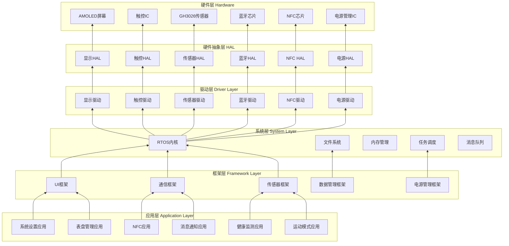

### 1.3 任务优先级定义

**[推理]** 基于RTOS实时性要求：

| 优先级 | 任务名称 | 功能 | 响应时间 | 周期 |
|--------|----------|------|----------|------|
| 1（最高） | 中断服务程序 | 硬件中断处理 | <1ms | 事件触发 |
| 2 | 传感器采集任务 | 心率/运动数据采集 | <10ms | 10ms-1s |
| 3 | 蓝牙通信任务 | BLE数据收发 | <10ms | 事件触发 |
| 4 | 电源管理任务 | 电量监控/低功耗管理 | <100ms | 1s |
| 5 | UI渲染任务 | 界面刷新 | <16ms | 16.7ms |
| 6 | 数据存储任务 | 数据持久化 | <100ms | 事件触发 |
| 7 | 后台同步任务 | App数据同步 | <1s | 事件触发 |
| 8（最低） | 空闲任务 | 系统空闲处理 | - | - |

### 1.4 内存管理

**[推理]** 基于16MB PSRAM资源分配：

| 内存区域 | 大小 | 用途 |
|----------|------|------|
| 系统内核 | 约512KB | RTOS内核、任务栈 |
| 显示缓存 | 约200KB | 双帧缓存（192×490×2） |
| 传感器缓存 | 约100KB | 传感器数据缓冲 |
| 蓝牙缓存 | 约50KB | BLE数据缓冲 |
| 应用内存 | 约2MB | 应用程序运行 |
| 数据缓存 | 约1MB | 历史数据缓存 |
| 预留 | 约12MB | 表盘/资源加载 |

### 1.5 文件系统

**[推理]** 基于Flash存储资源：

| 分区 | 大小 | 文件系统 | 用途 |
|------|------|----------|------|
| 系统分区 | 约40MB | 只读 | 固件、系统资源 |
| 应用分区 | 约30MB | 只读 | 内置应用 |
| 表盘分区 | 约100MB | 可读写 | 表盘、主题 |
| 数据分区 | 约50MB | 可读写 | 用户数据、日志 |
| 保留分区 | 约36MB | - | OTA升级、备份 |

---

## II. 功能模块定义

### 2.1 系统启动模块

#### 2.1.1 启动流程

**[事实]** 开机方式：
- 首次使用：连接充电器自动开机
- 关机后开机：连接充电座自动开机

**[推理]** 启动流程：

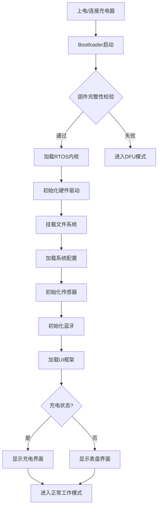

#### 2.1.2 上电自检（POST）

**[推理]** 自检项目：

| 检测项 | 检测内容 | 失败处理 |
|--------|----------|----------|
| Flash完整性 | 读取固件CRC校验 | 进入DFU模式 |
| 内存检测 | PSRAM读写测试 | 显示错误提示 |
| 传感器检测 | I2C设备响应检测 | 禁用相关功能 |
| 电池检测 | 电压/温度检测 | 低电量警告 |
| 屏幕检测 | 显示测试图案 | 记录错误日志 |

### 2.2 电源管理模块

#### 2.2.1 电源状态定义

**[推理]** 基于PRD功耗模式定义：

| 状态 | 说明 | 功耗 | 进入条件 | 退出条件 |
|------|------|------|----------|----------|
| 正常工作 | 全功能运行 | 15-25mA | 用户交互 | 无操作30秒 |
| 省电模式 | 降低屏幕亮度 | 1-2mA | 无操作30秒 | 抬腕/触摸 |
| AOD模式 | 屏幕常亮显示 | 5-8mA | 用户开启 | 用户关闭 |
| 深度休眠 | 仅RTC运行 | 0.5-1mA | 无操作5分钟 | 抬腕/触摸 |
| 关机 | 完全断电 | <10μA | 用户操作/低电量 | 连接充电器 |

#### 2.2.2 低电量管理

**[关联]** 基于ICD中电池电压检测：

| 电量等级 | 阈值 | 行为 |
|----------|------|------|
| 电量充足 | >20% | 正常工作 |
| 电量偏低 | 15-20% | 显示低电量图标 |
| 电量警告 | 10-15% | 显示警告，限制功能 |
| 电量临界 | 5-10% | 仅显示时间，关闭传感器 |
| 电量耗尽 | <5% | 自动关机前保存数据 |

**[推理]** 低电量处理流程：

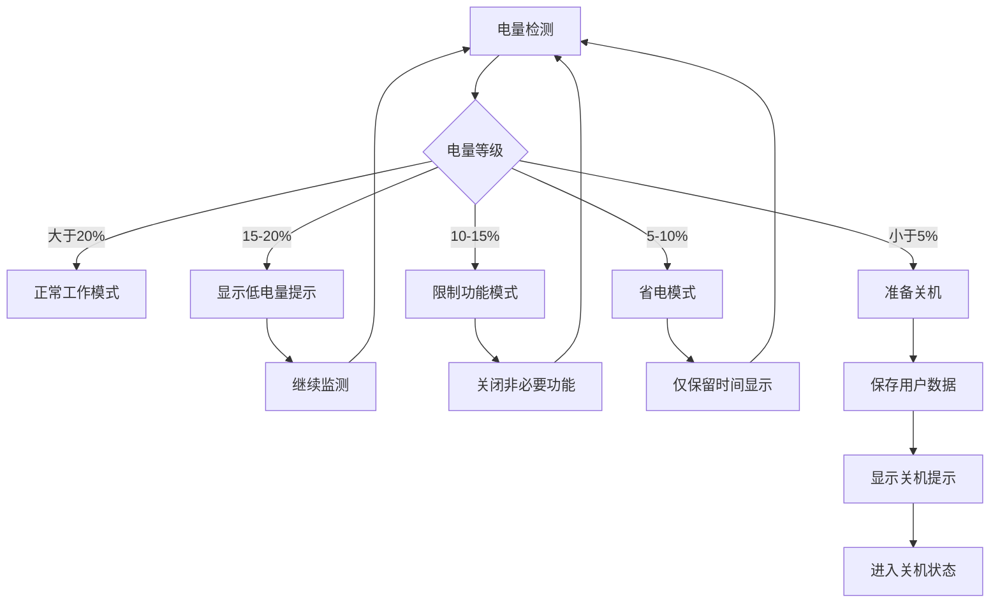

### 2.3 健康监测模块

#### 2.3.1 心率监测功能

**[事实]** 功能需求：
- 24小时心率监测（静息心率、运动心率）
- 心率异常提醒（房颤预警）
- 双灯PPG传感器，准确度提升16%

**[关联]** 基于ICD中GH3026寄存器定义：

| 功能 | 软件实现 | 对应寄存器/命令 |
|------|----------|-----------------|
| 启动心率监测 | 配置采样频率、使能中断 | CTRL_REG1.HR_EN=1 |
| 读取心率数据 | 读取数据寄存器 | HR_DATA_H/L |
| 心率异常检测 | 算法分析心率变异性 | HRV_DATA |
| 佩戴检测 | 检测佩戴状态 | WEAR_STATUS |
| 中断处理 | 响应数据就绪中断 | INT_STATUS.DATA_RDY |

**[推理]** 心率监测软件流程：

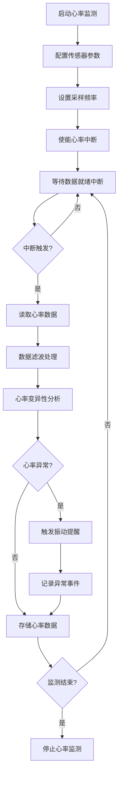

#### 2.3.2 血氧监测功能

**[事实]** 功能需求：
- 全天血氧饱和度监测
- 安静状态下每10分钟检测一次
- SpO2<90%时振动提醒

**[推理]** 血氧监测软件实现：

| 功能 | 软件实现 | 说明 |
|------|----------|------|
| 定时检测 | 设置10分钟定时器 | 安静状态检测 |
| 数据采集 | 读取SpO2数据寄存器 | 红光+红外双波长 |
| 阈值判断 | SpO2<90%触发提醒 | 异常检测 |
| 数据存储 | 保存血氧历史数据 | 用于趋势分析 |

#### 2.3.3 睡眠监测功能

**[事实]** 功能需求：
- 识别入睡、浅睡、深睡、REM快速眼动期
- 细分7个睡眠阶段
- 误判率比前代降低40%

**[推理]** 睡眠监测算法流程：

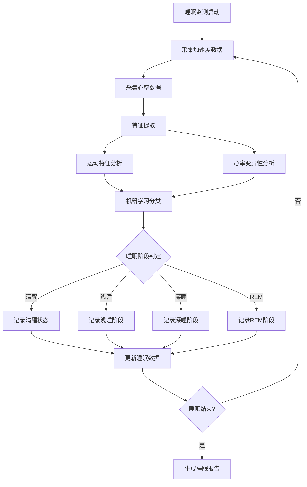

### 2.4 运动模式模块

#### 2.4.1 运动识别功能

**[事实]** 功能需求：
- 支持150+种运动模式
- 自动识别6种运动

**[推理]** 运动识别算法：

| 运动类型 | 识别特征 | 准确率要求 |
|----------|----------|------------|
| 步行 | 低频加速度变化 | >90% |
| 跑步 | 高频加速度变化 | >90% |
| 骑行 | 特定频率模式 | >85% |
| 游泳 | 水下运动特征 | >85% |
| 跳绳 | 周期性跳跃 | >80% |
| 椭圆机 | 特定运动模式 | >80% |

#### 2.4.2 运动数据采集

**[事实]** 功能需求：
- 运动时心率、速度、步频记录
- 最大摄氧量（VO2 Max）检测
- 运动恢复时间评估

**[推理]** 运动数据采集流程：

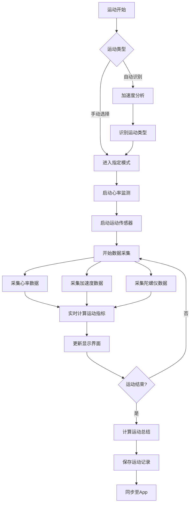

### 2.5 蓝牙通信模块

#### 2.5.1 蓝牙连接管理

**[事实]** 功能需求：
- 蓝牙版本：Bluetooth 5.4
- 支持BLE和经典蓝牙双模
- 支持双设备切换

**[推理]** 蓝牙连接状态机：

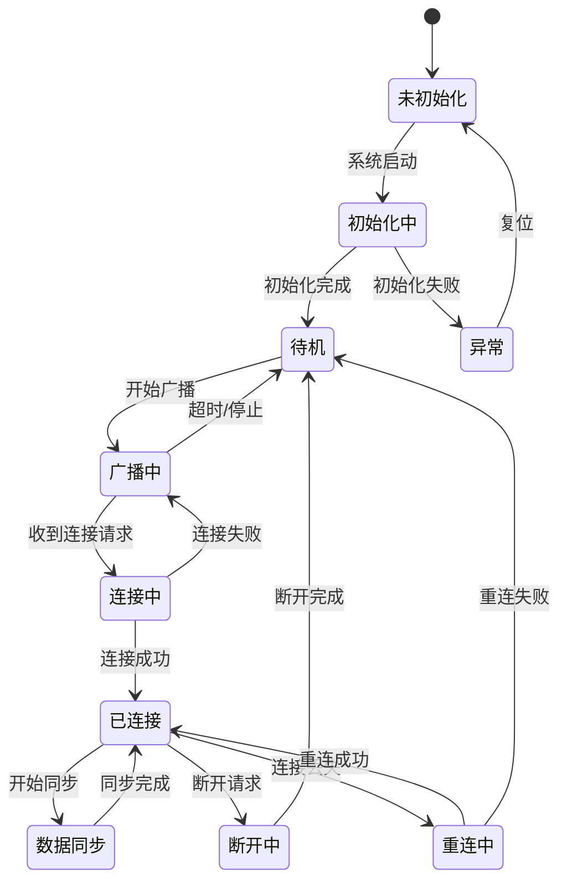

#### 2.5.2 数据同步协议

**[关联]** 基于ICD中蓝牙数据帧格式：

| 数据类型 | 同步频率 | 数据格式 | 说明 |
|----------|----------|----------|------|
| 心率数据 | 实时 | CMD=0x10 | 心率值+HRV+置信度 |
| 血氧数据 | 实时 | CMD=0x11 | 血氧值+置信度 |
| 运动数据 | 实时 | CMD=0x12 | 步数+距离+卡路里 |
| 睡眠数据 | 每日 | CMD=0x13 | 睡眠阶段+时长 |
| 系统状态 | 按需 | CMD=0x14 | 电量+状态+时间 |
| 配置数据 | 双向 | CMD=0x15 | 设置项同步 |

#### 2.5.3 重连机制

**[推理]** 基于BLE标准的重连策略：

| 场景 | 重连策略 | 超时时间 |
|------|----------|----------|
| 短暂断连 | 立即重连 | 30秒 |
| 超出范围 | 指数退避重连 | 5分钟 |
| App主动断开 | 不自动重连 | - |
| 设备重启 | 等待App连接 | - |

### 2.6 NFC功能模块

#### 2.6.1 NFC卡片管理

**[事实]** 功能需求：
- 支持公交卡、门禁卡、车钥匙
- 覆盖全国320个城市
- 支付响应0.3秒

**[推理]** NFC卡片管理：

| 功能 | 软件实现 | 说明 |
|------|----------|------|
| 卡片添加 | 通过App写入 | 支持模拟和下载 |
| 卡片切换 | 自动匹配 | 根据读卡器类型 |
| 卡片删除 | 清除存储数据 | 释放存储空间 |
| 默认卡设置 | 优先使用 | 无需选择直接刷卡 |

#### 2.6.2 NFC刷卡流程

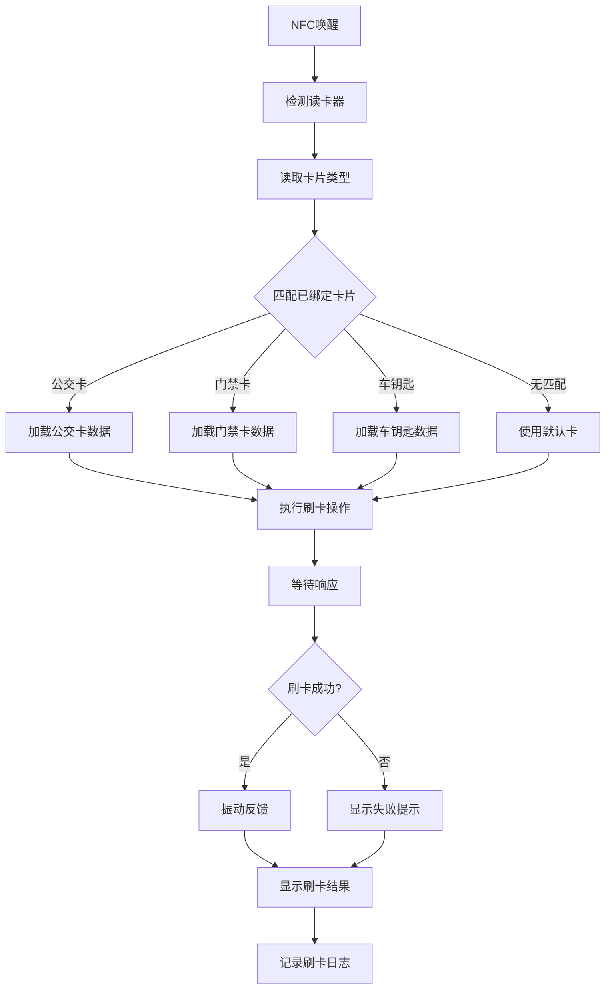

### 2.7 消息通知模块

#### 2.7.1 通知类型定义

**[事实]** 功能需求：
- 支持来电提醒、短信通知、消息推送

**[推理]** 通知类型处理：

| 通知类型 | 显示内容 | 振动模式 | 超时处理 |
|----------|----------|----------|----------|
| 来电 | 来电者姓名/号码 | 连续振动 | 挂断后停止 |
| 短信 | 发送者+内容预览 | 短振 | 30秒后消失 |
| 微信 | 发送者+消息内容 | 短振 | 30秒后消失 |
| QQ | 发送者+消息内容 | 短振 | 30秒后消失 |
| App通知 | 应用名+内容 | 短振 | 30秒后消失 |
| 系统通知 | 系统消息 | 短振 | 手动清除 |

#### 2.7.2 通知处理流程

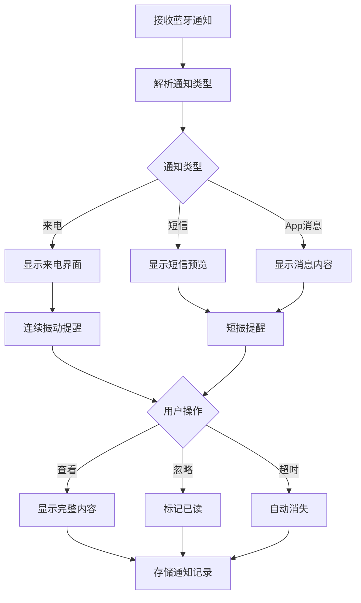

### 2.8 OTA升级模块

#### 2.8.1 OTA升级流程

**[推理]** 基于嵌入式OTA标准设计：

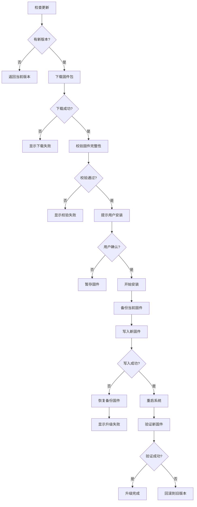

#### 2.8.2 OTA升级策略

**[推理]** 升级策略设计：

| 策略 | 说明 |
|------|------|
| 断点续传 | 下载中断后从断点继续 |
| 增量升级 | 仅下载差异部分 |
| 安全回滚 | 升级失败自动恢复 |
| 版本校验 | 防止降级攻击 |
| 电量检查 | 电量>30%才允许升级 |

### 2.9 表盘管理模块

#### 2.9.1 表盘存储结构

**[推理]** 表盘资源管理：

| 资源类型 | 格式 | 大小限制 |
|----------|------|----------|
| 背景图片 | PNG/JPG | <500KB |
| 时间字体 | TTF/位图 | <100KB |
| 数据组件 | 配置文件 | <10KB |
| 动画资源 | 帧序列 | <1MB |

#### 2.9.2 表盘切换流程

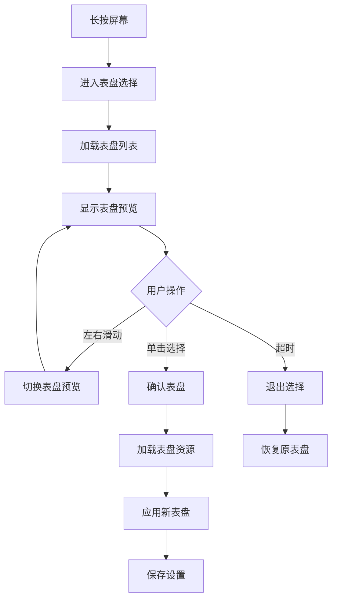

---

## III. 用户交互与状态机

### 3.1 全局状态机

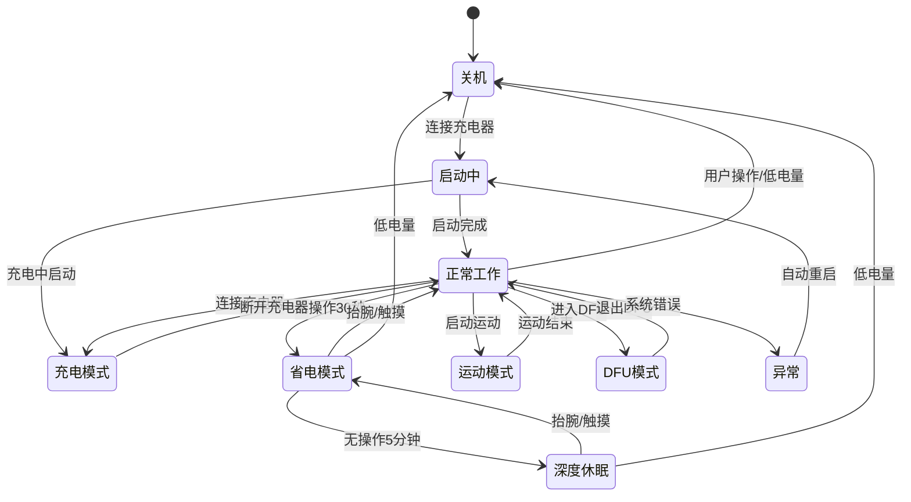

### 3.2 UI状态定义

**[推理]** UI状态层次：

| 状态层级 | 状态名称 | 说明 |
|----------|----------|------|
| L1 | 表盘界面 | 默认显示 |
| L2 | 功能菜单 | 功能入口 |
| L3 | 功能界面 | 具体功能 |
| L4 | 详情界面 | 数据详情 |
| L5 | 设置界面 | 参数配置 |

### 3.3 触控交互状态机

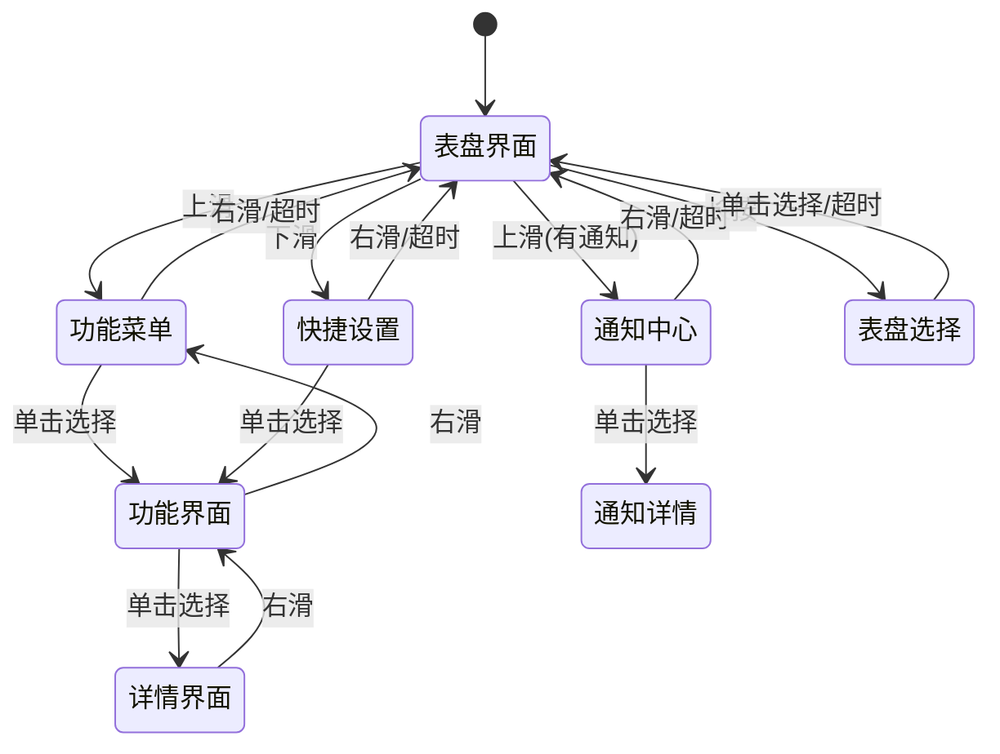

### 3.4 异常处理逻辑

#### 3.4.1 异常类型定义

**[推理]** 异常处理策略：

| 异常类型 | 检测方式 | 处理策略 |
|----------|----------|----------|
| 传感器故障 | I2C通信失败 | 禁用功能，显示提示 |
| 蓝牙断连 | 连接超时 | 自动重连，显示状态 |
| 低电量 | 电压检测 | 限制功能，提示充电 |
| 存储满 | 空间检测 | 清理缓存，提示用户 |
| 内存不足 | 内存监控 | 释放缓存，重启应用 |
| 系统崩溃 | 看门狗超时 | 自动重启 |
| 温度异常 | 温度传感器 | 显示警告，限制功能 |

#### 3.4.2 异常处理流程

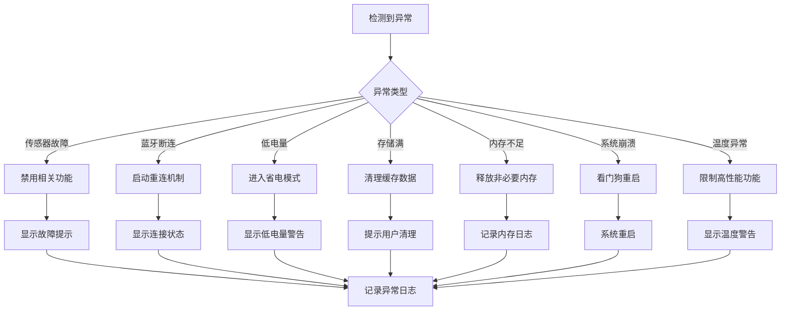

---

## IV. App端软件需求

### 4.1 App功能架构

**[事实]** App名称：小米运动健康App

**[推理]** App功能模块：

| 模块 | 功能 | 说明 |
|------|------|------|
| 设备管理 | 绑定/解绑设备 | 支持多设备管理 |
| 数据同步 | 健康数据同步 | 自动/手动同步 |
| 健康数据 | 心率/血氧/睡眠 | 数据展示与分析 |
| 运动记录 | 运动历史查看 | 详细运动数据 |
| 表盘商店 | 表盘下载管理 | 在线表盘资源 |
| 设置管理 | 设备设置同步 | 通知/提醒配置 |
| 固件升级 | OTA升级管理 | 版本检测与升级 |

### 4.2 App界面布局

#### 4.2.1 首页布局

```
    ┌─────────────────────────────────────────────────────────────┐
    │  状态栏                                                      │
    ├─────────────────────────────────────────────────────────────┤
    │                                                             │
    │   ┌─────────────────────────────────────────────────────┐   │
    │   │              设备状态卡片                            │   │
    │   │   ┌─────────┐                                      │   │
    │   │   │ 设备图标 │  小米手环9陶瓷版                     │   │
    │   │   │         │  电量: 85%  |  已连接                 │   │
    │   │   └─────────┘                                      │   │
    │   └─────────────────────────────────────────────────────┘   │
    │                                                             │
    │   ┌───────────────┐  ┌───────────────┐  ┌───────────────┐  │
    │   │    心率       │  │    血氧       │  │    睡眠       │  │
    │   │    72 BPM    │  │     98%      │  │   7h 30min    │  │
    │   │   正常范围    │  │   正常范围    │  │   睡眠质量    │  │
    │   └───────────────┘  └───────────────┘  └───────────────┘  │
    │                                                             │
    │   ┌─────────────────────────────────────────────────────┐   │
    │   │              今日运动                                │   │
    │   │   步数: 8,523    距离: 5.2km    卡路里: 320kcal    │   │
    │   │   ─────────────────────────────────────────────    │   │
    │   │   目标进度: ████████░░░░░░░░░░  85%                 │   │
    │   └─────────────────────────────────────────────────────┘   │
    │                                                             │
    │   ┌─────────────────────────────────────────────────────┐   │
    │   │              快捷功能                                │   │
    │   │   ┌─────┐  ┌─────┐  ┌─────┐  ┌─────┐  ┌─────┐     │   │
    │   │   │表盘 │  │运动 │  │NFC │  │设置 │  │更多 │     │   │
    │   │   └─────┘  └─────┘  └─────┘  └─────┘  └─────┘     │   │
    │   └─────────────────────────────────────────────────────┘   │
    │                                                             │
    ├─────────────────────────────────────────────────────────────┤
    │   首页    运动    发现    我的                              │
    └─────────────────────────────────────────────────────────────┘
```

#### 4.2.2 页面导航结构

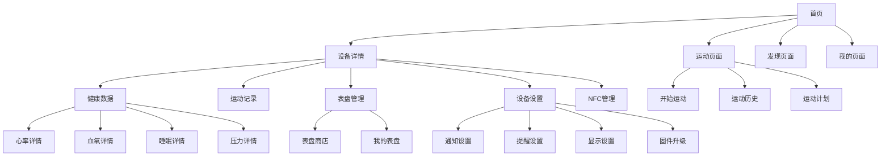

### 4.3 数据同步逻辑

#### 4.3.1 同步策略

**[推理]** 数据同步机制：

| 数据类型 | 同步方式 | 同步频率 | 冲突处理 |
|----------|----------|----------|----------|
| 实时数据 | 自动同步 | 实时 | 以设备为准 |
| 历史数据 | 增量同步 | 连接时 | 以时间戳为准 |
| 设置数据 | 双向同步 | 变更时 | 以最新为准 |
| 表盘数据 | 手动同步 | 用户操作 | 以App为准 |

#### 4.3.2 同步流程

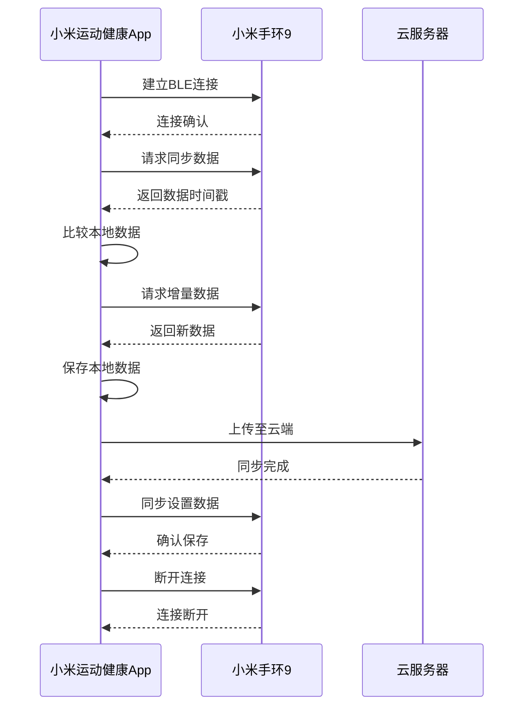

---

## V. 性能与约束

### 5.1 响应时间要求

**[事实]** 基于PRD响应时间定义：

| 操作 | 响应时间 | 说明 |
|------|----------|------|
| 触控响应 | <50ms | 单击/滑动操作 |
| 屏幕唤醒 | <50ms | 抬腕/触摸唤醒 |
| 心率数据更新 | <1s | 数据刷新周期 |
| 蓝牙连接 | <3s | 首次配对时间 |
| 数据同步 | <10s | 完整同步时间 |
| NFC刷卡 | <0.3s | 支付响应时间 |

### 5.2 资源约束

**[推理]** 软件资源限制：

| 资源 | 约束 | 说明 |
|------|------|------|
| 内存使用 | <12MB | 峰值内存占用 |
| CPU占用 | <80% | 正常工作状态 |
| 存储空间 | <200MB | 应用+数据 |
| 功耗 | <1mA | 待机功耗 |
| 任务数量 | <20 | 同时运行任务 |

### 5.3 安全要求

**[推理]** 软件安全设计：

| 安全项 | 要求 | 实现方式 |
|--------|------|----------|
| 数据加密 | AES-128 | 敏感数据加密存储 |
| 通信安全 | TLS 1.2+ | 网络通信加密 |
| 固件签名 | RSA-2048 | 固件完整性校验 |
| 用户认证 | OAuth 2.0 | App登录认证 |
| 隐私保护 | 数据脱敏 | 健康数据匿名化 |

---

## VI. 附录

### 6.1 术语表

| 术语 | 全称 | 说明 |
|------|------|------|
| RTOS | Real-Time Operating System | 实时操作系统 |
| HAL | Hardware Abstraction Layer | 硬件抽象层 |
| API | Application Programming Interface | 应用程序接口 |
| OTA | Over-The-Air | 空中升级 |
| BLE | Bluetooth Low Energy | 低功耗蓝牙 |
| GATT | Generic Attribute Profile | 通用属性协议 |
| POST | Power-On Self Test | 上电自检 |
| DFU | Device Firmware Update | 设备固件升级 |
| UI | User Interface | 用户界面 |
| UX | User Experience | 用户体验 |

### 6.2 参考文档

1. 小米手环9陶瓷版深度产品调研报告
2. 产品需求文档-PRD
3. 接口控制文档-ICD
4. BES2700iMP芯片技术规格书
5. Bluetooth 5.4核心规范


---

> **声明**：本文档基于小米手环9陶瓷版深度产品调研报告、产品需求文档-PRD、接口控制文档-ICD生成，所有标注[事实]的内容直接引用自参考文档，标注[关联]的内容基于接口定义推导，标注[推理]的内容基于行业经验和功能需求补全。
