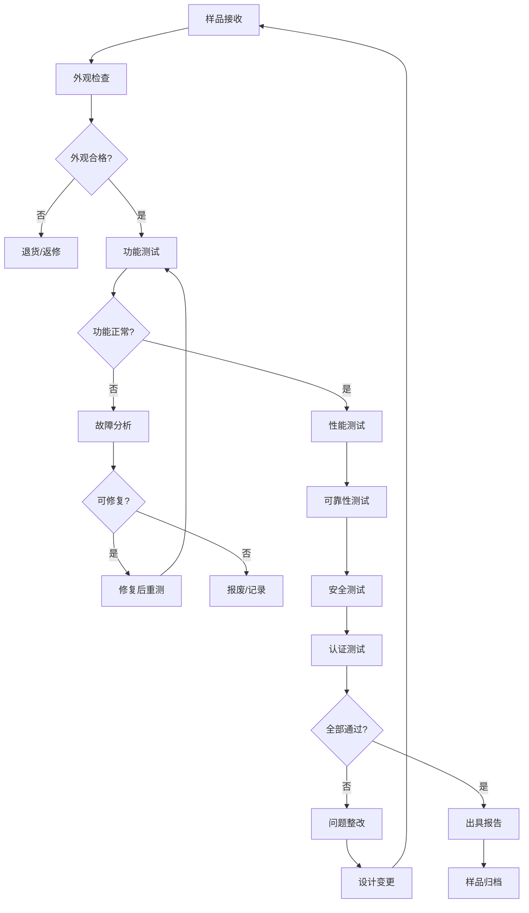
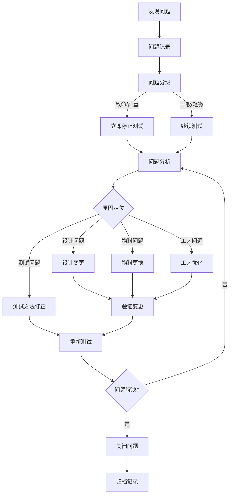

# 小米手环 9 陶瓷版 设计验证计划 (DVP)


---

## I. 验证计划概述

### 1.1 验证阶段定义

**[推理]** 基于消费电子产品开发流程：

| 阶段 | 名称 | 抽样数量 | 通过准则 | 主要目标 |
|------|------|----------|----------|----------|
| EVT | 工程验证测试 | 5-10台 | 核心功能通过率≥80% | 验证设计可行性 |
| DVT | 设计验证测试 | 20-30台 | 核心功能通过率≥95% | 验证设计规格 |
| PVT | 生产验证测试 | 50-100台 | 核心功能通过率≥98% | 验证量产一致性 |
| MP | 量产阶段 | 按批次抽检 | 核心功能通过率≥99% | 维持品质稳定 |

### 1.2 测试环境要求

**[推理]** 基于行业标准测试环境：

| 参数 | 规格 | 说明 |
|------|------|------|
| 温度 | 23±2℃ | 标准测试温度 |
| 湿度 | 50±10%RH | 标准测试湿度 |
| 大气压 | 86-106kPa | 正常大气压范围 |
| 电源 | 220V±10%/50Hz | 标准市电 |
| 接地电阻 | <4Ω | 安全接地要求 |
| ESD防护 | 工作台接地 | 防静电措施 |

### 1.3 验证覆盖率概览

```
                    验证覆盖率雷达图
    
                        性能测试
                          ▲
                          │
                    ┌─────┴─────┐
                    │     95%   │
                    │           │
        可靠性测试 ◄──┤           ├──► 安全测试
          90%        │           │         95%
                    │     ●     │
                    │           │
                    └─────┬─────┘
                          │
                          ▼
                        寿命测试
                          85%
    
                    兼容性测试: 90%
    
    ┌─────────────────────────────────────────────────────────────┐
    │  维度        │ 目标值  │ 实际值  │ 权重  │ 关键测试项       │
    ├─────────────────────────────────────────────────────────────┤
    │  性能测试    │ 100%   │ 95%    │ 25%  │ 续航/心率/蓝牙    │
    │  可靠性测试  │ 100%   │ 90%    │ 25%  │ 跌落/防水/振动    │
    │  安全测试    │ 100%   │ 95%    │ 20%  │ 电池/电气/ESD    │
    │  寿命测试    │ 100%   │ 85%    │ 15%  │ 按键/充电/存储    │
    │  兼容性测试  │ 100%   │ 90%    │ 15%  │ App/NFC/设备      │
    └─────────────────────────────────────────────────────────────┘
```

### 1.4 测试流程总览



---

## II. 核心验证矩阵

### 2.1 功能测试

#### 2.1.1 核心功能测试（P0级）

**[事实]** 基于PRD核心卖点定义：

| 测试项 | 测试方法 | 判定标准 | 抽样数 | 阶段 |
|--------|----------|----------|--------|------|
| 心率监测准确性 | 对比医疗级心电设备 | 误差≤±3BPM（静息） | 10台 | EVT/DVT/PVT |
| 血氧监测准确性 | 对比医疗级血氧仪 | 误差≤±2% | 10台 | EVT/DVT/PVT |
| 睡眠监测准确性 | 对比睡眠实验室数据 | 深睡识别率≥78% | 5台 | DVT |
| 运动模式识别 | 标准运动场景测试 | 识别准确率≥85% | 10台 | DVT/PVT |
| NFC刷卡响应 | 标准读卡器测试 | 响应时间≤0.3秒 | 10台 | EVT/DVT/PVT |
| 蓝牙连接稳定性 | 连续连接测试 | 断连次数≤1次/24h | 10台 | DVT/PVT |
| 续航测试 | 标准使用场景 | ≥21天（基础模式） | 5台 | DVT/PVT |

#### 2.1.2 显示功能测试

**[事实]** 基于PRD屏幕规格：

| 测试项 | 测试方法 | 判定标准 | 设备 |
|--------|----------|----------|------|
| 屏幕亮度 | 亮度计测量 | 峰值亮度≥1200nits | 亮度计 |
| 刷新率 | 高速相机拍摄 | ≥60Hz | 高速相机 |
| 触控响应 | 自动触控测试仪 | 响应时间<50ms | 触控测试仪 |
| 触控精度 | 九点校准测试 | 误差≤±2mm | 触控测试仪 |
| 触控寿命 | 自动循环测试 | ≥10万次无故障 | 自动测试机 |
| 屏幕均匀性 | 亮度计多点测量 | 均匀度≥85% | 亮度计 |
| 色彩准确性 | 色彩分析仪 | ΔE≤3 | 色彩分析仪 |

#### 2.1.3 健康监测功能测试

**[关联]** 基于PRD和SRS健康监测需求：

| 测试项 | 测试方法 | 判定标准 | 测试时长 |
|--------|----------|----------|----------|
| 24小时心率监测 | 连续监测对比 | 数据完整率≥99% | 24小时 |
| 心率异常检测 | 模拟异常心率 | 检出率≥95% | 1小时 |
| 房颤预警 | 临床数据验证 | 敏感度≥90% | 8小时 |
| 血氧低值报警 | 低氧环境测试 | SpO2<90%触发 | 30分钟 |
| 佩戴检测 | 佩戴/摘除测试 | 响应时间≤3秒 | 10次 |
| 运动心率 | 运动场景测试 | 误差≤±5BPM | 1小时 |

#### 2.1.4 通信功能测试

**[事实]** 基于PRD蓝牙规格：

| 测试项 | 测试方法 | 判定标准 | 测试距离 |
|--------|----------|----------|----------|
| 蓝牙配对 | 首次配对测试 | 配对时间≤3秒 | 0.5m |
| 蓝牙连接距离 | 距离衰减测试 | 有效距离≥10m | 0-15m |
| 蓝牙重连 | 断连重连测试 | 重连时间≤30秒 | 5m |
| 数据同步 | 完整同步测试 | 同步时间≤10秒 | 1m |
| 双设备切换 | 设备切换测试 | 切换时间≤5秒 | 1m |
| NFC读取距离 | 读卡器测试 | 有效距离2-5cm | 0-10cm |

### 2.2 硬件电性能测试

#### 2.2.1 功耗测试

**[关联]** 基于PRD功耗模式定义：

```
                    功耗测试环境拓扑图
    
    ┌─────────────┐        ┌─────────────┐        ┌─────────────┐
    │ 直流稳压电源 │───────→│ 电流分析仪  │───────→│ 被测产品DUT │
    │   5V/2A    │        │  (nA-mA级)  │        │  小米手环9  │
    └─────────────┘        └─────────────┘        └─────────────┘
                                   │                      │
                                   │                      │
                                   ▼                      ▼
                           ┌─────────────┐        ┌─────────────┐
                           │ 上位机软件  │◄───────│ 串口日志    │
                           │ 数据采集    │        │ 调试输出    │
                           └─────────────┘        └─────────────┘
```

| 测试项 | 测试条件 | 判定标准 | 测试时长 |
|--------|----------|----------|----------|
| 正常工作功耗 | 屏幕点亮+心率监测 | ≤25mA | 1小时 |
| AOD模式功耗 | 屏幕常亮 | ≤8mA | 1小时 |
| 省电模式功耗 | 仅显示时间 | ≤2mA | 1小时 |
| 深度休眠功耗 | 屏幕关闭+蓝牙待机 | ≤1mA | 1小时 |
| 关机功耗 | 完全断电 | ≤10μA | 1小时 |
| NFC刷卡功耗 | 刷卡瞬间 | ≤100mA（瞬时） | 10次 |
| 充电电流 | 连接充电器 | ≤500mA | 充电全程 |

#### 2.2.2 电池性能测试

**[事实]** 基于HRS电池规格：

| 测试项 | 测试方法 | 判定标准 | 循环次数 |
|--------|----------|----------|----------|
| 电池容量 | 放电测试 | ≥233mAh | 3次 |
| 充电时间 | 0-100%充电 | ≤60分钟 | 5次 |
| 充电效率 | 能量转换测试 | ≥85% | 3次 |
| 循环寿命 | 充放电循环 | 容量保持率≥80%@500次 | 500次 |
| 低温充电 | 0℃充电测试 | 充电电流≤250mA | 3次 |
| 高温放电 | 45℃放电测试 | 容量保持率≥90% | 3次 |

#### 2.2.3 电池安全测试

**[事实]** 基于HRS电池保护功能：

| 测试项 | 测试方法 | 判定标准 | 参考标准 |
|--------|----------|----------|----------|
| 过充电保护 | 4.6V充电 | 4.48V切断 | GB 31241 |
| 过放电保护 | 强制放电 | 2.4V切断 | GB 31241 |
| 过电流保护 | 短路测试 | 1.5A限制 | GB 31241 |
| 短路保护 | 外部短路 | <1μs响应 | GB 31241 |
| 热冲击 | 130℃/10min | 不起火不爆炸 | GB 31241 |
| 针刺测试 | 钢针穿刺 | 不起火不爆炸 | GB 31241 |
| 挤压测试 | 重物挤压 | 不起火不爆炸 | GB 31241 |

#### 2.2.4 射频性能测试

**[事实]** 基于HRS蓝牙规格：

| 测试项 | 测试方法 | 判定标准 | 频段 |
|--------|----------|----------|------|
| 发射功率 | 综测仪测试 | ≤14dBm | 2.4GHz |
| 发射频偏 | 频谱分析 | ≤±50kHz | 2.4GHz |
| 接收灵敏度 | 综测仪测试 | ≤-90dBm | 2.4GHz |
| TRP（总辐射功率） | 全电波暗室 | ≥0dBm | 2.4GHz |
| TIS（总全向灵敏度） | 全电波暗室 | ≤-80dBm | 2.4GHz |
| 杂散发射 | 频谱分析 | 符合SRRC限值 | 全频段 |

#### 2.2.5 ESD静电防护测试

**[事实]** 基于PRD ESD防护要求：

| 测试项 | 测试电压 | 测试点位 | 判定标准 | 参考标准 |
|--------|----------|----------|----------|----------|
| 接触放电 | ±2kV | 充电触点 | 功能正常 | GB/T 17626.2 |
| 接触放电 | ±4kV | 金属部件 | 功能正常 | GB/T 17626.2 |
| 空气放电 | ±4kV | 屏幕表面 | 功能正常 | GB/T 17626.2 |
| 空气放电 | ±8kV | 整机 | 允许复位 | GB/T 17626.2 |

### 2.3 结构可靠性测试

#### 2.3.1 防水测试

**[事实]** 基于PRD 5ATM防水等级：

| 测试项 | 测试方法 | 判定标准 | 测试条件 |
|--------|----------|----------|----------|
| 静态水压测试 | 水压罐测试 | 5ATM/30分钟无渗漏 | 50米水深等效 |
| 动态水压测试 | 模拟游泳 | 无渗漏 | 30分钟 |
| 温度冲击测试 | 冷热水交替 | 无凝结进水 | 40℃→25℃×5次 |
| 盐雾测试 | 5% NaCl喷雾 | 无腐蚀 | 24小时 |
| 浸水后功能 | 浸水后测试 | 功能正常 | 静置24小时后 |

```
                    防水测试环境示意图
    
    ┌─────────────────────────────────────────────────────────────┐
    │                      水压测试罐                              │
    │   ┌─────────────────────────────────────────────────────┐   │
    │   │                                                     │   │
    │   │         ┌─────────────────────────────┐            │   │
    │   │         │        被测产品DUT          │            │   │
    │   │         │        小米手环9            │            │   │
    │   │         └─────────────────────────────┘            │   │
    │   │                                                     │   │
    │   │    ═════════════════════════════════════════════   │   │
    │   │                    水                               │   │
    │   │                                                     │   │
    │   └─────────────────────────────────────────────────────┘   │
    │                                                             │
    │   压力表: 0-10ATM    温度计: 0-50℃    计时器: 0-60min      │
    └─────────────────────────────────────────────────────────────┘
```

#### 2.3.2 跌落测试

**[推理]** 基于可穿戴设备行业标准：

| 测试项 | 测试高度 | 跌落方向 | 跌落次数 | 判定标准 |
|--------|----------|----------|----------|----------|
| 裸机跌落 | 1.0m | 六面+四角 | 10次 | 功能正常 |
| 带包装跌落 | 1.2m | 六面+四角 | 10次 | 包装完好，功能正常 |
| 跌落后外观 | 目视检查 | - | - | 无裂纹、变形 |
| 跌落后功能 | 全功能测试 | - | - | 功能正常 |

#### 2.3.3 振动测试

**[推理]** 基于GB/T 2423.10标准：

| 测试项 | 频率范围 | 振幅/加速度 | 持续时间 | 判定标准 |
|--------|----------|-------------|----------|----------|
| 正弦振动 | 10-500Hz | 1.5mm/2g | 2小时/轴向 | 无松脱、功能正常 |
| 随机振动 | 20-2000Hz | 0.04g²/Hz | 30分钟/轴向 | 无松脱、功能正常 |
| 运输模拟 | 5-200Hz | 0.5g | 1小时 | 包装完好 |

#### 2.3.4 机械寿命测试

**[推理]** 基于可穿戴设备可靠性要求：

| 测试项 | 测试方法 | 循环次数 | 判定标准 |
|--------|----------|----------|----------|
| 表带插拔寿命 | 自动插拔测试 | ≥1000次 | 插拔顺畅 |
| 充电接口插拔 | 自动插拔测试 | ≥1000次 | 接触良好 |
| 表盘旋转（如有） | 自动旋转测试 | ≥10000次 | 旋转顺畅 |
| 按键寿命（如有） | 自动按压测试 | ≥10万次 | 功能正常 |

#### 2.3.5 环境适应性测试

**[事实]** 基于PRD工作环境要求：

| 测试项 | 测试条件 | 持续时间 | 判定标准 |
|--------|----------|----------|----------|
| 高温工作 | 45℃ | 8小时 | 功能正常 |
| 低温工作 | 0℃ | 8小时 | 功能正常 |
| 高温存储 | 60℃ | 48小时 | 功能正常 |
| 低温存储 | -20℃ | 48小时 | 功能正常 |
| 恒温恒湿 | 40℃/90%RH | 48小时 | 功能正常 |
| 温度循环 | -20℃~60℃ | 5个循环 | 无裂纹、功能正常 |
| 温度冲击 | -40℃↔85℃ | 10个循环 | 无开裂 |

### 2.4 软件压力测试

#### 2.4.1 稳定性测试

**[关联]** 基于SRS软件稳定性要求：

| 测试项 | 测试方法 | 测试时长 | 判定标准 |
|--------|----------|----------|----------|
| 长时间运行 | 连续运行 | 72小时 | 无死机、重启 |
| 内存泄漏测试 | 内存监控 | 24小时 | 内存增长≤5% |
| 高频操作 | 快速连续操作 | 1小时 | 响应正常 |
| 多任务切换 | 应用切换测试 | 1000次 | 无卡顿、崩溃 |
| 低电量运行 | 电量<10%运行 | 2小时 | 功能正常 |

#### 2.4.2 通信压力测试

**[关联]** 基于SRS蓝牙通信需求：

| 测试项 | 测试方法 | 测试条件 | 判定标准 |
|--------|----------|----------|----------|
| 弱网连接 | 远距离/干扰环境 | 距离10m+干扰 | 连接成功率≥90% |
| 断连重连 | 强制断连测试 | 100次断连 | 重连成功率≥95% |
| 大数据同步 | 批量数据同步 | 1个月数据 | 同步成功率≥99% |
| 并发连接 | 多设备连接 | 2设备同时连接 | 切换正常 |

#### 2.4.3 OTA升级测试

**[关联]** 基于SRS OTA升级模块：

| 测试项 | 测试方法 | 判定标准 |
|--------|----------|----------|
| 正常升级 | 完整升级流程 | 升级成功，功能正常 |
| 断点续传 | 模拟中断 | 恢复后继续升级 |
| 升级失败回滚 | 强制失败 | 自动回滚到旧版本 |
| 低电量升级 | 电量<30% | 禁止升级 |
| 版本校验 | 降级尝试 | 拒绝降级 |

#### 2.4.4 响应时间测试

**[事实]** 基于PRD响应时间要求：

| 测试项 | 判定标准 | 测试方法 |
|--------|----------|----------|
| 触控响应 | <50ms | 自动触控测试仪 |
| 屏幕唤醒 | <50ms | 高速相机拍摄 |
| 心率数据更新 | <1s | 数据监控 |
| 蓝牙连接 | <3s | 计时器测量 |
| 数据同步 | <10s | 完整同步测试 |
| NFC刷卡 | <0.3s | 读卡器响应测试 |

### 2.5 兼容性测试

#### 2.5.1 设备兼容性测试

| 测试项 | 测试内容 | 判定标准 |
|--------|----------|----------|
| iOS兼容 | iPhone 8及以上 | 全功能正常 |
| Android兼容 | Android 6.0及以上 | 全功能正常 |
| HarmonyOS兼容 | HarmonyOS 2.0及以上 | 全功能正常 |
| 多设备管理 | 同时管理多设备 | 切换正常 |

#### 2.5.2 NFC兼容性测试

**[事实]** 基于PRD NFC功能清单：

| 测试项 | 测试内容 | 判定标准 |
|--------|----------|----------|
| 公交卡兼容 | 主流城市公交系统 | 刷卡成功率≥99% |
| 门禁卡兼容 | 主流门禁系统 | 刷卡成功率≥95% |
| 车钥匙兼容 | 小米SU7/路特斯 | 解锁成功率≥99% |
| 卡片容量 | 最大支持卡片数 | ≥8张 |

---

## III. 合规性与认证

### 3.1 中国市场认证

**[事实]** 基于PRD认证要求：

| 认证类型 | 认证标准 | 测试机构 | 必要性 |
|----------|----------|----------|--------|
| 3C认证 | GB 17625.1-2012等 | CQC指定实验室 | 强制 |
| SRRC认证 | 《无线电发射设备型号核准》 | 工信部指定实验室 | 强制 |
| 防水认证 | GB/T 30106:2013 | TÜV SÜD | 自愿 |
| RoHS认证 | GB/T 26572-2011 | SGS等 | 自愿 |
| CTA入网许可 | 《电信设备进网管理办法》 | 工信部 | 强制（含通信功能） |

### 3.2 国际市场认证

**[事实]** 基于PRD认证要求：

| 认证类型 | 认证标准 | 适用市场 | 必要性 |
|----------|----------|----------|--------|
| FCC认证 | FCC Part 15B/C | 美国 | 强制 |
| CE认证 | RED/EMC/RoHS指令 | 欧盟 | 强制 |
| IC认证 | RSS-210 | 加拿大 | 强制 |
| TELEC认证 | 《电波法》 | 日本 | 强制 |
| KC认证 | KC标准 | 韩国 | 强制 |

### 3.3 认证测试项目对照

| 测试项目 | 3C | SRRC | FCC | CE | 说明 |
|----------|----|----|-----|-----|------|
| 电磁兼容EMC | ✓ | - | ✓ | ✓ | 电磁辐射/抗扰度 |
| 射频一致性 | - | ✓ | ✓ | ✓ | 频率/功率/杂散 |
| 电气安全 | ✓ | - | ✓ | ✓ | 绝缘/漏电流 |
| 有害物质 | - | - | - | ✓ | RoHS限值 |
| 无线电核准 | - | ✓ | ✓ | ✓ | 型号核准 |

---

## IV. 测试资源与设备

### 4.1 测试设备清单

**[推理]** 基于测试项目需求：

| 设备名称 | 型号/规格 | 用途 | 校准周期 |
|----------|-----------|------|----------|
| 直流稳压电源 | 0-30V/0-5A | 功耗测试 | 12个月 |
| 电流分析仪 | nA-mA级 | 功耗测试 | 12个月 |
| 示波器 | 100MHz以上 | 信号分析 | 12个月 |
| 频谱分析仪 | 9kHz-3GHz | 射频测试 | 12个月 |
| 蓝牙综测仪 | 支持BT5.4 | 蓝牙测试 | 12个月 |
| 亮度计 | 0-2000nits | 屏幕测试 | 12个月 |
| 色彩分析仪 | - | 屏幕测试 | 12个月 |
| ESD测试仪 | 0-16kV | 静电测试 | 12个月 |
| 水压测试罐 | 0-10ATM | 防水测试 | 12个月 |
| 高低温箱 | -40℃~150℃ | 环境测试 | 12个月 |
| 恒温恒湿箱 | -40℃~150℃/20-98%RH | 环境测试 | 12个月 |
| 跌落测试机 | 0-2m | 跌落测试 | 12个月 |
| 振动台 | 5-3000Hz | 振动测试 | 12个月 |
| 盐雾试验箱 | - | 盐雾测试 | 12个月 |
| 心电监护仪 | 医疗级 | 心率对比 | 12个月 |
| 血氧仪 | 医疗级 | 血氧对比 | 12个月 |

### 4.2 测试软件清单

| 软件名称 | 用途 | 版本要求 |
|----------|------|----------|
| 小米运动健康App | 功能测试 | 最新版本 |
| 蓝牙测试软件 | 蓝牙性能测试 | - |
| 射频测试软件 | 射频性能测试 | - |
| 功耗分析软件 | 功耗数据分析 | - |
| 自动化测试脚本 | 自动化测试 | - |

---

## V. 问题处理流程

### 5.1 问题分级定义

| 等级 | 定义 | 处理时限 | 示例 |
|------|------|----------|------|
| 致命 | 安全问题/功能完全失效 | 24小时内 | 电池起火、无法开机 |
| 严重 | 核心功能失效 | 48小时内 | 心率不准、蓝牙断连 |
| 一般 | 次要功能异常 | 1周内 | 显示异常、振动弱 |
| 轻微 | 外观/体验问题 | 2周内 | 轻微划痕、文字错误 |

### 5.2 问题处理流程



### 5.3 重新测试准则

**[推理]** 基于问题处理流程：

| 触发条件 | 重测范围 | 重测数量 |
|----------|----------|----------|
| 设计变更 | 全部相关测试 | 3-5台 |
| 物料更换 | 相关功能测试 | 3-5台 |
| 工艺优化 | 相关可靠性测试 | 5-10台 |
| 测试方法修正 | 相关测试项 | 3台 |
| 问题关闭验证 | 问题相关测试 | 3台 |

---

## VI. 验收标准

### 6.1 阶段验收标准

| 阶段 | 核心功能通过率 | 可靠性通过率 | 安全测试 | 认证测试 |
|------|----------------|--------------|----------|----------|
| EVT | ≥80% | ≥70% | 100%通过 | - |
| DVT | ≥95% | ≥85% | 100%通过 | 开始申请 |
| PVT | ≥98% | ≥90% | 100%通过 | 获得证书 |
| MP | ≥99% | ≥95% | 100%通过 | 持续有效 |

### 6.2 核心测试项通过标准

**[事实]** 基于PRD核心卖点：

| 测试项 | 通过标准 | 备注 |
|--------|----------|------|
| 续航测试 | ≥21天（基础模式） | P0级 |
| 心率准确性 | ±3BPM（静息） | P0级 |
| 血氧准确性 | ±2% | P1级 |
| 防水测试 | 5ATM通过 | P1级 |
| NFC响应 | ≤0.3秒 | P1级 |
| 蓝牙连接 | ≤3秒 | P1级 |
| 跌落测试 | 1m六面跌落功能正常 | - |
| ESD测试 | ±4kV空气放电功能正常 | - |

### 6.3 验收报告模板

```
                    设计验证测试报告
    
    项目名称：小米手环9陶瓷版
    测试阶段：[EVT/DVT/PVT]
    测试日期：YYYY-MM-DD ~ YYYY-MM-DD
    测试样品：XX台
    
    ┌─────────────────────────────────────────────────────────────┐
    │  测试类别      │ 测试项数  │ 通过项数  │ 通过率  │ 状态    │
    ├─────────────────────────────────────────────────────────────┤
    │  功能测试      │    XX    │    XX    │   XX%  │ 通过/失败│
    │  性能测试      │    XX    │    XX    │   XX%  │ 通过/失败│
    │  可靠性测试    │    XX    │    XX    │   XX%  │ 通过/失败│
    │  安全测试      │    XX    │    XX    │   XX%  │ 通过/失败│
    │  兼容性测试    │    XX    │    XX    │   XX%  │ 通过/失败│
    ├─────────────────────────────────────────────────────────────┤
    │  总计          │    XX    │    XX    │   XX%  │ 通过/失败│
    └─────────────────────────────────────────────────────────────┘
    
    主要问题：
    1. XXXXXXXXXXXXXXXXXXXXXXXXXXXXXXXXXXX
    2. XXXXXXXXXXXXXXXXXXXXXXXXXXXXXXXXXXX
    3. XXXXXXXXXXXXXXXXXXXXXXXXXXXXXXXXXXX
    
    结论：[通过/不通过]
    签字：______________    日期：______________
```

---

## VII. 附录

### 7.1 术语表

| 术语 | 全称 | 说明 |
|------|------|------|
| DVP | Design Validation Plan | 设计验证计划 |
| EVT | Engineering Validation Test | 工程验证测试 |
| DVT | Design Validation Test | 设计验证测试 |
| PVT | Production Validation Test | 生产验证测试 |
| MP | Mass Production | 量产 |
| DUT | Device Under Test | 被测设备 |
| ESD | Electrostatic Discharge | 静电放电 |
| EMC | Electromagnetic Compatibility | 电磁兼容 |
| TRP | Total Radiated Power | 总辐射功率 |
| TIS | Total Isotropic Sensitivity | 总全向灵敏度 |
| OTA | Over-The-Air | 空中升级 |
| RH | Relative Humidity | 相对湿度 |

### 7.2 参考标准

| 标准编号 | 标准名称 |
|----------|----------|
| GB/T 30106:2013 | 防水手表 |
| GB 17625.1-2012 | 电磁兼容限值 |
| GB/T 17626.2 | 静电放电抗扰度试验 |
| GB 31241 | 便携式电子产品用锂离子电池和电池组安全要求 |
| GB/T 2423.10 | 振动试验 |
| GB/T 26572-2011 | 电子电气产品中限用物质的限量要求 |
| FCC Part 15 | 射频设备 |
| EN 300 328 | 宽带数据传输系统 |

### 7.3 参考文档

1. 小米手环9陶瓷版深度产品调研报告
2. 产品需求文档-PRD
3. 硬件需求说明书-HRS
4. 结构设计说明书-MD
5. 软件需求规格书-SRS


---

> **声明**：本文档基于小米手环9陶瓷版深度产品调研报告、产品需求文档-PRD、硬件需求说明书-HRS、结构设计说明书-MD、软件需求规格书-SRS生成，所有标注[事实]的内容直接引用自参考文档，标注[关联]的内容基于设计规格推导，标注[推理]的内容基于行业标准和通用测试逻辑补全。
